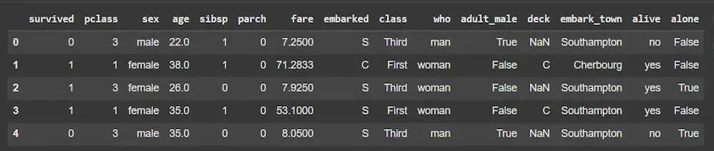
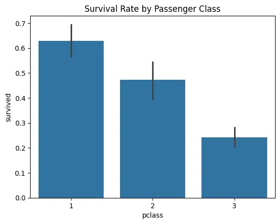
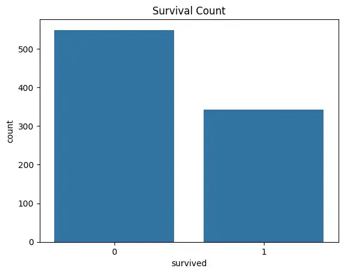
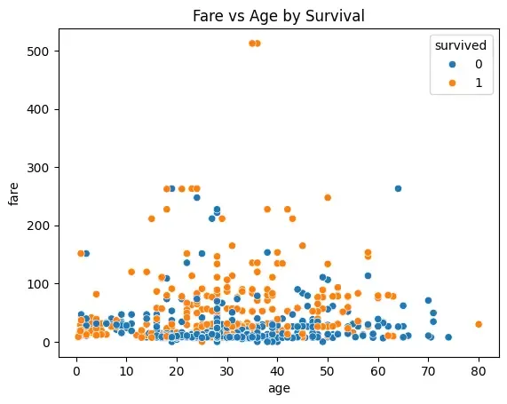

# Six Steps in the Data Analysis Process

**Last updated:** August 2, 2026

## Lesson Introduction

This lesson presents a six-step data analysis process, from defining the problem to interpreting results and supporting decision-making. The Titanic dataset is used throughout the lesson so that learners can observe how a complete analytical workflow is implemented in Python.

The lesson combines conceptual knowledge, code examples, data visualizations, quick-check questions, and practical exercises. Learners will not only understand the sequence of a data analysis process but also learn how to apply each step to a specific dataset.

## Learning Outcomes

After completing this lesson, learners will be able to:

- Explain the role of a structured data analysis process.
- Define the problem, objectives, and success criteria of an analytical task.
- Identify and select appropriate data sources.
- Examine the structure, origin, and initial quality of a dataset.
- Handle common issues such as missing values, unnecessary columns, and categorical variables.
- Use Python, Pandas, Seaborn, and Matplotlib to analyze and visualize data.
- Read and interpret correlation matrices, bar charts, histograms, and scatter plots.
- Understand basic data splitting, model training, and accuracy evaluation.
- Convert analytical results into observations, recommendations, and actionable decisions.
- Recognize that correlation does not imply causation and that a single evaluation metric is not sufficient to judge a model.

## Lesson Structure

The lesson covers the following topics:

1. Define the problem.
2. Collect data.
3. Clean data.
4. Analyze data.
5. Visualize results.
6. Interpret results and make decisions.
7. Summarize the complete process.
8. Review questions and practical exercises.

## Prerequisites

To complete the practical examples, learners should have:

- Basic Python knowledge.
- Access to Jupyter Notebook, JupyterLab, or Google Colab.
- The `pandas`, `seaborn`, `matplotlib`, and `scikit-learn` libraries.
- A basic understanding of DataFrames, numerical variables, categorical variables, and data visualizations.

The required libraries can be installed with:

```bash
pip install pandas seaborn matplotlib scikit-learn
```

---

Data analysis is the process of collecting, cleaning, organizing, and interpreting data to discover useful insights and support decision-making. It follows a structured approach in which:

- **Step-by-step process:** Raw data are transformed into meaningful insights.
- **Systematic approach:** The process helps improve the accuracy and reliability of the results.
- **Better decision-making:** Decisions are based on evidence rather than intuition alone.

<p align="center">
  
</p>

### Quick Check

**Question 1.** What is the main objective of a structured data analysis process?

A. Only to store data  
B. To transform raw data into meaningful information  
C. To completely remove the role of humans  
D. Only to create charts  

**Question 2. True or false?** A systematic data analysis process helps improve the accuracy and reliability of results.

---

# Steps in the Data Analysis Process

## 1. Define the Problem

Before beginning any analytical activity, the problem must be clearly defined. This step involves clarifying the question, objective, or analytical opportunity and ensuring that the analytical goal is aligned with stakeholder expectations.

A clearly defined problem keeps the entire analysis focused, relevant, and free from unnecessary data collection.

### Main Tasks

- Identify the core problem or analytical opportunity.
- Establish clear objectives and expected outcomes.
- Understand the context, stakeholder needs, and constraints.
- Define success criteria for evaluating the effectiveness of the analysis.

### Example

A company notices that sales have declined significantly over the last three months. Instead of asking a broad question such as “Why did sales decline?”, the analytical team can formulate more specific questions:

- Which products experienced the largest decline?
- Which region had the greatest decrease?
- Which customer groups were most affected?
- Is the decline related to pricing, inventory, or marketing activities?

### Quick Check

**Question 1.** Why should the problem be defined before data collection?

A. To reduce file size  
B. To keep the analysis focused and relevant  
C. To avoid using charts  
D. To remove all qualitative data  

**Question 2.** Which activity belongs to the problem-definition step?

A. Handling missing values  
B. Defining success criteria  
C. Training a model  
D. Drawing a heatmap  

**Question 3. Case.** A university wants to investigate why students drop out. Suggest two more specific analytical questions.

---

## 2. Collect Data

After defining the problem, the next step is to collect data from appropriate sources. Data may come from internal databases, APIs, surveys, web scraping, or public datasets such as those available on Kaggle.

Collecting the right data ensures that the analysis is based on complete, accurate, and relevant information.

### Main Tasks

- Ensure that the collected data are relevant, accurate, and sufficiently complete.
- Combine data from multiple sources when appropriate.
- Record the origin and structure of each dataset to improve transparency.
- Consider update frequency, file format, and data-refresh requirements.

### Example Using the Titanic Dataset

```python
import seaborn as sns
import pandas as pd

titanic = sns.load_dataset("titanic")
titanic.head()
```

### Illustrative Result

The Titanic dataset is built into Seaborn. The `head()` method displays the first few rows so that the analyst can quickly inspect the dataset structure.

<p align="center">
  
</p>

> **Note:** The Titanic dataset is used throughout this lesson to demonstrate data cleaning, analysis, visualization, and model building.

### Quick Check

**Question 1.** Which of the following can be used as a data source?

A. Internal databases  
B. APIs  
C. Surveys  
D. All of the above  

**Question 2.** Why should the origin of a dataset be documented?

A. To improve transparency and auditability  
B. To make the dataset larger  
C. To avoid data cleaning  
D. To replace data analysis  

**Question 3.** Which function is used to load the Titanic dataset in the example?

A. `pd.read_csv()`  
B. `sns.load_dataset()`  
C. `plt.load()`  
D. `np.loadtxt()`  

---

## 3. Clean the Data

Raw data are rarely ready for direct analysis. Data cleaning includes handling missing values, removing duplicate records, standardizing formats, and converting categorical variables into numerical form.

Well-prepared data improve the reliability and accuracy of analytical results.

### Main Tasks

- Fill in or remove missing values using an appropriate method.
- Standardize, transform, or rescale variables when necessary.
- Remove irrelevant, redundant, or inconsistent columns.
- Ensure that data types and formats are suitable for analysis or modeling.

### Check and Handle Missing Data

```python
print(titanic.isnull().sum())

titanic["age"].fillna(
    titanic["age"].median(),
    inplace=True
)

titanic["embarked"].fillna(
    titanic["embarked"].mode()[0],
    inplace=True
)
```

In this code:

- `isnull().sum()` counts missing values in each column.
- Missing values in `age` are replaced by the median.
- Missing values in `embarked` are replaced by the most frequent value.

### Remove Unused Columns

```python
titanic.drop(
    [
        "deck",
        "embark_town",
        "alive",
        "class",
        "who",
        "adult_male"
    ],
    axis=1,
    inplace=True
)
```

### Convert Categorical Variables

```python
titanic["sex"] = titanic["sex"].map({
    "male": 0,
    "female": 1
})

titanic["embarked"] = titanic["embarked"].map({
    "C": 0,
    "Q": 1,
    "S": 2
})

titanic.head()
```

<p align="center">
  
</p>

### Quick Check

**Question 1.** Which command counts the missing values in each column?

A. `titanic.head()`  
B. `titanic.isnull().sum()`  
C. `titanic.describe()`  
D. `titanic.drop()`  

**Question 2.** In the example, missing values in `age` are replaced by:

A. The minimum value  
B. The maximum value  
C. The median  
D. Zero  

**Question 3.** Why is the `sex` column converted into numerical values?

A. To reduce the number of rows  
B. To make the data more suitable for analytical algorithms or models  
C. To change the passengers’ gender  
D. To create a pie chart  

**Question 4. True or false?** Every column containing missing values can be removed without considering the context.

---

## 4. Analyze the Data

Data analysis is the core step in which the analyst searches for patterns, trends, and relationships in the data. Depending on the objective, this step may involve descriptive statistics, correlation analysis, or machine-learning models.

### Main Tasks

- Calculate measures such as the mean, median, mode, and variance.
- Identify correlations, trends, and unusual observations.
- Apply models such as regression, clustering, or classification.
- Compare the results with initial expectations or hypotheses.

### Analyze a Correlation Matrix

```python
import matplotlib.pyplot as plt

plt.figure(figsize=(8, 6))
sns.heatmap(
    titanic.corr(),
    annot=True,
    cmap="coolwarm"
)

plt.title("Correlation Matrix")
plt.show()
```

<p align="center">
  
</p>

A heatmap makes it easier to observe the degree of correlation among numerical variables.

### Analyze Survival Rate by Passenger Class

```python
sns.barplot(
    x="pclass",
    y="survived",
    data=titanic
)

plt.title("Survival Rate by Passenger Class")
plt.show()
```

<p align="center">
  
</p>

The bar chart compares the average survival rate across passenger classes.

### Quick Check

**Question 1.** What is a correlation matrix used for?

A. Checking file types  
B. Examining relationships among variables  
C. Removing duplicate records  
D. Loading data from an API  

**Question 2.** In the example, the `barplot` is used to compare:

A. Age and fare  
B. Passenger class and survival rate  
C. Gender and port of embarkation  
D. The number of columns and rows  

**Question 3.** Which of the following models may be used during data analysis?

A. Regression  
B. Clustering  
C. Classification  
D. All of the above  

**Question 4. Case.** If two variables are highly correlated, can we conclude with certainty that one causes the other?

---

## 5. Visualize the Results

Visualization makes complex data easier to understand. Charts, graphs, and dashboards can highlight important trends, patterns, and unusual observations.

A good visualization should not only be attractive but also clear, intuitive, and useful for decision-making.

### Main Principles

- Select an appropriate chart type, such as a histogram, scatter plot, bar chart, or heatmap.
- Clearly highlight trends, patterns, and unusual observations.
- Keep charts simple, understandable, and decision-oriented.
- Combine multiple charts in a dashboard when a broader view is needed.

### Count Passengers by Survival Status

```python
sns.countplot(
    x="survived",
    data=titanic
)

plt.title("Number of Passengers by Survival Status")
plt.show()
```

<p align="center">
  
</p>

### Age Distribution

```python
sns.histplot(
    titanic["age"],
    kde=True
)

plt.title("Age Distribution")
plt.show()
```

<p align="center">
  
</p>

### Scatter Plot of Age and Fare

```python
sns.scatterplot(
    x="age",
    y="fare",
    hue="survived",
    data=titanic
)

plt.title("Relationship Between Fare and Age by Survival Status")
plt.show()
```

<p align="center">
  
</p>

### Quick Check

**Question 1.** Which chart is suitable for displaying the distribution of `age`?

A. Histogram  
B. Network chart  
C. Gantt chart  
D. Geographic map  

**Question 2.** What is the purpose of `hue="survived"` in the scatter plot?

A. To remove the `survived` column  
B. To distinguish points by survival status  
C. To change the figure size  
D. To calculate the mean  

**Question 3. True or false?** A chart is always more effective when it contains more details.

**Question 4.** Why should the chart type be selected according to the analytical question?

---

## 6. Interpret Results and Make Decisions

The final step is to transform analytical results into actionable insights. Interpretation requires placing the results in the correct context, communicating them clearly, and making evidence-based decisions.

After a decision is implemented, its outcomes should continue to be monitored and adjusted when necessary.

### Main Tasks

- Explain the results in the context of the original problem.
- Provide actionable recommendations based on the findings.
- Communicate the results clearly to stakeholders.
- Monitor outcomes and repeat the process for continuous improvement.

### Example: Building a Survival Prediction Model

The code below demonstrates how to split the data into training and validation sets, build a `RandomForestClassifier`, and evaluate its accuracy.

```python
X = titanic.drop("survived", axis=1)
y = titanic["survived"]

X_train, X_val, y_train, y_val = train_test_split(
    X,
    y,
    test_size=0.2,
    random_state=42
)

model = RandomForestClassifier(
    n_estimators=100,
    random_state=42
)

model.fit(X_train, y_train)

y_pred = model.predict(X_val)

accuracy = accuracy_score(
    y_val,
    y_pred
)

print(f"Model accuracy: {accuracy:.4f}")
```

### Result

```text
Model accuracy: 0.8101
```

> **Note:** The source code uses `train_test_split`, `RandomForestClassifier`, and `accuracy_score`. These objects must be imported from the appropriate Scikit-learn modules before running the code.

### Interpreting the Result

An accuracy of `0.8101` means that the model correctly predicts approximately 81.01% of the observations in the validation set. However, accuracy alone should not be used to evaluate a model. In practical applications, additional metrics and the context of the original problem should also be considered.

### Quick Check

**Question 1.** What is the objective of the interpretation step?

A. Only to present numbers  
B. To transform analytical results into insights and actions  
C. To delete all data  
D. To change the original problem  

**Question 2.** An accuracy value of `0.8101` is approximately:

A. 8.101%  
B. 18.01%  
C. 81.01%  
D. 810.1%  

**Question 3.** Why should results be monitored after a decision is implemented?

A. To determine whether the decision is effective and make adjustments when needed  
B. To increase the number of columns  
C. To avoid communicating with stakeholders  
D. To ensure that no further analysis is needed  

**Question 4. True or false?** Accuracy alone is always sufficient to fully evaluate a classification model.

---

# Process Summary

| Step | Main content | Central question |
|---|---|---|
| **1. Define the problem** | Clarify the objective, context, and success criteria | What problem must be solved? |
| **2. Collect data** | Obtain relevant data from trustworthy sources | What data are needed and where can they be obtained? |
| **3. Clean the data** | Handle missing values, redundant data, and formatting issues | Are the data ready for analysis? |
| **4. Analyze the data** | Identify patterns, trends, and relationships | What do the data show? |
| **5. Visualize the results** | Present results using charts and dashboards | How can the results be made easier to understand? |
| **6. Interpret and decide** | Convert findings into recommendations and actions | What do the results mean and what should be done next? |

---

# End-of-Lesson Review

## Part A. Multiple-Choice Questions

**Question 1.** What is the first step in the data analysis process?

A. Clean the data  
B. Define the problem  
C. Visualize the data  
D. Train a model  

**Question 2.** Which activity belongs to the data-collection step?

A. Identify data sources  
B. Handle missing values  
C. Calculate a correlation matrix  
D. Evaluate model accuracy  

**Question 3.** The median is commonly used to:

A. Rename a column  
B. Fill missing values in a numerical variable  
C. Create an API  
D. Draw a scatter plot  

**Question 4.** Which function is used to visualize a correlation matrix in the example?

A. `sns.heatmap()`  
B. `sns.load_dataset()`  
C. `pd.DataFrame()`  
D. `model.fit()`  

**Question 5.** Which chart is used to show the age distribution?

A. Histogram  
B. Pie chart  
C. Gantt chart  
D. Geographic heatmap  

**Question 6.** What does `test_size=0.2` mean?

A. Twenty percent of the data are used as the validation set  
B. Twenty percent of the data are deleted  
C. There are twenty input variables  
D. The model has 20% accuracy  

**Question 7.** An accuracy of `0.8101` is equal to:

A. 0.8101%  
B. 8.101%  
C. 81.01%  
D. 810.1%  

**Question 8.** Which step converts analytical results into recommendations?

A. Data collection  
B. Data cleaning  
C. Interpretation and decision-making  
D. Visualization only  

## Part B. True/False Questions

**Question 1.** The analytical objective should be defined before data collection.

**Question 2.** Raw data can always be used directly to build a model.

**Question 3.** A correlation matrix can help identify relationships among variables.

**Question 4.** A high correlation always proves causation.

**Question 5.** Data visualization can support the communication of results to stakeholders.

**Question 6.** After a decision has been made, there is no need to monitor the outcome.

## Part C. Short-Answer Questions

**Question 1.** Present the six main steps of the data analysis process.

**Question 2.** Why is defining the problem considered the first important step?

**Question 3.** State three common problems found in raw data.

**Question 4.** Distinguish between data analysis and data visualization.

**Question 5.** Why must model results be interpreted in a real-world context?

## Part D. Practical Exercises

### Exercise 1. Explore the Dataset

Using the Titanic dataset:

1. Display the first five rows.
2. Determine the number of rows and columns.
3. Check the data type of each column.
4. Count the missing values in each column.
5. Write a short comment on data quality.

### Exercise 2. Clean the Data

Complete the following tasks:

1. Fill missing values in `age` using the median.
2. Fill missing values in `embarked` using the mode.
3. Remove unnecessary columns.
4. Convert `sex` into numerical values.
5. Recheck the data after cleaning.

### Exercise 3. Analyze and Visualize

Complete the following tasks:

1. Calculate descriptive statistics for numerical columns.
2. Draw an age-distribution chart.
3. Compare survival rates across passenger classes.
4. Draw a scatter plot of age and fare.
5. Write at least three observations based on the charts.

### Exercise 4. Interpret the Result

Assume that a survival-prediction model achieves an accuracy of 81.01%.

1. Explain what the result means.
2. State two reasons why accuracy alone should not be used.
3. Suggest two additional evaluation metrics.
4. State one ethical or practical limitation of using the model.

---

# Answers and Suggested Responses

<details>
<summary><strong>Click to show answers</strong></summary>

## Quick Check — Introduction

### Question 1

B. To transform raw data into meaningful information.

### Question 2

True.

## Quick Check — Step 1

### Question 1

B. To keep the analysis focused and relevant.

### Question 2

B. Defining success criteria.

### Question 3

Examples:

- Which student groups have the highest dropout rate?
- Are academic performance, financial circumstances, or level of engagement associated with dropout risk?

## Quick Check — Step 2

### Question 1

D. All of the above.

### Question 2

A. To improve transparency and auditability.

### Question 3

B. `sns.load_dataset()`.

## Quick Check — Step 3

### Question 1

B. `titanic.isnull().sum()`.

### Question 2

C. The median.

### Question 3

B. To make the data more suitable for analytical algorithms or models.

### Question 4

False. The meaning of the column, the proportion of missing values, and the analytical objective should be considered before removing it.

## Quick Check — Step 4

### Question 1

B. Examining relationships among variables.

### Question 2

B. Passenger class and survival rate.

### Question 3

D. All of the above.

### Question 4

No. Correlation does not imply causation.

## Quick Check — Step 5

### Question 1

A. Histogram.

### Question 2

B. To distinguish data points by survival status.

### Question 3

False. A chart with too much detail may become difficult to understand.

### Question 4

Each chart type is suitable for a particular data type and communication objective.

## Quick Check — Step 6

### Question 1

B. To transform analytical results into insights and actions.

### Question 2

C. 81.01%.

### Question 3

A. To determine whether the decision is effective and make adjustments when needed.

### Question 4

False. Additional metrics and the context of the problem should also be considered.

## Part A. Multiple-Choice Answers

1. B  
2. A  
3. B  
4. A  
5. A  
6. A  
7. C  
8. C  

## Part B. True/False Answers

1. True.  
2. False.  
3. True.  
4. False.  
5. True.  
6. False.  

## Part C. Suggested Responses

### Question 1

The six steps are:

1. Define the problem.
2. Collect data.
3. Clean the data.
4. Analyze the data.
5. Visualize the results.
6. Interpret the results and make decisions.

### Question 2

This step determines the objective, scope, required data, and criteria for evaluating success.

### Question 3

Examples include missing values, duplicate records, inconsistent formatting, outliers, and inappropriate data types.

### Question 4

Data analysis focuses on discovering patterns and drawing conclusions. Data visualization focuses on presenting data or analytical results in a visual and understandable form.

### Question 5

The same statistical result may have different meanings in different contexts. Interpretation must therefore be connected to the objective, stakeholders, and real-world constraints.

## Part D

These are open practical exercises. Results depend on implementation choices, data versions, and cleaning decisions. The submission should clearly present code, output, and interpretation.

</details>
