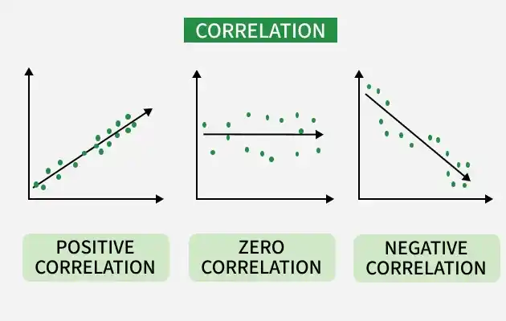
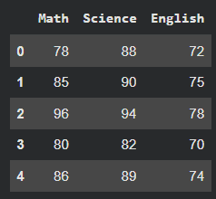
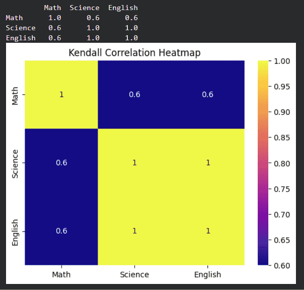
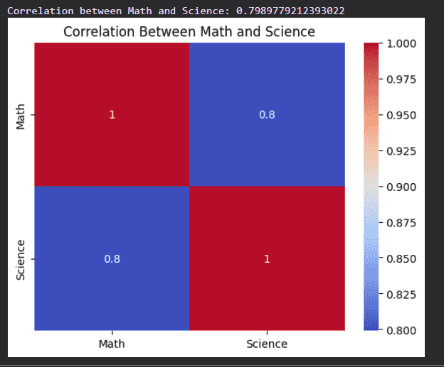

# Exploring Correlation in Python

**Last updated:** August 2, 2026

## Lesson Introduction

This lesson introduces how to **explore correlation in Python** in order to evaluate the strength and direction of relationships between variables. It focuses on three widely used correlation coefficients—Pearson, Spearman, and Kendall—together with their implementation in Pandas, visualization with heatmaps, interpretation, limitations, and practical applications.

The lesson combines basic statistical concepts with Python examples so that learners can calculate, compare, and visualize correlation coefficients using a small dataset. Quick-check questions, practical exercises, and a collapsible answer section support self-assessment and review.

## Learning Outcomes

After completing this lesson, learners will be able to:

- Explain positive correlation, negative correlation, and the absence of clear linear correlation.
- Interpret the range from `-1` to `1` for a correlation coefficient.
- Distinguish among Pearson, Spearman, and Kendall correlation.
- Recognize when each method is appropriate.
- Calculate a correlation matrix with `DataFrame.corr()`.
- Calculate correlation between two columns with `Series.corr()`.
- Visualize a correlation matrix with `sns.heatmap()`.
- Interpret correlation values in context.
- Perform an initial check for multicollinearity.
- Recognize the effects of outliers and nonlinear relationships on Pearson correlation.
- Explain why correlation does not imply causation.
- Apply correlation analysis in feature selection, finance, healthcare, and recommender systems.

## Lesson Structure

The lesson covers:

1. The concept and meaning of correlation.
2. Positive, negative, and no clear linear correlation.
3. Pearson correlation.
4. Spearman correlation.
5. Kendall correlation.
6. Comparison of the three methods.
7. Calculating correlation in Python.
8. Visualization with heatmaps.
9. Interpreting correlation values.
10. Detecting multicollinearity.
11. Limitations and applications.
12. Review questions and practical exercises.

## Prerequisites

Learners should have:

- Basic Python knowledge.
- An introductory understanding of DataFrames and numerical variables.
- Basic knowledge of means, variance, and scatter plots.
- Access to Jupyter Notebook, JupyterLab, or Google Colab.
- The `pandas`, `matplotlib`, `seaborn`, `scipy`, and `statsmodels` libraries.

Install the required libraries with:

```bash
pip install pandas matplotlib seaborn scipy statsmodels
```

---

Correlation is one of the most widely used statistical measures for studying relationships between variables. In Python, correlation analysis helps determine whether two variables:

- Increase or decrease together.
- Move in opposite directions.
- Show no clear relationship.

Correlation analysis can support:

- Understanding relationships between variables.
- Feature selection in machine learning.
- Detection of multicollinearity.
- Data-driven decision-making.

<p align="center">
  
</p>

### Quick Check

**Question 1.** What does correlation measure?

A. The number of rows in a dataset  
B. The strength and direction of a relationship between two variables  
C. The size of a data file  
D. The number of missing values  

**Question 2. True or false?** Correlation can support feature selection in machine learning.

---

# What Is Correlation?

Correlation measures the **strength** and **direction** of the relationship between two numerical variables.

A correlation coefficient usually lies in the interval:

\[
-1 \leq r \leq 1
\]

where:

- **\(r=1\):** Perfect positive relationship.
- **\(r=-1\):** Perfect negative relationship.
- **\(r=0\):** No clear linear correlation.

## Positive Correlation

Positive correlation occurs when two variables tend to move in the same direction.

Examples:

- Height and weight.
- Study time and test scores.
- Advertising expenditure and sales in some contexts.

When one variable increases, the other tends to increase. When one decreases, the other tends to decrease.

## Negative Correlation

Negative correlation occurs when two variables tend to move in opposite directions.

Examples:

- Price and demand.
- Speed and travel time over a fixed distance.
- Fuel efficiency and fuel consumption.

When one variable increases, the other tends to decrease.

## No Clear Correlation

A correlation value near zero indicates no clear linear relationship.

Examples:

- Shoe size and examination score.
- Number of letters in a name and income.
- Favorite color and height.

> **Note:** A correlation coefficient of zero does not prove that two variables are completely unrelated. They may still have a nonlinear relationship.

### Quick Check

**Question 1.** A correlation of `+1` represents:

A. A perfect positive relationship  
B. A perfect negative relationship  
C. No correlation  
D. Missing data  

**Question 2.** Which is an example of negative correlation?

A. Height and weight  
B. Price and demand  
C. Study hours and test score  
D. Temperature and ice-cream sales  

**Question 3. True or false?** A correlation coefficient of zero proves that two variables have no relationship of any kind.

---

# Common Correlation Methods in Python

Python supports several methods for calculating correlation. Three common methods are:

1. Pearson correlation.
2. Spearman correlation.
3. Kendall correlation.

---

## 1. Pearson Correlation

Pearson correlation measures the **linear relationship** between two continuous variables.

### Characteristics

- The value lies between `-1` and `+1`.
- It is commonly used with continuous numerical data.
- It is suitable when the relationship is approximately linear.
- It is often associated with assumptions of approximately normal data.
- It is sensitive to outliers.

### Formula

The Pearson correlation coefficient is:

$$
r =
\frac{
\sum_{i=1}^{n}(x_i-\bar{x})(y_i-\bar{y})
}{
\sqrt{\sum_{i=1}^{n}(x_i-\bar{x})^2}
\sqrt{\sum_{i=1}^{n}(y_i-\bar{y})^2}
}
$$

where:

- \(x_i\) and \(y_i\) are observations.
- \(\bar{x}\) and \(\bar{y}\) are sample means.
- \(n\) is the number of observations.

### When Should Pearson Be Used?

Pearson may be appropriate when:

- Both variables are numerical.
- The relationship of interest is linear.
- There are no severe outliers.
- The distributional conditions are suitable for the intended analysis.

### Quick Check

**Question 1.** Pearson correlation primarily measures what type of relationship?

A. Linear  
B. Categorical only  
C. Geographic  
D. Textual  

**Question 2.** Pearson is most suitable for:

A. Two continuous numerical variables  
B. Two text passages  
C. Two unordered nominal variables  
D. Two image files  

**Question 3. True or false?** Pearson correlation may be strongly affected by outliers.

---

## 2. Spearman Correlation

Spearman correlation measures a **monotonic relationship** by converting values into ranks before calculating correlation.

### Characteristics

- The relationship does not need to be linear.
- It is suitable for monotonic relationships.
- It can be used with ordinal data.
- It is useful when data are not normally distributed.
- It is often less sensitive to outliers than Pearson correlation.

### Monotonic Relationship

A relationship is monotonic when:

- As one variable increases, the other consistently tends to increase; or
- As one variable increases, the other consistently tends to decrease.

The rate of change does not have to be constant, and the relationship does not have to follow a straight line.

### When Should Spearman Be Used?

Spearman may be appropriate when:

- The data are ordinal.
- The relationship is monotonic but nonlinear.
- The data do not satisfy normality assumptions well.
- Outliers substantially affect Pearson correlation.

### Quick Check

**Question 1.** Spearman correlation is calculated from:

A. Data ranks  
B. Column names  
C. Number of files  
D. Chart colors  

**Question 2.** Spearman is suitable for:

A. Monotonic relationships  
B. Only perfect linear relationships  
C. Only text data  
D. Only binary variables  

**Question 3. True or false?** Spearman correlation can be used with ordinal data.

---

## 3. Kendall Correlation

Kendall correlation measures the consistency or agreement between ranked pairs of observations.

### Characteristics

- It is rank-based.
- It measures agreement between pairs.
- It is often suitable for small datasets.
- It can be robust for ordinal data or data with ties.
- It may be slower on large datasets.

### When Should Kendall Be Used?

Kendall may be considered when:

- The dataset is relatively small.
- The data are ordinal.
- Rank consistency is of interest.
- A method with weaker distributional assumptions is preferred.

### Quick Check

**Question 1.** Kendall correlation focuses on:

A. Agreement between rankings  
B. The number of rows  
C. The mean  
D. File size  

**Question 2.** Kendall is often suitable for:

A. Small datasets  
B. Image data only  
C. Audio data only  
D. Data with no order  

**Question 3.** What do Spearman and Kendall have in common?

A. Both are rank-based  
B. Both apply only to text data  
C. Both only measure means  
D. Both always produce the same result as Pearson  

---

# Comparing Pearson, Spearman, and Kendall

| Method | Relationship type | Suitable data | Key feature |
|---|---|---|---|
| **Pearson** | Linear | Continuous numerical variables | Popular and easy to interpret, but sensitive to outliers |
| **Spearman** | Monotonic | Numerical or ordinal data | Rank-based and suitable for monotonic nonlinear relationships |
| **Kendall** | Rank agreement | Ordinal data and small datasets | Robust and interpretable through concordant and discordant pairs |

### Quick Check

**Question 1.** Which method is most appropriate for a linear relationship between two continuous variables?

A. Pearson  
B. Spearman  
C. Kendall  
D. None of the above  

**Question 2.** Which method is appropriate for a monotonic but nonlinear relationship?

A. Pearson  
B. Spearman  
C. Mean only  
D. Variance only  

**Question 3.** Which method is often suitable for a small ordinal dataset?

A. Kendall  
B. Pearson  
C. Histogram  
D. Min-max scaling  

---

# Calculating Correlation in Python

Python provides correlation functions in Pandas and visualization tools in Seaborn and Matplotlib.

---

## 1. Create a Sample Dataset

The example dataset contains scores in three subjects:

- Mathematics.
- Science.
- English.

```python
import pandas as pd
import seaborn as sns
import matplotlib.pyplot as plt

data = {
    "Math": [78, 85, 96, 80, 86],
    "Science": [88, 90, 94, 82, 89],
    "English": [72, 75, 78, 70, 74]
}

df = pd.DataFrame(data)

df
```

### Illustrative Result

<p align="center">
  
</p>

The dataset contains three numerical columns and five observations. Its small size makes it suitable for demonstrating correlation syntax.

### Quick Check

**Question 1.** Which object is used to create the table?

A. `pd.DataFrame()`  
B. `plt.figure()`  
C. `sns.heatmap()`  
D. `df.drop()`  

**Question 2.** How many variables are in the sample dataset?

A. 2  
B. 3  
C. 5  
D. 15  

**Question 3.** Why is this dataset suitable for demonstration?

---

## 2. Calculate Pearson Correlation

Pandas provides the `corr()` method to calculate correlations between numerical columns.

```python
pearson_corr = df.corr(
    method="pearson"
)

print(pearson_corr)
```

### Visualize with a Heatmap

```python
sns.heatmap(
    pearson_corr,
    annot=True,
    cmap="coolwarm"
)

plt.title(
    "Pearson Correlation Matrix"
)

plt.show()
```

<p align="center">
  
</p>

### Explanation

- `df.corr(method="pearson")` calculates pairwise Pearson correlations.
- `annot=True` displays the correlation values in the cells.
- `cmap="coolwarm"` defines the color map.
- The main diagonal is always equal to 1 because each variable is perfectly correlated with itself.

### Quick Check

**Question 1.** Which method calculates a correlation matrix?

A. `df.corr()`  
B. `df.head()`  
C. `df.drop()`  
D. `df.merge()`  

**Question 2.** Values on the main diagonal are usually:

A. 0  
B. 1  
C. -1  
D. Undefined  

**Question 3.** What does `annot=True` do?

A. Displays values in the heatmap cells  
B. Removes missing values  
C. Converts data to strings  
D. Changes the number of rows  

---

## 3. Calculate Spearman Correlation

Spearman converts values into ranks before calculating correlation.

```python
spearman_corr = df.corr(
    method="spearman"
)

print(spearman_corr)
```

### Visualization

```python
sns.heatmap(
    spearman_corr,
    annot=True,
    cmap="viridis"
)

plt.title(
    "Spearman Correlation Matrix"
)

plt.show()
```

<p align="center">
  
</p>

### Explanation

Spearman is appropriate when:

- Relationships are monotonic.
- Data are not normally distributed.
- Data are ordinal.
- Outliers substantially affect Pearson correlation.

### Quick Check

**Question 1.** To calculate Spearman correlation in Pandas, `method` is set to:

A. `"spearman"`  
B. `"linear"`  
C. `"ranked"`  
D. `"ordinal"`  

**Question 2.** What does Spearman use before calculating correlation?

A. Ranks  
B. Arithmetic means  
C. Variable names  
D. Row counts  

---

## 4. Calculate Kendall Correlation

Kendall measures agreement between ranked observations.

```python
kendall_corr = df.corr(
    method="kendall"
)

print(kendall_corr)
```

### Visualization

```python
sns.heatmap(
    kendall_corr,
    annot=True,
    cmap="plasma"
)

plt.title(
    "Kendall Correlation Matrix"
)

plt.show()
```

<p align="center">
  
</p>

### Explanation

Kendall is useful when:

- The dataset is small.
- The data are ordinal.
- Rank agreement is important.
- Dependence on distributional assumptions should be reduced.

### Quick Check

**Question 1.** Which value is used for `method` when calculating Kendall correlation?

A. `"kendall"`  
B. `"small"`  
C. `"pair"`  
D. `"ordinal"`  

**Question 2. True or false?** Kendall can be used to assess agreement between rankings.

---

## 5. Calculate Correlation Between Two Columns

Correlation between two specific columns can be calculated with `Series.corr()`.

```python
corr_value = df["Math"].corr(
    df["Science"]
)

print(
    "Correlation between Math and Science:",
    corr_value
)
```

### Create a Two-Column Matrix

```python
two_col_corr = df[
    ["Math", "Science"]
].corr()

sns.heatmap(
    two_col_corr,
    annot=True,
    cmap="coolwarm"
)

plt.title(
    "Correlation Between Math and Science"
)

plt.show()
```

<p align="center">
  
</p>

### Explanation

- `df["Math"].corr(df["Science"])` returns a single correlation value.
- `df[["Math", "Science"]].corr()` returns a `2 × 2` correlation matrix.
- A heatmap visually communicates the strength and direction of the relationship.

### Quick Check

**Question 1.** Which command directly returns the correlation between two columns?

A. `df["Math"].corr(df["Science"])`  
B. `df["Math"].head(df["Science"])`  
C. `df.merge("Math", "Science")`  
D. `df.plot("Math", "Science")`  

**Question 2.** A correlation matrix for two variables has size:

A. `1 × 1`  
B. `2 × 2`  
C. `2 × 3`  
D. `3 × 3`  

---

# Interpreting Correlation Values

The following table provides a general interpretation.

| Correlation value | Suggested interpretation |
|---|---|
| **0.8 to 1.0** | Strong positive correlation |
| **0.5 to below 0.8** | Moderate positive correlation |
| **Above 0 to below 0.5** | Weak positive correlation |
| **0** | No linear correlation |
| **Above -0.5 to below 0** | Weak negative correlation |
| **Above -0.8 to -0.5** | Moderate negative correlation |
| **-1.0 to -0.8** | Strong negative correlation |

> **Note:** These thresholds are only guidelines. Interpretation depends on the field, sample size, data quality, and analytical objective.

## Interpretation Examples

- `0.92`: Strong positive correlation.
- `0.63`: Moderate positive correlation.
- `0.18`: Weak positive correlation.
- `-0.74`: Moderate negative correlation.
- `-0.91`: Strong negative correlation.
- `0.02`: Almost no linear correlation.

### Quick Check

**Question 1.** A value of `0.87` is usually interpreted as:

A. Strong positive correlation  
B. Strong negative correlation  
C. No correlation  
D. Weak negative correlation  

**Question 2.** A value of `-0.65` is usually interpreted as:

A. Moderate negative correlation  
B. Moderate positive correlation  
C. Strong positive correlation  
D. No correlation  

**Question 3.** Why should interpretation thresholds not be applied rigidly?

---

# Visualizing Correlation

A heatmap is commonly used to display a correlation matrix.

## Heatmap Example

```python
corr_matrix = df.corr(
    method="pearson"
)

sns.heatmap(
    corr_matrix,
    annot=True,
    cmap="coolwarm",
    vmin=-1,
    vmax=1
)

plt.title(
    "Correlation Heatmap"
)

plt.show()
```

### Useful Parameters

- `annot=True`: Displays values inside the cells.
- `cmap`: Selects the color map.
- `vmin=-1`: Sets the minimum color-scale value.
- `vmax=1`: Sets the maximum color-scale value.
- `fmt=".2f"`: Displays two decimal places.
- `square=True`: Displays square cells.

### More Complete Example

```python
sns.heatmap(
    corr_matrix,
    annot=True,
    fmt=".2f",
    cmap="coolwarm",
    vmin=-1,
    vmax=1,
    square=True
)

plt.title(
    "Correlation Matrix"
)

plt.show()
```

### Quick Check

**Question 1.** Why should `vmin=-1` and `vmax=1` be used?

A. To represent the full range of correlation values on the color scale  
B. To delete negative data  
C. To retain only strong values  
D. To rename columns  

**Question 2.** What does `fmt=".2f"` do?

A. Displays two decimal places  
B. Displays integers only  
C. Removes negative values  
D. Changes the data size  

---

# Detecting Multicollinearity

Multicollinearity occurs when two or more input variables are strongly correlated.

## Possible Effects

- It becomes difficult to isolate the effect of each variable.
- Regression coefficients may become unstable.
- Model interpretation may become unreliable.
- Some variables may provide redundant information.

## Initial Check

A correlation matrix can be used to identify variable pairs with high absolute correlation.

```python
corr_matrix = df.corr(
    numeric_only=True
)

high_corr = (
    corr_matrix.abs() > 0.8
)

print(high_corr)
```

> A correlation matrix is only an initial screening tool. A fuller multicollinearity assessment may require additional measures such as the Variance Inflation Factor.

### Quick Check

**Question 1.** Multicollinearity occurs when:

A. Input variables are strongly correlated with one another  
B. The dataset contains no numerical columns  
C. The data contain no missing values  
D. All variables are completely independent  

**Question 2.** One possible effect of multicollinearity is:

A. Model coefficients may become unstable  
B. Data automatically become more accurate  
C. Feature selection becomes unnecessary  
D. Every model achieves 100% accuracy  

---

# Limitations of Correlation Analysis

## 1. Correlation Measures Association Only

Correlation indicates that two variables are related, but it does not prove causation.

For example, ice-cream sales and the number of fires may both increase during summer. This does not mean that selling ice cream causes fires. High temperature may influence both variables.

## 2. Sensitivity to Outliers

A few unusual observations may substantially change the Pearson coefficient.

## 3. Pearson Measures Only Linear Relationships

Two variables may have a strong nonlinear relationship while Pearson correlation remains near zero.

## 4. Dependence on the Data

Correlation may change when:

- Sample size changes.
- The range of values is restricted.
- The data contain errors.
- The data are unrepresentative.
- Important variables are omitted.

## 5. Statistical Strength Does Not Guarantee Practical Importance

A numerically strong correlation may not be practically important. Domain knowledge and analytical objectives must also be considered.

### Quick Check

**Question 1.** Why does correlation not prove causation?

A. A third variable or a coincidental association may exist  
B. Correlation can never be calculated  
C. All variables are independent  
D. The coefficient is always zero  

**Question 2.** Which type of relationship can Pearson fail to detect?

A. A nonlinear relationship  
B. A linear relationship  
C. A perfect relationship  
D. A positive relationship  

**Question 3. True or false?** A strong correlation always has major practical significance.

---

# Applications of Correlation

## Feature Selection in Machine Learning

Correlation can help:

- Identify variables associated with a target.
- Detect redundant input variables.
- Reduce multicollinearity.
- Simplify a model.

## Financial Market Analysis

Correlation is used to:

- Compare movements across assets.
- Support portfolio diversification.
- Evaluate relationships between indices and stocks.
- Analyze economic factors.

## Healthcare Research

Correlation can support the study of relationships between:

- Age and disease risk.
- Drug dosage and response.
- Lifestyle and health indicators.
- Symptoms and treatment outcomes.

## Recommender Systems

Correlation can be used to:

- Compare user behavior.
- Identify products rated similarly.
- Find groups of users with similar preferences.
- Support product or content recommendations.

### Quick Check

**Question 1.** In machine learning, correlation can support:

A. Feature selection  
B. Multicollinearity detection  
C. Identification of redundant variables  
D. All of the above  

**Question 2.** In finance, correlation can be used to:

A. Compare movements across assets  
B. Support portfolio diversification  
C. Analyze relationships across markets  
D. All of the above  

**Question 3. Case.** A recommender system wants to identify users with similar preferences. How can correlation help?

---

# Content Summary

| Topic | Main meaning |
|---|---|
| **Correlation** | Measures the strength and direction of a relationship between two variables |
| **Pearson** | Measures linear relationships between numerical variables |
| **Spearman** | Measures monotonic relationships using ranks |
| **Kendall** | Measures agreement between rankings |
| **Heatmap** | Visualizes a correlation matrix |
| **Multicollinearity** | Input variables are strongly correlated with one another |
| **Limitations** | Correlation does not prove causation and may be affected by outliers |
| **Applications** | Machine learning, finance, healthcare, and recommender systems |

---

# End-of-Lesson Review

## Part A. Multiple-Choice Questions

**Question 1.** A correlation coefficient usually lies between:

A. 0 and 100  
B. -1 and 1  
C. -10 and 10  
D. 1 and infinity  

**Question 2.** A value of `-1` represents:

A. Perfect negative correlation  
B. Perfect positive correlation  
C. No correlation  
D. Missing data  

**Question 3.** Pearson measures:

A. A linear relationship  
B. A text relationship  
C. A geographic relationship  
D. The number of rows  

**Question 4.** Spearman is based on:

A. Ranks  
B. Variable names  
C. Number of columns  
D. Chart colors  

**Question 5.** Kendall is often suitable for:

A. Small datasets and ordinal data  
B. Image data only  
C. Unordered data only  
D. Very large data only  

**Question 6.** Which Pandas method calculates a correlation matrix?

A. `df.corr()`  
B. `df.head()`  
C. `df.info()`  
D. `df.drop()`  

**Question 7.** A value of `0.85` is usually interpreted as:

A. Strong positive correlation  
B. Strong negative correlation  
C. No correlation  
D. Weak negative correlation  

**Question 8.** A heatmap is used to:

A. Visualize a correlation matrix  
B. Remove missing values  
C. Load data  
D. Convert data types  

**Question 9.** Multicollinearity occurs when:

A. Input variables are strongly correlated  
B. All variables are independent  
C. There are no numerical variables  
D. The dataset has only one row  

**Question 10.** Which statement is correct?

A. Correlation proves causation  
B. Correlation measures association only  
C. Pearson is not affected by outliers  
D. A coefficient of zero proves no relationship of any kind  

## Part B. True/False Questions

**Question 1.** Pearson is suitable for linear relationships.

**Question 2.** Spearman uses data ranks.

**Question 3.** Kendall cannot be used with ordinal data.

**Question 4.** The main diagonal of a correlation matrix is equal to 1.

**Question 5.** Strong correlation proves causation.

**Question 6.** Outliers can affect Pearson correlation.

**Question 7.** Two variables may have a nonlinear relationship even when Pearson correlation is near zero.

**Question 8.** A correlation matrix can support multicollinearity detection.

## Part C. Short-Answer Questions

**Question 1.** Explain the meaning of `-1`, `0`, and `1`.

**Question 2.** Distinguish among Pearson, Spearman, and Kendall correlation.

**Question 3.** Why does correlation not imply causation?

**Question 4.** State two limitations of Pearson correlation.

**Question 5.** Explain the role of a heatmap in correlation analysis.

**Question 6.** What is multicollinearity, and how can it affect a model?

## Part D. Practical Exercises

### Exercise 1. Create Data and Calculate Pearson Correlation

Create a DataFrame with:

- Study hours.
- Test scores.
- Leisure hours.

Then:

1. Calculate the Pearson matrix.
2. Draw a heatmap.
3. Identify the pair with the strongest correlation.
4. Write an interpretation.

### Exercise 2. Compare the Three Methods

Using the same dataset:

1. Calculate Pearson correlation.
2. Calculate Spearman correlation.
3. Calculate Kendall correlation.
4. Compare the results.
5. Explain why the results may differ.

### Exercise 3. Correlation Between Two Columns

Using the score dataset:

1. Calculate correlation between `Math` and `Science`.
2. Create a `2 × 2` matrix.
3. Draw a heatmap.
4. Interpret the result.

### Exercise 4. Examine the Effect of an Outlier

1. Create two positively correlated variables.
2. Calculate Pearson correlation.
3. Add an outlier.
4. Recalculate Pearson correlation.
5. Compare and explain the change.

### Exercise 5. Nonlinear Correlation

1. Generate data following \(y=x^2\).
2. Calculate Pearson correlation.
3. Draw a scatter plot.
4. Explain why Pearson may not fully represent the relationship.

---

# References and Useful Links

The following references cover Pearson, Spearman, and Kendall methods, correlation functions in Pandas, heatmap visualization in Seaborn, and multicollinearity assessment with VIF.

1. [Exploring Correlation in Python — GeeksforGeeks](https://www.geeksforgeeks.org/data-analysis/exploring-correlation-in-python/)  
   Introductory reference on correlation and correlation calculations in Python.

2. [pandas.DataFrame.corr — Pandas Documentation](https://pandas.pydata.org/docs/reference/api/pandas.DataFrame.corr.html)  
   Official documentation for `DataFrame.corr()`, including `pearson`, `spearman`, and `kendall`.

3. [pandas.Series.corr — Pandas Documentation](https://pandas.pydata.org/docs/reference/api/pandas.Series.corr.html)  
   Official documentation for calculating correlation between two Series.

4. [seaborn.heatmap — Seaborn Documentation](https://seaborn.pydata.org/generated/seaborn.heatmap.html)  
   Official documentation for `sns.heatmap()` and parameters such as `annot`, `fmt`, `cmap`, `vmin`, `vmax`, and `square`.

5. [SciPy `pearsonr` — SciPy Documentation](https://docs.scipy.org/doc/scipy/reference/generated/scipy.stats.pearsonr.html)  
   Documentation for Pearson correlation and its hypothesis test.

6. [SciPy `spearmanr` — SciPy Documentation](https://docs.scipy.org/doc/scipy/reference/generated/scipy.stats.spearmanr.html)  
   Documentation for Spearman rank correlation.

7. [SciPy `kendalltau` — SciPy Documentation](https://docs.scipy.org/doc/scipy/reference/generated/scipy.stats.kendalltau.html)  
   Documentation for Kendall rank correlation.

8. [Matplotlib `pyplot` — Matplotlib Documentation](https://matplotlib.org/stable/api/pyplot_summary.html)  
   Overview of visualization functions such as `plt.title()` and `plt.show()`.

9. [Variance Inflation Factor — Statsmodels Documentation](https://www.statsmodels.org/stable/generated/statsmodels.stats.outliers_influence.variance_inflation_factor.html)  
   Documentation for the Variance Inflation Factor, commonly used to assess multicollinearity.

> **Note:** Prefer official documentation because syntax and parameter behavior may change between versions.

---

# Answers and Suggested Responses

<details>
<summary><strong>Click to show answers</strong></summary>

## Quick Check — Introduction

### Question 1

B. The strength and direction of a relationship between two variables.

### Question 2

True.

## Quick Check — What Is Correlation?

### Question 1

A. A perfect positive relationship.

### Question 2

B. Price and demand.

### Question 3

False. A coefficient of zero indicates no clear linear correlation only.

## Quick Check — Pearson

### Question 1

A. Linear.

### Question 2

A. Two continuous numerical variables.

### Question 3

True.

## Quick Check — Spearman

### Question 1

A. Data ranks.

### Question 2

A. A monotonic relationship.

### Question 3

True.

## Quick Check — Kendall

### Question 1

A. Agreement between rankings.

### Question 2

A. Small datasets.

### Question 3

A. Both are rank-based.

## Quick Check — Method Comparison

### Question 1

A. Pearson.

### Question 2

B. Spearman.

### Question 3

A. Kendall.

## Quick Check — Sample Dataset

### Question 1

A. `pd.DataFrame()`.

### Question 2

B. 3.

### Question 3

The dataset is small, contains only numerical columns, and allows results to be checked directly.

## Quick Check — Pearson in Python

### Question 1

A. `df.corr()`.

### Question 2

B. 1.

### Question 3

A. It displays values in heatmap cells.

## Quick Check — Spearman in Python

### Question 1

A. `"spearman"`.

### Question 2

A. Ranks.

## Quick Check — Kendall in Python

### Question 1

A. `"kendall"`.

### Question 2

True.

## Quick Check — Two Columns

### Question 1

A. `df["Math"].corr(df["Science"])`.

### Question 2

B. `2 × 2`.

## Quick Check — Interpretation

### Question 1

A. Strong positive correlation.

### Question 2

A. Moderate negative correlation.

### Question 3

The meaning of a coefficient depends on the field, sample size, data quality, and analytical objective.

## Quick Check — Visualization

### Question 1

A. To represent the full range of correlation values on the color scale.

### Question 2

A. It displays two decimal places.

## Quick Check — Multicollinearity

### Question 1

A. Input variables are strongly correlated with one another.

### Question 2

A. Model coefficients may become unstable.

## Quick Check — Limitations

### Question 1

A. A third variable or coincidental association may exist.

### Question 2

A. A nonlinear relationship.

### Question 3

False. Practical importance depends on context and analytical objectives.

## Quick Check — Applications

### Question 1

D. All of the above.

### Question 2

D. All of the above.

### Question 3

The system can calculate similarity or correlation between users' ratings, views, or purchasing histories.

## Part A. Multiple-Choice Answers

1. B  
2. A  
3. A  
4. A  
5. A  
6. A  
7. A  
8. A  
9. A  
10. B  

## Part B. True/False Answers

1. True.  
2. True.  
3. False.  
4. True.  
5. False.  
6. True.  
7. True.  
8. True.  

## Part C. Suggested Responses

### Question 1

`-1` represents perfect negative correlation, `0` represents no clear linear correlation, and `1` represents perfect positive correlation.

### Question 2

Pearson measures linear relationships; Spearman measures monotonic relationships using ranks; Kendall measures agreement between rankings.

### Question 3

A third variable, reverse direction, or a coincidental association may exist. Correlation indicates association but does not identify a causal mechanism.

### Question 4

Pearson is sensitive to outliers and measures only linear relationships. It also depends on data quality and the observed range.

### Question 5

A heatmap makes it easier to inspect the direction and strength of relationships across many variable pairs.

### Question 6

Multicollinearity occurs when input variables are strongly correlated. It can make regression coefficients unstable and complicate interpretation.

## Part D

These are open practical exercises. Submissions should include code, results, visualizations, and interpretation. Special attention should be paid to the fact that correlation does not prove causation.

</details>
