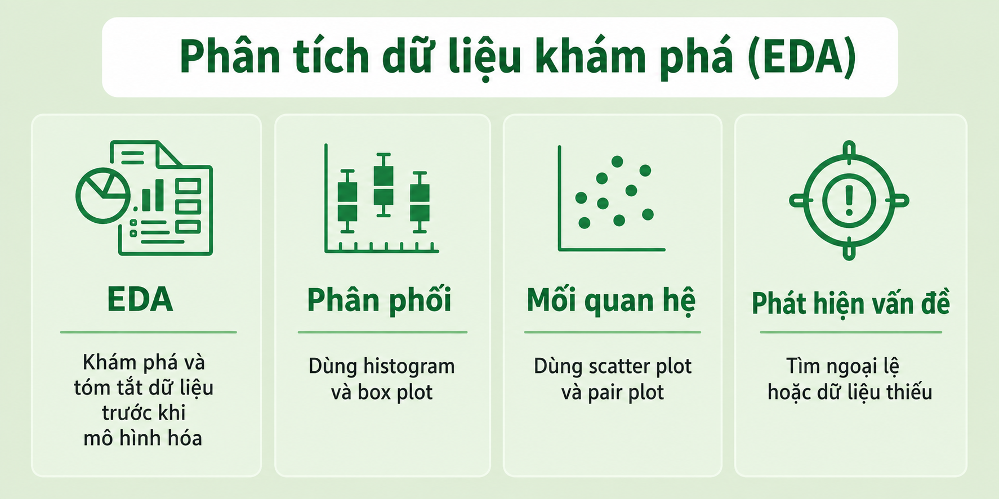
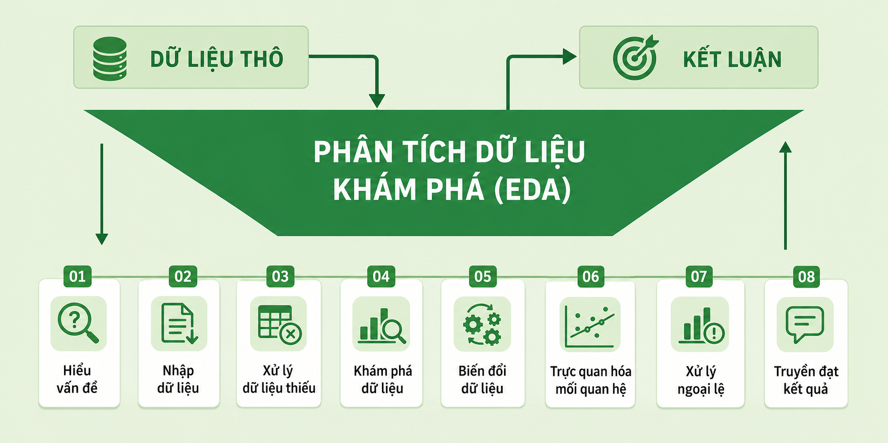
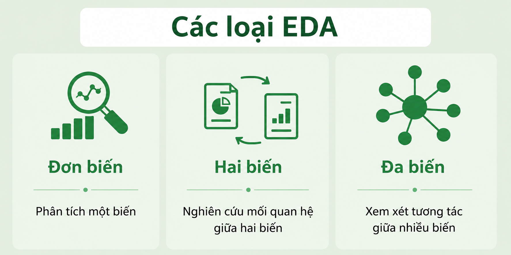
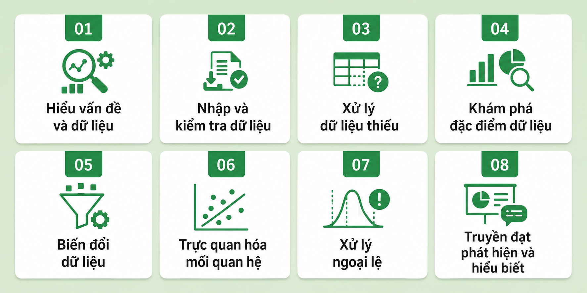

# Exploratory Data Analysis

**Last updated:** June 22, 2026

## Lesson Introduction

This lesson introduces **Exploratory Data Analysis (EDA)** as a foundational stage before statistical testing or machine-learning modeling. It focuses on examining data structure, identifying distributions, detecting missing data and outliers, assessing relationships among variables, transforming data, and communicating important findings.

The lesson combines conceptual knowledge with Python examples so that learners can carry out a complete EDA workflow. Quick-check questions after each section support self-assessment, while the final exercises require learners to apply the concepts to a real dataset.

## Learning Outcomes

After completing this lesson, learners will be able to:

- Explain the purpose and role of EDA in the data analysis process.
- Distinguish among univariate, bivariate, and multivariate analysis.
- Check the size, data types, missing values, and initial characteristics of a DataFrame.
- Use descriptive statistics to assess central tendency, dispersion, skewness, and kurtosis.
- Select histograms, box plots, bar charts, scatter plots, heatmaps, and pair plots for different analytical purposes.
- Identify and handle missing data using context-appropriate methods.
- Detect outliers using the IQR rule, Z-scores, and box plots.
- Apply transformations such as min-max scaling, standardization, and one-hot encoding.
- Use Pandas, Matplotlib, Seaborn, Plotly, and Scikit-learn at a basic level for EDA.
- Interpret results carefully, especially by distinguishing correlation from causation.
- Present findings, limitations, and recommended next steps in an EDA report.

## Lesson Structure

The lesson covers:

1. The concept and importance of EDA.
2. Univariate, bivariate, and multivariate analysis.
3. Common tools in Python and R.
4. Understanding the problem and the meaning of the data.
5. Importing and inspecting data.
6. Handling missing data.
7. Exploring distributions and statistical characteristics.
8. Transforming and encoding data.
9. Visualizing relationships among variables.
10. Detecting and handling outliers.
11. Communicating findings and insights.
12. Applications, review questions, and practical exercises.

## Prerequisites

Learners should have:

- Basic Python knowledge.
- An introductory understanding of DataFrames and data types.
- Access to Jupyter Notebook, JupyterLab, or Google Colab.
- The `pandas`, `matplotlib`, `seaborn`, `plotly`, and `scikit-learn` libraries.

Install the required libraries with:

```bash
pip install pandas matplotlib seaborn plotly scikit-learn
```

---

Exploratory Data Analysis, commonly called **EDA**, is an important stage in the data analysis process. EDA helps analysts explore, summarize, and visualize data in order to:

- Understand the structure of the dataset.
- Detect patterns and trends.
- Identify unusual values.
- Check initial assumptions.
- Evaluate relationships among variables.
- Prepare data before applying statistical or machine-learning models.

<p align="center">
  
</p>

### Quick Check

**Question 1.** What is the main objective of EDA?

A. Only to build machine-learning models  
B. To explore and understand data before modeling  
C. Only to store data  
D. To completely replace data cleaning  

**Question 2. True or false?** EDA is usually performed before statistical or machine-learning modeling.

---

<p align="center">
  
</p>

# The Importance of EDA

EDA is important because it helps analysts understand a dataset before drawing conclusions or building models.

## Main Benefits

- Provides a clear view of the number of variables, data types, and data distributions.
- Detects patterns and relationships among variables.
- Identifies data errors and outliers that may affect results.
- Highlights potentially important features for modeling.
- Supports the selection of suitable modeling methods.

### Example

A customer dataset may contain variables such as age, income, residential area, and spending level. EDA can help determine:

- Which customer groups spend the most.
- Whether income is related to spending.
- Whether unusually large income values exist.
- Whether some variables contain too much missing data.

### Quick Check

**Question 1.** How can EDA support model selection?

A. By identifying the characteristics and structure of the data  
B. By deleting all data  
C. By replacing model evaluation  
D. By only increasing the number of variables  

**Question 2.** Which of the following can be detected through EDA?

A. Outliers  
B. Relationships among variables  
C. Inappropriate data types  
D. All of the above  

**Question 3. Case.** A column contains 70% missing values. How can EDA support a decision about this column?

---

# Types of Exploratory Data Analysis

EDA is commonly divided into three types:

1. Univariate analysis.
2. Bivariate analysis.
3. Multivariate analysis.

<p align="center">
  
</p>

## 1. Univariate Analysis

Univariate analysis examines one variable at a time to understand its characteristics and distribution.

### Common Techniques

- **Histogram:** Shows the distribution of numerical values.
- **Box plot:** Shows dispersion and helps detect outliers.
- **Bar chart:** Commonly used for categorical variables.
- **Descriptive statistics:** Includes the mean, median, mode, standard deviation, and quantiles.

### Example

For the variable `age`, an analyst can:

- Calculate the mean and median age.
- Draw a histogram to inspect the distribution.
- Draw a box plot to detect unusual ages.
- Check whether the distribution is skewed.

### Quick Check

**Question 1.** How many variables does univariate analysis examine at a time?

A. One  
B. Two  
C. Three  
D. None  

**Question 2.** Which chart is appropriate for examining the distribution of a numerical variable?

A. Histogram  
B. Network diagram  
C. Heatmap  
D. Gantt chart  

**Question 3.** What is a box plot commonly used for?

A. Checking network connectivity  
B. Detecting outliers and examining dispersion  
C. Loading data  
D. Converting data types  

---

## 2. Bivariate Analysis

Bivariate analysis examines the relationship between two variables to understand how they interact or change together.

### Common Techniques

- **Scatter plot:** Shows the relationship between two numerical variables.
- **Correlation coefficient:** Measures the strength and direction of a linear relationship.
- **Cross-tabulation:** Shows the relationship between two categorical variables.
- **Line graph:** Compares two variables over time.
- **Covariance:** Indicates how two variables vary together.

### Example

For `age` and `income`, an analyst can:

- Draw a scatter plot.
- Calculate the correlation coefficient.
- Check whether income tends to increase with age.
- Detect observations that differ clearly from the overall pattern.

### Quick Check

**Question 1.** Which technique is suitable for examining the relationship between two numerical variables?

A. Scatter plot  
B. One-variable bar chart  
C. One-variable histogram  
D. Single frequency table  

**Question 2.** A correlation coefficient measures:

A. The number of data rows  
B. The strength and direction of a relationship between two variables  
C. The number of missing values  
D. File size  

**Question 3. True or false?** A high correlation always proves that one variable causes the other.

---

## 3. Multivariate Analysis

Multivariate analysis examines three or more variables to understand complex relationships in a dataset.

### Common Techniques

- **Pair plot:** Displays relationships among many pairs of variables.
- **Principal Component Analysis (PCA):** Reduces dimensionality while attempting to preserve important information.
- **Spatial analysis:** Examines geographic patterns using maps and location data.
- **Correlation matrix:** Shows relationships among many numerical variables.
- **Clustering and classification:** May reveal complex structure in data.

### Example

In customer data, an analyst may examine:

- Age.
- Income.
- Purchase frequency.
- Total spending.

This can help identify groups of customers with similar characteristics.

### Quick Check

**Question 1.** Multivariate analysis typically examines:

A. One variable  
B. Two variables  
C. Three or more variables  
D. No variables  

**Question 2.** PCA is mainly used to:

A. Increase the number of data rows  
B. Reduce data dimensionality  
C. Delete all numerical variables  
D. Convert charts into tables  

**Question 3.** What does a pair plot do?

A. Displays relationships among multiple pairs of variables  
B. Displays only one value  
C. Processes text only  
D. Checks data-access permissions  

---

# Tools for EDA

EDA can be performed with many tools.

## Python

Common libraries include:

- **Pandas:** Data handling and manipulation.
- **Matplotlib:** Basic plotting.
- **Seaborn:** Statistical visualization.
- **Plotly:** Interactive visualization.

## R

Common packages include:

- **ggplot2:** Data visualization.
- **dplyr:** Data transformation and manipulation.
- **tidyr:** Data organization and reshaping.

### Quick Check

**Question 1.** Which Python library is commonly used to manipulate tabular data?

A. Pandas  
B. Matplotlib  
C. Plotly  
D. Seaborn  

**Question 2.** Which tool is suitable for interactive charts in Python?

A. Plotly  
B. Pandas  
C. NumPy  
D. pathlib  

**Question 3.** Which R package is commonly used for visualization?

A. ggplot2  
B. dplyr  
C. tidyr  
D. readr  

---

# Steps in an EDA Workflow

EDA consists of a sequence of steps that help analysts understand data, detect problems, and prepare the data for subsequent analysis.

<p align="center">
  
</p>

---

## Step 1. Understand the Problem and the Data

The first step is to understand the problem and the meaning of the available data.

### Questions to Ask

- What is the objective or problem?
- Which variables are in the dataset?
- What does each variable represent?
- What types of data are present: numerical, categorical, text, or time?
- Are there quality problems or limitations?

### Example

If the objective is to predict customer churn, identify:

- The target variable.
- Potentially relevant input variables.
- The period during which the data were collected.
- Whether churners and non-churners are imbalanced.

### Quick Check

**Question 1.** Why is it necessary to understand the meaning of each variable?

A. To interpret the data in the correct context  
B. To increase the number of variables  
C. To replace data collection  
D. To avoid visualization  

**Question 2.** Which question is appropriate at this step?

A. Which variable is the target?  
B. What data types are present?  
C. What limitations does the dataset have?  
D. All of the above  

---

## Step 2. Import and Inspect the Data

After understanding the problem, the data are loaded into Python, R, or another tool for an initial inspection.

### Main Tasks

- Load the dataset correctly.
- Check the number of rows and columns.
- Identify missing values.
- Inspect each variable's data type.
- Detect errors, invalid values, or unusual observations.

### Python Example

```python
import pandas as pd

df = pd.read_csv("data.csv")

print(df.head())
print(df.shape)
print(df.info())
print(df.isnull().sum())
```

### Explanation

- `head()` displays the first rows.
- `shape` returns the number of rows and columns.
- `info()` provides data-type information.
- `isnull().sum()` counts missing values in each column.

### Quick Check

**Question 1.** Which attribute returns the number of rows and columns?

A. `df.shape`  
B. `df.head()`  
C. `df.info()`  
D. `df.columns()`  

**Question 2.** Which command helps inspect column data types?

A. `df.info()`  
B. `df.plot()`  
C. `df.sort_values()`  
D. `df.drop()`  

**Question 3.** Why should the data be inspected immediately after import?

---

## Step 3. Handle Missing Data

Missing data are common in real datasets and can affect analytical quality.

### Main Tasks

- Identify why values are missing.
- Decide whether to remove or impute missing values.
- Select an appropriate imputation method.
- Assess the uncertainty remaining after treatment.

### Common Methods

- Mean imputation.
- Median imputation.
- Mode imputation.
- Regression-based imputation.
- K-nearest-neighbor imputation.
- Decision-tree methods.
- Removing rows or columns when appropriate.

### Example

```python
df["age"] = df["age"].fillna(
    df["age"].median()
)

df["city"] = df["city"].fillna(
    df["city"].mode()[0]
)
```

### Note

Removing missing observations may reduce sample size and introduce bias. Imputation may also change the original distribution. Therefore, the missingness mechanism and the analytical context should be considered.

### Quick Check

**Question 1.** Why should analysts not automatically delete every row with missing data?

A. It may reduce the sample and introduce bias  
B. Missing data are always correct  
C. Pandas cannot remove rows  
D. Every missing value equals zero  

**Question 2.** Which method is suitable for a skewed numerical variable with outliers?

A. Median  
B. Maximum value  
C. Random value  
D. Column name  

**Question 3. True or false?** After imputation, all uncertainty is completely eliminated.

---

## Step 4. Explore Data Characteristics

After handling missing data, examine the main statistical characteristics of the data.

### Characteristics to Examine

- Data distribution.
- Mean, median, and mode.
- Standard deviation.
- Skewness.
- Kurtosis.
- Outliers and unusual observations.

### Python Example

```python
print(df.describe())
print(df["income"].skew())
print(df["income"].kurt())
```

### Explanation

- `describe()` provides basic descriptive statistics.
- `skew()` measures distribution asymmetry.
- `kurt()` measures distribution kurtosis.

### Quick Check

**Question 1.** Which measure describes data dispersion?

A. Standard deviation  
B. Column name  
C. Number of rows  
D. File type  

**Question 2.** Skewness measures:

A. Distribution asymmetry  
B. Number of missing values  
C. Variable-name length  
D. Number of groups  

**Question 3.** Why should both the mean and median be examined?

---

## Step 5. Transform the Data

Data transformation makes the data more suitable for analysis or modeling.

### Common Techniques

- Scaling.
- Min-max scaling.
- Standardization.
- One-hot encoding.
- Label encoding.
- Log transformation.
- Square-root transformation.
- Feature creation.
- Aggregation or grouping.

### Min-Max Scaling Example

```python
from sklearn.preprocessing import MinMaxScaler

scaler = MinMaxScaler()

df[["age", "income"]] = scaler.fit_transform(
    df[["age", "income"]]
)
```

### One-Hot Encoding Example

```python
df = pd.get_dummies(
    df,
    columns=["city"],
    drop_first=True
)
```

### Feature Creation Example

```python
df["revenue_per_order"] = (
    df["total_revenue"] / df["number_of_orders"]
)
```

### Quick Check

**Question 1.** One-hot encoding is commonly used for:

A. Categorical variables  
B. Image files  
C. Missing data  
D. Outliers  

**Question 2.** Min-max scaling usually maps values to:

A. 0 to 1  
B. 10 to 100  
C. Negative infinity to positive infinity  
D. Integers only  

**Question 3.** Creating a new variable from existing variables is called:

A. Feature engineering  
B. Data deletion  
C. File conversion  
D. Data duplication  

---

## Step 6. Visualize Data Relationships

Visualization helps reveal patterns and relationships that may be difficult to detect in tables.

### Charts for Categorical Data

- Bar chart.
- Pie chart.
- Count plot.

### Charts for Numerical Data

- Histogram.
- Box plot.
- Density plot.

### Charts for Relationships

- Scatter plot.
- Line chart.
- Heatmap.
- Pair plot.

### Python Examples

```python
import matplotlib.pyplot as plt
import seaborn as sns

sns.histplot(df["income"], kde=True)
plt.title("Income Distribution")
plt.show()
```

```python
sns.scatterplot(
    x="age",
    y="income",
    data=df
)

plt.title("Relationship Between Age and Income")
plt.show()
```

```python
sns.heatmap(
    df.corr(numeric_only=True),
    annot=True,
    cmap="coolwarm"
)

plt.title("Correlation Matrix")
plt.show()
```

### Quick Check

**Question 1.** Which chart is suitable for examining the relationship between two numerical variables?

A. Scatter plot  
B. Pie chart  
C. One-variable bar chart  
D. Frequency table  

**Question 2.** A heatmap is often used to:

A. Display a correlation matrix  
B. Delete missing values  
C. Load data from an API  
D. Convert data types  

**Question 3.** Why can visualizations reveal problems that are not obvious in a numerical table?

---

## Step 7. Handle Outliers

Outliers are observations that differ substantially from most of the data.

### Possible Causes

- Data-entry errors.
- Measurement errors.
- Formatting errors.
- Rare real-world variation.
- Unusual but valid events.

### Detection Methods

- Interquartile range (IQR).
- Z-score.
- Box plot.
- Domain-knowledge analysis.

### Treatment Methods

- Keep the value if it is valid.
- Correct it if it is a data-entry error.
- Apply capping.
- Transform the data.
- Remove it if it is clearly incorrect or harmful to the analysis.

### IQR Example

```python
Q1 = df["income"].quantile(0.25)
Q3 = df["income"].quantile(0.75)

IQR = Q3 - Q1

lower_bound = Q1 - 1.5 * IQR
upper_bound = Q3 + 1.5 * IQR

outliers = df[
    (df["income"] < lower_bound) |
    (df["income"] > upper_bound)
]
```

### Quick Check

**Question 1.** Outliers may occur because of:

A. Data-entry errors  
B. Real variation  
C. Measurement errors  
D. All of the above  

**Question 2.** Which methods can detect outliers?

A. IQR  
B. Z-score  
C. Box plot  
D. All of the above  

**Question 3. True or false?** Every outlier must be removed.

---

## Step 8. Communicate Results and Insights

The final EDA step is to present results clearly so that others can understand and use them.

### What Should Be Reported?

- Analytical objective and scope.
- Problem context.
- Methods used.
- Main patterns and trends.
- Unusual observations.
- Data limitations.
- Recommendations for next steps.

### Communication Principles

- Use appropriate charts.
- Avoid overcrowding a figure.
- Highlight important findings.
- Explain results in accessible language.
- State limitations and uncertainty clearly.

### Quick Check

**Question 1.** What should appear in an EDA report?

A. Analytical objective  
B. Main findings  
C. Data limitations  
D. All of the above  

**Question 2.** Why should data limitations be stated?

A. So readers understand the scope and reliability of the results  
B. To make the report longer  
C. To avoid presenting charts  
D. To eliminate analytical responsibility  

**Question 3.** What type of language should a good EDA report use?

A. Clear and understandable language  
B. Only complex terminology  
C. No explanation of charts  
D. Source code only  

---

# Applications of EDA

EDA is widely used across many fields.

## Market Analysis and Customer Segmentation

EDA helps identify customer groups, purchasing behavior, and market trends.

## Risk Assessment in Finance and Insurance

EDA supports the detection of unusual transactions, risk factors, and customer groups with high default probabilities.

## Quality Control in Manufacturing

EDA helps identify product defects, process variation, and possible causes of quality problems.

## Healthcare Data Analysis and Disease Prediction

EDA supports the exploration of risk factors, disease trends, and relationships among symptoms, treatments, and health outcomes.

## Recommender Systems and Product Optimization

EDA helps understand user behavior, engagement, and preferences in order to improve recommendation systems.

### Quick Check

**Question 1.** Detecting unusual transactions is a common EDA application in:

A. Finance  
B. Graphic design  
C. Architecture  
D. Music  

**Question 2.** In manufacturing, EDA can support:

A. Product-defect detection  
B. Process-variation monitoring  
C. Quality control  
D. All of the above  

**Question 3. Case.** An e-commerce platform wants to improve its product recommendation system. How can EDA help?

---

# Content Summary

| Topic | Main objective | Tool or technique |
|---|---|---|
| **Univariate analysis** | Understand one variable | Histogram, box plot, bar chart |
| **Bivariate analysis** | Understand relationships between two variables | Scatter plot, correlation, cross-tabulation |
| **Multivariate analysis** | Understand relationships among multiple variables | Pair plot, PCA, correlation matrix |
| **Missing-data handling** | Reduce the effect of incomplete data | Mean, median, mode, KNN |
| **Feature exploration** | Understand distribution and variability | Mean, median, standard deviation |
| **Data transformation** | Prepare data for analysis | Scaling, encoding, transformation |
| **Outlier handling** | Detect and assess unusual observations | IQR, Z-score, box plot |
| **Communication** | Convert results into insights | Charts, reports, dashboards |

---

# End-of-Lesson Review

## Part A. Multiple-Choice Questions

**Question 1.** When is EDA usually performed?

A. Before model building  
B. Only after model deployment  
C. After deleting the data  
D. It is unrelated to modeling  

**Question 2.** Univariate analysis focuses on:

A. One variable  
B. Two variables  
C. Three variables  
D. The entire model  

**Question 3.** Which chart is suitable for detecting outliers?

A. Box plot  
B. Pie chart  
C. Line chart  
D. Map  

**Question 4.** Which technique is appropriate for studying the relationship between two numerical variables?

A. Scatter plot  
B. Histogram  
C. One-variable bar chart  
D. Single frequency table  

**Question 5.** PCA is mainly used to:

A. Reduce dimensionality  
B. Increase the number of rows  
C. Delete missing data  
D. Create a CSV file  

**Question 6.** Which method can be used to handle missing data?

A. Median  
B. KNN  
C. Regression  
D. All of the above  

**Question 7.** Skewness measures:

A. Distribution asymmetry  
B. Number of rows  
C. Number of unique values  
D. Column-name length  

**Question 8.** One-hot encoding is used for:

A. Categorical variables  
B. Outliers  
C. Image files  
D. Time data  

**Question 9.** IQR is commonly used to:

A. Detect outliers  
B. Create a target variable  
C. Load data  
D. Rename columns  

**Question 10.** The final step in EDA is:

A. Communicating results and insights  
B. Importing data  
C. Creating missing data  
D. Deleting every variable  

## Part B. True/False Questions

**Question 1.** EDA consists only of drawing charts.

**Question 2.** Correlation does not imply causation.

**Question 3.** Every outlier is a data error.

**Question 4.** The median is generally less affected by outliers than the mean.

**Question 5.** Imputing missing values can alter the data distribution.

**Question 6.** A pair plot can display relationships among multiple variables.

**Question 7.** An EDA report should include data limitations.

## Part C. Short-Answer Questions

**Question 1.** Present the objectives of EDA.

**Question 2.** Distinguish among univariate, bivariate, and multivariate analysis.

**Question 3.** Present the main steps in an EDA workflow.

**Question 4.** Why should analysts not automatically remove every outlier?

**Question 5.** State three methods for handling missing data.

**Question 6.** Why is visualization important in EDA?

## Part D. Practical Exercises

### Exercise 1. Inspect a Dataset

Using any dataset:

1. Display the first five rows.
2. Determine the number of rows and columns.
3. Inspect data types.
4. Count missing values.
5. Determine the number of unique values in each column.

### Exercise 2. Univariate Analysis

Select one numerical and one categorical variable:

1. Calculate descriptive statistics.
2. Draw a histogram for the numerical variable.
3. Draw a box plot for the numerical variable.
4. Draw a bar chart for the categorical variable.
5. Comment on the distribution and outliers.

### Exercise 3. Bivariate Analysis

1. Draw a scatter plot between two numerical variables.
2. Calculate their correlation coefficient.
3. Create a cross-tabulation between two categorical variables.
4. Comment on the observed relationship.

### Exercise 4. Multivariate Analysis

1. Draw a pair plot for at least four variables.
2. Create a correlation matrix.
3. Identify strongly correlated variable pairs.
4. Explain why causation cannot be concluded from correlation alone.

### Exercise 5. Missing Data and Outliers

1. Identify columns containing missing data.
2. Propose handling methods.
3. Detect outliers using IQR.
4. Compare results before and after treatment.
5. Explain why each outlier was retained or removed.

---

# References and Useful Links

1. [Exploratory Data Analysis — NIST/SEMATECH e-Handbook of Statistical Methods](https://www.itl.nist.gov/div898/handbook/eda/eda.htm)  
   Foundational material on the objectives, principles, and techniques of EDA.

2. [Pandas Documentation](https://pandas.pydata.org/docs/)  
   Official documentation for DataFrames, data import, data types, missing-data handling, and descriptive statistics.

3. [pandas.DataFrame.describe](https://pandas.pydata.org/docs/reference/api/pandas.DataFrame.describe.html)  
   Documentation for generating descriptive statistics with `describe()`.

4. [pandas.DataFrame.info](https://pandas.pydata.org/docs/reference/api/pandas.DataFrame.info.html)  
   Documentation for inspecting columns, data types, and non-null counts.

5. [pandas.DataFrame.fillna](https://pandas.pydata.org/docs/reference/api/pandas.DataFrame.fillna.html)  
   Official documentation for handling missing values with `fillna()`.

6. [Matplotlib Documentation](https://matplotlib.org/stable/)  
   Official documentation for basic plotting and chart customization.

7. [Seaborn Documentation](https://seaborn.pydata.org/)  
   Official documentation for histograms, box plots, scatter plots, heatmaps, pair plots, and other statistical visualizations.

8. [Plotly Python Documentation](https://plotly.com/python/)  
   Documentation for interactive charts in Python.

9. [Scikit-learn Preprocessing](https://scikit-learn.org/stable/modules/preprocessing.html)  
   Documentation for scaling, standardization, and encoding.

10. [MinMaxScaler — Scikit-learn](https://scikit-learn.org/stable/modules/generated/sklearn.preprocessing.MinMaxScaler.html)  
    Official documentation for min-max scaling.

11. [Principal Component Analysis — Scikit-learn](https://scikit-learn.org/stable/modules/decomposition.html#pca)  
    Documentation for PCA and dimensionality reduction.

12. [SciPy Statistical Functions](https://docs.scipy.org/doc/scipy/reference/stats.html)  
    Documentation for Z-scores, distributions, and outlier-related statistical tools.

13. [ggplot2 Documentation](https://ggplot2.tidyverse.org/)  
    Official documentation for data visualization in R.

14. [dplyr Documentation](https://dplyr.tidyverse.org/)  
    Official documentation for data manipulation and transformation in R.

15. [tidyr Documentation](https://tidyr.tidyverse.org/)  
    Official documentation for tidy data and reshaping in R.

> **Note:** Prefer official library documentation because syntax, parameters, and function behavior may change across versions.

---

# Answers and Suggested Responses

<details>
<summary><strong>Click to show answers</strong></summary>

## Quick Check — Introduction

### Question 1

B. To explore and understand data before modeling.

### Question 2

True.

## Quick Check — Importance of EDA

### Question 1

A. By identifying the characteristics and structure of the data.

### Question 2

D. All of the above.

### Question 3

EDA can help determine whether the column still contains enough useful information, whether values should be imputed, whether the column should be removed, or whether another source should be found.

## Quick Check — Univariate Analysis

### Question 1

A. One variable.

### Question 2

A. Histogram.

### Question 3

B. Detecting outliers and examining dispersion.

## Quick Check — Bivariate Analysis

### Question 1

A. Scatter plot.

### Question 2

B. The strength and direction of the relationship between two variables.

### Question 3

False. Correlation does not prove causation.

## Quick Check — Multivariate Analysis

### Question 1

C. Three or more variables.

### Question 2

B. Reducing dimensionality.

### Question 3

A. Displaying relationships among multiple pairs of variables.

## Quick Check — Tools

### Question 1

A. Pandas.

### Question 2

A. Plotly.

### Question 3

A. ggplot2.

## Quick Check — Step 1

### Question 1

A. To interpret the data in the correct context.

### Question 2

D. All of the above.

## Quick Check — Step 2

### Question 1

A. `df.shape`.

### Question 2

A. `df.info()`.

### Question 3

To detect data-entry problems, inappropriate data types, missing values, and unusual observations early.

## Quick Check — Step 3

### Question 1

A. It may reduce the sample and introduce bias.

### Question 2

A. Median.

### Question 3

False. Imputed data may still contain uncertainty.

## Quick Check — Step 4

### Question 1

A. Standard deviation.

### Question 2

A. Distribution asymmetry.

### Question 3

The mean is sensitive to outliers, whereas the median is more robust. Comparing both helps reveal the shape of the distribution.

## Quick Check — Step 5

### Question 1

A. Categorical variables.

### Question 2

A. 0 to 1.

### Question 3

A. Feature engineering.

## Quick Check — Step 6

### Question 1

A. Scatter plot.

### Question 2

A. Displaying a correlation matrix.

### Question 3

Charts can reveal trends, clusters, outliers, and relationships that may be difficult to detect in a numerical table.

## Quick Check — Step 7

### Question 1

D. All of the above.

### Question 2

D. All of the above.

### Question 3

False. The cause and meaning of an outlier should be evaluated before treatment.

## Quick Check — Step 8

### Question 1

D. All of the above.

### Question 2

A. So readers understand the scope and reliability of the results.

### Question 3

A. Clear and understandable language.

## Quick Check — Applications

### Question 1

A. Finance.

### Question 2

D. All of the above.

### Question 3

EDA can be used to explore purchase histories, products commonly bought together, user engagement, customer groups, and preference trends.

## Part A. Multiple-Choice Answers

1. A  
2. A  
3. A  
4. A  
5. A  
6. D  
7. A  
8. A  
9. A  
10. A  

## Part B. True/False Answers

1. False.  
2. True.  
3. False.  
4. True.  
5. True.  
6. True.  
7. True.  

## Part C. Suggested Responses

### Question 1

EDA helps analysts understand data structure, detect patterns, outliers, data errors, and relationships before modeling.

### Question 2

Univariate analysis examines one variable; bivariate analysis examines the relationship between two variables; multivariate analysis studies three or more variables.

### Question 3

The steps are: understand the problem, import and inspect the data, handle missing data, explore data characteristics, transform the data, visualize relationships, handle outliers, and communicate results.

### Question 4

An outlier may be an error, but it may also represent meaningful real-world variation.

### Question 5

Methods include mean, median, mode, regression, KNN, or deletion when appropriate.

### Question 6

Visualization helps reveal trends, clusters, outliers, and relationships and makes results easier to communicate.

## Part D

These are open practical exercises. Submissions should clearly present code, results, charts, and interpretation. Data-treatment decisions should be justified based on the dataset and analytical objective.

</details>
