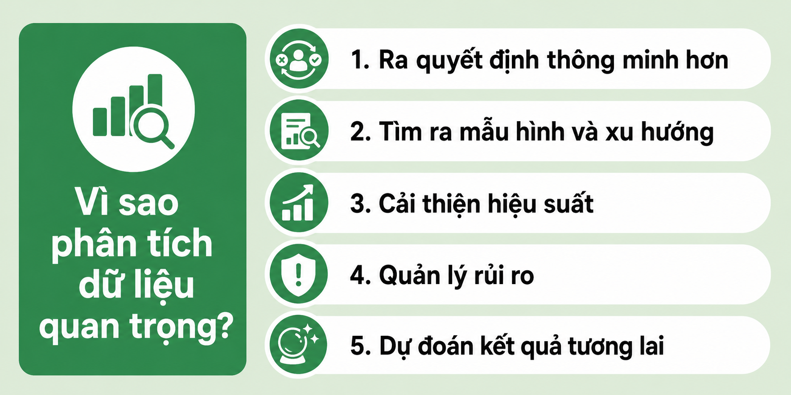
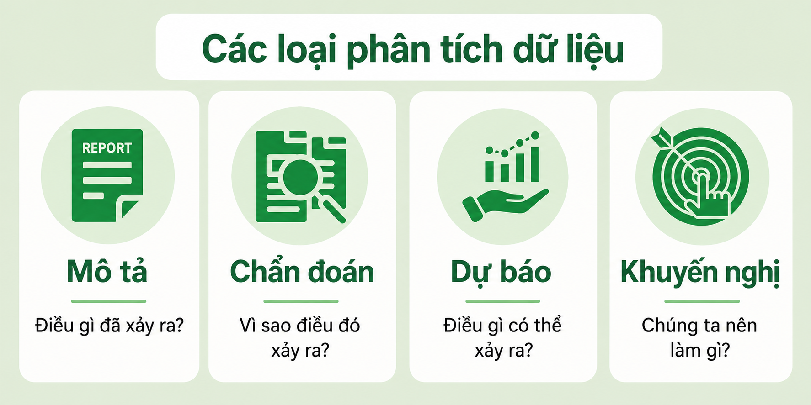

# Phân tích dữ liệu là gì?

**Cập nhật lần cuối:** 24 tháng 3 năm 2026

## Giới thiệu bài học

Bài học này giới thiệu những khái niệm nền tảng về **phân tích dữ liệu**, vai trò của phân tích dữ liệu trong quá trình ra quyết định, các bước chính trong một quy trình phân tích, những loại hình phân tích phổ biến, các công cụ thường được sử dụng, các lĩnh vực ứng dụng và một số hạn chế cần lưu ý.

Nội dung bài học được xây dựng theo hướng từ khái niệm tổng quát đến quy trình thực hiện và ứng dụng thực tế. Sau mỗi phần có các câu hỏi nhanh giúp người học tự kiểm tra mức độ hiểu bài. Cuối bài có hệ thống câu hỏi ôn tập, bài tập tình huống và phần đáp án được ẩn để hỗ trợ việc tự học.

## Kiến thức và kỹ năng sẽ đạt được

Sau khi hoàn thành bài học, người học có thể:

- Trình bày được khái niệm và mục tiêu của phân tích dữ liệu.
- Giải thích được vai trò của phân tích dữ liệu trong hoạt động ra quyết định.
- Mô tả được các bước chính của quy trình phân tích dữ liệu.
- Phân biệt được phân tích mô tả, chẩn đoán, dự báo và đề xuất.
- Nhận biết được vai trò cơ bản của các công cụ như Excel, Python, R, Tableau, Power BI, SAS và KNIME.
- Nêu được các ứng dụng của phân tích dữ liệu trong kinh doanh, y tế, tài chính, marketing và nghiên cứu khoa học.
- Nhận diện được các hạn chế liên quan đến chất lượng dữ liệu, thiên lệch, nguồn lực, công cụ và bối cảnh.
- Vận dụng các khái niệm đã học để phân tích những tình huống dữ liệu đơn giản.

## Cấu trúc bài học

Bài học gồm các nội dung chính sau:

1. Khái niệm phân tích dữ liệu.
2. Tầm quan trọng của phân tích dữ liệu.
3. Quy trình phân tích dữ liệu.
4. Các loại phân tích dữ liệu.
5. Các công cụ phân tích dữ liệu.
6. Ứng dụng của phân tích dữ liệu.
7. Hạn chế của phân tích dữ liệu.
8. Câu hỏi ôn tập và bài tập tình huống.

---
## Phân tích dữ liệu là gì?

Phân tích dữ liệu là quá trình thu thập, làm sạch, chuyển đổi và diễn giải dữ liệu nhằm khám phá những thông tin hữu ích và hỗ trợ việc ra quyết định. Quá trình này giúp chuyển dữ liệu thô thành thông tin có ý nghĩa để giải quyết vấn đề, đánh giá hiệu quả hoạt động và đưa ra dự báo.

  

### Câu hỏi nhanh

**Câu 1.** Mục tiêu chính của phân tích dữ liệu là gì?

A. Chỉ lưu trữ dữ liệu  
B. Chuyển dữ liệu thô thành thông tin hữu ích  
C. Xóa toàn bộ dữ liệu không cần thiết  
D. Thay thế hoàn toàn con người trong quá trình ra quyết định  

**Câu 2.** Hoạt động nào sau đây không được nhắc đến như một phần của phân tích dữ liệu?

A. Thu thập dữ liệu  
B. Làm sạch dữ liệu  
C. Diễn giải dữ liệu  
D. Sản xuất thiết bị phần cứng  

## Tầm quan trọng của phân tích dữ liệu

Phân tích dữ liệu có vai trò quan trọng vì giúp chuyển thông tin thô thành những hiểu biết có thể áp dụng vào thực tiễn.

- **Ra quyết định dựa trên dữ liệu:** Thông qua việc phân tích dữ liệu trong quá khứ và hiện tại, các tổ chức có thể đưa ra quyết định chính xác hơn dựa trên bằng chứng thay vì cảm tính hoặc giả định.
- **Hỗ trợ kinh doanh thông minh:** Phân tích dữ liệu giúp doanh nghiệp hiểu rõ sở thích của khách hàng, xu hướng thị trường và những khía cạnh cần cải thiện, từ đó nâng cao năng lực cạnh tranh.
- **Đánh giá hiệu quả:** Quá trình phân tích giúp đo lường mức độ hiệu quả của các quy trình, sản phẩm hoặc chiến lược, đồng thời xác định những lĩnh vực cần được cải thiện.
- **Quản trị rủi ro:** Phân tích dữ liệu hỗ trợ việc phát hiện, dự báo và giảm thiểu các rủi ro tiềm ẩn trước khi chúng trở thành những vấn đề nghiêm trọng.

  

### Câu hỏi nhanh

**Câu 1.** Vì sao quyết định dựa trên dữ liệu thường đáng tin cậy hơn quyết định dựa trên cảm tính?

A. Vì dữ liệu luôn hoàn toàn chính xác  
B. Vì dữ liệu cung cấp bằng chứng để hỗ trợ quyết định  
C. Vì dữ liệu loại bỏ mọi rủi ro  
D. Vì dữ liệu không cần được diễn giải  

**Câu 2.** Phân tích dữ liệu hỗ trợ quản trị rủi ro bằng cách nào?

A. Loại bỏ hoàn toàn mọi rủi ro  
B. Phát hiện và dự báo các rủi ro tiềm ẩn  
C. Chỉ ghi nhận rủi ro sau khi xảy ra  
D. Thay thế mọi biện pháp kiểm soát  

**Câu 3. Đúng hay sai?** Phân tích dữ liệu chỉ có giá trị đối với các doanh nghiệp lớn.

## Quy trình phân tích dữ liệu

Quy trình phân tích dữ liệu gồm một số bước chính nhằm chuyển đổi dữ liệu thô thành những hiểu biết có giá trị.

  

### 1. Xác định mục tiêu

Đặt ra các mục tiêu rõ ràng và xác định những câu hỏi chính mà quá trình phân tích cần trả lời.

### 2. Thu thập dữ liệu

Thu thập dữ liệu định tính hoặc định lượng có liên quan và đáng tin cậy. Dữ liệu cần có mức độ đầy đủ, chính xác và được tổ chức hợp lý.

### 3. Làm sạch và tiền xử lý dữ liệu

Chuẩn bị dữ liệu cho quá trình phân tích bằng cách sửa lỗi, xử lý giá trị thiếu, loại bỏ dữ liệu trùng lặp và xử lý các giá trị ngoại lệ.

### 4. Phân tích dữ liệu khám phá

Sử dụng thống kê mô tả và các kỹ thuật trực quan hóa để nhận diện mẫu hình, xu hướng, mối quan hệ và các điểm bất thường trong dữ liệu.

### 5. Phân tích thống kê

Áp dụng các phương pháp thống kê hoặc mô hình phân tích để kiểm định giả thuyết, xác định mối quan hệ và đưa ra dự báo.

### 6. Trực quan hóa và truyền đạt kết quả

Trình bày kết quả thông qua biểu đồ, bảng điều khiển, báo cáo hoặc bài thuyết trình để các bên liên quan có thể hiểu và sử dụng kết quả trong quá trình ra quyết định.

> Để tìm hiểu thêm, tham khảo nội dung **Các bước trong quy trình phân tích dữ liệu**.

### Câu hỏi nhanh

**Câu 1.** Bước đầu tiên của quy trình phân tích dữ liệu là gì?

A. Trực quan hóa dữ liệu  
B. Xây dựng mô hình  
C. Xác định mục tiêu  
D. Làm sạch dữ liệu  

**Câu 2.** Việc xử lý giá trị thiếu và dữ liệu trùng lặp thuộc bước nào?

A. Thu thập dữ liệu  
B. Làm sạch và tiền xử lý dữ liệu  
C. Phân tích thống kê  
D. Truyền đạt kết quả  

**Câu 3.** Mục tiêu chính của phân tích dữ liệu khám phá là gì?

A. Xóa dữ liệu gốc  
B. Nhận diện mẫu hình, xu hướng, mối quan hệ và điểm bất thường  
C. Chỉ tạo một báo cáo văn bản  
D. Thay thế hoàn toàn phân tích thống kê  

**Câu 4.** Sắp xếp các hoạt động sau theo trình tự hợp lý:

1. Làm sạch dữ liệu  
2. Xác định mục tiêu  
3. Trực quan hóa và truyền đạt kết quả  
4. Thu thập dữ liệu  

**Câu 5. Tình huống.** Một doanh nghiệp muốn tìm nguyên nhân khiến doanh số giảm. Trước khi thu thập dữ liệu, doanh nghiệp nên làm gì?

## Các loại phân tích dữ liệu

Phân tích dữ liệu thường được chia thành bốn loại chính, tùy theo câu hỏi cần giải quyết và mục đích của quá trình phân tích.

  

### Phân tích mô tả

Phân tích mô tả tóm tắt dữ liệu lịch sử nhằm giải thích điều gì đã xảy ra. Loại phân tích này thường sử dụng báo cáo, biểu đồ, bảng điều khiển, thống kê mô tả và các chỉ số đánh giá hiệu quả.

### Phân tích chẩn đoán

Phân tích chẩn đoán xem xét dữ liệu ở mức độ sâu hơn để xác định tại sao một sự kiện hoặc kết quả đã xảy ra. Nó giúp nhận diện các nguyên nhân có thể có, mối tương quan và những yếu tố góp phần tạo nên các mẫu hình quan sát được.

### Phân tích dự báo

Phân tích dự báo sử dụng dữ liệu lịch sử, mô hình thống kê và các phương pháp học máy để ước lượng những gì có khả năng xảy ra trong tương lai. Loại phân tích này hỗ trợ việc lập kế hoạch bằng cách dự báo xu hướng, rủi ro và cơ hội.

### Phân tích đề xuất

Phân tích đề xuất phát triển từ kết quả dự báo để khuyến nghị những hành động nên được thực hiện. Nó hỗ trợ ra quyết định bằng cách xác định các chiến lược hoặc giải pháp có khả năng tạo ra kết quả tốt nhất.

### Câu hỏi nhanh

**Câu 1.** Loại phân tích nào trả lời câu hỏi “Điều gì đã xảy ra?”

A. Phân tích mô tả  
B. Phân tích chẩn đoán  
C. Phân tích dự báo  
D. Phân tích đề xuất  

**Câu 2.** Loại phân tích nào tìm hiểu nguyên nhân của một kết quả đã quan sát được?

A. Mô tả  
B. Chẩn đoán  
C. Dự báo  
D. Đề xuất  

**Câu 3.** Dự đoán doanh số của quý tiếp theo thuộc loại phân tích nào?

A. Mô tả  
B. Chẩn đoán  
C. Dự báo  
D. Đề xuất  

**Câu 4.** Hệ thống đề nghị doanh nghiệp điều chỉnh giá bán để tối đa hóa lợi nhuận thuộc loại phân tích nào?

A. Mô tả  
B. Chẩn đoán  
C. Dự báo  
D. Đề xuất  

**Câu 5. Ghép cặp.**

| Câu hỏi | Loại phân tích |
|---|---|
| Điều gì đã xảy ra? | Phân tích mô tả |
| Vì sao điều đó xảy ra? | Phân tích chẩn đoán |
| Điều gì có thể xảy ra? | Phân tích dự báo |
| Chúng ta nên làm gì? | Phân tích đề xuất |

---

## Các công cụ phân tích dữ liệu

Có nhiều công cụ được sử dụng trong phân tích dữ liệu, từ phần mềm bảng tính đến ngôn ngữ lập trình và các nền tảng kinh doanh thông minh.

| Công cụ | Công dụng chính |
|---|---|
| **Microsoft Excel** | Thực hiện các phép tính đơn giản, bảng tổng hợp, tóm tắt dữ liệu và biểu đồ cơ bản |
| **SAS** | Phân tích nâng cao, mô hình thống kê và phân tích dự báo |
| **R** | Phân tích thống kê, xây dựng mô hình dữ liệu và trực quan hóa |
| **Python** | Xử lý, phân tích, trực quan hóa dữ liệu và học máy với các thư viện như Pandas, NumPy và Matplotlib |
| **Tableau** | Xây dựng bảng điều khiển tương tác và trực quan hóa dữ liệu nâng cao |
| **Power BI** | Tạo báo cáo và bảng điều khiển kinh doanh thông minh, đặc biệt trong hệ sinh thái Microsoft |
| **KNIME** | Xây dựng quy trình mã nguồn mở cho khai phá dữ liệu, xử lý dữ liệu và học máy |

### Câu hỏi nhanh

**Câu 1.** Công cụ nào phù hợp với các phép tính đơn giản, bảng tổng hợp và biểu đồ cơ bản?

A. Excel  
B. KNIME  
C. SAS  
D. Tableau  

**Câu 2.** Thư viện Pandas, NumPy và Matplotlib thường được sử dụng với ngôn ngữ nào?

A. R  
B. Python  
C. SQL  
D. Java  

**Câu 3.** Công cụ nào thường được sử dụng để xây dựng bảng điều khiển tương tác?

A. Tableau hoặc Power BI  
B. Chỉ trình soạn thảo văn bản  
C. Trình duyệt tệp  
D. Máy tính bỏ túi  

**Câu 4. Đúng hay sai?** Mọi bài toán phân tích dữ liệu đều phải sử dụng cùng một công cụ.

## Ứng dụng của phân tích dữ liệu

### Kinh doanh thông minh

Phân tích dữ liệu được sử dụng để theo dõi doanh số, hành vi khách hàng, hiệu quả vận hành và hỗ trợ xây dựng chiến lược của tổ chức.

### Y tế

Phân tích dữ liệu giúp theo dõi kết quả điều trị, đánh giá hiệu quả của phương pháp chữa bệnh, cải thiện hoạt động y tế và hỗ trợ nghiên cứu y học.

### Tài chính

Trong lĩnh vực tài chính, phân tích dữ liệu được sử dụng để phát hiện gian lận, đánh giá rủi ro tài chính, phân tích đầu tư, dự báo biến động thị trường và hỗ trợ lập ngân sách.

### Marketing

Phân tích dữ liệu giúp tổ chức hiểu sở thích của khách hàng, đánh giá hiệu quả chiến dịch, phân khúc thị trường và xây dựng các chiến lược marketing phù hợp với từng nhóm đối tượng.

### Nghiên cứu khoa học

Các nhà nghiên cứu sử dụng phân tích dữ liệu để diễn giải kết quả thực nghiệm, kiểm định giả thuyết, nhận diện mẫu hình và tạo ra tri thức mới.

### Câu hỏi nhanh

**Câu 1.** Phát hiện giao dịch gian lận là ứng dụng phổ biến của phân tích dữ liệu trong lĩnh vực nào?

A. Tài chính  
B. Ngôn ngữ học  
C. Thiết kế đồ họa  
D. Kiến trúc  

**Câu 2.** Phân khúc khách hàng và đánh giá hiệu quả chiến dịch thuộc lĩnh vực nào?

A. Y tế  
B. Marketing  
C. Cơ khí  
D. Vật lý  

**Câu 3.** Trong y tế, phân tích dữ liệu có thể được sử dụng để làm gì?

A. Theo dõi kết quả điều trị  
B. Đánh giá hiệu quả phương pháp chữa bệnh  
C. Hỗ trợ nghiên cứu y học  
D. Tất cả các phương án trên  

**Câu 4. Tình huống.** Một trường đại học muốn xác định những yếu tố có liên quan đến nguy cơ sinh viên bỏ học. Đây là một ứng dụng của phân tích dữ liệu trong lĩnh vực nào?

## Hạn chế của phân tích dữ liệu

- **Vấn đề về chất lượng dữ liệu:** Dữ liệu không chính xác, không đầy đủ, lỗi thời hoặc thiếu nhất quán có thể dẫn đến các kết luận sai lệch.
- **Tốn thời gian và nguồn lực:** Việc thu thập, làm sạch, xử lý và diễn giải dữ liệu có thể đòi hỏi nhiều thời gian, chuyên môn và tài nguyên tính toán.
- **Nguy cơ thiên lệch:** Bộ dữ liệu thiên lệch, phương pháp không phù hợp hoặc các giả định sai có thể làm cho kết quả phân tích thiếu tin cậy.
- **Phụ thuộc quá mức vào công cụ:** Phần mềm phân tích có thể tạo ra kết quả sai hoặc gây hiểu nhầm nếu được sử dụng mà không có đầy đủ kiến thức về phương pháp.
- **Thiếu bối cảnh:** Dữ liệu định lượng có thể không phản ánh đầy đủ các yếu tố định tính, xã hội, hành vi hoặc con người.

### Câu hỏi nhanh

**Câu 1.** Điều gì có thể xảy ra khi dữ liệu không đầy đủ hoặc thiếu nhất quán?

A. Kết quả luôn chính xác hơn  
B. Kết luận có thể bị sai lệch  
C. Không cần làm sạch dữ liệu  
D. Mô hình tự động sửa mọi lỗi  

**Câu 2.** Vì sao không nên phụ thuộc hoàn toàn vào công cụ phân tích?

A. Vì mọi công cụ đều không chính xác  
B. Vì kết quả cần được đánh giá bằng kiến thức phương pháp và bối cảnh  
C. Vì công cụ chỉ sử dụng được với dữ liệu nhỏ  
D. Vì công cụ không thể tạo biểu đồ  

**Câu 3. Đúng hay sai?** Một kết quả có độ chính xác cao trên dữ liệu thiên lệch vẫn có thể dẫn đến quyết định không phù hợp.

**Câu 4.** Hạn chế “thiếu bối cảnh” có nghĩa là gì?

## Kết luận

Phân tích dữ liệu cung cấp một phương pháp có hệ thống để chuyển dữ liệu thô thành tri thức hữu ích. Bằng cách xác định mục tiêu, thu thập và chuẩn bị dữ liệu, khám phá các mẫu hình, áp dụng phương pháp phân tích và truyền đạt kết quả, cá nhân và tổ chức có thể đưa ra các quyết định chính xác hơn dựa trên bằng chứng. Tuy nhiên, độ tin cậy của kết quả phân tích phụ thuộc lớn vào chất lượng dữ liệu, sự phù hợp của phương pháp và cách diễn giải kết quả.

---

# Câu hỏi ôn tập cuối bài

## Phần A. Câu hỏi trắc nghiệm

**Câu 1.** Phân tích dữ liệu là quá trình nào sau đây?

A. Chỉ thu thập và lưu trữ dữ liệu  
B. Thu thập, làm sạch, chuyển đổi và diễn giải dữ liệu  
C. Chỉ trực quan hóa dữ liệu  
D. Chỉ xây dựng mô hình học máy  

**Câu 2.** Hoạt động nào nên được thực hiện trước khi thu thập dữ liệu?

A. Chọn màu cho biểu đồ  
B. Xác định mục tiêu và câu hỏi phân tích  
C. Xây dựng báo cáo cuối cùng  
D. Loại bỏ mọi giá trị ngoại lệ  

**Câu 3.** Loại phân tích trả lời câu hỏi “Vì sao doanh số giảm?” là:

A. Phân tích mô tả  
B. Phân tích chẩn đoán  
C. Phân tích dự báo  
D. Phân tích đề xuất  

**Câu 4.** Loại phân tích trả lời câu hỏi “Doanh số tháng tới có thể là bao nhiêu?” là:

A. Phân tích mô tả  
B. Phân tích chẩn đoán  
C. Phân tích dự báo  
D. Phân tích đề xuất  

**Câu 5.** Loại phân tích trả lời câu hỏi “Doanh nghiệp nên chọn chiến lược nào?” là:

A. Phân tích mô tả  
B. Phân tích chẩn đoán  
C. Phân tích dự báo  
D. Phân tích đề xuất  

**Câu 6.** Công cụ nào là ngôn ngữ lập trình được sử dụng rộng rãi trong khoa học dữ liệu?

A. Python  
B. Tableau  
C. Power BI  
D. Excel  

**Câu 7.** Giá trị thiếu thường được xử lý trong bước nào?

A. Xác định mục tiêu  
B. Làm sạch và tiền xử lý dữ liệu  
C. Truyền đạt kết quả  
D. Phân tích đề xuất  

**Câu 8.** Đâu là một hạn chế của phân tích dữ liệu?

A. Dữ liệu luôn phản ánh đầy đủ bối cảnh  
B. Không cần chuyên môn để diễn giải kết quả  
C. Dữ liệu thiên lệch có thể tạo ra kết luận thiếu tin cậy  
D. Phân tích dữ liệu loại bỏ hoàn toàn rủi ro  

## Phần B. Câu hỏi đúng/sai

**Câu 1.** Phân tích mô tả tập trung vào việc giải thích điều gì đã xảy ra.

**Câu 2.** Phân tích dự báo luôn bảo đảm tương lai xảy ra đúng như kết quả dự đoán.

**Câu 3.** Trực quan hóa giúp truyền đạt kết quả phân tích đến các bên liên quan.

**Câu 4.** Dữ liệu chất lượng thấp không ảnh hưởng đến kết quả nếu sử dụng phần mềm mạnh.

**Câu 5.** Kiến thức về bối cảnh có vai trò quan trọng trong việc diễn giải kết quả.

## Phần C. Câu hỏi tự luận ngắn

**Câu 1.** Trình bày sáu bước chính của quy trình phân tích dữ liệu.

**Câu 2.** Phân biệt phân tích mô tả và phân tích chẩn đoán.

**Câu 3.** Vì sao chất lượng dữ liệu có ảnh hưởng lớn đến chất lượng kết quả phân tích?

**Câu 4.** Nêu hai lợi ích và hai hạn chế của phân tích dữ liệu.

## Phần D. Bài tập tình huống

### Tình huống 1: Phân tích doanh số

Một cửa hàng nhận thấy doanh số trong tháng 6 giảm 15% so với tháng 5.

1. Phân tích mô tả cần cung cấp những thông tin gì?  
2. Phân tích chẩn đoán cần xem xét những yếu tố nào?  
3. Phân tích dự báo có thể được sử dụng như thế nào?  
4. Phân tích đề xuất có thể đưa ra loại khuyến nghị nào?

### Tình huống 2: Chất lượng dữ liệu

Một bộ dữ liệu khách hàng có nhiều dòng trùng lặp, giá trị tuổi bị thiếu và một số giá trị thu nhập âm.

1. Những vấn đề chất lượng dữ liệu nào đang tồn tại?  
2. Các vấn đề này nên được xử lý ở bước nào?  
3. Điều gì có thể xảy ra nếu sử dụng trực tiếp bộ dữ liệu này?

---

# Đáp án và gợi ý trả lời

<strong>Nhấn để hiển thị đáp án</strong>

## Câu hỏi nhanh

### Câu 1.

B. Phân tích dữ liệu giúp chuyển dữ liệu thô thành thông tin có ý nghĩa và hỗ trợ ra quyết định.

### Câu 2.

D. Sản xuất thiết bị phần cứng không phải là một bước của phân tích dữ liệu.

---

### Câu 1.

B. Dữ liệu cung cấp bằng chứng thực tế, mặc dù chất lượng quyết định vẫn phụ thuộc vào chất lượng dữ liệu và cách phân tích.

### Câu 2.

B. Phân tích dữ liệu giúp phát hiện, dự báo và hỗ trợ giảm thiểu rủi ro.

### Câu 3. Đúng hay sai?

Sai. Phân tích dữ liệu có thể hỗ trợ cá nhân, tổ chức nhỏ, cơ quan công và nhiều lĩnh vực khác nhau.

---

### Câu 1.

C. Cần xác định mục tiêu và câu hỏi phân tích trước khi thu thập hoặc xử lý dữ liệu.

### Câu 2.

B. Đây là các nhiệm vụ điển hình của quá trình làm sạch và tiền xử lý dữ liệu.

### Câu 3.

B.

### Câu 4.

2 → 4 → 1 → 3.

### Câu 5. Tình huống.

Xác định rõ mục tiêu và câu hỏi phân tích, chẳng hạn: doanh số giảm ở sản phẩm nào, khu vực nào, thời điểm nào và có liên quan đến giá, khách hàng hay chiến dịch marketing hay không.

---

### Câu 1.

A. Phân tích mô tả tập trung tóm tắt dữ liệu lịch sử.

### Câu 2.

B.

### Câu 3.

C.

### Câu 4.

D.

### Câu 1.

A. Microsoft Excel.

### Câu 2.

B. Python.

### Câu 3.

A.

### Câu 4. Đúng hay sai?

Sai. Công cụ cần được lựa chọn theo mục tiêu, quy mô dữ liệu, yêu cầu phân tích, kỹ năng của người dùng và môi trường triển khai.

---

### Câu 1.

A. Tài chính.

### Câu 2.

B. Marketing.

### Câu 3.

D.

### Câu 4. Tình huống.

Giáo dục. Dù phần nội dung trên không liệt kê riêng giáo dục, tình huống này minh họa việc sử dụng dữ liệu để phát hiện yếu tố rủi ro và hỗ trợ ra quyết định.

---

### Câu 1.

B.

### Câu 2.

B.

### Câu 3. Đúng hay sai?

Đúng. Nếu dữ liệu không đại diện hoặc chứa thiên lệch, kết quả có thể thiếu công bằng hoặc không khái quát được.

### Câu 4.

Dữ liệu định lượng có thể không phản ánh đầy đủ các yếu tố định tính, xã hội, hành vi hoặc con người cần thiết để hiểu đúng vấn đề.

---

## Phần A. Câu hỏi trắc nghiệm

### Câu 1.

B.

### Câu 2.

B.

### Câu 3.

B.

### Câu 4.

C.

### Câu 5.

D.

### Câu 6.

A.

### Câu 7.

B.

### Câu 8.

C.

## Phần B. Câu hỏi đúng/sai

### Câu 1.

Đúng.

### Câu 2.

Sai. Dự báo thể hiện khả năng hoặc ước lượng, không phải sự chắc chắn tuyệt đối.

### Câu 3.

Đúng.

### Câu 4.

Sai.

### Câu 5.

Đúng.

## Phần C. Câu hỏi tự luận ngắn

### Câu 1.

1. Xác định mục tiêu.  
2. Thu thập dữ liệu.  
3. Làm sạch và tiền xử lý dữ liệu.  
4. Phân tích dữ liệu khám phá.  
5. Phân tích thống kê.  
6. Trực quan hóa và truyền đạt kết quả.

### Câu 2.

Phân tích mô tả cho biết điều gì đã xảy ra thông qua việc tóm tắt dữ liệu lịch sử. Phân tích chẩn đoán đi sâu hơn để tìm hiểu vì sao kết quả đó xảy ra và những yếu tố nào có liên quan.

### Câu 3.

Nếu dữ liệu không chính xác, không đầy đủ, lỗi thời hoặc thiếu nhất quán, các mẫu hình và kết luận rút ra có thể bị sai lệch. Mô hình tốt không thể hoàn toàn bù đắp cho dữ liệu đầu vào kém chất lượng.

### Câu 4.

Lợi ích có thể gồm hỗ trợ ra quyết định, cải thiện hiệu suất, phát hiện xu hướng hoặc quản trị rủi ro. Hạn chế có thể gồm chất lượng dữ liệu thấp, thiên lệch, tốn nguồn lực, phụ thuộc quá mức vào công cụ hoặc thiếu bối cảnh.

## Tình huống 1: Phân tích doanh số

### Câu 4.

1. Mức giảm theo sản phẩm, khu vực, kênh bán hàng, nhóm khách hàng và thời gian.  
2. Giá bán, chương trình khuyến mại, tồn kho, đối thủ cạnh tranh, thay đổi nhu cầu và hiệu quả marketing.  
3. Dự báo doanh số của các tháng tiếp theo theo từng kịch bản.  
4. Khuyến nghị điều chỉnh giá, bổ sung hàng, thay đổi chương trình marketing hoặc tập trung vào nhóm khách hàng cụ thể.

## Tình huống 2: Chất lượng dữ liệu

### Câu 4.

1. Dữ liệu trùng lặp, giá trị thiếu và giá trị không hợp lệ hoặc ngoại lệ.  
2. Bước làm sạch và tiền xử lý dữ liệu.  
3. Kết quả thống kê, mô hình và kết luận có thể bị sai lệch hoặc gây hiểu nhầm.

