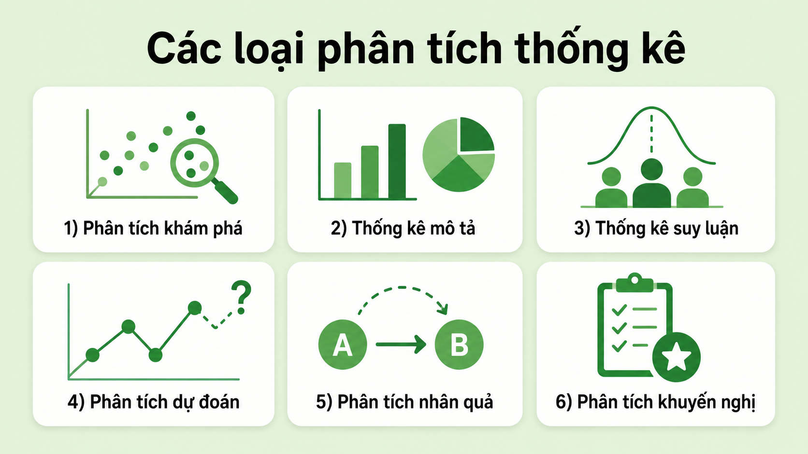

# Phân tích thống kê là gì?

**Cập nhật lần cuối:** 26 tháng 3 năm 2026

## Giới thiệu bài học

Bài học này giới thiệu những nội dung nền tảng của **phân tích thống kê**, từ quy trình thu thập và tổ chức dữ liệu đến các phương pháp mô tả, suy luận, khám phá, dự báo, khuyến nghị và phân tích nhân quả. Nội dung nhấn mạnh cách sử dụng dữ liệu và bằng chứng để hỗ trợ ra quyết định, kiểm tra giả thuyết, đánh giá sự không chắc chắn và diễn giải kết quả một cách có trách nhiệm.

Bài học kết hợp giữa khái niệm thống kê, công thức cơ bản, ví dụ Python, tình huống ứng dụng và hệ thống câu hỏi ôn tập. Qua đó, người học có thể hình thành cái nhìn tổng quan về vai trò của thống kê trong phân tích dữ liệu, nghiên cứu khoa học và hoạt động quản lý.

## Kiến thức và kỹ năng sẽ đạt được

Sau khi hoàn thành bài học, người học có thể:

- Giải thích được khái niệm và vai trò của phân tích thống kê.
- Mô tả được bốn bước chính: thu thập dữ liệu, tổ chức dữ liệu, phân tích dữ liệu, diễn giải và trình bày kết quả.
- Phân biệt được thống kê mô tả và thống kê suy luận.
- Phân biệt được EDA và CDA.
- Nhận biết được vai trò của hồi quy, kiểm định giả thuyết, khoảng tin cậy và ANOVA.
- Tính và diễn giải được trung bình, phương sai và độ lệch chuẩn ở mức cơ bản.
- Phân biệt được phân tích dự báo, phân tích khuyến nghị và phân tích nhân quả.
- Giải thích được sự khác nhau giữa tương quan và quan hệ nhân quả.
- Nhận biết được công dụng cơ bản của R, Python, SPSS và Excel.
- Lựa chọn được một số công cụ và phương pháp phù hợp với mục tiêu phân tích.
- Trình bày kết quả thống kê bằng báo cáo, biểu đồ, dashboard hoặc bài thuyết trình.
- Nêu được hạn chế, mức độ không chắc chắn và ý nghĩa thực tiễn của kết quả.
- Vận dụng kiến thức vào các tình huống trong kinh doanh, y tế, giáo dục, khoa học xã hội và môi trường.

## Cấu trúc bài học

Bài học gồm các nội dung chính sau:

1. Khái niệm và vai trò của phân tích thống kê.
2. Thu thập dữ liệu.
3. Tổ chức và làm sạch dữ liệu.
4. Phân tích dữ liệu bằng EDA, CDA, hồi quy và kiểm định giả thuyết.
5. Diễn giải và trình bày kết quả.
6. Thống kê mô tả.
7. Thống kê suy luận.
8. Phân tích dữ liệu khám phá.
9. Mô hình dự báo.
10. Phân tích khuyến nghị.
11. Phân tích nhân quả.
12. Các công cụ phân tích thống kê.
13. Tầm quan trọng và ứng dụng.
14. Câu hỏi ôn tập và bài tập tình huống.

## Yêu cầu chuẩn bị

Người học nên có:

- Kiến thức toán học phổ thông về trung bình và tỷ lệ.
- Hiểu biết cơ bản về dữ liệu, biến số, mẫu và tổng thể.
- Kiến thức Python cơ bản nếu thực hành phần mã nguồn.
- Môi trường Jupyter Notebook, JupyterLab hoặc Google Colab.
- Các thư viện `numpy`, `pandas`, `scipy`, `matplotlib`, `seaborn`, `statsmodels` và `scikit-learn`.

Có thể cài đặt các thư viện cần thiết bằng lệnh:

```bash
pip install numpy pandas scipy matplotlib seaborn statsmodels scikit-learn
```

---


Phân tích thống kê là quá trình xem xét dữ liệu nhằm hiểu dữ liệu rõ hơn và rút ra những hiểu biết hữu ích. Phương pháp này giúp nhận diện các mẫu hình, mối quan hệ và xu hướng trong dữ liệu, từ đó hỗ trợ việc ra quyết định và đưa ra dự báo.

<p align="center">
  
</p>

### Câu hỏi nhanh

**Câu 1.** Mục tiêu chính của phân tích thống kê là gì?

A. Chỉ lưu trữ dữ liệu  
B. Hiểu dữ liệu và rút ra thông tin hữu ích  
C. Chỉ tạo biểu đồ  
D. Thay thế hoàn toàn con người trong ra quyết định  

**Câu 2. Đúng hay sai?** Phân tích thống kê có thể hỗ trợ phát hiện mẫu hình, mối quan hệ và xu hướng trong dữ liệu.

---
<p align="center">
  
</p>
# Các bước trong phân tích thống kê

Phân tích thống kê thường được thực hiện theo một quy trình có cấu trúc nhằm bảo đảm kết quả chính xác và có ý nghĩa. Quy trình này hỗ trợ việc thu thập, chuẩn bị, phân tích và trình bày dữ liệu một cách hiệu quả.

---

## 1. Thu thập dữ liệu

Thu thập dữ liệu là bước đầu tiên trong quá trình phân tích thống kê. Dữ liệu cần có độ tin cậy và chất lượng phù hợp để kết quả phân tích có giá trị.

### Nguồn dữ liệu có thể bao gồm

- Khảo sát.
- Quan sát.
- Thí nghiệm.
- Cơ sở dữ liệu nội bộ.
- Dữ liệu hành chính.
- API.
- Dữ liệu công khai.
- Thiết bị cảm biến.

### Yêu cầu đối với dữ liệu

- Có liên quan đến mục tiêu nghiên cứu.
- Được thu thập từ nguồn đáng tin cậy.
- Có quy mô phù hợp.
- Có phương pháp thu thập rõ ràng.
- Hạn chế sai lệch và thiếu hụt dữ liệu.

### Ví dụ

Một doanh nghiệp muốn đánh giá mức độ hài lòng của khách hàng có thể thu thập dữ liệu bằng bảng hỏi, lịch sử mua hàng, phản hồi trực tuyến và dữ liệu từ bộ phận chăm sóc khách hàng.

### Câu hỏi nhanh

**Câu 1.** Vì sao cần thu thập dữ liệu có chất lượng?

A. Để làm tăng số lượng cột  
B. Để bảo đảm kết quả phân tích đáng tin cậy  
C. Để không cần làm sạch dữ liệu  
D. Để thay thế bước diễn giải  

**Câu 2.** Nguồn nào sau đây có thể được sử dụng để thu thập dữ liệu?

A. Khảo sát  
B. API  
C. Cơ sở dữ liệu  
D. Tất cả các phương án trên  

---

## 2. Tổ chức dữ liệu

Sau khi thu thập, dữ liệu cần được làm sạch và tổ chức để có thể phân tích đúng cách.

### Các công việc chính

- Sử dụng bảng tính, cơ sở dữ liệu hoặc công cụ lập trình.
- Xử lý giá trị thiếu.
- Sửa lỗi hoặc dữ liệu không nhất quán.
- Loại bỏ dữ liệu trùng lặp.
- Chuẩn hóa định dạng.
- Kiểm tra kiểu dữ liệu.
- Sắp xếp dữ liệu theo cấu trúc phù hợp.

### Công cụ có thể sử dụng

- Microsoft Excel.
- Google Sheets.
- SQL.
- Python với Pandas.
- R với `dplyr` và `tidyr`.
- Phần mềm cơ sở dữ liệu.

### Ví dụ với Python

```python
import pandas as pd

df = pd.read_csv("data.csv")

print(df.head())
print(df.info())
print(df.isnull().sum())
```

### Xử lý dữ liệu thiếu

```python
df["age"] = df["age"].fillna(
    df["age"].median()
)
```

### Loại bỏ dữ liệu trùng lặp

```python
df = df.drop_duplicates()
```

### Câu hỏi nhanh

**Câu 1.** Hoạt động nào thuộc bước tổ chức dữ liệu?

A. Xử lý giá trị thiếu  
B. Sửa dữ liệu không nhất quán  
C. Loại bỏ dữ liệu trùng lặp  
D. Tất cả các phương án trên  

**Câu 2.** Công cụ nào phù hợp để xử lý dữ liệu dạng bảng trong Python?

A. Pandas  
B. Matplotlib  
C. Seaborn  
D. TensorFlow  

**Câu 3. Đúng hay sai?** Dữ liệu sau khi thu thập luôn sẵn sàng để phân tích ngay.

---

## 3. Phân tích dữ liệu

Trong bước này, các kỹ thuật thống kê được áp dụng để khám phá dữ liệu và rút ra những hiểu biết có giá trị.

### Các phương pháp phổ biến

#### Phân tích dữ liệu khám phá

Phân tích dữ liệu khám phá, hay **Exploratory Data Analysis (EDA)**, được sử dụng để tìm hiểu dữ liệu, nhận diện mẫu hình, xu hướng và điểm bất thường.

Các kỹ thuật thường dùng gồm:

- Thống kê mô tả.
- Histogram.
- Box plot.
- Scatter plot.
- Ma trận tương quan.
- Phát hiện ngoại lệ.

#### Phân tích dữ liệu khẳng định

Phân tích dữ liệu khẳng định, hay **Confirmatory Data Analysis (CDA)**, được sử dụng để kiểm tra giả thuyết hoặc xác nhận những kết luận đã được đặt ra trước đó.

#### Phân tích hồi quy

Phân tích hồi quy được sử dụng để nghiên cứu mối quan hệ giữa biến phụ thuộc và một hoặc nhiều biến độc lập.

Ví dụ:

- Dự đoán doanh số từ ngân sách quảng cáo.
- Ước lượng giá nhà từ diện tích và vị trí.
- Phân tích ảnh hưởng của thời gian học đến điểm thi.

#### Kiểm định giả thuyết

Kiểm định giả thuyết được sử dụng để đánh giá xem kết quả quan sát được có ý nghĩa thống kê hay có thể chỉ xuất hiện do ngẫu nhiên.

### Câu hỏi nhanh

**Câu 1.** EDA chủ yếu được sử dụng để làm gì?

A. Khám phá dữ liệu và tìm mẫu hình  
B. Chỉ trình bày báo cáo  
C. Chỉ lưu dữ liệu  
D. Chỉ tạo mô hình tối ưu hóa  

**Câu 2.** CDA thường được sử dụng để:

A. Kiểm tra giả thuyết  
B. Xóa dữ liệu  
C. Tạo bảng tính  
D. Thu thập dữ liệu  

**Câu 3.** Phân tích hồi quy được dùng để:

A. Nghiên cứu mối quan hệ giữa các biến  
B. Chỉ xử lý dữ liệu văn bản  
C. Chỉ tạo biểu đồ tròn  
D. Loại bỏ toàn bộ ngoại lệ  

**Câu 4. Đúng hay sai?** Kiểm định giả thuyết giúp đánh giá liệu một kết quả có ý nghĩa thống kê hay không.

---

## 4. Diễn giải và trình bày kết quả

Sau khi phân tích, kết quả cần được giải thích và trình bày rõ ràng để người khác có thể hiểu và sử dụng.

### Hình thức trình bày

- Báo cáo.
- Biểu đồ.
- Đồ thị.
- Bảng điều khiển.
- Bài thuyết trình.
- Bảng thống kê.
- Bản tóm tắt dành cho nhà quản lý.

### Nguyên tắc trình bày

- Nêu rõ mục tiêu phân tích.
- Giải thích phương pháp đã sử dụng.
- Trình bày kết quả chính.
- Đưa ra ý nghĩa thực tiễn.
- Nêu hạn chế.
- Đề xuất hành động tiếp theo.
- Tránh diễn giải quá mức kết quả thống kê.

### Ví dụ

Nếu phân tích cho thấy doanh số giảm mạnh ở một khu vực, báo cáo không nên chỉ đưa ra con số giảm. Người phân tích cần giải thích:

- Khu vực nào bị ảnh hưởng.
- Mức giảm là bao nhiêu.
- Xu hướng kéo dài trong thời gian nào.
- Những yếu tố nào có thể liên quan.
- Doanh nghiệp nên xem xét hành động nào.

### Câu hỏi nhanh

**Câu 1.** Hình thức nào có thể được sử dụng để trình bày kết quả?

A. Báo cáo  
B. Biểu đồ  
C. Bảng điều khiển  
D. Tất cả các phương án trên  

**Câu 2.** Vì sao cần nêu hạn chế của phân tích?

A. Để người đọc hiểu phạm vi và độ tin cậy của kết quả  
B. Để làm báo cáo dài hơn  
C. Để tránh trình bày kết quả  
D. Để thay thế dữ liệu  

---

# Các loại phân tích thống kê

Có sáu loại phân tích thống kê chính:

1. Thống kê mô tả.
2. Thống kê suy luận.
3. Phân tích dữ liệu khám phá.
4. Mô hình dự báo.
5. Phân tích khuyến nghị.
6. Phân tích nhân quả.

<p align="center">
  
</p>
---

## 1. Thống kê mô tả

Thống kê mô tả được sử dụng để tóm tắt và tổ chức dữ liệu nhằm giúp người đọc hiểu nhanh các đặc điểm chính.

### Các kỹ thuật phổ biến

- Các đại lượng xu hướng trung tâm.
- Phương sai.
- Độ lệch chuẩn.
- Histogram.
- Biểu đồ cột.
- Box plot.

### Xu hướng trung tâm

Các đại lượng phổ biến gồm:

- **Trung bình:** Tổng các giá trị chia cho số quan sát.
- **Trung vị:** Giá trị nằm ở giữa khi dữ liệu được sắp xếp.
- **Yếu vị:** Giá trị xuất hiện nhiều nhất.

### Công thức trung bình

$$
\bar{x}
=
\frac{1}{n}
\sum_{i=1}^{n}x_i
$$

### Phương sai mẫu

$$
s^2
=
\frac{
\sum_{i=1}^{n}(x_i-\bar{x})^2
}{
n-1
}
$$

### Độ lệch chuẩn mẫu

$$
s
=
\sqrt{
\frac{
\sum_{i=1}^{n}(x_i-\bar{x})^2
}{
n-1
}
}
$$

### Ví dụ với Python

```python
print(df.describe())
print(df["income"].mean())
print(df["income"].median())
print(df["income"].std())
```

### Câu hỏi nhanh

**Câu 1.** Thống kê mô tả được sử dụng để:

A. Tóm tắt dữ liệu  
B. Chứng minh quan hệ nhân quả  
C. Chỉ xây dựng mô hình học sâu  
D. Chỉ dự báo tương lai  

**Câu 2.** Đại lượng nào đo mức độ phân tán của dữ liệu?

A. Độ lệch chuẩn  
B. Yếu vị  
C. Trung vị  
D. Tên biến  

**Câu 3.** Biểu đồ nào thường được sử dụng để phát hiện ngoại lệ?

A. Box plot  
B. Pie chart  
C. Line chart  
D. Bản đồ  

---

## 2. Thống kê suy luận

Thống kê suy luận sử dụng dữ liệu mẫu để rút ra kết luận hoặc đưa ra dự đoán về một tổng thể lớn hơn.

### Các kỹ thuật phổ biến

- Kiểm định giả thuyết.
- Khoảng tin cậy.
- Phân tích hồi quy.
- Phân tích phương sai.
- Ước lượng tham số.

### Mẫu và tổng thể

- **Tổng thể:** Toàn bộ nhóm đối tượng cần nghiên cứu.
- **Mẫu:** Một tập con được lựa chọn từ tổng thể.

### Ví dụ

Một trường đại học có 20.000 sinh viên. Thay vì khảo sát toàn bộ, nhà nghiên cứu có thể chọn mẫu 1.000 sinh viên để ước lượng mức độ hài lòng của toàn trường.

### Khoảng tin cậy

Khoảng tin cậy cung cấp một khoảng giá trị có khả năng chứa tham số thật của tổng thể.

### Câu hỏi nhanh

**Câu 1.** Thống kê suy luận sử dụng dữ liệu mẫu để:

A. Rút ra kết luận về tổng thể  
B. Chỉ mô tả mẫu  
C. Chỉ tạo biểu đồ  
D. Loại bỏ dữ liệu  

**Câu 2.** Kỹ thuật nào thuộc thống kê suy luận?

A. Kiểm định giả thuyết  
B. Khoảng tin cậy  
C. ANOVA  
D. Tất cả các phương án trên  

**Câu 3. Đúng hay sai?** Mẫu là toàn bộ đối tượng trong nghiên cứu.

---

## 3. Phân tích dữ liệu khám phá

Phân tích dữ liệu khám phá tập trung tìm hiểu dữ liệu trước khi xây dựng mô hình.

### Mục tiêu

- Hiểu cấu trúc dữ liệu.
- Phát hiện mẫu hình.
- Xem xét mối quan hệ.
- Phát hiện dữ liệu thiếu.
- Tìm giá trị ngoại lệ.
- Kiểm tra giả định ban đầu.

### Kỹ thuật phổ biến

- Scatter plot.
- Phân tích tương quan.
- Phân tích phân phối.
- Phát hiện ngoại lệ.

### Ví dụ với Python

```python
import seaborn as sns
import matplotlib.pyplot as plt

sns.histplot(
    df["income"],
    kde=True
)

plt.title("Phân phối thu nhập")
plt.show()
```

### Câu hỏi nhanh

**Câu 1.** EDA thường được thực hiện vào thời điểm nào?

A. Trước khi xây dựng mô hình  
B. Chỉ sau khi triển khai mô hình  
C. Sau khi xóa dữ liệu  
D. Không liên quan đến mô hình  

**Câu 2.** Kỹ thuật nào thuộc EDA?

A. Scatter plot  
B. Phân tích tương quan  
C. Phát hiện ngoại lệ  
D. Tất cả các phương án trên  

---

## 4. Mô hình dự báo

Mô hình dự báo sử dụng dữ liệu lịch sử để dự đoán kết quả hoặc xu hướng trong tương lai.

### Các phương pháp phổ biến

- Hồi quy tuyến tính.
- Cây quyết định.
- Mạng nơ-ron.
- Support Vector Machines.
- Random Forest.
- Mô hình chuỗi thời gian.

### Ví dụ ứng dụng

- Dự báo doanh số.
- Dự báo nhu cầu.
- Dự báo rủi ro tín dụng.
- Dự báo khả năng khách hàng rời bỏ.
- Dự báo giá.

### Ví dụ với Python

```python
from sklearn.linear_model import LinearRegression

model = LinearRegression()

model.fit(
    X_train,
    y_train
)

y_pred = model.predict(
    X_test
)
```

### Câu hỏi nhanh

**Câu 1.** Mô hình dự báo sử dụng dữ liệu nào?

A. Dữ liệu lịch sử  
B. Chỉ dữ liệu văn bản  
C. Chỉ dữ liệu thiếu  
D. Không cần dữ liệu  

**Câu 2.** Phương pháp nào có thể được dùng cho dự báo?

A. Hồi quy tuyến tính  
B. Cây quyết định  
C. Mạng nơ-ron  
D. Tất cả các phương án trên  

---

## 5. Phân tích khuyến nghị

Phân tích khuyến nghị tập trung đề xuất hành động tốt nhất dựa trên dữ liệu. Loại phân tích này đi xa hơn dự báo bằng cách đưa ra giải pháp để đạt kết quả mong muốn.

### Các phương pháp phổ biến

- Kỹ thuật tối ưu hóa.
- Mô hình mô phỏng.
- Lý thuyết quyết định.
- Phân tích kịch bản.
- Tối ưu hóa đa mục tiêu.

### Ví dụ ứng dụng

- Lựa chọn mức giá tối ưu.
- Xác định lịch sản xuất.
- Tối ưu hóa tuyến giao hàng.
- Phân bổ ngân sách quảng cáo.
- Lựa chọn danh mục đầu tư.

### Câu hỏi nhanh

**Câu 1.** Phân tích khuyến nghị trả lời câu hỏi nào?

A. Điều gì đã xảy ra?  
B. Vì sao điều đó xảy ra?  
C. Điều gì có thể xảy ra?  
D. Chúng ta nên làm gì?  

**Câu 2.** Kỹ thuật nào thường được sử dụng trong phân tích khuyến nghị?

A. Tối ưu hóa  
B. Mô phỏng  
C. Lý thuyết quyết định  
D. Tất cả các phương án trên  

---

## 6. Phân tích nhân quả

Phân tích nhân quả được sử dụng để đánh giá liệu một biến có gây ra sự thay đổi ở biến khác hay không.

### Phương pháp phổ biến

- Thí nghiệm ngẫu nhiên.
- Mô hình hồi quy.
- Ghép điểm xu hướng.
- Thí nghiệm A/B.
- Biến công cụ.
- Difference-in-differences.

### Ví dụ

Một doanh nghiệp muốn xác định liệu chương trình khuyến mại có thực sự làm tăng doanh số hay chỉ trùng với giai đoạn nhu cầu tăng tự nhiên.

### Tương quan và nhân quả

Tương quan cho biết hai biến có liên hệ với nhau. Tuy nhiên, tương quan không đủ để khẳng định quan hệ nhân quả.

Ví dụ:

- Doanh số kem và số ca cháy có thể cùng tăng vào mùa hè.
- Điều này không có nghĩa bán kem gây ra cháy.
- Nhiệt độ cao có thể là yếu tố tác động đến cả hai.

### Câu hỏi nhanh

**Câu 1.** Mục tiêu của phân tích nhân quả là:

A. Xác định quan hệ nguyên nhân và kết quả  
B. Chỉ tóm tắt dữ liệu  
C. Chỉ tính trung bình  
D. Chỉ tạo dashboard  

**Câu 2.** Phương pháp nào có thể được dùng trong phân tích nhân quả?

A. Thí nghiệm ngẫu nhiên  
B. Ghép điểm xu hướng  
C. Mô hình hồi quy  
D. Tất cả các phương án trên  

**Câu 3. Đúng hay sai?** Tương quan mạnh luôn chứng minh quan hệ nhân quả.

---

# Công cụ phân tích thống kê

## R

R là ngôn ngữ lập trình được sử dụng rộng rãi cho tính toán thống kê và trực quan hóa dữ liệu.

### Điểm mạnh

- Nhiều gói thống kê.
- Hỗ trợ trực quan hóa mạnh.
- Phù hợp với nghiên cứu học thuật.
- Cộng đồng lớn.

## Python

Python sử dụng nhiều thư viện cho phân tích và mô hình hóa dữ liệu.

### Các thư viện phổ biến

- **NumPy:** Tính toán số.
- **Pandas:** Xử lý dữ liệu.
- **SciPy:** Các phương pháp thống kê.
- **Scikit-learn:** Học máy.
- **Matplotlib:** Trực quan hóa.
- **Seaborn:** Trực quan hóa thống kê.
- **Statsmodels:** Mô hình thống kê.

## SPSS

SPSS được sử dụng phổ biến trong nghiên cứu khoa học xã hội.

### Điểm mạnh

- Giao diện trực quan.
- Hỗ trợ nhiều kiểm định thống kê.
- Phù hợp với người dùng ít lập trình.

## Microsoft Excel

Excel phù hợp với các phép tính thống kê cơ bản và trực quan hóa đơn giản.

### Điểm mạnh

- Dễ sử dụng.
- Phù hợp với dữ liệu nhỏ.
- Hỗ trợ PivotTable.
- Có các hàm thống kê cơ bản.

### Bảng so sánh

| Công cụ | Mục đích chính | Điểm nổi bật |
|---|---|---|
| **R** | Thống kê và trực quan hóa | Nhiều gói thống kê chuyên sâu |
| **Python** | Phân tích dữ liệu và mô hình hóa | Linh hoạt, tích hợp tốt với học máy |
| **SPSS** | Nghiên cứu xã hội | Giao diện dễ sử dụng |
| **Excel** | Phân tích cơ bản | Phổ biến và dễ tiếp cận |

### Câu hỏi nhanh

**Câu 1.** Công cụ nào là ngôn ngữ lập trình chuyên dùng nhiều trong thống kê?

A. R  
B. SPSS  
C. Excel  
D. PowerPoint  

**Câu 2.** Thư viện Python nào thường được sử dụng cho các phương pháp thống kê?

A. SciPy  
B. Pandas  
C. Statsmodels  
D. Cả A và C  

**Câu 3.** Công cụ nào thường được sử dụng trong nghiên cứu khoa học xã hội?

A. SPSS  
B. Matplotlib  
C. NumPy  
D. Git  

---

# Tầm quan trọng của phân tích thống kê

Phân tích thống kê có vai trò quan trọng trong nhiều hoạt động ra quyết định.

## Ra quyết định dựa trên dữ liệu

Phân tích thống kê thay thế suy đoán bằng những quyết định dựa trên dữ liệu và bằng chứng.

## Đánh giá và giảm sự không chắc chắn

Các mô hình xác suất giúp đánh giá mức độ không chắc chắn và rủi ro.

## Kiểm tra ý tưởng

Phân tích thống kê hỗ trợ kiểm định giả thuyết và xác nhận các phát hiện.

## Đánh giá hiệu quả

Phân tích thống kê giúp đo lường:

- KPI.
- Năng suất.
- Tăng trưởng kinh doanh.
- Chất lượng sản phẩm.
- Hiệu quả chiến dịch.
- Mức độ hài lòng.

### Câu hỏi nhanh

**Câu 1.** Phân tích thống kê giúp thay thế điều gì?

A. Suy đoán bằng quyết định dựa trên dữ liệu  
B. Dữ liệu bằng cảm tính  
C. Báo cáo bằng lời nói  
D. Quy trình bằng ngẫu nhiên  

**Câu 2.** Mô hình xác suất hỗ trợ:

A. Đánh giá sự không chắc chắn  
B. Xóa toàn bộ rủi ro  
C. Loại bỏ dữ liệu  
D. Chỉ tạo biểu đồ  

---

# Ứng dụng của phân tích thống kê

## Kinh doanh và thị trường

Phân tích thống kê hỗ trợ:

- Nghiên cứu thị trường.
- Kiểm soát chất lượng.
- Phân tích khách hàng.
- Ra quyết định tài chính.
- Đo lường hiệu quả kinh doanh.

## Y tế và sức khỏe cộng đồng

Phân tích thống kê được sử dụng trong:

- Nghiên cứu y học.
- Phân tích sức khỏe cộng đồng.
- Đánh giá độ an toàn của thuốc.
- Theo dõi dịch bệnh.
- Đánh giá hiệu quả điều trị.

## Giáo dục

Phân tích thống kê có thể giúp:

- Đánh giá kết quả học tập.
- Cải thiện phương pháp giảng dạy.
- Xây dựng chính sách giáo dục.
- Xác định nhóm học sinh cần hỗ trợ.

## Khoa học xã hội

Phân tích thống kê hỗ trợ:

- Nghiên cứu hành vi con người.
- Phân tích xu hướng xã hội.
- Nghiên cứu dân số.
- Đánh giá chính sách công.

## Môi trường

Phân tích thống kê được sử dụng để:

- Phân tích khí hậu.
- Theo dõi ô nhiễm.
- Đánh giá tài nguyên.
- Hỗ trợ bảo tồn.
- Dự báo rủi ro môi trường.

### Câu hỏi nhanh

**Câu 1.** Phân tích thống kê có thể được ứng dụng trong lĩnh vực nào?

A. Y tế  
B. Giáo dục  
C. Môi trường  
D. Tất cả các phương án trên  

**Câu 2.** Trong giáo dục, phân tích thống kê có thể giúp:

A. Đánh giá kết quả học tập  
B. Cải thiện phương pháp giảng dạy  
C. Hỗ trợ xây dựng chính sách  
D. Tất cả các phương án trên  

**Câu 3. Tình huống.** Một bệnh viện muốn đánh giá hiệu quả của một phương pháp điều trị mới. Phân tích thống kê có thể hỗ trợ như thế nào?

---

# Tóm tắt nội dung

| Nội dung | Mục tiêu chính |
|---|---|
| **Thu thập dữ liệu** | Thu thập dữ liệu có chất lượng từ nguồn phù hợp |
| **Tổ chức dữ liệu** | Làm sạch và cấu trúc dữ liệu |
| **Phân tích dữ liệu** | Áp dụng các kỹ thuật thống kê |
| **Diễn giải và trình bày** | Truyền đạt kết quả rõ ràng |
| **Thống kê mô tả** | Tóm tắt đặc điểm dữ liệu |
| **Thống kê suy luận** | Suy rộng từ mẫu ra tổng thể |
| **EDA** | Khám phá mẫu hình và vấn đề dữ liệu |
| **Mô hình dự báo** | Dự đoán kết quả tương lai |
| **Phân tích khuyến nghị** | Đề xuất hành động |
| **Phân tích nhân quả** | Xác định quan hệ nguyên nhân và kết quả |

---

# Câu hỏi ôn tập cuối bài

## Phần A. Câu hỏi trắc nghiệm

**Câu 1.** Phân tích thống kê là quá trình:

A. Chỉ lưu trữ dữ liệu  
B. Xem xét dữ liệu để rút ra thông tin hữu ích  
C. Chỉ thiết kế biểu đồ  
D. Chỉ xây dựng mô hình học sâu  

**Câu 2.** Bước đầu tiên trong phân tích thống kê là:

A. Thu thập dữ liệu  
B. Trình bày kết quả  
C. Xây dựng mô hình  
D. Kiểm định giả thuyết  

**Câu 3.** Hoạt động nào thuộc tổ chức dữ liệu?

A. Xử lý giá trị thiếu  
B. Sửa lỗi dữ liệu  
C. Chuẩn hóa định dạng  
D. Tất cả các phương án trên  

**Câu 4.** Phương pháp nào được dùng để khám phá mẫu hình trong dữ liệu?

A. EDA  
B. CDA  
C. Tối ưu hóa  
D. Mô phỏng  

**Câu 5.** Thống kê suy luận sử dụng:

A. Dữ liệu mẫu để suy ra tổng thể  
B. Chỉ dữ liệu tổng thể  
C. Chỉ biểu đồ  
D. Chỉ dữ liệu văn bản  

**Câu 6.** Loại phân tích nào dự báo kết quả tương lai?

A. Mô hình dự báo  
B. Thống kê mô tả  
C. EDA  
D. Phân tích dữ liệu thiếu  

**Câu 7.** Loại phân tích nào đề xuất hành động tốt nhất?

A. Phân tích khuyến nghị  
B. Thống kê mô tả  
C. EDA  
D. Kiểm định dữ liệu  

**Câu 8.** Loại phân tích nào nghiên cứu quan hệ nguyên nhân và kết quả?

A. Phân tích nhân quả  
B. Phân tích mô tả  
C. Phân tích dữ liệu thiếu  
D. Phân tích trực quan  

**Câu 9.** Công cụ nào được sử dụng phổ biến trong khoa học xã hội?

A. SPSS  
B. Git  
C. HTML  
D. CSS  

**Câu 10.** Phát biểu nào đúng?

A. Tương quan luôn chứng minh nhân quả  
B. Phân tích thống kê hỗ trợ ra quyết định dựa trên bằng chứng  
C. Dữ liệu không cần làm sạch  
D. Mẫu luôn bằng tổng thể  

## Phần B. Câu hỏi đúng/sai

**Câu 1.** Phân tích thống kê chỉ được sử dụng trong kinh doanh.

**Câu 2.** Dữ liệu cần được tổ chức trước khi phân tích.

**Câu 3.** EDA hỗ trợ khám phá mẫu hình và giá trị bất thường.

**Câu 4.** Thống kê mô tả được sử dụng để suy rộng từ mẫu ra tổng thể.

**Câu 5.** Thống kê suy luận có thể sử dụng kiểm định giả thuyết.

**Câu 6.** Phân tích khuyến nghị chỉ dự báo tương lai mà không đề xuất hành động.

**Câu 7.** Phân tích nhân quả khác với phân tích tương quan.

**Câu 8.** Việc trình bày kết quả là một phần của phân tích thống kê.

## Phần C. Câu hỏi tự luận

**Câu 1.** Trình bày bốn bước chính trong phân tích thống kê.

**Câu 2.** Phân biệt thống kê mô tả và thống kê suy luận.

**Câu 3.** Phân biệt EDA và CDA.

**Câu 4.** Phân biệt mô hình dự báo và phân tích khuyến nghị.

**Câu 5.** Vì sao tương quan không chứng minh quan hệ nhân quả?

**Câu 6.** Nêu bốn công cụ phân tích thống kê và công dụng chính.

## Phần D. Bài tập tình huống

### Bài 1. Phân tích mức độ hài lòng

Một doanh nghiệp thu thập dữ liệu đánh giá của 500 khách hàng.

1. Xác định mục tiêu phân tích.
2. Nêu các bước làm sạch dữ liệu.
3. Đề xuất ba thống kê mô tả.
4. Đề xuất hai biểu đồ phù hợp.
5. Nêu cách trình bày kết quả cho nhà quản lý.

### Bài 2. Đánh giá phương pháp giảng dạy

Một trường học muốn biết phương pháp giảng dạy mới có cải thiện điểm số hay không.

1. Xác định tổng thể và mẫu.
2. Đề xuất giả thuyết nghiên cứu.
3. Xác định loại phân tích phù hợp.
4. Nêu các yếu tố có thể gây nhiễu.
5. Giải thích vì sao cần thận trọng khi kết luận nhân quả.

### Bài 3. Dự báo doanh số

Một doanh nghiệp có dữ liệu doanh số trong ba năm.

1. Nêu các bước chuẩn bị dữ liệu.
2. Đề xuất một mô hình dự báo.
3. Nêu cách chia dữ liệu huấn luyện và kiểm định.
4. Đề xuất chỉ số đánh giá.
5. Nêu cách chuyển kết quả thành quyết định kinh doanh.

---

# Tài liệu tham khảo và liên kết hữu ích

Các tài liệu dưới đây bao quát các công cụ, thư viện và nhóm phương pháp được sử dụng trong bài, bao gồm thống kê mô tả, thống kê suy luận, hồi quy, kiểm định giả thuyết, học máy và trực quan hóa dữ liệu.

1. [What is Statistical Analysis? — GeeksforGeeks](https://www.geeksforgeeks.org/data-analysis/what-is-statistical-analysis/)  
   Bài viết tham khảo ban đầu về khái niệm, quy trình, loại hình và ứng dụng của phân tích thống kê.

2. [NumPy Documentation](https://numpy.org/doc/stable/)  
   Tài liệu chính thức của NumPy cho tính toán số trong Python.

3. [Pandas Documentation](https://pandas.pydata.org/docs/)  
   Tài liệu chính thức của Pandas cho tổ chức, làm sạch và xử lý dữ liệu.

4. [SciPy Statistics](https://docs.scipy.org/doc/scipy/reference/stats.html)  
   Tài liệu chính thức cho các phương pháp thống kê trong SciPy.

5. [Scikit-learn Documentation](https://scikit-learn.org/stable/)  
   Tài liệu chính thức cho các mô hình dự báo và học máy.

6. [Statsmodels Documentation](https://www.statsmodels.org/stable/index.html)  
   Tài liệu chính thức cho mô hình thống kê, hồi quy và kiểm định giả thuyết.

7. [R Project for Statistical Computing](https://www.r-project.org/)  
   Trang chính thức của ngôn ngữ R.

8. [IBM SPSS Statistics](https://www.ibm.com/products/spss-statistics)  
   Thông tin về phần mềm SPSS cho phân tích thống kê.

9. [Microsoft Excel](https://www.microsoft.com/microsoft-365/excel)  
   Công cụ bảng tính hỗ trợ các phép tính và trực quan hóa thống kê cơ bản.

> **Lưu ý:** Nên ưu tiên tài liệu chính thức của các công cụ và thư viện vì cú pháp, tham số và chức năng có thể thay đổi giữa các phiên bản.

---

# Đáp án và gợi ý trả lời

<details>
<summary><strong>Nhấn để hiển thị đáp án</strong></summary>

## Đáp án câu hỏi nhanh — Phần mở đầu

### Câu 1

B. Hiểu dữ liệu và rút ra thông tin hữu ích.

### Câu 2

Đúng.

## Đáp án câu hỏi nhanh — Thu thập dữ liệu

### Câu 1

B. Để bảo đảm kết quả phân tích đáng tin cậy.

### Câu 2

D. Tất cả các phương án trên.

## Đáp án câu hỏi nhanh — Tổ chức dữ liệu

### Câu 1

D. Tất cả các phương án trên.

### Câu 2

A. Pandas.

### Câu 3

Sai. Dữ liệu thường cần được làm sạch và tổ chức trước khi phân tích.

## Đáp án câu hỏi nhanh — Phân tích dữ liệu

### Câu 1

A. Khám phá dữ liệu và tìm mẫu hình.

### Câu 2

A. Kiểm tra giả thuyết.

### Câu 3

A. Nghiên cứu mối quan hệ giữa các biến.

### Câu 4

Đúng.

## Đáp án câu hỏi nhanh — Diễn giải và trình bày

### Câu 1

D. Tất cả các phương án trên.

### Câu 2

A. Để người đọc hiểu phạm vi và độ tin cậy của kết quả.

## Đáp án câu hỏi nhanh — Thống kê mô tả

### Câu 1

A. Tóm tắt dữ liệu.

### Câu 2

A. Độ lệch chuẩn.

### Câu 3

A. Box plot.

## Đáp án câu hỏi nhanh — Thống kê suy luận

### Câu 1

A. Rút ra kết luận về tổng thể.

### Câu 2

D. Tất cả các phương án trên.

### Câu 3

Sai. Mẫu là một tập con của tổng thể.

## Đáp án câu hỏi nhanh — EDA

### Câu 1

A. Trước khi xây dựng mô hình.

### Câu 2

D. Tất cả các phương án trên.

## Đáp án câu hỏi nhanh — Mô hình dự báo

### Câu 1

A. Dữ liệu lịch sử.

### Câu 2

D. Tất cả các phương án trên.

## Đáp án câu hỏi nhanh — Phân tích khuyến nghị

### Câu 1

D. Chúng ta nên làm gì?

### Câu 2

D. Tất cả các phương án trên.

## Đáp án câu hỏi nhanh — Phân tích nhân quả

### Câu 1

A. Xác định quan hệ nguyên nhân và kết quả.

### Câu 2

D. Tất cả các phương án trên.

### Câu 3

Sai. Tương quan không đủ để chứng minh nhân quả.

## Đáp án câu hỏi nhanh — Công cụ

### Câu 1

A. R.

### Câu 2

D. Cả A và C.

### Câu 3

A. SPSS.

## Đáp án câu hỏi nhanh — Tầm quan trọng

### Câu 1

A. Suy đoán bằng quyết định dựa trên dữ liệu.

### Câu 2

A. Đánh giá sự không chắc chắn.

## Đáp án câu hỏi nhanh — Ứng dụng

### Câu 1

D. Tất cả các phương án trên.

### Câu 2

D. Tất cả các phương án trên.

### Câu 3

Có thể so sánh kết quả giữa nhóm điều trị và nhóm đối chứng, kiểm định giả thuyết, ước lượng khoảng tin cậy và đánh giá các yếu tố gây nhiễu.

## Đáp án ôn tập cuối bài

### Phần A

1. B  
2. A  
3. D  
4. A  
5. A  
6. A  
7. A  
8. A  
9. A  
10. B  

### Phần B

1. Sai.  
2. Đúng.  
3. Đúng.  
4. Sai.  
5. Đúng.  
6. Sai.  
7. Đúng.  
8. Đúng.  

### Phần C

**Câu 1.** Bốn bước chính gồm thu thập dữ liệu, tổ chức dữ liệu, phân tích dữ liệu, diễn giải và trình bày kết quả.

**Câu 2.** Thống kê mô tả tóm tắt đặc điểm của dữ liệu hiện có. Thống kê suy luận sử dụng dữ liệu mẫu để rút ra kết luận về tổng thể.

**Câu 3.** EDA tập trung khám phá dữ liệu và hình thành hiểu biết ban đầu. CDA tập trung kiểm tra giả thuyết hoặc xác nhận những kết luận đã đặt ra.

**Câu 4.** Mô hình dự báo ước lượng điều gì có thể xảy ra. Phân tích khuyến nghị đề xuất hành động nên thực hiện.

**Câu 5.** Có thể tồn tại biến gây nhiễu, quan hệ đảo chiều hoặc sự trùng hợp ngẫu nhiên. Tương quan chỉ đo sự liên hệ.

**Câu 6.** R dùng cho tính toán thống kê; Python dùng cho phân tích và mô hình hóa; SPSS phù hợp với nghiên cứu xã hội; Excel phù hợp với phân tích cơ bản.

### Phần D

Đây là các bài tập mở. Bài làm cần trình bày rõ mục tiêu, dữ liệu, phương pháp, kết quả và cách diễn giải. Các kết luận cần phù hợp với dữ liệu và không được diễn giải vượt quá bằng chứng thống kê.

</details>
