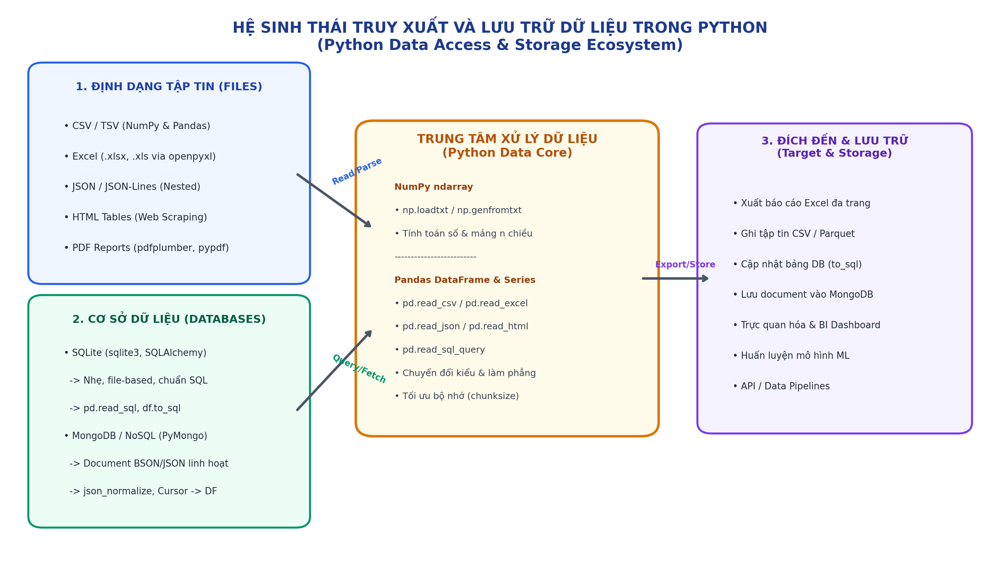
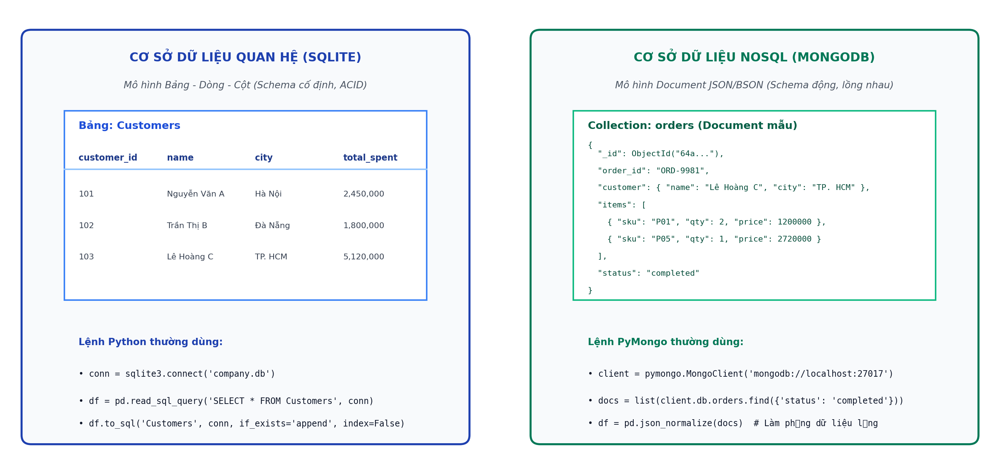
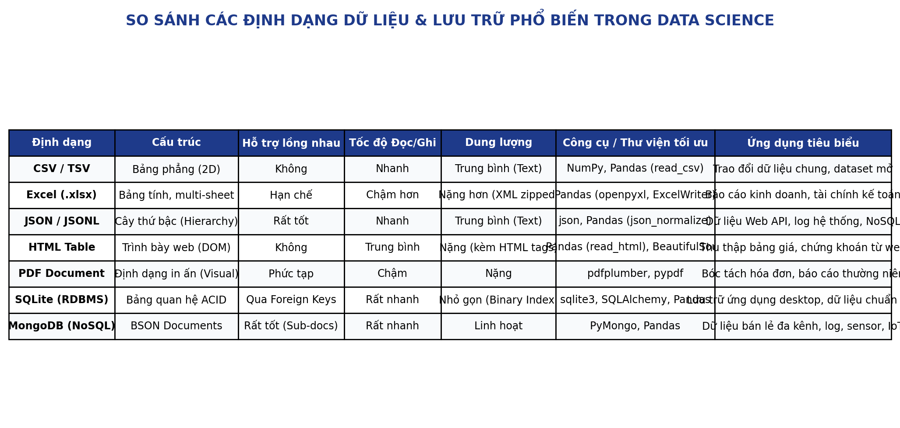

# Tuần 05: Truy xuất và Lưu trữ Dữ liệu (Data Access and Storage)

**Học phần:** Phân tích dữ liệu với Python (DSAI1005)  
**Đơn vị phụ trách:** Khoa Khoa học dữ liệu & Trí tuệ nhân tạo – Đại học Kinh tế Quốc dân (NEU)  
**Giảng viên:** TS. Vũ Đức Minh (`minhvd@neu.edu.vn`)  
**Chuẩn đầu ra học phần (CLO):** CLO 5.4 – Truy xuất và lưu trữ dữ liệu

---

<p align="center">
  
</p>

---

## 🎯 Mục tiêu bài học (Learning Objectives)

Sau khi hoàn thành tuần học này, sinh viên có khả năng:

1. **Đọc và ghi dữ liệu CSV bằng NumPy và Pandas:**
   - Sử dụng `np.loadtxt` cho mảng số thuần túy và `np.genfromtxt` để xử lý dữ liệu hỗn hợp, giá trị khuyết.
   - Làm chủ hàm `pd.read_csv()` với các tham số then chốt: `sep`/`delimiter`, `header`, `names`, `index_col`, `usecols`, `dtype`, `parse_dates`, `na_values`, `encoding`.
   - Quản lý và xử lý tập dữ liệu lớn bằng kỹ thuật phân đoạn dữ liệu (`chunksize` iterator) nhằm tối ưu bộ nhớ RAM.
   - Xuất dữ liệu sạch bằng `df.to_csv()` với tùy chọn phân tách, nén (`gzip`, `zip`) và mã hóa UTF-8.

2. **Làm việc với các định dạng tệp đa dạng (Excel, JSON, HTML, PDF):**
   - Đọc và ghi bảng tính Excel (`.xlsx`, `.xls`) đa trang tính (multi-sheet) bằng `pd.read_excel()` và `pd.ExcelWriter()` (engine `openpyxl`).
   - Xử lý cấu trúc dữ liệu JSON từ Web APIs và tệp cục bộ; thành thạo kỹ thuật làm phẳng dữ liệu lồng nhau phức tạp (nested JSON) với `pd.json_normalize()`.
   - Trích xuất tự động các bảng thống kê kinh tế, tài chính từ trang web bằng `pd.read_html()` và kết hợp thư viện BeautifulSoup.
   - Khám phá phương pháp trích xuất dữ liệu dạng bảng và văn bản từ báo cáo PDF bằng `pdfplumber` / `pypdf`.

3. **Kết nối, truy vấn và lưu trữ Cơ sở dữ liệu Quan hệ (Relational DB) và NoSQL:**
   - Kết nối cơ sở dữ liệu quan hệ SQLite bằng `sqlite3` và `SQLAlchemy`.
   - Thực thi các câu lệnh SQL, nạp kết quả truy vấn trực tiếp vào DataFrame bằng `pd.read_sql_query()` và ghi dữ liệu ngược vào database với `df.to_sql()`.
   - Kết nối cơ sở dữ liệu hướng tài liệu NoSQL MongoDB thông qua thư viện `pymongo` (`MongoClient`).
   - Thực hiện các thao tác CRUD (`insert_one`, `insert_many`, `find`, `update_one`, `delete_many`), chuyển đổi con trỏ Mongo Cursor thành Pandas DataFrame và xử lý trường khóa BSON `ObjectId`.

4. **Xây dựng Pipeline Tích hợp Dữ liệu Đa nguồn (End-to-End Data Pipeline):**
   - Tích hợp dữ liệu từ nhiều nguồn khác nhau (CSV, Excel, JSON API, SQLite, MongoDB), làm sạch, đồng bộ và xuất báo cáo quản trị kinh doanh chuẩn hóa.

---

<p align="center">
  
</p>

---

## 📁 Cấu trúc thư mục tài liệu (Directory Structure)

```text
lectures/part05-data-access-and-storage/
├── README.md                      # Tóm tắt lý thuyết, chuẩn đầu ra & hướng dẫn tuần học
├── data-access-storage-vn.md      # Bài giảng lý thuyết chi tiết toàn diện (Tiếng Việt)
├── data-access-storage-en.md      # Comprehensive reading material (English - 100% English)
├── data-access-storage-vn.tex     # Mã nguồn Slide LaTeX Beamer (Tiếng Việt)
├── data-access-storage-vn.pdf     # Slide bài giảng PDF hoàn chỉnh (Tiếng Việt)
├── data-access-storage-en.tex     # LaTeX Beamer slide source code (English)
├── data-access-storage-en.pdf     # Complete lecture presentation PDF (English)
├── data/                          # Thư mục chứa tập dữ liệu thực hành mẫu
│   ├── customers.csv              # Dữ liệu khách hàng mẫu (CSV)
│   ├── products.xlsx              # Bảng tính Excel 3 sheets (Products, Categories, Inventory)
│   ├── ecommerce_transactions.json# Dữ liệu đơn hàng cấu trúc JSON lồng nhau
│   ├── financial_quotes.html      # Trang web chứa bảng giá chứng khoán & tỷ giá ngoại tệ
│   └── company.db                 # Database SQLite mẫu (departments, employees, sales)
└── images/                        # Sơ đồ kiến trúc & hình ảnh trực quan hóa
    ├── data-access-storage-overview.png
    ├── relational-vs-nosql.png
    └── data-formats-comparison.png
```

---

<p align="center">
  
</p>

---

## 🚀 Hướng dẫn học tập (Study Guide)

1. **Đọc tài liệu lý thuyết:** Nghiên cứu kỹ tệp [data-access-storage-vn.md](data-access-storage-vn.md) (hoặc phiên bản tiếng Anh [data-access-storage-en.md](data-access-storage-en.md)) để nắm vững nguyên lý hoạt động của từng parser và driver kết nối cơ sở dữ liệu.
2. **Theo dõi Slide bài giảng:** Mở slide thuyết trình [data-access-storage-vn.pdf](data-access-storage-vn.pdf) để có cái nhìn trực quan, súc tích về cú pháp, workflow và so sánh công nghệ.
3. **Thực hành trên dữ liệu mẫu:** Sử dụng trực tiếp các tệp dữ liệu trong thư mục `data/` (`customers.csv`, `products.xlsx`, `ecommerce_transactions.json`, `financial_quotes.html`, `company.db`) để chạy thử toàn bộ đoạn mã trong bài học.
4. **Xây dựng Pipeline tổng hợp:** Hoàn thành bài tập tình huống cuối bài học để rèn luyện kỹ năng trích xuất dữ liệu đa định dạng và lưu trữ đồng bộ vào SQLite và MongoDB.
