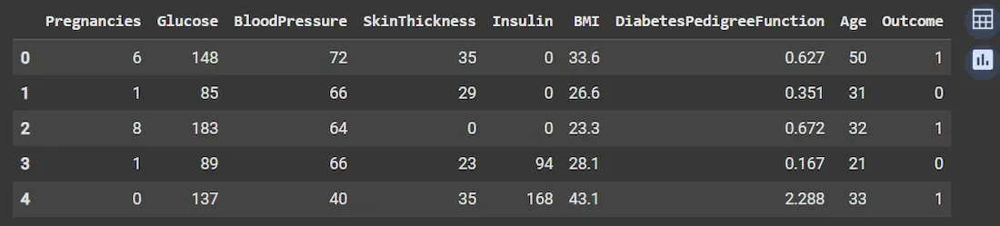
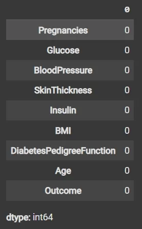
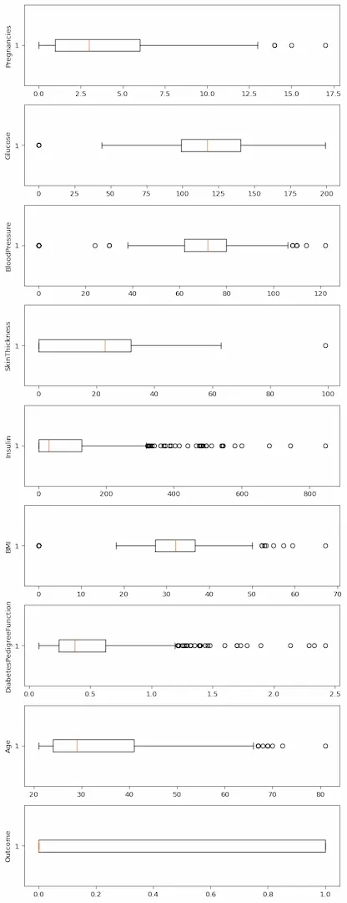
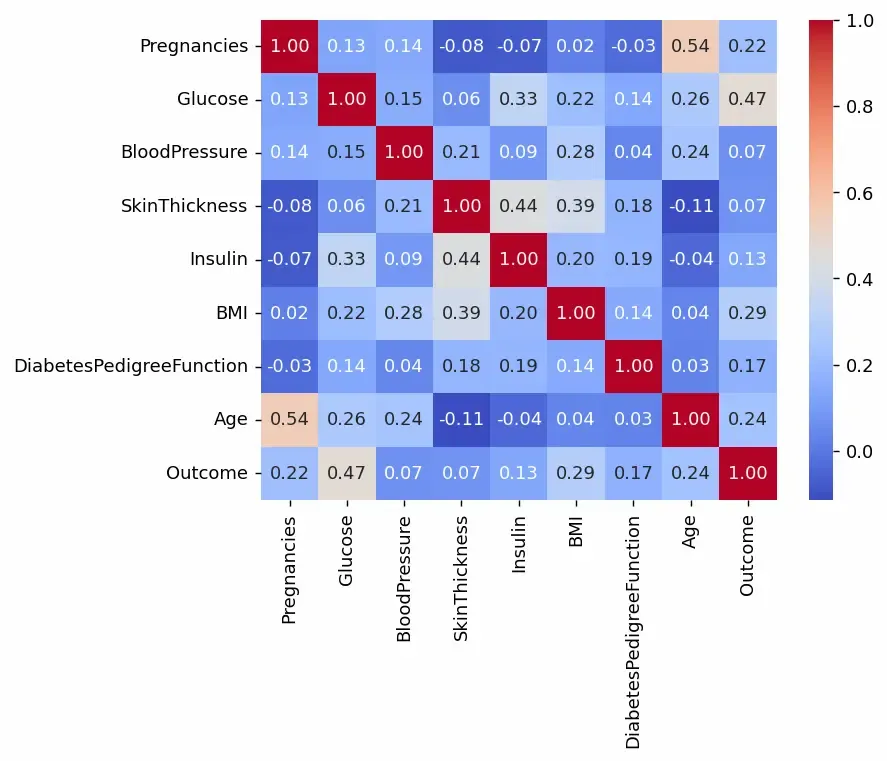
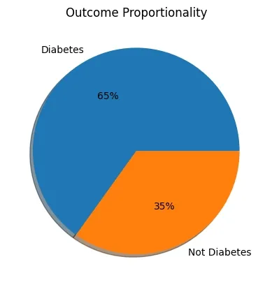
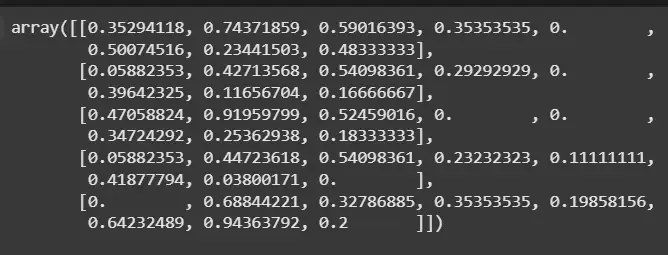
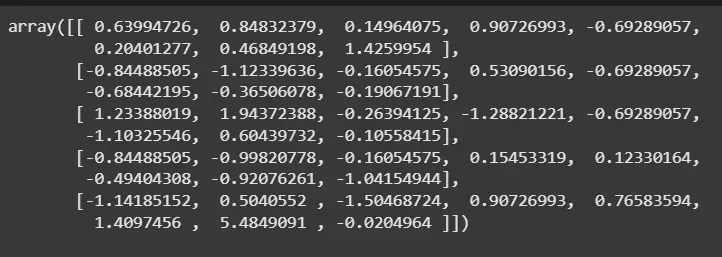

# Tiền xử lý dữ liệu với Python (Data Preprocessing in Python)

## Tóm tắt bài học

Tiền xử lý dữ liệu (**data preprocessing**) là quá trình làm sạch, biến đổi và tổ chức dữ liệu thô trước khi thực hiện phân tích hoặc xây dựng mô hình học máy. Trong thực tế, dữ liệu hiếm khi ở trạng thái có thể đưa trực tiếp vào mô hình: có thể tồn tại giá trị thiếu, giá trị bất thường, kiểu dữ liệu chưa phù hợp, biến phân loại, các đặc trưng có thang đo rất khác nhau hoặc dữ liệu bị mất cân bằng.

Một quy trình tiền xử lý tốt giúp mô hình học được các quy luật có ý nghĩa thay vì nhiễu, hạn chế sai lệch trong phân tích, giảm nguy cơ **data leakage**, đồng thời làm cho kết quả phân tích và mô hình dễ diễn giải hơn.

Bài học này sử dụng **Pandas**, **NumPy**, **Matplotlib**, **Seaborn** và các công cụ tiền xử lý của **scikit-learn** để minh họa các bước chính:

1. Nạp và kiểm tra dữ liệu.
2. Xác định kiểu dữ liệu và cấu trúc dữ liệu.
3. Phát hiện và xử lý giá trị thiếu.
4. Phát hiện và đánh giá ngoại lệ.
5. Phân tích phân phối và mối quan hệ giữa các biến.
6. Xử lý biến phân loại.
7. Tách biến đầu vào và biến mục tiêu.
8. Chia dữ liệu thành tập huấn luyện và tập kiểm tra.
9. Chuẩn hóa hoặc đưa dữ liệu về cùng thang đo.
10. Tổ chức tiền xử lý bằng `Pipeline` để hạn chế sai sót và data leakage.

---

## 1. Mục tiêu bài học

Sau bài học này, người học có thể:

- Giải thích được vai trò của tiền xử lý dữ liệu trong phân tích dữ liệu và học máy.
- Sử dụng Pandas để kiểm tra cấu trúc, kiểu dữ liệu và giá trị thiếu.
- Phân biệt được **missing value**, **outlier** và giá trị không hợp lệ.
- Sử dụng thống kê mô tả và biểu đồ để đánh giá chất lượng dữ liệu.
- Áp dụng phương pháp IQR để phát hiện ngoại lệ.
- Hiểu được khi nào nên giữ, biến đổi hoặc loại bỏ ngoại lệ.
- Xử lý các biến phân loại bằng mã hóa phù hợp.
- Tách dữ liệu thành `X` và `y`.
- Phân biệt **normalization** và **standardization**.
- Áp dụng `MinMaxScaler` và `StandardScaler`.
- Hiểu được vì sao các phép biến đổi phải được học từ **training set** thay vì toàn bộ dữ liệu.
- Xây dựng một quy trình tiền xử lý cơ bản bằng `scikit-learn`.

---

## 2. Tiền xử lý dữ liệu là gì?

**Data preprocessing** là tập hợp các bước biến dữ liệu thô thành dữ liệu phù hợp cho phân tích và mô hình hóa.

Một quy trình học máy có thể được hình dung như sau:

```text
Dữ liệu thô
    ↓
Kiểm tra và làm sạch
    ↓
Biến đổi dữ liệu
    ↓
Tạo/chọn đặc trưng
    ↓
Chia dữ liệu
    ↓
Tiền xử lý phù hợp
    ↓
Huấn luyện mô hình
    ↓
Đánh giá mô hình
```

Tiền xử lý không phải chỉ là "xóa dữ liệu lỗi". Một quyết định tiền xử lý có thể làm thay đổi đáng kể kết quả của mô hình.

Ví dụ:

- Một giá trị doanh thu bằng `0` có thể là doanh nghiệp không có doanh thu, nhưng cũng có thể là dữ liệu chưa được nhập.
- Một đơn hàng trị giá rất lớn có thể là lỗi nhập liệu, nhưng cũng có thể là một khách hàng doanh nghiệp đặc biệt quan trọng.
- Nếu cột `Total_Payment` được tính trực tiếp từ biến mục tiêu cần dự đoán, sử dụng cột này có thể gây **target leakage**.
- Nếu chuẩn hóa dữ liệu trước khi chia train/test, thông tin từ test set có thể bị "rò rỉ" vào quá trình huấn luyện.

Vì vậy, tiền xử lý cần kết hợp cả **kỹ thuật dữ liệu** và **hiểu biết về ngữ cảnh của bài toán**.

---

## 3. Vì sao cần tiền xử lý dữ liệu?

### 3.1. Cải thiện chất lượng đầu vào

Mô hình học máy chỉ có thể học từ dữ liệu được cung cấp. Nếu dữ liệu sai, thiếu hoặc không nhất quán, kết quả mô hình cũng có thể sai lệch.

Nguyên tắc thường được diễn đạt bằng câu:

> **Garbage in, garbage out.**

### 3.2. Giảm tác động của nhiễu và sai lệch

Dữ liệu thực tế có thể chứa:

- lỗi nhập liệu;
- giá trị thiếu;
- bản ghi trùng;
- đơn vị đo không thống nhất;
- giá trị cực đoan;
- biến không cần thiết;
- dữ liệu sai kiểu.

Tiền xử lý giúp nhận diện và xử lý các vấn đề này trước khi mô hình hóa.

### 3.3. Giúp thuật toán hoạt động đúng

Một số thuật toán nhạy cảm với thang đo của biến.

Ví dụ, giả sử có hai biến:

- `Income`: từ 5.000.000 đến 100.000.000;
- `Age`: từ 18 đến 70.

Nếu dùng khoảng cách Euclidean trực tiếp, biến `Income` có thể chi phối gần như toàn bộ khoảng cách. Điều này ảnh hưởng rõ rệt tới các thuật toán như:

- k-Nearest Neighbors;
- k-Means;
- Support Vector Machine;
- Neural Networks.

### 3.4. Hỗ trợ phân tích khám phá dữ liệu

Quá trình tiền xử lý thường đi cùng **Exploratory Data Analysis (EDA)**. Thống kê mô tả và trực quan hóa giúp người phân tích phát hiện:

- phân phối bất thường;
- giá trị ngoài phạm vi;
- quan hệ mạnh giữa các biến;
- mất cân bằng lớp;
- nhóm dữ liệu khác biệt.

---

## 4. Bước 1 — Import thư viện và nạp dữ liệu

Ví dụ sử dụng bộ dữ liệu `diabetes.csv`.

```python
import pandas as pd
import numpy as np

import matplotlib.pyplot as plt
import seaborn as sns

from sklearn.model_selection import train_test_split
from sklearn.preprocessing import MinMaxScaler, StandardScaler
```

Đọc dữ liệu:

```python
df = pd.read_csv("diabetes.csv")
df.head()
```

`df.head()` hiển thị 5 dòng đầu tiên, giúp kiểm tra nhanh:

- tên cột;
- cách dữ liệu được lưu;
- kiểu giá trị;
- một số lỗi rõ ràng.



### Một số câu lệnh hữu ích khi vừa nạp dữ liệu

```python
df.shape
```

Trả về:

```text
(số_dòng, số_cột)
```

```python
df.columns
```

Hiển thị tên các cột.

```python
df.head(10)
```

Hiển thị 10 dòng đầu tiên.

```python
df.tail()
```

Hiển thị 5 dòng cuối.

```python
df.sample(5)
```

Lấy ngẫu nhiên 5 bản ghi để quan sát.

### Tự kiểm tra

1. `df.shape` khác gì `df.size`?
2. Vì sao chỉ xem `df.head()` là chưa đủ để đánh giá chất lượng dữ liệu?
3. Trong dữ liệu kinh doanh, một **row** thường có thể đại diện cho những đối tượng nào?

---

## 5. Bước 2 — Kiểm tra cấu trúc và kiểu dữ liệu

### 5.1. Sử dụng `df.info()`

```python
df.info()
```

`df.info()` cung cấp:

- số lượng bản ghi;
- số lượng cột;
- tên cột;
- số giá trị không bị thiếu;
- kiểu dữ liệu;
- dung lượng bộ nhớ.

Ví dụ các kiểu dữ liệu phổ biến:

| Kiểu | Ý nghĩa |
|---|---|
| `int64` | số nguyên |
| `float64` | số thực |
| `object` | thường là chuỗi hoặc dữ liệu hỗn hợp |
| `bool` | đúng/sai |
| `datetime64` | ngày và thời gian |
| `category` | biến phân loại |

### 5.2. Kiểm tra giá trị thiếu

```python
df.isnull().sum()
```

Hoặc:

```python
df.isna().sum()
```

Hai câu lệnh trên thường được dùng tương đương.



Để tính tỷ lệ thiếu:

```python
missing_rate = df.isna().mean() * 100
print(missing_rate)
```

### Lưu ý quan trọng: thiếu dữ liệu không phải lúc nào cũng được lưu dưới dạng `NaN`

Một tập dữ liệu có thể dùng các giá trị như:

```text
0
-1
999
"Unknown"
"N/A"
"?"
```

để biểu diễn dữ liệu không có sẵn.

Do đó, cần hiểu ý nghĩa của từng biến chứ không nên chỉ dựa vào:

```python
df.isnull().sum()
```

Ví dụ, trong dữ liệu y tế, một số biến như glucose hoặc huyết áp bằng `0` có thể cần được xem xét về mặt nghiệp vụ thay vì mặc nhiên coi đó là một phép đo hợp lệ.

Trong dữ liệu kinh doanh, điều tương tự có thể xảy ra với:

- doanh thu bằng `0`;
- tuổi khách hàng bằng `0`;
- thời gian giao hàng bằng `999`;
- số lượng tồn kho bằng `-1`.

### Bài tập nhỏ

Viết mã để:

1. In số dòng và số cột.
2. In kiểu dữ liệu của từng biến.
3. Tính số lượng giá trị thiếu của từng cột.
4. Tính tỷ lệ phần trăm giá trị thiếu.

---

## 6. Bước 3 — Thống kê mô tả

Sử dụng:

```python
df.describe()
```

Với các biến số, `describe()` thường cung cấp:

- `count`: số quan sát;
- `mean`: trung bình;
- `std`: độ lệch chuẩn;
- `min`: giá trị nhỏ nhất;
- `25%`: tứ phân vị thứ nhất;
- `50%`: trung vị;
- `75%`: tứ phân vị thứ ba;
- `max`: giá trị lớn nhất.

Đối với toàn bộ các cột, kể cả biến phân loại:

```python
df.describe(include="all")
```

### Vì sao thống kê mô tả quan trọng?

Giả sử cột `Age` có:

```text
min = -3
max = 245
```

Ta có cơ sở để nghi ngờ dữ liệu có vấn đề.

Hoặc cột `Monthly_Spending` có:

```text
median = 1.2 triệu
max = 950 triệu
```

Giá trị lớn nhất cần được kiểm tra thêm để xác định đây là:

- khách hàng đặc biệt;
- giao dịch doanh nghiệp;
- lỗi nhập liệu;
- khác biệt đơn vị đo.

### Tự kiểm tra

Nếu một biến có `mean` lớn hơn rất nhiều so với `median`, điều đó có thể gợi ý điều gì về phân phối của biến?

---

## 7. Bước 4 — Trực quan hóa để phát hiện ngoại lệ

### 7.1. Boxplot

Boxplot giúp quan sát:

- trung vị;
- khoảng tứ phân vị;
- độ phân tán;
- các điểm nằm xa phần lớn dữ liệu.

Ví dụ:

```python
plt.figure(figsize=(8, 4))
plt.boxplot(df["Insulin"], vert=False)
plt.xlabel("Insulin")
plt.title("Boxplot of Insulin")
plt.show()
```

Có thể lặp qua nhiều cột số:

```python
numeric_cols = df.select_dtypes(include=np.number).columns

fig, axes = plt.subplots(
    len(numeric_cols),
    1,
    figsize=(8, 3 * len(numeric_cols))
)

for i, col in enumerate(numeric_cols):
    axes[i].boxplot(df[col].dropna(), vert=False)
    axes[i].set_title(col)

plt.tight_layout()
plt.show()
```


### 7.2. Histogram

Histogram giúp quan sát hình dạng phân phối.

```python
df["Insulin"].hist(bins=30)
plt.xlabel("Insulin")
plt.ylabel("Frequency")
plt.title("Distribution of Insulin")
plt.show()
```

Có thể dùng Seaborn:

```python
sns.histplot(data=df, x="Insulin", kde=True)
plt.show()
```

---

## 8. Ngoại lệ (Outlier) là gì?

**Outlier** là quan sát nằm xa phần lớn các quan sát còn lại.

Tuy nhiên:

> **Outlier không đồng nghĩa với dữ liệu sai.**

Ví dụ trong kinh doanh:

- một khách hàng mua 500 triệu đồng trong khi phần lớn khách hàng chỉ mua vài triệu;
- một đơn hàng quốc tế có thời gian giao hàng 45 ngày;
- một cửa hàng có doanh thu cao gấp 10 lần các cửa hàng khác.

Các điểm này có thể hoàn toàn hợp lệ.

Vì vậy, mục tiêu đầu tiên là **phát hiện và điều tra**, không phải tự động xóa.

---

## 9. Bước 5 — Phát hiện ngoại lệ bằng IQR

### 9.1. Công thức

Gọi:

- \(Q_1\): phân vị 25%;
- \(Q_3\): phân vị 75%.

Khi đó:

$$
IQR = Q_3 - Q_1
$$

Ngưỡng thường dùng:

$$
Lower = Q_1 - 1.5 \times IQR
$$

$$
Upper = Q_3 + 1.5 \times IQR
$$

Các giá trị nhỏ hơn `Lower` hoặc lớn hơn `Upper` được đánh dấu là các điểm cần xem xét.

### 9.2. Thực hiện bằng NumPy

```python
q1, q3 = np.percentile(df["Insulin"].dropna(), [25, 75])

iqr = q3 - q1

lower = q1 - 1.5 * iqr
upper = q3 + 1.5 * iqr

print("Lower bound:", lower)
print("Upper bound:", upper)
```

Xác định các ngoại lệ:

```python
outliers = df[
    (df["Insulin"] < lower) |
    (df["Insulin"] > upper)
]

outliers.head()
```

Nếu có lý do phù hợp để loại bỏ:

```python
clean_df = df[
    (df["Insulin"] >= lower) &
    (df["Insulin"] <= upper)
].copy()
```

### 9.3. Không nên tự động xóa mọi ngoại lệ

Trước khi loại bỏ, cần đặt câu hỏi:

1. Giá trị có bất khả thi về mặt nghiệp vụ không?
2. Có phải lỗi nhập dữ liệu không?
3. Có sai đơn vị đo không?
4. Ngoại lệ có phải chính là đối tượng cần phát hiện không?
5. Việc xóa có làm mất một nhóm quan trọng trong dữ liệu không?

Ví dụ, trong **fraud detection**, các giao dịch bất thường có thể chính là những quan sát quan trọng nhất.

### Các cách xử lý khác ngoài xóa

Tùy bài toán, có thể:

- giữ nguyên;
- sửa nếu xác định được lỗi;
- biến đổi log;
- winsorize/capping;
- dùng thuật toán ít nhạy với outlier;
- thêm biến đánh dấu outlier;
- phân tích riêng nhóm ngoại lệ.

---

## 10. Bước 6 — Xử lý giá trị thiếu

### 10.1. Loại bỏ dòng thiếu dữ liệu

```python
df_drop_rows = df.dropna()
```

Phù hợp khi:

- số dòng bị thiếu rất ít;
- việc loại bỏ không tạo sai lệch đáng kể.

### 10.2. Loại bỏ cột

```python
df_drop_col = df.drop(columns=["column_name"])
```

Có thể cân nhắc khi:

- cột thiếu quá nhiều;
- biến không quan trọng;
- không thể thu thập lại dữ liệu.

### 10.3. Điền bằng trung bình

```python
df["Age"] = df["Age"].fillna(df["Age"].mean())
```

### 10.4. Điền bằng trung vị

```python
df["Income"] = df["Income"].fillna(df["Income"].median())
```

Trung vị thường ít bị ảnh hưởng bởi outlier hơn trung bình.

### 10.5. Điền biến phân loại bằng mode

```python
df["Region"] = df["Region"].fillna(df["Region"].mode()[0])
```

### 10.6. Dùng `SimpleImputer`

```python
from sklearn.impute import SimpleImputer

imputer = SimpleImputer(strategy="median")
```

Các chiến lược phổ biến:

```text
mean
median
most_frequent
constant
```

### Cảnh báo về data leakage

Không nên tính trung bình/trung vị từ toàn bộ dữ liệu rồi áp dụng cho cả training và test.

Thay vào đó:

```text
training data → tính median
                    ↓
              dùng median đó
              cho train và test
```

Test set phải được xem như dữ liệu tương lai chưa biết.

---

## 11. Bước 7 — Xử lý biến phân loại

Nhiều thuật toán yêu cầu đầu vào dạng số. Vì vậy các biến như:

```text
Region = North, Central, South
Customer_Type = New, Returning
Payment_Method = Cash, Card, Bank
```

cần được mã hóa.

### 11.1. One-hot encoding bằng Pandas

```python
df_encoded = pd.get_dummies(
    df,
    columns=["Region"],
    drop_first=True
)
```

### 11.2. `OneHotEncoder` của scikit-learn

```python
from sklearn.preprocessing import OneHotEncoder

encoder = OneHotEncoder(
    handle_unknown="ignore"
)
```

`handle_unknown="ignore"` đặc biệt hữu ích khi dữ liệu mới xuất hiện một nhóm chưa có trong training set.

### Tự kiểm tra

Giả sử biến `Region` có ba giá trị:

```text
North
Central
South
```

Sau one-hot encoding, dữ liệu có thể được biểu diễn như thế nào?

---

## 12. Bước 8 — Phân tích tương quan

Tương quan giúp khảo sát mối quan hệ tuyến tính giữa các biến số.

```python
corr = df.corr(numeric_only=True)
corr
```

Trực quan hóa bằng heatmap:

```python
plt.figure(figsize=(10, 8))
sns.heatmap(
    corr,
    annot=True,
    fmt=".2f",
    cmap="coolwarm"
)
plt.title("Correlation Matrix")
plt.show()
```

Nếu `Outcome` là biến mục tiêu:

```python
print(
    corr["Outcome"]
    .sort_values(ascending=False)
)
```


### Diễn giải hệ số tương quan

Hệ số tương quan Pearson nằm trong khoảng:

$$
-1 \leq r \leq 1
$$

- `r` gần `1`: quan hệ tuyến tính dương mạnh.
- `r` gần `-1`: quan hệ tuyến tính âm mạnh.
- `r` gần `0`: ít hoặc không có quan hệ tuyến tính.

### Cảnh báo

**Tương quan không đồng nghĩa với quan hệ nhân quả.**

Ngoài ra, tương quan thấp không có nghĩa là biến không hữu ích cho mô hình. Quan hệ giữa biến và mục tiêu có thể:

- phi tuyến;
- chỉ xuất hiện khi kết hợp với biến khác;
- khác nhau giữa các nhóm.

Vì vậy, correlation là một công cụ EDA, không nên được sử dụng như tiêu chí duy nhất để loại biến.

---

## 13. Bước 9 — Kiểm tra phân phối của biến mục tiêu

Với bài toán phân loại, cần kiểm tra số lượng quan sát của từng lớp.

```python
df["Outcome"].value_counts()
```

Tỷ lệ:

```python
df["Outcome"].value_counts(normalize=True)
```

Biểu đồ cột:

```python
sns.countplot(data=df, x="Outcome")
plt.title("Target Distribution")
plt.show()
```

Hoặc biểu đồ tròn:

```python
counts = df["Outcome"].value_counts()

plt.pie(
    counts.values,
    labels=counts.index,
    autopct="%.1f%%"
)
plt.title("Outcome Distribution")
plt.show()
```


### Vì sao mất cân bằng lớp quan trọng?

Giả sử:

```text
Class 0: 98%
Class 1: 2%
```

Một mô hình luôn dự đoán `Class 0` đã đạt accuracy 98%, nhưng gần như không có giá trị nếu mục tiêu thực sự là phát hiện `Class 1`.

Các biện pháp có thể cần xem xét:

- stratified sampling;
- class weights;
- oversampling;
- undersampling;
- SMOTE;
- sử dụng precision, recall, F1-score, ROC-AUC hoặc PR-AUC thay vì chỉ accuracy.

Các kỹ thuật này thuộc giai đoạn mô hình hóa và đánh giá chi tiết hơn, nhưng việc nhận diện mất cân bằng nên bắt đầu từ bước tiền xử lý.

---

## 14. Bước 10 — Tách features và target

Giả sử `Outcome` là biến cần dự đoán:

```python
X = df.drop(columns=["Outcome"])
y = df["Outcome"]
```

Trong đó:

- `X`: các biến đầu vào (**features/predictors**);
- `y`: biến mục tiêu (**target/label**).

Kiểm tra:

```python
print(X.shape)
print(y.shape)
```

---

## 15. Bước 11 — Chia training set và test set

Đây là bước rất quan trọng trước khi học các tham số tiền xử lý.

```python
from sklearn.model_selection import train_test_split

X_train, X_test, y_train, y_test = train_test_split(
    X,
    y,
    test_size=0.2,
    random_state=42,
    stratify=y
)
```

Ý nghĩa:

- `test_size=0.2`: 20% dữ liệu dùng để kiểm tra;
- `random_state=42`: giúp tái lập phép chia;
- `stratify=y`: cố gắng duy trì tỷ lệ các lớp giữa train và test.

### Vì sao phải chia trước khi scaling?

Sai:

```python
scaler = StandardScaler()
X_scaled = scaler.fit_transform(X)

X_train, X_test = train_test_split(X_scaled)
```

Ở đây, trung bình và độ lệch chuẩn được tính từ **toàn bộ dữ liệu**, bao gồm test set.

Đúng:

```python
X_train, X_test, y_train, y_test = train_test_split(
    X, y,
    test_size=0.2,
    random_state=42
)

scaler = StandardScaler()

X_train_scaled = scaler.fit_transform(X_train)
X_test_scaled = scaler.transform(X_test)
```

Quy tắc:

```text
fit       → chỉ trên training data
transform → training data và test/new data
```

---

## 16. Bước 12 — Feature Scaling

Hai kỹ thuật cơ bản là:

1. **Normalization / Min-Max Scaling**
2. **Standardization / Z-score Scaling**

---

## 17. Normalization — Min-Max Scaling

Min-Max Scaling đưa dữ liệu về một khoảng cố định, thường là `[0, 1]`.

Công thức:

$$
x' =
\frac{x - x_{\min}}
{x_{\max} - x_{\min}}
$$

Ví dụ:

```python
from sklearn.preprocessing import MinMaxScaler

minmax_scaler = MinMaxScaler()

X_train_normalized = minmax_scaler.fit_transform(X_train)
X_test_normalized = minmax_scaler.transform(X_test)
```

### Đặc điểm

Sau Min-Max Scaling:

```text
giá trị nhỏ nhất ≈ 0
giá trị lớn nhất ≈ 1
```

### Thường hữu ích với

- k-NN;
- k-Means;
- Neural Networks;
- thuật toán dựa trên khoảng cách.

### Hạn chế

Min-Max Scaling khá nhạy với outlier vì `min` và `max` bị ảnh hưởng trực tiếp bởi các giá trị cực đoan.



---

## 18. Standardization — Chuẩn hóa Z-score

Standardization biến đổi dữ liệu sao cho training data có:

$$
\mu \approx 0
$$

và

$$
\sigma \approx 1
$$

Công thức:

$$
z = \frac{x-\mu}{\sigma}
$$

Trong Python:

```python
from sklearn.preprocessing import StandardScaler

standard_scaler = StandardScaler()

X_train_standardized = standard_scaler.fit_transform(X_train)
X_test_standardized = standard_scaler.transform(X_test)
```



### Lưu ý

Standardization **không có nghĩa** là dữ liệu sau biến đổi sẽ trở thành phân phối chuẩn.

Nó chỉ đưa dữ liệu về:

- trung bình gần 0;
- độ lệch chuẩn gần 1

đối với dữ liệu mà scaler đã được fit.

---

## 19. So sánh Normalization và Standardization

| Nội dung | Min-Max Scaling | Standardization |
|---|---|---|
| Công thức | dựa trên min/max | dựa trên mean/std |
| Phạm vi | thường `[0,1]` | không giới hạn cố định |
| Trung bình | không nhất thiết bằng 0 | gần 0 |
| Độ lệch chuẩn | không nhất thiết bằng 1 | gần 1 |
| Nhạy với outlier | cao | vẫn bị ảnh hưởng |
| Dùng phổ biến | k-NN, NN, k-Means | Logistic Regression, SVM, PCA, k-NN |

Không có quy tắc rằng một kỹ thuật luôn tốt hơn kỹ thuật còn lại. Lựa chọn phụ thuộc vào:

- thuật toán;
- phân phối dữ liệu;
- mức độ có outlier;
- mục tiêu phân tích.

---

## 20. Thuật toán nào cần scaling?

Scaling đặc biệt quan trọng với các mô hình sử dụng:

- khoảng cách;
- gradient;
- regularization;
- phương sai.

Ví dụ:

```text
k-NN
k-Means
SVM
PCA
Logistic Regression có regularization
Neural Networks
```

Ngược lại, các mô hình cây thường ít phụ thuộc vào scaling:

```text
Decision Tree
Random Forest
Gradient Boosted Trees
```

Vì các mô hình này chủ yếu chia dữ liệu dựa trên ngưỡng của từng biến thay vì đo khoảng cách trực tiếp giữa các quan sát.

---

## 21. Tiền xử lý biến số và biến phân loại bằng `ColumnTransformer`

Trong dữ liệu thực tế, một DataFrame thường có cả biến số và biến phân loại.

Ví dụ:

```text
Age
Income
Order_Value
Region
Customer_Type
```

Có thể định nghĩa:

```python
numeric_features = [
    "Age",
    "Income",
    "Order_Value"
]

categorical_features = [
    "Region",
    "Customer_Type"
]
```

Xây dựng preprocessing:

```python
from sklearn.compose import ColumnTransformer
from sklearn.pipeline import Pipeline
from sklearn.impute import SimpleImputer
from sklearn.preprocessing import StandardScaler, OneHotEncoder

numeric_transformer = Pipeline(
    steps=[
        ("imputer", SimpleImputer(strategy="median")),
        ("scaler", StandardScaler())
    ]
)

categorical_transformer = Pipeline(
    steps=[
        ("imputer", SimpleImputer(strategy="most_frequent")),
        (
            "onehot",
            OneHotEncoder(handle_unknown="ignore")
        )
    ]
)

preprocessor = ColumnTransformer(
    transformers=[
        (
            "num",
            numeric_transformer,
            numeric_features
        ),
        (
            "cat",
            categorical_transformer,
            categorical_features
        )
    ]
)
```

Pipeline trên thực hiện:

```text
Biến số
   ├── Điền missing bằng median
   └── StandardScaler

Biến phân loại
   ├── Điền missing bằng mode
   └── One-hot encoding
```

---

## 22. Vì sao nên dùng `Pipeline`?

Một quy trình thủ công có thể vô tình:

- fit scaler trên toàn bộ dữ liệu;
- dùng median của test set;
- quên mã hóa một cột khi dự đoán dữ liệu mới;
- xử lý training và production data khác nhau.

`Pipeline` giúp đảm bảo cùng một chuỗi biến đổi được áp dụng nhất quán.

Ví dụ:

```python
from sklearn.linear_model import LogisticRegression

model = Pipeline(
    steps=[
        ("preprocessor", preprocessor),
        (
            "classifier",
            LogisticRegression(max_iter=1000)
        )
    ]
)
```

Huấn luyện:

```python
model.fit(X_train, y_train)
```

Dự đoán:

```python
y_pred = model.predict(X_test)
```

Khi đó, scikit-learn tự động:

1. học median/mode từ training set;
2. học scaler từ training set;
3. học các category từ training set;
4. biến đổi training data;
5. huấn luyện classifier;
6. sử dụng đúng các phép biến đổi đó cho test/new data.

---

## 23. Ví dụ quy trình hoàn chỉnh với dữ liệu Diabetes

### 23.1. Nạp dữ liệu

```python
import pandas as pd

df = pd.read_csv("diabetes.csv")

df.head()
```

### 23.2. Kiểm tra nhanh

```python
print(df.shape)
print(df.info())
print(df.isna().sum())

df.describe()
```

### 23.3. Kiểm tra phân phối target

```python
print(df["Outcome"].value_counts())
print(df["Outcome"].value_counts(normalize=True))
```

### 23.4. Quan sát boxplot

```python
import matplotlib.pyplot as plt
import seaborn as sns

numeric_cols = df.select_dtypes(include="number").columns

for col in numeric_cols:
    plt.figure(figsize=(7, 3))
    sns.boxplot(data=df, x=col)
    plt.title(f"Boxplot of {col}")
    plt.show()
```

### 23.5. Correlation heatmap

```python
corr = df.corr(numeric_only=True)

plt.figure(figsize=(10, 8))
sns.heatmap(
    corr,
    annot=True,
    fmt=".2f",
    cmap="coolwarm"
)

plt.title("Correlation Matrix")
plt.show()
```

### 23.6. Tách `X` và `y`

```python
X = df.drop(columns=["Outcome"])
y = df["Outcome"]
```

### 23.7. Chia train/test

```python
from sklearn.model_selection import train_test_split

X_train, X_test, y_train, y_test = train_test_split(
    X,
    y,
    test_size=0.2,
    random_state=42,
    stratify=y
)
```

### 23.8. Standardization

```python
from sklearn.preprocessing import StandardScaler

scaler = StandardScaler()

X_train_scaled = scaler.fit_transform(X_train)
X_test_scaled = scaler.transform(X_test)
```

Kiểm tra:

```python
print(X_train_scaled[:5])
```

---

## 24. Một quy trình tiền xử lý tổng quát

Có thể ghi nhớ theo trình tự:

```text
1. Understand
   Hiểu bài toán và ý nghĩa các biến

2. Inspect
   Kiểm tra shape, dtype, missing, duplicates

3. Explore
   Thống kê mô tả và trực quan hóa

4. Clean
   Sửa dữ liệu sai, xử lý missing/outlier

5. Transform
   Encoding, scaling, feature transformation

6. Split
   Tách train / validation / test phù hợp

7. Fit preprocessing
   Chỉ học tham số preprocessing từ training set

8. Transform
   Áp dụng cùng phép biến đổi cho validation/test/new data

9. Model
   Huấn luyện mô hình

10. Evaluate
    Đánh giá trên dữ liệu chưa dùng để học
```

Trong thực hành với scikit-learn, một quy trình an toàn hơn thường là:

```text
Raw Data
   ↓
Train/Test Split
   ↓
Fit preprocessing on Train
   ↓
Transform Train
   ↓
Train Model
   ↓
Transform Test using learned parameters
   ↓
Evaluate
```

---

## 25. Những lỗi phổ biến khi tiền xử lý dữ liệu

### 25.1. Xóa mọi outlier

Sai vì outlier có thể là quan sát hợp lệ hoặc chính là đối tượng quan trọng cần phát hiện.

### 25.2. Chỉ kiểm tra `isnull()`

Sai vì dữ liệu thiếu có thể được mã hóa dưới nhiều dạng khác nhau.

### 25.3. Scale cả target mà không có lý do

Thông thường chỉ cần scale các features. Nếu target được scale cho bài toán regression, cần hiểu rõ cách inverse-transform dự đoán.

### 25.4. Fit scaler trước khi chia dữ liệu

Đây là một dạng **data leakage**.

### 25.5. Dùng test set để quyết định cách làm sạch

Nếu liên tục quan sát test set rồi thay đổi preprocessing, test set không còn là đánh giá độc lập.

### 25.6. Xóa biến chỉ vì correlation thấp

Một biến có correlation tuyến tính thấp vẫn có thể chứa tín hiệu phi tuyến hoặc tương tác với biến khác.

### 25.7. Dùng biến chỉ vì correlation với target rất cao

Correlation quá cao đôi khi là dấu hiệu **target leakage**.

Ví dụ:

```text
Target: Total_Sales
Predictor: Sales_Tax = 10% × Total_Sales
```

`Sales_Tax` dự đoán `Total_Sales` rất tốt, nhưng có thể không tồn tại tại thời điểm cần dự báo.

---

## 26. Data leakage

**Data leakage** xảy ra khi mô hình vô tình sử dụng thông tin mà trong điều kiện dự đoán thực tế nó không được phép biết.

Hai dạng thường gặp:

### 26.1. Leakage từ target

Ví dụ muốn dự đoán khách hàng có hủy dịch vụ hay không nhưng sử dụng biến:

```text
Account_Close_Date
```

Biến này chỉ xuất hiện sau khi khách hàng đã hủy.

### 26.2. Leakage từ preprocessing

Ví dụ:

```python
scaler.fit(X)
```

trước khi chia train/test.

Hoặc:

```python
median = df["Income"].median()
```

được tính từ toàn bộ dataset rồi dùng cho training.

### Nguyên tắc

> Mọi thông tin được "học" từ dữ liệu để phục vụ preprocessing phải được học từ training set.

---

## 27. Preprocessing và EDA có giống nhau không?

Hai quá trình có liên quan nhưng không hoàn toàn giống nhau.

### EDA

Mục tiêu:

- hiểu dữ liệu;
- tìm pattern;
- phát hiện vấn đề;
- hình thành giả thuyết.

Ví dụ:

```text
histogram
boxplot
scatter plot
correlation heatmap
groupby
pivot table
```

### Preprocessing

Mục tiêu:

- làm dữ liệu sẵn sàng cho mô hình.

Ví dụ:

```text
imputation
encoding
scaling
handling duplicates
feature transformation
```

EDA thường giúp quyết định nên preprocessing như thế nào.

---

## 28. Ví dụ trong bối cảnh kinh doanh

Giả sử một doanh nghiệp muốn dự đoán khả năng khách hàng rời bỏ dịch vụ.

Dữ liệu:

```text
Customer_ID
Age
Monthly_Spending
Tenure_Months
Region
Contract_Type
Support_Calls
Churn
```

Có thể gặp các vấn đề:

```text
Age = -1
Monthly_Spending = NaN
Region = "Hanoi", "Ha Noi", "HN"
Contract_Type = text
Support_Calls có một vài giá trị rất lớn
Churn bị mất cân bằng
```

Quy trình xử lý có thể gồm:

1. Kiểm tra tính hợp lệ của `Age`.
2. Impute `Monthly_Spending`.
3. Chuẩn hóa tên vùng.
4. One-hot encode `Region` và `Contract_Type`.
5. Kiểm tra outlier của `Support_Calls`.
6. Kiểm tra tỷ lệ `Churn`.
7. Chia train/test.
8. Fit scaler trên training data.
9. Huấn luyện mô hình.

Điểm quan trọng là mỗi bước phải gắn với **ý nghĩa nghiệp vụ** của biến.

---

## 29. Bài tập thực hành ngắn

### Bài 1 — Kiểm tra dữ liệu

Cho DataFrame `df`.

Viết mã để:

1. In kích thước dataset.
2. In kiểu dữ liệu từng cột.
3. Đếm missing values.
4. Hiển thị thống kê mô tả.
5. Kiểm tra số dòng trùng.

Gợi ý:

```python
df.________
df.________()
df.________().sum()
df.________()
df.________().sum()
```

---

### Bài 2 — Missing values

Giả sử cột `Income` có giá trị thiếu.

Hãy:

1. Tính tỷ lệ missing.
2. Tính median của `Income`.
3. Tạo một cột mới `Income_Filled` trong đó missing được thay bằng median.

Gợi ý:

```python
median_income = df["Income"].________()

df["Income_Filled"] = df["Income"].________(
    median_income
)
```

---

### Bài 3 — Phát hiện outlier

Với biến `Order_Value`:

1. Tính `Q1`.
2. Tính `Q3`.
3. Tính `IQR`.
4. Xác định `lower` và `upper`.
5. Lọc ra các dòng được đánh dấu là outlier.

Gợi ý:

```python
q1 = df["Order_Value"].quantile(0.25)
q3 = df["Order_Value"].quantile(0.75)

iqr = ________

lower = ________
upper = ________
```

---

### Bài 4 — Target distribution

Với target `Churn`:

1. Đếm số lượng từng lớp.
2. Tính tỷ lệ từng lớp.
3. Vẽ countplot.
4. Nhận xét dữ liệu có mất cân bằng nghiêm trọng hay không.

---

### Bài 5 — Scaling

Cho:

```python
X_train
X_test
```

Hoàn thiện:

```python
scaler = StandardScaler()

X_train_scaled = scaler.________(X_train)
X_test_scaled = scaler.________(X_test)
```

Giải thích vì sao hai dòng trên không dùng cùng một phương thức.

---

## 30. Tự kiểm tra

### Câu 1

Mục tiêu chính của data preprocessing là gì?

A. Làm cho dataset có nhiều cột hơn  
B. Làm dữ liệu phù hợp cho phân tích và mô hình hóa  
C. Luôn làm accuracy tăng  
D. Loại bỏ toàn bộ dữ liệu bất thường

### Câu 2

Câu lệnh nào kiểm tra số lượng missing values theo từng cột?

A. `df.info().sum()`  
B. `df.describe()`  
C. `df.isna().sum()`  
D. `df.value_counts()`

### Câu 3

Một giá trị nằm ngoài ngưỡng IQR có chắc chắn là dữ liệu sai không?

A. Có  
B. Không

### Câu 4

Với StandardScaler, cách sử dụng nào đúng?

A.

```python
scaler.fit_transform(X_train)
scaler.fit_transform(X_test)
```

B.

```python
scaler.fit_transform(X_train)
scaler.transform(X_test)
```

### Câu 5

Tại sao không nên fit scaler trên toàn bộ dataset trước khi chia train/test?

### Câu 6

Min-Max Scaling thường đưa dữ liệu về khoảng nào?

### Câu 7

Điểm khác biệt chính giữa normalization và standardization là gì?

### Câu 8

Vì sao biến có correlation cao với target vẫn cần được xem xét cẩn thận trước khi đưa vào mô hình?

### Câu 9

Khi một biến phân loại có các giá trị `North`, `Central`, `South`, kỹ thuật nào có thể chuyển nó thành đầu vào số cho mô hình?

### Câu 10

Vì sao xử lý missing values cần hiểu ngữ cảnh của dữ liệu thay vì chỉ gọi `dropna()`?

---

## 31. Bài tập tổng hợp

Cho một tập dữ liệu khách hàng có các biến:

```text
Customer_ID
Age
Income
Monthly_Spending
Region
Contract_Type
Support_Calls
Churn
```

Hãy xây dựng một quy trình preprocessing thực hiện các yêu cầu:

1. Đọc dữ liệu.
2. Kiểm tra `shape`, `info()` và missing values.
3. Kiểm tra dữ liệu trùng.
4. Thống kê mô tả các biến số.
5. Vẽ histogram cho `Income` và `Monthly_Spending`.
6. Vẽ boxplot cho `Support_Calls`.
7. Sử dụng IQR để xác định các quan sát bất thường của `Support_Calls`.
8. Kiểm tra phân phối của `Churn`.
9. Tách `X` và `y`.
10. Chia dữ liệu thành 80% training và 20% test.
11. Impute biến số bằng median.
12. Impute biến phân loại bằng mode.
13. Standardize biến số.
14. One-hot encode biến phân loại.
15. Tổ chức các bước bằng `ColumnTransformer` và `Pipeline`.
16. Giải thích vì sao preprocessing phải được fit từ training set.

### Yêu cầu báo cáo

Người học cần mô tả ngắn gọn:

- vấn đề chất lượng dữ liệu đã phát hiện;
- quyết định xử lý từng vấn đề;
- lý do lựa chọn cách xử lý;
- các rủi ro data leakage cần tránh.

---

## 32. Tóm tắt bài học

Các ý chính cần ghi nhớ:

- **Preprocessing** là bước nền tảng trước phân tích và học máy.
- Luôn bắt đầu bằng việc hiểu ý nghĩa của dữ liệu và kiểm tra cấu trúc dataset.
- `df.info()`, `df.isna().sum()` và `df.describe()` là những công cụ cơ bản để kiểm tra dữ liệu.
- Missing values có thể được mã hóa dưới nhiều dạng, không chỉ `NaN`.
- Boxplot và IQR giúp **phát hiện** outlier, nhưng không tự động quyết định rằng outlier phải bị xóa.
- Correlation hữu ích cho EDA nhưng không chứng minh quan hệ nhân quả và không phải tiêu chí duy nhất để lựa chọn đặc trưng.
- Với supervised learning, cần tách features `X` và target `y`.
- Training/test split nên được thực hiện trước khi học các tham số preprocessing.
- `MinMaxScaler` đưa dữ liệu về một khoảng nhất định, thường là `[0,1]`.
- `StandardScaler` đưa dữ liệu về thang đo có mean gần `0` và standard deviation gần `1`.
- `fit()` phải được thực hiện trên training data; test/new data chỉ được `transform()`.
- `Pipeline` và `ColumnTransformer` giúp tiền xử lý nhất quán và hạn chế data leakage.
- Tiền xử lý hiệu quả luôn cần kết hợp kỹ thuật với hiểu biết về bài toán thực tế.

---

## Tài liệu tham khảo

1. GeeksforGeeks. *Data Preprocessing in Python*. Nội dung cập nhật ngày 30/04/2026.
2. Shmueli, G., Bruce, P. C., Deokar, A. V., & Patel, N. R. (2023). *Machine Learning for Business Analytics: Concepts, Techniques and Applications in RapidMiner*. Wiley. Đặc biệt xem Chương 2: *Overview of the Machine Learning Process*.
3. Scikit-learn documentation: preprocessing, imputation, model selection, pipelines và column transformers.
