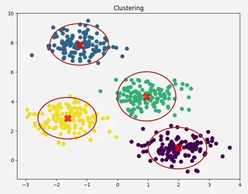
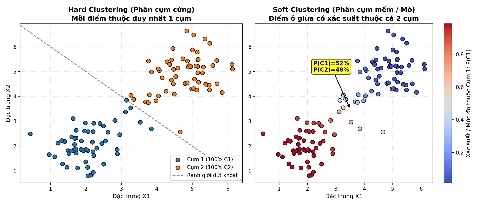
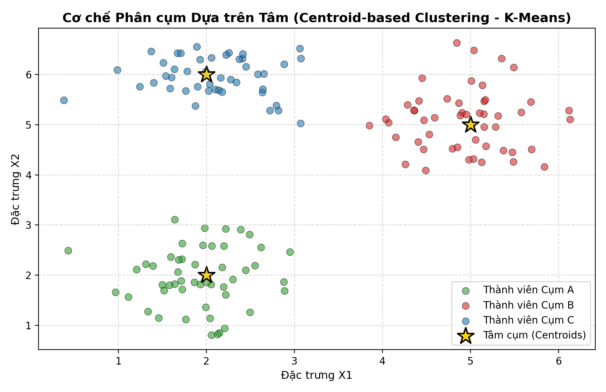

# Bài giảng: Phân cụm dữ liệu trong Machine Learning (Clustering in Machine Learning)

**Cập nhật lần cuối:** 22 tháng 9 năm 2026  
**Học phần:** Phân tích dữ liệu với Python (DSAI1005)  
**Giảng viên:** TS. Vũ Đức Minh – Khoa Khoa học dữ liệu và Trí tuệ nhân tạo, Trường Công nghệ, Đại học Kinh tế Quốc dân (NEU)  
**Nguồn tài liệu tham khảo chính:** [GeeksforGeeks – Clustering in Machine Learning](https://www.geeksforgeeks.org/machine-learning/clustering-in-machine-learning/)

---

## Mục lục bài học

1. [Tổng quan về Học không giám sát & Phân cụm dữ liệu](#1-tổng-quan-về-học-không-giám-sát--phân-cụm-dữ-liệu)
2. [Mục tiêu bài học (Learning Objectives)](#2-mục-tiêu-bài-học-learning-objectives)
3. [Phân loại Mô hình Phân cụm: Hard Clustering vs Soft Clustering](#3-phân-loại-mô-hình-phân-cụm-hard-clustering-vs-soft-clustering)
   - 3.1. Phân cụm cứng (Hard Clustering)
   - 3.2. Phân cụm mềm / Mờ (Soft / Fuzzy Clustering)
4. [Năm Phương pháp Phân cụm Cốt lõi](#4-năm-phương-pháp-phân-cụm-cốt-lõi)
   - 4.1. Phân cụm dựa trên tâm (Centroid-based: K-Means & K-Medoids)
   - 4.2. Phân cụm dựa trên mật độ (Density-based: DBSCAN & OPTICS)
   - 4.3. Phân cụm phân cấp (Connectivity-based / Hierarchical Clustering)
   - 4.4. Phân cụm dựa trên phân phối (Distribution-based: Gaussian Mixture Models - GMM)
   - 4.5. Phân cụm mờ (Fuzzy Clustering: Fuzzy C-Means)
5. [Các Độ đo Khoảng cách & Độ tương đồng trong Phân cụm](#5-các-độ-đo-khoảng-cách--độ-tương-đồng-trong-phân-cụm)
6. [Các Chỉ số Đánh giá Hiệu năng Phân cụm (Clustering Validation)](#6-các-chỉ-số-đánh-giá-hiệu-năng-phân-cụm-clustering-validation)
   - 6.1. Đánh giá nội tại (Internal Evaluation): Silhouette Score, Davies-Bouldin, Calinski-Harabasz, WCSS & Elbow Method
   - 6.2. Đánh giá ngoại tại (External Evaluation): Adjusted Rand Index (ARI) & NMI
7. [Bảng So sánh Toàn diện 5 Phương pháp Phân cụm](#7-bảng-so-sánh-toàn-diện-5-phương-pháp-phân-cụm)
8. [Ứng dụng Thực tiễn trong Kinh doanh & Kinh tế số](#8-ứng-dụng-thực-tiễn-trong-kinh-doanh--kinh-tế-số)
9. [Thực hành Lập trình Python với NumPy và Scikit-Learn](#9-thực-hành-lập-trình-python-với-numpy-và-scikit-learn)
   - 9.1. Tự cài đặt thuật toán K-Means từ đầu bằng NumPy thuần túy
   - 9.2. Triển khai phân cụm khách hàng với `sklearn.cluster.KMeans`
   - 9.3. Đánh giá chất lượng phân cụm với Silhouette Analysis và Elbow Method
   - 9.4. So sánh K-Means và DBSCAN trên dữ liệu phi cầu
10. [Tổng kết & Bộ câu hỏi ôn tập củng cố kiến thức](#10-tổng-kết--bộ-câu-hỏi-ôn-tập-củng-cố-kiến-thức)
11. [Tài liệu tham khảo](#11-tài-liệu-tham-khảo)

---

## 1. Tổng quan về Học không giám sát & Phân cụm dữ liệu

Trong thế giới dữ liệu thực tế, hơn $90\%$ dữ liệu được thu thập hàng ngày là **dữ liệu chưa được gán nhãn (Unlabeled Data)**: lịch sử nhấp chuột của người dùng, giao dịch thẻ tín dụng, tín hiệu cảm biến IoT, hoặc bình luận trên mạng xã hội. Việc thuê con người dán nhãn thủ công cho hàng triệu bản ghi là vô cùng tốn kém và bất khả thi.

**Học không giám sát (Unsupervised Machine Learning)** ra đời nhằm giải quyết thách thức này: giải thuật tự động khám phá các cấu trúc tiềm ẩn, quy luật phân bố và các nhóm tự nhiên bên trong tập dữ liệu mà không cần bất kỳ sự hướng dẫn hay biến mục tiêu $y$ nào.

<p align="center">
  
</p>

### Định nghĩa Phân cụm (Clustering):
**Clustering (Phân cụm dữ liệu)** là kỹ thuật phân chia tập hợp $N$ quan sát thành $K$ cụm (clusters) sao cho:
1. **Độ thuần nhất nội cụm cao (High Intra-cluster Similarity):** Các điểm dữ liệu nằm trong cùng một cụm phải có đặc tính, hành vi hoặc tọa độ càng giống nhau càng tốt.
2. **Độ phân biệt liên cụm lớn (High Inter-cluster Dissimilarity):** Các điểm dữ liệu thuộc về các cụm khác nhau phải càng tách biệt và khác biệt nhau càng nhiều càng tốt.

Mức độ "giống nhau" hay "khác nhau" được lượng hóa bằng các hàm khoảng cách hình học (Euclidean, Manhattan) hoặc độ đo tương đồng (Cosine, Pearson).

---

## 2. Mục tiêu bài học (Learning Objectives)

Sau khi hoàn thành bài học này, sinh viên có khả năng:

1. **Hiểu bản chất phân cụm:** Phân biệt rõ sự khác nhau giữa Phân cụm (Học không giám sát - Unsupervised) và Phân loại (Học có giám sát - Supervised).
2. **Nắm vững hai trường phái phân chia:** Giải thích sự khác biệt giữa **Hard Clustering** (gán dứt khoát 1 điểm vào 1 cụm) và **Soft Clustering** (gán xác suất/mức độ mờ vào nhiều cụm).
3. **Làm chủ 5 phương pháp phân cụm cốt lõi:** Trình bày nguyên lý, ưu nhược điểm của 5 họ thuật toán lớn:
   - Dựa trên tâm (Centroid-based: K-Means, K-Medoids)
   - Dựa trên mật độ (Density-based: DBSCAN, OPTICS)
   - Phân cấp (Hierarchical: Agglomerative, Divisive, Dendrogram)
   - Dựa trên phân phối (Distribution-based: Gaussian Mixture Models)
   - Phân cụm mờ (Fuzzy Clustering: Fuzzy C-Means)
4. **Đánh giá chất lượng phân cụm khoa học:** Áp dụng thành thạo phương pháp Khuỷu tay (Elbow Method với WCSS) và chỉ số **Silhouette Coefficient** để xác định số lượng cụm $K$ tối ưu.
5. **Thành thạo lập trình Python:** Tự cài đặt thuật toán K-Means từ đầu bằng thư viện NumPy, sử dụng thành thạo thư viện Scikit-Learn để phân khúc khách hàng (Customer Segmentation) và trực quan hóa phân cụm.

---

## 3. Phân loại Mô hình Phân cụm: Hard Clustering vs Soft Clustering

Dựa trên cách thức phân bổ một điểm dữ liệu vào các cụm, các giải thuật phân cụm được chia thành hai nhánh lớn:

<p align="center">
  
</p>

### 3.1. Phân cụm cứng (Hard Clustering)
- **Cơ chế:** Mỗi điểm dữ liệu $x_i$ được gán **chính xác và duy nhất** vào một cụm $C_k$:
  $$x_i \in C_k \quad \text{và} \quad C_j \cap C_k = \emptyset \quad (\forall j \ne k)$$
- Không có sự giao thoa hay nhập nhằng giữa các cụm.
- **Ví dụ tiêu biểu:** Thuật toán **K-Means**, **K-Medoids**, **Hierarchical Clustering**.
- **Ứng dụng:** Phân loại khách hàng vào các cấp bậc hội viên rõ ràng (Vàng, Bạc, Đồng), phân vùng kho vận giao hàng cố định.
- **Hạn chế:** Bất lực trước các điểm dữ liệu nằm ngay ranh giới chuyển tiếp hoặc mang đặc tính lai tạp giữa hai nhóm.

### 3.2. Phân cụm mềm / Mờ (Soft / Fuzzy Clustering)
- **Cơ chế:** Một điểm dữ liệu $x_i$ có thể thuộc về **nhiều cụm đồng thời** với các mức độ thành viên (Degree of Membership) hoặc xác suất khác nhau:
  $$P(x_i \in C_k) \in [0, 1] \quad \text{sao cho} \quad \sum_{k=1}^{K} P(x_i \in C_k) = 1$$
- **Ví dụ tiêu biểu:** **Gaussian Mixture Models (GMM)**, **Fuzzy C-Means (FCM)**.
- **Ví dụ đời sống:** Một khách hàng có $70\%$ hành vi của nhóm "Gia đình tiết kiệm" và $30\%$ hành vi của nhóm "Thích du lịch trải nghiệm".
- **Ưu điểm:** Phản ánh chân thực sự bất định (uncertainty) và ranh giới mờ nhạt trong hành vi con người và chẩn đoán y tế.

---

## 4. Năm Phương pháp Phân cụm Cốt lõi

### 4.1. Phân cụm dựa trên tâm (Centroid-based: K-Means & K-Medoids)

Phương pháp này đại diện cho mỗi cụm bằng một điểm trung tâm gọi là **Tâm cụm (Centroid)**. Mỗi điểm dữ liệu được gán về tâm cụm gần nhất.

<p align="center">
  
</p>

#### Thuật toán K-Means:
1. **Khởi tạo:** Chọn ngẫu nhiên $K$ điểm làm tâm cụm ban đầu $\mu_1, \mu_2, \dots, \mu_K$.
2. **Gán cụm (Assignment Step):** Gán mỗi điểm dữ liệu $x_i$ vào tâm cụm gần nhất theo khoảng cách Euclidean:
   $$c_i = \arg\min_{k \in \{1, \dots, K\}} \|x_i - \mu_k\|^2$$
3. **Cập nhật tâm (Update Step):** Tính toán lại vị trí tâm cụm bằng giá trị trung bình cộng tọa độ của các thành viên trong cụm:
   $$\mu_k = \frac{1}{|C_k|} \sum_{x \in C_k} x$$
4. **Lặp lại:** Thực hiện lặp bước 2 và 3 cho đến khi các tâm cụm không còn dịch chuyển đáng kể (hội tụ).
- **K-Medoids (PAM - Partitioning Around Medoids):** Thay vì dùng điểm trung bình ảo, K-Medoids bắt buộc tâm cụm phải là một điểm dữ liệu thực tế có trong tập dữ liệu, giúp giải thuật **kiên cường hơn trước ngoại lai (Outliers)**.

### 4.2. Phân cụm dựa trên mật độ (Density-based: DBSCAN & OPTICS)

Thay vì giả định các cụm có hình cầu lồi, phương pháp dựa trên mật độ xem cụm là **vùng có mật độ điểm dữ liệu dày đặc**, được ngăn cách bởi các vùng thưa thớt (được coi là nhiễu / Outliers).

#### Thuật toán DBSCAN (Density-Based Spatial Clustering of Applications with Noise):
Sử dụng hai siêu tham số cốt lõi:
- **$\epsilon$ (Epsilon):** Bán kính lân cận xung quanh một điểm.
- **$\text{MinPts}$:** Số lượng điểm tối thiểu bắt buộc phải có trong lân cận bán kính $\epsilon$.

Phân loại 3 loại điểm trong không gian:
1. **Điểm lõi (Core Point):** Điểm có ít nhất $\text{MinPts}$ điểm láng giềng nằm trong bán kính $\epsilon$.
2. **Điểm biên (Border Point):** Không đủ $\text{MinPts}$ láng giềng, nhưng nằm trong vùng $\epsilon$ của một Core Point.
3. **Điểm nhiễu (Noise / Outlier):** Điểm không thuộc hai nhóm trên, bị gán nhãn $-1$.

> **Ưu điểm vượt trội:**  
> - Tự động phát hiện số lượng cụm mà không cần người dùng khai báo $K$ trước.
> - Phát hiện cụm có **hình thù tùy ý (Arbitrary Shapes)** như hình trăng khuyết, hình xoắn ốc, hình chữ S.
> - Tự động lọc bỏ nhiễu và ngoại lai một cách tự nhiên.

### 4.3. Phân cụm phân cấp (Connectivity-based / Hierarchical Clustering)

Xây dựng cây phả hệ các cụm lồng ghép theo cấu trúc phân cấp, được trực quan hóa bằng biểu đồ cây **Dendrogram**.

Hai chiến lược thực thi:
1. **Phân cụm tích tụ (Agglomerative - Bottom-Up):** Bắt đầu với $N$ cụm đơn lẻ (mỗi điểm là 1 cụm). Qua từng bước, hai cụm có khoảng cách gần nhau nhất sẽ được gộp lại, cho đến khi chỉ còn 1 cụm duy nhất chứa toàn bộ dữ liệu.
2. **Phân cụm phân chia (Divisive - Top-Down):** Bắt đầu với 1 cụm khổng lồ chứa tất cả các điểm, sau đó chia nhỏ dần đệ quy.

Các tiêu chí đo khoảng cách giữa hai cụm (Linkage Criteria):
- **Single Linkage:** Khoảng cách ngắn nhất giữa hai điểm gần nhất của 2 cụm: $\min d(x, z)$.
- **Complete Linkage:** Khoảng cách dài nhất giữa hai điểm xa nhất của 2 cụm: $\max d(x, z)$.
- **Average Linkage:** Khoảng cách trung bình giữa tất cả các cặp điểm: $\frac{1}{|A||B|} \sum d(x, z)$.
- **Ward's Linkage:** Hợp nhất hai cụm sao cho **mức tăng phương sai tổng (WCSS)** là nhỏ nhất. Đây là phương pháp phổ biến và ổn định nhất.

### 4.4. Phân cụm dựa trên phân phối (Distribution-based: Gaussian Mixture Models - GMM)

Giả định rằng toàn bộ tập dữ liệu được sinh ra từ một hỗn hợp gồm $K$ phân phối chuẩn nhiều chiều (Multivariate Gaussian Distributions).

Mỗi cụm $k$ được đặc trưng bởi 3 tham số thống kê:
- Trọng số hỗn hợp (Mixing weight): $\pi_k \in [0, 1]$
- Vector kỳ vọng (Mean vector): $\mu_k$
- Ma trận hiệp phương sai (Covariance matrix): $\Sigma_k$

Giải thuật sử dụng thuật toán **Expectation-Maximization (EM)** để cực đại hóa hàm hợp lý:
- **Bước E (Expectation):** Tính xác suất hậu nghiệm (Responsibility) để điểm $x_i$ được sinh ra từ cụm $k$.
- **Bước M (Maximization):** Cập nhật lại các tham số $\pi_k, \mu_k, \Sigma_k$.

### 4.5. Phân cụm mờ (Fuzzy Clustering: Fuzzy C-Means)

Tương tự như K-Means, nhưng thay vì gán nhãn cứng 0 hoặc 1, Fuzzy C-Means tối ưu hóa hàm mục tiêu có gắn hệ số mờ $m > 1$ (thường chọn $m = 2$):
$$J_m = \sum_{i=1}^{N} \sum_{k=1}^{K} u_{ik}^m \|x_i - \mu_k\|^2$$
trong đó $u_{ik} \in [0, 1]$ là trọng số thành viên thể hiện mức độ thuộc về cụm $k$ của điểm $x_i$.

---

## 5. Các Độ đo Khoảng cách & Độ tương đồng trong Phân cụm

| Độ đo | Công thức toán học | Ứng dụng phù hợp |
| :--- | :--- | :--- |
| **Euclidean ($L_2$)** | $d(x, z) = \sqrt{\sum (x_j - z_j)^2}$ | Dữ liệu không gian, số thực liên tục có cùng thang đo. |
| **Manhattan ($L_1$)** | $d(x, z) = \sum \|x_j - z_j\|$ | Dữ liệu dạng lưới, có nhiều ngoại lai hoặc số chiều cao. |
| **Cosine Similarity** | $\cos(\theta) = \frac{x \cdot z}{\|x\|_2 \|z\|_2}$ | Phân cụm tài liệu văn bản (TF-IDF), hệ thống gợi ý. |
| **Hamming Distance** | $d_H(x, z) = \sum \mathbb{I}(x_j \ne z_j)$ | Dữ liệu chuỗi nhị phân, gen di truyền DNA. |

---

## 6. Các Chỉ số Đánh giá Hiệu năng Phân cụm (Clustering Validation)

Vì phân cụm là học không giám sát (không có nhãn thực tế $y$ để so sánh accuracy như phân loại), việc đánh giá chất lượng phân cụm đòi hỏi các thước đo thống kê chuyên biệt:

### 6.1. Đánh giá nội tại (Internal Evaluation)

Chỉ sử dụng tọa độ dữ liệu và nhãn cụm dự đoán:

1. **Tổng bình phương khoảng cách nội cụm (Within-Cluster Sum of Squares - WCSS / Inertia):**
   $$\text{WCSS} = \sum_{k=1}^{K} \sum_{x \in C_k} \|x - \mu_k\|^2$$
   - Khi tăng $K$, WCSS luôn luôn giảm.
   - **Phương pháp Khuỷu tay (Elbow Method):** Vẽ đồ thị WCSS theo $K$. Điểm uốn nơi tốc độ giảm WCSS chậm lại đột ngột tạo thành hình "khuỷu tay" chính là số cụm $K$ tối ưu.

2. **Hệ số Silhouette (Silhouette Coefficient):**
   Đo lường mức độ một điểm dữ liệu khớp với cụm của chính nó so với cụm lân cận gần nhất:
   $$s(i) = \frac{b(i) - a(i)}{\max(a(i), b(i))}, \quad s(i) \in [-1, 1]$$
   trong đó:
   - $a(i)$: Khoảng cách trung bình từ điểm $i$ đến tất cả các điểm khác trong cùng cụm (Cohesion - độ kết dính nội cụm, càng nhỏ càng tốt).
   - $b(i)$: Khoảng cách trung bình từ điểm $i$ đến tất cả các điểm trong cụm gần nó nhất (Separation - độ tách biệt ngoại cụm, càng lớn càng tốt).

   ```
   Diễn giải giá trị Silhouette trung bình:
   s gần +1  ==> Cụm rất chặt chẽ và tách biệt rõ ràng (Xuất sắc)
   s gần 0   ==> Điểm nằm ngay trên ranh giới chuyển tiếp giữa 2 cụm
   s < 0     ==> Điểm bị gán sai cụm (Kém)
   ```

3. **Chỉ số Davies-Bouldin Index (DBI):**
   Đo tỷ số giữa độ phân tán nội cụm và khoảng cách giữa các tâm cụm. **Chỉ số DBI càng nhỏ thì chất lượng phân cụm càng cao**.

4. **Chỉ số Calinski-Harabasz Index (Variance Ratio Criterion):**
   Tỷ số giữa phương sai liên cụm và phương sai nội cụm. **Chỉ số càng lớn càng tốt**.

### 6.2. Đánh giá ngoại tại (External Evaluation)

Được sử dụng trong nghiên cứu khi chúng ta có sẵn nhãn phân nhóm thực tế (Ground Truth) để kiểm định thuật toán:
- **Adjusted Rand Index (ARI):** Đo lường mức độ đồng thuận giữa hai cách phân nhóm, có điều chỉnh ngẫu nhiên ($ARI \in [-1, 1]$, $1$ là trùng khớp hoàn hảo).
- **Normalized Mutual Information (NMI):** Đo lường lượng thông tin tương hỗ giữa hai phân hoạch nhãn.

---

## 7. Bảng So sánh Toàn diện 5 Phương pháp Phân cụm

| Tiêu chí | K-Means | DBSCAN | Hierarchical (Ward) | Gaussian Mixture (GMM) | Fuzzy C-Means (FCM) |
| :--- | :--- | :--- | :--- | :--- | :--- |
| **Loại phân cụm** | Hard | Hard (có Noise) | Hard | **Soft (Xác suất)** | **Soft (Độ mờ)** |
| **Yêu cầu số cụm $K$ trước** | **Bắt buộc** | **Không cần** | Không cần khi dựng cây | **Bắt buộc** | **Bắt buộc** |
| **Hình dạng cụm nhận biết** | Hình cầu lồi | **Hình dạng bất kỳ** | Cụm đa dạng tùy linkage | Hình elip đa hướng | Hình cầu lồi |
| **Xử lý Nhiễu & Outliers** | Kém (bị lệch tâm) | **Tuyệt vời (gán nhãn -1)** | Trung bình | Tương đối nhạy cảm | Nhạy cảm |
| **Độ phức tạp tính toán** | **$O(N \cdot K \cdot I)$ (Rất nhanh)** | $O(N \log N)$ đến $O(N^2)$ | $O(N^2 \log N)$ (Chậm) | $O(N \cdot K \cdot I \cdot p^2)$ | $O(N \cdot K \cdot I)$ |
| **Khả năng mở rộng (Scale)** | Hàng triệu dòng dữ liệu | Trung bình | Kém khi $N > 10,000$ | Trung bình | Khá tốt |

---

## 8. Ứng dụng Thực tiễn trong Kinh doanh & Kinh tế số

1. **Phân khúc Khách hàng (Customer Segmentation & RFM Analysis):**  
   Gom nhóm khách hàng dựa trên hành vi mua sắm: Recency (gần đây), Frequency (tần suất), Monetary (giá trị chi tiêu). Giúp phòng Marketing thiết kế các chiến dịch cá nhân hóa (khách hàng VIP, khách hàng ngủ đông, khách hàng tiềm năng).
2. **Phát hiện Giao dịch Gian lận & Dị thường (Anomaly Detection):**  
   Sử dụng DBSCAN hoặc GMM để cô lập các giao dịch tài chính hoặc đăng nhập bất thường rơi vào vùng mật độ thấp (nhiễu).
3. **Phân khúc Thị trường Bất động sản:**  
   Gom cụm các căn hộ có vị trí địa lý, diện tích, giá bán và tiện ích xung quanh tương đồng để định giá tự động (Automated Valuation Models).
4. **Phân tích Giỏ hàng (Market Basket Clustering):**  
   Nhóm các sản phẩm thường xuyên được mua kèm với nhau để bố trí quầy kệ siêu thị hoặc thiết kế gói khuyến mãi combo.
5. **Nén Ảnh & Phân đoạn Ảnh (Image Segmentation):**  
   Sử dụng K-Means gom nhóm các điểm ảnh (pixels) có màu sắc tương tự nhau để giảm số lượng bảng màu (Color Quantization), giảm dung lượng lưu trữ ảnh.

---

## 9. Thực hành Lập trình Python với NumPy và Scikit-Learn

### 9.1. Tự cài đặt thuật toán K-Means từ đầu bằng NumPy thuần túy

Hiểu rõ cơ chế toán học bằng cách lập trình K-Means không cần thư viện học máy:

```python
import numpy as np
import matplotlib.pyplot as plt

class PureNumPyKMeans:
    def __init__(self, k=3, max_iters=100, tol=1e-4):
        self.k = k
        self.max_iters = max_iters
        self.tol = tol
        self.centroids = None
        self.labels = None

    def fit(self, X):
        # Bước 1: Khởi tạo ngẫu nhiên K tâm cụm từ tập dữ liệu
        np.random.seed(42)
        random_indices = np.random.choice(len(X), self.k, replace=False)
        self.centroids = X[random_indices]

        for iteration in range(self.max_iters):
            # Bước 2: Gán mỗi điểm vào tâm cụm gần nhất (Khoảng cách Euclidean)
            # Tính ma trận khoảng cách: shape (N, K)
            distances = np.linalg.norm(X[:, np.newaxis] - self.centroids, axis=2)
            new_labels = np.argmin(distances, axis=1)

            # Bước 3: Cập nhật lại tâm cụm bằng trung bình mẫu
            new_centroids = np.array([
                X[new_labels == k].mean(axis=0) if np.sum(new_labels == k) > 0 else self.centroids[k]
                for k in range(self.k)
            ])

            # Kiểm tra điều kiện hội tụ
            centroid_shift = np.linalg.norm(new_centroids - self.centroids)
            self.centroids = new_centroids
            self.labels = new_labels

            if centroid_shift < self.tol:
                print(f"Thuật toán K-Means hội tụ sau {iteration + 1} vòng lặp.")
                break

        return self

# Kiểm thử với dữ liệu tổng hợp
np.random.seed(42)
cluster1 = np.random.randn(60, 2) + np.array([2, 2])
cluster2 = np.random.randn(60, 2) + np.array([8, 3])
cluster3 = np.random.randn(60, 2) + np.array([5, 8])
X = np.vstack([cluster1, cluster2, cluster3])

model = PureNumPyKMeans(k=3).fit(X)
print("Tọa độ các tâm cụm tìm được:")
print(model.centroids)
```

### 9.2. Triển khai phân cụm khách hàng với `sklearn.cluster.KMeans`

```python
import pandas as pd
from sklearn.cluster import KMeans
from sklearn.preprocessing import StandardScaler
from sklearn.metrics import silhouette_score

# Giả lập dữ liệu khách hàng bán lẻ (Thu nhập hàng năm và Điểm chi tiêu)
data = {
    'Annual_Income_k$': [15, 16, 17, 18, 19, 40, 42, 43, 44, 45, 70, 72, 75, 78, 80, 85, 90, 95],
    'Spending_Score':   [80, 85, 78, 82, 88, 50, 48, 52, 55, 49, 15, 20, 18, 25, 22, 90, 85, 92]
}
df_customers = pd.DataFrame(data)

# BẮT BUỘC: Chuẩn hóa thang đo đặc trưng trước khi phân cụm
scaler = StandardScaler()
X_scaled = scaler.fit_transform(df_customers)

# Huấn luyện K-Means với K=3
kmeans = KMeans(n_clusters=3, init='k-means++', n_init=10, random_state=42)
df_customers['Cluster'] = kmeans.fit_predict(X_scaled)

# Đánh giá chỉ số Silhouette Score
sil_score = silhouette_score(X_scaled, df_customers['Cluster'])
print(f"Hệ số Silhouette Score: {sil_score:.4f}")
print("\n=== THỐNG KÊ TRUNG BÌNH THEO CỤM ===")
print(df_customers.groupby('Cluster').mean())
```

### 9.3. Đánh giá chất lượng phân cụm với Silhouette Analysis và Elbow Method

```python
wcss = []
silhouette_coefficients = []
k_values = range(2, 8)

for k in k_values:
    km = KMeans(n_clusters=k, init='k-means++', n_init=10, random_state=42)
    km.fit(X_scaled)
    wcss.append(km.inertia_)
    silhouette_coefficients.append(silhouette_score(X_scaled, km.labels_))

# Trực quan hóa song song Elbow Curve và Silhouette Score
fig, (ax1, ax2) = plt.subplots(1, 2, figsize=(14, 5))

# Đồ thị Elbow
ax1.plot(k_values, wcss, 'bo-', linewidth=2)
ax1.set_title('Phương pháp Khuỷu tay (Elbow Method)', fontsize=13, fontweight='bold')
ax1.set_xlabel('Số lượng cụm K', fontsize=11)
ax1.set_ylabel('Tổng bình phương nội cụm (WCSS / Inertia)', fontsize=11)
ax1.grid(True, linestyle='--', alpha=0.5)

# Đồ thị Silhouette
ax2.plot(k_values, silhouette_coefficients, 'ro-', linewidth=2)
ax2.set_title('Chỉ số Hệ số Silhouette theo K', fontsize=13, fontweight='bold')
ax2.set_xlabel('Số lượng cụm K', fontsize=11)
ax2.set_ylabel('Silhouette Score trung bình', fontsize=11)
ax2.grid(True, linestyle='--', alpha=0.5)

plt.tight_layout()
plt.show()
```

---

## 10. Tổng kết & Bộ câu hỏi ôn tập củng cố kiến thức

### Bảng tóm tắt nội dung trọng tâm

| Khái niệm | Ý nghĩa & Quy tắc cốt lõi |
| :--- | :--- |
| **Clustering** | Học không giám sát phân chia dữ liệu thành các nhóm có độ tương đồng nội cụm cao và cách biệt liên cụm lớn. |
| **Hard vs Soft** | Hard: Mỗi điểm thuộc duy nhất 1 cụm. Soft: Điểm thuộc nhiều cụm với vector xác suất/độ mờ. |
| **K-Means** | Dựa trên tâm cụm, cực tiểu hóa WCSS; nhanh nhưng chỉ bắt được cụm hình cầu và nhạy cảm với ngoại lai. |
| **DBSCAN** | Dựa trên mật độ $(\epsilon, \text{MinPts})$; tự tìm số cụm, nhận diện hình thù tùy ý và tự động lọc nhiễu. |
| **Hierarchical** | Xây dựng cây phân cấp Dendrogram; không cần chọn $K$ trước, quan sát quan hệ phả hệ đa tầng. |
| **Silhouette** | Chỉ số đo từ $-1$ đến $+1$; phản ánh độ nén chặt nội cụm $a(i)$ và độ tách biệt ngoại cụm $b(i)$. |

---

### Bộ 5 câu hỏi trắc nghiệm & tự luận chuyên sâu

#### Câu 1: Sự khác biệt bản chất giữa thuật toán Phân loại (Classification) và Phân cụm (Clustering) là gì?
- **A.** Phân loại chỉ dùng cho dữ liệu số, phân cụm chỉ dùng cho dữ liệu danh mục.
- **B.** Phân loại là học có giám sát dựa trên biến mục tiêu đã có nhãn $y$, trong khi phân cụm là học không giám sát nhằm tự phát hiện cấu trúc trên dữ liệu chưa gán nhãn.
- **C.** Phân loại luôn có sai số bằng 0, còn phân cụm luôn có sai số lớn.
- **D.** Phân cụm đòi hỏi tập dữ liệu phải có ít nhất 10,000 quan sát.
- *(Gợi ý đáp án: **B**. Phân cụm không có biến mục tiêu $y$ để hướng dẫn quá trình học).*

#### Câu 2: Trong các tình huống phân tích dữ liệu thực tế, khi dữ liệu chứa nhiều hình thù phức tạp phi tuyến (như hai vòng tròn đồng tâm hoặc hình trăng khuyết) kèm nhiều điểm nhiễu ngoại lai, thuật toán phân cụm nào sau đây là sự lựa chọn ưu việt nhất?
- **A.** K-Means Clustering.
- **B.** K-Medoids Clustering.
- **C.** DBSCAN (Density-Based Spatial Clustering).
- **D.** Linear Discriminant Analysis.
- *(Gợi ý đáp án: **C**. DBSCAN dựa trên mật độ lân cận nên có khả năng bắt mọi hình dạng cụm tùy ý và gán nhãn $-1$ cho nhiễu).*

#### Câu 3: Giá trị của Hệ số Silhouette trung bình ($s$) nhận giá trị xấp xỉ $+0.85$ biểu thị điều gì về kết quả phân cụm?
- **A.** Mô hình đang bị quá khớp (Overfitting) nghiêm trọng.
- **B.** Các cụm rất chặt chẽ nội bộ và tách biệt rõ ràng với các cụm khác.
- **C.** Phần lớn các điểm dữ liệu đang bị gán nhầm vào sai cụm.
- **D.** Số lượng cụm $K$ được chọn đang quá lớn so với thực tế.
- *(Gợi ý đáp án: **B**. Silhouette càng tiến sát $+1$ chứng tỏ $b(i) \gg a(i)$, cấu trúc phân cụm vô cùng hoàn hảo).*

#### Câu 4: Tại sao trước khi đưa dữ liệu vào thuật toán K-Means, bước chuẩn hóa thang đo đặc trưng (Feature Scaling như `StandardScaler`) lại đóng vai trò quyết định?
- *(Gợi ý trả lời: K-Means tính toán khoảng cách Euclidean giữa các điểm và tâm cụm. Nếu biến Thu nhập có thang đo từ 10,000,000 đến 100,000,000 trong khi biến Số con chỉ từ 0 đến 4, biến Thu nhập sẽ chi phối 99.9% giá trị khoảng cách Euclidean, khiến K-Means hoàn toàn bỏ qua thông tin của biến Số con).*

#### Câu 5: Phân tích sự đánh đổi (Trade-off) khi chọn số lượng cụm $K$ trong phương pháp Khuỷu tay (Elbow Method). Tại sao chúng ta không chọn $K = N$ (trong đó $N$ là tổng số mẫu)?
- *(Gợi ý trả lời: Khi tăng $K$, tổng bình phương nội cụm WCSS luôn giảm đơn điệu. Khi $K = N$, mỗi điểm là một cụm riêng, khi đó $\text{WCSS} = 0$ tuyệt đối. Tuy nhiên, kết quả này hoàn toàn vô giá trị trong thực tiễn vì không có tác dụng khái quát hóa hay rút trích nhóm khách hàng. Điểm Elbow là điểm cân bằng tối ưu giữa việc tối thiểu hóa sai số nội cụm và giữ số lượng nhóm đủ nhỏ, cô đọng để phục vụ ra quyết định kinh doanh).*

---

## 11. Tài liệu tham khảo

1. **GeeksforGeeks:** [Clustering in Machine Learning](https://www.geeksforgeeks.org/machine-learning/clustering-in-machine-learning/)
2. **MacQueen, J. (1967):** *Some methods for classification and analysis of multivariate observations*. Proceedings of the 5th Berkeley Symposium on Mathematical Statistics and Probability.
3. **Ester, M., Kriegel, H. P., Sander, J., & Xu, X. (1996):** *A density-based algorithm for discovering clusters in large spatial databases with noise*. KDD-96 Proceedings, 226-231.
4. **Scikit-Learn Documentation:** [Clustering (`sklearn.cluster`)](https://scikit-learn.org/stable/modules/clustering.html)
5. **Hastie, T., Tibshirani, R., & Friedman, J. (2009):** *The Elements of Statistical Learning*. Springer (Chapter 14: Unsupervised Learning - Cluster Analysis).
