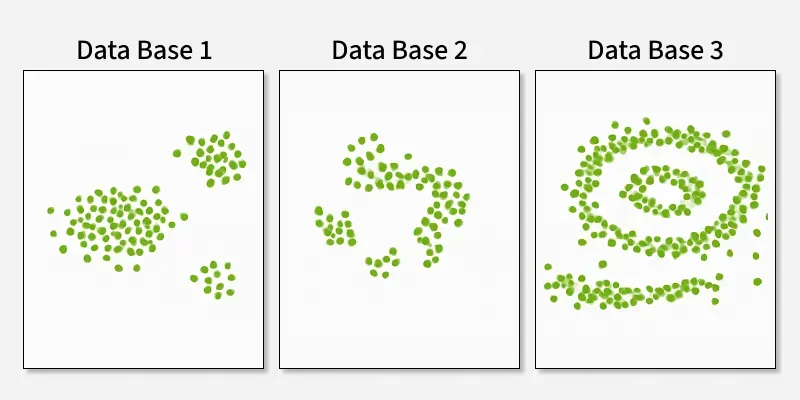
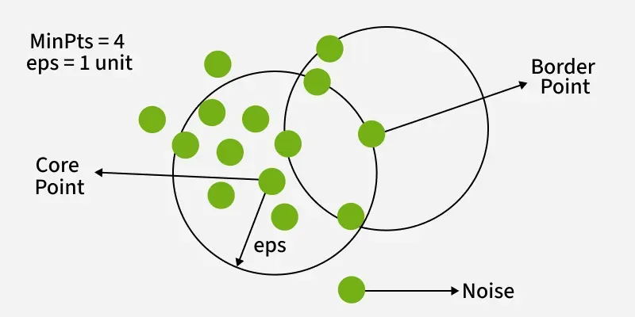
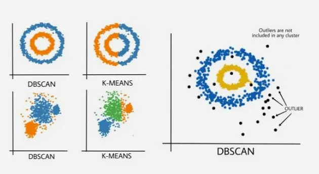
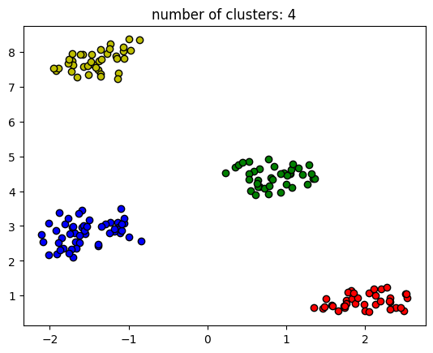
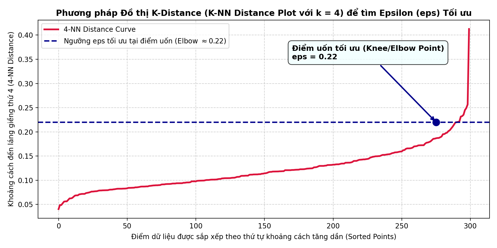
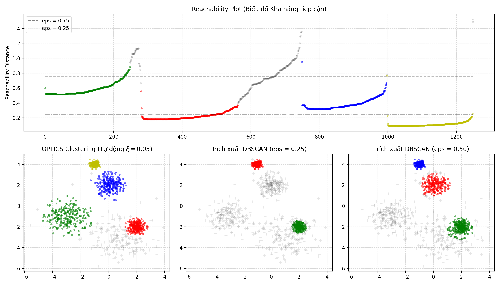
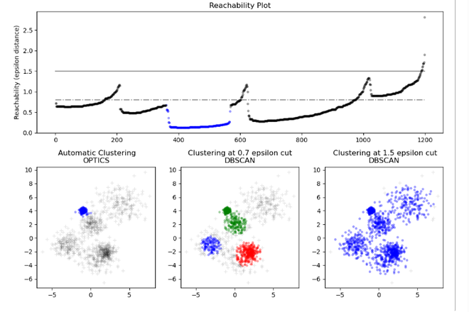
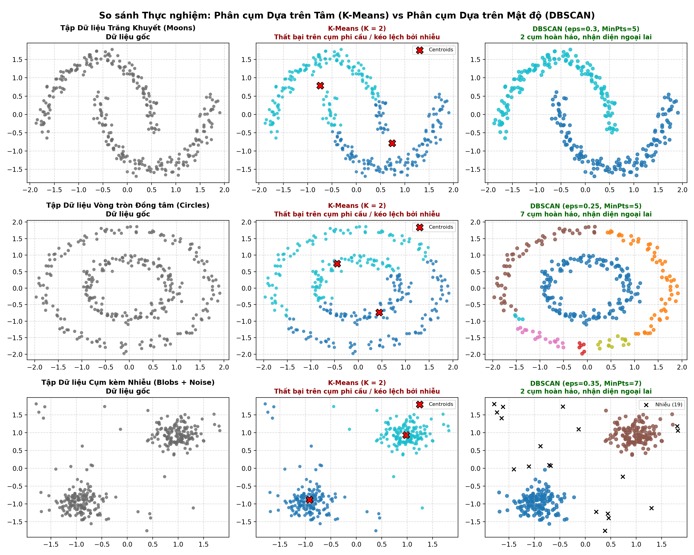

# Bài giảng: Density-based Clustering – Thuật toán DBSCAN & OPTICS

**Cập nhật lần cuối:** 22 tháng 9 năm 2026  
**Học phần:** Phân tích dữ liệu với Python (DSAI1005)  
**Giảng viên:** TS. Vũ Đức Minh – Khoa Khoa học dữ liệu và Trí tuệ nhân tạo, Trường Công nghệ và Kinh tế số, Đại học Kinh tế Quốc dân (NEU)  
**Nguồn tài liệu tham khảo chính:**  
- [GeeksforGeeks – DBSCAN Clustering in ML (Density Based Clustering)](https://www.geeksforgeeks.org/dbscan-clustering-in-ml-density-based-clustering/)  
- [GeeksforGeeks – Ordering Points To Identify Cluster Structure (OPTICS) using Sklearn](https://www.geeksforgeeks.org/ordering-points-to-identify-cluster-structure-optics-using-sklearn/)

---

## Mục lục bài học

1. [Tổng quan về Phương pháp Phân cụm Dựa trên Mật độ (Density-based Clustering)](#1-tổng-quan-về-phương-pháp-phân-cụm-dựa-trên-mật-độ-density-based-clustering)
2. [Mục tiêu bài học (Learning Objectives)](#2-mục-tiêu-bài-học-learning-objectives)
3. [Thuật toán DBSCAN (Density-Based Spatial Clustering of Applications with Noise)](#3-thuật-toán-dbscan-density-based-spatial-clustering-of-applications-with-noise)
   - 3.1. Triết lý hình học và hai siêu tham số nền tảng ($\epsilon$ và $\text{MinPts}$)
   - 3.2. Ba loại điểm dữ liệu: Core Points, Border Points và Noise Points
   - 3.3. Các khái niệm cốt lõi: Tiếp cận trực tiếp, Tiếp cận mật độ và Liên thông mật độ
   - 3.4. Quy trình vận hành cơ học từng bước của thuật toán DBSCAN
   - 3.5. Kỹ thuật lựa chọn $\epsilon$ tối ưu bằng Đồ thị K-Distance (Knee/Elbow Method)
   - 3.6. Giới hạn chí mạng của DBSCAN: Thất bại khi mật độ cụm biến thiên (Varying Densities)
4. [Thuật toán OPTICS (Ordering Points To Identify the Clustering Structure)](#4-thuật-toán-optics-ordering-points-to-identify-the-clustering-structure)
   - 4.1. Động lực ra đời của OPTICS: Giải quyết bài toán đa mật độ
   - 4.2. Hai khái niệm toán học trụ cột: Khoảng cách lõi (Core Distance) & Khoảng cách tiếp cận (Reachability Distance)
   - 4.3. Cơ chế duyệt điểm bằng Hàng đợi ưu tiên (Priority Queue)
   - 4.4. Biểu đồ Khả năng tiếp cận (Reachability Plot) – "Chìa khóa vàng" giải mã cấu trúc dữ liệu
   - 4.5. Hai chiến lược trích xuất cụm: Cắt ngưỡng Epsilon phẳng vs Tự động hóa $\xi$ (Xi-steep)
5. [So sánh Đối chiếu Toàn diện: K-Means vs Hierarchical vs DBSCAN vs OPTICS](#5-so-sánh-đối-chiếu-toàn-diện-k-means-vs-hierarchical-vs-dbscan-vs-optics)
6. [Các Ứng dụng Thực tiễn Đột phá của Phân cụm Dựa trên Mật độ](#6-các-ứng-dụng-thực-tiễn-đột-phá-của-phân-cụm-dựa-trên-mật-độ)
7. [Hướng dẫn Thực hành Lập trình Python Toàn diện](#7-hướng-dẫn-thực-hành-lập-trình-python-toàn-diện)
   - 7.1. Bài toán 1: So sánh thực nghiệm K-Means vs DBSCAN trên các tập dữ liệu phi cầu phức tạp
   - 7.2. Bài toán 2: Xây dựng đồ thị K-Distance tự động tìm Epsilon ($\epsilon$) cho DBSCAN
   - 7.3. Bài toán 3: Phân cụm dữ liệu đa mật độ (Multi-density) bằng thuật toán OPTICS
   - 7.4. Bài toán 4: Trích xuất đa tầng và trực quan hóa Reachability Plot với Scikit-Learn
8. [Tổng kết & Bộ câu hỏi ôn tập chuyên sâu có lời giải](#8-tổng-kết--bộ-câu-hỏi-ôn-tập-chuyên-sâu-có-lời-giải)
9. [Tài liệu tham khảo](#9-tài-liệu-tham-khảo)

---

## 1. Tổng quan về Phương pháp Phân cụm Dựa trên Mật độ (Density-based Clustering)

Trong hai chuyên đề trước, chúng ta đã nghiên cứu:
- **K-Means (Centroid-based):** Giả định mỗi cụm là một hình cầu lồi (spherical/convex) bao quanh một tâm điểm tĩnh.
- **Hierarchical Clustering (Connectivity-based):** Xây dựng cây phả hệ sáp nhập dựa trên khoảng cách giữa các cặp cụm.

Tuy nhiên, trong các bài toán khoa học dữ liệu thực tế (dữ liệu viễn thám GIS, hành vi giao thông, vết di chuyển của người dùng trên ứng dụng, phát hiện gian lận thẻ tín dụng, phân cụm tế bào sinh học), dữ liệu thường biểu hiện hai đặc tính khắc nghiệt:
1. **Hình thái cụm dị thường và phi tuyến (Arbitrary Shapes):** Cụm có thể uốn lượn như hình trăng khuyết, hình chữ S, các vòng tròn đồng tâm lồng nhau hoặc các dải phân cách kéo dài.
2. **Nhiễu nền và ngoại lai dày đặc (Heavy Noise & Outliers):** Dữ liệu luôn bị bao bọc bởi các quan sát rải rác không thuộc về bất kỳ quy luật nào.

Khi đối mặt với các tình huống trên, cả K-Means và Hierarchical (Complete/Ward) đều hoàn toàn bất lực: K-Means sẽ cắt đôi các cấu trúc hình học tự nhiên để ép vào các khối cầu Voronoi nhân tạo, trong khi các điểm ngoại lai sẽ kéo lệch tâm cụm nghiêm trọng.

<p align="center">
  
</p>

Để giải quyết triệt để vấn đề này, **Họ thuật toán Phân cụm Dựa trên Mật độ (Density-based Clustering)** ra đời dựa trên một định nghĩa trực quan và tự nhiên:

> *"Một **Cụm dữ liệu (Cluster)** là một vùng không gian liên tục có **mật độ điểm dữ liệu cao vượt trội**, được ngăn cách với các cụm khác bằng những vùng không gian thưa thớt có **mật độ điểm rất thấp (vùng nhiễu / noise)**."*

Hai giải thuật tiêu biểu đại diện cho trường phái này là:
1. **DBSCAN (Ester et al., 1996):** Thuật toán kinh điển phân cụm mật độ đồng nhất và tự động lọc nhiễu xuất sắc.
2. **OPTICS (Ankerst et al., 1999):** Thuật toán kế thừa và nâng cấp, khắc phục hạn chế cốt tử của DBSCAN khi dữ liệu chứa các cụm có mật độ biến thiên không đều.

---

## 2. Mục tiêu bài học (Learning Objectives)

Sau khi hoàn tất bài giảng này, sinh viên và học viên sẽ làm chủ:
1. **Bản chất hình học của DBSCAN:** Giải thích cặn kẽ ý nghĩa toán học của 2 siêu tham số $(\epsilon, \text{MinPts})$ và cơ chế phân loại 3 nhóm điểm: **Core Point (Điểm lõi)**, **Border Point (Điểm biên)**, và **Noise Point (Điểm nhiễu)**.
2. **Khái niệm liên thông mật độ:** Chứng minh toán học các định nghĩa: *Tiếp cận trực tiếp theo mật độ*, *Tiếp cận theo mật độ* và *Liên thông mật độ*.
3. **Kỹ thuật dò tìm tham số tối ưu:** Sử dụng đồ thị khoảng cách láng giềng thứ $K$ (**K-distance Graph**) và điểm uốn (Knee/Elbow) để xác định tham số $\epsilon$ chính xác mà không cần đoán mò.
4. **Làm chủ cấu trúc thuật toán OPTICS:** Hiểu sâu hai đại lượng cốt lõi: **Core Distance** và **Reachability Distance**; giải thích cơ chế sắp xếp thứ tự điểm bằng Hàng đợi ưu tiên.
5. **Đọc và giải mã Biểu đồ Khả năng tiếp cận (Reachability Plot):** Nhận diện các "thung lũng" (cụm dữ liệu) và "đỉnh núi" (ranh giới ngăn cách/nhiễu); hiểu hai phương pháp trích xuất cụm: ngưỡng cắt $\epsilon$ phẳng và trích xuất $\xi$-steep.
6. **Thực hành thành thạo với Python Scikit-Learn:** Lập trình `DBSCAN`, `OPTICS`, hàm trích xuất `cluster_optics_dbscan`, xây dựng pipeline tiền xử lý chuẩn hóa `StandardScaler` và trực quan hóa kết quả phân cụm chuyên nghiệp.

---

## 3. Thuật toán DBSCAN (Density-Based Spatial Clustering of Applications with Noise)

**DBSCAN** được đề xuất bởi Martin Ester, Hans-Peter Kriegel, Jörg Sander và Xiaowei Xu vào năm 1996 tại Hội nghị KDD và vinh dự nhận giải thưởng *SIGKDD Test of Time Award 2014* vì tầm ảnh hưởng sâu rộng trong khoa học máy tính.

### 3.1. Triết lý hình học và hai siêu tham số nền tảng ($\epsilon$ và $\text{MinPts}$)

DBSCAN định lượng khái niệm "mật độ cục bộ" tại một vị trí thông qua hai siêu tham số duy nhất:

1. **Bán kính lân cận Epsilon ($\epsilon$ hoặc `eps`):**  
   Độ dài bán kính xác định quả cầu lân cận (neighborhood) xung quanh một điểm dữ liệu $p$.  
   Lân cận $\epsilon$ của điểm $p$, ký hiệu là $N_\epsilon(p)$, là tập hợp tất cả các điểm $q$ trong không gian dữ liệu có khoảng cách tới $p$ không vượt quá $\epsilon$:
   $$N_\epsilon(p) = \{q \in D \mid \text{dist}(p, q) \le \epsilon\}$$
   *(Trong đó $\text{dist}(p, q)$ thường là khoảng cách Euclidean).*

2. **Số điểm tối thiểu ($\text{MinPts}$ hoặc `min_samples`):**  
   Số lượng điểm dữ liệu tối thiểu bắt buộc phải có mặt bên trong lân cận $N_\epsilon(p)$ (tính cả chính điểm $p$) để vùng không gian đó được coi là "đạt mật độ cao".

<p align="center">
  
</p>

### 3.2. Ba loại điểm dữ liệu: Core Points, Border Points và Noise Points

Dựa trên việc so sánh số lượng điểm trong lân cận $N_\epsilon(p)$ với ngưỡng $\text{MinPts}$, DBSCAN phân loại rạch ròi toàn bộ tập dữ liệu thành 3 nhóm điểm:

<p align="center">
  
</p>

1. **Điểm lõi (Core Point):**  
   Điểm $p$ là điểm lõi nếu trong lân cận bán kính $\epsilon$ của nó có ít nhất $\text{MinPts}$ điểm:
   $$|N_\epsilon(p)| \ge \text{MinPts}$$
   *Ý nghĩa:* Điểm lõi nằm sâu bên trong phần ruột đặc của một cụm dữ liệu. Đây là hạt nhân để mở rộng cụm.

2. **Điểm biên (Border Point):**  
   Điểm $p$ là điểm biên nếu bản thân nó **không phải** là điểm lõi ($|N_\epsilon(p)| < \text{MinPts}$), nhưng nó lại **nằm trong lân cận bán kính $\epsilon$ của ít nhất một điểm lõi** $q$:
   $$|N_\epsilon(p)| < \text{MinPts} \quad \text{và} \quad \exists q \in D \text{ là Core Point sao cho } p \in N_\epsilon(q)$$
   *Ý nghĩa:* Điểm biên nằm ở rìa ngoài cùng của cụm, nơi mật độ bắt đầu loãng dần trước khi chạm tới vùng nhiễu.

3. **Điểm nhiễu / Ngoại lai (Noise Point / Outlier):**  
   Điểm $p$ là điểm nhiễu nếu nó vừa không phải là điểm lõi, vừa không thuộc lân cận của bất kỳ điểm lõi nào:
   $$|N_\epsilon(p)| < \text{MinPts} \quad \text{và} \quad \forall q \in D \text{ là Core Point} \implies p \notin N_\epsilon(q)$$
   *Ý nghĩa:* Điểm cô lập nằm trơ trọi trong vùng mật độ thấp. DBSCAN tự động đánh dấu nhãn của các điểm này là `-1`.

### 3.3. Các khái niệm cốt lõi: Tiếp cận trực tiếp, Tiếp cận mật độ và Liên thông mật độ

Để hình thành các cụm có hình dạng tùy ý thông qua cơ chế "bắc cầu", DBSCAN thiết lập 3 định nghĩa toán học liên kết:

<p align="center">
  
</p>

1. **Tiếp cận trực tiếp theo mật độ (Directly Density-Reachable):**  
   Một điểm $p$ được gọi là *tiếp cận trực tiếp theo mật độ* từ điểm $q$ (đối với cặp tham số $\epsilon, \text{MinPts}$) nếu:
   - $q$ là một **Core Point**.
   - $p$ nằm trong lân cận $\epsilon$ của $q$: $p \in N_\epsilon(q)$.  
   *(Lưu ý: Tính chất này không có tính đối xứng nếu $p$ là Border Point).*

2. **Tiếp cận theo mật độ (Density-Reachable):**  
   Một điểm $p$ được gọi là *tiếp cận theo mật độ* từ điểm $q$ nếu tồn tại một chuỗi các điểm trung gian $p_1, p_2, \dots, p_n$ với $p_1 = q$ và $p_n = p$ sao cho mỗi điểm $p_{i+1}$ đều *tiếp cận trực tiếp theo mật độ* từ điểm $p_i$.  
   *(Tất cả các điểm trung gian $p_1, \dots, p_{n-1}$ bắt buộc phải là Core Points).*

3. **Liên thông mật độ (Density-Connected):**  
   Hai điểm $p$ và $q$ được gọi là *liên thông mật độ* với nhau nếu tồn tại một điểm thứ ba $o$ sao cho **cả $p$ và $q$ đều tiếp cận theo mật độ từ $o$**.  
   *(Khái niệm này có tính chất đối xứng và bắc cầu, là cơ sở để gộp tất cả các nhánh con của cùng một cụm lại với nhau).*

> **Định nghĩa một Cụm (Cluster) trong DBSCAN:**  
> Một cụm $C$ là một tập con khác rỗng của dữ liệu thỏa mãn 2 điều kiện tiên đề:
> 1. **Tính tối đại (Maximality):** Nếu $p \in C$ và $q$ tiếp cận theo mật độ từ $p$, thì chắc chắn $q \in C$.
> 2. **Tính liên thông (Connectivity):** Mọi cặp điểm $p, q \in C$ đều liên thông mật độ với nhau.

### 3.4. Quy trình vận hành cơ học từng bước của thuật toán DBSCAN

Thuật toán DBSCAN quét qua dữ liệu và lan truyền cụm bằng thuật toán tìm kiếm theo chiều rộng (Breadth-First Search - BFS) hoặc hàng đợi:

```text
Thuật toán DBSCAN(D, eps, MinPts):
1. Đánh dấu tất cả các điểm trong D là CHƯA DUYỆT (Unvisited).
2. Khởi tạo cluster_id = 0.
3. Duyệt qua từng điểm p trong D:
     Nếu p đã được duyệt: tiếp tục vòng lặp.
     Đánh dấu p là ĐÃ DUYỆT.
     Tìm tập lân cận N = get_neighbors(p, eps).
     
     Nếu |N| < MinPts:
         Gán nhãn tạm thời cho p là NOISE (-1).
     Ngược lại (|N| >= MinPts):
         Tạo một cụm mới: cluster_id = cluster_id + 1.
         Gán p vào cụm cluster_id.
         Khởi tạo hàng đợi duyệt hạt giống Seeds = N \ {p}.
         
         Lặp khi Seeds chưa rỗng:
             Lấy điểm q ra khỏi Seeds.
             Nếu q chưa duyệt:
                 Đánh dấu q là ĐÃ DUYỆT.
                 Tìm tập lân cận N_q = get_neighbors(q, eps).
                 Nếu |N_q| >= MinPts:
                     Bổ sung tất cả các điểm trong N_q vào Seeds.
             Nếu q chưa thuộc bất kỳ cụm nào:
                 Gán q vào cụm cluster_id (kể cả điểm trước đó bị gán nhãn NOISE).
4. Kết thúc và trả về nhãn cụm của toàn bộ tập dữ liệu.
```

<p align="center">
  
</p>

### 3.5. Kỹ thuật lựa chọn $\epsilon$ tối ưu bằng Đồ thị K-Distance (Knee/Elbow Method)

Một câu hỏi cốt tử trong thực tế: *Làm sao để chọn được cặp tham số $(\epsilon, \text{MinPts})$ mà không phải thử mò ngẫu nhiên?*

Nhóm tác giả của DBSCAN đề xuất quy tắc thực nghiệm vàng sau:

1. **Chọn $\text{MinPts}$ trước:**
   - Quy tắc chung: $\text{MinPts} \ge d + 1$ (với $d$ là số chiều dữ liệu).
   - Với dữ liệu 2D ($d=2$), khuyến nghị đặt $\text{MinPts} = 4$ hoặc $\text{MinPts} = 2 \times d$.
   - Nếu dữ liệu có nhiều nhiễu nền phức tạp hoặc kích thước rất lớn, nên tăng $\text{MinPts} \ge 10$ để cụm ổn định hơn.

2. **Xác định $\epsilon$ bằng Đồ thị K-Distance (K-NN Distance Plot):**
   - Đặt $k = \text{MinPts} - 1$ (hoặc $k = \text{MinPts}$).
   - Với mỗi điểm $x_i$, tính khoảng cách tới người láng giềng gần thứ $k$ của nó (gọi là $k$-distance).
   - Sắp xếp tất cả các giá trị $k$-distance theo thứ tự tăng dần.
   - Vẽ đồ thị giá trị $k$-distance theo chỉ số đã sắp xếp.

<p align="center">
  
</p>

*Nguyên lý nhận diện:*
- Phần đầu đồ thị tương đối bằng phẳng và dốc nhẹ: Ứng với các điểm nằm trong vùng lõi cụm dày đặc (khoảng cách tới láng giềng thứ $k$ rất nhỏ).
- Phần cuối đồ thị dựng đứng đột ngột: Ứng với các điểm cô lập hoặc điểm nhiễu (khoảng cách tới láng giềng thứ $k$ rất xa).
- **Điểm gãy uốn cong (Knee / Elbow Point) chính là giá trị $\epsilon$ tối ưu nhất.**

### 3.6. Giới hạn chí mạng của DBSCAN: Thất bại khi mật độ cụm biến thiên (Varying Densities)

Dù vượt trội hơn K-Means ở khả năng tìm cụm phi cầu và lọc nhiễu, DBSCAN có một **"gót chân Achilles"** rất lớn:

> **Hạn chế của Epsilon toàn cục:** DBSCAN bắt buộc toàn bộ không gian dữ liệu phải chia sẻ chung một giá trị bán kính $\epsilon$ duy nhất.

Khi tập dữ liệu chứa đồng thời các cụm có mật độ rất khác nhau (ví dụ: Cụm A có 100 điểm chen chúc trong phạm vi hẹp bán kính 0.5; Cụm B có 100 điểm nằm rải rác thưa hơn trong phạm vi bán kính 2.5):
- Nếu chọn $\epsilon$ nhỏ để khớp với Cụm A $\to$ Toàn bộ Cụm B thưa thớt sẽ bị coi là **Nhiễu (Noise)**.
- Nếu chọn $\epsilon$ lớn để bao trùm Cụm B $\to$ Cụm A và các điểm nhiễu lân cận sẽ bị **sáp nhập (nuốt chửng)** thành một siêu cụm khổng lồ duy nhất.

Để giải quyết triệt để nghịch lý này, thuật toán **OPTICS** đã ra đời.

---

## 4. Thuật toán OPTICS (Ordering Points To Identify the Clustering Structure)

**OPTICS** được phát minh bởi Mihael Ankerst, Markus M. Breunig, Hans-Peter Kriegel và Jörg Sander vào năm 1999.

### 4.1. Động lực ra đời của OPTICS: Giải quyết bài toán đa mật độ

Thay vì ép buộc một giá trị $\epsilon$ cố định để phân hoạch dữ liệu dứt khoát thành các cụm phẳng, triết lý của OPTICS là:

> *"Xây dựng một **thứ tự sắp xếp đặc biệt (augmented ordering)** của các điểm dữ liệu sao cho các điểm nằm gần nhau trong không gian và có mật độ tương đồng sẽ đứng cạnh nhau trong danh sách. Đồng thời, ghi lại thông tin khoảng cách tiếp cận của từng điểm để tạo nên một **Biểu đồ Khả năng tiếp cận (Reachability Plot)** cho phép trích xuất cụm ở mọi cấp độ mật độ khác nhau."*

Nói cách khác: **OPTICS không trực tiếp phân cụm ngay lập tức, mà nó tạo ra một cấu trúc phân cấp mật độ liên tục.**

### 4.2. Hai khái niệm toán học trụ cột: Khoảng cách lõi & Khoảng cách tiếp cận

Thuật toán OPTICS vẫn sử dụng hai tham số $\text{MinPts}$ và một giá trị $\epsilon_{\max}$ (bán kính trần tối đa để giới hạn phạm vi tìm kiếm, có thể đặt bằng $\infty$). Tại mỗi điểm, OPTICS định nghĩa hai thước đo khoảng cách mới:

#### 1. Khoảng cách lõi (Core Distance):
Khoảng cách lõi của điểm $p$, ký hiệu là $\text{core-dist}(p)$, là khoảng cách nhỏ nhất từ $p$ đến láng giềng thứ $\text{MinPts}$ của nó sao cho $p$ đủ điều kiện trở thành Core Point:
$$\text{core-dist}_{\epsilon, \text{MinPts}}(p) = \begin{cases} \text{UNDEFINED} & \text{nếu } |N_\epsilon(p)| < \text{MinPts} \\ \text{dist}(p, N_\epsilon^{\text{MinPts}}(p)) & \text{nếu } |N_\epsilon(p)| \ge \text{MinPts} \end{cases}$$

*Giải thích:* $\text{core-dist}(p)$ chính là bán kính quả cầu nhỏ nhất bao quanh $p$ chứa vừa đủ $\text{MinPts}$ điểm. Cụm càng dày đặc thì $\text{core-dist}$ càng nhỏ!

#### 2. Khoảng cách tiếp cận (Reachability Distance):
Khoảng cách tiếp cận của điểm $p$ đối với một điểm lõi $o$, ký hiệu là $\text{reachability-dist}(p, o)$, được định nghĩa là:
$$\text{reachability-dist}_{\epsilon, \text{MinPts}}(p, o) = \begin{cases} \text{UNDEFINED} & \text{nếu } o \text{ không phải là Core Point} \\ \max\left(\text{core-dist}(o), \text{dist}(o, p)\right) & \text{nếu } o \text{ là Core Point} \end{cases}$$

*Ý nghĩa của hàm $\max$:*
- Nếu $p$ nằm quá gần $o$ (bên trong quả cầu khoảng cách lõi của $o$), khoảng cách tiếp cận không thể nhỏ hơn khoảng cách lõi $\text{core-dist}(o)$. Điều này giúp làm phẳng bề mặt cụm, ngăn chặn các biến động khoảng cách ngẫu nhiên bên trong lõi.
- Nếu $p$ nằm ngoài quả cầu khoảng cách lõi của $o$, khoảng cách tiếp cận bằng chính khoảng cách Euclidean thực tế $\text{dist}(o, p)$.

### 4.3. Cơ chế duyệt điểm bằng Hàng đợi ưu tiên (Priority Queue)

OPTICS duy trì một **Hàng đợi ưu tiên (Priority Queue / OrderSeeds)**:
1. Chọn một điểm xuất phát $p$ chưa duyệt. Nếu $p$ là điểm lõi, cập nhật khoảng cách tiếp cận của tất cả các láng giềng của $p$ rồi đẩy vào hàng đợi ưu tiên (sắp xếp theo khoảng cách tiếp cận tăng dần).
2. Lấy ra điểm $q$ có khoảng cách tiếp cận nhỏ nhất trong hàng đợi, ghi nó vào danh sách thứ tự xử lý (Ordering List) cùng giá trị Reachability Distance tương ứng.
3. Nếu $q$ cũng là điểm lõi, tiếp tục cập nhật và giảm khoảng cách tiếp cận của các láng giềng của $q$ trong hàng đợi ưu tiên.
4. Lặp lại cho đến khi hàng đợi rỗng, sau đó nhảy sang một vùng dữ liệu mới.

Nhờ chiến lược tham lam (Greedy) này, thuật toán sẽ "bước đi" liên tục bên trong một cụm đặc trước khi buộc phải nhảy qua vùng thưa thớt để sang cụm tiếp theo.

### 4.4. Biểu đồ Khả năng tiếp cận (Reachability Plot) – "Chìa khóa vàng" giải mã cấu trúc dữ liệu

Đầu ra danh giá nhất của OPTICS là **Reachability Plot**: Đồ thị biểu diễn giá trị khoảng cách tiếp cận (Reachability Distance) của từng điểm theo đúng thứ tự mà thuật toán đã duyệt (Order Index).

<p align="center">
  
</p>

Cách giải mã biểu đồ Reachability Plot cực kỳ trực quan:
- **Các Thung lũng (Valleys / Trũng thấp):** Đại diện cho các **Cụm dữ liệu (Clusters)**. Điểm có Reachability Distance thấp chứng tỏ nó nằm rất gần các điểm lõi khác trong một vùng mật độ dày.
  - *Thung lũng càng sâu:* Mật độ của cụm càng cao (rất đặc).
  - *Thung lũng nông hơn:* Mật độ của cụm thưa hơn.
  - *Thung lũng nằm lồng bên trong thung lũng lớn:* Biểu hiện của các **tiểu cụm phân cấp (sub-clusters)** nằm trong một cụm mẹ.
- **Các Đỉnh núi (Peaks / Cột cao đột ngột):** Đại diện cho **Ranh giới phân tách giữa các cụm** hoặc các **Điểm nhiễu (Noise Points)**.

<p align="center">
  
</p>

### 4.5. Hai chiến lược trích xuất cụm: Cắt ngưỡng Epsilon phẳng vs Tự động hóa $\xi$ (Xi-steep)

Từ Biểu đồ Khả năng tiếp cận, chúng ta có thể trích xuất nhãn phân cụm theo 2 cách tiếp cận:

1. **Phương pháp cắt ngưỡng phẳng (DBSCAN Extraction):**
   Vẽ một đường nằm ngang ở ngưỡng khoảng cách $\epsilon_{\text{cut}}$ mong muốn:
   - Tất cả các điểm liên tiếp nằm dưới đường cắt $\epsilon_{\text{cut}}$ sẽ tạo thành một cụm.
   - Các điểm có Reachability Distance vượt lên trên đường cắt sẽ được coi là điểm nhiễu.
   - *Ưu điểm:* Cho phép thu được kết quả giống hệt DBSCAN với bất kỳ giá trị $\epsilon$ nào chỉ trong $O(N)$ mà **không cần phải chạy lại thuật toán từ đầu**.

2. **Phương pháp Tự động hóa $\xi$ (Xi Extraction - Mặc định trong Scikit-Learn `cluster_method='xi'`):**
   Thuật toán tự động tìm kiếm các đoạn "sườn dốc rơi xuống" (steep downward slopes) và "sườn dốc leo lên" (steep upward slopes) trên biểu đồ Reachability Plot với độ biến thiên tương đối tối thiểu là $\xi$ (ví dụ: $\xi = 0.05$ tương ứng thay đổi 5%):
   $$\frac{|R_i - R_{i+1}|}{\max(R_i, R_{i+1})} \ge \xi$$
   - *Ưu điểm tuyệt đối:* Tự động nhận diện cả cụm đặc lẫn cụm thưa cùng lúc mà không cần người dùng phải chọn bất kỳ ngưỡng khoảng cách $\epsilon$ nào!

---

## 5. So sánh Đối chiếu Toàn diện: K-Means vs Hierarchical vs DBSCAN vs OPTICS

<p align="center">
  
</p>

Bảng ma trận so sánh dưới đây đúc kết sự khác biệt kỹ thuật và phạm vi ứng dụng thực chiến:

| Tiêu chí Đánh giá | K-Means | Hierarchical (Ward) | DBSCAN | OPTICS |
| :--- | :--- | :--- | :--- | :--- |
| **Trường phái tiếp cận** | Dựa trên tâm (Centroid) | Dựa trên liên kết (Connectivity) | Dựa trên mật độ (Density) | Dựa trên mật độ (Density) |
| **Yêu cầu số cụm $K$ trước** | **Bắt buộc** | Không | **Không** | **Không** |
| **Xử lý cụm phi cầu / hình dạng dị thường** | ❌ Rất kém (chỉ bắt cụm hình cầu lồi) | ⚠️ Trung bình (tùy Linkage) | ✅ **Xuất sắc** (Mọi hình thù tùy ý) | ✅ **Xuất sắc** (Mọi hình thù tùy ý) |
| **Xử lý Cụm có Mật độ Biến thiên** | ⚠️ Kém (thiên vị cụm cân bằng) | ⚠️ Trung bình | ❌ **Rất kém** (Thất bại với $\epsilon$ đơn) | ✅ **Hoàn hảo** (Nhận diện đa tầng qua $\xi$) |
| **Khả năng tự động lọc Nhiễu (Outliers)** | ❌ Không (Nhiễu bị ép vào cụm gần nhất) | ❌ Không (Nhiễu bị gom vào nhánh đơn) | ✅ **Tự động nhận diện** (Nhãn `-1`) | ✅ **Tự động nhận diện** (Nhãn `-1`) |
| **Độ nhạy với siêu tham số** | Nhạy với tâm khởi tạo | Nhạy với tiêu chuẩn Linkage | Cực kỳ nhạy với cặp $(\epsilon, \text{MinPts})$ | Ổn định cao, ít nhạy hơn nhiều |
| **Độ phức tạp Thời gian** | $O(N \cdot K \cdot I \cdot d)$ (Rất nhanh) | $O(N^2 \log N)$ đến $O(N^3)$ (Chậm) | $O(N \log N)$ với $k$-d tree, $O(N^2)$ xấu nhất | $O(N \log N)$ với $k$-d tree, $O(N^2)$ xấu nhất |
| **Độ phức tạp Bộ nhớ** | $O(N \cdot d)$ (Rất thấp) | $O(N^2)$ (Rất cao) | $O(N)$ (Thấp) | $O(N)$ (Thấp) |
| **Đầu ra trực quan chính** | Tọa độ tâm cụm (Centroids) | Biểu đồ phả hệ (Dendrogram) | Nhãn cụm phẳng + Mặt phẳng phân hoạch | **Reachability Plot** (Biểu đồ trũng) |

---

## 6. Các Ứng dụng Thực tiễn Đột phá của Phân cụm Dựa trên Mật độ

1. **Phân tích Dữ liệu Địa lý & Không gian (GIS & GPS Trajectory Mining):**
   - Gom cụm các tọa độ đón/trả khách của xe công nghệ (Grab, Uber) để nhận diện các "điểm nóng" (hotspots) giao thông. Các điểm GPS nằm rải rác ngoài đường cao tốc tự động bị lọc bỏ dưới dạng nhiễu.
   - Nhận diện các ổ dịch bệnh lây nhiễm (dịch tễ học) dựa trên mật độ ca nhiễm tập trung trong bán kính không gian thực tế.

2. **Phát hiện Bất thường và Gian lận (Anomaly & Fraud Detection):**
   - Các giao dịch tài chính thông thường sẽ liên kết mật độ cao với thói quen tiêu dùng quen thuộc. Những giao dịch gian lận thẻ tín dụng thường xuất hiện cô lập ở những vùng không gian đặc trưng thưa thớt $\to$ DBSCAN/OPTICS tự động gắn cờ nhãn `-1` (Nhiễu) làm tín hiệu cảnh báo gian lận.

3. **Thị giác Máy tính và Xử lý Ảnh Vệ tinh:**
   - Phân đoạn các đối tượng có hình dạng uốn lượn tự nhiên như dòng sông, bờ biển, mạng lưới giao thông đường bộ hoặc các mảng rừng rậm từ ảnh vệ tinh viễn thám.

4. **Thiên văn học và Vật lý Hạt nhân (Astronomy & Particle Physics):**
   - Nhận diện các dải thiên hà (galaxies) và các cấu trúc sợi vũ trụ (cosmic filaments) từ hàng tỷ điểm dữ liệu tọa độ không gian vũ trụ 3D.

---

## 7. Hướng dẫn Thực hành Lập trình Python Toàn diện

### 7.1. Bài toán 1: So sánh thực nghiệm K-Means vs DBSCAN trên các tập dữ liệu phi cầu phức tạp

Trong bài toán này, chúng ta tạo ra 3 tập dữ liệu kinh điển: Dữ liệu hình trăng khuyết (`make_moons`), Vòng tròn đồng tâm (`make_circles`), và Cụm dữ liệu chứa nhiều điểm nhiễu ngoại lai (`make_blobs + noise`), sau đó chạy song song K-Means và DBSCAN để quan sát trực quan sự khác biệt.

```python
import matplotlib.pyplot as plt
import numpy as np
from sklearn.datasets import make_moons, make_circles, make_blobs
from sklearn.cluster import KMeans, DBSCAN
from sklearn.preprocessing import StandardScaler

# 1. Thiết lập hạt giống ngẫu nhiên để tái lập kết quả
np.random.seed(42)
n_samples = 300

# 2. Khởi tạo 3 cấu trúc dữ liệu thử nghiệm
X_moons, _ = make_moons(n_samples=n_samples, noise=0.06, random_state=42)
X_circles, _ = make_circles(n_samples=n_samples, factor=0.5, noise=0.05, random_state=42)
X_blobs, _ = make_blobs(n_samples=n_samples, centers=[(-2, -2), (2, 2)], cluster_std=[0.5, 0.5], random_state=42)
# Bổ sung 30 điểm nhiễu phân bố đều ngẫu nhiên
noise = np.random.uniform(low=-4, high=4, size=(30, 2))
X_blobs_noise = np.vstack([X_blobs, noise])

datasets = [
    ('Tập Dữ liệu Trăng Khuyết (Moons)', StandardScaler().fit_transform(X_moons), 2, 0.3, 5),
    ('Tập Dữ liệu Vòng tròn Đồng tâm (Circles)', StandardScaler().fit_transform(X_circles), 2, 0.25, 5),
    ('Tập Dữ liệu Cụm kèm Nhiễu (Blobs + Noise)', StandardScaler().fit_transform(X_blobs_noise), 2, 0.35, 7)
]

fig, axes = plt.subplots(3, 3, figsize=(15, 12))

for row, (name, X, k_val, eps_val, min_samples_val) in enumerate(datasets):
    # Cột 1: Dữ liệu gốc
    axes[row, 0].scatter(X[:, 0], X[:, 1], c='dimgray', s=25, alpha=0.8, edgecolors='none')
    axes[row, 0].set_title(f'{name}\nDữ liệu gốc', fontsize=11, fontweight='bold')
    axes[row, 0].grid(True, linestyle='--', alpha=0.5)
    
    # Cột 2: Thuật toán K-Means
    km = KMeans(n_clusters=k_val, random_state=42, n_init=10).fit(X)
    axes[row, 1].scatter(X[:, 0], X[:, 1], c=km.labels_, cmap='tab10', s=25, alpha=0.8, edgecolors='none')
    axes[row, 1].scatter(km.cluster_centers_[:, 0], km.cluster_centers_[:, 1], s=120, c='red', marker='X', edgecolors='black', label='Centroids')
    axes[row, 1].set_title(f'K-Means (K = {k_val})\nThất bại trên cụm phi cầu & bị kéo bởi nhiễu', fontsize=10, fontweight='bold', color='darkred')
    axes[row, 1].legend(loc='upper right', fontsize=8)
    axes[row, 1].grid(True, linestyle='--', alpha=0.5)
    
    # Cột 3: Thuật toán DBSCAN
    db = DBSCAN(eps=eps_val, min_samples=min_samples_val).fit(X)
    labels = db.labels_
    n_clusters = len(set(labels)) - (1 if -1 in labels else 0)
    n_noise = list(labels).count(-1)
    
    unique_labels = set(labels)
    colors = [plt.cm.tab10(each) for each in np.linspace(0, 1, len(unique_labels))]
    for k, col in zip(unique_labels, colors):
        if k == -1:
            axes[row, 2].scatter(X[labels == k, 0], X[labels == k, 1], c='black', marker='x', s=35, label=f'Nhiễu ({n_noise})')
        else:
            axes[row, 2].scatter(X[labels == k, 0], X[labels == k, 1], color=col, s=25, alpha=0.8)
    axes[row, 2].set_title(f'DBSCAN (eps={eps_val}, MinPts={min_samples_val})\n{n_clusters} cụm hoàn hảo, lọc sạch ngoại lai', fontsize=10, fontweight='bold', color='darkgreen')
    if n_noise > 0:
        axes[row, 2].legend(loc='upper right', fontsize=8)
    axes[row, 2].grid(True, linestyle='--', alpha=0.5)

plt.suptitle('So sánh Thực nghiệm: Phân cụm Dựa trên Tâm (K-Means) vs Phân cụm Dựa trên Mật độ (DBSCAN)', fontsize=14, fontweight='bold')
plt.tight_layout()
plt.show()
```

---

### 7.2. Bài toán 2: Xây dựng đồ thị K-Distance tự động tìm Epsilon ($\epsilon$) cho DBSCAN

Đoạn mã sau sử dụng `NearestNeighbors` để tính khoảng cách tới láng giềng thứ $k$, sắp xếp tăng dần và vẽ đồ thị tìm điểm uốn (Knee point):

```python
import matplotlib.pyplot as plt
import numpy as np
from sklearn.neighbors import NearestNeighbors
from sklearn.datasets import make_moons
from sklearn.preprocessing import StandardScaler

# 1. Khởi tạo dữ liệu và chuẩn hóa
X, _ = make_moons(n_samples=300, noise=0.07, random_state=42)
X = StandardScaler().fit_transform(X)

# 2. Tính khoảng cách tới láng giềng gần thứ k = 4
k = 4
neighbors = NearestNeighbors(n_neighbors=k)
neighbors_fit = neighbors.fit(X)
distances, _ = neighbors_fit.kneighbors(X)

# 3. Lấy khoảng cách tới láng giềng thứ k và sắp xếp tăng dần
sorted_k_distances = np.sort(distances[:, k - 1], axis=0)

# 4. Trực quan hóa đường cong K-Distance
plt.figure(figsize=(10, 5))
plt.plot(sorted_k_distances, color='crimson', lw=2.5, label=f'Đường cong khoảng cách {k}-NN')
plt.axhline(y=0.22, color='darkblue', linestyle='--', lw=2, label='Ngưỡng eps tối ưu tại điểm uốn (Elbow $\\approx 0.22$)')
plt.scatter(275, 0.22, color='darkblue', s=100, zorder=5)

plt.title(f'Phương pháp Đồ thị K-Distance (k = {k}) Xác định Epsilon Tối ưu cho DBSCAN', fontsize=12, fontweight='bold')
plt.xlabel('Các điểm dữ liệu (đã sắp xếp tăng dần theo khoảng cách)', fontsize=10)
plt.ylabel(f'Khoảng cách tới láng giềng thứ {k} ({k}-NN Distance)', fontsize=10)
plt.grid(True, linestyle='--', alpha=0.6)
plt.legend(loc='upper left', fontsize=10)
plt.tight_layout()
plt.show()
```

---

### 7.3. Bài toán 3: Phân cụm dữ liệu đa mật độ (Multi-density) bằng thuật toán OPTICS

Trong bài toán này, chúng ta tạo một tập dữ liệu gồm 5 cụm với các độ lệch chuẩn khác nhau đại diện cho các mức mật độ biến thiên từ rất đặc đến rất thưa, sau đó áp dụng mô hình `OPTICS` từ `sklearn.cluster`:

```python
import numpy as np
import matplotlib.pyplot as plt
from sklearn.cluster import OPTICS, cluster_optics_dbscan
import matplotlib.gridspec as gridspec

# 1. Tạo dữ liệu đa mật độ gồm 5 cụm có độ phân tán khác biệt
np.random.seed(42)
n_pts = 250
C1 = [-3, -1] + 0.8 * np.random.randn(n_pts, 2)   # Mật độ trung bình
C2 = [2, -2]  + 0.3 * np.random.randn(n_pts, 2)   # Rất đặc
C3 = [0, 2]   + 0.5 * np.random.randn(n_pts, 2)   # Đặc vừa
C4 = [-1, 4]  + 0.15 * np.random.randn(n_pts, 2)  # Cực kỳ đặc
C5 = [1, -3]  + 1.2 * np.random.randn(n_pts, 2)   # Rất thưa
X = np.vstack((C1, C2, C3, C4, C5))

# 2. Khởi tạo và huấn luyện mô hình OPTICS
# Tham số xi=0.05 xác định độ dốc tương đối để tách cụm tự động
optics_model = OPTICS(min_samples=50, xi=0.05, min_cluster_size=0.1)
optics_model.fit(X)

print(f"Số lượng cụm phát hiện bởi OPTICS (xi=0.05): {len(set(optics_model.labels_)) - (1 if -1 in optics_model.labels_ else 0)}")
print(f"Số điểm nhiễu: {list(optics_model.labels_).count(-1)}")
```

---

### 7.4. Bài toán 4: Trích xuất đa tầng và trực quan hóa Reachability Plot với Scikit-Learn

Đoạn mã sau biểu diễn song song Biểu đồ Khả năng tiếp cận (Reachability Plot) ở nửa trên, và 3 kết quả phân cụm tương ứng ở nửa dưới: Trích xuất tự động $\xi$, Trích xuất phẳng DBSCAN với $\epsilon = 0.25$, và $\epsilon = 0.50$.

```python
# 1. Trích xuất nhãn DBSCAN từ cấu trúc OPTICS với các mức epsilon khác nhau
labels_eps_025 = cluster_optics_dbscan(
    reachability=optics_model.reachability_,
    core_distances=optics_model.core_distances_,
    ordering=optics_model.ordering_,
    eps=0.25,
)
labels_eps_050 = cluster_optics_dbscan(
    reachability=optics_model.reachability_,
    core_distances=optics_model.core_distances_,
    ordering=optics_model.ordering_,
    eps=0.50,
)

# 2. Chuẩn bị dữ liệu vẽ đồ thị
space = np.arange(len(X))
reachability = optics_model.reachability_[optics_model.ordering_]
labels_ordered = optics_model.labels_[optics_model.ordering_]

plt.figure(figsize=(14, 8))
G = gridspec.GridSpec(2, 3)
ax_reach = plt.subplot(G[0, :])
ax_xi    = plt.subplot(G[1, 0])
ax_db025 = plt.subplot(G[1, 1])
ax_db050 = plt.subplot(G[1, 2])

# Vẽ Reachability Plot
colors = ['g.', 'r.', 'b.', 'y.', 'c.', 'm.']
for k, col in zip(range(6), colors):
    Xk = space[labels_ordered == k]
    Rk = reachability[labels_ordered == k]
    ax_reach.plot(Xk, Rk, col, alpha=0.6)

# Vẽ điểm nhiễu và các đường cắt epsilon tham chiếu
ax_reach.plot(space[labels_ordered == -1], reachability[labels_ordered == -1], 'k.', alpha=0.15)
ax_reach.plot(space, np.full_like(space, 0.50, dtype=float), 'k--', lw=1.5, label='Ngưỡng eps = 0.50')
ax_reach.plot(space, np.full_like(space, 0.25, dtype=float), 'k-.', lw=1.5, label='Ngưỡng eps = 0.25')
ax_reach.set_ylabel('Reachability Distance')
ax_reach.set_title('Biểu đồ Khả năng tiếp cận (Reachability Plot) – Các thung lũng tương ứng với Cụm', fontsize=12, fontweight='bold')
ax_reach.legend(loc='upper right')
ax_reach.grid(True, linestyle='--', alpha=0.5)

# Đồ thị 1: OPTICS tự động (xi = 0.05)
for k, col in zip(range(6), colors):
    ax_xi.plot(X[optics_model.labels_ == k, 0], X[optics_model.labels_ == k, 1], col, alpha=0.6)
ax_xi.plot(X[optics_model.labels_ == -1, 0], X[optics_model.labels_ == -1, 1], 'k+', alpha=0.15)
ax_xi.set_title('OPTICS (Tự động $\\xi = 0.05$)\nBắt trọn cụm đặc & cụm thưa', fontsize=10, fontweight='bold')
ax_xi.grid(True, linestyle='--', alpha=0.5)

# Đồ thị 2: Trích xuất DBSCAN tại eps = 0.25
for k, col in zip(range(6), colors):
    ax_db025.plot(X[labels_eps_025 == k, 0], X[labels_eps_025 == k, 1], col, alpha=0.6)
ax_db025.plot(X[labels_eps_025 == -1, 0], X[labels_eps_025 == -1, 1], 'k+', alpha=0.15)
ax_db025.set_title('Trích xuất DBSCAN (eps = 0.25)\nChỉ nhận diện cụm rất đặc', fontsize=10, fontweight='bold')
ax_db025.grid(True, linestyle='--', alpha=0.5)

# Đồ thị 3: Trích xuất DBSCAN tại eps = 0.50
for k, col in zip(range(6), colors):
    ax_db050.plot(X[labels_eps_050 == k, 0], X[labels_eps_050 == k, 1], col, alpha=0.6)
ax_db050.plot(X[labels_eps_050 == -1, 0], X[labels_eps_050 == -1, 1], 'k+', alpha=0.15)
ax_db050.set_title('Trích xuất DBSCAN (eps = 0.50)\nCụm thưa bị nuốt/nhập cụm', fontsize=10, fontweight='bold')
ax_db050.grid(True, linestyle='--', alpha=0.5)

plt.tight_layout()
plt.show()
```

---

## 8. Tổng kết & Bộ câu hỏi ôn tập chuyên sâu có lời giải

### Tóm tắt cốt lõi bài học

1. **Triết lý Mật độ:** Cụm là vùng không gian dày đặc được bao bọc bởi vùng thưa thớt (nhiễu). Không giả định cụm hình cầu, tự do phát hiện cụm hình dạng bất kỳ.
2. **DBSCAN:** Dựa trên 2 siêu tham số $(\epsilon, \text{MinPts})$ để phân loại 3 loại điểm (Core, Border, Noise). Tự động gán nhãn `-1` cho ngoại lai.
3. **Đồ thị K-Distance:** Công cụ định lượng tìm điểm uốn (Knee) để chọn $\epsilon$ khách quan dựa trên khoảng cách tới láng giềng thứ $k$.
4. **Hạn chế của DBSCAN:** Dùng chung một $\epsilon$ toàn cục nên thất bại khi dữ liệu chứa các cụm có mật độ chênh lệch lớn.
5. **OPTICS:** Khắc phục hạn chế của DBSCAN bằng cách tính toán **Core Distance** và **Reachability Distance**, tạo ra thứ tự duyệt điểm và xuất ra **Biểu đồ Khả năng tiếp cận (Reachability Plot)**.
6. **Giải mã Reachability Plot:** Thung lũng biểu diễn cụm, đỉnh núi biểu diễn ranh giới/nhiễu. Có thể trích xuất cụm linh hoạt theo lát cắt $\epsilon$ phẳng hoặc tự động bằng thuật toán biến thiên $\xi$.

---

### Bộ câu hỏi ôn tập chuyên sâu (Review Questions with Detailed Answers)

#### Câu hỏi 1: Phân biệt rõ sự khác nhau giữa Core Point, Border Point và Noise Point trong DBSCAN. Điểm Border Point có thể đóng vai trò "cầu nối" để mở rộng cụm sang các điểm lân cận khác hay không? Tại sao?
<details>
<summary><b>Xem lời giải chi tiết</b></summary>

**Lời giải:**
- **Sự khác nhau cơ bản:**
  - *Core Point:* Thỏa mãn $|N_\epsilon(p)| \ge \text{MinPts}$ (đủ mật độ bên trong lân cận).
  - *Border Point:* Bản thân không đủ mật độ ($|N_\epsilon(p)| < \text{MinPts}$), nhưng nằm trong khoảng cách $\le \epsilon$ của một Core Point.
  - *Noise Point:* Vừa không đủ mật độ, vừa không nằm gần bất kỳ Core Point nào ($|N_\epsilon(p)| < \text{MinPts}$ và không thuộc lân cận của Core Point nào).
- **Border Point có làm cầu nối mở rộng cụm được không?**
  - **Câu trả lời: KHÔNG.**
  - *Giải thích:* Theo định nghĩa giải thuật DBSCAN, chỉ có các **Core Point** mới có quyền kích hoạt tiến trình mở rộng cụm (thêm các láng giềng trong $N_\epsilon$ vào hàng đợi hạt giống `Seeds`). Một điểm Border Point chỉ là "điểm cụt" (terminal point) ở rìa cụm. Dù một điểm $x$ khác có nằm trong lân cận $\epsilon$ của Border Point này, nhưng nếu $x$ không nằm trong lân cận của bất kỳ Core Point nào, $x$ vẫn không thể được gộp vào cụm. Quy tắc này đảm bảo cụm không bị loãng dần ra ngoài vùng không gian thưa thớt.
</details>

---

#### Câu hỏi 2: Tại sao thuật toán DBSCAN không có tính tất định hoàn toàn 100% (Non-deterministic) đối với một số điểm dữ liệu biên (Border Points)? Trong trường hợp nào thì DBSCAN trở nên tất định tuyệt đối?
<details>
<summary><b>Xem lời giải chi tiết</b></summary>

**Lời giải:**
- **Nguyên nhân tính không tất định:**  
  Xét trường hợp một điểm biên $p$ nằm ở vùng giao thoa giữa hai cụm khác nhau $C_1$ và $C_2$: $p$ vừa nằm trong lân cận $\epsilon$ của Core Point $c_1 \in C_1$, vừa nằm trong lân cận $\epsilon$ của Core Point $c_2 \in C_2$.  
  Vì $p$ chỉ là Border Point chứ không phải Core Point, $p$ không thể nối hai cụm $C_1$ và $C_2$ lại với nhau. Do đó, $p$ sẽ được gán vào cụm nào được thuật toán duyệt tới trước trong vòng lặp! Thứ tự duyệt các điểm trong tập dữ liệu (vốn phụ thuộc vào cách sắp xếp index của mảng) sẽ quyết định nhãn cụm cuối cùng của $p$.
- **Khi nào DBSCAN tất định tuyệt đối:**  
  1. Tất cả các điểm dữ liệu thuộc cụm đều là Core Points (không có Border Points ở vùng giao thoa).
  2. Tập hợp các Core Points và tập hợp các Noise Points luôn luôn **tất định 100%**, bất kể thứ tự duyệt dữ liệu ban đầu.
</details>

---

#### Câu hỏi 3: Giải thích ý nghĩa toán học của hàm $\max$ trong định nghĩa Khoảng cách tiếp cận (Reachability Distance) của OPTICS: $\text{reachability-dist}(p, o) = \max(\text{core-dist}(o), \text{dist}(o, p))$. Nếu bỏ hàm $\max$ và chỉ dùng $\text{dist}(o, p)$ thì điều gì sẽ xảy ra?
<details>
<summary><b>Xem lời giải chi tiết</b></summary>

**Lời giải:**
- **Ý nghĩa toán học của hàm $\max$:**  
  Khoảng cách lõi $\text{core-dist}(o)$ đại diện cho bán kính mật độ tối thiểu tại vùng lân cận của hạt nhân $o$.  
  Khi điểm $p$ nằm rất gần $o$ ($\text{dist}(o, p) < \text{core-dist}(o)$), việc ép giá trị tiếp cận bằng $\text{core-dist}(o)$ đảm bảo rằng mọi điểm nằm bên trong quả cầu lõi của $o$ đều có chung một mức sàn khoảng cách tiếp cận tương đương nhau.
- **Hậu quả nếu chỉ dùng $\text{dist}(o, p)$:**  
  Nếu chỉ dùng khoảng cách hình học thông thường $\text{dist}(o, p)$, đồ thị Reachability Plot bên trong lòng một cụm đặc sẽ dao động răng cưa cực kỳ hỗn loạn (điểm nào tình cờ rơi sát tâm $o$ sẽ có giá trị cực nhỏ, điểm lệch ra xa hơn sẽ có giá trị lớn hơn). Đáy của "thung lũng" trên Reachability Plot sẽ bị biến dạng thành các vết nứt lởm chởm, khiến thuật toán nhận diện độ dốc ($\xi$-steep) bị nhầm lẫn và chia cắt một cụm thuần nhất thành vô số mảnh vụn nhỏ. Hàm $\max$ đóng vai trò "làm phẳng đáy thung lũng" (smoothing effect), duy trì tính ổn định của cụm.
</details>

---

#### Câu hỏi 4: Trong bối cảnh bài toán Phát hiện gian lận thanh toán trực tuyến (Online Fraud Detection) với 1 triệu giao dịch mỗi ngày, tại sao DBSCAN hoặc OPTICS lại được ưu tiên sử dụng hơn K-Means? Nhà phân tích cần lưu ý gì về chi phí tính toán khi triển khai?
<details>
<summary><b>Xem lời giải chi tiết</b></summary>

**Lời giải:**
- **Lý do ưu tiên DBSCAN/OPTICS:**
  1. *Khả năng cô lập nhiễu:* Gian lận tài chính là các sự kiện hiếm (chỉ chiếm $< 0.1\%$ dữ liệu). K-Means không có khái niệm ngoại lai, nó bắt buộc phải gán mọi hành vi gian lận vào một cụm nào đó, làm sai lệch phân tích. DBSCAN/OPTICS tự động cô lập các giao dịch bất thường vào nhãn `-1` (Noise).
  2. *Hình thái hành vi tùy ý:* Hành vi của người dùng bình thường có thể tạo thành các dải phức tạp theo thời gian và số tiền tiêu dùng. Mật độ cao thể hiện thói quen giao dịch hợp lệ, trong khi vùng mật độ thấp phản ánh sự bất thường.
- **Lưu ý về chi phí tính toán:**
  1. *Độ phức tạp:* DBSCAN thuần túy có độ phức tạp $O(N^2)$. Với $N = 1,000,000$, số phép so sánh khoảng cách là $10^{12}$, gây tắc nghẽn hệ thống.
  2. *Giải pháp tối ưu hóa:* Bắt buộc phải kết hợp cấu trúc cây không gian ($k\text{-d tree}$ hoặc $\text{BallTree}$) để giảm thời gian tìm kiếm láng giềng xuống $O(N \log N)$.
  3. *Giới hạn số chiều:* Khi số đặc trưng $d > 20$ (Curse of Dimensionality), cấu trúc cây bị suy biến thành quét cạn $O(N)$. Do đó, cần áp dụng giảm chiều dữ liệu (PCA hoặc UMAP) trước khi đưa vào DBSCAN/OPTICS.
</details>

---

#### Câu hỏi 5: Trình bày cơ chế trích xuất cụm tự động bằng tham số $\xi$ (Xi-steep) trong OPTICS. Tham số $\xi$ điều khiển điều gì trong việc phân tách cụm phân cấp?
<details>
<summary><b>Xem lời giải chi tiết</b></summary>

**Lời giải:**
- **Cơ chế hoạt động của $\xi$-steep Extraction:**  
  Thuật toán quét tuần tự qua Biểu đồ Khả năng tiếp cận (Reachability Plot) từ trái sang phải để nhận diện các cặp sườn dốc:
  1. **Đoạn dốc xuống (Steep Downward Area - SDA):** Tồn tại bước giảm liên tục của khoảng cách tiếp cận sao cho điểm sau nhỏ hơn điểm trước ít nhất một tỷ lệ $(1 - \xi)$: $R_{i+1} \le R_i \cdot (1 - \xi)$. Đây là dấu hiệu bắt đầu bước vào một vùng mật độ dày (bắt đầu một cụm).
  2. **Đoạn dốc lên (Steep Upward Area - SUA):** Tồn tại bước tăng liên tục sao cho điểm sau lớn hơn điểm trước ít nhất một tỷ lệ: $R_{i+1} \ge R_i / (1 - \xi)$. Đây là dấu hiệu kết thúc cụm và bước ra vùng thưa thớt.
  3. Một cụm hợp lệ được định hình bởi một khoảng trũng nằm giữa một đoạn SDA và một đoạn SUA thỏa mãn điều kiện số điểm tối thiểu `min_cluster_size`.
- **Vai trò điều khiển của tham số $\xi$:**  
  - $\xi \in (0, 1)$ đóng vai trò là **ngưỡng độ dốc tương đối** (relative contrast threshold) giữa mật độ của cụm và mật độ của vùng không gian xung quanh nó.
  - *Nếu $\xi$ nhỏ (ví dụ $\xi = 0.02$ - $2\%$):* Thuật toán rất nhạy cảm với các biến động mật độ nhỏ, sẽ phát hiện rất nhiều cụm nhỏ và các tiểu cụm phân cấp lồng nhau.
  - *Nếu $\xi$ lớn (ví dụ $\xi = 0.20$ - $20\%$):* Thuật toán chỉ công nhận cụm nếu có sự thay đổi mật độ cực kỳ đột ngột, bỏ qua các cụm thưa và chỉ giữ lại các cụm chính có độ tương phản rất cao.
</details>

---

## 9. Tài liệu tham khảo

1. **GeeksforGeeks:** [DBSCAN Clustering in ML - Density based clustering](https://www.geeksforgeeks.org/dbscan-clustering-in-ml-density-based-clustering/)
2. **GeeksforGeeks:** [Ordering Points To Identify Cluster Structure (OPTICS) using Sklearn](https://www.geeksforgeeks.org/ordering-points-to-identify-cluster-structure-optics-using-sklearn/)
3. **Ester, M., Kriegel, H. P., Sander, J., & Xu, X. (1996):** *A density-based algorithm for discovering clusters in large spatial databases with noise*. In KDD (Vol. 96, No. 34, pp. 226-231).
4. **Ankerst, M., Breunig, M. M., Kriegel, H. P., & Sander, J. (1999):** *OPTICS: ordering points to identify the clustering structure*. ACM SIGMOD Record, 28(2), 49-60.
5. **Scikit-Learn Documentation:** [DBSCAN (`sklearn.cluster.DBSCAN`)](https://scikit-learn.org/stable/modules/clustering.html#dbscan)
6. **Scikit-Learn Documentation:** [OPTICS (`sklearn.cluster.OPTICS`)](https://scikit-learn.org/stable/modules/clustering.html#optics)
