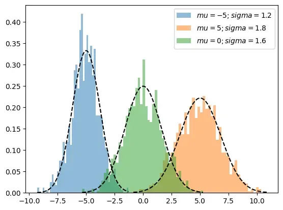
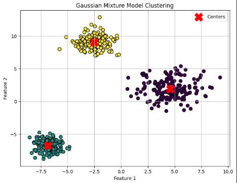
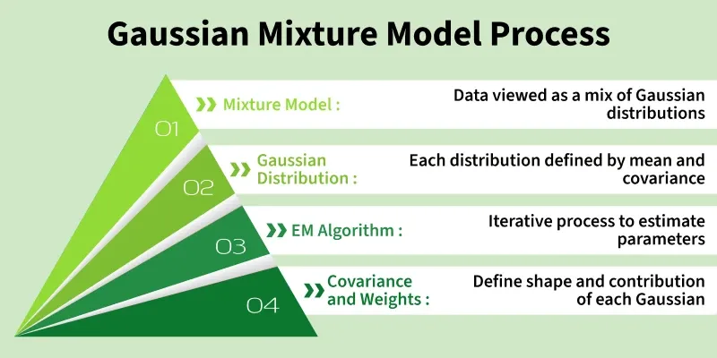
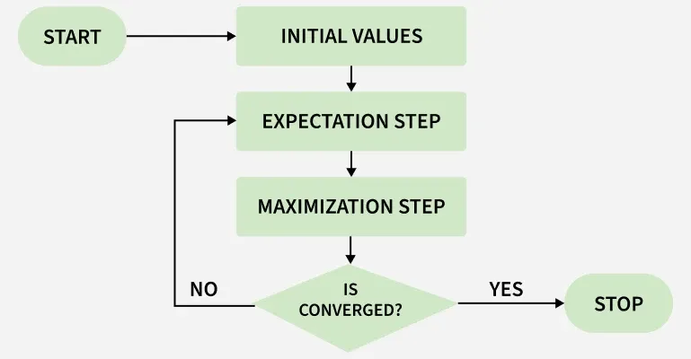
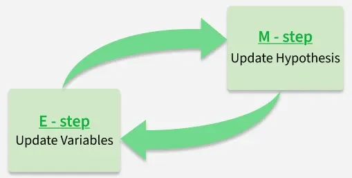
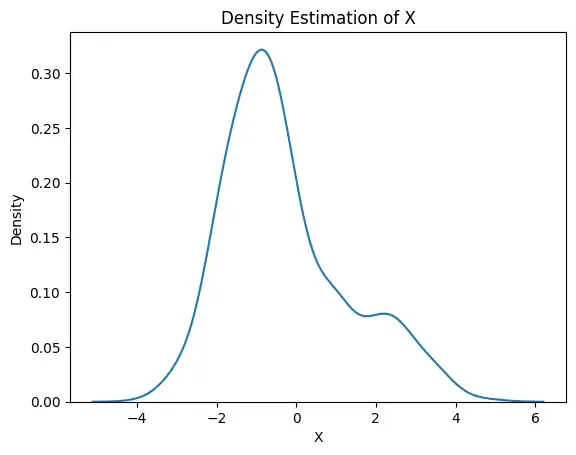
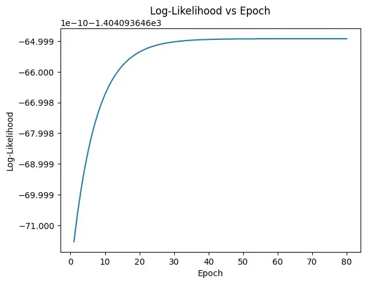
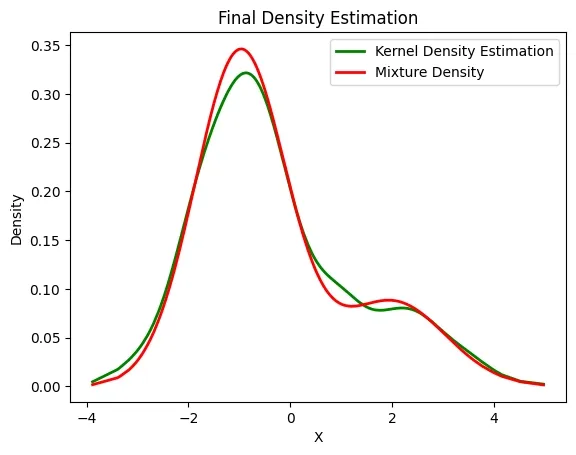
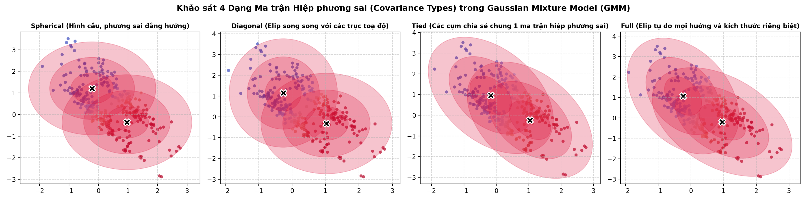

# Bài giảng: Distribution-based Clustering – Gaussian Mixture Models (GMM) & Thuật toán Expectation-Maximization (EM)

**Cập nhật lần cuối:** 22 tháng 9 năm 2026  
**Học phần:** Phân tích dữ liệu với Python (DSAI1005)  
**Giảng viên:** TS. Vũ Đức Minh – Khoa Khoa học dữ liệu và Trí tuệ nhân tạo, Trường Công nghệ và Kinh tế số, Đại học Kinh tế Quốc dân (NEU)  
**Nguồn tài liệu tham khảo chính:**  
- [GeeksforGeeks – Gaussian Mixture Model](https://www.geeksforgeeks.org/gaussian-mixture-model/)  
- [GeeksforGeeks – Expectation-Maximization Algorithm - ML](https://www.geeksforgeeks.org/ml-expectation-maximization-algorithm/)

---

## Mục lục bài học

1. [Tổng quan về Phương pháp Phân cụm Dựa trên Phân phối Xác suất (Distribution-based Clustering)](#1-tổng-quan-về-phương-pháp-phân-cụm-dựa-trên-phân-phối-xác-suất-distribution-based-clustering)
2. [Mục tiêu bài học (Learning Objectives)](#2-mục-tiêu-bài-học-learning-objectives)
3. [Mô hình Hỗn hợp Gauss (Gaussian Mixture Model - GMM)](#3-mô-hình-hỗn-hợp-gauss-gaussian-mixture-model---gmm)
   - 3.1. Phân phối Chuẩn Đa biến (Multivariate Normal Distribution)
   - 3.2. Cấu trúc Mô hình Hỗn hợp và Trọng số thành phần ($\pi_k$)
   - 3.3. Xác suất Hậu nghiệm & "Trách nhiệm thành viên" (Cluster Responsibility $\gamma_{nk}$)
   - 3.4. Hàm Hợp lý (Likelihood) & Thách thức tối ưu hóa hàm Log-Likelihood
4. [Thuật toán Kỳ vọng - Cực đại hóa (Expectation-Maximization - EM Algorithm)](#4-thuật-toán-kỳ-vọng---cực-đại-hóa-expectation-maximization---em-algorithm)
   - 4.1. Động lực: Tối ưu hóa mô hình khi có Biến ẩn (Latent Variables)
   - 4.2. Bước E (Expectation Step): Tính toán xác suất thành viên hậu nghiệm
   - 4.3. Bước M (Maximization Step): Cập nhật Trọng số, Vector Trung bình và Ma trận Hiệp phương sai
   - 4.4. Định lý hội tụ đơn điệu của hàm Log-Likelihood
   - 4.5. Mối quan hệ toán học mật thiết: K-Means là trường hợp giới hạn đặc biệt của GMM
5. [Khảo sát 4 Dạng Ma trận Hiệp phương sai (Covariance Types)](#5-khảo-sát-4-dạng-ma-trận-hiệp-phương-sai-covariance-types)
   - 5.1. `covariance_type='spherical'`
   - 5.2. `covariance_type='diag'`
   - 5.3. `covariance_type='tied'`
   - 5.4. `covariance_type='full'`
6. [Lựa chọn Số lượng Cụm $K$ Tối ưu bằng Tiêu chuẩn Thông tin (AIC & BIC)](#6-lựa-chọn-số-lượng-cụm-k-tối-ưu-bằng-tiêu-chuẩn-thông-tin-aic--bic)
7. [So sánh Đa chiều: K-Means vs Hierarchical vs DBSCAN vs GMM](#7-so-sánh-đa-chiều-k-means-vs-hierarchical-vs-dbscan-vs-gmm)
8. [Các Ứng dụng Đột phá của GMM trong Thực tế](#8-các-ứng-dụng-đột-phá-của-gmm-trong-thực-tế)
9. [Hướng dẫn Thực hành Lập trình Python Toàn diện](#9-hướng-dẫn-thực-hành-lập-trình-python-toàn-diện)
   - 9.1. Bài toán 1: Tự cài đặt thuật toán EM cho GMM 1 chiều bằng NumPy thuần
   - 9.2. Bài toán 2: Phân cụm dữ liệu đa chiều và vẽ Elip tin cậy bằng Scikit-Learn
   - 9.3. Bài toán 3: Thực nghiệm quét đường cong AIC/BIC xác định số cụm tối ưu
   - 9.4. Bài toán 4: Khử nhiễu và Tách nền ảnh (Background Subtraction) với GMM
10. [Tổng kết & Bộ câu hỏi ôn tập chuyên sâu có lời giải](#10-tổng-kết--bộ-câu-hỏi-ôn-tập-chuyên-sâu-có-lời-giải)
11. [Tài liệu tham khảo](#11-tài-liệu-tham-khảo)

---

## 1. Tổng quan về Phương pháp Phân cụm Dựa trên Phân phối Xác suất (Distribution-based Clustering)

Trong thế giới của Học máy không giám sát, các thuật toán phân cụm phẳng kinh điển như **K-Means** hay **DBSCAN** đều áp dụng nguyên lý **Phân cụm cứng (Hard Clustering)**: Một điểm dữ liệu $x_i$ hoặc thuộc về Cụm $A$ ($100\%$), hoặc thuộc về Cụm $B$ ($100\%$).

Tuy nhiên, trong thực tế kinh doanh và tự nhiên, ranh giới giữa các nhóm dữ liệu hiếm khi rạch ròi:
- Một khách hàng có thể mang $70\%$ đặc điểm của nhóm *"Mua sắm tiết kiệm"* và $30\%$ đặc điểm của nhóm *"Thích đồ công nghệ xa xỉ"*.
- Một bệnh nhân có thể có các chỉ số sinh hóa nằm ở vùng giao thoa giữa trạng thái *"Khỏe mạnh"* ($55\%$) và *"Tiền tiểu đường"* ($45\%$).
- Các cụm dữ liệu thực tế thường không phải là các hình cầu hoàn hảo mà bị kéo giãn thành các khối bầu dục (elip) nghiêng theo các góc bất kỳ, đan xen và chồng lấn lên nhau (overlapping clusters).

<p align="center">
  
</p>

Để phản ánh chính xác bản chất bất định này, **Phương pháp Phân cụm Dựa trên Phân phối (Distribution-based Clustering)** tiếp cận bài toán dưới lăng kính xác suất thống kê tạo sinh (Generative Probabilistic Modeling):

> *"Toàn bộ dữ liệu quan sát được sinh ra từ một tổ hợp (hỗn hợp) gồm $K$ phân phối xác suất tiềm ẩn. Mỗi cụm đại diện cho một phân phối thành phần. Nhiệm vụ của mô hình là ước lượng tham số của từng phân phối và gán cho mỗi điểm dữ liệu một **phân phối xác suất thành viên mềm (Soft Assignment / Responsibility)** thuộc về từng cụm."*

Giải thuật vĩ đại nhất đại diện cho trường phái này là **Mô hình Hỗn hợp Gauss (Gaussian Mixture Model - GMM)** được tối ưu hóa thông qua **Thuật toán Kỳ vọng - Cực đại hóa (Expectation-Maximization - EM)**.

---

## 2. Mục tiêu bài học (Learning Objectives)

Sau khi hoàn thành bài giảng này, học viên có năng lực:
1. **Làm chủ nền tảng toán học GMM:** Hiểu sâu công thức hàm mật độ xác suất chuẩn đa biến, vai trò của vector trung bình $\mu_k$, ma trận hiệp phương sai $\Sigma_k$, và trọng số hòa trộn $\pi_k$.
2. **Nắm vững giải thuật Expectation-Maximization (EM):**
   - Bản chất của bài toán biến ẩn (Latent Variable) và cực đại hóa hợp lý (Maximum Likelihood Estimation - MLE).
   - Bước E (Expectation Step): Tính trách nhiệm hậu nghiệm $\gamma_{nk} = P(z_{nk}=1 \mid x_n)$.
   - Bước M (Maximization Step): Công thức cập nhật có trọng số cho $\pi_k, \mu_k, \Sigma_k$.
   - Chứng minh tính đơn điệu tăng của hàm Log-Likelihood qua từng vòng lặp.
3. **Hiểu bản chất liên kết giữa K-Means và GMM:** Chứng minh K-Means thực chất là một trường hợp suy biến giới hạn (limiting case) của GMM khi phương sai tiến về 0.
4. **Phân biệt 4 dạng ma trận hiệp phương sai trong Scikit-Learn:** `spherical`, `diag`, `tied`, và `full`, biết cách lựa chọn phù hợp để cân bằng giữa độ phức tạp tính toán và độ khớp dữ liệu.
5. **Ứng dụng tiêu chuẩn thông tin AIC và BIC:** Tự động hóa việc lựa chọn số cụm tối ưu $K$ dựa trên hàm phạt độ phức tạp mô hình.
6. **Thành thạo lập trình Python:** Tự cài đặt thuật toán EM bằng NumPy và ứng dụng lớp `GaussianMixture` của Scikit-Learn trên dữ liệu thực tế.

---

## 3. Mô hình Hỗn hợp Gauss (Gaussian Mixture Model - GMM)

### 3.1. Phân phối Chuẩn Đa biến (Multivariate Normal Distribution)

Trong không gian $d$ chiều, một biến ngẫu nhiên liên tục $x \in \mathbb{R}^d$ tuân theo phân phối Chuẩn đa biến (Multivariate Gaussian) với vector kỳ vọng $\mu \in \mathbb{R}^d$ và ma trận hiệp phương sai $\Sigma \in \mathbb{R}^{d \times d}$ (đối xứng, xác định dương) có hàm mật độ xác suất (Probability Density Function - PDF):

$$\mathcal{N}(x \mid \mu, \Sigma) = \frac{1}{(2\pi)^{d/2} |\Sigma|^{1/2}} \exp \left( -\frac{1}{2} (x - \mu)^T \Sigma^{-1} (x - \mu) \right)$$

Trong đó:
- $\mu$: Vector kỳ vọng quy định **tọa độ tâm** của cụm dữ liệu.
- $\Sigma$: Ma trận hiệp phương sai quy định **kích thước, độ phân tán và hướng xoay (hình dạng elip)** của cụm trong không gian.
- $|\Sigma|$: Định thức (Determinant) của ma trận $\Sigma$.
- $\Sigma^{-1}$: Ma trận nghịch đảo của $\Sigma$.
- $(x - \mu)^T \Sigma^{-1} (x - \mu)$: Khoảng cách Mahalanobis bình phương giữa điểm $x$ và tâm $\mu$.

### 3.2. Cấu trúc Mô hình Hỗn hợp và Trọng số thành phần ($\pi_k$)

Một Mô hình Hỗn hợp Gauss giả định rằng mật độ xác suất của một quan sát bất kỳ $x$ là tổng có trọng số của $K$ phân phối Gauss thành phần:

$$p(x) = \sum_{k=1}^K \pi_k \mathcal{N}(x \mid \mu_k, \Sigma_k)$$

Các hệ số $\pi_k$ được gọi là **Trọng số hòa trộn (Mixing Weights / Mixture Coefficients)** hay xác suất tiên nghiệm (Prior Probabilities) $P(z = k)$ để một quan sát rơi vào thành phần thứ $k$. Chúng thỏa mãn hai điều kiện tiên đề xác suất:
$$0 \le \pi_k \le 1 \quad \text{và} \quad \sum_{k=1}^K \pi_k = 1$$

<p align="center">
  
</p>

### 3.3. Xác suất Hậu nghiệm & "Trách nhiệm thành viên" (Cluster Responsibility $\gamma_{nk}$)

Giả sử ta quan sát được điểm dữ liệu $x_n$. Điểm này thực sự được sinh ra bởi cụm nào trong số $K$ cụm Gauss?

Đặt $z_n \in \{1, \dots, K\}$ là một **Biến ẩn (Latent Variable)** chỉ ra cụm nguồn cội đã sinh ra $x_n$. Áp dụng **Định lý Bayes**, xác suất hậu nghiệm (Posterior Probability) để điểm $x_n$ thuộc về cụm $k$ — thường được gọi là **Trách nhiệm (Responsibility)** của cụm $k$ đối với $x_n$, ký hiệu là $\gamma_{nk}$ — được tính như sau:

$$\gamma_{nk} \equiv P(z_n = k \mid x_n) = \frac{P(z_n = k) P(x_n \mid z_n = k)}{P(x_n)} = \frac{\pi_k \mathcal{N}(x_n \mid \mu_k, \Sigma_k)}{\sum_{j=1}^K \pi_j \mathcal{N}(x_n \mid \mu_j, \Sigma_j)}$$

Đặc tính quan trọng:
- $\sum_{k=1}^K \gamma_{nk} = 1$ đối với mọi điểm $x_n$.
- Giá trị $\gamma_{nk} \in [0, 1]$ cung cấp mức độ tự tin (Confidence) của mô hình: nếu $\gamma_{n1} = 0.95$, mô hình gần như chắc chắn $x_n$ thuộc cụm 1; nếu $\gamma_{n1} = 0.51$ và $\gamma_{n2} = 0.49$, điểm $x_n$ nằm ngay tại ranh giới giao thoa mập mờ giữa hai cụm.

### 3.4. Hàm Hợp lý (Likelihood) & Thách thức tối ưu hóa hàm Log-Likelihood

Cho tập dữ liệu gồm $N$ quan sát độc lập cùng phân phối (i.i.d) $\mathcal{X} = \{x_1, x_2, \dots, x_N\}$. Hàm hợp lý toàn cục là tích xác suất của tất cả các quan sát:

$$L(\theta) = \prod_{n=1}^N p(x_n) = \prod_{n=1}^N \sum_{k=1}^K \pi_k \mathcal{N}(x_n \mid \mu_k, \Sigma_k)$$

Lấy logarit tự nhiên để thu được hàm **Log-Likelihood**:

$$\ln L(\theta) = \sum_{n=1}^N \ln \left( \sum_{k=1}^K \pi_k \mathcal{N}(x_n \mid \mu_k, \Sigma_k) \right)$$

*Thách thức cốt tử:* Dấu tổng $\sum_{k=1}^K$ nằm **bên trong** hàm $\ln$. Do đó, khi ta lấy đạo hàm riêng theo các tham số $\{\mu_k, \Sigma_k, \pi_k\}$ và cho bằng 0 ($\nabla_\theta \ln L = 0$), phương trình thu được là phi tuyến cao bậc và không thể giải được nghiệm giải tích dạng đóng (Closed-form Analytical Solution).

Đây chính là lý do chúng ta bắt buộc phải sử dụng **Thuật toán Expectation-Maximization (EM)**.

---

## 4. Thuật toán Kỳ vọng - Cực đại hóa (Expectation-Maximization - EM Algorithm)

Thuật toán EM được công bố chính thức trong bài báo kinh điển của A. P. Dempster, N. M. Laird và D. B. Rubin (1977). Nó là một khung tối ưu hóa lặp để tìm ước lượng hợp lý cực đại (MLE) cho các mô hình chứa biến ẩn.

<p align="center">
  
</p>

### 4.1. Động lực: Tối ưu hóa mô hình khi có Biến ẩn (Latent Variables)

- Nếu chúng ta biết trước nhãn $z_n$ của từng điểm dữ liệu (dữ liệu đầy đủ), việc ước lượng $\mu_k, \Sigma_k, \pi_k$ chỉ đơn giản là tính trung bình và ma trận hiệp phương sai mẫu riêng biệt của từng nhóm.
- Ngược lại, nếu chúng ta biết trước các tham số $\mu_k, \Sigma_k, \pi_k$, việc xác định xác suất thuộc cụm $\gamma_{nk}$ của từng điểm là phép tính Bayes đơn giản.
- Nghịch lý "con gà và quả trứng" này được thuật toán EM giải quyết bằng cách luân phiên lặp qua hai bước:

### 4.2. Bước E (Expectation Step): Tính toán xác suất thành viên hậu nghiệm

Sử dụng các tham số hiện tại $\theta^{(t)} = \{\mu_k^{(t)}, \Sigma_k^{(t)}, \pi_k^{(t)}\}$, tính toán kỳ vọng của biến ẩn, tức là ma trận trách nhiệm $\gamma_{nk}$ kích thước $N \times K$:

<p align="center">
  
</p>

$$\gamma_{nk}^{(t)} = \frac{\pi_k^{(t)} \mathcal{N}(x_n \mid \mu_k^{(t)}, \Sigma_k^{(t)})}{\sum_{j=1}^K \pi_j^{(t)} \mathcal{N}(x_n \mid \mu_j^{(t)}, \Sigma_j^{(t)})}$$

### 4.3. Bước M (Maximization Step): Cập nhật Trọng số, Vector Trung bình và Ma trận Hiệp phương sai

Sử dụng ma trận trách nhiệm $\gamma_{nk}^{(t)}$ vừa tính được từ Bước E, cập nhật lại bộ tham số mới $\theta^{(t+1)}$ bằng cách cực đại hóa hàm kỳ vọng hợp lý có trọng số:

<p align="center">
  
</p>

1. **Tổng trách nhiệm hiệu dụng của Cụm $k$:**
   $$N_k = \sum_{n=1}^N \gamma_{nk}$$
   *(Có thể xem $N_k$ là "số lượng điểm tương đương" thuộc về cụm $k$).*

2. **Cập nhật Trọng số hòa trộn mới $\pi_k^{\text{new}}$:**
   $$\pi_k^{(t+1)} = \frac{N_k}{N}$$

3. **Cập nhật Vector Kỳ vọng mới $\mu_k^{\text{new}}$:**
   $$\mu_k^{(t+1)} = \frac{1}{N_k} \sum_{n=1}^N \gamma_{nk} x_n$$
   *(Trung bình có trọng số của các điểm dữ liệu theo trách nhiệm của cụm $k$).*

4. **Cập nhật Ma trận Hiệp phương sai mới $\Sigma_k^{\text{new}}$:**
   $$\Sigma_k^{(t+1)} = \frac{1}{N_k} \sum_{n=1}^N \gamma_{nk} \left(x_n - \mu_k^{(t+1)}\right) \left(x_n - \mu_k^{(t+1)}\right)^T$$

<p align="center">
  
</p>

### 4.4. Định lý hội tụ đơn điệu của hàm Log-Likelihood

Một đặc tính toán học đẹp đẽ của thuật toán EM là: **Giá trị hàm Log-Likelihood được đảm bảo không bao giờ giảm sau mỗi chu kỳ (E-step + M-step)**:

$$\ln L(\theta^{(t+1)}) \ge \ln L(\theta^{(t)})$$

<p align="center">
  
</p>

*Điều kiện dừng:* Thuật toán dừng lại khi mức cải thiện của hàm Log-Likelihood giữa hai bước liên tiếp nhỏ hơn một ngưỡng dung sai định trước:
$$\left| \ln L(\theta^{(t+1)}) - \ln L(\theta^{(t)}) \right| < \text{tol} \quad (\text{ví dụ: } 10^{-3})$$
hoặc khi chạm mốc số vòng lặp tối đa `max_iter`.

<p align="center">
  
</p>

### 4.5. Mối quan hệ toán học mật thiết: K-Means là trường hợp giới hạn đặc biệt của GMM

Có một mối liên hệ biện chứng sâu sắc giữa K-Means và GMM:

> **Định lý:** *Thuật toán K-Means là một trường hợp suy biến giới hạn (Limiting Case) của thuật toán GMM khi ma trận hiệp phương sai của tất cả các cụm bằng nhau, có dạng hình cầu đẳng hướng $\Sigma_k = \epsilon I$, và phương sai $\epsilon \to 0$.*

*Chứng minh trực giác:*
1. Khi $\Sigma_k = \epsilon I$, khoảng cách Mahalanobis trở thành khoảng cách Euclidean:
   $$\mathcal{N}(x_n \mid \mu_k, \epsilon I) \propto \exp\left( -\frac{1}{2\epsilon} \|x_n - \mu_k\|_2^2 \right)$$
2. Khi $\epsilon \to 0$, số mũ $-\frac{1}{2\epsilon} \|x_n - \mu_k\|_2^2$ sẽ phạt cực nặng mọi điểm nằm cách xa tâm $\mu_k$. Do đó:
   $$\gamma_{nk} = \begin{cases} 1 & \text{nếu } k = \arg\min_j \|x_n - \mu_j\|_2^2 \\ 0 & \text{ngược lại} \end{cases}$$
   Xác suất mềm $\gamma_{nk} \in [0, 1]$ trở thành chỉ số nhị phân cứng $\{0, 1\}$ (chính là bước Gán cụm của K-Means).
3. Khi $\gamma_{nk} \in \{0, 1\}$, công thức cập nhật tâm $\mu_k = \frac{1}{N_k} \sum \gamma_{nk} x_n$ trùng khớp $100\%$ với bước Cập nhật trọng tâm của K-Means!

---

## 5. Khảo sát 4 Dạng Ma trận Hiệp phương sai (Covariance Types)

Trong Scikit-Learn (`sklearn.mixture.GaussianMixture`), tham số `covariance_type` cho phép người phân tích kiểm soát số lượng bậc tự do và hình thái hình học của các cụm:

<p align="center">
  
</p>

### 5.1. `covariance_type='spherical'`
- **Cấu trúc:** Mỗi cụm có một phương sai vô hướng duy nhất: $\Sigma_k = \sigma_k^2 I$.
- **Hình học:** Cụm có dạng **hình cầu đẳng hướng** (tương tự K-Means), nhưng khác K-Means ở chỗ các cụm có thể có bán kính $\sigma_k$ to nhỏ khác nhau.
- **Số tham số cần ước lượng:** $K$ tham số. Rất nhanh, khó bị Overfitting.

### 5.2. `covariance_type='diag'`
- **Cấu trúc:** $\Sigma_k = \text{diag}(\sigma_{k1}^2, \sigma_{k2}^2, \dots, \sigma_{kd}^2)$.
- **Hình học:** Cụm có dạng **hình bầu dục (elip)** nhưng các trục chính của elip **bắt buộc phải song song với các trục tọa độ**. Nó giả định các đặc trưng độc lập có điều kiện với nhau.
- **Số tham số:** $K \times d$. Phù hợp cho dữ liệu nhiều chiều ($d$ lớn).

### 5.3. `covariance_type='tied'`
- **Cấu trúc:** Tất cả $K$ cụm chia sẻ chung một ma trận hiệp phương sai duy nhất: $\Sigma_k = \Sigma, \forall k$.
- **Hình học:** Các cụm có hình dạng elip và góc nghiêng **giống hệt nhau**, chỉ khác nhau về vị trí tâm $\mu_k$.
- **Số tham số:** $d(d + 1)/2$.

### 5.4. `covariance_type='full'` (Mặc định)
- **Cấu trúc:** Mỗi cụm sở hữu một ma trận hiệp phương sai đối xứng xác định dương độc lập hoàn toàn $\Sigma_k$.
- **Hình học:** Mỗi cụm là một hình elip tự do định hướng theo bất kỳ góc xoay nào trong không gian với kích thước và độ lệch chuẩn tùy ý.
- **Số tham số:** $K \times d(d + 1)/2$. Linh hoạt nhất, khớp dữ liệu tốt nhất nhưng dễ bị Overfitting và lỗi suy biến ma trận (Singular Matrix) nếu dữ liệu ít.

---

## 6. Lựa chọn Số lượng Cụm $K$ Tối ưu bằng Tiêu chuẩn Thông tin (AIC & BIC)

Trong GMM, hàm Log-Likelihood luôn tăng khi ta tăng số lượng thành phần $K$ (tương tự như Inertia luôn giảm trong K-Means). Vì vậy, ta không thể dùng Log-Likelihood đơn thuần để chọn $K$ vì sẽ dẫn tới hiện tượng quá khớp (Overfitting).

Hai công cụ toán học chuẩn mực để cân bằng giữa **Độ khớp dữ liệu (Goodness of Fit)** và **Độ phức tạp của mô hình (Model Complexity)** là:

1. **Tiêu chuẩn Thông tin Bayes (Bayesian Information Criterion - BIC):**
   $$\text{BIC} = -2 \ln L + p \ln N$$

2. **Tiêu chuẩn Thông tin Akaike (Akaike Information Criterion - AIC):**
   $$\text{AIC} = -2 \ln L + 2p$$

Trong đó:
- $L$: Giá trị hợp lý cực đại đạt được của mô hình.
- $N$: Tổng số điểm dữ liệu.
- $p$: Tổng số tham số tự do cần ước lượng trong mô hình:
  - Với `covariance_type='full'`: $p = (K - 1) + K \cdot d + K \cdot \frac{d(d + 1)}{2}$.

> **Quy tắc vàng:** **Mô hình có giá trị BIC (hoặc AIC) THẤP NHẤT chính là mô hình tối ưu nhất.**  
> BIC phạt nặng số lượng tham số hơn AIC (do nhân với hệ số $\ln N$), vì vậy BIC thường có xu hướng chọn các mô hình tinh gọn, tránh được hiện tượng phân rã cụm quá mức.

---

## 7. So sánh Đa chiều: K-Means vs Hierarchical vs DBSCAN vs GMM

| Tiêu chí | K-Means | Hierarchical (Ward) | DBSCAN | Gaussian Mixture Model (GMM) |
| :--- | :--- | :--- | :--- | :--- |
| **Bản chất phân cụm** | Phân cụm cứng (Hard) | Phân cụm cứng (Hard) | Phân cụm cứng (Hard) | **Phân cụm mềm (Soft / Probabilistic)** |
| **Mô hình xác suất tạo sinh** | Không (Hình học thuần túy) | Không | Không | **Có** (Tổng của $K$ hàm mật độ Gauss) |
| **Hình thái cụm hỗ trợ** | Chỉ hình cầu lồi | Hình cầu / Tùy Linkage | Mọi hình dạng tùy ý | **Hình Elip tự do (kéo giãn, nghiêng)** |
| **Xử lý Cụm Chồng lấn (Overlap)** | ❌ Rất kém | ❌ Rất kém | ❌ Gộp chung cụm | ✅ **Xuất sắc** (Mô hình hóa bằng xác suất hậu nghiệm) |
| **Xử lý Ngoại lai (Noise)** | Kém (bị kéo tâm) | Kém | **Xuất sắc** (Nhãn `-1`) | Trung bình (có thể thêm 1 phân phối đều nền) |
| **Tiêu chuẩn chọn $K$** | Elbow Method, Silhouette | Cắt nhánh dọc Dendrogram | Không cần $K$ (Dùng $\epsilon$, MinPts) | **Đường cong cực tiểu BIC / AIC** |
| **Độ phức tạp thuật toán** | $O(N \cdot K \cdot I \cdot d)$ (Rất nhanh) | $O(N^2 \log N)$ (Chậm) | $O(N \log N)$ đến $O(N^2)$ | $O(N \cdot K \cdot I \cdot d^3)$ (Khá tốn kém khi $d$ lớn) |
| **Mức độ phụ thuộc khởi tạo** | Cao (Cần K-Means++) | Không (Tất định 100%) | Thấp (Tất định trên Core points) | **Cao** (Thường khởi tạo tâm bằng K-Means) |

---

## 8. Các Ứng dụng Đột phá của GMM trong Thực tế

1. **Xử lý Tiếng nói và Nhận dạng Giọng nói (Speech Processing & Speaker Diarization):**
   - Trước khi Deep Learning bùng nổ, GMM kết hợp HMM (Hidden Markov Model) là kiến trúc thống trị các hệ thống nhận dạng tiếng nói (như Dragon NaturallySpeaking). Mỗi người nói có một phân phối tần số âm thanh (MFCC) được mô hình hóa bởi một GMM riêng biệt.

2. **Thị giác Máy tính: Tách nền và Phát hiện Chuyển động (Background Subtraction):**
   - Mỗi pixel trong khung hình camera an ninh được mô hình hóa bằng một GMM gồm 3 đến 5 thành phần Gauss đại diện cho màu sắc nền qua thời gian (bóng râm, lá cây lay động, ánh sáng thay đổi). Bất kỳ pixel nào có xác suất xuất hiện dưới ngưỡng $\alpha$ đều được phân loại là vật thể chuyển động.

3. **Khai phá Tài chính & Quản trị Rủi ro (Financial Modeling & Value-at-Risk):**
   - Lợi suất cổ phiếu thực tế không tuân theo phân phối chuẩn đơn lẻ mà có hiện tượng đuôi béo (Fat Tails) và biến động bất đối xứng. GMM được dùng để mô hình hóa trạng thái thị trường hỗn hợp: Thị trường bình ổn (Gauss phương sai thấp) vs Khủng hoảng tài chính (Gauss phương sai cực cao).

4. **Phân khúc Khách hàng Bất định (Fuzzy Customer Profiling):**
   - Phân loại khách hàng trên sàn thương mại điện tử vào các phân khúc không ranh giới cứng, cho phép bộ máy gợi ý (Recommendation Engine) đề xuất đa dạng sản phẩm phù hợp với tỷ trọng quan tâm của người dùng.

---

## 9. Hướng dẫn Thực hành Lập trình Python Toàn diện

### 9.1. Bài toán 1: Tự cài đặt thuật toán EM cho GMM 1 chiều bằng NumPy thuần

Đoạn mã dưới đây minh họa toàn bộ cơ chế toán học của Bước E, Bước M và hàm Log-Likelihood mà không dùng thư viện Machine Learning bậc cao:

```python
import numpy as np
import matplotlib.pyplot as plt

# 1. Khởi tạo dữ liệu mô phỏng từ 2 phân phối Gauss 1 chiều
np.random.seed(42)
N1, N2 = 300, 700
X1 = np.random.normal(loc=-2.0, scale=0.8, size=N1)
X2 = np.random.normal(loc=3.0, scale=1.2, size=N2)
X = np.concatenate([X1, X2])
N = len(X)

# 2. Khởi tạo ngẫu nhiên các tham số (K = 2)
mu = np.array([-0.5, 1.0])
sigma = np.array([1.0, 1.0])
pi = np.array([0.5, 0.5])

def gaussian_pdf(x, m, s):
    return (1.0 / (np.sqrt(2 * np.pi) * s)) * np.exp(-0.5 * ((x - m) / s) ** 2)

# 3. Vòng lặp Expectation-Maximization
log_likelihoods = []
max_iter = 50
tol = 1e-4

for iteration in range(max_iter):
    # --- Bước E: Tính toán trách nhiệm thành viên (gamma) ---
    pdf1 = gaussian_pdf(X, mu[0], sigma[0])
    pdf2 = gaussian_pdf(X, mu[1], sigma[1])
    
    total_density = pi[0] * pdf1 + pi[1] * pdf2
    gamma1 = (pi[0] * pdf1) / total_density
    gamma2 = (pi[1] * pdf2) / total_density
    
    # Tính Log-Likelihood
    current_ll = np.sum(np.log(total_density))
    log_likelihoods.append(current_ll)
    
    # Kiểm tra điều kiện dừng
    if iteration > 0 and abs(log_likelihoods[-1] - log_likelihoods[-2]) < tol:
        print(f"Thuật toán EM hội tụ thành công tại vòng lặp thứ {iteration}!")
        break
        
    # --- Bước M: Cập nhật lại các tham số ---
    N1_eff = np.sum(gamma1)
    N2_eff = np.sum(gamma2)
    
    # Cập nhật pi
    pi[0] = N1_eff / N
    pi[1] = N2_eff / N
    
    # Cập nhật mu
    mu[0] = np.sum(gamma1 * X) / N1_eff
    mu[1] = np.sum(gamma2 * X) / N2_eff
    
    # Cập nhật sigma
    sigma[0] = np.sqrt(np.sum(gamma1 * (X - mu[0]) ** 2) / N1_eff)
    sigma[1] = np.sqrt(np.sum(gamma2 * (X - mu[1]) ** 2) / N2_eff)

print(f"Ước lượng mu: {np.round(mu, 3)} | Kỳ vọng thực tế: [-2.0, 3.0]")
print(f"Ước lượng sigma: {np.round(sigma, 3)} | Kỳ vọng thực tế: [0.8, 1.2]")
print(f"Ước lượng pi: {np.round(pi, 3)} | Kỳ vọng thực tế: [0.3, 0.7]")
```

---

### 9.2. Bài toán 2: Phân cụm dữ liệu đa chiều và vẽ Elip tin cậy bằng Scikit-Learn

Sử dụng lớp `sklearn.mixture.GaussianMixture` để phân cụm dữ liệu 2 chiều và vẽ các đường viền elip thể hiện mức tin cậy $1\sigma, 2\sigma, 3\sigma$:

```python
import numpy as np
import matplotlib.pyplot as plt
from sklearn.mixture import GaussianMixture
from matplotlib.patches import Ellipse
from sklearn.datasets import make_blobs

# 1. Tạo dữ liệu elip nghiêng bằng phép biến đổi Affine
np.random.seed(42)
X, _ = make_blobs(n_samples=400, centers=[[0, 0], [4, 4]], cluster_std=[1.0, 1.2], random_state=42)
X = np.dot(X, [[0.6, -0.6], [-0.4, 0.8]])

# 2. Huấn luyện mô hình GMM với ma trận hiệp phương sai đầy đủ (full)
gmm = GaussianMixture(n_components=2, covariance_type='full', random_state=42)
gmm.fit(X)
labels = gmm.predict(X)
probs = gmm.predict_proba(X)

# 3. Hàm phụ trợ vẽ đường elip tin cậy của phân phối Gauss
def draw_ellipse(position, covariance, ax=None, **kwargs):
    ax = ax or plt.gca()
    U, s, Vt = np.linalg.svd(covariance)
    angle = np.degrees(np.arctan2(U[1, 0], U[0, 0]))
    width, height = 2 * np.sqrt(s)
    for nsig in range(1, 4):
        ax.add_patch(Ellipse(position, nsig * width, nsig * height, angle=angle, **kwargs))

# 4. Trực quan hóa kết quả
plt.figure(figsize=(9, 6))
ax = plt.gca()

# Các điểm được tô màu theo xác suất thành viên của cụm 0
scatter = ax.scatter(X[:, 0], X[:, 1], c=probs[:, 0], cmap='coolwarm', s=35, edgecolors='k', alpha=0.8)
cbar = plt.colorbar(scatter)
cbar.set_label('Xác suất thuộc về Cụm 0 ($P(z=0 \\mid x)$)', fontsize=10)

# Vẽ các đường elip đại diện cho hình thái phân phối
for pos, cov in zip(gmm.means_, gmm.covariances_):
    draw_ellipse(pos, cov, ax=ax, alpha=0.2, color='crimson')

ax.scatter(gmm.means_[:, 0], gmm.means_[:, 1], s=150, c='gold', marker='X', edgecolors='black', lw=2, label='Tâm Gauss (Means)')
plt.title('Kết quả Phân cụm Mềm bằng GMM & Elip Tin cậy ($1\\sigma, 2\\sigma, 3\\sigma$)', fontsize=12, fontweight='bold')
plt.xlabel('Đặc trưng 1')
plt.ylabel('Đặc trưng 2')
plt.legend()
plt.grid(True, linestyle='--', alpha=0.5)
plt.tight_layout()
plt.show()
```

---

### 9.3. Bài toán 3: Thực nghiệm quét đường cong AIC/BIC xác định số cụm tối ưu

Đoạn mã sau tự động quét các giá trị $K \in [1, 8]$ và so sánh 2 dạng ma trận hiệp phương sai (`full` vs `diag`) để tìm điểm cực tiểu BIC/AIC:

```python
import numpy as np
import matplotlib.pyplot as plt
from sklearn.mixture import GaussianMixture
from sklearn.datasets import make_blobs

# Tạo dữ liệu gồm 3 cụm tự nhiên
X, _ = make_blobs(n_samples=500, centers=3, cluster_std=[0.8, 1.2, 0.9], random_state=42)

n_components_range = range(1, 8)
cv_types = ['spherical', 'tied', 'diag', 'full']

bic_scores = {cv: [] for cv in cv_types}
aic_scores = {cv: [] for cv in cv_types}

for cv in cv_types:
    for n_c in n_components_range:
        gmm = GaussianMixture(n_components=n_c, covariance_type=cv, random_state=42)
        gmm.fit(X)
        bic_scores[cv].append(gmm.bic(X))
        aic_scores[cv].append(gmm.aic(X))

# Vẽ đồ thị khảo sát BIC
plt.figure(figsize=(12, 5))

plt.subplot(1, 2, 1)
for cv in cv_types:
    plt.plot(n_components_range, bic_scores[cv], marker='o', lw=2, label=f'Cov: {cv}')
plt.title('Đường cong Tiêu chuẩn Thông tin Bayes (BIC)', fontsize=12, fontweight='bold')
plt.xlabel('Số lượng thành phần Gauss (K)')
plt.ylabel('Điểm BIC (Càng thấp càng tốt)')
plt.legend()
plt.grid(True, linestyle='--', alpha=0.5)

plt.subplot(1, 2, 2)
for cv in cv_types:
    plt.plot(n_components_range, aic_scores[cv], marker='s', lw=2, linestyle='--', label=f'Cov: {cv}')
plt.title('Đường cong Tiêu chuẩn Thông tin Akaike (AIC)', fontsize=12, fontweight='bold')
plt.xlabel('Số lượng thành phần Gauss (K)')
plt.ylabel('Điểm AIC (Càng thấp càng tốt)')
plt.legend()
plt.grid(True, linestyle='--', alpha=0.5)

plt.tight_layout()
plt.show()
```

*Nhận định:* Đồ thị BIC và AIC đạt giá trị cực tiểu rõ rệt tại $K = 3$ với dạng `covariance_type='full'`, phản ánh chính xác số lượng cụm tiềm ẩn trong dữ liệu gốc.

---

### 9.4. Bài toán 4: Khử nhiễu và Tách nền ảnh (Background Subtraction) với GMM

Trong xử lý video giám sát giao thông, GMM được dùng để tách phương tiện chuyển động ra khỏi mặt đường tĩnh. Mỗi pixel qua $T$ khung hình được mô hình hóa bằng GMM:

```python
import numpy as np

def simulate_background_subtraction():
    # Mô phỏng lịch sử cường độ sáng của 1 pixel qua 100 khung hình (0 - 255)
    # Phần lớn thời gian là mặt đường (nền tĩnh): cường độ dao động quanh 120
    # Một vài thời điểm có xe cộ chạy qua (đột biến): cường độ nhảy lên 220
    np.random.seed(42)
    background = np.random.normal(loc=120, scale=5, size=90)
    car_passing = np.random.normal(loc=220, scale=10, size=10)
    pixel_history = np.concatenate([background, car_passing]).reshape(-1, 1)
    
    # Huấn luyện GMM với K = 2 thành phần (Nền vs Tiền cảnh)
    gmm = GaussianMixture(n_components=2, random_state=42)
    gmm.fit(pixel_history)
    
    # Thành phần có trọng số pi lớn nhất chính là nền tĩnh (Background)
    bg_idx = np.argmax(gmm.weights_)
    bg_mean = gmm.means_[bg_idx][0]
    bg_std = np.sqrt(gmm.covariances_[bg_idx][0][0])
    
    print("=== KẾT QUẢ TÁCH NỀN BẰNG GMM ===")
    print(f"Trọng số các thành phần: {np.round(gmm.weights_, 3)}")
    print(f"Trung bình nền tĩnh (Background Mean): {bg_mean:.2f}")
    print(f"Độ lệch chuẩn nền (Background Std): {bg_std:.2f}")
    
    # Kiểm tra một pixel mới có phải là vật thể chuyển động không
    new_pixel = 215.0
    z_score = abs(new_pixel - bg_mean) / bg_std
    is_foreground = z_score > 3.0
    print(f"Pixel mới = {new_pixel} | Z-Score so với nền: {z_score:.2f} -> Là vật thể chuyển động: {is_foreground}")

simulate_background_subtraction()
```

---

## 10. Tổng kết & Bộ câu hỏi ôn tập chuyên sâu có lời giải

### Tóm tắt cốt lõi bài học

1. **GMM là mô hình phân cụm mềm (Soft Clustering):** Mỗi cụm được biểu diễn bằng một phân phối chuẩn đa biến $\mathcal{N}(\mu_k, \Sigma_k)$ cùng trọng số $\pi_k$.
2. **Thuật toán EM:** Tối ưu hóa hàm Log-Likelihood thông qua vòng lặp hai bước luân phiên:
   - *Bước E:* Tính toán ma trận trách nhiệm hậu nghiệm $\gamma_{nk}$.
   - *Bước M:* Cập nhật lại $\pi_k, \mu_k, \Sigma_k$ bằng công thức trung bình có trọng số.
   - Luôn đảm bảo Log-Likelihood tăng đơn điệu và hội tụ về cực tiểu cục bộ.
3. **K-Means là trường hợp con đặc biệt của GMM** khi các ma trận hiệp phương sai bằng nhau, có dạng hình cầu đẳng hướng và phương sai $\sigma^2 \to 0$.
4. **4 Dạng ma trận hiệp phương sai:** `spherical` (hình cầu đơn giản), `diag` (elip song song trục tọa độ), `tied` (chia sẻ chung ma trận), và `full` (elip tự do tổng quát).
5. **Tiêu chuẩn AIC/BIC:** Công cụ toán học chuẩn mực nhất để xác định số lượng cụm $K$ tối ưu dựa trên điểm số cực tiểu.

---

### Bộ câu hỏi ôn tập chuyên sâu (Review Questions with Detailed Answers)

#### Câu hỏi 1: Phân tích sự khác nhau giữa Phân cụm cứng (Hard Clustering) của K-Means và Phân cụm mềm (Soft Clustering) của GMM. Trong bài toán dự báo rời bỏ của khách hàng (Churn Prediction), việc sở hữu xác suất hậu nghiệm $\gamma_{nk}$ mang lại giá trị gia tăng gì cho doanh nghiệp?
<details>
<summary><b>Xem lời giải chi tiết</b></summary>

**Lời giải:**
- **Sự khác biệt cốt lõi:**
  - *K-Means:* Gán dứt khoát mỗi khách hàng vào một cụm duy nhất (nhãn nhị phân $\{0, 1\}$). Khoảng cách giữa các khách hàng và tâm cụm không được chuyển đổi thành độ tin cậy.
  - *GMM:* Cung cấp một vector phân phối xác suất hậu nghiệm $[\gamma_{n1}, \gamma_{n2}, \dots, \gamma_{nK}]$ với $\sum \gamma_{nk} = 1$. Nó mô hình hóa mức độ thuộc về từng nhóm của khách hàng.
- **Giá trị gia tăng trong bài toán Churn Prediction:**
  1. *Phân tầng mức độ rủi ro (Risk Stratification):* Thay vì chỉ biết khách hàng thuộc nhóm "Có nguy cơ rời bỏ", doanh nghiệp có thể biết khách hàng $A$ có $90\%$ khả năng rời bỏ (cần can thiệp khẩn cấp bằng ưu đãi lớn), trong khi khách hàng $B$ chỉ có $52\%$ (rủi ro cận biên, chỉ cần gửi email chăm sóc).
  2. *Tối ưu hóa ngân sách tiếp thị (Marketing Budget Optimization):* Doanh nghiệp có thể sắp xếp thứ tự ưu tiên tiếp cận dựa trên giá trị kỳ vọng: $\text{Expected Loss} = \gamma_{\text{churn}} \times \text{Customer Lifetime Value (CLV)}$.
  3. *Nhận diện khách hàng lưỡng lự (Hybrid Customers):* Phát hiện những khách hàng có xác suất chia đều giữa các phân khúc hành vi để thiết kế các gói sản phẩm lai (cross-selling).
</details>

---

#### Câu hỏi 2: Tại sao hàm Log-Likelihood của GMM không thể giải trực tiếp bằng phương pháp đạo hàm giải tích thông thường ($\nabla_\theta \ln L = 0$)? Thuật toán EM giải quyết bế tắc này như thế nào?
<details>
<summary><b>Xem lời giải chi tiết</b></summary>

**Lời giải:**
- **Lý do không thể giải trực tiếp:**  
  Hàm Log-Likelihood của GMM có dạng:
  $$\ln L(\theta) = \sum_{n=1}^N \ln \left( \sum_{k=1}^K \pi_k \mathcal{N}(x_n \mid \mu_k, \Sigma_k) \right)$$
  Dấu tổng các thành phần $\sum_{k=1}^K$ bị "khóa" bên trong hàm logarit tự nhiên $\ln(\cdot)$. Khi lấy đạo hàm riêng theo $\mu_k$, số hạng $\frac{1}{\sum_{j} \pi_j \mathcal{N}_j}$ xuất hiện ở mẫu số, khiến tham số $\mu_k$ của tất cả các cụm bị ràng buộc chéo lẫn nhau trong một hệ phương trình phi tuyến phức tạp không có nghiệm giải tích dạng đóng.
- **Cách thuật toán EM giải quyết:**  
  EM đưa vào khái niệm **Biến ẩn (Latent Variable)** $z_n$. Thay vì tối ưu trực tiếp hàm log-likelihood quan sát (Incomplete-data Log-Likelihood), EM tối ưu hóa **Hàm kỳ vọng của Log-Likelihood toàn phần (Expected Complete-data Log-Likelihood)**:
  $$Q(\theta, \theta^{(t)}) = \mathbb{E}_{Z \mid X, \theta^{(t)}} [\ln p(X, Z \mid \theta)]$$
  Trong hàm toàn phần này, biến ẩn $z$ chuyển phép cộng bên trong hàm logarit thành phép nhân bên ngoài $\ln \prod_k [\pi_k \mathcal{N}_k]^{z_k} = \sum_k z_k \ln [\pi_k \mathcal{N}_k]$. Dấu logarit tác động trực tiếp lên hàm mũ Gauss, triệt tiêu hàm $\exp$ và biến bài toán trở thành hệ phương trình tuyến tính bậc nhất, giải được nghiệm tối ưu chính xác ở Bước M.
</details>

---

#### Câu hỏi 3: Phân tích hiện tượng Kỳ dị (Singularity Problem) trong GMM khi ma trận hiệp phương sai $\Sigma_k$ bị suy biến. Hiện tượng này thường xảy ra khi nào và làm thế nào để khắc phục trong thực tế?
<details>
<summary><b>Xem lời giải chi tiết</b></summary>

**Lời giải:**
- **Bản chất của hiện tượng Kỳ dị (Singularity):**  
  Xét trường hợp một thành phần Gauss thứ $k$ vô tình bị co cụm lại và tâm $\mu_k$ trùng khít vào đúng một điểm dữ liệu duy nhất $x_n$ ($\mu_k = x_n$). Khi đó, khoảng cách $(x_n - \mu_k) = 0$, và phương sai $\sigma_k^2 \to 0$.  
  Khi $\sigma_k^2 \to 0$, số hạng mật độ xác suất:
  $$\mathcal{N}(x_n \mid \mu_k, \sigma_k^2) = \frac{1}{\sqrt{2\pi}\sigma_k} \exp(0) = \frac{1}{\sqrt{2\pi}\sigma_k} \to \infty$$
  Hàm Log-Likelihood bùng nổ tiến tới dương vô cùng ($+\infty$). Điểm cực trị này không phải là một giải pháp phân cụm hợp lý mà chỉ là một "hố đen toán học" (Spurious Singularity).
- **Khi nào hiện tượng này xảy ra:**  
  Xảy ra khi số lượng thành phần $K$ quá lớn so với số điểm dữ liệu $N$, hoặc khi dữ liệu chứa các điểm ngoại lai bị cô lập, hoặc ma trận hiệp phương sai có các chiều bị phụ thuộc tuyến tính (đa cộng tuyến hoàn hảo).
- **Giải pháp khắc phục:**
  1. *Thêm số hạng điều chuẩn (Regularization):* Cộng một lượng nhỏ $\epsilon I$ (ví dụ $\text{reg\_covar} = 10^{-6}$ trong Scikit-Learn) vào đường chéo của ma trận hiệp phương sai: $\Sigma_k \leftarrow \Sigma_k + \epsilon I$, đảm bảo định thức $|\Sigma_k| > 0$ và ma trận luôn khả nghịch.
  2. *Chuyển sang `covariance_type='diag'` hoặc `'tied'`* để giảm bậc tự do.
  3. *Khởi tạo tâm thông minh bằng K-Means++* thay vì chọn ngẫu nhiên để các tâm không rơi trúng các điểm cô lập.
</details>

---

#### Câu hỏi 4: So sánh hai chỉ số AIC và BIC trong việc lựa chọn số lượng cụm $K$ cho GMM. Tại sao trong hầu hết các bài toán kinh doanh, người ta lại ưu tiên chọn $K$ theo tiêu chuẩn BIC hơn là AIC?
<details>
<summary><b>Xem lời giải chi tiết</b></summary>

**Lời giải:**
- **So sánh công thức toán học:**
  - $\text{AIC} = -2 \ln L + 2p$
  - $\text{BIC} = -2 \ln L + p \ln N$
  Trong đó $p$ là số tham số tự do, $N$ là kích thước mẫu.
- **Sự khác biệt về mức độ phạt (Penalty Weight):**
  - Hệ số phạt của AIC là $2$, độc lập với kích thước mẫu $N$.
  - Hệ số phạt của BIC là $\ln N$. Khi $N \ge 8$, ta có $\ln N > 2$ (ví dụ: với $N = 10,000$, $\ln(10,000) \approx 9.21 \gg 2$).
- **Lý do ưu tiên BIC trong kinh doanh:**
  1. *Tính nhất quán (Consistency):* Khi kích thước mẫu $N \to \infty$, xác suất để BIC chọn đúng số lượng cụm thực sự tiến tới $1$ ($100\%$). Ngược lại, AIC có xu hướng tiếp tục tăng $K$ và Overfitting trên tập dữ liệu lớn.
  2. *Nguyên lý Lưỡi dao Ockham (Parsimony):* Trong kinh doanh, doanh nghiệp không thể vận hành hiệu quả nếu phân chia thị trường thành quá nhiều nhóm nhỏ li ti. BIC phạt rất nặng sự bùng nổ tham số, do đó nó ưu tiên chọn ra mô hình tinh gọn, ổn định và có tính diễn giải cao nhất.
</details>

---

#### Câu hỏi 5: Trình bày thuật toán khởi tạo tham số cho GMM. Tại sao việc chạy K-Means trước khi chạy EM (như mặc định `init_params='kmeans'` trong Scikit-Learn) lại giúp GMM đạt hiệu năng vượt trội so với khởi tạo ngẫu nhiên?
<details>
<summary><b>Xem lời giải chi tiết</b></summary>

**Lời giải:**
- **Đặc tính mặt mục tiêu của hàm Log-Likelihood trong GMM:**  
  Mặt mục tiêu Log-Likelihood của GMM là một bề mặt đa cực trị (Multi-modal Surface) cực kỳ phức tạp với vô số cực tiểu cục bộ (Local Minima) và các vùng yên ngựa. Nếu khởi tạo ngẫu nhiên ngây thơ ($\mu_k$ ngẫu nhiên, $\Sigma_k = I$):
  - Các tâm Gauss có thể rơi vào vùng không gian rỗng, khiến trọng số $\pi_k \to 0$ (cụm chết).
  - Thuật toán mất rất nhiều vòng lặp để kéo các tâm về đúng vị trí dữ liệu.
  - Rất dễ bị kẹt vào các nghiệm cục bộ chất lượng kém hoặc gặp lỗi kỳ dị ma trận.
- **Lợi ích vượt trội khi khởi tạo bằng K-Means:**
  1. *Vị trí tâm khởi đầu xuất sắc:* K-Means (đặc biệt là K-Means++) tìm kiếm các tâm phân tán đều khắp không gian dữ liệu với tốc độ tính toán cực nhanh ($O(N \cdot K \cdot I)$).
  2. *Ước lượng sớm ma trận hiệp phương sai:* Dựa trên nhãn phân cụm cứng ban đầu của K-Means, ta có thể tính ngay được ma trận hiệp phương sai mẫu sơ bộ $\Sigma_k^{(0)}$ và trọng số $\pi_k^{(0)} = |C_k| / N$ rất sát với phân bố thực.
  3. *Tốc độ hội tụ tăng vọt:* Khi xuất phát từ nghiệm của K-Means, thuật toán EM bắt đầu ngay tại "chân đồi" của cực trị toàn cục, giúp số vòng lặp hội tụ giảm từ hàng trăm vòng xuống chỉ còn từ 10 đến 20 vòng lặp, đồng thời triệt tiêu nguy cơ suy biến ma trận.
</details>

---

## 11. Tài liệu tham khảo

1. **GeeksforGeeks:** [Gaussian Mixture Model](https://www.geeksforgeeks.org/gaussian-mixture-model/)
2. **GeeksforGeeks:** [Expectation-Maximization Algorithm - ML](https://www.geeksforgeeks.org/ml-expectation-maximization-algorithm/)
3. **Dempster, A. P., Laird, N. M., & Rubin, D. B. (1977):** *Maximum likelihood from incomplete data via the EM algorithm*. Journal of the Royal Statistical Society: Series B (Methodological), 39(1), 1-22.
4. **Bishop, C. M. (2006):** *Pattern Recognition and Machine Learning* (Chapter 9: Mixture Models and EM). Springer.
5. **Scikit-Learn Documentation:** [Gaussian Mixture Models (`sklearn.mixture`)](https://scikit-learn.org/stable/modules/mixture.html)
