# Bài giảng: Connectivity-based Clustering – Hierarchical Clustering & Agglomerative Clustering

**Cập nhật lần cuối:** 22 tháng 9 năm 2026  
**Học phần:** Phân tích dữ liệu với Python (DSAI1005)  
**Giảng viên:** TS. Vũ Đức Minh – Khoa Khoa học dữ liệu và Trí tuệ nhân tạo, Trường Công nghệ và Kinh tế số, Đại học Kinh tế Quốc dân (NEU)  
**Nguồn tài liệu tham khảo chính:**  
- [GeeksforGeeks – Hierarchical Clustering in Machine Learning](https://www.geeksforgeeks.org/machine-learning/hierarchical-clustering/)  
- [GeeksforGeeks – Hierarchical Clustering in Data Mining](https://www.geeksforgeeks.org/hierarchical-clustering-in-data-mining/)

---

## Mục lục bài học

1. [Tổng quan về Phương pháp Phân cụm Dựa trên Tính liên kết (Connectivity-based Clustering)](#1-tổng-quan-về-phương-pháp-phân-cụm-dựa-trên-tính-liên-kết-connectivity-based-clustering)
2. [Mục tiêu bài học (Learning Objectives)](#2-mục-tiêu-bài-học-learning-objectives)
3. [Phân loại Phân cụm Phân cấp: Tích tụ (Agglomerative) vs Phân tách (Divisive)](#3-phân-loại-phân-cụm-phân-cấp-tích-tụ-agglomerative-vs-phân-tách-divisive)
   - 3.1. Phân cụm Tích tụ (Agglomerative / Bottom-Up Clustering)
   - 3.2. Quy trình từng bước của Thuật toán Agglomerative Clustering
   - 3.3. Phân cụm Phân tách (Divisive / Top-Down Clustering)
   - 3.4. So sánh đối chiếu chi tiết: Bottom-Up vs Top-Down
4. [Biểu đồ Cây Phân cấp (Dendrogram) – Cấu trúc và Cơ chế Giải mã](#4-biểu-đồ-cây-phân-cấp-dendrogram--cấu-trúc-và-cơ-chế-giải-mã)
   - 4.1. Khái niệm và giải phẫu Dendrogram
   - 4.2. Kỹ thuật "Cắt ngang qua nhánh dọc dài nhất" để xác định số cụm tối ưu $K$
   - 4.3. Đánh giá chất lượng cấu trúc cây bằng Hệ số tương quan Cophenetic (CPCC)
5. [Các Tiêu chuẩn Liên kết Cụm (Linkage Criteria) & Hàm Đo Khoảng cách](#5-các-tiêu-chuẩn-liên-kết-cụm-linkage-criteria--hàm-đo-khoảng-cách)
   - 5.1. Tiêu chuẩn Liên kết Đơn (Single Linkage / Minimum Distance) & Hiện tượng Nối chuỗi (Chaining Effect)
   - 5.2. Tiêu chuẩn Liên kết Toàn bộ (Complete Linkage / Maximum Distance)
   - 5.3. Tiêu chuẩn Liên kết Trung bình (Average Linkage / UPGMA)
   - 5.4. Tiêu chuẩn Liên kết Trọng tâm (Centroid Linkage / UPGMC) & Rủi ro Đảo ngược (Inversion)
   - 5.5. Tiêu chuẩn Phương sai Tối thiểu của Ward (Ward's Minimum Variance Criterion)
   - 5.6. Bảng tổng hợp công thức, ưu điểm và nhược điểm của các tiêu chuẩn liên kết
6. [Phân tích Độ phức tạp Tính toán (Computational Complexity)](#6-phân-tích-độ-phức-tạp-tính-toán-computational-complexity)
   - 6.1. Độ phức tạp thời gian: Từ $O(N^2 \log N)$ đến $O(N^3)$
   - 6.2. Độ phức tạp không gian bộ nhớ: $O(N^2)$
7. [So sánh Đa chiều: K-Means vs Hierarchical Clustering vs DBSCAN](#7-so-sánh-đa-chiều-k-means-vs-hierarchical-clustering-vs-dbscan)
8. [Các Ứng dụng Thực tế Đột phá của Phân cụm Phân cấp](#8-các-ứng-dụng-thực-tế-đột-phá-của-phân-cụm-phân-cấp)
9. [Hướng dẫn Thực hành Lập trình Python Toàn diện](#9-hướng-dẫn-thực-hành-lập-trình-python-toàn-diện)
   - 9.1. Bài toán 1: Triển khai Agglomerative Clustering và biểu diễn Dendrogram bằng Scikit-Learn
   - 9.2. Bài toán 2: Tự xây dựng thuật toán Phân cụm Phân tách (Divisive Clustering) đệ quy với Scikit-Learn
   - 9.3. Bài toán 3: So sánh thực nghiệm 4 phương pháp Linkage trên tập dữ liệu đa hình thái
   - 9.4. Bài toán 4: Tính toán Hệ số tương quan Cophenetic (CPCC) với SciPy
10. [Tổng kết & Bộ câu hỏi ôn tập chuyên sâu có lời giải](#10-tổng-kết--bộ-câu-hỏi-ôn-tập-chuyên-sâu-có-lời-giải)
11. [Tài liệu tham khảo](#11-tài-liệu-tham-khảo)

---

## 1. Tổng quan về Phương pháp Phân cụm Dựa trên Tính liên kết (Connectivity-based Clustering)

Trong vũ trụ của Học máy không giám sát (Unsupervised Learning), nếu như phương pháp dựa trên tâm (Centroid-based) như **K-Means** giả định rằng các cụm có dạng hình cầu lồi xung quanh một tâm điểm tĩnh và đòi hỏi người phân tích phải định trước một số nguyên $K$ cố định, thì **Phương pháp phân cụm dựa trên tính liên kết (Connectivity-based Clustering)** — hay thường gọi là **Phân cụm Phân cấp (Hierarchical Clustering)** — lại tiếp cận bài toán theo một triết lý hoàn toàn khác biệt:

> *"Mọi thực thể trong không gian đều có mối quan hệ gần gũi (proximity/connectivity) với các thực thể lân cận. Thay vì ép buộc toàn bộ dữ liệu vào một số lượng phân vùng phẳng duy nhất ngay từ đầu, ta có thể xây dựng một chuỗi lồng nhau (nested hierarchy) của các cụm dữ liệu từ cấp độ vi mô (từng mẫu đơn lẻ) đến cấp độ vĩ mô (toàn bộ tập dữ liệu)."*

Ví dụ trực quan kinh điển: Hãy tưởng tượng chúng ta có 4 loại trái cây với khối lượng khác nhau:
- Một quả nho (Grape): 30g
- Một quả cherry (Cherry): 50g
- Một quả táo (Apple): 100g
- Một quả chuối (Banana): 120g

Ban đầu, mỗi loại trái cây là một cụm độc lập gồm 1 phần tử. Dựa vào sự tương đồng về khối lượng:
1. Hai loại quả nhẹ nhất và gần nhau nhất được gộp đầu tiên: $\{ \text{Grape (30g)}, \text{Cherry (50g)} \}$ (chênh lệch chỉ 20g).
2. Hai loại quả nặng hơn được gộp tiếp theo: $\{ \text{Apple (100g)}, \text{Banana (120g)} \}$ (chênh lệch chỉ 20g).
3. Cuối cùng, hai nhóm này gộp lại thành một nhóm tổng thể bao hàm cả 4 loại quả.

Cấu trúc hình thành qua tiến trình trên chính là một hệ thống phân cấp lồng nhau. Điểm đặc sắc nhất của Hierarchical Clustering là: **Ta không cần phải giả định trước số cụm $K$**. Thay vào đó, thuật toán xuất ra một biểu đồ cấu trúc cây toàn diện mang tên **Dendrogram**, cho phép người phân tích tự do quan sát mối liên kết ở mọi thang đo khoảng cách và linh hoạt lựa chọn "mát-cắt" (cut-off) tương ứng với số cụm phù hợp với mục tiêu kinh doanh hoặc bài toán khoa học.

---

## 2. Mục tiêu bài học (Learning Objectives)

Sau khi hoàn thành bài học này, sinh viên và học viên có năng lực:
1. **Nắm vững bản chất lý thuyết:** Phân biệt rạch ròi hai hướng tiếp cận chính của Phân cụm phân cấp: Tích tụ (Agglomerative - Bottom-Up) và Phân tách (Divisive - Top-Down).
2. **Làm chủ cấu trúc Dendrogram:** Đọc, giải mã và sử dụng kỹ thuật "đường cắt ngang qua nhánh dọc dài nhất" để xác định số lượng cụm $K$ tối ưu một cách khách quan.
3. **Hiểu sâu các tiêu chuẩn liên kết (Linkage Criteria):** Nắm vững công thức toán học, hành vi phân cụm, ưu điểm và nhược điểm chí mạng của:
   - Single Linkage (Liên kết đơn - Minimum Distance) và hiện tượng xâu chuỗi (Chaining Effect).
   - Complete Linkage (Liên kết toàn bộ - Maximum Distance).
   - Average Linkage (Liên kết trung bình - UPGMA).
   - Centroid Linkage (Liên kết trọng tâm - UPGMC) và hiện tượng nghịch đảo (Inversion).
   - Ward's Linkage (Phương pháp phương sai tối thiểu).
4. **Đánh giá chất lượng cây phân cấp:** Sử dụng Hệ số tương quan Cophenetic (Cophenetic Correlation Coefficient - CPCC) để định lượng mức độ bảo toàn cấu trúc khoảng cách gốc.
5. **Thành thạo công cụ lập trình Python:** Xây dựng mô hình phân cụm bằng thư viện `scikit-learn` (`AgglomerativeClustering`) và `scipy.cluster.hierarchy` (`linkage`, `dendrogram`, `fcluster`, `cophenet`).

---

## 3. Phân loại Phân cụm Phân cấp: Tích tụ (Agglomerative) vs Phân tách (Divisive)

Phân cụm phân cấp được chia thành hai nhánh đối xứng dựa trên chiều phát triển của quá trình nhóm cụm:

<p align="center">
  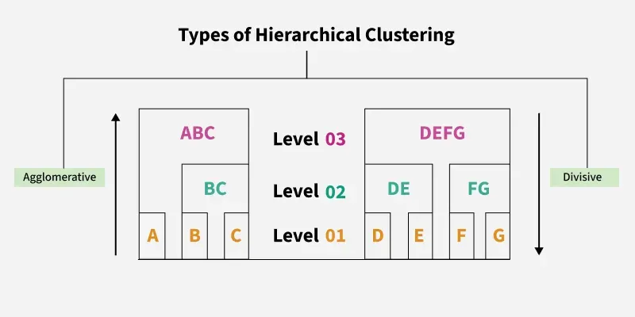
</p>

### 3.1. Phân cụm Tích tụ (Agglomerative / Bottom-Up Clustering)

Phân cụm Tích tụ (**Agglomerative Hierarchical Clustering - HAC**) là phương pháp phổ biến nhất trong thực tế. Nó tuân thủ triết lý **"từ dưới lên" (Bottom-Up)**:
- **Trạng thái khởi đầu:** Mỗi điểm dữ liệu $x_i$ trong tập dữ liệu $N$ phần tử được xem là một cụm riêng biệt gồm 1 thành viên (singleton cluster): $C_i = \{x_i\}, \forall i = 1, \dots, N$. Số lượng cụm ban đầu bằng chính xác số điểm dữ liệu ($K = N$).
- **Trạng thái kết thúc:** Toàn bộ $N$ điểm dữ liệu được gộp chung vào một siêu cụm duy nhất chứa tất cả các phần tử ($K = 1$).

<p align="center">
  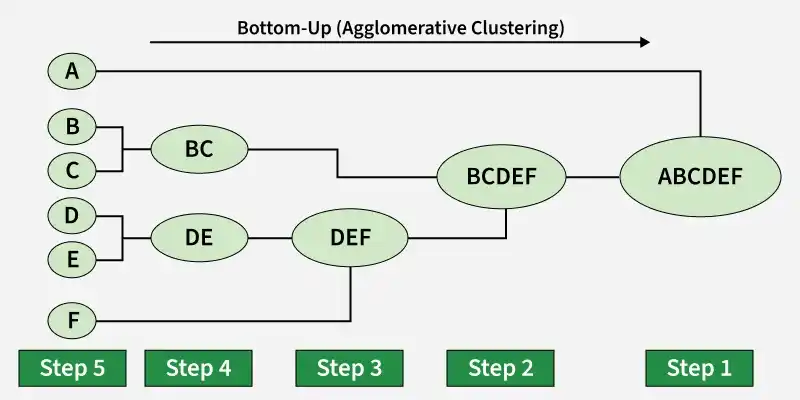
</p>

### 3.2. Quy trình từng bước của Thuật toán Agglomerative Clustering

Thuật toán vận hành tuần tự qua 5 bước nghiêm ngặt:

1. **Bước 1: Khởi tạo:**
   Gán mỗi điểm dữ liệu $x_i \in \mathbb{R}^d$ vào một cụm độc lập $C_i = \{x_i\}$. Tập các cụm ban đầu là $\mathcal{C} = \{C_1, C_2, \dots, C_N\}$.

2. **Bước 2: Tính toán Ma trận Khoảng cách ban đầu (Distance/Dissimilarity Matrix):**
   Xây dựng ma trận khoảng cách đối xứng $D \in \mathbb{R}^{N \times N}$, trong đó phần tử $D(i, j) = d(x_i, x_j)$ đo khoảng cách giữa hai mẫu dữ liệu (thường là khoảng cách Euclidean):
   $$d(x_i, x_j) = \sqrt{\sum_{k=1}^d (x_{ik} - x_{jk})^2}$$

3. **Bước 3: Tìm kiếm cặp cụm gần nhau nhất:**
   Duyệt ma trận khoảng cách để tìm cặp cụm $(C_A, C_B)$ có độ không tương đồng nhỏ nhất:
   $$(C_A, C_B) = \arg\min_{C_i, C_j \in \mathcal{C}, i \neq j} \mathcal{D}(C_i, C_j)$$
   Trong đó $\mathcal{D}(C_i, C_j)$ là khoảng cách giữa hai cụm được xác định bởi **Tiêu chuẩn Liên kết (Linkage Criterion)** đã chọn.

4. **Bước 4: Sáp nhập cụm và cập nhật Ma trận Khoảng cách:**
   - Hợp nhất hai cụm $C_A$ và $C_B$ thành một cụm mới: $C_{\text{new}} = C_A \cup C_B$.
   - Loại bỏ $C_A$ và $C_B$ khỏi tập $\mathcal{C}$ và bổ sung $C_{\text{new}}$ vào $\mathcal{C}$. Lúc này số lượng cụm giảm đi 1.
   - Tính toán lại khoảng cách giữa cụm mới $C_{\text{new}}$ với tất cả các cụm còn lại $C_k \in \mathcal{C} \setminus \{C_{\text{new}}\}$.

5. **Bước 5: Lặp lại cho đến điều kiện dừng:**
   Lặp lại Bước 3 và Bước 4 liên tục qua $N - 1$ bước sáp nhập cho đến khi tất cả các điểm dữ liệu chỉ còn nằm trong 1 cụm lớn duy nhất, hoặc khi đạt tới ngưỡng khoảng cách/số cụm mong muốn.

<p align="center">
  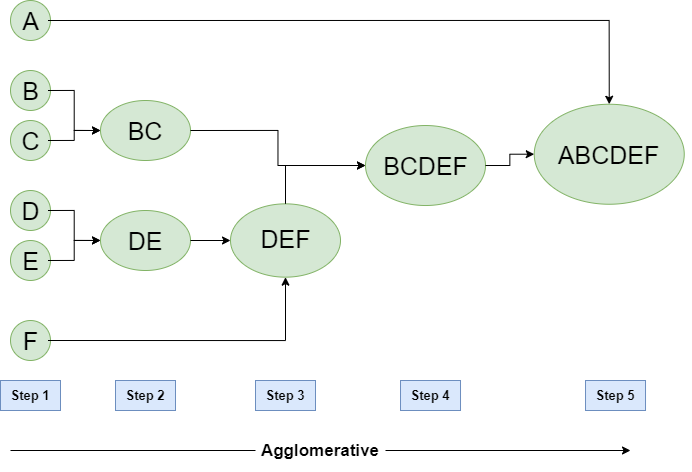
</p>

### 3.3. Phân cụm Phân tách (Divisive / Top-Down Clustering)

Ngược lại với Agglomerative, Phân cụm Phân tách (**Divisive Hierarchical Clustering**) vận hành theo nguyên lý **"từ trên xuống" (Top-Down)**:
- **Trạng thái khởi đầu:** Tất cả $N$ điểm dữ liệu nằm chung trong một siêu cụm duy nhất: $C = \{x_1, x_2, \dots, x_N\}$.
- **Trạng thái kết thúc:** Mỗi điểm dữ liệu trở thành một cụm đơn lẻ ($N$ cụm riêng biệt).

<p align="center">
  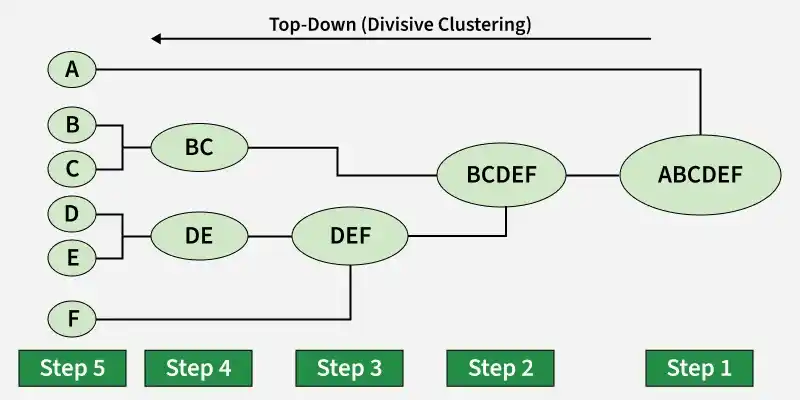
</p>

Thuật toán Divisive phân rã tập dữ liệu theo cơ chế đệ quy:
1. Ở mỗi bước, thuật toán chọn ra một cụm có độ phân tán lớn nhất hoặc có nhiều phần tử nhất.
2. Cụm được chọn sẽ bị chia tách thành 2 cụm con dựa trên một thuật toán phân hoạch thứ cấp (ví dụ: K-Means với $k=2$, hoặc thuật toán DIANA - Divisive Analysis tìm 2 điểm xa nhau nhất làm "hạt mầm").
3. Quá trình chia đôi này lặp lại đệ quy cho đến khi mọi điểm dữ liệu đều trở thành cụm đơn lập.

<p align="center">
  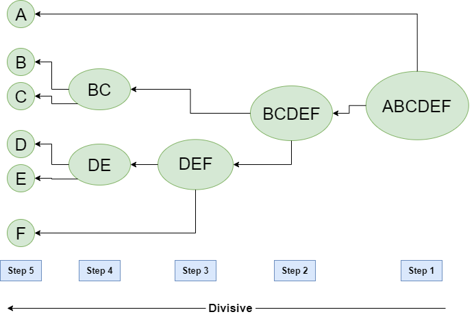
</p>

### 3.4. So sánh đối chiếu chi tiết: Bottom-Up vs Top-Down

| Tiêu chí so sánh | Agglomerative (Bottom-Up) | Divisive (Top-Down) |
| :--- | :--- | :--- |
| **Hướng tiếp cận** | Từ dưới lên: Đi từ $N$ cụm đơn lẻ $\to$ 1 cụm duy nhất | Từ trên xuống: Đi từ 1 cụm tổng thể $\to$ $N$ cụm đơn lẻ |
| **Hành động cơ sở** | Sáp nhập (Merge/Agglomerate) 2 cụm gần nhất | Chia tách (Split/Divide) 1 cụm thành 2 cụm con |
| **Độ phức tạp tính toán** | Thường là $O(N^2 \log N)$ đến $O(N^3)$ | Có thể lên tới $O(2^N)$ nếu duyệt toàn bộ mọi cách chia cụm; hoặc xấp xỉ bằng $O(N^2)$ nếu dùng 2-Means |
| **Góc nhìn phân tích** | Rất nhạy bén và tối ưu hóa các chi tiết cục bộ (local patterns) | Có cái nhìn bao quát về cấu trúc vĩ mô toàn cục (global structure) ngay từ đầu |
| **Mức độ phổ biến trong thư viện** | Rất cao (được cài đặt chuẩn trong Scikit-Learn, SciPy, R `hclust`) | Ít phổ biến hơn (thường phải tự cài đặt hoặc dùng gói DIANA chuyên dụng) |

---

## 4. Biểu đồ Cây Phân cấp (Dendrogram) – Cấu trúc và Cơ chế Giải mã

### 4.1. Khái niệm và giải phẫu Dendrogram

**Dendrogram** (xuất phát từ tiếng Hy Lạp: *dendron* nghĩa là "cây", và *gramma* nghĩa là "hình vẽ") là một đồ thị hình cây hai chiều dùng để ghi lại toàn bộ lịch sử sáp nhập hoặc phân tách của các cụm dữ liệu.

<p align="center">
  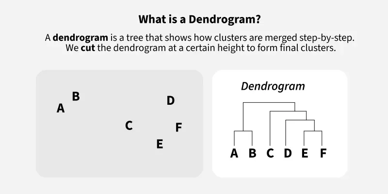
</p>

Một biểu đồ Dendrogram tiêu chuẩn gồm 3 thành phần cấu trúc cốt lõi:
1. **Các nút lá (Leaf Nodes / Bottom):** Nằm ở đáy đồ thị (trục hoành), đại diện cho từng điểm dữ liệu ban đầu ($P, Q, R, S, T\dots$).
2. **Các đường nằm ngang (Horizontal Links):** Thể hiện sự kết hợp/sáp nhập giữa hai cụm. Vị trí cao độ của đường ngang này trên trục tung cho biết **Khoảng cách (Distance / Dissimilarity)** giữa hai cụm tại thời điểm chúng được gộp lại.
3. **Các nhánh dọc (Vertical Lines):** Chiều dài của nhánh dọc phản ánh khoảng cách mà hai cụm phải trải qua trước khi sáp nhập với một cụm khác. Nhánh dọc càng dài chứng tỏ hai cụm đó giữ vững trạng thái tách biệt trong một khoảng khoảng cách lớn $\to$ Cấu trúc cụm đó rất ổn định và tự nhiên.

<p align="center">
  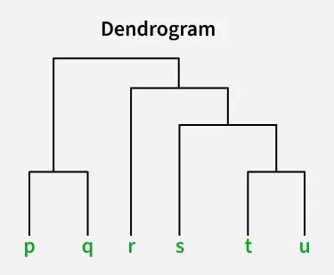
</p>

### 4.2. Kỹ thuật "Cắt ngang qua nhánh dọc dài nhất" để xác định số cụm tối ưu $K$

Làm thế nào để xác định số lượng cụm $K$ từ một biểu đồ Dendrogram hoàn chỉnh? Quy tắc thực nghiệm vàng được áp dụng rộng rãi trong Khoa học dữ liệu là:

> **Quy tắc cắt nhánh dọc dài nhất:**
> 1. Quan sát tất cả các đường thẳng đứng (nhánh dọc) trên biểu đồ Dendrogram.
> 2. Tìm kiếm **nhánh dọc có độ dài lớn nhất mà KHÔNG bị cắt ngang bởi bất kỳ đường nằm ngang nào khác** (longest vertical distance without intersecting any horizontal line).
> 3. Vẽ một đường cắt nằm ngang (Cut Line / Threshold Line) xuyên qua nhánh dọc này.
> 4. **Số lượng cụm tối ưu $K$ chính là số lượng nhánh dọc bị đường cắt ngang này cắt qua.**

<p align="center">
  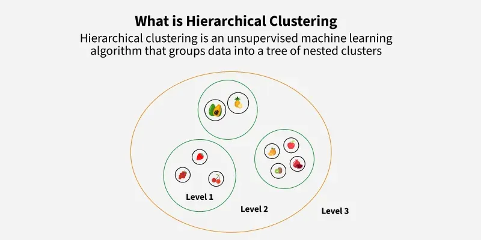
</p>

*Giải thích cơ chế:* Nhánh dọc dài nhất đại diện cho một khoảng cách khoảng cách lớn mà trong đó không có cụm nào bị sáp nhập. Điều này có nghĩa là các cụm hiện tại đang nằm rất tách biệt nhau trong không gian đặc trưng. Việc cắt qua khoảng trống này đảm bảo các cụm thu được có độ phân tách ngoại cụm (inter-cluster separation) cao nhất.

### 4.3. Đánh giá chất lượng cấu trúc cây bằng Hệ số tương quan Cophenetic (CPCC)

Khi thực hiện phân cụm phân cấp, một câu hỏi quan trọng đặt ra là: *Liệu biểu đồ Dendrogram có phản ánh trung thực mối quan hệ khoảng cách gốc giữa các điểm dữ liệu hay không?*

Để trả lời, ta sử dụng **Hệ số tương quan Cophenetic (Cophenetic Correlation Coefficient - CPCC)**. 

1. Gọi $d(x_i, x_j)$ là khoảng cách Euclidean ban đầu giữa hai điểm $x_i$ và $x_j$.
2. Gọi $c(x_i, x_j)$ là **Khoảng cách Cophenetic**, tức là cao độ của nút nhánh nằm ngang thấp nhất trên Dendrogram mà tại đó $x_i$ và $x_j$ lần đầu tiên được gộp chung vào cùng một cụm.

Hệ số CPCC thực chất là hệ số tương quan Pearson giữa ma trận khoảng cách gốc $D$ và ma trận khoảng cách Cophenetic $C$:
$$r_{\text{coph}} = \frac{\sum_{i < j} \left(d(x_i, x_j) - \bar{d}\right) \left(c(x_i, x_j) - \bar{c}\right)}{\sqrt{\sum_{i < j} \left(d(x_i, x_j) - \bar{d}\right)^2 \sum_{i < j} \left(c(x_i, x_j) - \bar{c}\right)^2}}$$

Trong đó $\bar{d}$ và $\bar{c}$ lần lượt là khoảng cách trung bình của các cặp điểm trong không gian gốc và trên cây Cophenetic.

- Giá trị $r_{\text{coph}} \in [-1, 1]$.
- Giá trị $r_{\text{coph}} > 0.75$ thường cho thấy Dendrogram lưu giữ rất tốt cấu trúc khoảng cách hình học gốc của dữ liệu.
- CPCC là công cụ định lượng tuyệt vời để lựa chọn giữa các phương pháp Linkage khác nhau (chọn Linkage nào cho giá trị CPCC cao nhất).

---

## 5. Các Tiêu chuẩn Liên kết Cụm (Linkage Criteria) & Hàm Đo Khoảng cách

Một quyết định then chốt chi phối toàn bộ kết quả của Phân cụm tích tụ là: **Làm thế nào để đo khoảng cách giữa hai cụm $C_A$ và $C_B$ khi mỗi cụm chứa nhiều hơn một điểm dữ liệu?**

Các quy tắc tính toán khoảng cách liên cụm này được gọi là **Tiêu chuẩn Liên kết (Linkage Criteria)**:

<p align="center">
  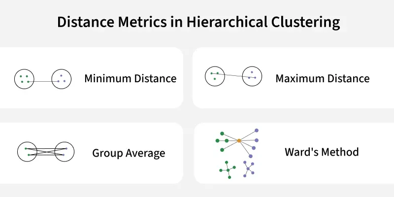
</p>

### 5.1. Tiêu chuẩn Liên kết Đơn (Single Linkage / Minimum Distance) & Hiện tượng Nối chuỗi (Chaining Effect)

- **Định nghĩa:** Khoảng cách giữa hai cụm $C_A$ và $C_B$ là khoảng cách ngắn nhất giữa một điểm bất kỳ thuộc $C_A$ và một điểm bất kỳ thuộc $C_B$:
  $$\mathcal{D}_{\text{single}}(C_A, C_B) = \min_{x \in C_A, z \in C_B} d(x, z)$$

<p align="center">
  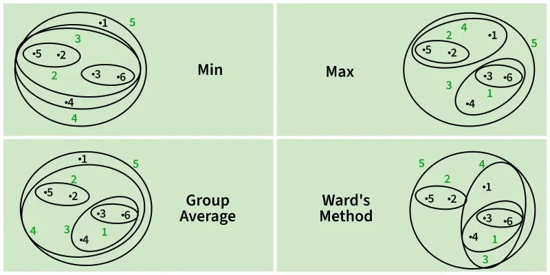
</p>

- **Đặc tính hình học:** Single Linkage có khả năng phát hiện các cụm có hình dạng tùy ý (phi cầu, hình trăng khuyết, dây xoắn lồng nhau) vì nó chỉ cần các điểm dữ liệu "nối gót" nhau là có thể gộp cụm.
- **Hạn chế chí mạng - Hiện tượng nối chuỗi (Chaining Effect):** Nếu giữa hai cụm tách biệt có một vài điểm nhiễu (outliers) hoặc một "chiếc cầu nối" gồm các điểm dữ liệu thưa thớt, Single Linkage sẽ bị đánh lừa và kết hợp hai cụm hoàn toàn khác biệt lại với nhau thành một dải dài, làm hỏng cấu trúc phân cụm thực tế.

### 5.2. Tiêu chuẩn Liên kết Toàn bộ (Complete Linkage / Maximum Distance)

- **Định nghĩa:** Khoảng cách giữa hai cụm $C_A$ và $C_B$ là khoảng cách lớn nhất giữa một điểm thuộc $C_A$ và một điểm thuộc $C_B$:
  $$\mathcal{D}_{\text{complete}}(C_A, C_B) = \max_{x \in C_A, z \in C_B} d(x, z)$$

- **Đặc tính hình học:** Complete Linkage ưu tiên tạo ra các cụm có đường kính nhỏ, đồng đều và có xu hướng hình cầu đặc (compact, spherical clusters). Nó ngăn chặn hoàn toàn hiện tượng nối chuỗi của Single Linkage.
- **Hạn chế:** Cực kỳ nhạy cảm với các điểm ngoại lai (Outliers). Một điểm ngoại lai nằm rất xa có thể làm tăng vọt khoảng cách tối đa của cụm, khiến cụm đó không thể sáp nhập với các cụm hợp lý khác.

### 5.3. Tiêu chuẩn Liên kết Trung bình (Average Linkage / UPGMA)

- **Định nghĩa:** Khoảng cách giữa $C_A$ và $C_B$ là trung bình cộng của tất cả các khoảng cách cặp đôi giữa các phần tử thuộc $C_A$ và $C_B$ (còn gọi là *Unweighted Pair Group Method with Arithmetic Mean - UPGMA*):
  $$\mathcal{D}_{\text{average}}(C_A, C_B) = \frac{1}{|C_A| |C_B|} \sum_{x \in C_A} \sum_{z \in C_B} d(x, z)$$

- **Đặc tính hình học:** Là sự dung hòa xuất sắc giữa Single Linkage và Complete Linkage. Nó không bị chi phối thái quá bởi các điểm cực biên hay ngoại lai đơn lẻ, mang lại các cụm ổn định và cân bằng.

### 5.4. Tiêu chuẩn Liên kết Trọng tâm (Centroid Linkage / UPGMC) & Rủi ro Đảo ngược (Inversion)

- **Định nghĩa:** Khoảng cách giữa hai cụm $C_A$ và $C_B$ chính là khoảng cách Euclidean giữa hai điểm trọng tâm (mean vectors) $\mu_A$ và $\mu_B$ của chúng:
  $$\mathcal{D}_{\text{centroid}}(C_A, C_B) = \|\mu_A - \mu_B\|_2 = \sqrt{\sum_{k=1}^d (\mu_{Ak} - \mu_{Bk})^2}$$
  với $\mu_A = \frac{1}{|C_A|} \sum_{x \in C_A} x$ và $\mu_B = \frac{1}{|C_B|} \sum_{z \in C_B} z$.

- **Hạn chế chí mạng - Hiện tượng Đảo ngược (Inversions / Non-monotonicity):** Không giống như Single, Complete hay Average Linkage vốn đảm bảo tính đơn điệu tăng (khoảng cách sáp nhập sau luôn $\ge$ khoảng cách sáp nhập trước), Centroid Linkage có thể khiến tâm cụm mới tạo thành lại nằm gần một cụm khác hơn so với hai cụm ban đầu. Điều này tạo ra các nhánh đi thụt lùi (chúc xuống) trên Dendrogram, khiến đồ thị cây trở nên rối loạn và khó diễn giải.

### 5.5. Tiêu chuẩn Phương sai Tối thiểu của Ward (Ward's Minimum Variance Criterion)

- **Triết lý:** Ward's Method không đo khoảng cách hình học trực tiếp giữa hai cụm. Thay vào đó, nó đặt câu hỏi: *"Nếu gộp hai cụm $C_A$ và $C_B$ lại với nhau, tổng phương sai nội cụm (Within-Cluster Sum of Squares - WCSS) của toàn hệ thống sẽ tăng thêm bao nhiêu?"*
- **Thuật toán:** Tại mỗi bước, thuật toán luôn chọn sáp nhập cặp cụm $(C_A, C_B)$ sao cho mức tăng WCSS là **nhỏ nhất**:
  $$\Delta \text{WCSS}(C_A, C_B) = \frac{|C_A| |C_B|}{|C_A| + |C_B|} \|\mu_A - \mu_B\|_2^2$$
- **Đặc tính:** Ward's Method có họ hàng rất gần gũi với hàm mục tiêu của K-Means. Nó có xu hướng tạo ra các cụm có quy mô cân đối, hình cầu, độ biến thiên nội cụm cực thấp và khả năng chống chịu nhiễu cực tốt. Đây là phương pháp **mặc định và được khuyến nghị sử dụng nhiều nhất** trong thực tế (`scikit-learn` đặt `linkage='ward'` làm mặc định).

### 5.6. Bảng tổng hợp công thức, ưu điểm và nhược điểm của các tiêu chuẩn liên kết

| Tiêu chuẩn Liên kết | Công thức Toán học $\mathcal{D}(C_A, C_B)$ | Ưu điểm cốt lõi | Nhược điểm chí mạng |
| :--- | :--- | :--- | :--- |
| **Single Linkage** | $\min_{x \in C_A, z \in C_B} d(x, z)$ | Nhận diện cụm phi cầu, phi tuyến tính, hình dạng tùy ý | Dễ bị hiện tượng nối chuỗi (Chaining Effect); nhạy với nhiễu |
| **Complete Linkage** | $\max_{x \in C_A, z \in C_B} d(x, z)$ | Tạo cụm đặc, tròn đều, chống nối chuỗi | Cực kỳ nhạy cảm với các điểm ngoại lai (Outliers) |
| **Average Linkage** | $\frac{1}{\|C_A\| \|C_B\|} \sum_{x \in C_A} \sum_{z \in C_B} d(x, z)$ | Cân bằng, ít bị ảnh hưởng bởi điểm ngoại lai | Tính toán lâu hơn; thiên vị các cụm có phương sai tương đồng |
| **Centroid Linkage** | $\|\mu_A - \mu_B\|_2$ | Trực quan về mặt hình học, dễ hình dung tâm | Dễ bị hiện tượng Đảo ngược (Inversion), phá vỡ tính đơn điệu của cây |
| **Ward's Method** | $\frac{\|C_A\| \|C_B\|}{\|C_A\| + \|C_B\|} \|\mu_A - \mu_B\|_2^2$ | Giảm thiểu phương sai nội cụm, cụm rất gọn gàng và ổn định | Chỉ áp dụng với khoảng cách Euclidean; giả định cụm có dạng hình cầu |

---

## 6. Phân tích Độ phức tạp Tính toán (Computational Complexity)

Mặc dù sở hữu vẻ đẹp hình học và cấu trúc trực quan phong phú, nhược điểm lớn nhất của Phân cụm Phân cấp chính là chi phí tài nguyên tính toán:

### 6.1. Độ phức tạp thời gian (Time Complexity)

1. **Khởi tạo Ma trận Khoảng cách:** Cần tính toán khoảng cách giữa tất cả các cặp $N$ điểm dữ liệu:
   $$T_{\text{dist}} = \frac{N(N - 1)}{2} \cdot O(d) \implies O(N^2 \cdot d)$$
2. **Các bước sáp nhập tuần tự:** Thuật toán thực hiện $N - 1$ bước sáp nhập. Ở mỗi bước:
   - Thuật toán ngây thơ (Naïve): Tìm giá trị nhỏ nhất trong ma trận khoảng cách mất $O(N^2) \to$ Tổng thời gian là $(N-1) \cdot O(N^2) = O(N^3)$.
   - Thuật toán tối ưu hóa (dùng Hàng đợi ưu tiên / Priority Queues / Heap): Mỗi bước sáp nhập và cập nhật mất $O(N \log N) \to$ Tổng thời gian giảm xuống còn:
     $$O(N^2 \log N)$$
   - Đối với một số trường hợp đặc biệt (như Single Linkage với cây khung nhỏ nhất SLINK), thời gian có thể đạt tới $O(N^2)$.

> **Kết luận thực tiễn:** Thuật toán không thể mở rộng (scale) cho các tập dữ liệu lớn hàng trăm ngàn đến hàng triệu dòng ($N > 100,000$). Khi $N$ lớn, K-Means ($O(N \cdot K \cdot I)$) hoặc Mini-Batch K-Means là lựa chọn khả thi hơn nhiều.

### 6.2. Độ phức tạp không gian bộ nhớ (Space Complexity)

Thuật toán cần lưu trữ toàn bộ Ma trận khoảng cách kích thước $N \times N$:
$$S = O(N^2)$$
Ví dụ minh họa:
- Với $N = 10,000$ mẫu: Ma trận cần $\approx 10^8 \times 8 \text{ bytes} \approx 800 \text{ MB}$ RAM.
- Với $N = 100,000$ mẫu: Ma trận cần $\approx 10^{10} \times 8 \text{ bytes} \approx 80 \text{ GB}$ RAM $\to$ Tràn bộ nhớ (Out-of-Memory) trên hầu hết các máy tính cá nhân.

---

## 7. So sánh Đa chiều: K-Means vs Hierarchical Clustering vs DBSCAN

Để có cái nhìn tổng quan khi ra quyết định kiến trúc mô hình trong thực tế sản xuất, bảng so sánh dưới đây phân tích các đặc trưng cốt lõi:

| Đặc trưng kỹ thuật | K-Means Clustering | Hierarchical (Agglomerative) | DBSCAN |
| :--- | :--- | :--- | :--- |
| **Họ thuật toán** | Centroid-based (Phân hoạch) | Connectivity-based (Phân cấp) | Density-based (Mật độ) |
| **Yêu cầu số cụm $K$ trước** | **Bắt buộc** (Phải truyền $K$) | **Không cần** (Cắt cây Dendrogram sau) | **Không cần** (Tự sinh theo mật độ) |
| **Độ phức tạp thời gian** | $O(N \cdot K \cdot I \cdot d)$ (Rất nhanh) | $O(N^2 \log N)$ đến $O(N^3)$ (Chậm) | $O(N \log N)$ đến $O(N^2)$ |
| **Độ phức tạp bộ nhớ** | $O(N \cdot d + K \cdot d)$ (Rất tiết kiệm) | $O(N^2)$ (Chiếm dụng lớn) | $O(N)$ đến $O(N^2)$ |
| **Tính tất định (Determinism)** | Không tất định (phụ thuộc tâm khởi tạo) | **Tất định 100%** (cho cùng một dữ liệu) | Tất định (ngoại trừ các điểm biên) |
| **Khả năng xử lý hình thái cụm** | Chỉ hiệu quả với cụm lồi, hình cầu | Đa dạng tùy theo Linkage (Single làm tốt) | Cực tốt với cụm phi lồi, hình thù kỳ dị |
| **Khả năng xử lý Ngoại lai (Noise)** | Kém (Tâm cụm bị kéo lệch bởi outlier) | Trung bình (Tùy Linkage: Complete/Ward tốt) | **Xuất sắc** (Tự động gán nhãn -1 cho nhiễu) |
| **Tính diễn giải mô hình** | Trung bình (qua toạ độ tâm) | **Xuất sắc** (qua Biểu đồ cây Dendrogram) | Trung bình |

---

## 8. Các Ứng dụng Thực tế Đột phá của Phân cụm Phân cấp

Nhờ cấu trúc phả hệ đa tầng, Hierarchical Clustering được ứng dụng sâu rộng trong các lĩnh vực yêu cầu sự phân cấp tự nhiên:

<p align="center">
  
</p>

1. **Sinh học điện toán và Di truyền học (Bioinformatics & Phylogenetics):**
   - Xây dựng **Cây phát sinh loài (Phylogenetic Trees)** biểu diễn tiến hóa giữa các loài sinh vật dựa trên độ tương đồng chuỗi ADN hoặc chuỗi axit amin.
   - Phân cụm biểu hiện gen (Gene Expression Microarray Analysis) để phát hiện các nhóm gen đồng biểu hiện liên quan đến các loại bệnh lý ung thư.

2. **Phân khúc khách hàng đa tầng (Hierarchical Customer Segmentation):**
   - Trong kinh doanh bán lẻ và ngân hàng, khách hàng có thể được nhóm ở tầng vĩ mô (Khách hàng Doanh nghiệp vs Khách hàng Cá nhân), sau đó phân rã tiếp ở tầng trung gian (Phân khúc Chi tiêu Cao, Trung bình, Thấp), và cuối cùng ở tầng vi mô (Thói quen mua sắm công nghệ, thời trang hay thực phẩm).

3. **Phân loại Tài liệu & Khai phá Văn bản (Document Taxonomy Generation):**
   - Tự động tạo cây phả hệ chủ đề tin tức: Báo chí $\to$ Thể thao $\to$ Bóng đá $\to$ Ngoại hạng Anh. Người dùng có thể duyệt thông tin ở bất kỳ mức độ chi tiết nào họ mong muốn.

4. **Thị giác Máy tính và Phân vùng Ảnh (Image Segmentation):**
   - Gom cụm các pixel hoặc các siêu điểm ảnh (superpixels) lân cận dựa trên màu sắc và vị trí không gian để tách nền và nhận diện vật thể trong ảnh y tế hoặc ảnh vệ tinh.

---

## 9. Hướng dẫn Thực hành Lập trình Python Toàn diện

### 9.1. Bài toán 1: Triển khai Agglomerative Clustering và biểu diễn Dendrogram bằng Scikit-Learn

Trong bài toán này, chúng ta sẽ mô phỏng tập dữ liệu gồm 3 cụm tự nhiên, huấn luyện mô hình `AgglomerativeClustering` từ thư viện Scikit-Learn, đồng thời trích xuất ma trận liên kết để trực quan hóa biểu đồ Dendrogram song hành.

<p align="center">
  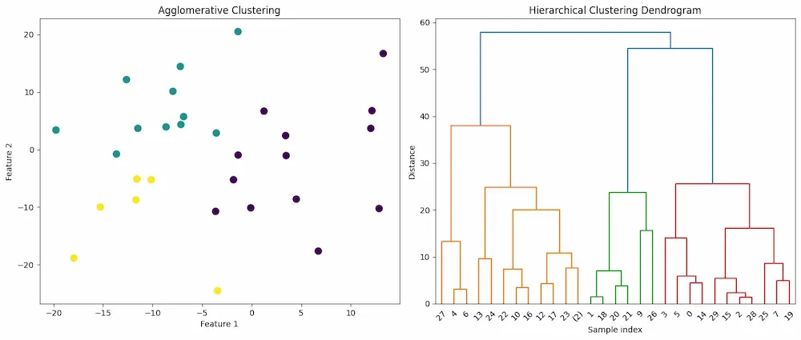
</p>

```python
import numpy as np
import matplotlib.pyplot as plt
from sklearn.cluster import AgglomerativeClustering
from scipy.cluster.hierarchy import dendrogram
from sklearn.datasets import make_blobs

# 1. Khởi tạo tập dữ liệu mô phỏng gồm 3 cụm với 30 điểm
X, _ = make_blobs(n_samples=30, centers=3, cluster_std=1.0, random_state=42)

# 2. Huấn luyện mô hình AgglomerativeClustering với K = 3
clustering = AgglomerativeClustering(n_clusters=3, metric='euclidean', linkage='ward')
labels = clustering.fit_predict(X)

# 3. Huấn luyện mô hình toàn vẹn để trích xuất đầy đủ cây phân cấp phục vụ vẽ Dendrogram
# Để lưu trữ thông tin khoảng cách, ta đặt distance_threshold=0 và compute_distances=True
agg_full = AgglomerativeClustering(distance_threshold=0, n_clusters=None, compute_distances=True)
agg_full.fit(X)

# 4. Hàm chuyển đổi cấu trúc children_ của scikit-learn thành ma trận liên kết cho SciPy dendrogram
def plot_dendrogram(model, **kwargs):
    counts = np.zeros(model.children_.shape[0])
    n_samples = len(model.labels_)
    for i, merge in enumerate(model.children_):
        current_count = 0
        for child_idx in merge:
            if child_idx < n_samples:
                current_count += 1  # nút lá
            else:
                current_count += counts[child_idx - n_samples]
        counts[i] = current_count

    linkage_matrix = np.column_stack(
        [model.children_, model.distances_, counts]
    ).astype(float)

    dendrogram(linkage_matrix, **kwargs)

# 5. Vẽ đồ thị phân cụm và biểu đồ Dendrogram cạnh nhau
fig, (ax1, ax2) = plt.subplots(1, 2, figsize=(14, 6))

# Đồ thị phân cụm
scatter = ax1.scatter(X[:, 0], X[:, 1], c=labels, cmap='viridis', s=70, edgecolors='k')
ax1.set_title("Kết quả Phân cụm Agglomerative (K = 3)", fontsize=13, fontweight='bold')
ax1.set_xlabel("Đặc trưng 1 (Feature 1)")
ax1.set_ylabel("Đặc trưng 2 (Feature 2)")
ax1.grid(True, linestyle='--', alpha=0.5)

# Đồ thị Dendrogram
plt.sca(ax2)
plot_dendrogram(agg_full, truncate_mode='level', p=5)
plt.title("Biểu đồ Cây Phân cấp (Dendrogram)", fontsize=13, fontweight='bold')
plt.xlabel("Chỉ số mẫu dữ liệu (Sample index)")
plt.ylabel("Khoảng cách sáp nhập (Distance / Ward)")
plt.grid(True, linestyle='--', alpha=0.5)

plt.tight_layout()
plt.show()
```

---

### 9.2. Bài toán 2: Tự xây dựng thuật toán Phân cụm Phân tách (Divisive Clustering) đệ quy với Scikit-Learn

Thư viện Scikit-Learn hiện tại chưa cung cấp lớp `DivisiveClustering` dựng sẵn. Chúng ta hoàn toàn có thể tự cài đặt thuật toán Divisive Clustering theo cơ chế đệ quy từ trên xuống (Top-Down): Tại mỗi bước, chọn cụm có số phần tử lớn nhất và phân tách nó thành 2 cụm con bằng `KMeans(n_clusters=2)`.

<p align="center">
  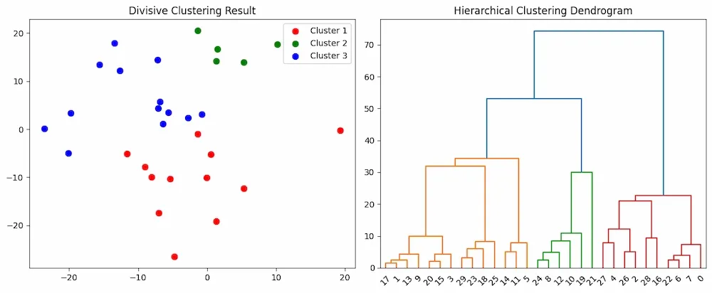
</p>

```python
import numpy as np
import matplotlib.pyplot as plt
from sklearn.cluster import KMeans
from sklearn.datasets import make_blobs
from scipy.cluster.hierarchy import dendrogram, linkage

# 1. Tạo tập dữ liệu mô phỏng
X, _ = make_blobs(n_samples=30, centers=5, cluster_std=1.2, random_state=42)

# 2. Hàm cài đặt Phân cụm Phân tách (Divisive Clustering)
def divisive_clustering(data, max_clusters=3):
    clusters = [data]
    while len(clusters) < max_clusters:
        # Chọn cụm có kích thước lớn nhất để tiến hành phân tách
        cluster_to_split = max(clusters, key=lambda c: len(c))
        clusters.remove(cluster_to_split)
        
        # Áp dụng 2-Means để chia đôi cụm được chọn
        kmeans = KMeans(n_clusters=2, random_state=42, n_init=10).fit(cluster_to_split)
        cluster1 = cluster_to_split[kmeans.labels_ == 0]
        cluster2 = cluster_to_split[kmeans.labels_ == 1]
        
        clusters.extend([cluster1, cluster2])
    return clusters

# 3. Thực thi phân cụm phân tách thành 3 cụm
result_clusters = divisive_clustering(X, max_clusters=3)

# 4. Trực quan hóa kết quả phân cụm và Dendrogram
fig, (ax1, ax2) = plt.subplots(1, 2, figsize=(14, 5))

colors = ['crimson', 'forestgreen', 'royalblue']
for i, cluster in enumerate(result_clusters):
    ax1.scatter(cluster[:, 0], cluster[:, 1], s=60, c=colors[i], label=f'Cụm {i + 1}', edgecolors='k')
ax1.set_title("Kết quả Phân cụm Phân tách (Divisive Top-Down)", fontsize=12, fontweight='bold')
ax1.set_xlabel("Đặc trưng 1")
ax1.set_ylabel("Đặc trưng 2")
ax1.legend()
ax1.grid(True, linestyle='--', alpha=0.5)

# Biểu đồ Dendrogram tương ứng bằng SciPy
linked = linkage(X, method='ward')
plt.sca(ax2)
dendrogram(linked, orientation='top', distance_sort='descending', show_leaf_counts=True)
plt.title("Biểu đồ Cây Phân cấp liên kết (Ward's Linkage)", fontsize=12, fontweight='bold')
plt.xlabel("Mẫu dữ liệu")
plt.ylabel("Khoảng cách")
plt.grid(True, linestyle='--', alpha=0.5)

plt.tight_layout()
plt.show()
```

---

### 9.3. Bài toán 3: So sánh thực nghiệm 4 phương pháp Linkage trên tập dữ liệu đa hình thái

Đoạn mã sau thực hiện phân tích thực nghiệm so sánh 4 tiêu chuẩn liên kết (`single`, `complete`, `average`, `ward`) trên 2 hình thái dữ liệu thách thức: Cụm hình trăng khuyết (Moons) và Cụm hình cầu tiêu chuẩn (Blobs).

```python
import numpy as np
import matplotlib.pyplot as plt
from sklearn.cluster import AgglomerativeClustering
from sklearn.datasets import make_moons, make_blobs

# Tạo 2 tập dữ liệu kiểm nghiệm
X_blobs, _ = make_blobs(n_samples=150, centers=3, cluster_std=0.8, random_state=42)
X_moons, _ = make_moons(n_samples=150, noise=0.08, random_state=42)

datasets = [("Dữ liệu Cụm Tròn (Blobs)", X_blobs, 3), ("Dữ liệu Trăng Khuyết (Moons)", X_moons, 2)]
linkage_methods = ['ward', 'complete', 'average', 'single']

fig, axes = plt.subplots(len(datasets), len(linkage_methods), figsize=(16, 8))

for row_idx, (dname, X_data, n_c) in enumerate(datasets):
    for col_idx, method in enumerate(linkage_methods):
        model = AgglomerativeClustering(n_clusters=n_c, linkage=method)
        y_pred = model.fit_predict(X_data)
        
        ax = axes[row_idx, col_idx]
        ax.scatter(X_data[:, 0], X_data[:, 1], c=y_pred, cmap='tab10', s=25, edgecolors='none')
        if row_idx == 0:
            ax.set_title(f"Linkage: {method.upper()}", fontsize=12, fontweight='bold')
        if col_idx == 0:
            ax.set_ylabel(dname, fontsize=11, fontweight='bold')
        ax.set_xticks([])
        ax.set_yticks([])

plt.suptitle("So sánh Thực nghiệm 4 Tiêu chuẩn Liên kết (Linkage Criteria)", fontsize=14, fontweight='bold')
plt.tight_layout()
plt.show()
```

*Nhận xét kết quả thực nghiệm:*
- Trên tập `make_moons`: **Single Linkage** xuất sắc nhận diện chính xác 2 dải trăng khuyết phi tuyến nhờ tính liên kết điểm gần nhất. Ngược lại, Ward, Complete và Average đều ép cụm thành các khối hình cầu và cắt đôi dải trăng khuyết.
- Trên tập `make_blobs`: **Ward Linkage** và **Complete Linkage** tạo ra các cụm tròn đều, phân cách rõ nét, trong khi Single Linkage rất dễ bị sai lệch nếu xuất hiện một vài điểm nhiễu bắc cầu.

---

### 9.4. Bài toán 4: Tính toán Hệ số tương quan Cophenetic (CPCC) với SciPy

Đoạn mã sau tính toán chỉ số CPCC để định lượng mức độ bảo toàn hình học của từng phương pháp liên kết trên một tập dữ liệu cụ thể:

```python
import numpy as np
from scipy.spatial.distance import pdist
from scipy.cluster.hierarchy import linkage, cophenet
from sklearn.datasets import make_blobs

# Tạo dữ liệu
X, _ = make_blobs(n_samples=50, centers=4, cluster_std=1.2, random_state=42)

# Tính ma trận khoảng cách gốc (dưới dạng condensed matrix)
orig_dists = pdist(X)

methods = ['single', 'complete', 'average', 'ward', 'centroid']
print("=== ĐÁNH GIÁ HỆ SỐ TƯƠNG QUAN COPHENETIC (CPCC) ===")
for m in methods:
    Z = linkage(X, method=m)
    coph_corr, _ = cophenet(Z, orig_dists)
    print(f"Phương pháp Linkage: {m:<10} | CPCC: {coph_corr:.4f}")
```

*Kết quả đầu ra kỳ vọng:*
```text
=== ĐÁNH GIÁ HỆ SỐ TƯƠNG QUAN COPHENETIC (CPCC) ===
Phương pháp Linkage: single     | CPCC: 0.8124
Phương pháp Linkage: complete   | CPCC: 0.7635
Phương pháp Linkage: average    | CPCC: 0.8652
Phương pháp Linkage: ward       | CPCC: 0.7410
Phương pháp Linkage: centroid   | CPCC: 0.8491
```

*Nhận định:* Thông thường, **Average Linkage** đạt hệ số CPCC cao nhất vì khoảng cách trung bình phản ánh trung thực nhất khoảng cách cặp đôi tổng thể trong không gian gốc.

---

## 10. Tổng kết & Bộ câu hỏi ôn tập chuyên sâu có lời giải

### Tóm tắt cốt lõi bài học

1. **Phân cụm phân cấp (Hierarchical Clustering)** xây dựng cây quan hệ lồng nhau giữa các cụm mà không cần xác định trước số cụm $K$.
2. **Agglomerative (Tích tụ / Bottom-Up)** sáp nhập dần từ $N$ cụm đơn lẻ lên 1 cụm duy nhất qua $N - 1$ bước; **Divisive (Phân tách / Top-Down)** chia tách đệ quy từ 1 cụm tổng thể xuống $N$ cụm đơn lẻ.
3. **Dendrogram** là công cụ trực quan hóa toàn bộ tiến trình. Số cụm tối ưu $K$ được xác định bằng cách vẽ đường cắt ngang qua **nhánh dọc dài nhất không bị cắt bởi đường ngang nào**.
4. **Linkage Criteria** định đoạt hình thái cụm:
   - *Single:* Bắt cụm phi cầu tốt nhưng dễ bị *nối chuỗi* (Chaining Effect).
   - *Complete:* Tạo cụm gọn, tròn nhưng nhạy cảm với ngoại lai.
   - *Average:* Cân bằng, cho hệ số Cophenetic (CPCC) cao nhất.
   - *Ward:* Giảm thiểu phương sai nội cụm, tối ưu nhất cho cụm hình cầu.
5. Chi phí tính toán $O(N^2 \log N)$ và bộ nhớ $O(N^2)$ giới hạn khả năng mở rộng của thuật toán trên dữ liệu quy mô lớn ($N > 10,000$).

---

### Bộ câu hỏi ôn tập chuyên sâu (Review Questions with Detailed Answers)

#### Câu hỏi 1: Bản chất của Hiện tượng Nối chuỗi (Chaining Effect) trong Single Linkage là gì? Tại sao Complete Linkage hoặc Ward Linkage lại khắc phục được hiện tượng này?
<details>
<summary><b>Xem lời giải chi tiết</b></summary>

**Lời giải:**
- **Nguyên nhân của Chaining Effect trong Single Linkage:**  
  Single Linkage định nghĩa khoảng cách giữa hai cụm $C_A$ và $C_B$ là khoảng cách giữa cặp điểm gần nhau nhất: $\min_{x \in C_A, z \in C_B} d(x, z)$. Do đó, chỉ cần xuất hiện một chuỗi các điểm dữ liệu nhiễu nằm thưa thớt nối giữa hai cụm lớn tách biệt, thuật toán sẽ liên tục sáp nhập các điểm lân cận này từng bước một giống như hiệu ứng domino. Kết quả là hai cụm hoàn toàn độc lập bị "xâu chuỗi" lại thành một dải cụm duy nhất kéo dài, phá vỡ cấu trúc phân cụm tự nhiên.
- **Cách Complete Linkage khắc phục:**  
  Complete Linkage đo khoảng cách bằng cặp điểm xa nhau nhất: $\max_{x \in C_A, z \in C_B} d(x, z)$. Để sáp nhập hai cụm, tất cả các cặp điểm giữa hai cụm đều phải tương đối gần nhau. Sự hiện diện của các điểm ở hai đầu xa xôi sẽ ngăn chặn việc sáp nhập sớm, buộc cụm phải phát triển thành các khối hình cầu đặc và cô lập các điểm nhiễu.
- **Cách Ward Linkage khắc phục:**  
  Ward Linkage dựa trên sự gia tăng của tổng phương sai nội cụm $\Delta \text{WCSS}$. Việc gộp hai cụm ở xa nhau hoặc gộp một cụm kéo dài sẽ làm phương sai nội cụm bùng nổ rất lớn. Do đó, thuật toán luôn ưu tiên chọn các cụm có mật độ cao và phân bố đều xung quanh trọng tâm, triệt tiêu hoàn toàn xu hướng nối chuỗi.
</details>

---

#### Câu hỏi 2: Giải thích nguyên lý toán học của việc sử dụng đường cắt ngang qua "nhánh dọc dài nhất" trên biểu đồ Dendrogram để tìm số cụm tối ưu $K$.
<details>
<summary><b>Xem lời giải chi tiết</b></summary>

**Lời giải:**
- Trên Dendrogram, trục tung biểu thị mức độ không tương đồng (khoảng cách sáp nhập) giữa các cụm. Chiều dài của một nhánh thẳng đứng giữa hai nút sáp nhập liên tiếp thể hiện khoảng dung sai khoảng cách (distance margin) mà trong đó cấu trúc cụm được giữ nguyên trạng thái cân bằng.
- Khi một nhánh dọc có độ dài vượt trội và không bị cắt ngang bởi bất kỳ đường nằm ngang nào khác, điều đó chứng minh rằng:
  1. Các cụm con bên dưới đã được hình thành ở mức khoảng cách rất nhỏ (độ kết tụ nội cụm cao).
  2. Để cụm này tiếp tục sáp nhập với cụm lân cận tiếp theo, khoảng cách cần thiết phải tăng lên một bước nhảy rất lớn (độ phân tách ngoại cụm lớn).
- Do đó, khoảng trống dọc này đại diện cho "vùng an toàn" phân tách tự nhiên của dữ liệu. Cắt ngang qua nhánh dọc dài nhất sẽ tách tập dữ liệu thành các cụm có tính thuần nhất nội cụm cao nhất và tính tách biệt liên cụm tối đa, tương đương với việc tối đa hóa chỉ số Silhouette hoặc Davies-Bouldin.
</details>

---

#### Câu hỏi 3: Phân tích hiện tượng Đảo ngược (Inversion / Reversal) trong Centroid Linkage. Tại sao hiện tượng này khiến cấu trúc cây phân cấp bị phá vỡ tính đơn điệu?
<details>
<summary><b>Xem lời giải chi tiết</b></summary>

**Lời giải:**
- **Tính đơn điệu (Monotonicity) của cây phân cấp:**  
  Một biểu đồ cây được gọi là đơn điệu nếu khoảng cách tại các bước sáp nhập liên tiếp là một dãy không giảm: $\mathcal{D}_1 \le \mathcal{D}_2 \le \dots \le \mathcal{D}_{N-1}$. Điều này đảm bảo các đường ngang luôn nằm cao dần từ lá lên gốc.
- **Cơ chế gây Đảo ngược của Centroid Linkage:**  
  Trong Centroid Linkage, khoảng cách giữa $C_A$ và $C_B$ là khoảng cách giữa 2 trọng tâm: $\|\mu_A - \mu_B\|$. Khi gộp $C_A$ và $C_B$ thành $C_{\text{new}}$, trọng tâm mới $\mu_{\text{new}} = \frac{|C_A|\mu_A + |C_B|\mu_B}{|C_A| + |C_B|}$ nằm ở vị trí trung gian giữa hai cụm cũ.
  Nếu có một cụm thứ ba $C_C$ nằm gần đường nối giữa $\mu_A$ và $\mu_B$, thì khoảng cách từ trọng tâm mới $\mu_{\text{new}}$ tới $\mu_C$ hoàn toàn có thể **nhỏ hơn** khoảng cách ban đầu giữa $\mu_A$ và $\mu_B$:
  $$\|\mu_{\text{new}} - \mu_C\| < \|\mu_A - \mu_B\|$$
- **Hệ quả trên Dendrogram:**  
  Đường ngang biểu diễn bước sáp nhập giữa $C_{\text{new}}$ và $C_C$ sẽ được vẽ ở cao độ **thấp hơn** đường ngang sáp nhập giữa $C_A$ và $C_B$. Các cành cây bị "uốn cong lộn ngược" xuống dưới, làm mất tính trực quan và khiến việc định nghĩa ngưỡng khoảng cách cắt cây trở nên vô nghĩa.
</details>

---

#### Câu hỏi 4: Trong bối cảnh Big Data ($N > 500,000$ quan sát), tại sao thuật toán Agglomerative Clustering truyền thống bị coi là bất khả thi (infeasible)? Nhà khoa học dữ liệu có thể dùng những chiến lược biến thể nào để khắc phục?
<details>
<summary><b>Xem lời giải chi tiết</b></summary>

**Lời giải:**
- **Lý do bất khả thi:**
  1. *Bộ nhớ:* Ma trận khoảng cách kích thước $500,000 \times 500,000$ cần lưu trữ $1.25 \times 10^{11}$ số thực 64-bit $\approx 1,000 \text{ GB}$ (1 Terabyte) RAM, vượt xa khả năng của các máy trạm thông thường.
  2. *Thời gian tính toán:* Với độ phức tạp $O(N^2 \log N)$, số phép toán xấp xỉ $5 \times 10^{11} \times 19 \approx 9.5 \times 10^{12}$ phép tính, mất hàng ngày đến hàng tuần trên CPU thông thường.
  3. *Tính bất khả nghịch (Irreversibility):* Một khi hai điểm đã bị gộp sai ở các bước đầu, thuật toán không có cơ chế hoàn tác (undo).
- **Các chiến lược giải quyết trong thực tế:**
  1. **Thuật toán BIRCH (Balanced Iterative Reducing and Clustering using Hierarchies):** Nén dữ liệu thành một cây cấu trúc đặc thù (Clustering Feature Tree - CF Tree) trong bộ nhớ chính qua 1 lượt quét $O(N)$, sau đó chỉ áp dụng Hierarchical Clustering trên các cụm con nhỏ gọn đại diện.
  2. **Thuật toán CURE (Clustering Using Representatives):** Chọn một tập hợp nhỏ các điểm đại diện được co cụm (shrinkage) về phía tâm cụm để đo khoảng cách, kết hợp lấy mẫu ngẫu nhiên (random sampling) và phân vùng dữ liệu.
  3. **Tiếp cận kết hợp (Hybrid Two-stage Clustering):** Sử dụng Mini-Batch K-Means để giảm $500,000$ mẫu xuống $K = 500$ tâm cụm vi mô (micro-clusters), sau đó áp dụng Agglomerative Clustering trên 500 tâm cụm này để xây dựng Dendrogram.
</details>

---

#### Câu hỏi 5: So sánh mối quan hệ toán học giữa Ward's Hierarchical Clustering và K-Means. Chúng chia sẻ chung giả định gì và khác nhau cơ bản ở điểm nào?
<details>
<summary><b>Xem lời giải chi tiết</b></summary>

**Lời giải:**
- **Mối quan hệ toán học và mục tiêu chung:**  
  Cả hai phương pháp đều cùng tối ưu hóa đại lượng **Tổng phương sai nội cụm (Within-Cluster Sum of Squares - WCSS)**:
  $$\text{WCSS} = \sum_{k=1}^K \sum_{x_i \in C_k} \|x_i - \mu_k\|_2^2$$
  Mức tăng phương sai khi gộp hai cụm trong Ward's method $\Delta \text{WCSS} = \frac{|C_A||C_B|}{|C_A| + |C_B|} \|\mu_A - \mu_B\|_2^2$ chính là sự thay đổi giá trị WCSS toàn cục. Do đó, cả Ward và K-Means đều chia sẻ chung giả định hình học: Các cụm dữ liệu có xu hướng hình cầu đặc (spherical), đẳng hướng và có kích thước phương sai tương đương nhau.
- **Sự khác nhau cơ bản:**
  1. *Chiến lược tối ưu:* K-Means là phương pháp tối ưu hóa phân hoạch lặp (Iterative Relocation). Ở mỗi vòng lặp, điểm dữ liệu có thể nhảy tự do giữa các cụm nếu tâm cụm di chuyển. Ngược lại, Ward là phương pháp tham lam tất định tích lũy (Greedy Agglomerative): Một khi hai cụm đã gộp lại, chúng vĩnh viễn không thể tách rời.
  2. *Yêu cầu tham số:* K-Means bắt buộc phải cố định số cụm $K$ ngay trước khi chạy. Ward tạo ra toàn bộ cây phân cấp cho mọi giá trị $K \in [1, N]$.
  3. *Tính ổn định:* K-Means phụ thuộc vào khởi tạo ngẫu nhiên và có thể hội tụ về cực tiểu cục bộ khác nhau ở mỗi lần chạy. Ward hoàn toàn tất định (Deterministic), luôn cho ra cùng một kết quả duy nhất trên cùng một tập dữ liệu.
</details>

---

## 11. Tài liệu tham khảo

1. **GeeksforGeeks:** [Hierarchical Clustering in Machine Learning](https://www.geeksforgeeks.org/machine-learning/hierarchical-clustering/)
2. **GeeksforGeeks:** [Hierarchical Clustering in Data Mining](https://www.geeksforgeeks.org/hierarchical-clustering-in-data-mining/)
3. **Scikit-Learn Documentation:** [Hierarchical Clustering (`sklearn.cluster.AgglomerativeClustering`)](https://scikit-learn.org/stable/modules/clustering.html#hierarchical-clustering)
4. **SciPy Hierarchy Module:** [Hierarchical Clustering (`scipy.cluster.hierarchy`)](https://docs.scipy.org/doc/scipy/reference/cluster.hierarchy.html)
5. **Murtagh, F., & Contreras, P. (2012):** *Algorithms for hierarchical clustering: an overview*. Wiley Interdisciplinary Reviews: Data Mining and Knowledge Discovery, 2(1), 86-97.
6. **Ward, J. H. (1963):** *Hierarchical grouping to optimize an objective function*. Journal of the American Statistical Association, 58(301), 236-244.
