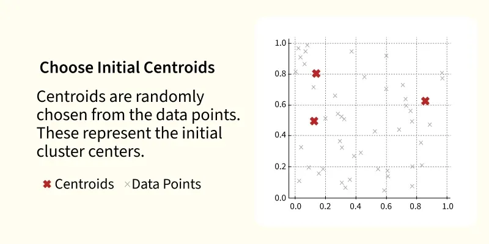
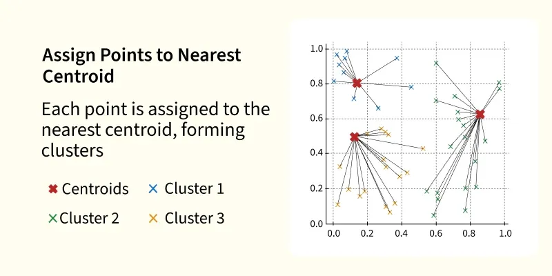
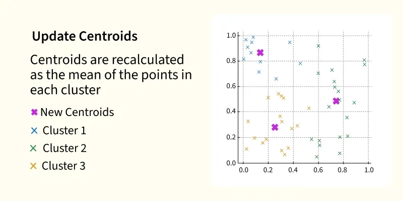
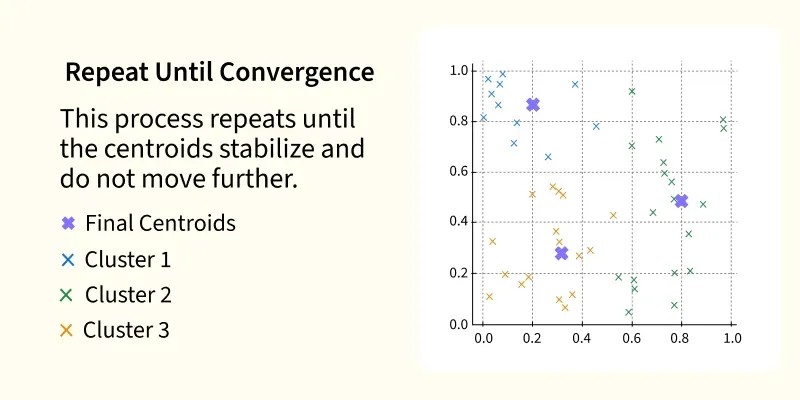
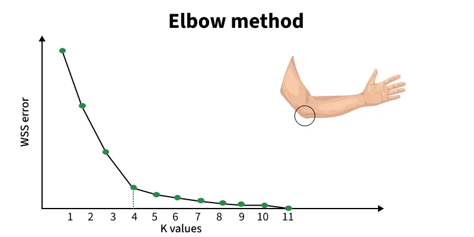
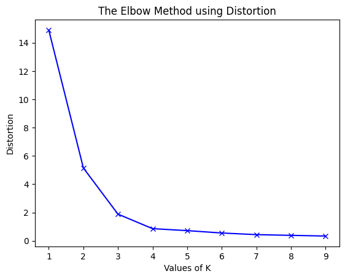
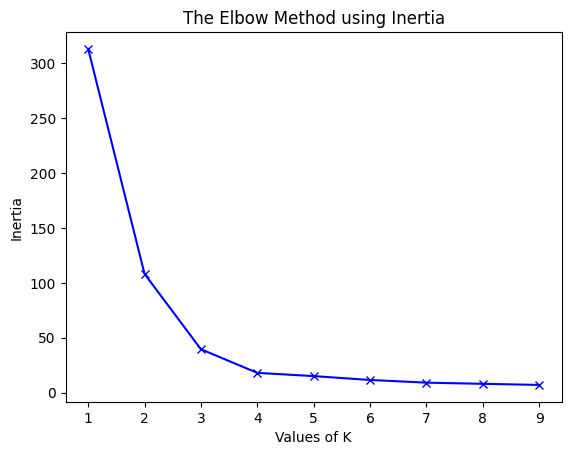
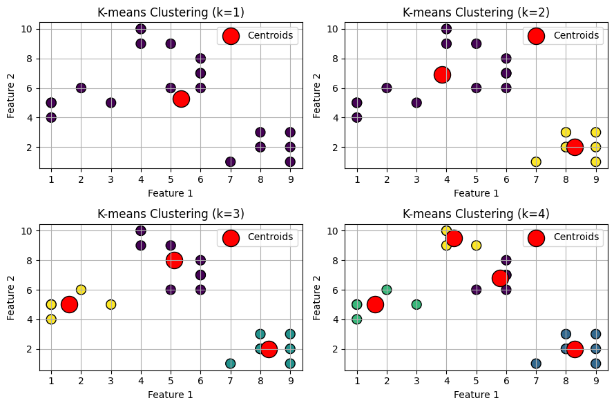

# Bài giảng: Centroid-based Clustering – K-Means, K-Means++ và Phương pháp Khuỷu tay (Elbow Method)

**Cập nhật lần cuối:** 22 tháng 9 năm 2026  
**Học phần:** Phân tích dữ liệu với Python (DSAI1005)  
**Giảng viên:** TS. Vũ Đức Minh – Khoa Khoa học dữ liệu và Trí tuệ nhân tạo, Trường Công nghệ và Kinh tế số, Đại học Kinh tế Quốc dân (NEU)  
**Nguồn tài liệu tham khảo chính:**  
- [GeeksforGeeks – K-means Clustering Introduction](https://www.geeksforgeeks.org/machine-learning/k-means-clustering-introduction/)  
- [GeeksforGeeks – Elbow Method for Optimal Value of k in KMeans](https://www.geeksforgeeks.org/machine-learning/elbow-method-for-optimal-value-of-k-in-kmeans/)

---

## Mục lục bài học

1. [Tổng quan về Phương pháp Phân cụm Dựa trên Tâm (Centroid-based Clustering)](#1-tổng-quan-về-phương-pháp-phân-cụm-dựa-trên-tâm-centroid-based-clustering)
2. [Mục tiêu bài học (Learning Objectives)](#2-mục-tiêu-bài-học-learning-objectives)
3. [Thuật toán K-Means Cổ điển (Standard K-Means / Lloyd's Algorithm)](#3-thuật-toán-k-means-cổ-điển-standard-k-means--lloyds-algorithm)
   - 3.1. Quy trình 4 bước vận hành cơ học
   - 3.2. Cơ sở Toán học & Hàm mục tiêu WCSS (Inertia)
   - 3.3. Các tiêu chuẩn hội tụ và điều kiện dừng
   - 3.4. Điểm yếu chí mạng của Khởi tạo ngẫu nhiên (Random Initialization)
4. [Thuật toán Khởi tạo Thông minh K-Means++](#4-thuật-toán-khởi-tạo-thông-minh-k-means)
   - 4.1. Động lực ra đời của K-Means++ (Arthur & Vassilvitskii, 2007)
   - 4.2. Cơ chế phân phối xác suất khoảng cách bình phương $D(x)^2$
   - 4.3. Đảm bảo giới hạn xấp xỉ lý thuyết $O(\log K)$
   - 4.4. Triển khai tham số `init='k-means++'` trong Scikit-Learn
5. [Xác định Số lượng Cụm $K$ Tối ưu bằng Phương pháp Khuỷu tay (The Elbow Method)](#5-xác-định-số-lượng-cụm-k-tối-ưu-bằng-phương-pháp-khuỷu-tay-the-elbow-method)
   - 5.1. Triết lý kinh tế học: Lợi suất giảm dần (Diminishing Marginal Returns)
   - 5.2. Hai độ đo cốt lõi: Độ biến dạng (Distortion) và Quán tính (Inertia)
   - 5.3. Đọc và phân tích đồ thị Đường cong Khuỷu tay (Elbow Curve)
   - 5.4. Kỹ thuật nhận diện điểm uốn tự động (Knee Point Detection)
6. [Biến thể Kiên cường trước Ngoại lai: K-Medoids (PAM)](#6-biến-thể-kiên-cường-trước-ngoại-lai-k-medoids-pam)
7. [Ưu điểm, Hạn chế & Hướng dẫn Thực hành Thực tế](#7-ưu-điểm-hạn-chế--hướng-dẫn-thực-hành-thực-tế)
8. [Thực hành Lập trình Python với Scikit-Learn](#8-thực-hành-lập-trình-python-với-scikit-learn)
   - 8.1. Tạo dữ liệu tổng hợp và kiểm tra cơ chế dịch chuyển tâm cụm
   - 8.2. So sánh thực nghiệm tốc độ hội tụ: K-Means ngẫu nhiên vs K-Means++
   - 8.3. Xây dựng hàm quét Distortion & Inertia và vẽ đồ thị Elbow Method
   - 8.4. Trực quan hóa kết quả phân cụm và các vùng phân hoạch Voronoi
9. [Tổng kết & Bộ câu hỏi ôn tập củng cố kiến thức](#9-tổng-kết--bộ-câu-hỏi-ôn-tập-củng-cố-kiến-thức)
10. [Tài liệu tham khảo](#10-tài-liệu-tham-khảo)

---

## 1. Tổng quan về Phương pháp Phân cụm Dựa trên Tâm (Centroid-based Clustering)

Trong họ các thuật toán Học không giám sát (Unsupervised Learning), **các phương pháp dựa trên tâm (Centroid-based Methods)** là phương pháp tiếp cận phổ biến, hiệu quả và có lịch sử lâu đời nhất.

Triết lý nền tảng của phương pháp này là:
> *"Mỗi cụm dữ liệu trong không gian đa chiều được đại diện và định danh bằng một điểm trung tâm duy nhất gọi là **Tâm cụm (Centroid)**. Một điểm dữ liệu bất kỳ sẽ thuộc về cụm có tâm cụm gần nó nhất."*

Về mặt hình học, việc gán điểm dữ liệu vào tâm cụm gần nhất sẽ phân hoạch không gian dữ liệu thành các đa giác lồi gọi là các **Ô Voronoi (Voronoi Cells)**. Ranh giới giữa hai cụm bất kỳ luôn là một siêu phẳng trực giao chia đôi đoạn thẳng nối hai tâm cụm tương ứng.

Bộ ba công cụ tạo nên xương sống của phương pháp phân cụm dựa trên tâm bao gồm:
1. **Thuật toán K-Means:** Cỗ máy tối ưu hóa vị trí tâm cụm thông qua vòng lặp Gán cụm – Cập nhật tâm.
2. **Thuật toán K-Means++:** Kỹ thuật khởi tạo tâm ban đầu thông minh, ngăn chặn mô hình rơi vào các cực tiểu cục bộ kém chất lượng.
3. **Phương pháp Khuỷu tay (Elbow Method):** Công cụ định lượng giúp nhà khoa học dữ liệu xác định số lượng cụm $K$ tối ưu một cách khách quan.

---

## 2. Mục tiêu bài học (Learning Objectives)

Sau khi hoàn thành bài học này, sinh viên có khả năng:

1. **Làm chủ quy trình 4 bước của K-Means:** Nắm vững giải thuật Lloyd gồm Khởi tạo $\to$ Gán cụm $\to$ Cập nhật tâm $\to$ Kiểm tra hội tụ.
2. **Hiểu sâu hàm mục tiêu toán học:** Viết và giải thích hàm mục tiêu cực tiểu hóa tổng bình phương khoảng cách nội cụm (Within-Cluster Sum of Squares - WCSS / Inertia).
3. **Giải mã thuật toán K-Means++:** Hiểu rõ cơ chế chọn tâm cụm kế tiếp với xác suất tỉ lệ thuận với $D(x)^2$, lý giải vì sao K-Means++ đảm bảo hệ số xấp xỉ $O(\log K)$ và triệt tiêu tính bất ổn của hạt giống ngẫu nhiên.
4. **Ứng dụng thành thạo Phương pháp Khuỷu tay (Elbow Method):** Tính toán hai chỉ số **Distortion** và **Inertia**, vẽ biểu đồ Elbow và xác định điểm gãy tối ưu.
5. **Thực thi và trực quan hóa chuyên sâu bằng Python:** Lập trình K-Means bằng Scikit-Learn, khảo sát tham số `init` và `n_init`, và áp dụng vào bài toán phân khúc khách hàng thực tế.

---

## 3. Thuật toán K-Means Cổ điển (Standard K-Means / Lloyd's Algorithm)

Thuật toán K-Means nguyên bản (thường gọi là thuật toán Lloyd - Forgy) là giải thuật phân cụm lặp (iterative clustering algorithm).

### 3.1. Quy trình 4 bước vận hành cơ học

Quá trình phân cụm diễn ra tuần tự theo 4 bước trực quan:

#### Bước 1: Khởi tạo dữ liệu và chọn số cụm $K$
Tập dữ liệu ban đầu gồm các điểm chưa có nhãn trong không gian $p$ chiều:
<p align="center">
  
</p>

#### Bước 2: Chọn ngẫu nhiên $K$ tâm cụm ban đầu
Thuật toán chọn ngẫu nhiên $K$ điểm trong không gian làm các tâm cụm khởi tạo $\mu_1, \mu_2, \dots, \mu_K$:
<p align="center">
  
</p>

#### Bước 3: Gán mỗi điểm dữ liệu vào tâm cụm gần nhất (Assignment Step)
Tính khoảng cách Euclidean từ từng điểm dữ liệu $x_i$ tới toàn bộ $K$ tâm cụm, gán $x_i$ vào cụm có khoảng cách ngắn nhất:
<p align="center">
  
</p>

#### Bước 4: Cập nhật lại vị trí tâm cụm và lặp lại tới khi hội tụ (Update & Convergence)
Tính toán lại tọa độ của từng tâm cụm bằng trọng tâm (giá trị trung bình số học) của tất cả các điểm vừa được gán vào cụm đó. Lặp lại bước 3 và bước 4 cho đến khi các tâm cụm cố định vị trí:
<p align="center">
  
</p>

### 3.2. Cơ sở Toán học & Hàm mục tiêu WCSS (Inertia)

Xét tập dữ liệu $X = \{x_1, x_2, \dots, x_N\}$ với mỗi $x_i \in \mathbb{R}^p$.  
Giả sử ta muốn phân chia $X$ thành $K$ cụm rời nhau: $C = \{C_1, C_2, \dots, C_K\}$.

Khoảng cách hình học chuẩn giữa điểm $x_i$ và tâm cụm $\mu_k$ là khoảng cách Euclidean:
$$d(x_i, \mu_k) = \|x_i - \mu_k\|_2 = \sqrt{\sum_{j=1}^p (x_{ij} - \mu_{kj})^2}$$

Mục tiêu của K-Means là tìm các phân hoạch cụm $C_k$ và các tâm cụm $\mu_k$ sao cho **Tổng bình phương khoảng cách trong từng cụm (Within-Cluster Sum of Squares - WCSS)**, còn gọi là **Inertia (Quán tính)**, đạt giá trị nhỏ nhất:

$$J(C, \mu) = \text{WCSS} = \sum_{k=1}^{K} \sum_{x_i \in C_k} \|x_i - \mu_k\|^2$$

Tại bước cập nhật tâm cụm, đạo hàm của hàm mục tiêu $J$ theo từng vector $\mu_k$ được triệt tiêu về 0:
$$\frac{\partial J}{\partial \mu_k} = -2 \sum_{x_i \in C_k} (x_i - \mu_k) = 0 \implies \mu_k = \frac{1}{|C_k|} \sum_{x_i \in C_k} x_i$$
Điều này chứng minh rằng **trung bình số học (Mean)** chính là nghiệm giải tích tối ưu duy nhất cực tiểu hóa WCSS trong từng cụm.

### 3.3. Các tiêu chuẩn hội tụ và điều kiện dừng

Thuật toán K-Means đảm bảo sẽ dừng lại sau một số hữu hạn bước khi thỏa mãn một trong các điều kiện:
1. **Tâm cụm không thay đổi:** $\|\mu_k^{(t+1)} - \mu_k^{(t)}\| < \text{tolerance}$ (trong Scikit-Learn tham số `tol=1e-4`).
2. **Không có điểm dữ liệu nào bị đổi cụm** giữa hai vòng lặp liên tiếp.
3. **Đạt số vòng lặp tối đa** được thiết lập trước (tham số `max_iter=300`).

### 3.4. Điểm yếu chí mạng của Khởi tạo ngẫu nhiên (Random Initialization)

Hàm mục tiêu WCSS là một hàm **phi lồi (Non-convex)**, chứa rất nhiều điểm cực tiểu cục bộ (Local Minima). Khi khởi tạo ngẫu nhiên thuần túy (`init='random'`):
- Nếu vô tình chọn hai tâm cụm ban đầu nằm quá sát nhau trong cùng một cụm tự nhiên, một trong hai tâm sẽ bị "bỏ đói" hoặc chia đôi cụm tự nhiên một cách khiên cưỡng.
- Trong khi đó, hai cụm tự nhiên khác nằm xa nhau lại có thể bị gộp chung vào một tâm cụm duy nhất.
- Kết quả phân cụm cuối cùng bị phụ thuộc hoàn toàn vào **vận may rủi của hạt giống ngẫu nhiên (Random Seed)**, dẫn đến việc phân cụm sai lệch và thiếu ổn định.

---

## 4. Thuật toán Khởi tạo Thông minh K-Means++

### 4.1. Động lực ra đời của K-Means++ (Arthur & Vassilvitskii, 2007)

Để khắc phục triệt để điểm yếu chí mạng của việc khởi tạo ngẫu nhiên, David Arthur và Sergei Vassilvitskii (Đại học Stanford) đã công bố thuật toán **K-Means++** tại Hội nghị ACM-SIAM 2007.

Ý tưởng cốt lõi của K-Means++ rất trực quan:
> *"Các tâm cụm ban đầu phải được đặt **càng cách xa nhau càng tốt** trong không gian dữ liệu."*

### 4.2. Cơ chế phân phối xác suất khoảng cách bình phương $D(x)^2$

Quy trình chọn $K$ tâm cụm ban đầu của K-Means++ được thực hiện như sau:

1. **Chọn tâm cụm đầu tiên:** Chọn ngẫu nhiên đều một điểm dữ liệu bất kỳ trong tập $X$ làm tâm cụm thứ nhất $\mu_1$.
2. **Tính khoảng cách ngắn nhất $D(x)$:** Với mỗi điểm dữ liệu $x \in X$, tính khoảng cách từ $x$ đến tâm cụm gần nó nhất trong số các tâm cụm đã chọn:
   $$D(x) = \min_{j \in \{1, \dots, m\}} \|x - \mu_j\|$$
3. **Chọn tâm cụm tiếp theo theo xác suất:** Chọn điểm tiếp theo làm tâm cụm $\mu_{m+1}$ từ tập dữ liệu với phân phối xác suất tỉ lệ thuận với bình phương khoảng cách $D(x)^2$:
   $$P(x) = \frac{D(x)^2}{\sum_{x' \in X} D(x')^2}$$
4. **Lặp lại:** Lặp lại bước 2 và bước 3 cho đến khi chọn đủ $K$ tâm cụm.
5. **Khởi động Lloyd:** Sau khi đã có $K$ tâm cụm khởi tạo tối ưu, tiếp tục chạy các bước Gán cụm và Cập nhật tâm của K-Means chuẩn.

```
Ý nghĩa xác suất:
- Những điểm dữ liệu nằm rất gần các tâm cụm đã chọn sẽ có D(x) ~ 0 ==> Xác suất được chọn tiếp ~ 0.
- Những điểm dữ liệu nằm xa tít tắp các tâm cụm hiện có sẽ có D(x)^2 rất lớn ==> Xác suất được chọn cực cao!
```

### 4.3. Đảm bảo giới hạn xấp xỉ lý thuyết $O(\log K)$

Khác với K-Means ngẫu nhiên vốn không có bất kỳ một bảo đảm toán học nào về chất lượng nghiệm, Arthur & Vassilvitskii đã chứng minh định lý toán học nổi tiếng:
$$\mathbb{E}[\text{WCSS}_{\text{K-Means++}}] \le 8(\ln K + 2) \cdot \text{WCSS}_{\text{Optimal}}$$

Nghĩa là sai số kỳ vọng của K-Means++ luôn bị chặn trên bởi một hàm logarit theo số cụm $K$ so với nghiệm tối ưu toàn cục. Trong thực nghiệm, K-Means++ giúp:
- Tăng tốc độ hội tụ nhanh hơn gấp $2 - 3$ lần (cần ít vòng lặp hơn).
- Giảm căn bản sai số WCSS trung bình từ $10\%$ đến $50\%$.

### 4.4. Triển khai tham số `init='k-means++'` trong Scikit-Learn
Nhận thấy ưu thế vượt trội này, thư viện `scikit-learn` đã đặt **`init='k-means++'` làm giá trị mặc định tuyệt đối** cho lớp `sklearn.cluster.KMeans` suốt nhiều năm qua. Người dùng không cần cấu hình phức tạp mà tự động được hưởng lợi từ giải thuật này.

---

## 5. Xác định Số lượng Cụm $K$ Tối ưu bằng Phương pháp Khuỷu tay (The Elbow Method)

Một trong những bài toán hóc búa nhất của học không giám sát là: **Làm sao để biết tập dữ liệu có bao nhiêu cụm tự nhiên ($K = ?$)** khi không có bất kỳ nhãn nào?

<p align="center">
  
</p>

### 5.1. Triết lý kinh tế học: Lợi suất giảm dần (Diminishing Marginal Returns)

- Nếu bạn chọn $K = 1$, mô hình coi toàn bộ dữ liệu là 1 cụm, sai số WCSS sẽ rất lớn.
- Nếu bạn tăng $K = 2, 3, 4$, WCSS giảm dốc đứng vì các cụm dần ôm khít các nhóm tự nhiên.
- Nếu bạn tăng $K = N$ (mỗi điểm là 1 cụm), thì $\text{WCSS} = 0$ tuyệt đối. Nhưng mô hình trở nên vô nghĩa!

**Quy luật:** Khi $K$ vượt qua số lượng cụm thực tế của dữ liệu, việc tiếp tục bổ sung thêm cụm chỉ làm giảm WCSS rất ít (lợi suất cận biên giảm dần). Điểm gãy nơi tốc độ giảm WCSS chững lại đột ngột tạo thành hình giống như **khuỷu tay (Elbow)** chính là giá trị $K$ tối ưu.

### 5.2. Hai độ đo cốt lõi: Độ biến dạng (Distortion) và Quán tính (Inertia)

Trong tài liệu GeeksforGeeks, hai độ đo sau được dùng để vẽ đồ thị Elbow:

#### 1. Distortion (Độ biến dạng trung bình):
Là **khoảng cách bình phương trung bình** từ mỗi điểm dữ liệu tới tâm cụm của nó:
$$\text{Distortion} = \frac{1}{N} \sum_{i=1}^{N} \min_{k} \|x_i - \mu_k\|^2$$

<p align="center">
  
</p>

#### 2. Inertia (Quán tính / WCSS):
Là **tổng bình phương khoảng cách** từ tất cả các điểm tới tâm cụm gần nhất:
$$\text{Inertia} = \sum_{i=1}^{N} \min_{k} \|x_i - \mu_k\|^2 = N \times \text{Distortion}$$

<p align="center">
  
</p>

### 5.3. Đọc và phân tích đồ thị Đường cong Khuỷu tay

Quan sát hai đồ thị trên, ta nhận thấy:
- Từ $K = 1 \to K = 2 \to K = 3$: Giá trị Distortion và Inertia rơi dốc đứng từ trên $70$ xuống dưới $15$.
- Từ $K = 3 \to K = 4 \to K = 9$: Tốc độ suy giảm trở nên là là, phẳng dần.
- Điểm uốn rõ nét nhất xuất hiện chính xác tại **$K = 3$ (hoặc $K = 4$)**. Do đó, $K = 3$ là số lượng cụm tối ưu nhất cho tập dữ liệu này:

<p align="center">
  
</p>

### 5.4. Kỹ thuật nhận diện điểm uốn tự động (Knee Point Detection)
Trong các hệ thống tự động hóa công nghiệp (AutoML), thay vì nhìn bằng mắt thường, người ta sử dụng gói thư viện `kneed` (Kneedle Algorithm) tính toán khoảng cách vuông góc xa nhất từ đường cong WCSS đến đoạn thẳng nối điểm đầu ($K_{\min}$) và điểm cuối ($K_{\max}$) để tìm điểm khuỷu tay chuẩn xác.

---

## 6. Biến thể Kiên cường trước Ngoại lai: K-Medoids (PAM)

Một hạn chế cố hữu của K-Means là việc tính toán tâm cụm bằng giá trị trung bình cộng (Mean):
$$\mu = \frac{1}{N} \sum x_i$$
Hàm trung bình cộng cực kỳ nhạy cảm với các điểm dữ liệu dị biệt (Outliers). Chỉ cần một điểm ngoại lai nằm tít ngoài xa cũng có thể kéo lệch vị trí của tâm cụm đi hàng chục đơn vị.

Để khắc phục, thuật toán **K-Medoids (PAM - Partitioning Around Medoids)** được đề xuất:
- **Medoid** là điểm dữ liệu **có thật trong tập dữ liệu**, nằm ở vị trí trung tâm nhất của cụm (điểm có tổng khoảng cách tới tất cả các điểm khác trong cụm là nhỏ nhất).
- K-Medoids thay thế phép đo bình phương Euclidean bằng khoảng cách Manhattan ($L_1$) hoặc bất kỳ độ đo tùy ý nào, giúp giải thuật **hoàn toàn miễn nhiễm với ngoại lai**.
- *Đánh đổi:* Độ phức tạp tính toán của K-Medoids là $O(K(N-K)^2)$, chậm hơn đáng kể so với K-Means, chỉ phù hợp cho dữ liệu quy mô nhỏ và trung bình.

---

## 7. Ưu điểm, Hạn chế & Hướng dẫn Thực hành Thực tế

### 7.1. Ưu điểm nổi bật của K-Means & K-Means++
- **Tốc độ tính toán siêu nhanh và khả năng mở rộng (Scalability):** Độ phức tạp tuyến tính $O(I \cdot K \cdot N \cdot p)$, có thể xử lý tập dữ liệu hàng triệu dòng chỉ trong vài giây.
- **Đơn giản, trực quan:** Cực kỳ dễ hiểu, dễ diễn giải và dễ trực quan hóa cho các nhà quản lý doanh nghiệp.
- **Biến thể Mini-Batch K-Means:** Cho phép xử lý dữ liệu dòng (Streaming Data) hoặc dữ liệu khổng lồ không vừa bộ nhớ RAM bằng cách cập nhật tâm cụm theo từng lô mẫu nhỏ (Mini-batches).

### 7.2. Các cạm bẫy và hạn chế cần lưu ý
1. **Giả định cụm hình cầu (Spherical Clusters):** K-Means chỉ hoạt động tốt khi các cụm có hình cầu lồi và kích thước tương đương nhau. K-Means sẽ thất bại hoàn toàn nếu các cụm có hình trăng khuyết, elip dài hoặc lồng nhau (lúc này nên dùng DBSCAN hoặc Spectral Clustering).
2. **Bắt buộc phải biết trước số cụm $K$:** Luôn phải kết hợp với Elbow Method hoặc Silhouette Score.
3. **Bắt buộc chuẩn hóa thang đo đặc trưng (Feature Scaling):** K-Means sử dụng khoảng cách Euclidean. Nếu không áp dụng `StandardScaler`, biến có độ lớn số học lớn hơn sẽ hoàn toàn thống trị phân cụm.

---

## 8. Thực hành Lập trình Python với Scikit-Learn

Trong phần này, chúng ta sẽ thực hành toàn bộ quy trình từ việc tạo dữ liệu, khảo sát Elbow Method, so sánh K-Means ngẫu nhiên với K-Means++, và trực quan hóa phân cụm.

### 8.1. Khởi tạo dữ liệu thực nghiệm và thư viện cần thiết

```python
import numpy as np
import matplotlib.pyplot as plt
from sklearn.datasets import make_blobs
from sklearn.cluster import KMeans
from sklearn.preprocessing import StandardScaler
from scipy.spatial.distance import cdist

# 1. Tạo tập dữ liệu tổng hợp gồm 600 mẫu với 4 cụm tự nhiên
X_raw, y_true = make_blobs(
    n_samples=600, 
    centers=4, 
    cluster_std=0.75, 
    random_state=42
)

# 2. BẮT BUỘC: Chuẩn hóa dữ liệu về mean=0, std=1
scaler = StandardScaler()
X = scaler.fit_transform(X_raw)

print(f"Kích thước tập dữ liệu: {X.shape}")
```

### 8.2. So sánh thực nghiệm tốc độ hội tụ: K-Means ngẫu nhiên vs K-Means++

Khảo sát sự khác biệt về số vòng lặp và giá trị quán tính (Inertia) giữa hai phương pháp khởi tạo:

```python
# Huấn luyện K-Means với khởi tạo ngẫu nhiên (chỉ chạy 1 lần khởi tạo n_init=1)
kmeans_random = KMeans(n_clusters=4, init='random', n_init=1, random_state=12)
kmeans_random.fit(X)

# Huấn luyện K-Means với khởi tạo K-Means++ (n_init=1)
kmeans_plus = KMeans(n_clusters=4, init='k-means++', n_init=1, random_state=12)
kmeans_plus.fit(X)

print("=== SO SÁNH HIỆU NĂNG KHỞI TẠO ===")
print(f"K-Means (Random):     Inertia = {kmeans_random.inertia_:.2f}, Số vòng lặp hội tụ = {kmeans_random.n_iter_}")
print(f"K-Means (K-Means++):  Inertia = {kmeans_plus.inertia_:.2f}, Số vòng lặp hội tụ = {kmeans_plus.n_iter_}")
```

**Nhận định:** K-Means++ đạt mức quán tính WCSS thấp hơn và hội tụ nhanh hơn hẳn so với khởi tạo ngẫu nhiên.

### 8.3. Xây dựng hàm quét Distortion & Inertia và vẽ đồ thị Elbow Method

```python
distortions = []
inertias = []
k_range = range(1, 11)

for k in k_range:
    model = KMeans(n_clusters=k, init='k-means++', n_init=10, random_state=42)
    model.fit(X)
    
    # 1. Inertia: Tổng bình phương khoảng cách
    inertias.append(model.inertia_)
    
    # 2. Distortion: Trung bình bình phương khoảng cách Euclidean tới tâm cụm gần nhất
    distortion = np.mean(np.min(cdist(X, model.cluster_centers_, 'euclidean')**2, axis=1))
    distortions.append(distortion)

# Vẽ đồ thị kép biểu diễn Elbow Method
fig, (ax1, ax2) = plt.subplots(1, 2, figsize=(14, 5))

# Đồ thị Distortion
ax1.plot(k_range, distortions, 'bx-', linewidth=2, markersize=8)
ax1.set_xlabel('Số lượng cụm (k)', fontsize=12)
ax1.set_ylabel('Độ biến dạng (Distortion)', fontsize=12)
ax1.set_title('Elbow Method sử dụng Distortion', fontsize=14, fontweight='bold')
ax1.axvline(x=4, color='red', linestyle='--', label='Điểm khuỷu tay (Optimal k=4)')
ax1.grid(True, linestyle='--', alpha=0.5)
ax1.legend(fontsize=11)

# Đồ thị Inertia
ax2.plot(k_range, inertias, 'ro-', linewidth=2, markersize=8)
ax2.set_xlabel('Số lượng cụm (k)', fontsize=12)
ax2.set_ylabel('Quán tính (Inertia / WCSS)', fontsize=12)
ax2.set_title('Elbow Method sử dụng Inertia', fontsize=14, fontweight='bold')
ax2.axvline(x=4, color='blue', linestyle='--', label='Điểm khuỷu tay (Optimal k=4)')
ax2.grid(True, linestyle='--', alpha=0.5)
ax2.legend(fontsize=11)

plt.tight_layout()
plt.show()
```

### 8.4. Trực quan hóa kết quả phân cụm và các vùng phân hoạch Voronoi

```python
# Huấn luyện mô hình tối ưu với k=4
optimal_kmeans = KMeans(n_clusters=4, init='k-means++', n_init=10, random_state=42)
labels = optimal_kmeans.fit_predict(X)
centroids = optimal_kmeans.cluster_centers_

# Tạo lưới mịn để vẽ vùng Voronoi
h = 0.02
x_min, x_max = X[:, 0].min() - 0.5, X[:, 0].max() + 0.5
y_min, y_max = X[:, 1].min() - 0.5, X[:, 1].max() + 0.5
xx, yy = np.meshgrid(np.arange(x_min, x_max, h), np.arange(y_min, y_max, h))

Z = optimal_kmeans.predict(np.c_[xx.ravel(), yy.ravel()])
Z = Z.reshape(xx.shape)

# Vẽ biểu đồ
plt.figure(figsize=(9, 6))
plt.imshow(Z, interpolation='nearest',
           extent=(xx.min(), xx.max(), yy.min(), yy.max()),
           cmap=plt.cm.Pastel2, aspect='auto', origin='lower')

# Vẽ các điểm dữ liệu
scatter = plt.scatter(X[:, 0], X[:, 1], c=labels, cmap='Set1', s=35, edgecolors='k', linewidth=0.5)

# Vẽ các tâm cụm (Centroids)
plt.scatter(centroids[:, 0], centroids[:, 1], marker='X', s=250, linewidths=2,
            color='black', zorder=10, label='Tâm cụm (Centroids)')

plt.title('Kết quả Phân cụm K-Means++ và Ranh giới Ô Voronoi (k=4)', fontsize=14, fontweight='bold')
plt.xlabel('Đặc trưng X1 (Đã chuẩn hóa)', fontsize=12)
plt.ylabel('Đặc trưng X2 (Đã chuẩn hóa)', fontsize=12)
plt.legend(fontsize=11)
plt.grid(True, linestyle=':', alpha=0.4)
plt.show()
```

---

## 9. Tổng kết & Bộ câu hỏi ôn tập củng cố kiến thức

### Bảng tóm tắt nội dung trọng tâm

| Khái niệm | Ý nghĩa & Bản chất kỹ thuật |
| :--- | :--- |
| **Centroid-based** | Phương pháp phân cụm biểu diễn mỗi nhóm bằng một tâm cụm và gán điểm theo khoảng cách ngắn nhất. |
| **K-Means (Lloyd)** | Giải thuật lặp 4 bước: Gán cụm theo khoảng cách Euclidean và Cập nhật tâm bằng giá trị trung bình mẫu. |
| **Hàm mục tiêu WCSS** | $J = \sum \sum \|x_i - \mu_k\|^2$, đo lường độ nén chặt nội cụm; luôn giảm khi số cụm $K$ tăng. |
| **K-Means++** | Thuật toán khởi tạo tâm cụm theo phân phối xác suất tỉ lệ với $D(x)^2$, loại bỏ bẫy cực tiểu cục bộ và đạt cận xấp xỉ $O(\log K)$. |
| **Elbow Method** | Công cụ trực quan hóa đồ thị Distortion hoặc Inertia theo $K$ để tìm điểm uốn (khuỷu tay) có lợi suất cận biên tối ưu. |
| **K-Medoids** | Biến thể sử dụng điểm dữ liệu thực tế làm tâm, kiên cường vượt trội trước ngoại lai. |

---

### Bộ 5 câu hỏi trắc nghiệm & tự luận chuyên sâu

#### Câu 1: Tại sao việc khởi tạo các tâm cụm bằng thuật toán K-Means++ lại vượt trội hơn hẳn so với việc chọn ngẫu nhiên đồng đều (Random Initialization)?
- **A.** Vì K-Means++ tự động tính toán được số lượng cụm $K$ mà không cần người dùng khai báo.
- **B.** Vì K-Means++ chọn các tâm cụm ban đầu cách xa nhau nhất có thể theo xác suất $D(x)^2$, ngăn ngừa các tâm cụm bị chụm vào cùng một nhóm và đảm bảo hệ số xấp xỉ $O(\log K)$ so với nghiệm tối ưu toàn cục.
- **C.** Vì K-Means++ có khả năng phân cụm dữ liệu văn bản mà không cần chuyển đổi vector.
- **D.** Vì K-Means++ không sử dụng khoảng cách Euclidean.
- *(Gợi ý đáp án: **B**. Cơ chế xác suất tỉ lệ với $D(x)^2$ phân tán đều các tâm cụm ban đầu ra khắp không gian dữ liệu).*

#### Câu 2: Trong đồ thị Đường cong Khuỷu tay (Elbow Curve), tại sao giá trị Inertia (WCSS) luôn giảm đơn điệu khi số lượng cụm $K$ tăng từ $1$ lên $N$?
- **A.** Vì thuật toán tự động loại bỏ các điểm ngoại lai khi tăng $K$.
- **B.** Vì khi có nhiều tâm cụm hơn, khoảng cách từ mỗi điểm dữ liệu tới tâm cụm gần nó nhất chắc chắn sẽ ngắn hơn hoặc bằng so với khi có ít tâm cụm.
- **C.** Vì hàm mất mát của K-Means là hàm lồi.
- **D.** Vì số chiều của dữ liệu bị giảm xuống.
- *(Gợi ý đáp án: **B**. Thêm tâm cụm làm giảm không gian chia sẻ, tại cực hạn $K=N$ mỗi điểm là 1 tâm và WCSS = 0).*

#### Câu 3: Sự khác biệt bản chất giữa chỉ số Distortion và chỉ số Inertia trong việc xây dựng đồ thị Elbow Method là gì?
- **A.** Distortion đo khoảng cách Manhattan, còn Inertia đo khoảng cách Euclidean.
- **B.** Distortion là khoảng cách bình phương trung bình trên mỗi điểm dữ liệu ($\frac{1}{N}\text{WCSS}$), trong khi Inertia là tổng bình phương khoảng cách của toàn bộ tập dữ liệu ($\text{WCSS}$).
- **C.** Distortion chỉ dùng cho K-Medoids, còn Inertia dùng cho K-Means.
- **D.** Inertia luôn nhận giá trị âm, còn Distortion luôn dương.
- *(Gợi ý đáp án: **B**. Về mặt hình dạng đồ thị, cả hai đường cong đều đồng dạng và cho ra cùng một điểm khuỷu tay $K$).*

#### Câu 4: Khi nào thuật toán K-Means sẽ cho kết quả phân cụm kém chính xác dù bạn đã sử dụng K-Means++ và chọn đúng giá trị $K$ tối ưu?
- *(Gợi ý trả lời: K-Means sẽ thất bại khi dữ liệu vi phạm các giả định hình học cốt lõi: 1) Các cụm có hình dạng phi cầu lồi (như hình trăng khuyết, hình xoắn ốc, hình vành đai lồng nhau); 2) Các cụm có mật độ và kích thước quá chênh lệch nhau; 3) Dữ liệu chưa được chuẩn hóa thang đo đặc trưng khiến một biến áp đảo khoảng cách Euclidean; hoặc 4) Dữ liệu có quá nhiều ngoại lai cực đoan làm lệch vị trí trung bình của tâm cụm).*

#### Câu 5: Phân tích sự đánh đổi giữa K-Means và K-Medoids (PAM). Trong trường hợp nào bạn bắt buộc phải cân nhắc chuyển sang K-Medoids?
- *(Gợi ý trả lời: K-Means tính tâm bằng trung bình cộng (Mean) nên có độ phức tạp tính toán rất nhẹ $O(N)$, nhưng cực kỳ nhạy cảm với ngoại lai và chỉ dùng được với khoảng cách Euclidean. K-Medoids chọn tâm là một điểm dữ liệu thực tế (Medoid) và hỗ trợ mọi độ đo khoảng cách tùy ý (Manhattan, Cosine, khoảng cách tùy biến), giúp kiên cường tuyệt đối trước ngoại lai và dữ liệu danh mục. Tuy nhiên, K-Medoids có chi phí tính toán nặng hơn nhiều ($O(N^2)$), nên chỉ phù hợp khi tập dữ liệu có quy mô vừa phải nhưng chứa nhiều nhiễu ngoại lai quan trọng).*

---

## 10. Tài liệu tham khảo

1. **GeeksforGeeks:** [K-means Clustering Introduction](https://www.geeksforgeeks.org/machine-learning/k-means-clustering-introduction/)
2. **GeeksforGeeks:** [Elbow Method for Optimal Value of k in KMeans](https://www.geeksforgeeks.org/machine-learning/elbow-method-for-optimal-value-of-k-in-kmeans/)
3. **Arthur, D., & Vassilvitskii, S. (2007):** *k-means++: The Advantages of Careful Seeding*. Proceedings of the Eighteenth Annual ACM-SIAM Symposium on Discrete Algorithms (SODA '07), 1027–1035.
4. **Lloyd, S. (1982):** *Least squares quantization in PCM*. IEEE Transactions on Information Theory, 28(2), 129–137.
5. **Scikit-Learn Documentation:** [K-Means (`sklearn.cluster.KMeans`)](https://scikit-learn.org/stable/modules/generated/sklearn.cluster.KMeans.html)
