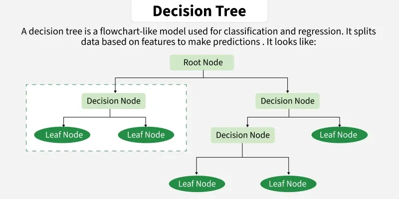
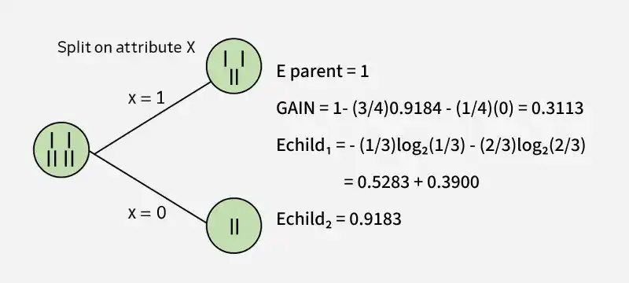
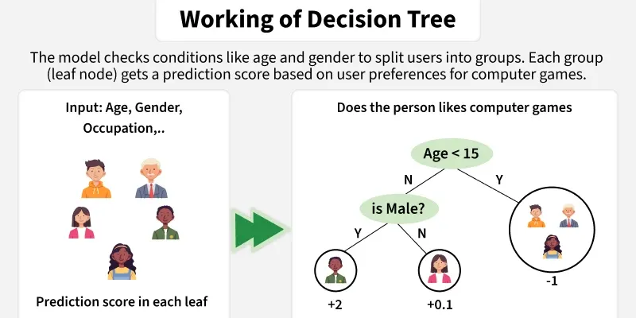
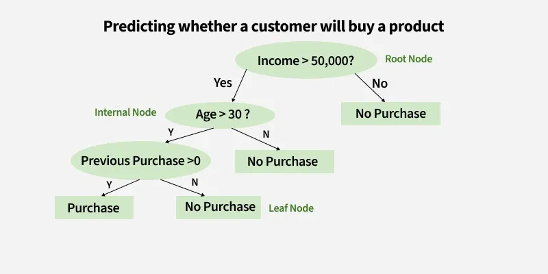
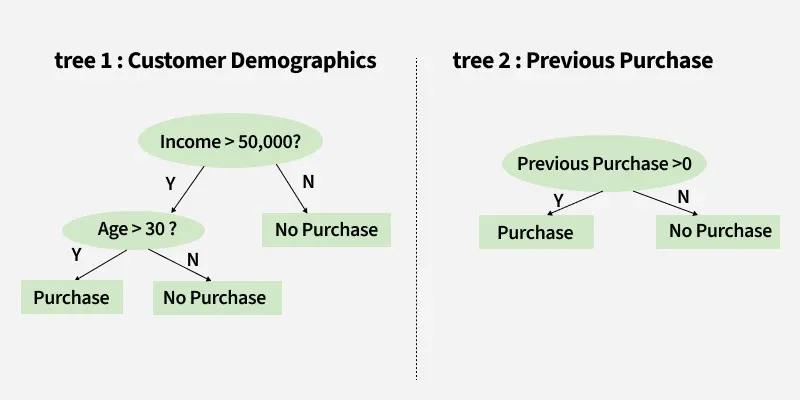
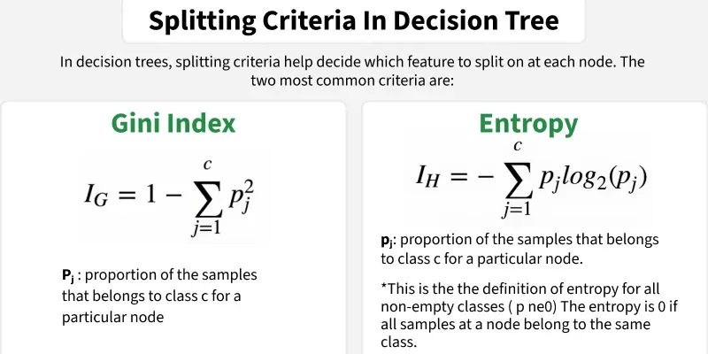
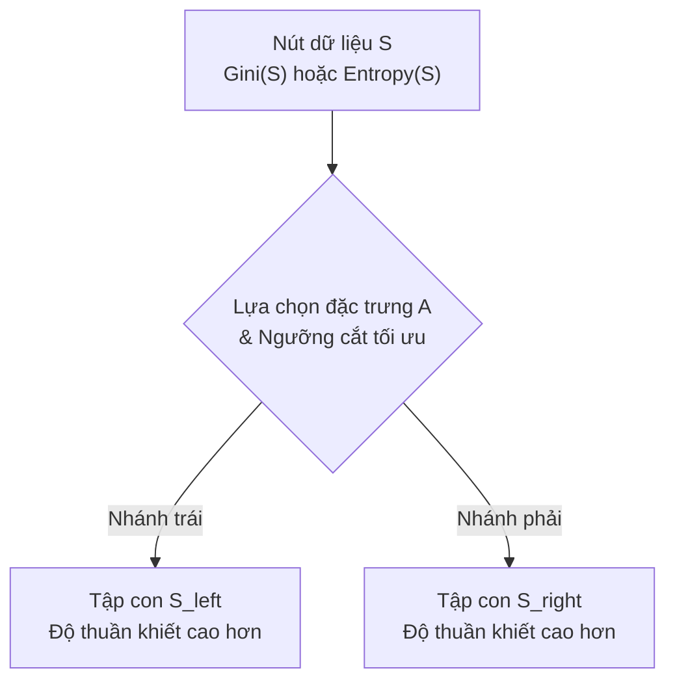
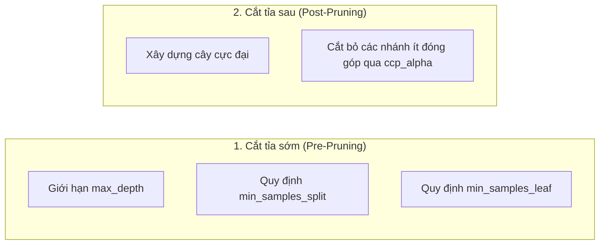
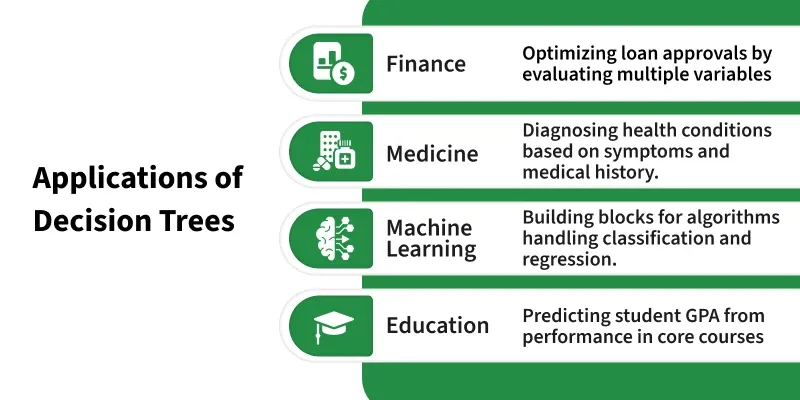

# Bài giảng: Decision Tree (Cây quyết định trong Machine Learning)

**Cập nhật lần cuối:** 21 tháng 9 năm 2026  
**Học phần:** Phân tích dữ liệu với Python (DSAI1005)  
**Giảng viên:** TS. Vũ Đức Minh – Khoa Khoa học dữ liệu và Trí tuệ nhân tạo, Trường Công nghệ và Kinh tế số, Đại học Kinh tế Quốc dân (NEU)  
**Nguồn tài liệu tham khảo chính:** [GeeksforGeeks – Decision Tree in Machine Learning](https://www.geeksforgeeks.org/machine-learning/decision-tree-introduction-example/)

---

## Mục lục bài học

1. [Tổng quan về Cây quyết định (Decision Tree)](#1-tổng-quan-về-cây-quyết-định-decision-tree)
2. [Mục tiêu bài học (Learning Objectives)](#2-mục-tiêu-bài-học-learning-objectives)
3. [Cấu trúc phân cấp của Cây quyết định](#3-cấu-trúc-phân-cấp-của-cây-quyết-định)
4. [Nguyên lý Hoạt động & Phân tách Dữ liệu Đệ quy](#4-nguyên-lý-hoạt-động--phân-tách-dữ-liệu-đệ-quy)
   - 4.1. Ví dụ thực tế: Dự đoán ý định mua sắm của khách hàng
   - 4.2. Ra quyết định với mô hình kết hợp nhiều cây (Decision Paths)
5. [Tiêu chuẩn Phân chia Thuộc tính (Attribute Selection Measures)](#5-tiêu-chuẩn-phân-chia-thuộc-tính-attribute-selection-measures)
   - 5.1. Entropy & Độ vẩn đục (Measure of Impurity)
   - 5.2. Information Gain (Độ lợi thông tin) & Thuật toán ID3
   - 5.3. Chỉ số Vẩn đục Gini (Gini Impurity) & Thuật toán CART
   - 5.4. Giảm phương sai (Variance Reduction) cho bài toán Hồi quy
6. [Các thuật toán Cây quyết định kinh điển: ID3, C4.5 và CART](#6-các-thuật-toán-cây-quyết-định-kinh-điển-id3-c45-và-cart)
7. [Vấn đề Quá khớp (Overfitting) & Kỹ thuật Cắt tỉa Cây (Pruning)](#7-vấn-đề-quá-khớp-overfitting--kỹ-thuật-cắt-tỉa-cây-pruning)
   - 7.1. Cắt tỉa sớm (Pre-pruning / Early Stopping)
   - 7.2. Cắt tỉa sau (Post-pruning / Cost Complexity Pruning)
8. [Ưu điểm, Hạn chế & Ứng dụng Thực tế](#8-ưu-điểm-hạn-chế--ứng-dụng-thực-tế)
9. [Thực hành Lập trình Python với Scikit-Learn](#9-thực-hành-lập-trình-python-với-scikit-learn)
   - 9.1. Bài toán Phân loại: Xây dựng và trực quan hóa cây quyết định
   - 9.2. Bài toán Hồi quy: Dự báo liên tục với DecisionTreeRegressor
   - 9.3. Khảo sát hiện tượng Overfitting theo độ sâu `max_depth`
10. [Tổng kết & Bộ câu hỏi ôn tập củng cố kiến thức](#10-tổng-kết--bộ-câu-hỏi-ôn-tập-củng-cố-kiến-thức)
11. [Tài liệu tham khảo](#11-tài-liệu-tham-khảo)

---

## 1. Tổng quan về Cây quyết định (Decision Tree)

Trong học máy có giám sát (Supervised Machine Learning), **Decision Tree (Cây quyết định)** là một trong những giải thuật phi tham số (non-parametric) trực quan, mạnh mẽ và phổ biến nhất. Khác với các mô hình tuyến tính (Linear Regression hay Logistic Regression) vốn đòi hỏi dữ liệu phải tuân theo các giả định toán học khắt khe về mặt phân phối, Cây quyết định hoạt động tương tự như một **sơ đồ dòng chảy (flowchart)** giúp con người hoặc hệ thống đưa ra các quyết định từng bước dựa trên các quy tắc suy diễn logic *if-else*.

<p align="center">
  
</p>

### Các đặc tính nổi bật:
- **Đa năng (Versatile):** Giải quyết xuất sắc cả hai bài toán: **Phân loại (Classification)** thông qua `DecisionTreeClassifier` và **Hồi quy (Regression)** thông qua `DecisionTreeRegressor`.
- **Tính diễn giải cực cao (White-box Model):** Cấu trúc cây phản ánh quy trình suy nghĩ tự nhiên của con người. Người phân tích có thể dễ dàng giải thích cho các nhà quản lý doanh nghiệp vì sao khách hàng A được duyệt vay vốn hoặc khách hàng B bị từ chối cấp thẻ tín dụng.
- **Tiền xử lý tối thiểu:** Không đòi hỏi chuẩn hóa thang đo đặc trưng (Feature Scaling như Min-Max hay Z-score), không bị ảnh hưởng bởi phép biến đổi đơn điệu, và xử lý tự nhiên cả biến số (numerical) lẫn biến danh mục (categorical).

---

## 2. Mục tiêu bài học (Learning Objectives)

Sau khi hoàn thành bài học này, sinh viên có khả năng:

1. **Hiểu bản chất cấu trúc:** Nắm vững cấu trúc phân cấp hình cây bao gồm Nút gốc (Root Node), Nút quyết định (Decision Node), Nhánh (Branch) và Nút lá (Leaf Node).
2. **Làm chủ toán học phân chia:** Tính toán thành thạo chỉ số **Entropy**, **Information Gain (Độ lợi thông tin)** và **Gini Impurity (Độ vẩn đục Gini)** để lựa chọn đặc trưng phân nhánh tối ưu.
3. **Phân biệt các giải thuật:** Phân tích điểm khác biệt giữa các họ thuật toán cây kinh điển: **ID3**, **C4.5** và **CART (Classification and Regression Trees)**.
4. **Kiểm soát Overfitting:** Nhận diện rủi ro quá khớp khi cây phát triển quá sâu và áp dụng thành thạo các kỹ thuật cắt tỉa cây (Pre-pruning qua `max_depth`, `min_samples_split` và Post-pruning qua `ccp_alpha`).
5. **Thực hành với Scikit-Learn:** Xây dựng, huấn luyện, trực quan hóa cây bằng `tree.plot_tree` và diễn giải báo cáo phân loại bằng Python.

---

## 3. Cấu trúc phân cấp của Cây quyết định

Một cây quyết định được tổ chức dưới dạng đồ thị có hướng không chu trình (DAG) phân cấp từ trên xuống dưới, bao gồm 4 thành phần cơ bản:

<p align="center">
  
</p>

1. **Nút gốc (Root Node):** Nút khởi đầu cao nhất của cây, đại diện cho toàn bộ tập dữ liệu mẫu ban đầu chưa phân chia. Nút này chứa thuộc tính có năng lực phân tách dữ liệu tốt nhất (Information Gain cao nhất hoặc Gini thấp nhất).
2. **Nút nội bộ / Nút quyết định (Internal / Decision Nodes):** Các nút nằm giữa cây, đại diện cho một phép kiểm tra điều kiện trên một thuộc tính cụ thể (ví dụ: $\text{Age} > 30$ hoặc $\text{Income} \ge 50,000$).
3. **Nhánh (Branches):** Các đường nối đại diện cho kết quả của phép kiểm tra tại nút cha (ví dụ: nhánh "Đúng" và nhánh "Sai").
4. **Nút lá / Nút kết thúc (Leaf / Terminal Nodes):** Các nút tận cùng không còn phân nhánh tiếp. Nút lá đại diện cho **kết quả dự báo cuối cùng**:
   - Đối với bài toán phân loại: Là nhãn lớp chiếm đa số (Majority Class Label) trong nút đó.
   - Đối với bài toán hồi quy: Là giá trị trung bình cộng (Mean Target Value) của các quan sát rơi vào nút đó.

---

## 4. Nguyên lý Hoạt động & Phân tách Dữ liệu Đệ quy

Nguyên lý cốt lõi của cây quyết định là **Phân chia đệ quy (Recursive Binary Splitting)**. Tại mỗi bước, thuật toán duyệt qua toàn bộ các đặc trưng khả dĩ và mọi ngưỡng cắt để tìm ra điểm chia chia dữ liệu thành hai tập con sao cho các tập con mới đạt **độ thuần khiết (Purity)** cao nhất có thể.

<p align="center">
  
</p>

---

### 4.1. Ví dụ thực tế: Dự đoán ý định mua sắm của khách hàng
Xét bài toán kinh doanh: Một sàn thương mại điện tử cần dự đoán liệu một khách hàng tiềm năng có mua một dòng sản phẩm công nghệ cao cấp hay không dựa trên ba đặc trưng: **Thu nhập (Income)**, **Độ tuổi (Age)**, và **Lịch sử mua sắm (Previous Purchases)**.

<p align="center">
  
</p>

Quy trình quyết định diễn ra từng bước qua các nút:
1. **Tại Nút gốc (Kiểm tra Thu nhập):**  
   *"Thu nhập của khách hàng có lớn hơn $50,000/năm không?"*  
   - Nếu **Không (No)** $\to$ Phân loại ngay vào nút lá: **"Không mua" (No Purchase)** (vì thu nhập chưa đủ đáp ứng phân khúc cao cấp).  
   - Nếu **Có (Yes)** $\to$ Tiếp tục chuyển sang nút quyết định tiếp theo.
2. **Tại Nút nội bộ thứ nhất (Kiểm tra Độ tuổi):**  
   *"Độ tuổi của khách hàng có lớn hơn 30 không?"*  
   - Nếu **Không (No)** $\to$ Phân loại vào nút lá: **"Không mua" (No Purchase)**.  
   - Nếu **Có (Yes)** $\to$ Chuyển tiếp tới bước kiểm tra lịch sử hành vi.
3. **Tại Nút nội bộ thứ hai (Kiểm tra Lịch sử mua hàng):**  
   *"Khách hàng đã từng mua sắm tại cửa hàng trong quá khứ chưa?"*  
   - Nếu **Có (Yes)** $\to$ Dự báo nhãn lá: **"Mua hàng" (Purchase)**.  
   - Nếu **Không (No)** $\to$ Dự báo nhãn lá: **"Không mua" (No Purchase)**.

---

### 4.2. Ra quyết định với mô hình kết hợp nhiều cây (Decision Paths)
Trong thực tế, bài toán có thể được phân rã thành nhiều nhánh logic bổ sung lẫn nhau (tiền đề cho phương pháp Ensemble Learning sau này):

<p align="center">
  
</p>

- **Cây 1 (Nhân khẩu học - Demographics):** Kết hợp câu hỏi về Mức thu nhập và Độ tuổi để lọc nhóm khách hàng mục tiêu.
- **Cây 2 (Hành vi mua sắm - Behavioral):** Phân tích tần suất giao dịch trong quá khứ để xác định lòng trung thành.
- **Tổng hợp quyết định:** Kết hợp các đường dẫn quyết định (decision paths) giúp phân nhóm khách hàng đa chiều và chính xác hơn.

---

## 5. Tiêu chuẩn Phân chia Thuộc tính (Attribute Selection Measures)

Làm thế nào để thuật toán tự động chọn được thuộc tính tốt nhất để đặt ở nút gốc và các nút con? Để trả lời câu hỏi này, cây quyết định sử dụng các thước đo toán học định lượng độ thuần khiết (Purity) và độ vẩn đục (Impurity).

<p align="center">
  
</p>

---

### 5.1. Entropy & Độ vẩn đục (Measure of Impurity)
Xuất phát từ Lý thuyết Thông tin của Claude Shannon, **Entropy** là thước đo mức độ hỗn loạn, không chắc chắn hay độ vẩn đục của một tập dữ liệu.

Giả sử tập dữ liệu $S$ có các mẫu thuộc về $K$ lớp phân loại khác nhau, với $p_i$ là xác suất (tỷ lệ) các quan sát thuộc về lớp thứ $i$. Công thức Entropy được định nghĩa:

$$H(S) = - \sum_{i=1}^K p_i \log_2(p_i)$$

*(quy ước $0 \log_2(0) = 0$)*.

#### Ý nghĩa trực quan:
- **Độ thuần khiết tuyệt đối ($H(S) = 0$):** Khi tất cả các quan sát trong nút đều thuộc về cùng một lớp duy nhất (ví dụ: 100% mẫu là "Mua"). Khi đó không còn bất kỳ sự không chắc chắn nào.
- **Độ vẩn đục cực đại ($H(S) = 1$ đối với 2 lớp):** Khi số lượng các mẫu phân chia đều $50\% - 50\%$ (ví dụ: 5 mẫu "Mua" và 5 mẫu "Không mua"). Lúc này độ bất định đạt mức cao nhất, tương đương tung đồng xu ngẫu nhiên.

#### Ví dụ tính toán chi tiết:
Xét tập dữ liệu gồm 8 quan sát: $X = \{a, a, a, b, b, b, b, b\}$ (có 3 mẫu $a$ và 5 mẫu $b$).
- $p(a) = \frac{3}{8} = 0.375$
- $p(b) = \frac{5}{8} = 0.625$

Áp dụng công thức:
$$H(X) = - \left[ 0.375 \log_2(0.375) + 0.625 \log_2(0.625) \right]$$
$$H(X) = - \left[ 0.375 \times (-1.415) + 0.625 \times (-0.678) \right] = -[-0.530 - 0.424] = 0.954$$

Giá trị $0.954$ rất gần 1, cho thấy tập dữ liệu đang có độ vẩn đục rất cao.

---

### 5.2. Information Gain (Độ lợi thông tin) & Thuật toán ID3
**Information Gain (Độ lợi thông tin)** đo lường mức độ giảm độ bất định (giảm Entropy) sau khi tập dữ liệu $S$ được phân chia dựa trên một thuộc tính $A$:

$$\text{Gain}(S, A) = H(S) - \sum_{v \in \text{Values}(A)} \frac{|S_v|}{|S|} H(S_v)$$

Trong đó:
- $H(S)$: Entropy của nút cha trước khi phân chia.
- $\text{Values}(A)$: Tập hợp tất cả các giá trị khả dĩ của thuộc tính $A$.
- $S_v$: Tập con các mẫu trong đó thuộc tính $A$ nhận giá trị $v$.
- $\frac{|S_v|}{|S|}$: Trọng số tỷ lệ số quan sát rơi vào nhánh con $v$.

> **Nguyên tắc lựa chọn:** Thuật toán (như **ID3**) sẽ tính toán Information Gain cho tất cả các đặc trưng và chọn đặc trưng có **$\text{Gain}(S, A)$ lớn nhất** để thực hiện phân nhánh tại nút đó.

---

### 5.3. Chỉ số Vẩn đục Gini (Gini Impurity) & Thuật toán CART
**Gini Impurity** đo lường xác suất một phần tử được chọn ngẫu nhiên từ tập dữ liệu sẽ bị gán nhãn sai nếu nó được gán nhãn ngẫu nhiên theo phân phối xác suất của tập hợp:

$$\text{Gini}(S) = 1 - \sum_{i=1}^K p_i^2$$

#### So sánh Gini Impurity và Entropy:
- **Khoảng giá trị:** Đối với bài toán 2 lớp, $\text{Gini} \in [0, 0.5]$ (đạt cực đại tại 0.5 khi tỷ lệ $50/50$), trong khi $\text{Entropy} \in [0, 1]$.
- **Tốc độ tính toán:** Gini Index không đòi hỏi phép tính logarit phức tạp, do đó tính toán **nhanh hơn đáng kể** so với Entropy trên các tập dữ liệu lớn.
- **Tiêu chuẩn mặc định:** Thuật toán **CART** triển khai trong thư viện Scikit-Learn sử dụng tiêu chuẩn `criterion='gini'` làm mặc định.



---

### 5.4. Giảm phương sai (Variance Reduction) cho bài toán Hồi quy
Khi áp dụng Cây quyết định cho bài toán Hồi quy (dự báo biến liên tục $y$), tiêu chuẩn phân chia không còn là Entropy hay Gini mà là **Độ giảm phương sai (Variance Reduction)** hoặc cực tiểu hóa sai số bình phương **MSE**:

$$\text{Variance Reduction} = \text{Var}(S) - \left[ \frac{|S_{\text{left}}|}{|S|} \text{Var}(S_{\text{left}}) + \frac{|S_{\text{right}}|}{|S|} \text{Var}(S_{\text{right}}) \right]$$

trong đó phương sai được tính bằng: $\text{Var}(S) = \frac{1}{n} \sum_{i=1}^n (y_i - \bar{y})^2$. Thuật toán sẽ chọn điểm chia sao cho tổng phương sai của hai nhánh con là nhỏ nhất.

---

## 6. Các thuật toán Cây quyết định kinh điển: ID3, C4.5 và CART

Lịch sử phát triển của Cây quyết định gắn liền với 3 thuật toán nền tảng:

| Tiêu chí | ID3 (Quinlan, 1986) | C4.5 (Quinlan, 1993) | CART (Breiman et al., 1984) |
|:---|:---|:---|:---|
| **Dạng bài toán** | Chỉ Phân loại | Chỉ Phân loại | Cả Phân loại & Hồi quy |
| **Tiêu chuẩn phân chia** | Information Gain | Gain Ratio (Tỷ số độ lợi) | Gini Impurity (Phân loại) & MSE (Hồi quy) |
| **Dạng cây sinh ra** | Đa nhánh (Multi-way split) | Đa nhánh & Nhị phân | **Cây nhị phân nghiêm ngặt (Strictly Binary)** |
| **Xử lý biến liên tục** | Không hỗ trợ (phải rời rạc hóa) | Có hỗ trợ | Hỗ trợ tự nhiên mọi loại biến số |
| **Xử lý giá trị thiếu** | Kém | Có cơ chế suy diễn trọng số | Sử dụng biến thay thế (Surrogate Splits) |
| **Thực thi trong Scikit-Learn**| Không | Không | **Được Scikit-Learn sử dụng tối ưu hóa** |

---

## 7. Vấn đề Quá khớp (Overfitting) & Kỹ thuật Cắt tỉa Cây (Pruning)

Nếu không có cơ chế giới hạn, cây quyết định sẽ tiếp tục phân nhánh cho đến khi mọi nút lá đều hoàn toàn thuần khiết (chỉ chứa đúng 1 điểm dữ liệu). Lúc này:
- Độ chính xác trên tập Train đạt tuyệt đối $100\%$.
- Độ chính xác trên tập Test sụt giảm nghiêm trọng do mô hình đã học thuộc lòng cả các điểm ngoại lệ và nhiễu ngẫu nhiên $\to$ **Hiện tượng Quá khớp nghiêm trọng (High Variance / Overfitting)**.

Để giải quyết vấn đề này, hai kỹ thuật **Cắt tỉa cây (Tree Pruning)** được áp dụng:



### 7.1. Cắt tỉa sớm (Pre-pruning / Dừng sớm)
Dừng việc phát triển cây trước khi nó trở nên quá phức tạp thông qua các siêu tham số trong Scikit-Learn:
- `max_depth`: Giới hạn độ sâu tối đa của cây (ví dụ `max_depth=3` hoặc `4`).
- `min_samples_split`: Số lượng mẫu tối thiểu bắt buộc phải có tại một nút để cho phép tiếp tục phân chia.
- `min_samples_leaf`: Số lượng mẫu tối thiểu bắt buộc phải có tại một nút lá.
- `max_leaf_nodes`: Giới hạn tổng số nút lá tối đa của toàn bộ cây.

### 7.2. Cắt tỉa sau (Post-pruning / Cost Complexity Pruning)
Thuật toán cho phép cây phát triển hoàn chỉnh tới độ sâu tối đa, sau đó quét ngược từ dưới lên trên và cắt bỏ các nhánh con không đóng góp đáng kể vào độ chính xác tổng quát hóa.
- Trong Scikit-Learn, phương pháp này được điều khiển qua siêu tham số **`ccp_alpha` (Cost Complexity Parameter)**:
  $$R_\alpha(T) = R(T) + \alpha |T|$$
  với $R(T)$ là tỷ lệ sai số và $|T|$ là số lượng nút lá của cây. Khi tăng $\alpha$, cây sẽ tự động được thu gọn lại.

---

## 8. Ưu điểm, Hạn chế & Ứng dụng Thực tế

<p align="center">
  
</p>

### 8.1. Ưu điểm vượt trội:
- **Dễ hiểu và trực quan:** Có thể in cây ra dưới dạng hình vẽ hoặc quy tắc `IF ... THEN ...`.
- **Linh hoạt phi tham số:** Tự động phát hiện các tương tác phi tuyến phức tạp giữa các biến mà không cần chuyên gia phải tự tạo đặc trưng tương tác thủ công.
- **Bền vững với đơn vị đo:** Không đòi hỏi chuẩn hóa thang đo (Feature Scaling).

### 8.2. Hạn chế cốt lõi:
- **Độ bất ổn định cao (High Variance):** Chỉ cần thay đổi nhỏ trong tập dữ liệu huấn luyện có thể làm cấu trúc của toàn bộ cây bị thay đổi hoàn toàn (khắc phục bằng Random Forest).
- **Ranh giới quyết định trực giao:** Do chỉ cắt vuông góc với từng trục tọa độ ($x_j \le \theta$), cây quyết định gặp khó khăn khi xấp xỉ các đường chéo trơn nhẵn.

### 8.3. Các lĩnh vực ứng dụng điển hình:
1. **Ngân hàng & Tài chính:** Chấm điểm tín dụng cá nhân, thẩm định hồ sơ vay vốn, phát hiện gian lận bảo hiểm.
2. **Y tế & Dược phẩm:** Hệ thống hỗ trợ chẩn đoán lâm sàng từng bước theo triệu chứng của bệnh nhân.
3. **Thương mại điện tử:** Hệ thống phân loại giỏ hàng, dự báo khách hàng rời bỏ dịch vụ (Churn).
4. **Vận hành & Chuỗi cung ứng:** Phân loại linh kiện lỗi trong quy trình kiểm soát chất lượng tự động.

---

## 9. Thực hành Lập trình Python với Scikit-Learn

### 9.1. Bài toán Phân loại: Xây dựng, Đánh giá & Trực quan hóa Cây Quyết định
Đoạn mã sau sử dụng bộ dữ liệu Ung thư Vú, áp dụng `DecisionTreeClassifier` với kỹ thuật cắt tỉa sớm (`max_depth=3`), xuất ma trận nhầm lẫn và vẽ sơ đồ cây trực quan:

```python
import matplotlib.pyplot as plt
from sklearn.datasets import load_breast_cancer
from sklearn.model_selection import train_test_split
from sklearn.tree import DecisionTreeClassifier, plot_tree, export_text
from sklearn.metrics import accuracy_score, classification_report, confusion_matrix

# 1. Tải dữ liệu
data = load_breast_cancer()
X, y = data.data, data.target
feature_names = data.feature_names
target_names = data.target_names

# 2. Chia tập Train/Test có phân tầng
X_train, X_test, y_train, y_test = train_test_split(
    X, y, test_size=0.20, random_state=42, stratify=y
)

# 3. Huấn luyện mô hình Cây quyết định với giới hạn độ sâu (Pre-pruning)
dt_clf = DecisionTreeClassifier(
    criterion='gini',
    max_depth=3,
    min_samples_split=10,
    min_samples_leaf=5,
    random_state=42
)
dt_clf.fit(X_train, y_train)

# 4. Dự báo và Đánh giá hiệu năng
y_pred = dt_clf.predict(X_test)
acc = accuracy_score(y_test, y_pred)

print("--- KẾT QUẢ ĐÁNH GIÁ DECISION TREE CLASSIFIER ---")
print(f"Độ chính xác (Accuracy): {acc * 100:.2f}%\n")
print("Báo cáo phân loại chi tiết:")
print(classification_report(y_test, y_pred, target_names=target_names))

print("Ma trận nhầm lẫn (Confusion Matrix):")
print(confusion_matrix(y_test, y_pred))

# 5. Xuất các quy tắc logic dạng văn bản (Rules Text)
print("\n--- HỆ QUY TẮC SUY DIỄN IF-THEN TỪ CÂY ---")
tree_rules = export_text(dt_clf, feature_names=list(feature_names))
print(tree_rules[:800])  # In 800 ký tự đầu tiên

# 6. Trực quan hóa Sơ đồ Cây quyết định
plt.figure(figsize=(16, 9))
plot_tree(
    dt_clf,
    feature_names=feature_names,
    class_names=target_names,
    filled=True,
    rounded=True,
    fontsize=11
)
plt.title("Sơ đồ Cây Quyết định Phân loại Tế bào Ung thư (max_depth=3)", fontsize=14, fontweight='bold')
plt.tight_layout()
plt.show()
```

---

### 9.2. Khảo sát Ảnh hưởng của `max_depth` lên Quá khớp (Overfitting)
Đoạn mã khảo sát sự biến thiên của độ chính xác trên tập Train và tập Test khi độ sâu của cây tăng dần từ 1 đến 12, giúp tìm ra điểm cân bằng Bias-Variance tối ưu:

```python
import numpy as np
import matplotlib.pyplot as plt
from sklearn.tree import DecisionTreeClassifier
from sklearn.datasets import load_breast_cancer
from sklearn.model_selection import train_test_split

# Chuẩn bị dữ liệu
X, y = load_breast_cancer(return_X_y=True)
X_train, X_test, y_train, y_test = train_test_split(X, y, test_size=0.25, random_state=42, stratify=y)

depths = range(1, 13)
train_scores = []
test_scores = []

for d in depths:
    tree = DecisionTreeClassifier(max_depth=d, random_state=42)
    tree.fit(X_train, y_train)
    train_scores.append(tree.score(X_train, y_train))
    test_scores.append(tree.score(X_test, y_test))

# Vẽ đồ thị đường cong học tập (Validation Curve)
plt.figure(figsize=(9, 5))
plt.plot(depths, train_scores, marker='o', color='blue', label='Độ chính xác Train (Train Accuracy)')
plt.plot(depths, test_scores, marker='s', color='red', label='Độ chính xác Test (Test Accuracy)')
plt.axvline(x=3, color='green', linestyle='--', label='Điểm tối ưu (max_depth=3)')
plt.title('Khảo sát Hiện tượng Overfitting theo Độ sâu Cây (Tree Depth)', fontsize=13, fontweight='bold')
plt.xlabel('Độ sâu tối đa của Cây (max_depth)', fontsize=11)
plt.ylabel('Độ chính xác (Accuracy)', fontsize=11)
plt.xticks(depths)
plt.grid(True, linestyle='--', alpha=0.6)
plt.legend()
plt.tight_layout()
plt.show()
```

---

## 10. Tổng kết & Bộ câu hỏi ôn tập củng cố kiến thức

### 💡 Bảng ghi nhớ cốt lõi
1. **Bản chất:** Mô hình phân nhánh nhị phân đệ quy theo các quy tắc logic if-else trực quan.
2. **Tiêu chuẩn chọn biến:** Sử dụng **Information Gain** (dựa trên Entropy) hoặc **Gini Impurity** (cho phân loại) và **Variance Reduction / MSE** (cho hồi quy).
3. **Giải thuật hiện đại:** Scikit-Learn triển khai giải thuật **CART**, luôn tạo ra cây nhị phân nghiêm ngặt.
4. **Kiểm soát rủi ro:** Cây quyết định cực kỳ dễ bị quá khớp (Overfitting); bắt buộc phải áp dụng kỹ thuật cắt tỉa (Pre-pruning qua `max_depth` hoặc Post-pruning qua `ccp_alpha`).
5. **Tiền đề cho Ensemble:** Sự bất ổn định của cây quyết định đơn lẻ chính là động lực để phát triển các mô hình kết hợp cực mạnh như **Random Forest** và **Gradient Boosting**.

---

### ❓ Bộ 5 câu hỏi ôn tập lý thuyết & Phỏng vấn chuyên sâu

1. **Câu hỏi 1:** Phân biệt ý nghĩa và công thức giữa Entropy và Gini Impurity? Tại sao thư viện Scikit-Learn lại ưu tiên chọn Gini làm tiêu chuẩn phân tách mặc định?
   - *Gợi ý trả lời:* Entropy đo lường mức độ hỗn loạn thông tin qua hàm logarit cơ số 2: $-\sum p_i \log_2(p_i)$ với giá trị nằm trong $[0, 1]$. Gini Impurity đo lường xác suất gán nhãn sai ngẫu nhiên: $1 - \sum p_i^2$ với giá trị nằm trong $[0, 0.5]$ đối với 2 lớp. Scikit-Learn chọn Gini làm mặc định vì Gini chỉ bao gồm phép nhân và trừ đại số đơn giản, không phải tính logarit, giúp tốc độ huấn luyện nhanh hơn đáng kể trong khi chất lượng cây tạo ra gần như tương đương với Entropy.

2. **Câu hỏi 2:** Nhược điểm cố hữu của tiêu chuẩn Information Gain là gì? Thuật toán C4.5 đã khắc phục nhược điểm này như thế nào?
   - *Gợi ý trả lời:* Information Gain có xu hướng thiên vị nghiêm trọng các thuộc tính có quá nhiều giá trị riêng biệt (ví dụ: cột số chứng minh thư, mã sinh viên, ngày tháng). Nếu phân chia theo Mã sinh viên, mỗi nhánh con chỉ có đúng 1 quan sát, Entropy bằng 0 và Information Gain đạt cực đại, nhưng cây tạo ra hoàn toàn vô dụng vì không có khả năng tổng quát hóa. C4.5 khắc phục bằng cách sử dụng **Gain Ratio**, chuẩn hóa Information Gain bằng cách chia cho đại lượng **Split Information** (phạt các biến có quá nhiều nhánh con).

3. **Câu hỏi 3:** Hiện tượng Overfitting trong cây quyết định biểu hiện như thế nào và nguyên nhân gốc rễ là gì?
   - *Gợi ý trả lời:* Biểu hiện: Độ chính xác trên tập Train đạt 100% nhưng trên tập Test rất thấp. Nguyên nhân: Cây quyết định là mô hình phi tham số không giới hạn; nếu không bị chặn, cây sẽ liên tục phân nhánh cho tới khi tách biệt được từng điểm ngoại lệ và nhiễu ngẫu nhiên trong dữ liệu mẫu, dẫn đến ranh giới quyết định bị phân mảnh vụn vặt và mất năng lực khái quát hóa trên dữ liệu mới.

4. **Câu hỏi 4:** Phân biệt hai chiến lược cắt tỉa cây: Pre-pruning (Cắt tỉa sớm) và Post-pruning (Cắt tỉa sau). Ưu và nhược điểm của từng phương pháp là gì?
   - *Gợi ý trả lời:* Pre-pruning dừng việc phân nhánh sớm khi cây đạt các ngưỡng quy định trước (như `max_depth`, `min_samples_split`). Ưu điểm là rất nhanh và tiết kiệm tài nguyên; nhược điểm là có thể dừng quá sớm khi một bước phân chia hiện tại có độ cải thiện thấp nhưng lại mở đường cho các bước phân chia cực tốt phía sau (hiện tượng Horizon Effect). Post-pruning cho cây phát triển tối đa rồi mới cắt tỉa ngược các nhánh thừa dựa trên tiêu chuẩn phạt phức tạp (`ccp_alpha`). Ưu điểm là tìm được cây tối ưu toàn cục tốt hơn; nhược điểm là tốn chi phí tính toán để xây dựng toàn bộ cây ban đầu.

5. **Câu hỏi 5:** Tại sao Cây quyết định lại không yêu cầu phải chuẩn hóa thang đo đặc trưng (Feature Scaling) như các thuật toán SVM, KNN hay Hồi quy tuyến tính?
   - *Gợi ý trả lời:* Cây quyết định chỉ quan tâm đến thứ tự sắp xếp của các giá trị trên từng đặc trưng đơn lẻ tại một thời điểm ($X_j \le \theta$) chứ không tính toán khoảng cách hình học (như khoảng cách Euclidean trong KNN/SVM) hay tích vô hướng trọng số (như trong Linear Regression). Bất kỳ phép biến đổi đơn điệu nào (nhân với hằng số dương, logarit, chuẩn hóa z-score) đều không làm thay đổi thứ tự tương đối giữa các điểm dữ liệu, do đó vị trí điểm cắt tối ưu và kết quả phân nhánh của cây hoàn toàn giữ nguyên.

---

## 11. Tài liệu tham khảo

1. **GeeksforGeeks:** [Decision Tree in Machine Learning](https://www.geeksforgeeks.org/machine-learning/decision-tree-introduction-example/) *(Nguồn tham khảo chính)*.
2. **J.R. Quinlan (1986):** *Induction of Decision Trees*, Machine Learning, 1(1): 81–106.
3. **Leo Breiman, Jerome Friedman, Richard Olshen, Charles Stone (1984):** *Classification and Regression Trees*, Wadsworth.
4. **Aurélien Géron (2022):** *Hands-On Machine Learning with Scikit-Learn, Keras, and TensorFlow*, 3rd Edition, O'Reilly Media.
5. **Scikit-Learn Documentation:** [Decision Trees User Guide](https://scikit-learn.org/stable/modules/tree.html).
