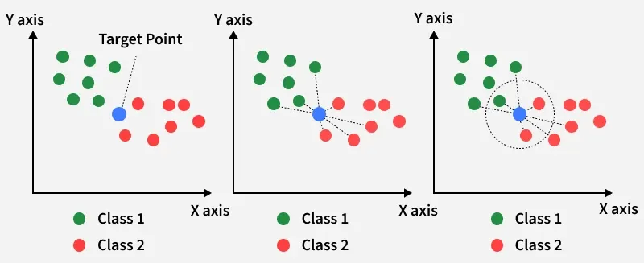
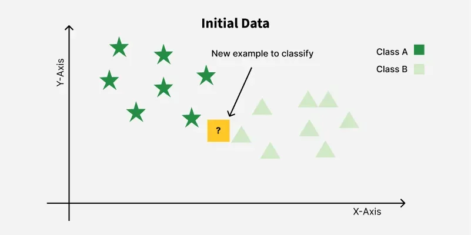
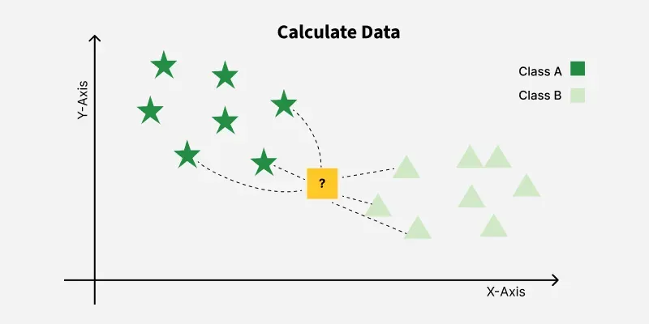
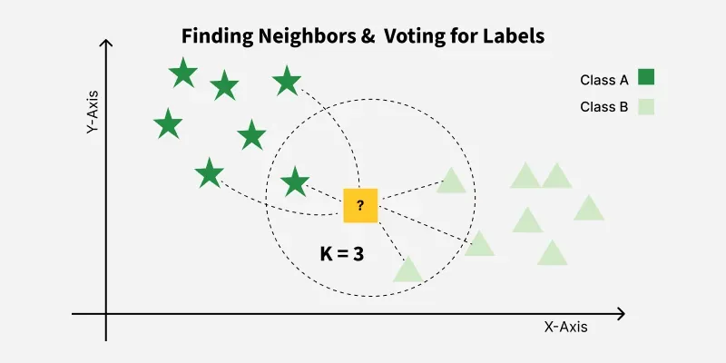

# Bài giảng: Thuật toán K-Nearest Neighbors (KNN trong Machine Learning)

**Cập nhật lần cuối:** 22 tháng 9 năm 2026  
**Học phần:** Phân tích dữ liệu với Python (DSAI1005)  
**Giảng viên:** TS. Vũ Đức Minh – Khoa Khoa học dữ liệu và Trí tuệ nhân tạo, Trường Công nghệ và Kinh tế số, Đại học Kinh tế Quốc dân (NEU)  
**Nguồn tài liệu tham khảo chính:** [GeeksforGeeks – K-Nearest Neighbors Algorithm](https://www.geeksforgeeks.org/machine-learning/k-nearest-neighbours/)

---

## Mục lục bài học

1. [Tổng quan về K-Nearest Neighbors (KNN) & Học lười (Lazy Learning)](#1-tổng-quan-về-k-nearest-neighbors-knn--học-lười-lazy-learning)
2. [Mục tiêu bài học (Learning Objectives)](#2-mục-tiêu-bài-học-learning-objectives)
3. [Nguyên lý Hoạt động Từng bước của KNN](#3-nguyên-lý-hoạt-động-từng-bước-của-knn)
   - 3.1. Bước 1: Khởi tạo và chọn giá trị $K$
   - 3.2. Bước 2: Đo lường khoảng cách tới toàn bộ tập dữ liệu
   - 3.3. Bước 3: Xác định $K$ láng giềng gần nhất
   - 3.4. Bước 4: Bầu chọn đa số (Classification) hoặc Lấy trung bình (Regression)
4. [Các Độ đo Khoảng cách Hình học Phổ biến](#4-các-độ-đo-khoảng-cách-hình-học-phổ-biến)
   - 4.1. Khoảng cách Euclidean ($L_2$ norm)
   - 4.2. Khoảng cách Manhattan ($L_1$ norm / Taxicab distance)
   - 4.3. Khoảng cách Minkowski ($L_p$ norm tổng quát)
   - 4.4. Khoảng cách Cosine & Khoảng cách Hamming
5. [Chiến lược Lựa chọn Siêu tham số $K$ & Đánh đổi Bias-Variance](#5-chiến-lược-lựa-chọn-siêu-tham-số-k--đánh-đổi-bias-variance)
   - 5.1. Ảnh hưởng của $K$ nhỏ: Nguy cơ Overfitting và nhạy cảm ngoại lai
   - 5.2. Ảnh hưởng của $K$ lớn: Nguy cơ Underfitting và mất ranh giới cục bộ
   - 5.3. Quy tắc chọn số lẻ tránh hòa phiếu (Tie-breaking)
   - 5.4. Phương pháp Khuỷu tay (Elbow Method) và K-Fold Cross-Validation
6. [Kỹ thuật Trọng số theo Khoảng cách (Distance-Weighted KNN)](#6-kỹ-thuật-trọng-số-theo-khoảng-cách-distance-weighted-knn)
7. [Lời nguyền Số chiều & Các Cấu trúc Dữ liệu Tối ưu (KD-Tree, Ball-Tree)](#7-lời-nguyền-số-chiều--các-cấu-trúc-dữ-liệu-tối-ưu-kd-tree-ball-tree)
8. [So sánh Toàn diện: KNN vs Logistic Regression vs Decision Tree vs SVM](#8-so-sánh-toàn-diện-knn-vs-logistic-regression-vs-decision-tree-vs-svm)
9. [Ưu điểm, Thách thức & Ứng dụng Thực tế](#9-ưu-điểm-thách-thức--ứng-dụng-thực-tế)
10. [Thực hành Lập trình Python](#10-thực-hành-lập-trình-python)
    - 10.1. Tự xây dựng thuật toán KNN từ đầu (From Scratch với NumPy & Counter)
    - 10.2. Ứng dụng phân loại với Scikit-Learn `KNeighborsClassifier`
    - 10.3. Vai trò sống còn của Chuẩn hóa thang đo (`StandardScaler`)
    - 10.4. Khảo sát đường cong sai số và tối ưu hóa $K$ bằng Cross-Validation
11. [Tổng kết & Bộ câu hỏi ôn tập củng cố kiến thức](#11-tổng-kết--bộ-câu-hỏi-ôn-tập-củng-cố-kiến-thức)
12. [Tài liệu tham khảo](#12-tài-liệu-tham-khảo)

---

## 1. Tổng quan về K-Nearest Neighbors (KNN) & Học lười (Lazy Learning)

Trong bức tranh toàn cảnh của Machine Learning, **K-Nearest Neighbors (KNN - $K$ láng giềng gần nhất)** là một trong những giải thuật trực quan, tự nhiên và dễ tiếp cận nhất. Giải thuật này vận hành dựa trên một triết lý đời sống rất đỗi quen thuộc:

> *"Gần mực thì đen, gần đèn thì rạng"* (Birds of a feather flock together).  
> Nếu bạn muốn biết một người có xu hướng chi tiêu như thế nào, hãy quan sát $K$ người bạn thân cận nhất xung quanh họ. Một điểm dữ liệu mới sẽ mang đặc tính tương đồng với các điểm láng giềng nằm sát nó nhất trong không gian đặc trưng.

<p align="center">
  
</p>

### Hai đặc trưng phân loại cơ bản của KNN:
1. **Phi tham số (Non-parametric):** KNN không áp đặt bất kỳ một giả định định sẵn nào về dạng hàm phân phối xác suất của dữ liệu (khác hoàn toàn với Linear Regression hay Logistic Regression vốn giả định quan hệ tuyến tính giữa các biến). Điều này giúp KNN cực kỳ linh hoạt trước các tập dữ liệu có ranh giới quyết định bất định hoặc phức tạp.
2. **Học lười (Lazy Learner / Instance-based Learning):** 
   - Trong giai đoạn huấn luyện (Training Phase), KNN **không học bất kỳ một tập trọng số $w$ nào**. Nó chỉ đơn thuần nạp và lưu trữ toàn bộ tập dữ liệu huấn luyện vào bộ nhớ RAM.
   - Toàn bộ công việc tính toán nặng nhọc (đo khoảng cách, sắp xếp, bình chọn) bị trì hoãn cho đến thời điểm có một mẫu kiểm tra mới xuất hiện (Inference / Testing Phase). Vì vậy, KNN có thời gian huấn luyện gần như bằng 0 ($O(1)$), nhưng thời gian dự báo lại rất chậm và tốn tài nguyên ($O(N \cdot p)$).

---

## 2. Mục tiêu bài học (Learning Objectives)

Sau khi hoàn thành bài học này, sinh viên có khả năng:

1. **Hiểu sâu nguyên lý vận hành:** Giải thích bản chất của phương pháp học dựa trên cá thể (Instance-based), cơ chế bỏ phiếu đa số cho phân loại (Majority Voting) và lấy trung bình cho hồi quy (Averaging).
2. **Làm chủ các độ đo khoảng cách:** Tính toán chính xác khoảng cách **Euclidean**, **Manhattan**, **Minkowski**, **Cosine**, và **Hamming**; hiểu rõ ngữ cảnh ứng dụng của từng độ đo.
3. **Phân tích đánh đổi Bias-Variance qua siêu tham số $K$:** Đánh giá rủi ro Overfitting khi $K$ quá nhỏ ($K=1$) và Underfitting khi $K$ quá lớn; áp dụng thành thạo kỹ thuật K-Fold Cross-Validation và Elbow Method để dò tìm $K$ tối ưu.
4. **Hiểu rõ Lời nguyền Số chiều (Curse of Dimensionality):** Giải thích tại sao khái niệm khoảng cách bị suy thoái khi số lượng chiều $p$ tăng cao, và sự cần thiết của các cấu trúc cây tìm kiếm không gian như **KD-Tree** và **Ball-Tree**.
5. **Thành thạo lập trình Python:** Tự cài đặt thuật toán KNN thuần túy từ đầu bằng NumPy, sử dụng thành thạo lớp `KNeighborsClassifier` và `KNeighborsRegressor` trong Scikit-Learn, và nắm vững tầm quan trọng sống còn của chuẩn hóa dữ liệu (`StandardScaler`).

---

## 3. Nguyên lý Hoạt động Từng bước của KNN

Quy trình suy luận của giải thuật KNN diễn ra qua 4 bước chuẩn mực:

<p align="center">
  
</p>

### 3.1. Bước 1: Khởi tạo và chọn giá trị $K$
- Xác định số lượng láng giềng $K$ cần khảo sát (ví dụ: $K = 3, 5, 7$).
- Giá trị $K$ là một **siêu tham số (Hyperparameter)** do người phân tích thiết lập trước khi chạy mô hình.

### 3.2. Bước 2: Đo lường khoảng cách tới toàn bộ tập dữ liệu
Khi có một điểm dữ liệu mới $x_{\text{test}}$, thuật toán duyệt qua toàn bộ $N$ điểm dữ liệu có trong tập huấn luyện và tính khoảng cách hình học giữa $x_{\text{test}}$ với từng điểm $x_i$:

<p align="center">
  
</p>

### 3.3. Bước 3: Xác định $K$ láng giềng gần nhất
- Sắp xếp danh sách $N$ khoảng cách vừa tính theo thứ tự tăng dần.
- Trích xuất ra $K$ điểm dữ liệu có khoảng cách ngắn nhất tới điểm truy vấn. Tập hợp này được gọi là tập láng giềng gần nhất $\mathcal{N}_K(x_{\text{test}})$.

### 3.4. Bước 4: Bầu chọn đa số (Classification) hoặc Lấy trung bình (Regression)

<p align="center">
  
</p>

- **Bài toán Phân loại (Classification):** Mỗi láng giềng trong $\mathcal{N}_K$ sẽ bỏ một phiếu bầu cho lớp của mình. Lớp nào giành được số phiếu đa số (Majority Vote) sẽ là nhãn dự báo:
  $$\hat{y} = \arg\max_{c \in \mathcal{C}} \sum_{i \in \mathcal{N}_K(x)} \mathbb{I}(y_i = c)$$
- **Bài toán Hồi quy (Regression):** Giá trị dự báo liên tục là giá trị trung bình cộng của các láng giềng:
  $$\hat{y} = \frac{1}{K} \sum_{i \in \mathcal{N}_K(x)} y_i$$

---

## 4. Các Độ đo Khoảng cách Hình học Phổ biến

Chất lượng dự báo của KNN phụ thuộc hoàn toàn vào cách chúng ta định nghĩa "sự tương đồng" hay khoảng cách giữa hai điểm dữ liệu $x = (x_1, \dots, x_p)$ và $z = (z_1, \dots, z_p)$.

### 4.1. Khoảng cách Euclidean ($L_2$ norm)
Đây là khoảng cách đường chim bay theo đường thẳng quen thuộc nhất trong hình học phẳng:
$$d_{\text{Euclidean}}(x, z) = \|x - z\|_2 = \sqrt{\sum_{j=1}^{p} (x_j - z_j)^2}$$
- **Ứng dụng:** Thích hợp nhất cho dữ liệu liên tục có thang đo tương đồng, phản ánh khoảng cách tự nhiên trong vật lý.

### 4.2. Khoảng cách Manhattan ($L_1$ norm / Taxicab distance)
Đo khoảng cách di chuyển dọc theo các trục tọa độ vuông góc (giống như quãng đường taxi chạy theo mạng lưới đường bàn cờ ở Manhattan, New York):
$$d_{\text{Manhattan}}(x, z) = \|x - z\|_1 = \sum_{j=1}^{p} |x_j - z_j|$$
- **Ứng dụng:** Thích hợp khi dữ liệu chứa nhiều giá trị ngoại lai (outliers) hoặc khi các trục tọa độ là các đặc trưng rời rạc/lưới. Manhattan ít bị chi phối bởi các sai số cực đoan hơn Euclidean (do không có phép bình phương).

### 4.3. Khoảng cách Minkowski ($L_p$ norm tổng quát)
Là họ khoảng cách tổng quát hóa bao trùm cả Euclidean và Manhattan:
$$d_{\text{Minkowski}}(x, z) = \|x - z\|_p = \left(\sum_{j=1}^{p} |x_j - z_j|^p\right)^{\frac{1}{p}}$$
- Khi $p = 1$: Trở thành khoảng cách Manhattan.
- Khi $p = 2$: Trở thành khoảng cách Euclidean.
- Khi $p \to \infty$: Trở thành khoảng cách Chebyshev (khoảng cách lớn nhất trên từng tọa độ: $\max_j |x_j - z_j|$).

### 4.4. Khoảng cách Cosine & Khoảng cách Hamming
- **Khoảng cách Cosine (Cosine Distance):**
  $$d_{\text{Cosine}}(x, z) = 1 - \frac{x \cdot z}{\|x\|_2 \|z\|_2} = 1 - \cos(\theta)$$
  Đo góc lệch giữa hai vector thay vì độ lớn tuyệt đối. Cực kỳ phổ biến trong **xử lý ngôn ngữ tự nhiên (NLP)**, phân tích văn bản (TF-IDF), và hệ thống gợi ý (Recommendation Systems).
- **Khoảng cách Hamming (Hamming Distance):**
  $$d_{\text{Hamming}}(x, z) = \sum_{j=1}^{p} \mathbb{I}(x_j \ne z_j)$$
  Đếm số lượng vị trí khác biệt giữa hai chuỗi nhị phân hoặc chuỗi danh mục.

---

## 5. Chiến lược Lựa chọn Siêu tham số $K$ & Đánh đổi Bias-Variance

Giá trị của $K$ đóng vai trò quyết định cấu trúc và độ phức tạp của mô hình KNN:

```
                  K RẤT NHỎ (K = 1)                 K VỪA PHẢI (K = 5 - 15)                K RẤT LỚN (K -> N)
Độ phức tạp:      Rất phức tạp, uốn lượn            Cân bằng tối ưu                       Cực kỳ đơn giản, phẳng
Độ chệch (Bias):  Rất thấp (Low Bias)               Vừa phải                              Rất cao (High Bias)
Phương sai (Var): Rất cao (High Variance)           Vừa phải                              Rất thấp (Low Variance)
Rủi ro:           QUÁ KHỚP (OVERFITTING)            CÂN BẰNG TỐT NHẤT                     THIẾU KHỚP (UNDERFITTING)
```

### 5.1. Ảnh hưởng của $K$ nhỏ ($K = 1$)
- Khi $K = 1$, mỗi điểm dữ liệu mới chỉ nghe theo đúng một điểm láng giềng sát sườn nó nhất.
- Độ chính xác trên tập Train luôn bằng $100\%$ (vì láng giềng gần nhất của một điểm train chính là chính nó).
- Tuy nhiên, ranh giới phân tách bị xé nhỏ, uốn lượn quanh từng điểm nhiễu ngoại lai. Mô hình có **phương sai cực cao (High Variance)** và rất dễ bị Overfitting.

### 5.2. Ảnh hưởng của $K$ lớn ($K \to N$)
- Nếu đặt $K$ bằng tổng số mẫu của tập dữ liệu ($K = N$), mọi điểm dữ liệu đều tham khảo toàn bộ tập huấn luyện.
- Khi đó, mô hình sẽ luôn luôn dự báo nhãn lớp chiếm đa số trong tập dữ liệu (Majority Class), bất kể điểm truy vấn nằm ở đâu!
- Mô hình trở nên quá đơn điệu, mất khả năng nắm bắt ranh giới cục bộ, dẫn đến **thiếu khớp (Underfitting)** nghiêm trọng.

### 5.3. Quy tắc chọn số lẻ tránh hòa phiếu (Tie-breaking)
Trong bài toán phân loại nhị phân ($2$ lớp), **luôn luôn chọn $K$ là một số nguyên lẻ** ($K = 3, 5, 7, 9, \dots$). Điều này đảm bảo về mặt số học rằng số phiếu bầu của hai lớp sẽ không bao giờ bằng nhau (không xảy ra tình huống hòa phiếu $50-50$).

### 5.4. Phương pháp Khuỷu tay (Elbow Method) và K-Fold Cross-Validation
Để tìm ra giá trị $K$ tối ưu một cách khoa học:
1. Thử nghiệm một dải các giá trị $K$ từ $1$ đến $30$.
2. Áp dụng kỹ thuật kiểm định chéo $5$-Fold hoặc $10$-Fold Cross-Validation trên tập Train.
3. Vẽ đồ thị biểu diễn sai số kiểm định (Validation Error Rate) theo từng giá trị $K$.
4. Điểm có sai số thấp nhất hoặc điểm uốn tạo thành "khuỷu tay" (Elbow Point) chính là giá trị $K$ lý tưởng cần chọn.

---

## 6. Kỹ thuật Trọng số theo Khoảng cách (Distance-Weighted KNN)

Trong thuật toán KNN truyền thống (Uniform Weighting), mọi láng giềng trong top $K$ đều có tiếng nói ngang nhau, bất kể điểm đó nằm ngay sát cạnh điểm kiểm tra hay nằm tít ngoài rìa bán kính $K$.

Để khắc phục nhược điểm này, ta áp dụng kỹ thuật **KNN có trọng số (Distance-Weighted KNN)**:
- Mỗi láng giềng $x_i$ được gán một trọng số tỷ lệ nghịch với khoảng cách của nó tới điểm truy vấn $x$:
  $$w_i = \frac{1}{d(x, x_i)} \quad \text{hoặc} \quad w_i = \frac{1}{d(x, x_i)^2 + \epsilon}$$
- Khi đó, công thức bỏ phiếu phân loại trở thành:
  $$\hat{y} = \arg\max_{c \in \mathcal{C}} \sum_{i \in \mathcal{N}_K(x)} w_i \cdot \mathbb{I}(y_i = c)$$
- Và công thức hồi quy trở thành trung bình có trọng số (Weighted Average):
  $$\hat{y} = \frac{\sum_{i \in \mathcal{N}_K(x)} w_i y_i}{\sum_{i \in \mathcal{N}_K(x)} w_i}$$

Điểm láng giềng càng gần sẽ có trọng số áp đảo, giúp giảm thiểu sai lệch khi phân bố mật độ dữ liệu không đồng đều.

---

## 7. Lời nguyền Số chiều & Các Cấu trúc Dữ liệu Tối ưu (KD-Tree, Ball-Tree)

### 7.1. Lời nguyền Số chiều (Curse of Dimensionality)
Khi số lượng chiều đặc trưng $p$ tăng cao (ví dụ: $p > 50$ hoặc hàng trăm đặc trưng):
- Thể tích của không gian tăng theo cấp số nhân ($V \propto r^p$).
- Dữ liệu trở nên cực kỳ thưa thớt (sparse), các điểm dữ liệu dường như đều nằm cách xa nhau và khoảng cách giữa điểm gần nhất và điểm xa nhất xấp xỉ bằng nhau:
  $$\lim_{p \to \infty} \frac{d_{\max} - d_{\min}}{d_{\min}} = 0$$
- Khái niệm "láng giềng gần nhất" mất đi ý nghĩa phân biệt hình học, khiến độ chính xác của KNN sụt giảm nghiêm trọng.

> [!TIP]
> **Giải pháp khắc phục:** Luôn thực hiện giảm chiều dữ liệu trước khi chạy KNN trên dữ liệu nhiều chiều bằng các kỹ thuật như **PCA (Principal Component Analysis)**, t-SNE, hoặc chọn lọc đặc trưng (Feature Selection).

### 7.2. Cấu trúc Cây tìm kiếm không gian (KD-Tree & Ball-Tree)
Nếu sử dụng phương pháp duyệt vét cạn (Brute-Force Search), mỗi lần dự báo một điểm mới ta phải tính khoảng cách với toàn bộ $N$ điểm huấn luyện, với độ phức tạp $O(N \cdot p)$. Khi $N = 1,000,000$, hệ thống sẽ bị nghẽn hoàn toàn.

Scikit-Learn hỗ trợ hai cấu trúc chỉ mục cây không gian giúp tăng tốc tìm kiếm láng giềng:
1. **KD-Tree (K-dimensional Tree):** Phân hoạch không gian thành các siêu hộp vuông góc với các trục tọa độ. Giảm thời gian tìm kiếm xuống $O(\log N)$ khi số chiều $p$ nhỏ ($p < 20$).
2. **Ball-Tree:** Phân hoạch dữ liệu thành các hình cầu lồng nhau (Hyper-spheres). Hiệu quả vượt trội hơn KD-Tree khi số chiều $p$ tương đối lớn.

---

## 8. So sánh Toàn diện: KNN vs Logistic Regression vs Decision Tree vs SVM

| Tiêu chí | K-Nearest Neighbors (KNN) | Logistic Regression | Decision Tree | Support Vector Machine (SVM) |
| :--- | :--- | :--- | :--- | :--- |
| **Loại hình học** | **Instance-based / Lazy** | Parametric (Tuyến tính) | Non-parametric (Quy tắc) | Linear / Kernel-based |
| **Thời gian Train** | **$O(1)$ (Cực nhanh)** | Nhanh ($O(N \cdot p)$) | Nhanh ($O(p \cdot N \log N)$) | Chậm ($O(N^2)$ đến $O(N^3)$) |
| **Thời gian Predict** | **$O(N \cdot p)$ (Rất chậm)** | **$O(p)$ (Cực nhanh)** | **$O(\text{depth})$ (Cực nhanh)** | $O(N_{\text{SV}} \cdot p)$ |
| **Yêu cầu Chuẩn hóa** | **BẮT BUỘC TUYỆT ĐỐI** | Khuyến nghị mạnh | **KHÔNG CẦN** | **BẮT BUỘC TUYỆT ĐỐI** |
| **Tính diễn giải** | Dễ giải thích trực quan | Cao (qua hệ số Odd Ratios) | Rất cao (Luật if-else) | Kém khi dùng RBF Kernel |
| **Bộ nhớ sử dụng** | **Rất lớn (Lưu cả dataset)** | Rất nhỏ (Chỉ lưu vector $w$) | Nhỏ (Lưu cấu trúc cây) | Vừa phải (Chỉ lưu SVs) |

---

## 9. Ưu điểm, Thách thức & Ứng dụng Thực tế

### 9.1. Ưu điểm nổi bật
- **Đơn giản, trực quan:** Dễ hiểu bản chất hoạt động, dễ cài đặt từ đầu mà không cần kiến thức giải tích phức tạp.
- **Không có bước huấn luyện tường minh:** Thích hợp cho các hệ thống cần cập nhật dữ liệu mới liên tục theo thời gian thực (chỉ cần thêm mẫu mới vào cơ sở dữ liệu).
- **Đa năng:** Xử lý linh hoạt cả bài toán Phân loại (Classification) lẫn Hồi quy (Regression).

### 9.2. Thách thức cốt lõi
- **Chi phí dự báo cao:** Tốn nhiều thời gian và bộ nhớ RAM khi tập dữ liệu lớn.
- **Rất nhạy cảm với thang đo đặc trưng:** Nếu không chuẩn hóa, một biến có thang đo lớn (như Lương: 10,000,000 - 50,000,000) sẽ hoàn toàn chi phối khoảng cách so với biến Tuổi (20 - 60).
- **Suy giảm hiệu năng trên dữ liệu nhiều chiều:** Dễ rơi vào bẫy của Lời nguyền Số chiều.

### 9.3. Ứng dụng Thực tế
1. **Hệ thống Gợi ý (Recommendation Systems):** Gợi ý phim (Netflix) hoặc bài hát (Spotify) dựa trên việc tìm kiếm $K$ người dùng có hồ sơ sở thích tương đồng nhất (Collaborative Filtering).
2. **Nhận dạng Chữ viết tay & Thị giác Máy tính:** Nhận diện ký tự quang học (OCR) trên tập dữ liệu MNIST.
3. **Phân khúc Khách hàng (Customer Profiling):** Xếp nhóm khách hàng mới vào phân khúc chi tiêu dựa trên hành vi của các khách hàng cũ tương tự.
4. **Điền giá trị thiếu (KNN Imputation):** Ước lượng giá trị bị khuyết trong bảng dữ liệu bằng giá trị trung bình của $K$ dòng dữ liệu tương đồng nhất.

---

## 10. Thực hành Lập trình Python

### 10.1. Tự xây dựng thuật toán KNN từ đầu (From Scratch với NumPy & Counter)

Dưới đây là phần cài đặt thuật toán KNN thuần túy từ đầu bằng thư viện `numpy` và `collections.Counter` dựa trên nội dung nguồn từ GeeksforGeeks:

```python
import numpy as np
from collections import Counter

# 1. Định nghĩa hàm tính khoảng cách Euclidean
def euclidean_distance(point1, point2):
    """Tính khoảng cách Euclidean L2 giữa hai vector đặc trưng"""
    return np.sqrt(np.sum((np.array(point1) - np.array(point2)) ** 2))

# 2. Định nghĩa hàm dự báo KNN
def knn_predict(training_data, training_labels, test_point, k=3):
    """
    Dự báo nhãn cho test_point bằng thuật toán KNN
    """
    distances = []
    
    # Bước 1: Tính khoảng cách tới mọi điểm dữ liệu huấn luyện
    for i in range(len(training_data)):
        dist = euclidean_distance(test_point, training_data[i])
        distances.append((dist, training_labels[i]))
    
    # Bước 2: Sắp xếp danh sách khoảng cách tăng dần
    distances.sort(key=lambda x: x[0])
    
    # Bước 3: Lấy nhãn của K láng giềng gần nhất
    k_nearest_labels = [label for _, label in distances[:k]]
    
    # Bước 4: Bầu chọn đa số (Majority Voting)
    most_common = Counter(k_nearest_labels).most_common(1)
    predicted_label = most_common[0][0]
    
    return predicted_label, k_nearest_labels

# 3. Kiểm thử với dữ liệu mẫu từ GeeksforGeeks
training_data = [[1, 2], [2, 3], [3, 4], [6, 7], [7, 8]]
training_labels = ['A', 'A', 'A', 'B', 'B']
test_point = [4, 5]
k = 3

pred, neighbors = knn_predict(training_data, training_labels, test_point, k=k)
print(f"Điểm kiểm tra: {test_point}")
print(f"3 láng giềng gần nhất: {neighbors}")
print(f"Nhãn dự báo kết quả: '{pred}'")
```

**Kết quả chạy mã:**
```
Điểm kiểm tra: [4, 5]
3 láng giềng gần nhất: ['A', 'A', 'B']
Nhãn dự báo kết quả: 'A'
```

### 10.2. Ứng dụng phân loại với Scikit-Learn `KNeighborsClassifier`

Chúng ta áp dụng lớp `sklearn.neighbors.KNeighborsClassifier` trên tập dữ liệu hoa Iris kinh điển:

```python
from sklearn.datasets import load_iris
from sklearn.model_selection import train_test_split
from sklearn.preprocessing import StandardScaler
from sklearn.neighbors import KNeighborsClassifier
from sklearn.metrics import classification_report, confusion_matrix, accuracy_score

# Tải tập dữ liệu Iris
iris = load_iris()
X = iris.data
y = iris.target

# Phân tách tập Train / Test (tỉ lệ 75% - 25%)
X_train, X_test, y_train, y_test = train_test_split(
    X, y, test_size=0.25, random_state=42, stratify=y
)

# Chuẩn hóa dữ liệu bằng StandardScaler
scaler = StandardScaler()
X_train_scaled = scaler.fit_transform(X_train)
X_test_scaled = scaler.transform(X_test)

# Huấn luyện mô hình KNN với K=5 và trọng số khoảng cách
knn = KNeighborsClassifier(n_neighbors=5, weights='distance', metric='minkowski', p=2)
knn.fit(X_train_scaled, y_train)

# Dự báo và đánh giá
y_pred = knn.predict(X_test_scaled)
print(f"Độ chính xác kiểm tra: {accuracy_score(y_test, y_pred) * 100:.2f}%")
print("\n=== BÁO CÁO PHÂN LOẠI ===")
print(classification_report(y_test, y_pred, target_names=iris.target_names))
```

### 10.3. Vai trò sống còn của Chuẩn hóa thang đo (`StandardScaler`)

Đoạn mã sau chứng minh thực nghiệm vì sao **không bao giờ được bỏ qua bước chuẩn hóa** trước khi chạy KNN:

```python
# Huấn luyện KNN khi KHÔNG chuẩn hóa dữ liệu
knn_no_scale = KNeighborsClassifier(n_neighbors=5)
knn_no_scale.fit(X_train, y_train)
acc_no_scale = knn_no_scale.score(X_test, y_test)

# Huấn luyện KNN khi CÓ chuẩn hóa dữ liệu
knn_scaled = KNeighborsClassifier(n_neighbors=5)
knn_scaled.fit(X_train_scaled, y_train)
acc_scaled = knn_scaled.score(X_test_scaled, y_test)

print(f"Độ chính xác KHÔNG chuẩn hóa: {acc_no_scale * 100:.2f}%")
print(f"Độ chính xác CÓ chuẩn hóa:    {acc_scaled * 100:.2f}%")
```

### 10.4. Khảo sát đường cong sai số và tối ưu hóa $K$ bằng Cross-Validation

```python
import matplotlib.pyplot as plt
from sklearn.model_selection import cross_val_score

k_range = range(1, 31)
cv_scores = []

# Đánh giá 10-Fold Cross Validation cho từng giá trị K
for k in k_range:
    model = KNeighborsClassifier(n_neighbors=k)
    scores = cross_val_score(model, X_train_scaled, y_train, cv=10, scoring='accuracy')
    cv_scores.append(scores.mean())

# Chuyển đổi thành tỉ lệ sai số (Error Rate)
error_rate = [1 - s for s in cv_scores]
optimal_k = k_range[np.argmin(error_rate)]

# Trực quan hóa Elbow Curve
plt.figure(figsize=(10, 6))
plt.plot(k_range, error_rate, color='blue', linestyle='dashed', marker='o',
         markerfacecolor='red', markersize=8)
plt.title('Khảo sát Tỉ lệ Sai số Kiểm định theo Giá trị K (Elbow Method)', fontsize=14)
plt.xlabel('Giá trị K (Số lượng láng giềng)', fontsize=12)
plt.ylabel('Tỉ lệ Sai số Kiểm định (Validation Error)', fontsize=12)
plt.axvline(x=optimal_k, color='green', linestyle='--', label=f'K tối ưu nhất = {optimal_k}')
plt.grid(True, linestyle='--', alpha=0.6)
plt.legend(fontsize=11)
plt.show()

print(f"Giá trị K tối ưu nhất được xác định là: K = {optimal_k}")
```

---

## 11. Tổng kết & Bộ câu hỏi ôn tập củng cố kiến thức

### Bảng tóm tắt nội dung trọng tâm

| Khái niệm | Định nghĩa & Ý nghĩa |
| :--- | :--- |
| **Instance-based Learning** | Mô hình không học tham số cố định, ghi nhớ toàn bộ tập dữ liệu và chỉ tính toán khi có điểm kiểm tra. |
| **Lazy Learner** | Thời gian huấn luyện $O(1)$, nhưng thời gian dự báo $O(N \cdot p)$ tốn kém tài nguyên. |
| **Độ đo Khoảng cách** | Euclidean ($L_2$, thẳng), Manhattan ($L_1$, bàn cờ), Minkowski ($L_p$, tổng quát), Cosine (góc vector NLP). |
| **Siêu tham số $K$** | $K$ nhỏ gây Overfitting (phương sai cao), $K$ lớn gây Underfitting (độ chệch cao). Nên chọn số lẻ để tránh hòa phiếu. |
| **StandardScaler** | Bước bắt buộc tuyệt đối để loại bỏ sự thiên lệch thang đo giữa các trục tọa độ. |
| **Curse of Dimensionality** | Khoảng cách bị đồng nhất hóa trong không gian số chiều lớn, cần giảm chiều qua PCA trước khi áp dụng. |

---

### Bộ 5 câu hỏi trắc nghiệm & tự luận chuyên sâu

#### Câu 1: Tại sao thuật toán K-Nearest Neighbors (KNN) được định danh là một thuật toán "Học lười" (Lazy Learner)?
- **A.** Vì thuật toán sử dụng rất ít bộ nhớ RAM trong quá trình hoạt động.
- **B.** Vì mô hình không thực hiện bất kỳ phép ước lượng tham số nào trong pha huấn luyện, mà trì hoãn toàn bộ tính toán đến pha dự báo.
- **C.** Vì thuật toán chỉ chọn lọc một tập mẫu nhỏ ngẫu nhiên thay vì sử dụng toàn bộ dữ liệu.
- **D.** Vì độ chính xác của mô hình thường thấp hơn các giải thuật khác.
- *(Gợi ý đáp án: **B**. KNN chỉ nạp dữ liệu vào bộ nhớ và chỉ tính khoảng cách khi có điểm kiểm tra mới).*

#### Câu 2: Trong bài toán phân loại nhị phân, điều gì sẽ xảy ra nếu một kỹ sư khoa học dữ liệu chọn $K = 1$?
- **A.** Mô hình sẽ bị thiếu khớp (Underfitting) và có độ chệch (Bias) rất cao.
- **B.** Sai số trên tập huấn luyện chắc chắn bằng $0$, nhưng mô hình có phương sai (Variance) cực cao và rất nhạy cảm với ngoại lai.
- **C.** Mô hình sẽ dự báo tất cả các điểm kiểm tra về lớp chiếm đa số trong tập dữ liệu.
- **D.** Không thể dự báo được vì số lượng láng giềng phải tối thiểu từ 3 trở lên.
- *(Gợi ý đáp án: **B**. Với $K=1$, mô hình khớp chính xác 100% tập huấn luyện nhưng ranh giới phân tách bị phân mảnh, dẫn đến Overfitting).*

#### Câu 3: Khoảng cách Minkowski trở thành khoảng cách Manhattan và khoảng cách Euclidean khi tham số $p$ lần lượt nhận các giá trị nào?
- **A.** $p = 0$ và $p = 1$.
- **B.** $p = 1$ và $p = 2$.
- **C.** $p = 2$ và $p = \infty$.
- **D.** $p = 0.5$ và $p = 1$.
- *(Gợi ý đáp án: **B**. Công thức Minkowski với $p=1$ là $\sum |x_j - z_j|$ (Manhattan) và với $p=2$ là $\sqrt{\sum (x_j - z_j)^2}$ (Euclidean)).*

#### Câu 4: Vì sao việc áp dụng phép chuẩn hóa thang đo đặc trưng (Feature Scaling như `StandardScaler`) lại đóng vai trò sống còn trong thuật toán KNN?
- *(Gợi ý trả lời: Vì KNN đo lường mức độ tương đồng hoàn toàn dựa trên khoảng cách hình học giữa các vector đặc trưng. Nếu các biến có miền giá trị chênh lệch lớn (ví dụ: Thu nhập hàng chục triệu VNĐ so với Số năm kinh nghiệm từ 1-20), biến thu nhập sẽ áp đảo hoàn toàn giá trị khoảng cách, khiến các biến còn lại mất đi tiếng nói).*

#### Câu 5: Hiện tượng "Lời nguyền số chiều" (Curse of Dimensionality) ảnh hưởng tiêu cực như thế nào đến giải thuật KNN khi số lượng đặc trưng $p$ rất lớn?
- *(Gợi ý trả lời: Khi số chiều $p$ tăng cao, thể tích không gian bùng nổ khiến dữ liệu trở nên cực kỳ thưa thớt. Khoảng cách giữa điểm dữ liệu gần nhất và xa nhất bị kéo lại gần bằng nhau ($d_{\max} \approx d_{\min}$), khiến khái niệm "gần nhất" mất đi tính phân biệt. Ngoài ra, độ phức tạp tính toán tăng theo cấp số nhân khiến thời gian dự báo bị chậm nghiêm trọng).*

---

## 12. Tài liệu tham khảo

1. **GeeksforGeeks:** [K-Nearest Neighbors Algorithm](https://www.geeksforgeeks.org/machine-learning/k-nearest-neighbours/)
2. **Cover, T., & Hart, P. (1967):** *Nearest neighbor pattern classification*. IEEE Transactions on Information Theory, 13(1), 21-27.
3. **Hastie, T., Tibshirani, R., & Friedman, J. (2009):** *The Elements of Statistical Learning*. Springer (Chapter 13: Prototype Methods and Nearest-Neighbors).
4. **Scikit-Learn Documentation:** [Nearest Neighbors (`sklearn.neighbors`)](https://scikit-learn.org/stable/modules/neighbors.html)
5. **Bishop, C. M. (2006):** *Pattern Recognition and Machine Learning*. Springer (Chapter 2: Nonparametric Methods).
