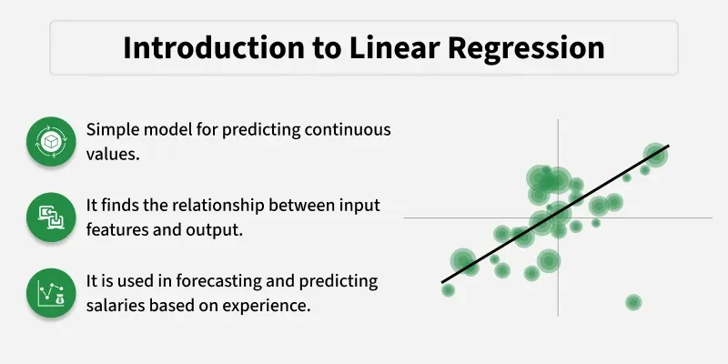
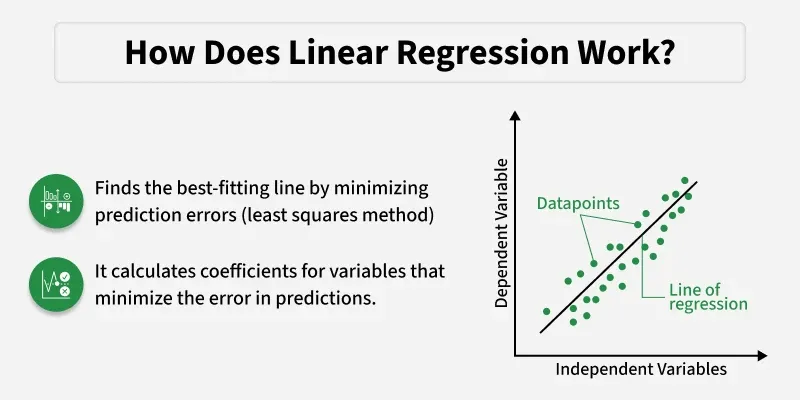
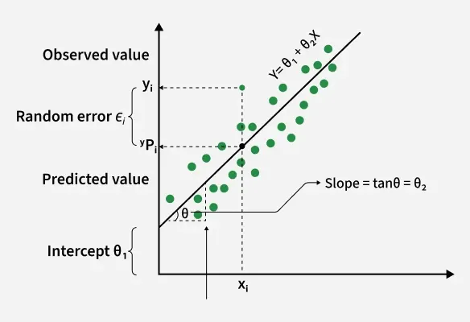
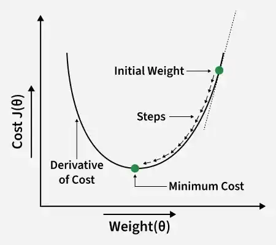
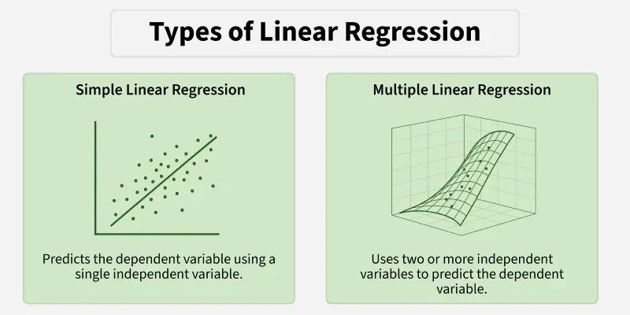
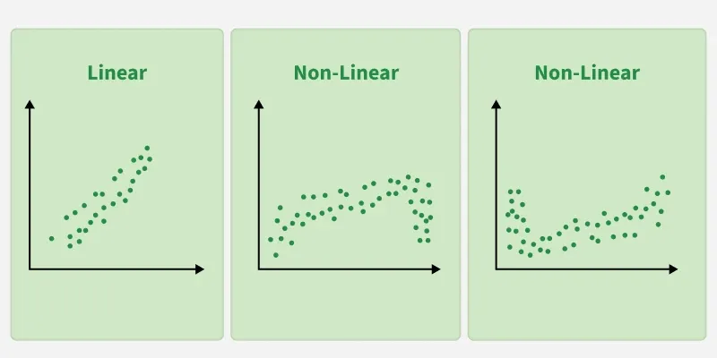
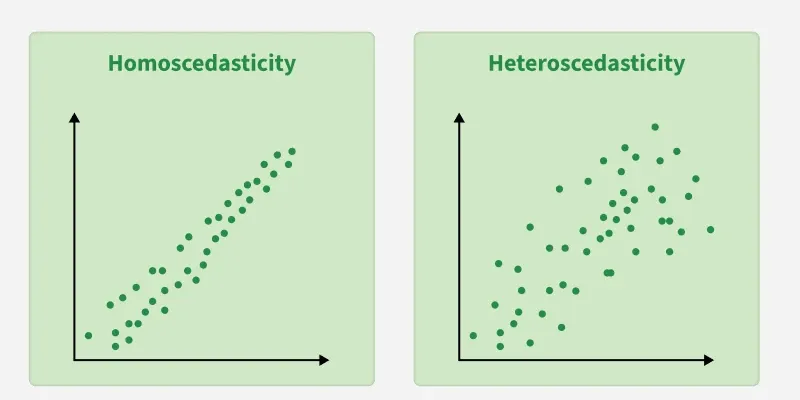
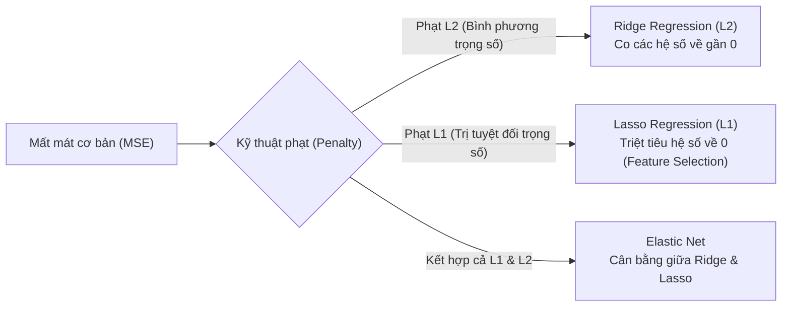
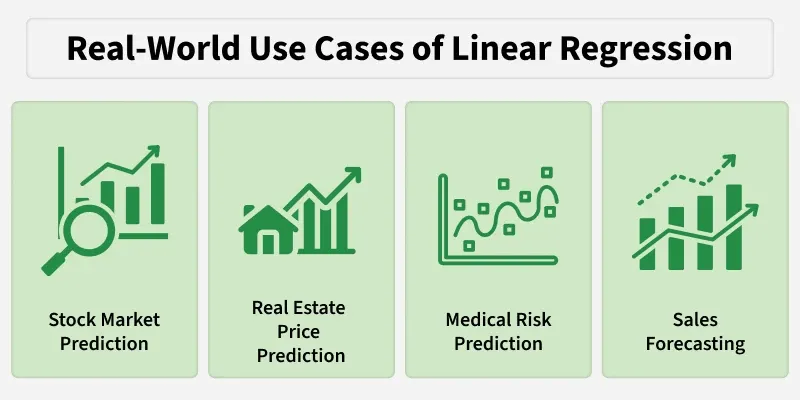
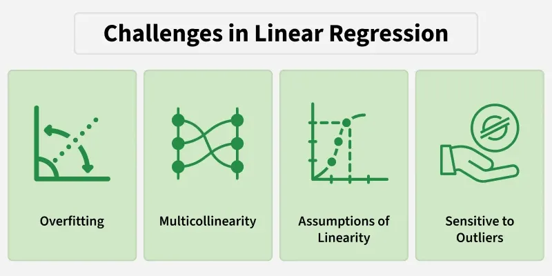

# Bài giảng: Linear Regression (Hồi quy tuyến tính trong Machine Learning)

**Cập nhật lần cuối:** 21 tháng 9 năm 2026  
**Học phần:** Phân tích dữ liệu với Python (DSAI1005)  
**Giảng viên:** TS. Vũ Đức Minh – Khoa Khoa học dữ liệu và Trí tuệ nhân tạo, Trường Công nghệ và Kinh tế số, Đại học Kinh tế Quốc dân (NEU)  
**Nguồn tài liệu tham khảo chính:** [GeeksforGeeks – Linear Regression in Machine Learning](http://www.geeksforgeeks.org/machine-learning/ml-linear-regression/)

---

## Mục lục bài học

1. [Tổng quan về Hồi quy tuyến tính](#1-tổng-quan-về-hồi-quy-tuyến-tính)
2. [Mục tiêu bài học (Learning Objectives)](#2-mục-tiêu-bài-học-learning-objectives)
3. [Đường hồi quy phù hợp nhất (Best-Fit Line) & Phương pháp Bình phương tối thiểu (OLS)](#3-đường-hồi-quy-phù-hợp-nhất-best-fit-line--phương-pháp-bình-phương-tối-thiểu-ols)
4. [Hàm Giả thuyết (Hypothesis) & Hàm Chi phí (Cost Function)](#4-hàm-giả-thuyết-hypothesis--hàm-chi-phí-cost-function)
5. [Thuật toán Tối ưu Gradient Descent (Hạ độ dốc)](#5-thuật-toán-tối-ưu-gradient-descent-hạ-độ-dốc)
6. [Các dạng Hồi quy tuyến tính: Đơn biến & Đa biến](#6-các-dạng-hồi-quy-tuyến-tính-đơn-biến--đa-biến)
   - 6.1. Simple Linear Regression (Hồi quy tuyến tính đơn biến)
   - 6.2. Multiple Linear Regression (Hồi quy tuyến tính đa biến)
7. [Các giả định nền tảng của Mô hình Hồi quy tuyến tính (Assumptions)](#7-các-giả-định-nền-tảng-của-mô-hình-hồi-quy-tuyến-tính-assumptions)
8. [Các thước đo Đánh giá Hiệu năng (Evaluation Metrics)](#8-các-thước-đo-đánh-giá-hiệu-năng-evaluation-metrics)
9. [Kỹ thuật Điều chuẩn chống Quá khớp (Regularization: Ridge, Lasso, Elastic Net)](#9-kỹ-thuật-điều-chuẩn-chống-quá-khớp-regularization-ridge-lasso-elastic-net)
10. [Ứng dụng Thực tế & Các Thách thức Thường gặp](#10-ứng-dụng-thực-tế--các-thách-thức-thường-gặp)
11. [Thực hành Python với Scikit-Learn](#11-thực-hành-python-với-scikit-learn)
12. [Tổng kết & Câu hỏi ôn tập củng cố kiến thức](#12-tổng-kết--câu-hỏi-ôn-tập-củng-cố-kiến-thức)
13. [Tài liệu tham khảo](#13-tài-liệu-tham-khảo)

---

## 1. Tổng quan về Hồi quy tuyến tính

Trong học máy có giám sát (Supervised Machine Learning), **Linear Regression (Hồi quy tuyến tính)** là thuật toán cơ bản, lâu đời và quan trọng bậc nhất dùng để giải quyết các bài toán **Hồi quy (Regression)** — tức dự báo một giá trị đầu ra định lượng liên tục dựa trên một hoặc nhiều biến đầu vào.

Mô hình thiết lập một mối quan hệ toán học dạng tuyến tính (đường thẳng hoặc siêu phẳng) giữa:
- **Biến phụ thuộc / Biến mục tiêu ($Y$ - Dependent / Target Variable):** Đại lượng số thực cần dự báo (ví dụ: giá nhà, mức lương, doanh thu, tốc độ gió).
- **Biến độc lập / Biến dự báo ($X$ - Independent / Predictor Variables / Features):** Các đặc trưng đầu vào dùng để giải thích và dự báo cho $Y$ (ví dụ: diện tích nhà, số năm kinh nghiệm, chi phí quảng cáo).

<p align="center">
  
</p>

Trong dạng đơn giản nhất (Hồi quy đơn biến), mối quan hệ giữa $X$ và $Y$ được mô hình hóa qua phương trình:

$$Y = \theta_0 + \theta_1 X + \epsilon$$

Trong đó:
- $\theta_0$ (hoặc ký hiệu là $b$ - Intercept): **Hệ số chặn**, đại diện cho giá trị kỳ vọng của $Y$ khi $X = 0$.
- $\theta_1$ (hoặc ký hiệu là $m$ / $w$ - Slope / Weight): **Hệ số góc** (độ dốc), phản ánh mức độ thay đổi của biến mục tiêu $Y$ khi biến độc lập $X$ tăng lên 1 đơn vị.
- $\epsilon$ (Error Term): Sai số ngẫu nhiên do các yếu tố chưa được quan sát hoặc đo lường trong thực tế.

---

## 2. Mục tiêu bài học (Learning Objectives)

Sau khi hoàn thành bài học này, sinh viên có khả năng:

1. **Hiểu bản chất toán học:** Nắm vững phương trình đường hồi quy tốt nhất (Best-Fit Line), khái niệm phần dư (Residuals) và nguyên lý tối ưu Bình phương tối thiểu (Ordinary Least Squares - OLS).
2. **Nắm vững cơ chế huấn luyện:** Trình bày được cấu trúc Hàm chi phí (Mean Squared Error) và cơ chế cập nhật tham số của thuật toán Hạ độ dốc (Gradient Descent).
3. **Phân biệt & Ứng dụng:** Làm chủ cả hai dạng bài toán: Hồi quy đơn biến (Simple Linear Regression) và Hồi quy đa biến (Multiple Linear Regression).
4. **Kiểm định giả định mô hình:** Nhận biết và kiểm tra 7 giả định cốt lõi (Linearity, Homoscedasticity, Normality, No Multicollinearity, v.v.) để đảm bảo tính chuẩn xác thống kê.
5. **Đo lường & Tối ưu:** Tính toán và diễn giải chuẩn xác các chỉ số hiệu năng ($MAE, MSE, RMSE, R^2, R^2_{\text{adj}}$) và áp dụng các kỹ thuật điều chuẩn (Ridge, Lasso, Elastic Net) để chống quá khớp (Overfitting).
6. **Thực hành thành thạo:** Lập trình trích xuất hệ số, vẽ đồ thị đường hồi quy và xây dựng pipeline dự báo hoàn chỉnh bằng Python và Scikit-Learn.

---

## 3. Đường hồi quy phù hợp nhất (Best-Fit Line) & Phương pháp Bình phương tối thiểu (OLS)

### 3.1. Phương trình Đường hồi quy Phù hợp nhất
Mục tiêu cốt lõi của hồi quy tuyến tính là tìm ra một đường thẳng (hoặc mặt phẳng) **"khớp nhất"** với các điểm dữ liệu phân tán trong không gian tọa độ.

<p align="center">
  
</p>

Đường thẳng hồi quy lý tưởng được biểu diễn dưới dạng:

$$\hat{y} = mx + b$$

Trong đó:
- $\hat{y}$: Giá trị dự báo (Predicted Value).
- $x$: Giá trị đầu vào thực tế (Input Feature).
- $m$: Hệ số góc tối ưu (Optimal Slope).
- $b$: Điểm cắt trục tung tối ưu (Optimal Y-intercept).

Đường hồi quy phù hợp nhất là đường thẳng tối ưu hóa đồng thời các giá trị của $m$ và $b$ sao cho tổng khoảng cách sai lệch từ tất cả các điểm dữ liệu thực tế tới đường thẳng là nhỏ nhất.

---

### 3.2. Khái niệm Phần dư (Residuals)
Với mỗi quan sát thứ $i$, sai lệch giữa giá trị thực tế quan sát được ($y_i$) và giá trị do mô hình đường thẳng dự báo ($\hat{y}_i$) được gọi là **Phần dư (Residual / Error)**:

$$\text{Residual}_i = e_i = y_i - \hat{y}_i$$

<p align="center">
  
</p>

- Nếu điểm dữ liệu nằm phía trên đường hồi quy: $y_i > \hat{y}_i \implies e_i > 0$ (mô hình dự báo thiếu / underestimate).
- Nếu điểm dữ liệu nằm phía dưới đường hồi quy: $y_i < \hat{y}_i \implies e_i < 0$ (mô hình dự báo thừa / overestimate).
- Nếu điểm dữ liệu nằm chính xác trên đường hồi quy: $y_i = \hat{y}_i \implies e_i = 0$.

---

### 3.3. Phương pháp Bình phương Tối thiểu (Ordinary Least Squares - OLS)
Nếu chúng ta chỉ tính tổng đơn thuần các phần dư $\sum e_i$, các sai số âm và sai số dương sẽ tự triệt tiêu lẫn nhau, dẫn đến đánh giá sai lệch về chất lượng mô hình. 

Để khắc phục điều này, **Phương pháp Bình phương Tối thiểu (Least Squares Method)** bình phương từng phần dư trước khi tính tổng, tạo thành đại lượng **Tổng bình phương phần dư (Sum of Squared Residuals - SSR)**:

$$\text{SSR} = \sum_{i=1}^n e_i^2 = \sum_{i=1}^n (y_i - \hat{y}_i)^2 = \sum_{i=1}^n \left(y_i - (mx_i + b)\right)^2$$

Bằng cách lấy đạo hàm riêng của $\text{SSR}$ theo $m$ và $b$ rồi cho bằng 0, ta thu được nghiệm giải tích dạng đóng (Closed-form Analytical Solution) để tính trực tiếp các tham số tối ưu:

$$m = \frac{\sum_{i=1}^n (x_i - \bar{x})(y_i - \bar{y})}{\sum_{i=1}^n (x_i - \bar{x})^2} = \frac{\text{Cov}(X, Y)}{\text{Var}(X)}$$

$$b = \bar{y} - m\bar{x}$$

trong đó $\bar{x}$ và $\bar{y}$ lần lượt là giá trị trung bình cộng của biến $X$ và biến $Y$.

---

## 4. Hàm Giả thuyết (Hypothesis) & Hàm Chi phí (Cost Function)

### 4.1. Hàm Giả thuyết (Hypothesis Function)
Hàm giả thuyết là công thức toán học dùng để ánh xạ các đặc trưng đầu vào thành giá trị dự báo $\hat{y}$.

- **Đối với Hồi quy đơn biến:**
  $$h_\theta(x) = \theta_0 + \theta_1 x$$
- **Đối với Hồi quy đa biến (với $p$ đặc trưng đầu vào $x_1, x_2, \ldots, x_p$):**
  $$h_\theta(x) = \theta_0 + \theta_1 x_1 + \theta_2 x_2 + \ldots + \theta_p x_p = \sum_{j=0}^p \theta_j x_j = \theta^T x$$
  *(với quy ước đặt thêm đặc trưng giả $x_0 = 1$ tương ứng với hệ số chặn $\theta_0$)*.

---

### 4.2. Hàm Chi phí (Cost Function / Loss Function)
Hàm chi phí đo lường mức độ sai lệch tổng thể giữa giá trị dự báo $h_\theta(x)$ và giá trị nhãn thực tế $y$ trên toàn bộ tập dữ liệu huấn luyện. Hàm chi phí chuẩn mực được sử dụng là **Mean Squared Error (MSE)**:

$$J(\theta) = \frac{1}{2n} \sum_{i=1}^n \left(h_\theta(x^{(i)}) - y^{(i)}\right)^2$$

> **Lưu ý kỹ thuật:** Hệ số $\frac{1}{2n}$ (thay vì $\frac{1}{n}$) được đưa vào nhằm mục đích triệt tiêu số $2$ khi lấy đạo hàm theo quy tắc lũy thừa, giúp biểu thức cập nhật tham số trở nên gọn gàng hơn mà không làm thay đổi vị trí điểm cực tiểu của hàm chi phí.

---

## 5. Thuật toán Tối ưu Gradient Descent (Hạ độ dốc)

Khi số lượng đặc trưng $p$ rất lớn hoặc tập dữ liệu có hàng triệu mẫu, việc tính toán ma trận nghịch đảo trong nghiệm giải tích OLS trở nên bất khả thi về mặt tài nguyên bộ nhớ và thời gian tính toán. Khi đó, thuật toán lặp **Gradient Descent (Hạ độ dốc)** được áp dụng.

<p align="center">
  
</p>

### 5.1. Quy trình hoạt động của Gradient Descent:
1. **Khởi tạo:** Bắt đầu với các giá trị ngẫu nhiên cho véc-tơ trọng số $\theta = [\theta_0, \theta_1, \ldots, \theta_p]^T$ (thường khởi tạo bằng 0).
2. **Tính toán sai số & Gradient:** Tính toán đạo hàm riêng của hàm chi phí $J(\theta)$ theo từng tham số $\theta_j$:
   $$\frac{\partial J(\theta)}{\partial \theta_j} = \frac{1}{n} \sum_{i=1}^n \left(h_\theta(x^{(i)}) - y^{(i)}\right) x_j^{(i)}$$
3. **Cập nhật tham số:** Di chuyển các tham số theo hướng ngược chiều với véc-tơ gradient (hướng làm hàm chi phí giảm nhanh nhất):
   $$\theta_j := \theta_j - \alpha \frac{\partial J(\theta)}{\partial \theta_j}$$
   trong đó $\alpha > 0$ là **Tốc độ học (Learning Rate)**.
4. **Lặp lại:** Lặp lại các bước 2 và 3 cho đến khi hàm chi phí hội tụ về điểm cực tiểu toàn cục (Global Minimum) hoặc đạt số vòng lặp tối đa (Epochs).

---

## 6. Các dạng Hồi quy tuyến tính: Đơn biến & Đa biến

<p align="center">
  
</p>

### 6.1. Simple Linear Regression (Hồi quy tuyến tính đơn biến)
Áp dụng khi bài toán chỉ có **duy nhất một biến độc lập ($X$)** dùng để dự báo cho biến mục tiêu ($Y$).
- **Phương trình:** $\hat{y} = \theta_0 + \theta_1 x$
- **Ví dụ điển hình:**
  - Dự đoán Mức lương ($Y$) dựa trên Số năm kinh nghiệm làm việc ($X$).
  - Dự đoán Chiều cao của con ($Y$) dựa trên Chiều cao của bố ($X$).
  - Dự đoán Lượng tiêu thụ điện năng ($Y$) dựa trên Nhiệt độ môi trường bên ngoài ($X$).

---

### 6.2. Multiple Linear Regression (Hồi quy tuyến tính đa biến)
Áp dụng khi bài toán có **từ hai biến độc lập trở lên ($X_1, X_2, \ldots, X_p$)** cùng tác động đồng thời lên biến mục tiêu ($Y$).
- **Phương trình:** 
  $$\hat{y} = \theta_0 + \theta_1 x_1 + \theta_2 x_2 + \ldots + \theta_p x_p$$
- **Dạng đại số ma trận:** 
  $$\hat{Y} = X\theta$$
  với $X \in \mathbb{R}^{n \times (p+1)}$, $\theta \in \mathbb{R}^{(p+1) \times 1}$, $\hat{Y} \in \mathbb{R}^{n \times 1}$.
- **Công thức nghiệm giải tích ma trận (Normal Equation):**
  $$\theta = (X^T X)^{-1} X^T Y$$
- **Ví dụ thực tiễn:**
  - Định giá Bất động sản ($Y$) dựa trên: Diện tích ($X_1$), Số phòng ngủ ($X_2$), Khoảng cách tới trung tâm ($X_3$), Năm xây dựng ($X_4$).
  - Năng suất mùa vụ lúa ($Y$) phụ thuộc vào: Lượng mưa ($X_1$), Nhiệt độ trung bình ($X_2$), Lượng phân bón ($X_3$), Độ pH của đất ($X_4$).

---

## 7. Các giả định nền tảng của Mô hình Hồi quy tuyến tính (Assumptions)

Để mô hình hồi quy tuyến tính OLS đưa ra các ước lượng tham số không chệch, có phương sai nhỏ nhất (Best Linear Unbiased Estimator - BLUE theo **Định lý Gauss-Markov**), tập dữ liệu cần thỏa mãn **7 giả định kinh điển** sau:

### 1. Giả định Tuyến tính (Linearity)
Mối quan hệ giữa các biến độc lập $X$ và biến phụ thuộc $Y$ phải mang tính chất tuyến tính về mặt tham số (nghĩa là có thể biểu diễn qua một đường thẳng hoặc siêu phẳng).

<p align="center">
  
</p>

- **Cách kiểm tra:** Quan sát biểu đồ phân tán (Scatter Plot) giữa $X$ và $Y$ hoặc biểu đồ phần dư so với giá trị dự báo (Residuals vs Fitted Plot).
- **Cách khắc phục:** Nếu mối quan hệ là phi tuyến (đường cong), có thể biến đổi biến (Log transform, căn bậc hai) hoặc thêm các số hạng đa thức ($X^2, X^3$).

---

### 2. Giả định Độc lập của các Sai số (Independence of Errors)
Sai số của quan sát này không được có mối tương quan hay phụ thuộc vào sai số của các quan sát khác: $\text{Cov}(e_i, e_j) = 0$ với mọi $i \neq j$.
- **Hậu quả vi phạm:** Xuất hiện hiện tượng Tự tương quan (Autocorrelation), thường xảy ra với dữ liệu chuỗi thời gian (Time-series data).
- **Kiểm định:** Sử dụng thống kê Durbin-Watson (giá trị chuẩn lý tưởng nằm trong khoảng $1.5 - 2.5$).

---

### 3. Giả định Phương sai Sai số Đồng nhất (Homoscedasticity)
Phương sai của các phần dư phải có độ phân tán đồng đều (hằng số) trên toàn bộ các mức giá trị dự báo của biến độc lập.

<p align="center">
  
</p>

- **Hiện tượng vi phạm (Heteroscedasticity - Phương sai thay đổi):** Đồ thị phần dư loe rộng ra như chiếc phễu (hình nón). Khi đó khoảng tin cậy và kiểm định $t, F$ sẽ không còn chính xác.
- **Kiểm định:** Kiểm định Breusch-Pagan hoặc White test.
- **Cách khắc phục:** Áp dụng phép biến đổi logarit cho biến mục tiêu $\ln(Y)$ hoặc sử dụng phương pháp Bình phương tối thiểu có trọng số (Weighted Least Squares - WLS).

---

### 4. Giả định Phân phối Chuẩn của Sai số (Normality of Residuals)
Các phần dư của mô hình phải tuân theo phân phối chuẩn với kỳ vọng bằng 0: $e \sim \mathcal{N}(0, \sigma^2)$.
- **Kiểm tra:** Quan sát đồ thị Q-Q Plot (Quantile-Quantile Plot) hoặc thực hiện kiểm định Shapiro-Wilk, Jarque-Bera.

---

### 5. Không có Đa cộng tuyến hoàn hảo (No Multicollinearity)
Trong hồi quy đa biến, các biến độc lập không được có mối tương quan tuyến tính quá mạnh với nhau.
- **Hậu quả vi phạm:** Ma trận $X^T X$ trở nên gần suy biến (singular), khiến việc đảo ma trận không ổn định; độ lệch chuẩn của các hệ số hồi quy tăng vọt, làm mất ý nghĩa thống kê của các biến.
- **Đo lường:** Hệ số phóng đại phương sai (Variance Inflation Factor - VIF). Nếu $\text{VIF} > 5$ (hoặc $> 10$), biến đó đang chịu ảnh hưởng nặng nề bởi đa cộng tuyến.
- **Cách khắc phục:** Loại bỏ biến dư thừa, sử dụng phân tích thành phần chính (PCA), hoặc chuyển sang mô hình Ridge Regression.

---

### 6. Không có Tự tương quan (No Autocorrelation)
Các sai số dự báo không lặp lại theo một chu kỳ hay xu hướng nối tiếp nào (đặc biệt quan trọng khi phân tích dữ liệu kinh tế theo tháng/quý).

---

### 7. Tính Cộng (Additivity)
Tổng tác động của các biến độc lập lên $Y$ bằng tổng tác động riêng lẻ của từng biến, không tồn tại tương tác phức tạp chưa được mô hình hóa. Nếu có tương tác, cần đưa thêm biến tương tác tích (Interaction Term: $X_1 \cdot X_2$).

---

## 8. Các thước đo Đánh giá Hiệu năng (Evaluation Metrics)

Để đánh giá mức độ chính xác của mô hình hồi quy tuyến tính, chúng ta sử dụng hệ thống 5 chỉ số định lượng sau:

| Thước đo | Công thức toán học | Đặc điểm & Diễn giải ý nghĩa |
|:---|:---:|:---|
| **Mean Absolute Error (MAE)** | $\frac{1}{n} \sum \|y_i - \hat{y}_i\|$ | Đo lường độ lớn sai số trung bình thực tế. Có cùng đơn vị với biến mục tiêu, ít bị chi phối bởi các giá trị ngoại lệ (outliers). |
| **Mean Squared Error (MSE)** | $\frac{1}{n} \sum (y_i - \hat{y}_i)^2$ | Bình phương sai số giúp triệt tiêu dấu âm, nhưng phạt rất nặng các sai số lớn do cơ chế bình phương. |
| **Root Mean Squared Error (RMSE)** | $\sqrt{\text{MSE}}$ | Căn bậc hai của MSE, đưa sai số quay về cùng đơn vị đo với biến mục tiêu. Thước đo phổ biến nhất trong báo cáo kinh doanh. |
| **Hệ số xác định ($R^2$ Score)** | $1 - \frac{\sum (y_i - \hat{y}_i)^2}{\sum (y_i - \bar{y})^2}$ | Thường nằm trong khoảng $[0, 1]$. Cho biết tỷ lệ phần trăm sự biến thiên của $Y$ được giải thích bởi các biến độc lập $X$. |
| **$R^2$ Hiệu chỉnh ($R^2_{\text{adj}}$)** | $1 - \left[\frac{(1 - R^2)(n - 1)}{n - p - 1}\right]$ | Hiệu chỉnh theo số lượng biến độc lập $p$. Chỉ tăng khi một biến mới được thêm vào thực sự cải thiện chất lượng mô hình; phạt việc thêm biến rác vô nghĩa. |

---

## 9. Kỹ thuật Điều chuẩn chống Quá khớp (Regularization: Ridge, Lasso, Elastic Net)

Khi mô hình có quá nhiều biến độc lập hoặc tồn tại đa cộng tuyến, mô hình rất dễ bị **quá khớp (Overfitting)** — các trọng số $\theta_j$ có độ lớn cực đại và dao động bất thường. Kỹ thuật **Điều chuẩn (Regularization)** giải quyết vấn đề này bằng cách bổ sung một số hạng phạt (Penalty Term) vào hàm mất mát:



### 9.1. Ridge Regression ($L_2$ Regularization)
Hàm mục tiêu bổ sung số hạng phạt bằng bình phương độ lớn của các hệ số:

$$J_{\text{Ridge}}(\theta) = \text{MSE} + \lambda \sum_{j=1}^p \theta_j^2$$

- **Cơ chế:** Tham số $\lambda \ge 0$ (alpha trong Scikit-Learn) kiểm soát mức độ phạt. Khi $\lambda$ lớn, các hệ số hồi quy bị ép co nhỏ dần về tiệm cận 0 nhưng **không bao giờ bị triệt tiêu hoàn toàn về đúng 0**.
- **Ưu thế:** Cực kỳ hiệu quả khi tập dữ liệu có hiện tượng **đa cộng tuyến (Multicollinearity)**.

---

### 9.2. Lasso Regression ($L_1$ Regularization)
Lasso viết tắt của *Least Absolute Shrinkage and Selection Operator*. Hàm mục tiêu bổ sung số hạng phạt bằng tổng giá trị tuyệt đối của các hệ số:

$$J_{\text{Lasso}}(\theta) = \text{MSE} + \lambda \sum_{j=1}^p |\theta_j|$$

- **Cơ chế:** Nhờ hình học lồi góc nhọn của chuẩn $L_1$, khi tăng $\lambda$, Lasso có khả năng ép thẳng các hệ số của các biến không quan trọng **về chính xác bằng 0**.
- **Ưu thế:** Tự động thực hiện **chọn lọc đặc trưng (Feature Selection)**, tạo ra mô hình thưa (sparse model) rất gọn gàng và dễ giải thích.

---

### 9.3. Elastic Net Regression
Kết hợp hài hòa ưu điểm của cả hai chuẩn phạt $L_1$ và $L_2$:

$$J_{\text{Elastic}}(\theta) = \text{MSE} + r \lambda \sum_{j=1}^p |\theta_j| + \frac{1 - r}{2} \lambda \sum_{j=1}^p \theta_j^2$$

với $r \in [0, 1]$ là tỷ lệ điều hòa (l1_ratio). Elastic Net phát huy sức mạnh tối đa khi số lượng đặc trưng $p > n$ hoặc khi các biến có mối tương quan theo nhóm (Group Correlation).

---

## 10. Ứng dụng Thực tế & Các Thách thức Thường gặp

### 10.1. Các ca ứng dụng kinh doanh thực tế

<p align="center">
  
</p>

1. **Định giá Bất động sản (Real Estate Price Prediction):** Ước lượng giá bán nhà dựa trên diện tích đất, vị trí địa lý, mật độ dân cư và số phòng ngủ.
2. **Dự báo Doanh số & Nhu cầu Hàng tồn kho (Sales & Demand Forecasting):** Doanh nghiệp bán lẻ ước tính sản lượng tiêu thụ dựa trên lịch sử mua hàng, ngân sách khuyến mãi và tính mùa vụ.
3. **Phân tích Kinh tế & Tài chính (Financial Analysis):** Ước lượng hệ số Beta của cổ phiếu (đo lường độ nhạy của cổ phiếu so với toàn thị trường theo mô hình CAPM), dự báo tác động của lãi suất ngân hàng và lạm phát.
4. **Nghiên cứu Y tế & Dược phẩm (Healthcare Research):** Ước tính sự tiến triển của bệnh lý dựa trên chỉ số huyết áp, hàm lượng đường trong máu, tuổi tác và liều lượng thuốc điều trị.
5. **Đo lường Hiệu quả Quảng cáo (Marketing Attribution):** Tính toán hệ số hoàn vốn đầu tư (ROI) của từng kênh tiếp thị (Google Ads, Facebook Ads, TVC) tác động đến doanh thu trực tuyến.

---

### 10.2. Các thách thức cốt lõi & Hạn chế thực tiễn

<p align="center">
  
</p>

- **Độ nhạy cảm cao với Outliers:** Chỉ cần 1–2 điểm dữ liệu ngoại lệ nằm lệch xa đám đông có thể làm quay ngoắt hướng của đường hồi quy OLS, dẫn đến sai lệch toàn bộ hệ số dự báo.
- **Giả định tuyến tính cứng nhắc (Strict Linearity):** Rất nhiều hiện tượng tự nhiên và kinh tế là phi tuyến (hiệu suất giảm dần theo quy mô, đường cong chữ S). Việc áp dụng hồi quy tuyến tính thô sẽ dẫn đến lỗi **chưa khớp (Underfitting)**.
- **Vấn đề Đa cộng tuyến:** Khi các biến dự báo có quan hệ phụ thuộc mạnh lẫn nhau, hệ số hồi quy trở nên không đáng tin cậy để diễn giải tác động riêng rẽ của từng biến.
- **Nguy cơ Quá khớp khi nhiều chiều dữ liệu ($p \gg n$):** Mô hình có thể "học thuộc lòng" dữ liệu mẫu và mất hoàn toàn khả năng tổng quát hóa trên dữ liệu tương lai nếu không có điều chuẩn.

---

## 11. Thực hành Python với Scikit-Learn

### 11.1. Mô phỏng Thực nghiệm cơ bản: Huấn luyện, Trích xuất Hệ số & Trực quan hóa
Đoạn mã dưới đây triển khai bài toán hồi quy đơn biến dựa trên dữ liệu mô phỏng, trực quan hóa đường hồi quy phù hợp nhất và trích xuất các hệ số $m$ và $b$:

```python
import numpy as np
import matplotlib.pyplot as plt
from sklearn.linear_model import LinearRegression
from sklearn.metrics import mean_squared_error, r2_score

# 1. Sinh dữ liệu thực nghiệm ngẫu nhiên (50 quan sát)
np.random.seed(42)
X = np.random.rand(50, 1) * 100  # Biến độc lập X trong khoảng [0, 100]
# Quan hệ thực tế: Y = 3.5 * X + nhiễu Gaussian N(0, 20^2)
Y = 3.5 * X + np.random.randn(50, 1) * 20

# 2. Khởi tạo và Huấn luyện mô hình Linear Regression
model = LinearRegression()
model.fit(X, Y)

# 3. Dự báo giá trị Y trên tập dữ liệu
Y_pred = model.predict(X)

# 4. Trích xuất Hệ số góc (Slope) và Hệ số chặn (Intercept)
slope = model.coef_[0][0]
intercept = model.intercept_[0]
r2 = r2_score(Y, Y_pred)
mse = mean_squared_error(Y, Y_pred)

print("--- KẾT QUẢ HUẤN LUYỆN MÔ HÌNH OLS ---")
print(f"Hệ số góc (Slope / Coefficient): {slope:.4f} (Giá trị gốc: 3.5000)")
print(f"Hệ số chặn (Intercept):          {intercept:.4f}")
print(f"Hệ số xác định (R² Score):       {r2:.4f}")
print(f"Mean Squared Error (MSE):        {mse:.2f}")

# 5. Trực quan hóa Dữ liệu thực tế và Đường hồi quy (Best-Fit Line)
plt.figure(figsize=(9, 6))
plt.scatter(X, Y, color='blue', alpha=0.7, label='Dữ liệu quan sát thực tế (Observed Points)')
plt.plot(X, Y_pred, color='red', linewidth=2.5, label=f'Đường hồi quy: y = {slope:.2f}x + {intercept:.2f}')
plt.title('Hồi quy Tuyến tính Đơn biến trên Dữ liệu Thực nghiệm', fontsize=14, fontweight='bold')
plt.xlabel('Biến độc lập (X)', fontsize=12)
plt.ylabel('Biến phụ thuộc (Y)', fontsize=12)
plt.legend(loc='upper left', frameon=True)
plt.grid(True, linestyle='--', alpha=0.6)
plt.tight_layout()
plt.show()
```

---

### 11.2. Ứng dụng Thực tế Đa biến: So sánh OLS, Ridge và Lasso
Đoạn mã xây dựng pipeline phân tích dự báo trên dữ liệu đa biến, chia tập Train/Test, chuẩn hóa thang đo và so sánh khả năng kiểm soát đa cộng tuyến:

```python
import numpy as np
import pandas as pd
from sklearn.model_selection import train_test_split
from sklearn.preprocessing import StandardScaler
from sklearn.linear_model import LinearRegression, Ridge, Lasso
from sklearn.metrics import mean_squared_error, mean_absolute_error, r2_score

# 1. Tạo bộ dữ liệu đa biến mô phỏng định giá nhà đất (House Pricing)
np.random.seed(42)
n = 300
area = np.random.uniform(40, 200, size=n)              # Diện tích (m2)
bedrooms = np.random.randint(1, 5, size=n)            # Số phòng ngủ
distance = np.random.uniform(1, 25, size=n)           # Khoảng cách tới trung tâm (km)
# Biến đa cộng tuyến: diện tích sàn tầng 2 tương quan mạnh với diện tích tổng
living_area = area * 0.85 + np.random.normal(0, 2, size=n)

# Giá nhà thực tế (Triệu VNĐ)
price = 800 + 45 * area + 150 * bedrooms - 30 * distance + np.random.normal(0, 100, size=n)

df_housing = pd.DataFrame({
    'Area': area,
    'Bedrooms': bedrooms,
    'Distance': distance,
    'LivingArea': living_area,
    'Price': price
})

# 2. Phân tách X và y
X_house = df_housing[['Area', 'Bedrooms', 'Distance', 'LivingArea']]
y_house = df_housing['Price']

# 3. Phân chia tập Train (80%) và Test (20%)
X_train, X_test, y_train, y_test = train_test_split(X_house, y_house, test_size=0.2, random_state=42)

# 4. Chuẩn hóa thang đo đặc trưng (bắt buộc đối với Ridge và Lasso)
scaler = StandardScaler()
X_train_scaled = scaler.fit_transform(X_train)
X_test_scaled = scaler.transform(X_test)

# 5. Huấn luyện 3 mô hình
models = {
    "Linear Regression (OLS)": LinearRegression(),
    "Ridge Regression (L2)":   Ridge(alpha=10.0),
    "Lasso Regression (L1)":   Lasso(alpha=2.0)
}

print(f"{'Mô hình':25s} | {'MAE':8s} | {'RMSE':8s} | {'R² Test':8s}")
print("-" * 58)

for name, mdl in models.items():
    if "Linear" in name:
        mdl.fit(X_train, y_train)
        preds = mdl.predict(X_test)
    else:
        mdl.fit(X_train_scaled, y_train)
        preds = mdl.predict(X_test_scaled)
    
    mae = mean_absolute_error(y_test, preds)
    rmse = np.sqrt(mean_squared_error(y_test, preds))
    r2 = r2_score(y_test, preds)
    print(f"{name:25s} | {mae:8.2f} | {rmse:8.2f} | {r2:8.4f}")

# 6. Kiểm tra trọng số của Lasso xem có triệt tiêu biến đa cộng tuyến 'LivingArea' không
lasso_model = models["Lasso Regression (L1)"]
print("\n--- TRỌNG SỐ MÔ HÌNH LASSO (L1) ---")
for col, coef in zip(X_house.columns, lasso_model.coef_):
    print(f"Đặc trưng {col:12s}: {coef:.4f}")
```

---

## 12. Tổng kết & Câu hỏi ôn tập củng cố kiến thức

### 💡 Bảng ghi nhớ cốt lõi
1. **Bản chất:** Tìm đường thẳng hoặc siêu phẳng tối thiểu hóa tổng bình phương phần dư ($\sum e_i^2$).
2. **Ý nghĩa hệ số:** Hệ số góc phản ánh tốc độ biến thiên biên ($dY/dX$), hệ số chặn biểu thị điểm khởi đầu tại gốc tọa độ.
3. **Điều kiện áp dụng:** Kết quả phân tích thống kê chỉ đáng tin cậy khi thỏa mãn 7 giả định (Tuyến tính, Phương sai đồng nhất, Sai số chuẩn, Không đa cộng tuyến, v.v.).
4. **Đo lường:** Sử dụng $RMSE$ cho báo cáo kinh doanh có đơn vị cụ thể, dùng $R^2$ để đánh giá % biến thiên được giải thích, và dùng $R^2_{\text{adj}}$ để so sánh giữa các mô hình có số biến khác nhau.
5. **Chống quá khớp:** Sử dụng Ridge ($L_2$) khi có đa cộng tuyến; dùng Lasso ($L_1$) khi cần tinh giản và chọn lọc đặc trưng.

---

### ❓ Câu hỏi ôn tập lý thuyết & Thực hành

1. **Câu hỏi 1:** Tại sao trong phương pháp Bình phương tối thiểu (OLS), chúng ta lại cực tiểu hóa tổng bình phương sai số ($\sum e_i^2$) mà không cực tiểu hóa tổng các sai số đơn thuần ($\sum e_i$) hay tổng giá trị tuyệt đối ($\sum |e_i|$)?
   - *Gợi ý trả lời:* Tổng $\sum e_i$ có thể bằng 0 do các sai số dương và âm triệt tiêu nhau, dẫn đến đường thẳng cực kỳ lệch vẫn có thể có tổng sai số bằng 0. Cực tiểu hóa $\sum |e_i|$ (trong phương pháp Hồi quy Trung vị) có thể thực hiện được nhưng hàm trị tuyệt đối không khả vi tại 0, gây khó khăn cho việc tìm nghiệm giải tích đóng. Bình phương $\sum e_i^2$ vừa biến mọi sai số thành số dương, vừa là hàm lồi liên tục khả vi đẹp, lại phạt nặng các sai số lớn.

2. **Câu hỏi 2:** Hiện tượng Heteroscedasticity (Phương sai sai số thay đổi) là gì? Hiện tượng này gây ra hậu quả gì đối với việc kết luận ý nghĩa thống kê của các biến độc lập?
   - *Gợi ý trả lời:* Heteroscedasticity xảy ra khi phương sai của phần dư không đồng nhất trên các mức giá trị dự báo của $X$ (ví dụ: người có thu nhập cao thì mức độ phân tán trong chi tiêu lớn hơn nhiều so với người thu nhập thấp). Hậu quả: Dù hệ số hồi quy vẫn không chệch, nhưng sai số chuẩn (Standard Errors) của các hệ số bị tính sai lệch, dẫn đến các kiểm định giả thuyết $t$-test và $F$-test không còn đáng tin cậy, có thể đưa ra kết luận sai về việc một biến có ý nghĩa thống kê hay không.

3. **Câu hỏi 3:** Phân biệt cơ chế hoạt động giữa phương pháp giải tích Normal Equation và phương pháp lặp Gradient Descent. Trong trường hợp nào thì nên ưu tiên sử dụng phương pháp nào?
   - *Gợi ý trả lời:* Normal Equation tính trực tiếp nghiệm qua công thức ma trận $\theta = (X^T X)^{-1} X^T Y$, cho kết quả chính xác tuyệt đối sau một lần tính nhưng đòi hỏi chi phí tính toán đảo ma trận $O(p^3)$, do đó chỉ hiệu quả khi số lượng biến $p \le 10,000$. Gradient Descent là thuật toán lặp số, cập nhật trọng số từng bước; tuy cần chọn tốc độ học $\alpha$ và nhiều vòng lặp nhưng chỉ có chi phí $O(p)$ mỗi bước, thích hợp vượt trội khi số lượng biến và số mẫu dữ liệu cực lớn ($n, p > 100,000$).

4. **Câu hỏi 4:** Tại sao chỉ số $R^2$ luôn luôn tăng hoặc giữ nguyên khi ta đưa thêm bất kỳ một biến độc lập mới nào vào mô hình, kể cả khi biến đó hoàn toàn ngẫu nhiên và vô nghĩa? Giải pháp khắc phục là gì?
   - *Gợi ý trả lời:* Về mặt toán học, thêm một biến mới luôn mở rộng không gian tìm kiếm của bài toán tối ưu, giúp thuật toán OLS khớp thêm một lượng biến thiên dù là ngẫu nhiên, khiến $\text{SS}_{\text{res}}$ giảm hoặc không đổi, do đó $R^2 = 1 - \text{SS}_{\text{res}}/\text{SS}_{\text{tot}}$ không bao giờ giảm. Giải pháp là sử dụng **$R^2$ hiệu chỉnh ($R^2_{\text{adj}}$)**, chỉ số này phạt mô hình theo tỷ lệ $\frac{n - 1}{n - p - 1}$, chỉ tăng khi biến mới đóng góp giá trị giải thích vượt trội hơn mức phạt do việc tăng thêm bậc tự do.

5. **Câu hỏi 5:** So sánh cơ chế chọn lọc đặc trưng của Lasso Regression ($L_1$) và Ridge Regression ($L_2$). Tại sao Lasso có thể triệt tiêu hệ số về chính xác bằng 0 trong khi Ridge thì không?
   - *Gợi ý trả lời:* Về mặt hình học tối ưu, miền ràng buộc của Ridge là một hình cầu/tròn ($L_2: \sum \theta_j^2 \le t$), còn của Lasso là một hình thoi/đa diện có các góc nhọn nằm ngay trên các trục tọa độ ($L_1: \sum |\theta_j| \le t$). Khi các đường đồng mức elip của hàm mất mát MSE tiếp xúc với miền ràng buộc, điểm tiếp xúc của Lasso rất dễ rơi trúng vào một góc nhọn trên trục tọa độ, khiến tọa độ của chiều đó (hệ số $\theta$) bằng đúng 0. Trong khi đó, đường tròn của Ridge trơn nhẵn nên điểm tiếp xúc hầu như không bao giờ rơi đúng vào trục tọa độ, chỉ kéo các hệ số tiệm cận về 0 chứ không triệt tiêu.

---

## 13. Tài liệu tham khảo

1. **GeeksforGeeks:** [Linear Regression in Machine Learning](http://www.geeksforgeeks.org/machine-learning/ml-linear-regression/) *(Nguồn tham khảo chính)*.
2. **Avinash Navlani, Armando Fandango, Ivan Idris (2021):** *Python Data Analysis*, 3rd Edition, Packt Publishing, ISBN: 9781800564480.
3. **Gábor Békés, Gábor Kézdi (2021):** *Data Analysis for Business, Economics and Policy*, Cambridge University Press.
4. **Aurélien Géron (2022):** *Hands-On Machine Learning with Scikit-Learn, Keras, and TensorFlow*, 3rd Edition, O'Reilly Media.
5. **Scikit-Learn Documentation:** [Linear Models User Guide](https://scikit-learn.org/stable/modules/linear_model.html).
