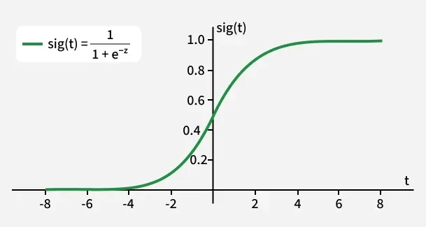
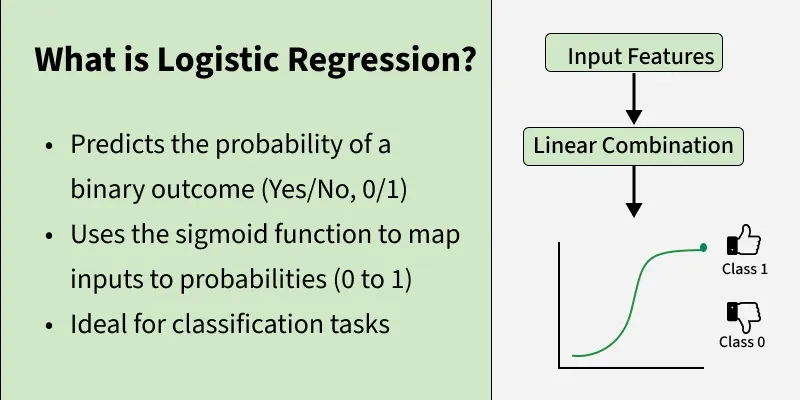
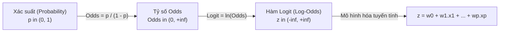
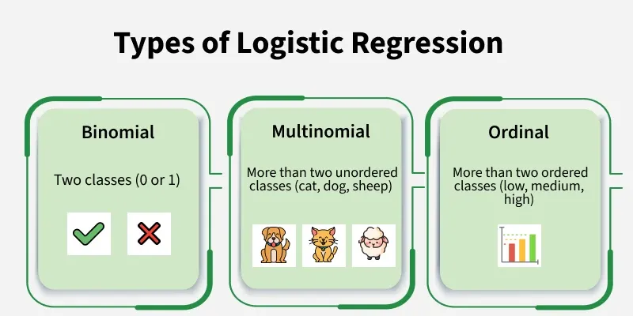
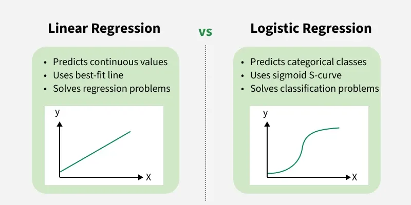
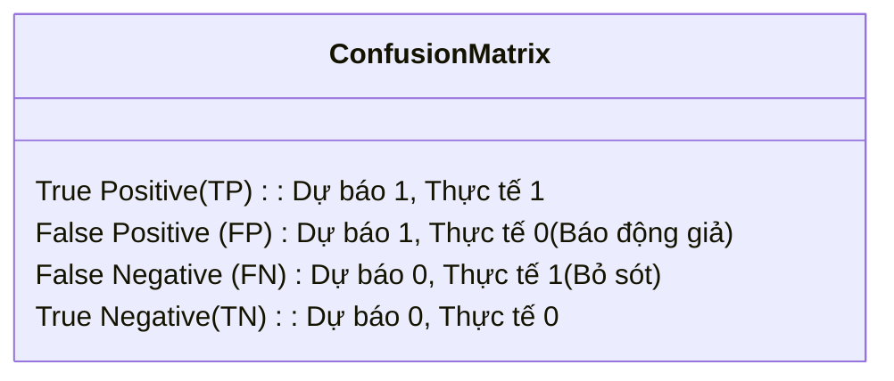

# Bài giảng: Logistic Regression (Hồi quy Logistic trong Machine Learning)

**Cập nhật lần cuối:** 21 tháng 9 năm 2026  
**Học phần:** Phân tích dữ liệu với Python (DSAI1005)  
**Giảng viên:** TS. Vũ Đức Minh – Khoa Khoa học dữ liệu và Trí tuệ nhân tạo, Trường Công nghệ, Đại học Kinh tế Quốc dân (NEU)  
**Nguồn tài liệu tham khảo chính:** [GeeksforGeeks – Understanding Logistic Regression in Machine Learning](https://www.geeksforgeeks.org/machine-learning/understanding-logistic-regression/)

---

## Mục lục bài học

1. [Tổng quan về Hồi quy Logistic](#1-tổng-quan-về-hồi-quy-logistic)
2. [Mục tiêu bài học (Learning Objectives)](#2-mục-tiêu-bài-học-learning-objectives)
3. [Hàm Sigmoid & Nguyên lý Chuyển đổi Xác suất](#3-hàm-sigmoid--nguyên-lý-chuyển-đổi-xác-suất)
4. [Phương trình Hồi quy Logistic, Tỷ số Odds & Hàm Logit](#4-phương-trình-hồi-quy-logistic-tỷ-số-odds--hàm-logit)
5. [Hàm Hợp lý & Ước lượng Hợp lý Cực đại (Maximum Likelihood Estimation - MLE)](#5-hàm-hợp-lý--ước-lượng-hợp-lý-cực-đại-maximum-likelihood-estimation---mle)
6. [Các phân loại của Hồi quy Logistic (Types of Logistic Regression)](#6-các-phân-loại-của-hồi-quy-logistic-types-of-logistic-regression)
   - 6.1. Binomial (Binary) Logistic Regression (Phân loại nhị phân)
   - 6.2. Multinomial Logistic Regression & Hàm Softmax (Phân loại đa lớp)
   - 6.3. Ordinal Logistic Regression (Phân loại có thứ bậc)
7. [Các giả định nền tảng của Mô hình (Assumptions)](#7-các-giả-định-nền-tảng-của-mô-hình-assumptions)
8. [So sánh Đối chiếu Toàn diện: Linear Regression vs Logistic Regression](#8-so-sánh-đối-chiếu-toàn-diện-linear-regression-vs-logistic-regression)
9. [Các thước đo Đánh giá Hiệu năng Phân loại (Evaluation Metrics)](#9-các-thước-đo-đánh-giá-hiệu-năng-phân-loại-evaluation-metrics)
10. [Thực hành Lập trình Python với Scikit-Learn](#10-thực-hành-lập-trình-python-với-scikit-learn)
    - 10.1. Phân loại Nhị phân: Chẩn đoán tế bào ung thư vú (Breast Cancer Dataset)
    - 10.2. Phân loại Đa lớp: Nhận diện chữ số viết tay (Digits Dataset)
11. [Tổng kết & Bộ câu hỏi ôn tập củng cố kiến thức](#11-tổng-kết--bộ-câu-hỏi-ôn-tập-củng-cố-kiến-thức)
12. [Tài liệu tham khảo](#12-tài-liệu-tham-khảo)

---

## 1. Tổng quan về Hồi quy Logistic

Trong nhánh Học máy có giám sát (Supervised Machine Learning), **Logistic Regression (Hồi quy Logistic)** là thuật toán phân loại kinh điển, được sử dụng rộng rãi và giữ vai trò nền tảng nhất cho các bài toán **Phân loại (Classification)**.

Mặc dù trong tên gọi có chứa từ *"Regression" (Hồi quy)* do kế thừa cấu trúc tuyến tính từ mô hình thống kê tổng quát, bản chất của Logistic Regression lại là một giải thuật **Phân loại**: thay vì ước lượng một giá trị số thực liên tục không giới hạn, mô hình ước lượng **xác suất xảy ra** của một sự kiện hay khả năng một quan sát thuộc về một nhóm nhãn cụ thể ($P \in [0, 1]$).

<p align="center">
  
</p>

### Các đặc trưng căn bản:
- **Đầu vào ($X$):** Véc-tơ đặc trưng gồm các biến số định lượng hoặc biến định tính đã được mã hóa.
- **Đầu ra ($y$):** Nhãn danh mục rời rạc. Trong trường hợp phổ biến nhất (Phân loại nhị phân), đầu ra nhận giá trị trong tập $\{0, 1\}$ (ví dụ: Có/Không, Đạt/Trượt, Gian lận/Hợp lệ, Lành tính/Ác tính).
- **Cơ chế cốt lõi:** Kết hợp phép biến đổi tuyến tính $z = w^T X + b$ với **hàm kích hoạt Sigmoid (Logistic Function)** để nén toàn bộ miền giá trị thực $(-\infty, +\infty)$ về khoảng xác suất chuẩn hóa $(0, 1)$.

---

## 2. Mục tiêu bài học (Learning Objectives)

Sau khi hoàn thành bài học này, sinh viên có khả năng:

1. **Hiểu rõ nguyên lý toán học:** Giải thích tường minh vì sao Hồi quy tuyến tính (Linear Regression) thất bại khi áp dụng cho bài toán phân loại và cách thức **hàm Sigmoid** giải quyết bài toán này.
2. **Nắm vững bản chất Logit & Odds:** Hiểu sâu sắc mối liên hệ giữa xác suất $P(y=1|X)$, tỷ số khả dĩ (Odds), và hàm Log-Odds (Logit) trong việc mô hình hóa tuyến tính.
3. **Làm chủ phương pháp ước lượng MLE:** Trình bày được cấu trúc Hàm Hợp lý (Likelihood), Hàm mất mát Cross-Entropy (Log Loss) và quy trình tối ưu trọng số bằng thuật toán Gradient Descent.
4. **Phân biệt các biến thể mô hình:** Phân loại và triển khai đúng 3 dạng bài toán: Binomial (Nhị phân), Multinomial (Đa lớp với Softmax) và Ordinal (Thứ bậc).
5. **Đánh giá toàn diện:** Sử dụng chính xác các chỉ số đo lường hiệu năng phân loại: Ma trận nhầm lẫn (Confusion Matrix), Accuracy, Precision, Recall, F1-Score, ROC-AUC và PR-AUC.
6. **Thực hành Python Scikit-Learn:** Xây dựng pipeline hoàn chỉnh từ tiền xử lý, huấn luyện mô hình, tinh chỉnh ngưỡng quyết định (Decision Threshold) đến đánh giá kết quả trên các tập dữ liệu y tế và nhận diện ký tự thực tế.

---

## 3. Hàm Sigmoid & Nguyên lý Chuyển đổi Xác suất

### 3.1. Tại sao không thể sử dụng Hồi quy tuyến tính (Linear Regression) cho Phân loại?
Nếu chúng ta cố gắng áp dụng mô hình hồi quy tuyến tính $y = w^T X + b$ để phân loại nhãn nhị phân $y \in \{0, 1\}$, chúng ta sẽ đối mặt với ba rào cản nghiêm trọng:

1. **Đầu ra vượt ngoài biên xác suất:** Đường thẳng tuyến tính không có giới hạn, nó có thể dự báo các giá trị $\hat{y} < 0$ hoặc $\hat{y} > 1$, hoàn toàn vô nghĩa đối với một đại lượng xác suất.
2. **Độ nhạy cực đại với Outliers:** Khi có thêm các điểm dữ liệu cực trị (ví dụ bệnh nhân có độ tuổi rất cao), đường thẳng OLS sẽ bị xoay lệch mạnh, làm dịch chuyển ngưỡng quyết định và phân loại sai hàng loạt quan sát bình thường.
3. **Vi phạm giả định phương sai sai số (Heteroscedasticity):** Với biến mục tiêu nhị phân, sai số $e_i = y_i - \hat{y}_i$ chỉ nhận hai giá trị và phụ thuộc trực tiếp vào $X$, vi phạm giả định phương sai đồng nhất của OLS.

<p align="center">
  
</p>

---

### 3.2. Cấu tạo & Tính chất Toán học của Hàm Sigmoid
Để giải quyết bài toán trên, Logistic Regression đưa giá trị tuyến tính $z = w^T X + b$ đi qua **Hàm Sigmoid (Logistic Function)**, ký hiệu là $\sigma(z)$:

$$\sigma(z) = \frac{1}{1 + e^{-z}}$$

#### Các tính chất toán học đặc biệt:
- **Miền giá trị được chuẩn hóa:** Với mọi giá trị $z \in (-\infty, +\infty)$, giá trị của $\sigma(z)$ luôn nằm nghiêm ngặt trong khoảng:
  $$0 < \sigma(z) < 1$$
- **Hành vi tiệm cận:**
  $$\lim_{z \to +\infty} \sigma(z) = 1, \quad \lim_{z \to -\infty} \sigma(z) = 0$$
- **Điểm đối xứng:** Tại $z = 0$, ta có:
  $$\sigma(0) = \frac{1}{1 + e^0} = \frac{1}{2} = 0.5$$
- **Đạo hàm đối xứng tuyệt đẹp:** Đạo hàm của hàm Sigmoid có thể biểu diễn qua chính nó, giúp việc tính toán gradient trong quá trình huấn luyện diễn ra cực kỳ nhanh chóng:
  $$\sigma'(z) = \sigma(z) \cdot (1 - \sigma(z))$$

---

### 3.3. Ngưỡng quyết định (Decision Threshold)
Sau khi thu được xác suất $\hat{p} = \sigma(z) = P(y=1|X)$, mô hình sử dụng một **Ngưỡng quyết định (Threshold $\tau$)** — theo mặc định là $\tau = 0.5$ — để đưa ra kết luận phân loại cuối cùng:

$$\hat{y} = \begin{cases} 1 & \text{nếu } \hat{p} \ge 0.5 \iff z \ge 0 \\ 0 & \text{nếu } \hat{p} < 0.5 \iff z < 0 \end{cases}$$

> **Lưu ý thực tiễn:** Ngưỡng 0.5 không phải là bất di bất dịch. Trong các bài toán y tế (tầm soát ung thư) hoặc tài chính (phát hiện gian lận), ta có thể chủ động hạ ngưỡng xuống $0.2 - 0.3$ để tối ưu chỉ số Recall, chấp nhận tăng báo động giả nhằm không bỏ sót bất kỳ ca bệnh nguy hiểm nào.

---

## 4. Phương trình Hồi quy Logistic, Tỷ số Odds & Hàm Logit

Để hiểu vì sao mô hình có thể biểu diễn tuyến tính, chúng ta tìm hiểu chuỗi biến đổi từ **Xác suất (Probability) $\to$ Tỷ số Khả dĩ (Odds) $\to$ Hàm Log-Odds (Logit)**:



### 4.1. Tỷ số Khả dĩ (Odds)
Trong lý thuyết xác suất, **Odds** là tỷ số giữa xác suất biến cố xảy ra ($p$) trên xác suất biến cố không xảy ra ($1 - p$):

$$\text{Odds} = \frac{p}{1 - p}$$

- Ví dụ: Nếu xác suất một email là thư rác là $p = 0.8$ (80%), thì xác suất không phải thư rác là $1 - p = 0.2$ (20%).
- Khi đó, $\text{Odds} = \frac{0.8}{0.2} = 4$ (nghĩa là khả năng email này là thư rác cao gấp 4 lần khả năng nó là thư bình thường).
- Miền giá trị của Odds là: $\text{Odds} \in (0, +\infty)$.

---

### 4.2. Hàm Log-Odds (Hàm Logit)
Bằng cách lấy logarit tự nhiên ($\ln$) của Odds, ta thu được đại lượng **Log-Odds (Logit)**:

$$\text{Logit}(p) = \ln(\text{Odds}) = \ln\left(\frac{p}{1 - p}\right)$$

Khi $p \to 0$, $\text{Logit}(p) \to -\infty$; khi $p \to 1$, $\text{Logit}(p) \to +\infty$. Như vậy, hàm Logit đã ánh xạ thành công khoảng xác suất bị chặn $(0, 1)$ thành toàn bộ trục số thực $(-\infty, +\infty)$.

### 4.3. Biểu diễn Tuyến tính của Logit
Giả định cốt lõi của Hồi quy Logistic là: **Hàm Log-Odds có mối quan hệ tuyến tính với các biến độc lập đầu vào**:

$$\ln\left(\frac{p(X)}{1 - p(X)}\right) = w_0 + w_1 x_1 + w_2 x_2 + \ldots + w_p x_p = w^T X + b = z$$

Lấy mũ cơ số $e$ cả hai vế (Exponentiation):

$$\frac{p(X)}{1 - p(X)} = e^{w^T X + b}$$

Giải phương trình tìm $p(X)$:

$$p(X) = e^{w^T X + b} \cdot (1 - p(X)) \implies p(X)(1 + e^{w^T X + b}) = e^{w^T X + b}$$

$$\implies p(X) = \frac{e^{w^T X + b}}{1 + e^{w^T X + b}} = \frac{1}{1 + e^{-(w^T X + b)}} = \sigma(w^T X + b)$$

> **Ý nghĩa kinh tế/thống kê của Hệ số $w_j$:**  
> Hệ số $w_j$ phản ánh: Khi biến độc lập $x_j$ tăng lên 1 đơn vị (các biến khác giữ nguyên), thì **Log-Odds** của sự kiện sẽ tăng thêm $w_j$ đơn vị, đồng thời **Tỷ số Odds** sẽ nhân lên một hệ số bằng $e^{w_j}$ (được gọi là **Odds Ratio - OR**).

---

## 5. Hàm Hợp lý & Ước lượng Hợp lý Cực đại (Maximum Likelihood Estimation - MLE)

Trong Hồi quy tuyến tính OLS, ta tìm tham số bằng cách cực tiểu hóa tổng bình phương sai số. Tuy nhiên, trong Hồi quy Logistic, do hàm Sigmoid là phi tuyến, nếu sử dụng MSE thì hàm mất mát sẽ trở thành **hàm không lồi (Non-convex function)** với rất nhiều điểm cực tiểu cục bộ (Local Minima), khiến thuật toán tối ưu bị mắc kẹt.

Do đó, phương pháp chuẩn mực được áp dụng là **Ước lượng Hợp lý Cực đại (Maximum Likelihood Estimation - MLE)**.

### 5.1. Hàm Hợp lý (Likelihood Function)
Giả sử tập dữ liệu có $n$ quan sát độc lập $\{(x_1, y_1), (x_2, y_2), \ldots, (x_n, y_n)\}$ với $y_i \in \{0, 1\}$. Đặt $p_i = P(y_i = 1 | x_i; w, b)$. Xác suất xảy ra của từng quan sát tuân theo phân phối Bernoulli:

$$P(y_i | x_i) = p_i^{y_i} (1 - p_i)^{1 - y_i}$$

Hàm Hợp lý biểu thị xác suất đồng thời để toàn bộ tập dữ liệu mẫu xuất hiện trong thực tế:

$$L(w, b) = \prod_{i=1}^n P(y_i | x_i) = \prod_{i=1}^n p_i^{y_i} (1 - p_i)^{1 - y_i}$$

---

### 5.2. Hàm Log-Likelihood & Hàm Mất mát Cross-Entropy (Log Loss)
Để chuyển phép nhân thành phép cộng giúp tính toán đạo hàm thuận tiện và tránh lỗi tràn số dưới (arithmetic underflow), ta lấy logarit tự nhiên hai vế:

$$\ell(w, b) = \ln L(w, b) = \sum_{i=1}^n \left[ y_i \ln(p_i) + (1 - y_i) \ln(1 - p_i) \right]$$

Mục tiêu MLE là tìm bộ trọng số $(w, b)$ sao cho hàm log-hợp lý $\ell(w, b)$ đạt **cực đại**. Trong học máy, bài toán tối ưu thường được định nghĩa dưới dạng **cực tiểu hóa hàm mất mát (Loss Function)**. Do đó, ta lấy dấu trừ và chia cho số quan sát $n$ để thu được **Hàm mất mát Binary Cross-Entropy (Log Loss)**:

$$J(w, b) = -\frac{1}{n} \ell(w, b) = -\frac{1}{n} \sum_{i=1}^n \left[ y_i \ln(p_i) + (1 - y_i) \ln(1 - p_i) \right]$$

Hàm mất mát $J(w, b)$ là một **hàm lồi (Convex Function)**, đảm bảo chỉ có duy nhất một điểm cực tiểu toàn cục (Global Minimum).

---

### 5.3. Gradient Descent cập nhật Trọng số
Lấy đạo hàm riêng của $J(w, b)$ theo từng trọng số $w_j$:

$$\frac{\partial J(w, b)}{\partial w_j} = \frac{1}{n} \sum_{i=1}^n (\hat{y}_i - y_i) x_{ij}$$

Quy tắc cập nhật trọng số trong mỗi bước lặp:

$$w_j := w_j - \alpha \frac{\partial J}{\partial w_j} = w_j - \frac{\alpha}{n} \sum_{i=1}^n (\hat{y}_i - y_i) x_{ij}$$

trong đó $\alpha > 0$ là tốc độ học (Learning Rate).

---

## 6. Các phân loại của Hồi quy Logistic (Types of Logistic Regression)

Tùy thuộc vào bản chất và số lượng trạng thái của biến mục tiêu $Y$, Hồi quy Logistic được chia thành ba nhánh chính:

<p align="center">
  
</p>

### 6.1. Binomial (Binary) Logistic Regression (Phân loại nhị phân)
- **Đặc điểm:** Biến mục tiêu chỉ có đúng 2 trạng thái danh mục rời rạc ($0$ hoặc $1$).
- **Hàm kích hoạt:** Hàm Sigmoid chuẩn $\sigma(z) = \frac{1}{1 + e^{-z}}$.
- **Ví dụ ứng dụng:**
  - Email: Thư rác (Spam - 1) hoặc Thư bình thường (Ham - 0).
  - Ngân hàng: Hồ sơ vay vỡ nợ (Default - 1) hoặc Trả nợ đầy đủ (Non-default - 0).
  - Y tế: Mẫu sinh thiết là Ác tính (Malignant - 1) hoặc Lành tính (Benign - 0).

---

### 6.2. Multinomial Logistic Regression & Hàm Softmax (Phân loại đa lớp)
- **Đặc điểm:** Biến mục tiêu có từ 3 nhóm danh mục trở lên và **không có quan hệ thứ bậc định lượng** giữa các nhóm (ví dụ: Chó, Mèo, Chim).
- **Hàm kích hoạt Softmax:** Khi mở rộng cho bài toán $K$ lớp phân loại ($C_1, C_2, \ldots, C_K$), hàm Sigmoid được tổng quát hóa thành **Hàm Softmax**:
  $$P(Y = k | x) = \frac{e^{w_k^T x + b_k}}{\sum_{j=1}^K e^{w_j^T x + b_j}}$$
  Tổng xác suất dự báo trên toàn bộ $K$ lớp luôn được bảo toàn bằng đúng 1: $\sum_{k=1}^K P(Y=k|x) = 1$.
- **Ví dụ ứng dụng:**
  - Nhận diện chữ số viết tay từ ảnh (MNIST): 10 lớp từ 0 đến 9.
  - Phân loại ngành nghề: Công nghệ thông tin, Tài chính ngân hàng, Y tế, Giáo dục.

---

### 6.3. Ordinal Logistic Regression (Phân loại có thứ bậc)
- **Đặc điểm:** Biến mục tiêu có từ 3 nhóm danh mục trở lên nhưng các nhóm có **thứ tự hoặc cấp bậc tự nhiên** (Ordered Categories).
- **Nguyên lý:** Mô hình xem xét quan hệ xếp hạng giữa các mức độ (Cumulative Logit Model), ước lượng xác suất tích lũy $P(Y \le k | x)$.
- **Ví dụ ứng dụng:**
  - Khảo sát mức độ hài lòng khách hàng: Rất không hài lòng (1), Không hài lòng (2), Bình thường (3), Hài lòng (4), Rất hài lòng (5).
  - Xếp hạng tín dụng doanh nghiệp: AAA, AA, A, BBB, BB, B, CCC.
  - Phân loại mức độ nghiêm trọng của bệnh nhân: Nhẹ (Low), Trung bình (Medium), Nguy kịch (High).

---

## 7. Các giả định nền tảng của Mô hình (Assumptions)

Mặc dù Hồi quy Logistic linh hoạt hơn Hồi quy tuyến tính (không đòi hỏi biến mục tiêu và sai số phải tuân theo phân phối chuẩn), mô hình vẫn dựa trên **5 giả định quan trọng** sau để kết quả ước lượng đạt độ tin cậy:

1. **Biến mục tiêu phù hợp:** Biến phụ thuộc phải là biến định tính (nhị phân, đa lớp danh nghĩa hoặc thứ bậc).
2. **Tính độc lập của các quan sát (Independent Observations):** Dữ liệu không được có hiện tượng tự tương quan chuỗi hay phụ thuộc lẫn nhau giữa các bản ghi (ví dụ không đo lặp lại nhiều lần trên cùng một đối tượng mà không kiểm soát).
3. **Mối quan hệ tuyến tính với Log-Odds (Linearity of Independent Variables and Log-Odds):** Các biến độc lập liên tục phải có quan hệ tuyến tính với hàm logit $\ln(p / (1 - p))$. (Kiểm tra bằng phương pháp kiểm định Box-Tidwell).
4. **Không có Đa cộng tuyến nghiêm trọng (No Multicollinearity):** Các biến dự báo $X$ không được tương quan quá chặt chẽ với nhau (kiểm tra chỉ số $\text{VIF} < 5$).
5. **Kích thước mẫu đủ lớn (Large Sample Size):** Ước lượng MLE là phương pháp tiệm cận, đòi hỏi kích thước mẫu tương đối lớn để các ước lượng tham số hội tụ ổn định (khuyến nghị tối thiểu 10–20 quan sát cho mỗi biến dự báo đối với lớp thiểu số).

---

## 8. So sánh Đối chiếu Toàn diện: Linear Regression vs Logistic Regression

<p align="center">
  
</p>

Bảng đối chiếu tổng hợp các điểm khác biệt bản chất giữa hai mô hình:

| Tiêu chí so sánh | Linear Regression (Hồi quy Tuyến tính) | Logistic Regression (Hồi quy Logistic) |
|:---|:---|:---|
| **Dạng bài toán giải quyết** | Hồi quy (Regression Problem) | Phân loại (Classification Problem) |
| **Bản chất biến mục tiêu ($Y$)** | Biến liên tục không giới hạn ($Y \in \mathbb{R}$) | Biến danh mục rời rạc ($Y \in \{0, 1\}$ hoặc đa lớp) |
| **Dạng đường cong mô hình** | Đường thẳng hoặc siêu phẳng tuyến tính | Đường cong hình chữ S (Sigmoid / Logistic Curve) |
| **Giá trị đầu ra của mô hình** | Giá trị số lượng cụ thể (VD: 45.2 triệu, $28^\circ\text{C}$) | Giá trị xác suất chuẩn hóa nằm trong khoảng $(0, 1)$ |
| **Phương pháp tối ưu tham số** | Bình phương tối thiểu (Ordinary Least Squares - OLS) | Ước lượng Hợp lý Cực đại (Maximum Likelihood Estimation - MLE) |
| **Hàm mất mát (Loss Function)** | Mean Squared Error (MSE / Bình phương phần dư) | Binary Cross-Entropy Loss (Log Loss) |
| **Độ nhạy với Outliers** | Cực kỳ nhạy cảm, dễ làm chệch góc nghiêng đường thẳng | Bền vững hơn đáng kể nhờ cơ chế nén cận trên/dưới của Sigmoid |
| **Ví dụ kinh tế & kinh doanh** | Dự báo giá cổ phiếu, doanh số tháng, tốc độ gió | Dự báo khách hàng rời bỏ, phê duyệt tín dụng, lọc thư rác |

---

## 9. Các thước đo Đánh giá Hiệu năng Phân loại (Evaluation Metrics)

Đánh giá mô hình phân loại yêu cầu hệ thống chỉ số chuyên biệt dựa trên **Ma trận Nhầm lẫn (Confusion Matrix)**:



### 1. Ma trận Nhầm lẫn (Confusion Matrix)
- **True Positive (TP):** Thực tế là Dương tính ($1$), mô hình dự báo đúng là Dương tính ($1$).
- **True Negative (TN):** Thực tế là Âm tính ($0$), mô hình dự báo đúng là Âm tính ($0$).
- **False Positive (FP - Lỗi Loại I):** Thực tế là Âm tính ($0$), mô hình dự báo nhầm thành Dương tính ($1$).
- **False Negative (FN - Lỗi Loại II):** Thực tế là Dương tính ($1$), mô hình dự báo nhầm thành Âm tính ($0$).

---

### 2. Hệ thống các chỉ số cốt lõi

| Chỉ số | Công thức | Ý nghĩa & Ứng dụng thực tế |
|:---|:---:|:---|
| **Accuracy (Độ chính xác tổng thể)** | $\frac{TP + TN}{TP + TN + FP + FN}$ | Tỷ lệ phần trăm dự đoán đúng trên tổng số quan sát. **Chỉ dùng khi dữ liệu cân bằng**. |
| **Precision (Độ chuẩn xác)** | $\frac{TP}{TP + FP}$ | Trong số các mẫu được dự báo là Dương tính, có bao nhiêu % là đúng. Quan trọng khi chi phí do báo động nhầm ($FP$) là rất lớn (ví dụ: bộ lọc thư rác). |
| **Recall / Sensitivity (Độ nhạy)** | $\frac{TP}{TP + FN}$ | Trong số tất cả các mẫu thực tế là Dương tính, mô hình phát hiện được bao nhiêu %. Cực kỳ quan trọng khi việc bỏ sót ($FN$) gây hậu quả chết người (chẩn đoán ung thư, gian lận tài chính). |
| **F1-Score** | $2 \cdot \frac{\text{Precision} \cdot \text{Recall}}{\text{Precision} + \text{Recall}}$ | Trung bình điều hòa giữa Precision và Recall, phản ánh sự cân bằng giữa hai mục tiêu. |
| **ROC Curve & AUC-ROC** | Đường cong vẽ $TPR$ theo $FPR$ qua các ngưỡng | Đánh giá năng lực phân tách tổng thể của mô hình. $\text{AUC} = 0.5$ tương đương đoán mò ngẫu nhiên, $\text{AUC} = 1.0$ là mô hình hoàn hảo. |
| **PR-AUC** | Diện tích dưới đường cong Precision-Recall | Thước đo vàng khi làm việc với **dữ liệu mất cân bằng cực độ** (như giao dịch gian lận chiếm dưới 1%). |

---

## 10. Thực hành Lập trình Python với Scikit-Learn

### 10.1. Phân loại Nhị phân: Chẩn đoán Khối u Ung thư Vú (Breast Cancer Dataset)
Đoạn mã dưới đây sử dụng tập dữ liệu kinh điển của `scikit-learn` để dự đoán khối u là **Ác tính (Malignant - 0)** hay **Lành tính (Benign - 1)**, chuẩn hóa dữ liệu, huấn luyện mô hình và xuất báo cáo phân loại chi tiết:

```python
import numpy as np
import pandas as pd
import matplotlib.pyplot as plt
from sklearn.datasets import load_breast_cancer
from sklearn.model_selection import train_test_split
from sklearn.preprocessing import StandardScaler
from sklearn.linear_model import LogisticRegression
from sklearn.metrics import accuracy_score, classification_report, confusion_matrix, roc_auc_score, roc_curve

# 1. Tải tập dữ liệu Ung thư Vú từ Scikit-Learn
cancer = load_breast_cancer()
X = cancer.data
y = cancer.target  # 0: Malignant (Ác tính), 1: Benign (Lành tính)

print(f"Tổng số mẫu: {X.shape[0]} | Số đặc trưng: {X.shape[1]}")
print(f"Phân phối nhãn: Lành tính = {np.sum(y == 1)}, Ác tính = {np.sum(y == 0)}")

# 2. Phân chia tập dữ liệu Train (80%) và Test (20%) có phân tầng (Stratified)
X_train, X_test, y_train, y_test = train_test_split(
    X, y, test_size=0.20, random_state=42, stratify=y
)

# 3. Chuẩn hóa thang đo đặc trưng (StandardScaler)
scaler = StandardScaler()
X_train_scaled = scaler.fit_transform(X_train)
X_test_scaled = scaler.transform(X_test)

# 4. Khởi tạo và Huấn luyện mô hình Logistic Regression
clf = LogisticRegression(max_iter=10000, random_state=42)
clf.fit(X_train_scaled, y_train)

# 5. Dự báo nhãn và xác suất trên tập kiểm tra
y_pred = clf.predict(X_test_scaled)
y_prob = clf.predict_proba(X_test_scaled)[:, 1]

# 6. Đánh giá hiệu năng mô hình
acc = accuracy_score(y_test, y_pred)
auc = roc_auc_score(y_test, y_prob)

print("\n--- KẾT QUẢ ĐÁNH GIÁ MÔ HÌNH NHỊ PHÂN ---")
print(f"Độ chính xác (Accuracy): {acc * 100:.2f}%")
print(f"Chỉ số ROC-AUC Score:    {auc:.4f}")

print("\nMa trận nhầm lẫn (Confusion Matrix):")
print(confusion_matrix(y_test, y_pred))

print("\nBáo cáo phân loại chi tiết (Classification Report):")
print(classification_report(y_test, y_pred, target_names=cancer.target_names))

# 7. Trực quan hóa Đường cong ROC (ROC Curve)
fpr, tpr, thresholds = roc_curve(y_test, y_prob)
plt.figure(figsize=(8, 6))
plt.plot(fpr, tpr, color='blue', lw=2.5, label=f'Logistic Regression ROC (AUC = {auc:.4f})')
plt.plot([0, 1], [0, 1], color='gray', linestyle='--', label='Đoán ngẫu nhiên (AUC = 0.5000)')
plt.xlim([0.0, 1.0])
plt.ylim([0.0, 1.05])
plt.xlabel('Tỷ lệ Báo động sai (False Positive Rate - FPR)', fontsize=12)
plt.ylabel('Tỷ lệ Nhận diện đúng (True Positive Rate - TPR / Recall)', fontsize=12)
plt.title('Đường cong ROC - Bài toán Chẩn đoán Ung thư Vú', fontsize=14, fontweight='bold')
plt.legend(loc='lower right')
plt.grid(True, linestyle='--', alpha=0.6)
plt.tight_layout()
plt.show()
```

---

### 10.2. Phân loại Đa lớp: Nhận diện Chữ số Viết tay (Digits Dataset)
Đoạn mã triển khai mô hình **Multinomial Logistic Regression (Softmax)** để phân loại ảnh các chữ số viết tay từ 0 đến 9:

```python
from sklearn.datasets import load_digits
from sklearn.model_selection import train_test_split
from sklearn.preprocessing import StandardScaler
from sklearn.linear_model import LogisticRegression
from sklearn.metrics import accuracy_score, classification_report

# 1. Tải tập dữ liệu 1,797 ảnh chữ số viết tay (kích thước 8x8 pixels = 64 đặc trưng)
digits = load_digits()
X_digits = digits.data
y_digits = digits.target

print(f"Tập dữ liệu Digits: {X_digits.shape[0]} ảnh mẫu, {X_digits.shape[1]} đặc trưng pixel.")
print(f"Danh sách 10 lớp mục tiêu: {np.unique(y_digits)}")

# 2. Phân chia tập Train (70%) và Test (30%)
X_train_d, X_test_d, y_train_d, y_test_d = train_test_split(
    X_digits, y_digits, test_size=0.30, random_state=42, stratify=y_digits
)

# 3. Chuẩn hóa thang đo
scaler_d = StandardScaler()
X_train_d_scaled = scaler_d.fit_transform(X_train_d)
X_test_d_scaled = scaler_d.transform(X_test_d)

# 4. Huấn luyện mô hình Multinomial Logistic Regression (sử dụng solver lbfgs hỗ trợ Softmax)
model_multiclass = LogisticRegression(
    multi_class='multinomial',
    solver='lbfgs',
    max_iter=5000,
    random_state=42
)
model_multiclass.fit(X_train_d_scaled, y_train_d)

# 5. Dự báo trên tập kiểm tra
y_pred_d = model_multiclass.predict(X_test_d_scaled)
acc_d = accuracy_score(y_test_d, y_pred_d)

print("\n--- KẾT QUẢ ĐÁNH GIÁ MÔ HÌNH ĐA LỚP (MULTINOMIAL) ---")
print(f"Độ chính xác tổng thể trên 10 chữ số (Accuracy): {acc_d * 100:.2f}%")

print("\nBáo cáo phân loại chi tiết theo từng chữ số (0 đến 9):")
print(classification_report(y_test_d, y_pred_d))
```

---

## 11. Tổng kết & Bộ câu hỏi ôn tập củng cố kiến thức

### 💡 Bảng ghi nhớ cốt lõi
1. **Bản chất:** Là mô hình phân loại ước lượng xác suất bằng cách kết hợp hàm tuyến tính $w^T X + b$ với hàm phi tuyến **Sigmoid** $\sigma(z) = \frac{1}{1 + e^{-z}}$.
2. **Hàm Logit:** Biến đổi Log-Odds $\ln(p / (1 - p))$ có mối quan hệ tuyến tính với các biến độc lập $X$.
3. **Phương pháp học:** Tối ưu hóa hàm hợp lý cực đại (**MLE**) thay vì OLS; hàm mất mát chuẩn mực là **Binary Cross-Entropy (Log Loss)**.
4. **Phân loại:**
   - *Binomial:* 2 lớp (hàm Sigmoid).
   - *Multinomial:* $\ge 3$ lớp không thứ bậc (hàm Softmax).
   - *Ordinal:* $\ge 3$ lớp có thứ tự thứ bậc.
5. **Chỉ số:** Khi dữ liệu mất cân bằng, không tin tưởng Accuracy; ưu tiên đánh giá qua **Precision, Recall, F1-Score** và diện tích **ROC-AUC / PR-AUC**.

---

### ❓ Bộ 5 câu hỏi ôn tập lý thuyết & Phỏng vấn chuyên sâu

1. **Câu hỏi 1:** Tại sao chúng ta không thể sử dụng hàm mất mát Bình phương tối thiểu (MSE) để huấn luyện mô hình Logistic Regression?
   - *Gợi ý trả lời:* Khi kết hợp hàm phi tuyến Sigmoid với hàm bình phương sai số MSE, hàm chi phí thu được trở thành một hàm không lồi (Non-convex function) có vô số điểm cực tiểu cục bộ (Local Minima). Thuật toán Gradient Descent sẽ dễ dàng bị mắc kẹt tại một điểm cực tiểu địa phương mà không thể tìm ra bộ trọng số tối ưu toàn cục. Việc sử dụng Binary Cross-Entropy đảm bảo hàm mất mát luôn là hàm lồi (Convex), có duy nhất một điểm cực tiểu toàn cục.

2. **Câu hỏi 2:** Nêu ý nghĩa toán học và kinh tế của hệ số hồi quy $w_j$ trong mô hình Logistic Regression? Nếu $w_j = 0.693$, điều đó có ý nghĩa gì?
   - *Gợi ý trả lời:* Về mặt toán học, $w_j = \frac{\partial \text{Logit}}{\partial x_j}$, nghĩa là khi $x_j$ tăng 1 đơn vị, Log-Odds của sự kiện tăng $w_j$ đơn vị. Về mặt kinh tế/thực tế, Tỷ số Odds nhân lên một hệ số bằng $e^{w_j}$. Nếu $w_j = 0.693$, thì $e^{0.693} \approx 2.0$. Nghĩa là khi $x_j$ tăng 1 đơn vị, tỷ số khả dĩ để sự kiện mục tiêu xảy ra sẽ tăng gấp đôi (tăng 100%).

3. **Câu hỏi 3:** Trong bài toán thẩm định hồ sơ vay vốn ngân hàng, ngân hàng nên ưu tiên tối ưu hóa chỉ số Precision hay Recall? Tại sao?
   - *Gợi ý trả lời:* Tùy thuộc vào khẩu vị rủi ro và định nghĩa lớp Dương tính ($1$). Nếu định nghĩa lớp 1 là "Khách hàng vỡ nợ (Default)", ngân hàng thường ưu tiên **Recall** cao để phát hiện tối đa các khách hàng có nguy cơ bùng nợ (vì thiệt hại mất vốn cho vay lớn hơn nhiều so với việc từ chối nhầm một khách hàng tốt). Ngược lại, nếu ở thời kỳ mở rộng tín dụng, ngân hàng có thể cân bằng F1-Score để không làm sụt giảm quá nhiều doanh số cho vay.

4. **Câu hỏi 4:** Phân biệt cơ chế hoạt động của chiến lược One-vs-Rest (OvR) và hàm Softmax (Multinomial) khi giải quyết bài toán phân loại đa lớp?
   - *Gợi ý trả lời:* Chiến lược OvR (One-vs-Rest) chia bài toán $K$ lớp thành $K$ bài toán phân loại nhị phân độc lập (mỗi mô hình phân biệt một lớp duy nhất với phần còn lại); sau đó chọn nhãn có xác suất cao nhất. Trong khi đó, mô hình Multinomial với hàm Softmax huấn luyện đồng thời một véc-tơ tham số duy nhất trên toàn bộ $K$ lớp, chuẩn hóa mẫu số chung $\sum e^{z_j}$, đảm bảo xác suất dự báo trên tất cả các lớp cạnh tranh trực tiếp với nhau và có tổng đúng bằng 1.

5. **Câu hỏi 5:** Giả định "Tuyến tính với Log-Odds" có nghĩa là gì? Nếu giả định này bị vi phạm trong thực tế, chúng ta có thể áp dụng những kỹ thuật nào để khắc phục?
   - *Gợi ý trả lời:* Giả định có nghĩa là hàm Logit $\ln(p / (1 - p))$ thay đổi một cách tuyến tính theo từng bước biến thiên của $X$. Nếu vi phạm (mối quan hệ thực tế có dạng cong hoặc nhảy bậc), có thể khắc phục bằng cách: (1) Đưa thêm các số hạng đa thức ($X^2, X^3$) hoặc biến đổi phi tuyến như logarit $\ln(X)$; (2) Rời rạc hóa biến liên tục thành các khoảng (Binning / Discretization); (3) Sử dụng Spline Regression (GAM - Generalized Additive Models); hoặc (4) Chuyển sang các mô hình phi tuyến tự nhiên như Cây quyết định (Decision Trees) hoặc Random Forests.

---

## 12. Tài liệu tham khảo

1. **GeeksforGeeks:** [Understanding Logistic Regression in Machine Learning](https://www.geeksforgeeks.org/machine-learning/understanding-logistic-regression/) *(Nguồn tham khảo chính)*.
2. **Avinash Navlani, Armando Fandango, Ivan Idris (2021):** *Python Data Analysis*, 3rd Edition, Packt Publishing, ISBN: 9781800564480.
3. **Gábor Békés, Gábor Kézdi (2021):** *Data Analysis for Business, Economics and Policy*, Cambridge University Press.
4. **Aurélien Géron (2022):** *Hands-On Machine Learning with Scikit-Learn, Keras, and TensorFlow*, 3rd Edition, O'Reilly Media.
5. **Scikit-Learn Documentation:** [Logistic Regression User Guide](https://scikit-learn.org/stable/modules/linear_model.html#logistic-regression).
