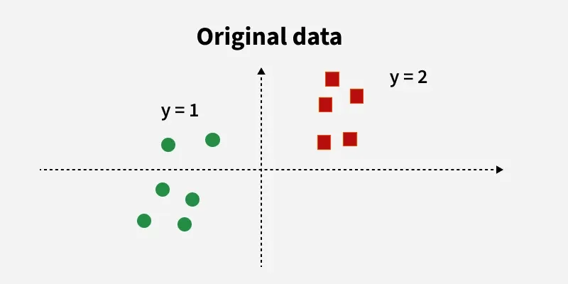
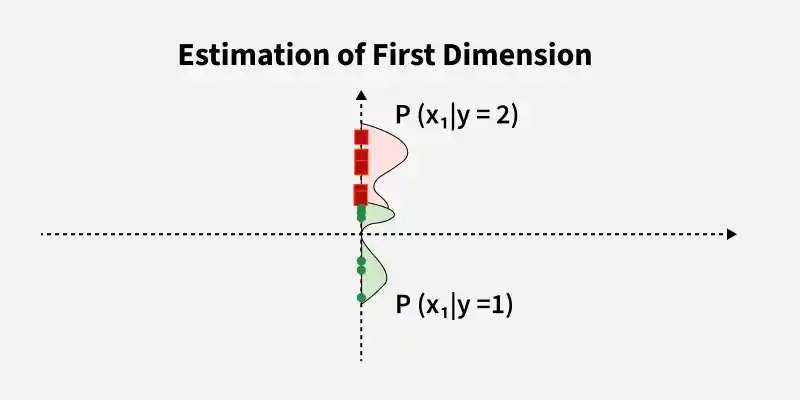
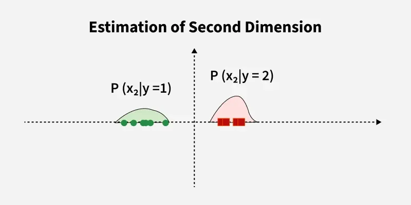
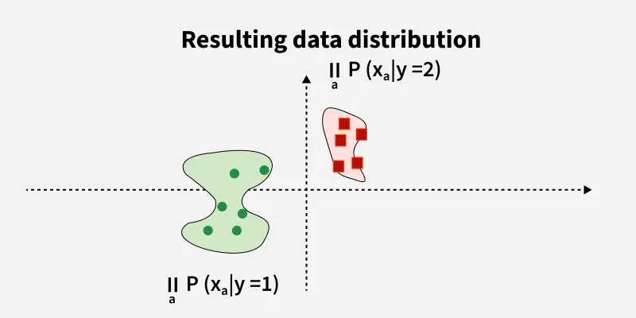
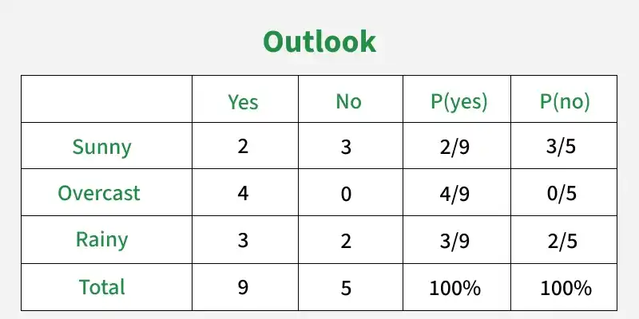
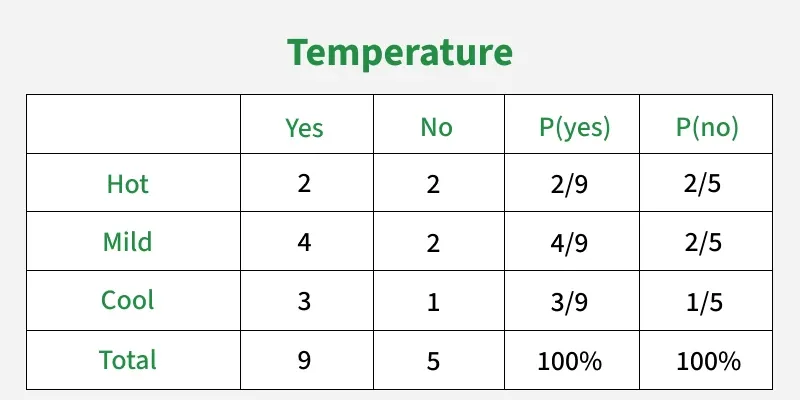
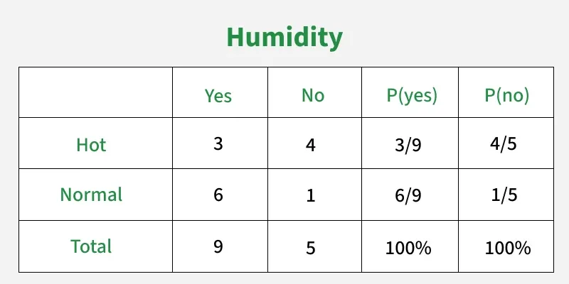
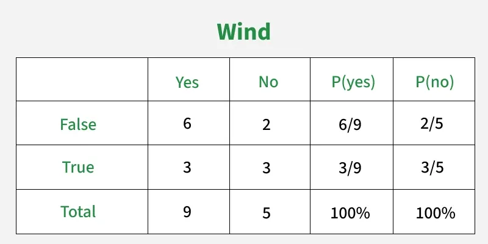
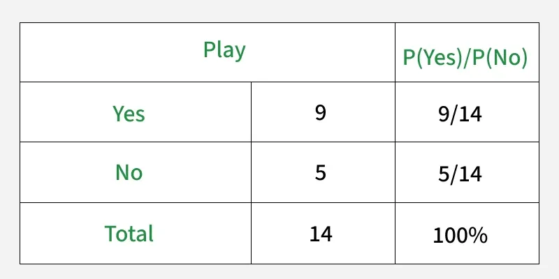
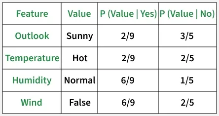

# Bài giảng: Thuật toán Naive Bayes (Phân loại Naive Bayes trong Machine Learning)

**Cập nhật lần cuối:** 22 tháng 9 năm 2026  
**Học phần:** Phân tích dữ liệu với Python (DSAI1005)  
**Giảng viên:** TS. Vũ Đức Minh – Khoa Khoa học dữ liệu và Trí tuệ nhân tạo, Trường Công nghệ và Kinh tế số, Đại học Kinh tế Quốc dân (NEU)  
**Nguồn tài liệu tham khảo chính:** [GeeksforGeeks – Naive Bayes Classifiers](https://www.geeksforgeeks.org/machine-learning/naive-bayes-classifiers/)

---

## Mục lục bài học

1. [Tổng quan về Naive Bayes & Mô hình Xác suất Tạo sinh](#1-tổng-quan-về-naive-bayes--mô-hình-xác-suất-tạo-sinh)
2. [Mục tiêu bài học (Learning Objectives)](#2-mục-tiêu-bài-học-learning-objectives)
3. [Cơ sở Toán học của Thuật toán Naive Bayes](#3-cơ-sở-toán-học-của-thuật-toán-naive-bayes)
   - 3.1. Định lý Bayes: Posterior, Prior, Likelihood và Evidence
   - 3.2. Giả định "Ngây thơ" (Conditional Independence Assumption)
   - 3.3. Hàm quyết định Maximum A Posteriori (MAP)
   - 3.4. Kỹ thuật biến đổi Log-Likelihood chống tràn số dưới (Numerical Underflow)
4. [Ví dụ Minh họa Từng bước: Bài toán Chơi Golf (Play Golf Dataset)](#4-ví-dụ-minh-họa-từng-bước-bài-toán-chơi-golf-play-golf-dataset)
   - 4.1. Bảng dữ liệu thời tiết và xác suất tiên nghiệm
   - 4.2. Bảng tần suất và xác suất có điều kiện của từng thuộc tính
   - 4.3. Tính toán xác suất hậu nghiệm cho mẫu truy vấn mới
   - 4.4. Chuẩn hóa xác suất và kết luận dự báo
5. [Vấn đề Xác suất Bằng Không (Zero Probability) & Kỹ thuật Làm mịn Laplace](#5-vấn-đề-xác-suất-bằng-không-zero-probability--kỹ-thuật-làm-mịn-laplace)
6. [Các Biến thể Thuật toán Naive Bayes Kinh điển](#6-các-biến-thể-thuật-toán-naive-bayes-kinh-điển)
   - 6.1. Gaussian Naive Bayes (`GaussianNB`) cho dữ liệu liên tục
   - 6.2. Multinomial Naive Bayes (`MultinomialNB`) cho dữ liệu đếm tần số
   - 6.3. Bernoulli Naive Bayes (`BernoulliNB`) cho dữ liệu nhị phân
   - 6.4. Complement Naive Bayes (`ComplementNB`) cho dữ liệu mất cân bằng
7. [So sánh Toàn diện: Naive Bayes vs Logistic Regression vs KNN vs SVM](#7-so-sánh-toàn-diện-naive-bayes-vs-logistic-regression-vs-knn-vs-svm)
8. [Ưu điểm, Giới hạn & Ứng dụng Thực tế](#8-ưu-điểm-giới-hạn--ứng-dụng-thực-tế)
9. [Thực hành Lập trình Python với Scikit-Learn](#9-thực-hành-lập-trình-python-với-scikit-learn)
   - 9.1. Phân loại dữ liệu thời tiết rời rạc với CategoricalNB
   - 9.2. Phân loại văn bản và lọc thư rác với MultinomialNB
   - 9.3. Phân loại dữ liệu số liên tục với GaussianNB và trực quan hóa ranh giới quyết định
10. [Tổng kết & Bộ câu hỏi ôn tập củng cố kiến thức](#10-tổng-kết--bộ-câu-hỏi-ôn-tập-củng-cố-kiến-thức)
11. [Tài liệu tham khảo](#11-tài-liệu-tham-khảo)

---

## 1. Tổng quan về Naive Bayes & Mô hình Xác suất Tạo sinh

Trong học máy có giám sát (Supervised Machine Learning), phần lớn các thuật toán như Hồi quy Logistic, Cây quyết định hay SVM đều thuộc nhóm **mô hình phân biệt (Discriminative Models)** — nghĩa là chúng tìm cách học trực tiếp ranh giới quyết định phân tách giữa các lớp. Ngược lại, **Naive Bayes** đại diện tiêu biểu cho họ **mô hình tạo sinh (Generative Models)** dựa trên lý thuyết xác suất thống kê.

Thuật toán dựa trên nền tảng **Định lý Bayes (Bayes' Theorem)** do nhà toán học Thomas Bayes đặt nền móng từ thế kỷ 18. Naive Bayes tính toán xác suất có điều kiện để một quan sát thuộc về một nhãn lớp cụ thể khi biết trước các đặc trưng của nó, và đưa ra quyết định chọn lớp có xác suất cao nhất.

<p align="center">
  
</p>

### Ý tưởng cốt lõi của Naive Bayes:
Để phân loại một điểm dữ liệu trong không gian nhiều chiều, thay vì phải ước lượng phân phối xác suất đồng thời phức tạp $P(x_1, x_2, \dots, x_p \mid y)$ vốn đòi hỏi lượng dữ liệu khổng lồ, Naive Bayes chia nhỏ bài toán thành các phân phối xác suất 1 chiều độc lập:

<p align="center">
  
</p>

<p align="center">
  
</p>

Sau đó, giải thuật kết hợp các phân phối xác suất thành phần bằng phép nhân nhờ giả định độc lập có điều kiện:

<p align="center">
  
</p>

### Vì sao lại gọi là "Naive" (Ngây thơ / Ngây ngô)?
Thuật toán được đặt tên là **"Naive"** vì nó đưa ra một giả định cực kỳ đơn giản hóa và dường như có phần "ngây thơ": **Tất cả các đặc trưng đầu vào đều độc lập có điều kiện với nhau khi biết nhãn lớp**.
- Ví dụ: Trong bài toán phân loại quả táo, một quả có thể được xem là táo nếu nó màu đỏ, hình tròn và đường kính khoảng $8\text{ cm}$. Naive Bayes giả định rằng màu sắc đỏ, hình dáng tròn và kích thước $8\text{ cm}$ hoàn toàn độc lập với nhau trong việc quyết định đó là quả táo, mặc dù trong tự nhiên hình dáng và kích thước quả có mối tương quan nhất định.
- Mặc dù giả định này hầu như **không bao giờ đúng hoàn toàn trong thực tế**, Naive Bayes vẫn hoạt động hiệu quả đến kinh ngạc trong hàng loạt ứng dụng công nghiệp, đặc biệt là **phân loại văn bản (Text Classification)** và **lọc thư rác (Spam Filtering)**.

---

## 2. Mục tiêu bài học (Learning Objectives)

Sau khi hoàn thành bài học này, sinh viên có khả năng:

1. **Hiểu bản chất xác suất:** Nắm vững cấu trúc Định lý Bayes gồm 4 thành phần cốt lõi: Xác suất tiên nghiệm (Prior), Khả dĩ (Likelihood), Bằng chứng (Evidence), và Xác suất hậu nghiệm (Posterior).
2. **Giải thích giả định độc lập có điều kiện:** Phân tích lý do tại sao giả định độc lập giúp giảm độ phức tạp tính toán từ hàm mũ sang hàm tuyến tính theo số đặc trưng.
3. **Tính toán thủ công thành thạo:** Thực hiện đầy đủ quy trình tính xác suất tiên nghiệm, bảng xác suất có điều kiện, tính xác suất hậu nghiệm và chuẩn hóa xác suất trên dữ liệu bảng rời rạc.
4. **Xử lý triệt để bẫy Zero Probability:** Hiểu bản chất của hiện tượng xác suất bằng 0 khi gặp từ vựng mới và áp dụng kỹ thuật **Làm mịn Laplace (Laplace Smoothing)** để khắc phục.
5. **Phân biệt các biến thể Scikit-Learn:** Nắm vững nguyên lý và điều kiện áp dụng của `GaussianNB`, `MultinomialNB`, `BernoulliNB` và `ComplementNB`.
6. **Thực hành lập trình Python:** Xây dựng pipeline phân loại văn bản (NLP) kết hợp CountVectorizer/TfidfVectorizer và GaussianNB trên dữ liệu liên tục.

---

## 3. Cơ sở Toán học của Thuật toán Naive Bayes

### 3.1. Định lý Bayes: Posterior, Prior, Likelihood và Evidence

Xét bài toán phân loại với vector đặc trưng đầu vào $X = (x_1, x_2, \dots, x_p)$ và biến mục tiêu phân loại rời rạc $y \in \{C_1, C_2, \dots, C_K\}$.

Định lý Bayes phát biểu:
$$P(y \mid X) = \frac{P(X \mid y) \cdot P(y)}{P(X)}$$

Ý nghĩa của từng đại lượng:
- **$P(y)$ (Prior Probability - Xác suất tiên nghiệm):** Niềm tin ban đầu về xác suất xảy ra của lớp $y$ khi chưa quan sát bất kỳ dữ liệu nào. Được tính đơn giản bằng tỷ lệ số mẫu thuộc lớp $y$ trong tập huấn luyện:
  $$P(y = C_k) = \frac{N_{C_k}}{N}$$
- **$P(X \mid y)$ (Likelihood - Độ hợp lý / Khả dĩ):** Xác suất quan sát thấy tập đặc trưng $X$ nếu biết trước mẫu đó thuộc về lớp $y$.
- **$P(X)$ (Evidence / Marginal Likelihood - Bằng chứng):** Xác suất biên duyên của tập đặc trưng $X$, đóng vai trò là hằng số chuẩn hóa để tổng xác suất bằng 1:
  $$P(X) = \sum_{k=1}^{K} P(X \mid y = C_k) \cdot P(y = C_k)$$
- **$P(y \mid X)$ (Posterior Probability - Xác suất hậu nghiệm):** Xác suất cập nhật để mẫu dữ liệu thuộc về lớp $y$ sau khi đã quan sát thấy tập đặc trưng $X$.

### 3.2. Giả định "Ngây thơ" (Conditional Independence Assumption)

Việc tính toán hàm khả dĩ kết hợp $P(x_1, x_2, \dots, x_p \mid y)$ trong không gian nhiều chiều là bất khả thi nếu không có một tập dữ liệu kích thước khổng lồ. 

Giả định Naive Bayes xem rằng tất cả các đặc trưng $x_1, x_2, \dots, x_p$ độc lập với nhau khi biết lớp $y$:
$$P(x_1, x_2, \dots, x_p \mid y) = P(x_1 \mid y) \cdot P(x_2 \mid y) \cdots P(x_p \mid y) = \prod_{i=1}^{p} P(x_i \mid y)$$

Khi đó, công thức Bayes được viết lại thành:
$$P(y \mid X) = \frac{P(y) \prod_{i=1}^{p} P(x_i \mid y)}{P(X)}$$

### 3.3. Hàm quyết định Maximum A Posteriori (MAP)

Do mẫu số $P(X)$ là giống nhau đối với mọi lớp $y \in \{C_1, \dots, C_K\}$, khi so sánh xác suất để tìm lớp chiến thắng, ta có thể bỏ qua mẫu số:
$$P(y \mid X) \propto P(y) \prod_{i=1}^{p} P(x_i \mid y)$$

Quy tắc quyết định **Cực đại hóa xác suất hậu nghiệm (Maximum A Posteriori - MAP)**:
$$\hat{y} = \arg\max_{y \in \mathcal{C}} \left[ P(y) \prod_{i=1}^{p} P(x_i \mid y) \right]$$

### 3.4. Kỹ thuật biến đổi Log-Likelihood chống tràn số dưới (Numerical Underflow)

Trong các bài toán thực tế (đặc biệt là phân loại văn bản với hàng nghìn từ vựng $p > 10,000$), mỗi xác suất $P(x_i \mid y)$ là một số thực rất nhỏ trong khoảng $(0, 1)$. Khi nhân hàng trăm hay hàng nghìn số nhỏ liên tiếp:
$$\prod_{i=1}^{p} P(x_i \mid y) \to 0$$
Tích này sẽ nhanh chóng vượt quá giới hạn biểu diễn của số dấu phẩy động trên máy tính (Floating-point Underflow) và bị làm tròn về $0.0$.

Để khắc phục triệt để, ta áp dụng hàm logarit tự nhiên ($\ln$ hoặc $\log$). Vì hàm $\log$ là hàm đồng biến đơn điệu ($x_1 > x_2 \iff \log x_1 > \log x_2$), việc cực đại hóa tích tương đương với việc **cực đại hóa tổng logarit**:

$$\hat{y} = \arg\max_{y \in \mathcal{C}} \left[ \log P(y) + \sum_{i=1}^{p} \log P(x_i \mid y) \right]$$

Biến đổi này chuyển phép nhân tốn kém và nguy hiểm thành **phép cộng cực kỳ nhanh và ổn định tuyệt đối về mặt số học**.

---

## 4. Ví dụ Minh họa Từng bước: Bài toán Chơi Golf (Play Golf Dataset)

Để hiểu rõ cách thức hoạt động của Naive Bayes, chúng ta cùng giải thủ công bài toán dự báo thời tiết chơi golf kinh điển từ tài liệu GeeksforGeeks.

### 4.1. Bảng dữ liệu thời tiết và xác suất tiên nghiệm

Tập dữ liệu gồm 14 ngày quan sát với 4 đặc trưng thời tiết:
- `Outlook` (Thời tiết): Sunny, Rainy, Overcast
- `Temperature` (Nhiệt độ): Hot, Mild, Cool
- `Humidity` (Độ ẩm): High, Normal
- `Windy` (Có gió): False, True
- `Play Golf` (Nhãn mục tiêu): Yes (Chơi), No (Nghỉ)

| Ngày | Outlook | Temperature | Humidity | Windy | Play Golf |
| :---: | :---: | :---: | :---: | :---: | :---: |
| 0 | Rainy | Hot | High | False | Yes |
| 1 | Rainy | Hot | High | True | No |
| 2 | Overcast | Hot | High | False | Yes |
| 3 | Sunny | Mild | High | False | No |
| 4 | Sunny | Cool | Normal | False | Yes |
| 5 | Sunny | Cool | Normal | True | No |
| 6 | Overcast | Cool | Normal | True | Yes |
| 7 | Rainy | Mild | High | False | No |
| 8 | Rainy | Cool | Normal | False | Yes |
| 9 | Sunny | Mild | Normal | False | Yes |
| 10 | Rainy | Mild | Normal | True | Yes |
| 11 | Overcast | Mild | High | True | Yes |
| 12 | Overcast | Hot | Normal | False | Yes |
| 13 | Sunny | Mild | High | True | No |

**Tổng kết mẫu:**
- Tổng số quan sát: $N = 14$
- Số ngày chơi golf ($y = \text{Yes}$): $9$ ngày $\implies P(\text{Yes}) = \frac{9}{14} \approx 0.643$
- Số ngày không chơi ($y = \text{No}$): $5$ ngày $\implies P(\text{No}) = \frac{5}{14} \approx 0.357$

### 4.2. Bảng tần suất và xác suất có điều kiện của từng thuộc tính

Dựa trên dữ liệu lịch sử, ta lập các bảng tần số chéo và tính xác suất có điều kiện $P(x_i \mid y)$ cho từng thuộc tính:

#### Bảng 1: Thuộc tính Outlook (Thời tiết)
<p align="center">
  
</p>

- $P(\text{Sunny} \mid \text{Yes}) = \frac{2}{9}$, $P(\text{Overcast} \mid \text{Yes}) = \frac{4}{9}$, $P(\text{Rainy} \mid \text{Yes}) = \frac{3}{9}$
- $P(\text{Sunny} \mid \text{No}) = \frac{3}{5}$, $P(\text{Overcast} \mid \text{No}) = \frac{0}{5} = 0$, $P(\text{Rainy} \mid \text{No}) = \frac{2}{5}$

#### Bảng 2: Thuộc tính Temperature (Nhiệt độ)
<p align="center">
  
</p>

- $P(\text{Hot} \mid \text{Yes}) = \frac{2}{9}$, $P(\text{Mild} \mid \text{Yes}) = \frac{4}{9}$, $P(\text{Cool} \mid \text{Yes}) = \frac{3}{9}$
- $P(\text{Hot} \mid \text{No}) = \frac{2}{5}$, $P(\text{Mild} \mid \text{No}) = \frac{2}{5}$, $P(\text{Cool} \mid \text{No}) = \frac{1}{5}$

#### Bảng 3: Thuộc tính Humidity (Độ ẩm)
<p align="center">
  
</p>

- $P(\text{High} \mid \text{Yes}) = \frac{3}{9}$, $P(\text{Normal} \mid \text{Yes}) = \frac{6}{9}$
- $P(\text{High} \mid \text{No}) = \frac{4}{5}$, $P(\text{Normal} \mid \text{No}) = \frac{1}{5}$

#### Bảng 4: Thuộc tính Wind (Gió)
<p align="center">
  
</p>

- $P(\text{False} \mid \text{Yes}) = \frac{6}{9}$, $P(\text{True} \mid \text{Yes}) = \frac{3}{9}$
- $P(\text{False} \mid \text{No}) = \frac{2}{5}$, $P(\text{True} \mid \text{No}) = \frac{3}{5}$

#### Tóm tắt các bảng xác suất:
<p align="center">
  
</p>

### 4.3. Tính toán xác suất hậu nghiệm cho mẫu truy vấn mới

Giả sử hôm nay có điều kiện thời tiết thực tế là:
$$X = (\text{Outlook}=\text{Sunny}, \text{Temperature}=\text{Hot}, \text{Humidity}=\text{Normal}, \text{Windy}=\text{False})$$

Hãy dự báo xem hôm nay người chơi có ra sân chơi golf hay không?

**Bước 1: Tính tử số hậu nghiệm cho lớp $y = \text{Yes}$:**
$$P(\text{Yes} \mid X) \propto P(\text{Yes}) \cdot P(\text{Sunny} \mid \text{Yes}) \cdot P(\text{Hot} \mid \text{Yes}) \cdot P(\text{Normal} \mid \text{Yes}) \cdot P(\text{False} \mid \text{Yes})$$
$$P(\text{Yes} \mid X) \propto \frac{9}{14} \times \frac{2}{9} \times \frac{2}{9} \times \frac{6}{9} \times \frac{6}{9}$$
$$P(\text{Yes} \mid X) \propto \frac{9}{14} \times 0.222 \times 0.222 \times 0.667 \times 0.667 \approx 0.01411$$

**Bước 2: Tính tử số hậu nghiệm cho lớp $y = \text{No}$:**
$$P(\text{No} \mid X) \propto P(\text{No}) \cdot P(\text{Sunny} \mid \text{No}) \cdot P(\text{Hot} \mid \text{No}) \cdot P(\text{Normal} \mid \text{No}) \cdot P(\text{False} \mid \text{No})$$
$$P(\text{No} \mid X) \propto \frac{5}{14} \times \frac{3}{5} \times \frac{2}{5} \times \frac{1}{5} \times \frac{2}{5}$$
$$P(\text{No} \mid X) \propto \frac{5}{14} \times 0.600 \times 0.400 \times 0.200 \times 0.400 \approx 0.00686$$

### 4.4. Chuẩn hóa xác suất và kết luận dự báo

Để đưa về dạng xác suất thực tế trong đoạn $[0, 1]$ có tổng bằng 1, ta chuẩn hóa bằng cách chia cho tổng của cả hai:
$$P(\text{Yes} \mid X) = \frac{0.01411}{0.01411 + 0.00686} = \frac{0.01411}{0.02097} \approx \mathbf{67.3\%}$$
$$P(\text{No} \mid X) = \frac{0.00686}{0.01411 + 0.00686} = \frac{0.00686}{0.02097} \approx \mathbf{32.7\%}$$

**Kết luận:** Vì $P(\text{Yes} \mid X) \approx 67.3\% > P(\text{No} \mid X) \approx 32.7\%$, mô hình Naive Bayes đưa ra quyết định dự báo: **Yes (Đi chơi golf)**!

---

## 5. Vấn đề Xác suất Bằng Không (Zero Probability) & Kỹ thuật Làm mịn Laplace

### 5.1. Hiểm họa của Xác suất Bằng Không
Hãy quan sát lại Bảng 1 ở trên: Trong 5 ngày không chơi golf ($y = \text{No}$), **không có ngày nào trời u ám (`Outlook=Overcast`)**.  
Do đó:
$$P(\text{Outlook}=\text{Overcast} \mid \text{No}) = \frac{0}{5} = 0$$

Nếu hôm nay trời u ám (`Outlook=Overcast`) và ta cần tính $P(\text{No} \mid X)$:
$$P(\text{No} \mid X) \propto P(\text{No}) \times \mathbf{0} \times P(\text{Temp} \mid \text{No}) \times \dots = \mathbf{0}$$

Chỉ vì một đặc trưng chưa từng xuất hiện trong tập huấn luyện của lớp đó, phép nhân chuỗi đã triệt tiêu toàn bộ thông tin của tất cả các đặc trưng còn lại! Mô hình sẽ khẳng định chắc nịch 100% rằng không thể nào là "No", dù cho gió có bão cấp 12 hay mưa ngập sân.

### 5.2. Giải pháp: Kỹ thuật Làm mịn Laplace (Laplace Smoothing)
Để giải quyết triệt để vấn đề này, nhà toán học Pierre-Simon Laplace đã đề xuất kỹ thuật **Làm mịn Laplace (Laplace Additive Smoothing)**: cộng thêm một hằng số giả định $\alpha > 0$ vào tử số và $\alpha \cdot K$ vào mẫu số:

$$P(x_i = v_k \mid y = C) = \frac{N_{y, v_k} + \alpha}{N_y + \alpha \cdot d_i}$$
trong đó:
- $N_{y, v_k}$ là số lần đặc trưng $x_i$ nhận giá trị $v_k$ trong lớp $C$.
- $N_y$ là tổng số mẫu thuộc lớp $C$.
- $d_i$ là số lượng giá trị phân biệt độc nhất (cardinality) của đặc trưng $x_i$.
- $\alpha$ là hệ số làm mịn (thường chọn $\alpha = 1$, gọi là **Laplace Smoothing**; nếu $0 < \alpha < 1$, gọi là **Lidstone Smoothing**).

**Ví dụ áp dụng Laplace ($\alpha = 1$) cho $P(\text{Overcast} \mid \text{No})$:**
- Thuộc tính `Outlook` có $d_i = 3$ giá trị (`Sunny`, `Rainy`, `Overcast`).
- $N_{\text{No}} = 5$.
- Thay vì bằng 0, xác suất được hiệu chỉnh thành:
  $$P(\text{Overcast} \mid \text{No}) = \frac{0 + 1}{5 + 1 \times 3} = \frac{1}{8} = 0.125 > 0$$

Mô hình không bao giờ bị nhân với số 0, giúp nâng cao tính kiên cường và khả năng tổng quát hóa trên dữ liệu thực tế.

---

## 6. Các Biến thể Thuật toán Naive Bayes Kinh điển

Tùy thuộc vào bản chất phân phối của các biến đặc trưng đầu vào, Scikit-Learn cung cấp 4 biến thể Naive Bayes chuyên biệt:

### 6.1. Gaussian Naive Bayes (`GaussianNB`) cho dữ liệu số liên tục
Khi các đặc trưng là các biến số thực liên tục (ví dụ: Chiều cao, Cân nặng, Huyết áp, Điểm số), ta không thể đếm tần số đơn thuần. Gaussian Naive Bayes giả định rằng các đặc trưng liên tục tuân theo **Phân phối Chuẩn Gaussian (Bell Curve)** trong từng lớp:

<p align="center">
  
</p>

Hàm mật độ xác suất được tính theo công thức:
$$P(x_i \mid y = C_k) = \frac{1}{\sqrt{2\pi \sigma_{k, i}^2}} \exp\left( -\frac{(x_i - \mu_{k, i})^2}{2\sigma_{k, i}^2} \right)$$
trong đó:
- $\mu_{k, i}$ là giá trị trung bình (mean) của đặc trưng $x_i$ trong lớp $C_k$.
- $\sigma_{k, i}^2$ là phương sai (variance) của đặc trưng $x_i$ trong lớp $C_k$.

### 6.2. Multinomial Naive Bayes (`MultinomialNB`) cho dữ liệu đếm tần số
- Phù hợp nhất cho dữ liệu biểu diễn số lần xuất hiện của các sự kiện rời rạc, tiêu biểu là **tần số xuất hiện của các từ trong văn bản (Word Counts)**.
- Được sử dụng rộng rãi cùng với `CountVectorizer` hoặc `TfidfVectorizer` trong phân loại tin tức, lọc thư rác, phân tích sắc thái bình luận.

### 6.3. Bernoulli Naive Bayes (`BernoulliNB`) cho dữ liệu nhị phân
- Phù hợp cho dữ liệu mà các đặc trưng là các biến nhị phân $x_i \in \{0, 1\}$, biểu thị sự **xuất hiện hay không xuất hiện (Presence / Absence)** của một thuộc tính, thay vì tần số xuất hiện.
- Thường hiệu quả trên các đoạn văn bản ngắn (như tin nhắn SMS hoặc bình luận Twitter).

### 6.4. Complement Naive Bayes (`ComplementNB`) cho dữ liệu mất cân bằng
- Được thiết kế đặc biệt để khắc phục nhược điểm của MultinomialNB khi làm việc với **tập dữ liệu mất cân bằng lớp nghiêm trọng (Imbalanced Datasets)**. Thay vì tính xác suất thuộc về lớp $C_k$, nó tính xác suất thuộc về tất cả các lớp bổ bù khác.

---

## 7. So sánh Toàn diện: Naive Bayes vs Logistic Regression vs KNN vs SVM

| Tiêu chí | Naive Bayes | Logistic Regression | K-Nearest Neighbors (KNN) | Support Vector Machine (SVM) |
| :--- | :--- | :--- | :--- | :--- |
| **Loại mô hình** | **Generative (Tạo sinh)** | Discriminative (Phân biệt) | Instance-based / Lazy | Discriminative / Margin |
| **Giả định dữ liệu** | Các biến độc lập có điều kiện | Quan hệ tuyến tính qua hàm logit | Các điểm tương đồng nằm gần nhau | Tối đa hóa lề hình học |
| **Tốc độ Huấn luyện** | **Cực nhanh ($O(N \cdot p)$)** | Nhanh ($O(N \cdot p)$) | **Tức thời ($O(1)$)** | Chậm ($O(N^2) \to O(N^3)$) |
| **Tốc độ Dự báo** | **Cực nhanh ($O(K \cdot p)$)** | **Cực nhanh ($O(p)$)** | Rất chậm ($O(N \cdot p)$) | Nhanh ($O(N_{\text{SV}} \cdot p)$) |
| **Dữ liệu kích thước lớn** | **Hoạt động xuất sắc** | Hoạt động tốt | Kém (nghẽn bộ nhớ) | Kém khi $N > 100,000$ |
| **Số chiều lớn ($p \gg N$)** | **Rất kiên cường** | Dễ overfitting nếu không điều chuẩn | Bị "Lời nguyền số chiều" | Rất mạnh mẽ |
| **Yêu cầu Chuẩn hóa** | Không cần (đối với đếm) | Khuyến nghị mạnh | **Bắt buộc tuyệt đối** | **Bắt buộc tuyệt đối** |
| **Độ nhạy ngoại lai** | Kiên cường | Nhạy cảm | Rất nhạy cảm khi $K=1$ | Rất kiên cường (Soft Margin) |

---

## 8. Ưu điểm, Giới hạn & Ứng dụng Thực tế

### 8.1. Ưu điểm nổi bật
- **Tốc độ tính toán siêu thanh:** Cả pha huấn luyện và pha dự báo đều chỉ liên quan đến các phép đếm tần số hoặc tính trung bình/phương sai đơn giản.
- **Rất ít tham số cần tinh chỉnh:** Không đòi hỏi thuật toán tối ưu hóa phức tạp như Gradient Descent hay Quadratic Programming.
- **Hoạt động tốt với lượng dữ liệu nhỏ:** Chỉ cần một tập dữ liệu tương đối khiêm tốn là đã có thể ước lượng các tham số xác suất đáng tin cậy.
- **Cực kỳ mạnh mẽ trong xử lý ngôn ngữ tự nhiên (NLP):** Xử lý ma trận từ vựng thưa thớt với hàng chục nghìn chiều mà không gặp bất kỳ trở ngại nào về bộ nhớ.

### 8.2. Giới hạn cốt lõi
- **Giả định độc lập không thực tế:** Trong đời thực, các thuộc tính thường có mối tương quan mạnh mẽ với nhau (ví dụ: tuổi và thu nhập, chiều cao và cân nặng). Khi các đặc trưng tương quan cao, Naive Bayes có xu hướng ước lượng xác suất quá tự tin (Overconfident Probabilities).
- **Vấn đề Zero Frequency:** Bắt buộc phải sử dụng Laplace Smoothing nếu không muốn mô hình bị sụp đổ khi gặp từ vựng mới.
- **Độ chính xác xác suất tuyệt đối không cao:** Mặc dù nhãn dự báo $\arg\max$ thường rất chính xác, nhưng giá trị xác suất cụ thể (ví dụ $P = 0.99$) thường bị thiên lệch và không nên diễn giải như một xác suất hiệu chuẩn thực tế (Calibrated Probability).

### 8.3. Ứng dụng Thực tế
1. **Lọc Thư rác Email (Spam Filtering):** Ứng dụng huyền thoại của Naive Bayes từ những năm 1990 (SpamAssassin), phân loại email dựa trên sự xuất hiện của các từ khóa như "free", "discount", "winner".
2. **Phân tích Cảm xúc (Sentiment Analysis):** Phân loại đánh giá của người dùng trên Shopee, Tiki hoặc bình luận phim trên IMDB thành Tích cực (Positive) hoặc Tiêu cực (Negative).
3. **Phân loại Chủ đề Tin tức (News Topic Classification):** Tự động gắn nhãn bài báo vào các chuyên mục Thể thao, Kinh tế, Chính trị, Giải trí.
4. **Hệ thống Gợi ý (Recommender Systems):** Dự đoán xác suất người dùng sẽ nhấp chuột vào một bài viết hoặc sản phẩm.

---

## 9. Thực hành Lập trình Python với Scikit-Learn

### 9.1. Phân loại dữ liệu thời tiết rời rạc với CategoricalNB

Mã nguồn Python mô phỏng chính xác bài toán thời tiết chơi Golf đã giải thủ công ở Mục 4 bằng lớp `sklearn.naive_bayes.CategoricalNB`:

```python
import numpy as np
import pandas as pd
from sklearn.preprocessing import OrdinalEncoder
from sklearn.naive_bayes import CategoricalNB

# 1. Tạo tập dữ liệu Play Golf
data = {
    'Outlook': ['Rainy', 'Rainy', 'Overcast', 'Sunny', 'Sunny', 'Sunny', 'Overcast', 
                'Rainy', 'Rainy', 'Sunny', 'Rainy', 'Overcast', 'Overcast', 'Sunny'],
    'Temperature': ['Hot', 'Hot', 'Hot', 'Mild', 'Cool', 'Cool', 'Cool', 
                   'Mild', 'Cool', 'Mild', 'Mild', 'Mild', 'Hot', 'Mild'],
    'Humidity': ['High', 'High', 'High', 'High', 'Normal', 'Normal', 'Normal', 
                 'High', 'Normal', 'Normal', 'Normal', 'High', 'Normal', 'High'],
    'Windy': [False, True, False, False, False, True, True, 
              False, False, False, True, True, False, True],
    'PlayGolf': ['Yes', 'No', 'Yes', 'No', 'Yes', 'No', 'Yes', 
                 'No', 'Yes', 'Yes', 'Yes', 'Yes', 'Yes', 'No']
}

df = pd.DataFrame(data)

# 2. Mã hóa các biến danh mục sang dạng số nguyên
encoder = OrdinalEncoder()
X = encoder.fit_transform(df[['Outlook', 'Temperature', 'Humidity', 'Windy']])
y = df['PlayGolf'].values

# 3. Khởi tạo và huấn luyện Categorical Naive Bayes với Laplace smoothing (alpha=1.0)
cnb = CategoricalNB(alpha=1.0)
cnb.fit(X, y)

# 4. Dự báo cho mẫu truy vấn: Outlook=Sunny, Temp=Hot, Humidity=Normal, Windy=False
sample = pd.DataFrame([['Sunny', 'Hot', 'Normal', False]], 
                      columns=['Outlook', 'Temperature', 'Humidity', 'Windy'])
sample_encoded = encoder.transform(sample)

pred = cnb.predict(sample_encoded)
probs = cnb.predict_proba(sample_encoded)

print(f"Mẫu truy vấn: Sunny, Hot, Normal, False")
print(f"Nhãn dự báo: {pred[0]}")
print(f"Xác suất dự báo (No, Yes): {probs[0]}")
```

### 9.2. Phân loại văn bản và lọc thư rác với MultinomialNB

Đây là ứng dụng thực tế phổ biến nhất của Naive Bayes trong xử lý ngôn ngữ tự nhiên:

```python
from sklearn.feature_extraction.text import CountVectorizer, TfidfTransformer
from sklearn.naive_bayes import MultinomialNB
from sklearn.pipeline import Pipeline
from sklearn.metrics import classification_report

# Dữ liệu mô phỏng tin nhắn SMS (Ham: Hợp lệ, Spam: Rác)
sms_texts = [
    "Hey how are you doing today?",
    "Congratulations! You have won a $1000 Walmart gift card. Click here to claim.",
    "Are we still meeting for lunch at 12?",
    "URGENT: Your account has been suspended. Call now to verify your details.",
    "Can you send me the lecture notes for DSAI1005?",
    "Win a brand new iPhone 16! Text WIN to 88888 now for free."
]
labels = ["ham", "spam", "ham", "spam", "ham", "spam"]

# Xây dựng Pipeline hoàn chỉnh: Đếm từ -> TF-IDF -> MultinomialNB
spam_classifier = Pipeline([
    ('vectorizer', CountVectorizer(stop_words='english')),
    ('tfidf', TfidfTransformer()),
    ('nb', MultinomialNB(alpha=1.0))
])

# Huấn luyện mô hình
spam_classifier.fit(sms_texts, labels)

# Kiểm thử với tin nhắn mới
test_messages = [
    "Hello Minh, can we discuss the project tomorrow?",
    "Claim your prize of 500 dollars right now for free!"
]

predictions = spam_classifier.predict(test_messages)
probabilities = spam_classifier.predict_proba(test_messages)

for msg, pred, prob in zip(test_messages, predictions, probabilities):
    print(f"\nTin nhắn: '{msg}'")
    print(f"==> Phân loại: [{pred.upper()}] (Xác suất Spam: {prob[1]*100:.1f}%)")
```

### 9.3. Phân loại dữ liệu số liên tục với GaussianNB và trực quan hóa ranh giới quyết định

```python
import matplotlib.pyplot as plt
from sklearn.datasets import load_iris
from sklearn.naive_bayes import GaussianNB
from sklearn.inspection import DecisionBoundaryDisplay

# Tải tập dữ liệu Iris và lấy 2 đặc trưng đầu tiên
iris = load_iris()
X = iris.data[:, :2]
y = iris.target

# Huấn luyện Gaussian Naive Bayes
gnb = GaussianNB()
gnb.fit(X, y)

# Trực quan hóa ranh giới quyết định
fig, ax = plt.subplots(figsize=(10, 6))
DecisionBoundaryDisplay.from_estimator(
    gnb,
    X,
    response_method="predict",
    cmap="Pastel2",
    alpha=0.8,
    xlabel=iris.feature_names[0],
    ylabel=iris.feature_names[1],
    ax=ax
)

scatter = ax.scatter(X[:, 0], X[:, 1], c=y, cmap="Set1", edgecolors="k", s=40)
plt.title("Ranh giới Quyết định của Gaussian Naive Bayes trên dữ liệu Iris (2D)", fontsize=14)
plt.show()
```

---

## 10. Tổng kết & Bộ câu hỏi ôn tập củng cố kiến thức

### Bảng tóm tắt nội dung trọng tâm

| Khái niệm | Ý nghĩa & Bản chất cốt lõi |
| :--- | :--- |
| **Định lý Bayes** | $P(y \mid X) = \frac{P(X \mid y) P(y)}{P(X)}$ kết hợp niềm tin ban đầu và bằng chứng thực nghiệm. |
| **Giả định "Naive"** | Các biến đặc trưng hoàn toàn độc lập có điều kiện khi biết nhãn lớp: $P(X \mid y) = \prod P(x_i \mid y)$. |
| **Log-Transformation** | Biến tích xác suất thành tổng logarit để chống tràn số dưới (Floating-point Underflow). |
| **Zero Probability** | Hiện tượng một giá trị chưa từng gặp triệt tiêu toàn bộ tích xác suất về 0. |
| **Laplace Smoothing** | Cộng thêm $\alpha=1$ vào tử số và $\alpha \cdot d$ vào mẫu số để triệt tiêu xác suất bằng 0. |
| **Các biến thể chính** | `GaussianNB` (số liên tục hình chuông), `MultinomialNB` (đếm từ vựng), `BernoulliNB` (nhị phân có/không). |

---

### Bộ 5 câu hỏi trắc nghiệm & tự luận chuyên sâu

#### Câu 1: Tại sao việc áp dụng phép biến đổi logarit $\log P(y) + \sum \log P(x_i \mid y)$ lại là tiêu chuẩn bắt buộc khi cài đặt thuật toán Naive Bayes trong thực tế?
- **A.** Vì hàm logarit làm tăng độ chính xác phân loại của mô hình.
- **B.** Vì phép nhân liên tiếp hàng trăm xác suất nhỏ $(0 < P < 1)$ sẽ dẫn đến hiện tượng tràn số dưới (Numerical Underflow) làm tích bị làm tròn về 0.
- **C.** Vì dữ liệu văn bản bắt buộc phải tuân theo phân phối log-normal.
- **D.** Vì nó giúp loại bỏ hoàn toàn các từ dừng (Stopwords).
- *(Gợi ý đáp án: **B**. Tích của nhiều số thực nhỏ hơn 1 sẽ nhanh chóng vượt quá độ chính xác dấu phẩy động 64-bit; phép cộng logarit giải quyết triệt để vấn đề này).*

#### Câu 2: Giả sử trong tập huấn luyện phân loại email, từ "bitcoin" chưa từng xuất hiện trong bất kỳ email hợp lệ (Ham) nào. Khi một email mới có chứa từ "bitcoin", nếu không sử dụng kỹ thuật làm mịn (Smoothing), Naive Bayes sẽ dự báo email đó như thế nào?
- **A.** Xác suất email đó là Ham sẽ bị tính bằng chính xác $0\%$, và mô hình buộc phải phân loại nó là Spam bất kể các từ ngữ khác.
- **B.** Mô hình sẽ bỏ qua từ "bitcoin" và tính xác suất trên các từ còn lại.
- **C.** Mô hình sẽ báo lỗi chia cho 0 và dừng chương trình.
- **D.** Email đó sẽ có $50\%$ xác suất là Ham và $50\%$ xác suất là Spam.
- *(Gợi ý đáp án: **A**. Vì $P(\text{"bitcoin"} \mid \text{Ham}) = 0$, tích toàn bộ xác suất cho lớp Ham sẽ bằng 0 tuyệt đối).*

#### Câu 3: Kỹ thuật làm mịn Laplace (Laplace Smoothing) với $\alpha = 1$ giải quyết vấn đề xác suất bằng 0 bằng cách nào?
- **A.** Gán xác suất mặc định $0.5$ cho mọi từ chưa từng xuất hiện.
- **B.** Cộng thêm $1$ vào số lần xuất hiện ở tử số và cộng thêm số lượng giá trị phân biệt $d$ vào mẫu số.
- **C.** Xóa bỏ đặc trưng có tần số bằng 0 ra khỏi tập dữ liệu kiểm tra.
- **D.** Áp dụng mạng nơ-ron để học biểu diễn từ vựng thay thế.
- *(Gợi ý đáp án: **B**. Công thức $\frac{N_{yk} + 1}{N_y + d}$ đảm bảo tử số luôn dương và tổng các xác suất trong lớp vẫn bằng 1).*

#### Câu 4: Khi nào nên sử dụng `MultinomialNB` và khi nào nên sử dụng `BernoulliNB` trong các bài toán phân loại văn bản?
- *(Gợi ý trả lời: `MultinomialNB` được thiết kế cho các đặc trưng biểu diễn tần số xuất hiện của từ (Word Frequencies / Term Counts / TF-IDF), rất phù hợp cho các văn bản dài nơi số lần lặp lại của một từ mang nhiều ý nghĩa. Ngược lại, `BernoulliNB` chỉ quan tâm đến việc từ đó có xuất hiện hay không (Binary Occurrences: 0 hoặc 1), phù hợp cho các văn bản rất ngắn như tin nhắn SMS hoặc tiêu đề bài báo).*

#### Câu 5: Phân tích sự khác biệt bản chất giữa Mô hình Tạo sinh (Generative Model như Naive Bayes) và Mô hình Phân biệt (Discriminative Model như Logistic Regression).
- *(Gợi ý trả lời: Mô hình phân biệt (Discriminative) học trực tiếp xác suất hậu nghiệm $P(y \mid X)$ hoặc ranh giới phân tách giữa các lớp trong không gian đặc trưng. Mô hình tạo sinh (Generative) học phân phối xác suất đồng thời $P(X, y) = P(X \mid y)P(y)$, nghĩa là nó mô hình hóa cách dữ liệu của từng lớp được sinh ra như thế nào, sau đó mới dùng Định lý Bayes để suy ra $P(y \mid X)$).*

---

## 11. Tài liệu tham khảo

1. **GeeksforGeeks:** [Naive Bayes Classifiers](https://www.geeksforgeeks.org/machine-learning/naive-bayes-classifiers/)
2. **Russell, S., & Norvig, P. (2020):** *Artificial Intelligence: A Modern Approach (4th Edition)*. Pearson (Chapter 12: Probabilistic Reasoning).
3. **Manning, C. D., Raghavan, P., & Schütze, H. (2008):** *Introduction to Information Retrieval*. Cambridge University Press (Chapter 13: Text classification and Naive Bayes).
4. **Scikit-Learn Documentation:** [Naive Bayes (`sklearn.naive_bayes`)](https://scikit-learn.org/stable/modules/naive_bayes.html)
5. **Hastie, T., Tibshirani, R., & Friedman, J. (2009):** *The Elements of Statistical Learning*. Springer (Chapter 6: Kernel Smoothing Methods).
