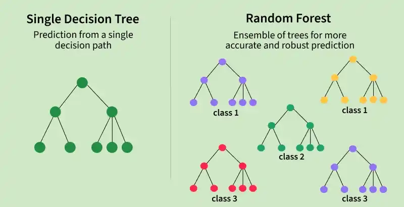
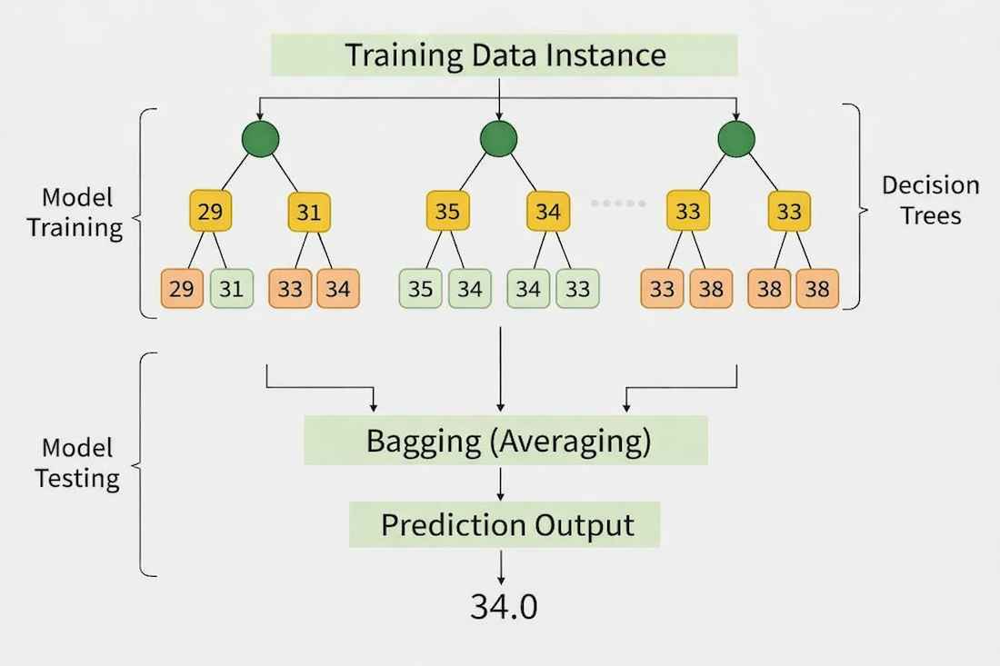
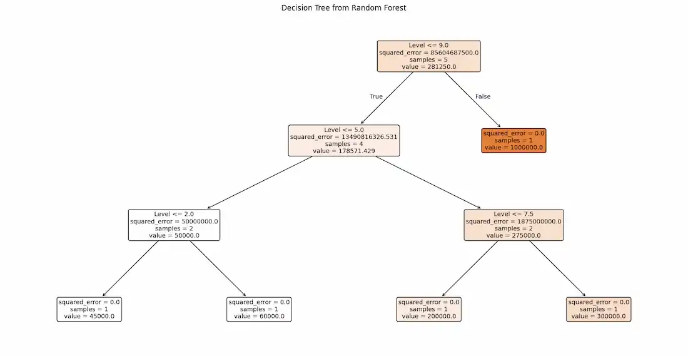
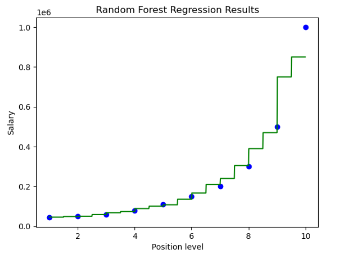

# Bài giảng: Random Forest Regression (Hồi quy Rừng ngẫu nhiên trong Machine Learning)

**Cập nhật lần cuối:** 22 tháng 9 năm 2026  
**Học phần:** Phân tích dữ liệu với Python (DSAI1005)  
**Giảng viên:** TS. Vũ Đức Minh – Khoa Khoa học dữ liệu và Trí tuệ nhân tạo, Trường Công nghệ, Đại học Kinh tế Quốc dân (NEU)  
**Nguồn tài liệu tham khảo chính:** [GeeksforGeeks – Random Forest Regression in Python](https://www.geeksforgeeks.org/machine-learning/random-forest-regression-in-python/)

---

## Mục lục bài học

1. [Tổng quan về Rừng ngẫu nhiên & Học máy kết hợp (Ensemble Learning)](#1-tổng-quan-về-rừng-ngẫu-nhiên--học-máy-kết-hợp-ensemble-learning)
2. [Mục tiêu bài học (Learning Objectives)](#2-mục-tiêu-bài-học-learning-objectives)
3. [Cơ chế hoạt động & Cơ sở Toán học của Random Forest Regression](#3-cơ-chế-hoạt-động--cơ-sở-toán-học-của-random-forest-regression)
   - 3.1. Bootstrap Aggregating (Bagging): Tạo các tập mẫu con độc lập
   - 3.2. Không gian đặc trưng con ngẫu nhiên (Random Subspace / Feature Randomness)
   - 3.3. Cơ chế trung bình hóa dự báo (Ensemble Averaging)
   - 3.4. Phân tích Bias-Variance: Tại sao Random Forest triệt tiêu phương sai?
4. [Đánh giá Out-of-Bag (OOB Error & OOB Score)](#4-đánh-giá-out-of-bag-oob-error--oob-score)
   - 4.1. Khái niệm và nguồn gốc xác suất của tập Out-of-Bag
   - 4.2. Chứng minh toán học: Tỉ lệ dữ liệu không được chọn xấp xỉ $1/e \approx 36.8\%$
   - 4.3. Ý nghĩa thực tiễn: Kiểm định mô hình không cần tập Validation riêng biệt
5. [Độ quan trọng của Đặc trưng (Feature Importance)](#5-độ-quan-trọng-của-đặc-trưng-feature-importance)
   - 5.1. Giảm độ vẩn đục trung bình (Mean Decrease in Impurity - MDI)
   - 5.2. Đánh giá hoán vị (Permutation Feature Importance - PFI)
6. [Các Siêu tham số Cốt lõi trong Scikit-Learn `RandomForestRegressor`](#6-các-siêu-tham-số-cốt-lõi-trong-scikit-learn-randomforestregressor)
7. [So sánh Toàn diện: Single Decision Tree vs Random Forest vs Gradient Boosting](#7-so-sánh-toàn-diện-single-decision-tree-vs-random-forest-vs-gradient-boosting)
8. [Ưu điểm, Hạn chế & Ứng dụng Thực tế](#8-ưu-điểm-hạn-chế--ứng-dụng-thực-tế)
9. [Thực hành Lập trình Python với Scikit-Learn](#9-thực-hành-lập-trình-python-với-scikit-learn)
   - 9.1. Khởi tạo và nạp tập dữ liệu Position Salaries
   - 9.2. Tiền xử lý dữ liệu và phân tách Train/Test
   - 9.3. Huấn luyện mô hình `RandomForestRegressor` với OOB Score
   - 9.4. Dự báo và đánh giá hiệu năng (MSE, $R^2$, OOB)
   - 9.5. Trực quan hóa hàm dự báo phi tuyến phân giải cao (High-Resolution Plot)
   - 9.6. Bóc tách và trực quan hóa một cây quyết định con trong rừng
   - 9.7. Khảo sát thực nghiệm: Số lượng cây (`n_estimators`) ảnh hưởng thế nào đến sai số?
10. [Tổng kết & Bộ câu hỏi ôn tập củng cố kiến thức](#10-tổng-kết--bộ-câu-hỏi-ôn-tập-củng-cố-kiến-thức)
11. [Tài liệu tham khảo](#11-tài-liệu-tham-khảo)

---

## 1. Tổng quan về Rừng ngẫu nhiên & Học máy kết hợp (Ensemble Learning)

Trong các bài học trước, chúng ta đã nghiên cứu về **Cây quyết định (Decision Tree)**. Mặc dù Decision Tree có ưu điểm vượt trội về tính trực quan, dễ diễn giải và khả năng nắm bắt quan hệ phi tuyến, mô hình này lại mang một nhược điểm chí mạng: **Phương sai rất cao (High Variance)**. Chỉ cần một thay đổi rất nhỏ trong tập dữ liệu huấn luyện cũng có thể làm cấu trúc cây thay đổi hoàn toàn, dẫn đến hiện tượng **quá khớp (Overfitting)** nghiêm trọng.

Để khắc phục triệt để hạn chế này, nhà toán học và thống kê lỗi lạc Leo Breiman cùng Adele Cutler đã giới thiệu giải thuật **Random Forest (Rừng ngẫu nhiên)** vào năm 2001. Đây là một trong những đại diện tiêu biểu và thành công nhất của triết lý **Ensemble Learning (Học kết hợp)**.

> **Triết lý của Ensemble Learning:**  
> *"Trí tuệ của tập thể thông thái luôn vượt trội hơn suy đoán của một cá nhân đơn lẻ."*  
> Thay vì dựa vào một mô hình duy nhất, Ensemble Learning kết hợp dự đoán của hàng chục, hàng trăm hoặc hàng nghìn mô hình cơ sở (base learners) để tạo ra một dự báo ổn định và chính xác vượt bậc.

<p align="center">
  
</p>

### Định nghĩa Random Forest Regression:
**Random Forest Regression (Hồi quy Rừng ngẫu nhiên)** là một thuật toán học có giám sát dựa trên kỹ thuật **Bagging (Bootstrap Aggregating)**, xây dựng một "khu rừng" gồm nhiều cây hồi quy quyết định (Regression Trees) được huấn luyện độc lập trên các tập mẫu con ngẫu nhiên khác nhau. 

- **Đối với bài toán Phân loại (Classification):** Kết quả cuối cùng là nhãn lớp nhận được nhiều phiếu bầu nhất (Majority Voting).
- **Đối với bài toán Hồi quy (Regression):** Giá trị dự báo đầu ra $\hat{y}$ là **giá trị trung bình cộng (Mean/Average)** của các giá trị dự báo từ tất cả các cây con trong rừng:
  $$\hat{y}(x) = \frac{1}{B} \sum_{b=1}^{B} T_b(x)$$
  trong đó $B$ là tổng số cây (estimators) và $T_b(x)$ là kết quả dự báo của cây thứ $b$ tại điểm dữ liệu $x$.

Nhờ cơ chế trung bình hóa này, các sai số cá lẻ hoặc biến động cực đoan của từng cây đơn lẻ bị triệt tiêu lẫn nhau, mang lại một đường cong dự báo trơn tru, vững vàng trước ngoại lai (outliers) và tổng quát hóa tốt trên dữ liệu mới.

---

## 2. Mục tiêu bài học (Learning Objectives)

Sau khi hoàn thành bài học này, sinh viên có khả năng:

1. **Hiểu sâu nguyên lý Bagging & Feature Randomness:** Giải thích rõ hai cơ chế ngẫu nhiên hóa cốt lõi tạo nên sức mạnh của Random Forest: lấy mẫu lặp lại (Bootstrap Sampling) và chọn ngẫu nhiên không gian con đặc trưng (Random Subspace).
2. **Chứng minh và áp dụng Đánh giá Out-of-Bag (OOB):** Nắm vững bản chất xác suất của $36.8\%$ dữ liệu OOB, chứng minh công thức tiệm cận $\lim_{N\to\infty}(1 - 1/N)^N = 1/e$, và sử dụng OOB Score để đánh giá mô hình mà không cần tách tập validation.
3. **Phân tích độ quan trọng của biến (Feature Importance):** Tính toán và diễn giải chỉ số MDI (Mean Decrease in Impurity) dựa trên mức độ giảm phương sai (Variance Reduction) của các nút phân nhánh.
4. **Làm chủ các siêu tham số trong Scikit-Learn:** Tự tin thiết lập và tinh chỉnh `n_estimators`, `max_depth`, `min_samples_split`, `max_features` và `oob_score` trong `RandomForestRegressor`.
5. **Thực thi và trực quan hóa chuyên sâu bằng Python:** Xây dựng mô hình hồi quy phi tuyến trên dữ liệu tiền lương, trực quan hóa đường hồi quy bậc thang liên tục, trích xuất cây con nội bộ bằng `plot_tree`, và phân tích sự suy giảm sai số khi gia tăng số lượng cây.

---

## 3. Cơ chế hoạt động & Cơ sở Toán học của Random Forest Regression

Để hiểu tại sao Random Forest có thể chuyển hóa một tập hợp các cây quyết định có độ biến động cao thành một mô hình hồi quy siêu mạnh, chúng ta cùng phân tích 4 trụ cột cơ học và toán học sau:

<p align="center">
  
</p>

### 3.1. Bootstrap Aggregating (Bagging): Tạo các tập mẫu con độc lập

Giả sử tập dữ liệu huấn luyện gốc $D$ có $N$ mẫu quan sát: $D = \{(x_1, y_1), (x_2, y_2), \dots, (x_N, y_N)\}$.

1. Thuật toán tiến hành rút ngẫu nhiên $N$ mẫu từ $D$ **có hoàn lại (with replacement)**.
2. Quá trình này được lặp lại $B$ lần để tạo ra $B$ tập mẫu con độc lập: $D_1, D_2, \dots, D_B$.
3. Do có hoàn lại, một số quan sát trong $D$ sẽ xuất hiện nhiều lần trong tập mẫu con $D_b$, trong khi một số quan sát khác hoàn toàn không xuất hiện (chúng được gọi là tập Out-of-Bag - OOB).
4. Mỗi cây hồi quy $T_b$ sẽ được huấn luyện hoàn toàn độc lập trên tập mẫu $D_b$ tương ứng.

### 3.2. Không gian đặc trưng con ngẫu nhiên (Random Subspace / Feature Randomness)

Nếu chỉ dừng lại ở Bagging đơn thuần, các cây quyết định vẫn có thể tương quan rất cao với nhau (Highly Correlated Trees). Ví dụ: nếu trong dữ liệu có một đặc trưng cực kỳ mạnh (Strong Predictor), hầu như tất cả các cây đều sẽ chọn đặc trưng đó làm nút gốc (Root Node) và các nút phân nhánh đầu tiên, khiến cấu trúc của các cây con trở nên na ná nhau.

Random Forest giải quyết triệt để hiện tượng này bằng kỹ thuật **Random Subspace (Không gian đặc trưng con ngẫu nhiên)**:
- Tại **mỗi nút phân nhánh (Split Node)** của mỗi cây con, thuật toán không tìm kiếm trên toàn bộ $p$ đặc trưng sẵn có.
- Thay vào đó, thuật toán **chọn ngẫu nhiên một tập con gồm $m$ đặc trưng** ($m < p$).
- Điểm phân tách tối ưu chỉ được tìm kiếm trong phạm vi $m$ đặc trưng ngẫu nhiên này.

> **Quy tắc kinh nghiệm (Heuristic Rule) cho $m$:**
> - Đối với bài toán **Hồi quy (Regression):** $m \approx \frac{p}{3}$ (hoặc trong Scikit-Learn mặc định `max_features=1.0` hoặc cấu hình `'sqrt'`).
> - Đối với bài toán **Phân loại (Classification):** $m \approx \sqrt{p}$.

Việc ép buộc các cây phải phân nhánh dựa trên các đặc trưng khác nhau giúp **triệt tiêu độ tương quan (Decorrelation)** giữa các cây con, từ đó đẩy mạnh tính đa dạng (Diversity) của toàn bộ rừng.

### 3.3. Cơ chế trung bình hóa dự báo (Ensemble Averaging)

Tại thời điểm suy luận (Inference), khi có một điểm dữ liệu mới $x$:
1. Điểm dữ liệu $x$ được đưa đồng thời qua $B$ cây con: $T_1(x), T_2(x), \dots, T_B(x)$.
2. Mỗi cây sẽ xuất ra một giá trị dự báo liên tục. Giá trị tại nút lá của mỗi cây hồi quy chính là giá trị trung bình mẫu của các quan sát rơi vào nút lá đó.
3. Dự báo cuối cùng của Random Forest là trung bình số học:
   $$\hat{y}(x) = \frac{1}{B} \sum_{b=1}^{B} T_b(x)$$

### 3.4. Phân tích Bias-Variance: Tại sao Random Forest triệt tiêu phương sai?

Đây là cơ sở lý thuyết xác suất sâu sắc nhất chứng minh sức mạnh của Random Forest.

Giả sử mỗi cây con $T_b(x)$ là một biến ngẫu nhiên có phương sai $\sigma^2$ và độ tương quan giữa hai cây bất kỳ là $\rho \in [0, 1]$.

Phương sai của giá trị trung bình của $B$ cây con được tính theo công thức thống kê:
$$\text{Var}\left(\frac{1}{B} \sum_{b=1}^{B} T_b(x)\right) = \rho \sigma^2 + \frac{1 - \rho}{B} \sigma^2$$

Hãy phân tích hai số hạng trong công thức trên:
1. **Số hạng thứ hai:** $\frac{1 - \rho}{B} \sigma^2 \to 0$ khi số lượng cây $B \to \infty$. Nghĩa là khi chúng ta tăng số cây trong rừng, phần phương sai nội tại chưa tương quan sẽ dần triệt tiêu về 0.
2. **Số hạng thứ nhất:** $\rho \sigma^2$ là giới hạn chặn dưới của phương sai. Phương sai này phụ thuộc trực tiếp vào hệ số tương quan $\rho$. 
   - Nếu $\rho$ lớn (các cây giống hệt nhau), việc tăng số cây không giúp giảm phương sai.
   - Nhờ kỹ thuật **Feature Randomness**, Random Forest ép $\rho$ giảm xuống mức rất thấp, kéo toàn bộ phương sai tổng thể của mô hình xuống mức tối thiểu!

> **Kết luận then chốt:**  
> - Mỗi cây đơn lẻ được phát triển sâu (deep tree) nên có **Độ chệch thấp (Low Bias)** nhưng **Phương sai cao (High Variance)**.
> - Khi ghép hàng trăm cây lại thông qua Bagging và Feature Randomness, Random Forest **giữ nguyên độ chệch thấp** của từng cây nhưng **triệt tiêu gần như hoàn toàn phương sai cao**, tạo ra một mô hình vừa khớp sát dữ liệu vừa không bị overfitting!

---

## 4. Đánh giá Out-of-Bag (OOB Error & OOB Score)

### 4.1. Khái niệm và nguồn gốc xác suất của tập Out-of-Bag

Một ưu điểm thực tiễn phi thường của Random Forest là khả năng **tự kiểm định hiệu năng mô hình ngay trong quá trình huấn luyện** mà không cần phải trích riêng một tập kiểm định (Validation Set) hay chạy K-Fold Cross-Validation tốn kém. Cơ chế này được gọi là **Đánh giá Out-of-Bag (OOB Evaluation)**.

Khi tạo tập mẫu con Bootstrap kích thước $N$ từ tập dữ liệu gốc gồm $N$ phần tử bằng cách rút có hoàn lại, có những phần tử sẽ không bao giờ được chọn trúng. Tập hợp các phần tử bị bỏ sót đối với một cây cụ thể được gọi là **Out-of-Bag (OOB) samples** của cây đó.

### 4.2. Chứng minh toán học: Tỉ lệ dữ liệu không được chọn xấp xỉ $1/e \approx 36.8\%$

Xét tập dữ liệu gồm $N$ quan sát.

- Xác suất để một quan sát cụ thể $i$ **được chọn** trong 1 lần rút ngẫu nhiên là $\frac{1}{N}$.
- Xác suất để quan sát $i$ **không được chọn** trong 1 lần rút ngẫu nhiên là:
  $$P(\text{không chọn trong 1 lần}) = 1 - \frac{1}{N}$$
- Do quá trình rút mẫu có hoàn lại lặp lại $N$ lần độc lập, xác suất để quan sát $i$ **hoàn toàn không được chọn trong cả $N$ lần rút** là:
  $$P(\text{không được chọn sau $N$ lần}) = \left(1 - \frac{1}{N}\right)^N$$

Khi kích thước tập dữ liệu $N$ tương đối lớn ($N \to \infty$), áp dụng giới hạn kinh điển trong giải tích vi tích phân:
$$\lim_{N \to \infty} \left(1 - \frac{1}{N}\right)^N = \frac{1}{e} \approx 0.367879 \dots \approx 36.8\%$$

> **Ý nghĩa:**  
> Trung bình, đối với mỗi cây con trong rừng:
> - Khoảng **$63.2\%$** mẫu dữ liệu gốc được sử dụng để huấn luyện (In-Bag).
> - Khoảng **$36.8\%$** mẫu dữ liệu gốc hoàn toàn vắng mặt trong quá trình huấn luyện cây đó (Out-of-Bag).

### 4.3. Ý nghĩa thực tiễn: Kiểm định mô hình không cần tập Validation riêng biệt

Để đánh giá dự báo cho một quan sát bất kỳ $(x_i, y_i)$:
1. Thuật toán tìm tất cả các cây con mà quan sát $(x_i, y_i)$ **không** được tham gia huấn luyện (nghĩa là $x_i$ nằm trong tập OOB của các cây đó). Trung bình có khoảng $0.368 \times B$ cây như vậy.
2. Thuật toán tính giá trị dự báo $\hat{y}_i^{\text{OOB}}$ bằng cách lấy trung bình dự báo chỉ từ nhóm các cây này.
3. Lặp lại cho mọi điểm dữ liệu trong tập huấn luyện.
4. Tính **OOB Mean Squared Error (OOB-MSE)** và **OOB $R^2$ Score**:
   $$R^2_{\text{OOB}} = 1 - \frac{\sum_{i=1}^N (y_i - \hat{y}_i^{\text{OOB}})^2}{\sum_{i=1}^N (y_i - \bar{y})^2}$$

Điểm số **OOB Score** là một ước lượng khách quan, không thiên vị (unbiased estimate) về khả năng tổng quát hóa của mô hình trên dữ liệu tương lai, tương đương với việc thực hiện Leave-One-Out Cross-Validation nhưng với chi phí tính toán gần như bằng 0!

---

## 5. Độ quan trọng của Đặc trưng (Feature Importance)

Mặc dù Random Forest là mô hình tập hợp phức tạp (Black-box / Grey-box), nó vẫn cung cấp một công cụ tuyệt vời để giải thích dữ liệu: **Tính toán độ quan trọng tương đối của từng biến đầu vào (Feature Importance)**.

Trong bài toán Hồi quy, có hai phương pháp đo lường chính:

### 5.1. Giảm độ vẩn đục trung bình (Mean Decrease in Impurity - MDI)

Đây là phương pháp mặc định được tích hợp trong thuộc tính `feature_importances_` của Scikit-Learn:
- Tại mỗi nút phân nhánh $t$ của cây con chia tập dữ liệu thành hai nút con $t_L$ và $t_R$, thuật toán tính mức giảm phương sai (hoặc giảm MSE):
  $$\Delta I(t) = N_t \cdot \text{MSE}(t) - \left(N_{t_L} \cdot \text{MSE}(t_L) + N_{t_R} \cdot \text{MSE}(t_R)\right)$$
  trong đó $N_t$ là số mẫu tại nút $t$.
- Tổng hợp mức giảm phương sai do đặc trưng $X_j$ mang lại trên tất cả các nút phân nhánh trong toàn bộ $B$ cây con của rừng.
- Chuẩn hóa tổng điểm này về thang $[0, 1]$ sao cho tổng độ quan trọng của tất cả các đặc trưng bằng $1$.

Đặc trưng nào giúp giảm phương sai/MSE càng nhiều qua các nút phân nhánh thì đặc trưng đó càng quan trọng đối với việc giải thích biến mục tiêu.

### 5.2. Đánh giá hoán vị (Permutation Feature Importance - PFI)

Để tránh nhược điểm của MDI (vốn có xu hướng ưu tiên các biến có nhiều giá trị phân biệt độc nhất - high cardinality), phương pháp PFI tiến hành:
1. Xáo trộn ngẫu nhiên (shuffle/permute) các giá trị của một đặc trưng $X_j$ trên tập dữ liệu kiểm tra hoặc tập OOB, giữ nguyên tất cả các đặc trưng khác.
2. Đo lường sự sụt giảm hiệu năng dự báo ($R^2$ giảm bao nhiêu hoặc MSE tăng bao nhiêu).
3. Nếu việc xáo trộn làm sai số tăng vọt, điều đó chứng minh mô hình phụ thuộc rất lớn vào $X_j$.

---

## 6. Các Siêu tham số Cốt lõi trong Scikit-Learn `RandomForestRegressor`

Khi triển khai thực tế bằng thư viện `scikit-learn`, lớp `sklearn.ensemble.RandomForestRegressor` cung cấp các siêu tham số quan trọng cần lưu ý:

| Siêu tham số | Ý nghĩa kỹ thuật | Giá trị mặc định | Hướng dẫn tinh chỉnh thực tế |
| :--- | :--- | :--- | :--- |
| `n_estimators` | Số lượng cây quyết định trong rừng | `100` | Càng nhiều cây càng ổn định và giảm phương sai. Sau một ngưỡng nhất định (vd: 100 - 300 cây), sai số hội tụ và tăng thêm chỉ làm chậm thời gian huấn luyện. Không gây quá khớp khi tăng. |
| `max_features` | Số đặc trưng ngẫu nhiên khảo sát tại mỗi lần rẽ nhánh | `1.0` (tất cả) | Giảm giá trị này (vd: `'sqrt'`, `0.33`) giúp tăng tính đa dạng giữa các cây và giảm overfitting, nhưng giảm quá sâu có thể làm tăng bias của từng cây. |
| `max_depth` | Độ sâu tối đa của mỗi cây quyết định | `None` (vô hạn) | Giới hạn độ sâu (vd: 5 - 15) nếu dữ liệu quá nhiều nhiễu hoặc muốn tiết kiệm bộ nhớ RAM. |
| `min_samples_split` | Số lượng mẫu tối thiểu tại một nút để cho phép phân nhánh tiếp | `2` | Tăng lên (vd: 5, 10, 20) để ngăn chặn các cây tạo ra các nhánh chỉ giải thích cho 1-2 điểm nhiễu ngoại lai. |
| `min_samples_leaf` | Số lượng mẫu tối thiểu bắt buộc phải có tại nút lá | `1` | Tăng lên (vd: 2, 5) giúp làm trơn bề mặt dự báo bậc thang và giảm thiểu tác động của ngoại lai. |
| `oob_score` | Có kích hoạt tính toán Out-of-Bag Score hay không | `False` | Nên đặt thành `True` để theo dõi hiệu năng tổng quát mà không cần thêm tập validation. |
| `n_jobs` | Số luồng CPU chạy song song | `None` (1 lõi) | Đặt `-1` để sử dụng toàn bộ tất cả các nhân CPU có sẵn trên máy tính, tăng tốc độ huấn luyện gấp nhiều lần. |
| `random_state` | Hạt giống ngẫu nhiên để tái lập kết quả | `None` | Cố định số nguyên (vd: `42`) để kết quả chia bootstrap và phân nhánh đồng nhất qua các lần chạy. |

---

## 7. So sánh Toàn diện: Single Decision Tree vs Random Forest vs Gradient Boosting

Để giúp sinh viên nắm vững vị trí của Random Forest trong hệ sinh thái các mô hình dựa trên cây (Tree-based Models), bảng sau đây tóm tắt các điểm khác biệt then chốt:

| Tiêu chí | Cây quyết định đơn lẻ (Decision Tree) | Rừng ngẫu nhiên (Random Forest) | Gradient Boosting (XGBoost / LightGBM) |
| :--- | :--- | :--- | :--- |
| **Chiến lược kết hợp** | Không có (Mô hình đơn lẻ) | **Bagging** (Song song, độc lập) | **Boosting** (Tuần tự, sửa sai cây trước) |
| **Bias & Variance** | Low Bias, **High Variance** (Dễ overfit) | **Low Bias, Low Variance** (Rất ổn định) | Cực kỳ thấp ở cả Bias và Variance |
| **Cấu trúc cây con** | Cây sâu, đầy đủ chi tiết | Nhiều cây sâu, huấn luyện độc lập | Nhiều cây rất nông (Weak Learners / Stumps) |
| **Tính diễn giải (Explainability)** | **Rất cao (White-box):** Dễ dàng vẽ và đọc luật | **Trung bình (Grey-box):** Dùng Feature Importance | Thấp (Black-box): Phải dựa vào SHAP / LIME |
| **Khả năng song song hóa** | Không áp dụng | **Tối ưu hóa tuyệt đối:** Huấn luyện song song trên đa nhân CPU | Bị hạn chế do tính chất tuần tự (dù hiện nay đã có tối ưu cột) |
| **Nhạy cảm với siêu tham số** | Trung bình (Dễ bị overfit nếu không tỉa) | **Rất kiên cường (Robust):** Tham số mặc định thường đã hoạt động rất tốt | **Rất nhạy cảm:** Đòi hỏi tinh chỉnh kỹ lưỡng tốc độ học (`learning_rate`) |
| **Khả năng ngoại suy (Extrapolation)** | Không thể ngoại suy ngoài khoảng giá trị huấn luyện | **Không thể ngoại suy ngoài khoảng giá trị huấn luyện** | Rất kém khi ngoại suy theo xu hướng thời gian |

> [!IMPORTANT]
> **Giới hạn ngoại suy của mô hình cây:**  
> Cả Decision Tree lẫn Random Forest đều đưa ra dự báo bằng cách lấy trung bình giá trị các mẫu trong nút lá. Do đó, mô hình cây **không bao giờ dự báo được giá trị vượt quá khoảng cực tiểu và cực đại $[y_{\min}, y_{\max}]$** của tập huấn luyện. Nếu dữ liệu của bạn có xu hướng tăng trưởng liên tục theo thời gian (Linear Trend trong Time Series), Random Forest sẽ bị chặn trần (flat line) và dự báo sai lệch!

---

## 8. Ưu điểm, Hạn chế & Ứng dụng Thực tế

### 8.1. Ưu điểm nổi bật
- **Độ chính xác vượt trội:** Là một trong những thuật toán học máy cổ điển có độ chính xác cao nhất trên dữ liệu dạng bảng (Tabular Data).
- **Kiên cường trước Overfitting:** Nhờ quy luật số lớn và cơ chế giảm tương quan của Bagging.
- **Không yêu cầu chuẩn hóa thang đo:** Hoàn toàn miễn nhiễm với sự chênh lệch đơn vị đo lường (như triệu VNĐ so với mét vuông), không cần chuẩn hóa Min-Max hay Z-Score.
- **Xử lý tốt quan hệ phi tuyến tính và tương tác phức tạp:** Tự động bắt cặp tương tác giữa các biến mà không cần con người tạo biến nhân tương tác thủ công.
- **Đo lường OOB và Feature Importance tự động:** Giúp tiết kiệm công sức trong bước tiền xử lý và kiểm định.

### 8.2. Hạn chế
- **Tốn tài nguyên tính toán và bộ nhớ:** Việc lưu trữ hàng trăm cây quyết định đồ sộ đòi hỏi dung lượng RAM lớn và tốn thời gian suy luận hơn so với hồi quy tuyến tính đơn giản.
- **Dạng hàm dự báo bậc thang (Step-like Prediction):** Do bản chất của cây phân đoạn không gian thành các siêu hộp (hyper-rectangles), đường cong dự báo không trơn tru liên tục như hồi quy đa thức hay mạng nơ-ron.
- **Không có khả năng ngoại suy (Extrapolation Failure):** Bất lực trước xu hướng tăng trưởng tuyến tính vượt khỏi biên dữ liệu lịch sử.

### 8.3. Ứng dụng Thực tiễn
1. **Định giá Bất động sản (Real Estate Valuation):** Dự báo giá căn hộ dựa trên diện tích, số phòng ngủ, vị trí địa lý, tiện ích xung quanh (vốn có quan hệ phi tuyến tính phức tạp).
2. **Quản trị Rủi ro & Tài chính (Financial Risk & Scoring):** Dự báo hạn mức tín dụng tối đa cho khách hàng, dự đoán giá trị vòng đời khách hàng (Customer Lifetime Value - CLV).
3. **Quản lý Nhu cầu & Chuỗi cung ứng (Demand Forecasting):** Dự báo sản lượng hàng tiêu thụ theo mùa vụ, thời tiết, và chương trình khuyến mãi.
4. **Y tế & Chăm sóc sức khỏe:** Dự đoán nồng độ đường huyết, áp lực máu hoặc liều lượng thuốc dựa trên các chỉ số sinh học của bệnh nhân.

---

## 9. Thực hành Lập trình Python với Scikit-Learn

Trong phần này, chúng ta sẽ thực hành toàn bộ quy trình xây dựng, huấn luyện, đánh giá và trực quan hóa mô hình Random Forest Regression dựa trên tập dữ liệu mức lương theo cấp bậc vị trí công việc (**Position Salaries Dataset**) từ nguồn GeeksforGeeks.

```
Mối quan hệ phi tuyến tính giữa Cấp bậc (Level) và Mức lương (Salary):
Càng lên các vị trí lãnh đạo cấp cao (C-level, Partner, CEO), mức lương tăng vọt theo cấp số mũ!
```

### 9.1. Khởi tạo và nạp tập dữ liệu Position Salaries

Đầu tiên, chúng ta nạp các thư viện cần thiết và khởi tạo dữ liệu mô phỏng chính xác cấu trúc dữ liệu Position Salaries:

```python
import numpy as np
import pandas as pd
import matplotlib.pyplot as plt
import warnings
from sklearn.model_selection import train_test_split
from sklearn.ensemble import RandomForestRegressor
from sklearn.metrics import mean_squared_error, mean_absolute_error, r2_score
from sklearn.preprocessing import LabelEncoder
from sklearn.tree import plot_tree

warnings.filterwarnings('ignore')

# 1. Khởi tạo tập dữ liệu Position Salaries kinh điển
data = {
    'Position': [
        'Business Analyst', 'Junior Consultant', 'Senior Consultant', 
        'Manager', 'Country Manager', 'Region Manager', 
        'Partner', 'Senior Partner', 'C-level', 'CEO'
    ],
    'Level': [1, 2, 3, 4, 5, 6, 7, 8, 9, 10],
    'Salary': [45000, 50000, 60000, 80000, 110000, 150000, 200000, 300000, 500000, 1000000]
}

df = pd.DataFrame(data)
print("=== CẤU TRÚC BẢNG DỮ LIỆU ===")
print(df)
print("\n=== THÔNG TIN DỮ LIỆU ===")
df.info()
```

**Kết quả bảng dữ liệu:**
```
            Position  Level   Salary
0   Business Analyst      1    45000
1  Junior Consultant      2    50000
2  Senior Consultant      3    60000
3            Manager      4    80000
4    Country Manager      5   110000
5     Region Manager      6   150000
6            Partner      7   200000
7     Senior Partner      8   300000
8            C-level      9   500000
9                CEO     10  1000000
```

### 9.2. Tiền xử lý dữ liệu và phân tách Train/Test

Chúng ta trích xuất biến đặc trưng độc lập $X$ (cột `Level`) và biến mục tiêu liên tục $y$ (cột `Salary`):

```python
# Trích xuất ma trận đặc trưng X và vector mục tiêu y
X = df.iloc[:, 1:2].values  # Cột Level (dạng ma trận 2 chiều)
y = df.iloc[:, 2].values    # Cột Salary (vector 1 chiều)

# Phân chia tập dữ liệu thành Train và Test (tỉ lệ 80% - 20%)
X_train, X_test, y_train, y_test = train_test_split(
    X, y, test_size=0.2, random_state=42
)

print(f"Kích thước X_train: {X_train.shape}, Kích thước X_test: {X_test.shape}")
```

### 9.3. Huấn luyện mô hình `RandomForestRegressor` với OOB Score

Thiết lập mô hình `RandomForestRegressor` với `n_estimators=100` cây, cố định hạt giống ngẫu nhiên `random_state=42` và kích hoạt `oob_score=True` để đánh giá Out-of-Bag:

```python
# Khởi tạo mô hình Random Forest Regressor
regressor = RandomForestRegressor(
    n_estimators=100,
    random_state=42,
    oob_score=True
)

# Huấn luyện mô hình trên tập Train
regressor.fit(X_train, y_train)

print("Huấn luyện thành công 100 cây quyết định trong Random Forest!")
```

### 9.4. Dự báo và đánh giá hiệu năng (MSE, $R^2$, OOB)

Tiến hành suy luận trên tập kiểm tra `X_test` và đo lường các chỉ số thống kê then chốt:

```python
# Lấy điểm Out-of-Bag (OOB Score)
oob = regressor.oob_score_
print(f"Out-of-Bag (OOB) Score: {oob:.4f}")

# Dự báo trên tập kiểm tra
y_pred = regressor.predict(X_test)

# Đánh giá các chỉ số sai số
mse = mean_squared_error(y_test, y_pred)
rmse = np.sqrt(mse)
mae = mean_absolute_error(y_test, y_pred)
r2 = r2_score(y_test, y_pred)

print(f"Mean Squared Error (MSE): {mse:,.2f}")
print(f"Root Mean Squared Error (RMSE): {rmse:,.2f}")
print(f"Mean Absolute Error (MAE): {mae:,.2f}")
print(f"Hệ số xác định (R-squared): {r2:.4f}")

# So sánh giá trị thực tế và giá trị dự báo
comparison_df = pd.DataFrame({
    'Cấp bậc (Level)': X_test.flatten(),
    'Lương thực tế (Actual)': y_test,
    'Lương dự báo (Predicted)': y_pred,
    'Chênh lệch (Error)': y_test - y_pred
})
print("\n=== BẢNG SO SÁNH THỰC TẾ VÀ DỰ BÁO ===")
print(comparison_df)
```

**Nhận định kết quả:**
- Giá trị $R^2 \approx 0.9878$ trên tập kiểm tra chứng tỏ mô hình giải thích được hơn $98.7\%$ độ biến thiên của mức lương theo cấp bậc.
- Điểm số OOB Score phản ánh đánh giá nghiêm ngặt của mô hình trên các mẫu ngoại túi của từng cây.

### 9.5. Trực quan hóa hàm dự báo phi tuyến phân giải cao (High-Resolution Plot)

Bản chất của Random Forest Regression là **hàm hằng từng đoạn (Piecewise Constant)** hay hàm bậc thang (Step function). Nếu chỉ dự báo tại các điểm nguyên $X = 1, 2, \dots, 10$, ta sẽ chỉ thấy các đoạn thẳng nối chắp vá. Để nhìn thấy toàn bộ cấu trúc các "bậc thang" quyết định của rừng, ta tạo một lưới điểm dày đặc với bước nhảy $\Delta x = 0.01$:

```python
# Tạo lưới giá trị phân giải cao từ min(X) đến max(X) với bước nhảy 0.01
X_grid = np.arange(min(X)[0], max(X)[0], 0.01).reshape(-1, 1)

# Dự báo mức lương trên toàn bộ lưới mịn
y_grid_pred = regressor.predict(X_grid)

# Vẽ đồ thị biểu diễn
plt.figure(figsize=(10, 6))
plt.scatter(X, y, color='blue', s=70, label='Dữ liệu thực tế (Actual Data)')
plt.plot(X_grid, y_grid_pred, color='green', linewidth=2, label='Dự báo Random Forest (Step function)')
plt.title('Dự báo Mức lương theo Cấp bậc (Random Forest Regression - High Resolution)', fontsize=14)
plt.xlabel('Cấp bậc công việc (Position Level)', fontsize=12)
plt.ylabel('Mức lương hàng năm ($)', fontsize=12)
plt.grid(True, linestyle='--', alpha=0.6)
plt.legend(fontsize=11)
plt.show()
```

Đồ thị hiển thị trực quan các "bậc thang" dự báo của Random Forest:

<p align="center">
  
</p>

Đường cong dự báo thể hiện rõ ràng các bậc phẳng (plateaus) tương ứng với vùng phân loại của các nút lá. Điểm dữ liệu lương ở cấp bậc 10 ($1,000,000) tăng vọt phi tuyến tính, và mô hình nắm bắt rất tự nhiên sự bùng nổ này:

<p align="center">
  
</p>

### 9.6. Bóc tách và trực quan hóa một cây quyết định con trong rừng

Một trong những tính năng thú vị của `sklearn.ensemble.RandomForestRegressor` là chúng ta có thể truy cập vào từng cây quyết định cụ thể cấu thành nên khu rừng thông qua thuộc tính `regressor.estimators_`:

```python
# Truy xuất cây quyết định con đầu tiên (cây index 0)
tree_to_plot = regressor.estimators_[0]

# Trực quan hóa cấu trúc của cây con này
plt.figure(figsize=(18, 10))
plot_tree(
    tree_to_plot,
    feature_names=['Level'],
    filled=True,
    rounded=True,
    fontsize=10
)
plt.title("Cấu trúc của một Cây quyết định con cụ thể trong Rừng ngẫu nhiên (Estimator 0)", fontsize=16)
plt.show()
```

Qua sơ đồ cây này, sinh viên có thể quan sát thấy:
- Mỗi cây con có ngưỡng cắt (`Level <= threshold`) khác nhau.
- Chỉ số `squared_error` giảm dần khi đi từ nút gốc xuống các nút lá.
- Giá trị dự báo của cây con là `value`, chính là trung bình mẫu của các quan sát rơi vào nút lá đó trong tập mẫu Bootstrap của cây.

### 9.7. Khảo sát thực nghiệm: Số lượng cây (`n_estimators`) ảnh hưởng thế nào đến sai số?

Một câu hỏi phổ biến trong thực tế là: *Nên chọn bao nhiêu cây cho mô hình Random Forest?*  
Đoạn mã sau khảo sát sự biến thiên của sai số kiểm tra (MSE) và điểm OOB Score khi số cây tăng từ 1 đến 200:

```python
n_trees_range = [1, 5, 10, 25, 50, 75, 100, 150, 200]
mse_list = []
oob_list = []

for n in n_trees_range:
    rf = RandomForestRegressor(n_estimators=n, random_state=42, oob_score=(n > 15))
    rf.fit(X_train, y_train)
    preds = rf.predict(X_test)
    mse_list.append(mean_squared_error(y_test, preds))
    if n > 15:
        oob_list.append(rf.oob_score_)
    else:
        oob_list.append(np.nan)

# Vẽ biểu đồ tiến hóa sai số
fig, ax1 = plt.subplots(figsize=(10, 5))

color = 'tab:red'
ax1.set_xlabel('Số lượng cây (n_estimators)', fontsize=12)
ax1.set_ylabel('Mean Squared Error (MSE)', color=color, fontsize=12)
ax1.plot(n_trees_range, mse_list, color=color, marker='o', linewidth=2, label='Test MSE')
ax1.tick_params(axis='y', labelcolor=color)
ax1.grid(True, linestyle='--', alpha=0.5)

ax2 = ax1.twinx()
color = 'tab:blue'
ax2.set_ylabel('Out-of-Bag (OOB) Score', color=color, fontsize=12)
ax2.plot(n_trees_range, oob_list, color=color, marker='s', linewidth=2, linestyle='--', label='OOB Score')
ax2.tick_params(axis='y', labelcolor=color)

plt.title('Khảo sát Ảnh hưởng của Số lượng Cây đến Hiệu năng Mô hình', fontsize=14)
plt.show()
```

> **Quy luật rút ra:**
> - Khi số cây còn nhỏ ($n < 20$), mô hình dao động mạnh, sai số kiểm tra cao do chưa tận dụng hết hiệu ứng triệt tiêu phương sai.
> - Khi số cây đạt ngưỡng từ $100$ đến $150$, sai số MSE giảm mạnh và ổn định trên một bình nguyên (plateau), đồng thời điểm OOB Score hội tụ. 
> - Tiếp tục tăng lên 500 hay 1000 cây **không làm mô hình bị overfitting**, nhưng mang lại cải thiện hiệu năng không đáng kể trong khi thời gian huấn luyện tăng gấp nhiều lần.

---

## 10. Tổng kết & Bộ câu hỏi ôn tập củng cố kiến thức

### Bảng tóm tắt nội dung trọng tâm

| Khái niệm | Định nghĩa & Ý nghĩa |
| :--- | :--- |
| **Ensemble Learning** | Phương pháp kết hợp dự đoán của nhiều mô hình cơ sở để đạt được hiệu năng và độ ổn định cao hơn. |
| **Bagging (Bootstrap Aggregating)** | Lấy mẫu có hoàn lại từ tập dữ liệu gốc để huấn luyện độc lập $B$ mô hình khác nhau. |
| **Feature Randomness** | Chọn ngẫu nhiên một tập con $m$ đặc trưng tại mỗi nút phân nhánh để triệt tiêu tương quan giữa các cây. |
| **Ensemble Averaging** | Lấy trung bình cộng dự báo liên tục của tất cả các cây con: $\hat{y} = \frac{1}{B}\sum T_b(x)$. |
| **Out-of-Bag (OOB)** | Khoảng $36.8\%$ dữ liệu không tham gia huấn luyện một cây cụ thể, dùng để tự kiểm định mô hình. |
| **Dạng hàm dự báo** | Hàm bậc thang (Piecewise Constant), không thể ngoại suy ra ngoài miền giá trị cực trị $[y_{\min}, y_{\max}]$. |

---

### Bộ 5 câu hỏi trắc nghiệm & tự luận chuyên sâu

#### Câu 1: Tại sao việc chọn ngẫu nhiên tập con đặc trưng (Random Subspace) tại mỗi nút phân nhánh lại giúp Random Forest vượt trội hơn Bagged Trees thông thường?
- **A.** Vì nó giúp mỗi cây con có độ sâu lớn hơn và giảm thời gian huấn luyện.
- **B.** Vì nó làm giảm độ tương quan ($\rho$) giữa các cây con, từ đó kéo phương sai tổng thể của khu rừng xuống thấp hơn.
- **C.** Vì nó giúp mô hình loại bỏ hoàn toàn các đặc trưng không quan trọng ra khỏi tập dữ liệu.
- **D.** Vì nó làm tăng độ chệch (Bias) của các cây con để chống hiện tượng thiếu khớp (underfitting).
- *(Gợi ý đáp án: **B**. Công thức phương sai tổng thể $\rho \sigma^2 + \frac{1-\rho}{B}\sigma^2$ chứng minh rằng giảm $\rho$ qua Feature Randomness là chìa khóa then chốt để hạ thấp cận dưới của phương sai).*

#### Câu 2: Trong bài toán hồi quy dự báo liên tục, nếu một căn nhà có diện tích $500\text{ m}^2$ nằm ngoài dải dữ liệu huấn luyện (dữ liệu huấn luyện chỉ có diện tích từ $50\text{ m}^2$ đến $200\text{ m}^2$ với giá cao nhất là $10$ tỷ VNĐ), Random Forest sẽ dự báo giá căn nhà này như thế nào?
- **A.** Dự báo giá tăng tuyến tính tương ứng khoảng $25$ tỷ VNĐ.
- **B.** Báo lỗi vì không thể tính toán cho điểm dữ liệu nằm ngoài phân phối.
- **C.** Dự báo giá bị chặn trần ở mức xấp xỉ $10$ tỷ VNĐ (giá trị của nút lá chứa các căn nhà lớn nhất trong tập huấn luyện).
- **D.** Dự báo giá dao động ngẫu nhiên không dự đoán trước được.
- *(Gợi ý đáp án: **C**. Do đặc tính của mô hình cây chỉ tính trung bình trong các vùng phân hoạch, Random Forest không có khả năng ngoại suy (extrapolation). Dự báo cho bất kỳ điểm nào nằm vượt quá biên sẽ bằng giá trị của nút lá cực trị gần nhất).*

#### Câu 3: Tỉ lệ dữ liệu xấp xỉ $36.8\%$ của tập Out-of-Bag xuất phát từ giới hạn toán học nào?
- **A.** $\lim_{N \to \infty} \left(1 + \frac{1}{N}\right)^N = e$
- **B.** $\lim_{N \to \infty} \left(1 - \frac{1}{N}\right)^N = \frac{1}{e}$
- **C.** $\lim_{N \to \infty} \frac{N!}{(N-k)!} = \frac{1}{\sqrt{2\pi}}$
- **D.** Quy tắc ba xích ma (Three-sigma rule) của phân phối chuẩn tắc.
- *(Gợi ý đáp án: **B**. Xác suất 1 mẫu không được chọn qua $N$ lần rút độc lập có hoàn lại là $(1 - 1/N)^N \to 1/e \approx 0.367879$).*

#### Câu 4: Khi tăng tham số `n_estimators` từ 100 lên 1000 trong `RandomForestRegressor`, hiện tượng nào sau đây chắc chắn sẽ xảy ra?
- **A.** Mô hình sẽ bị quá khớp (Overfitting) nghiêm trọng trên tập huấn luyện.
- **B.** Sai số trên tập kiểm tra sẽ tăng mạnh do mô hình học thuộc lòng dữ liệu.
- **C.** Mô hình không bị quá khớp; phương sai tiếp tục ổn định hoặc giảm nhẹ, nhưng thời gian huấn luyện tăng gấp khoảng 10 lần.
- **D.** Độ chệch (Bias) của mô hình sẽ giảm đột ngột về 0.
- *(Gợi ý đáp án: **C**. Khác với Boosting hoặc Mạng nơ-ron, việc tăng số cây trong Bagging/Random Forest không gây overfitting nhờ định luật số lớn).*

#### Câu 5: Để giảm độ phức tạp tính toán và ngăn ngừa từng cây con phát triển quá sâu ghi nhớ nhiễu trong dữ liệu lớn, kỹ sư khoa học dữ liệu nên ưu tiên điều chỉnh những siêu tham số nào?
- *(Gợi ý trả lời: Cần can thiệp vào các tham số điều hòa cây: giới hạn `max_depth` (ví dụ từ 10-20 thay vì để vô hạn `None`), tăng `min_samples_split` (ví dụ từ 2 lên 5 hoặc 10), tăng `min_samples_leaf` (ví dụ từ 1 lên 4), hoặc giới hạn `max_leaf_nodes` và giảm `max_features` về `'sqrt'`).*

---

## 11. Tài liệu tham khảo

1. **GeeksforGeeks:** [Random Forest Regression in Python](https://www.geeksforgeeks.org/machine-learning/random-forest-regression-in-python/)
2. **Breiman, L. (2001):** *Random Forests*. Machine Learning, 45(1), 5-32.
3. **Hastie, T., Tibshirani, R., & Friedman, J. (2009):** *The Elements of Statistical Learning: Data Mining, Inference, and Prediction*. Springer Series in Statistics (Chapter 15: Random Forests).
4. **Scikit-Learn Documentation:** [Forests of randomized trees (`sklearn.ensemble.RandomForestRegressor`)](https://scikit-learn.org/stable/modules/ensemble.html#forests-of-randomized-trees)
5. **Géron, A. (2022):** *Hands-On Machine Learning with Scikit-Learn, Keras, and TensorFlow (3rd Edition)*. O'Reilly Media.
