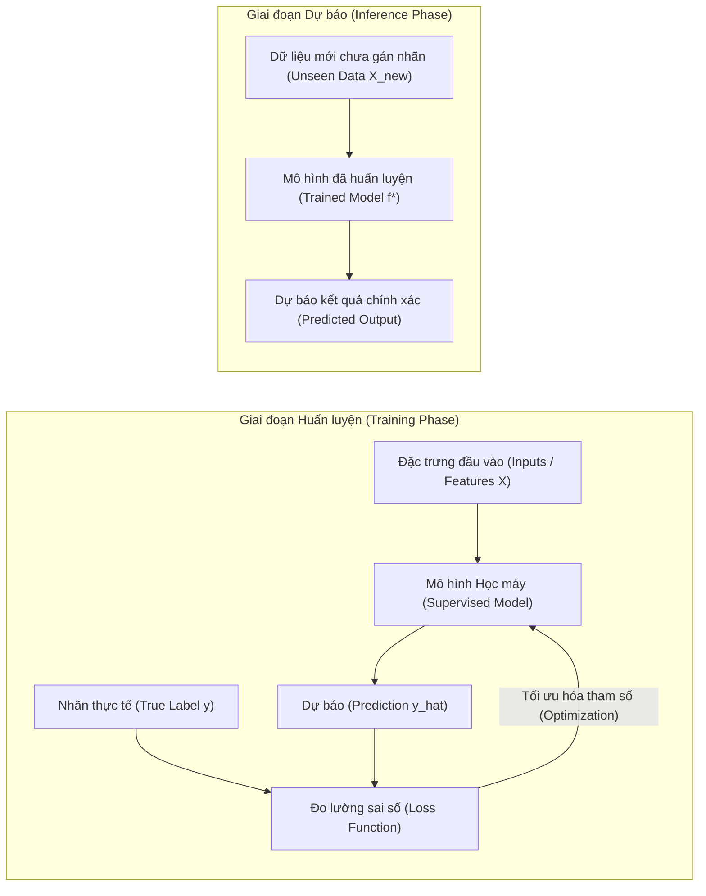
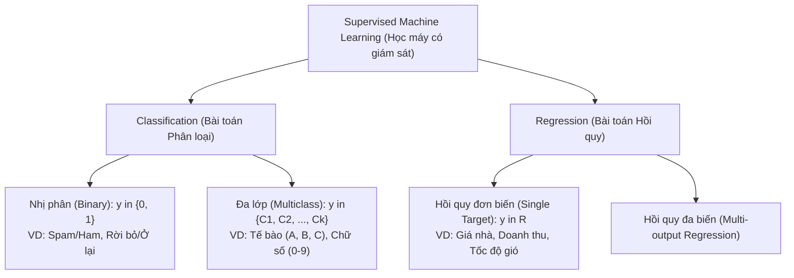
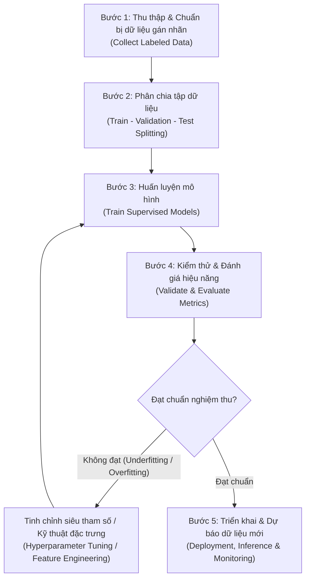
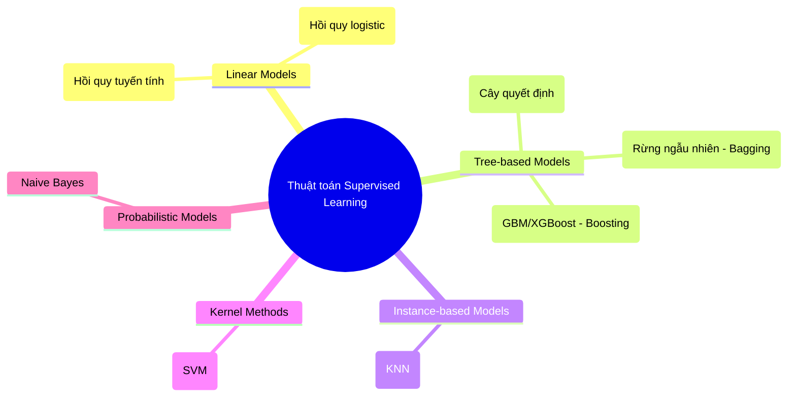
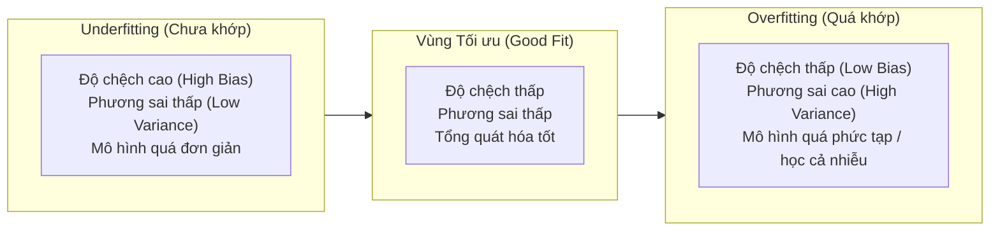

# Bài giảng: Supervised Machine Learning (Học máy có giám sát)

**Cập nhật lần cuối:** 21 tháng 9 năm 2026  
**Học phần:** Phân tích dữ liệu với Python (DSAI1005)  
**Giảng viên:** TS. Vũ Đức Minh – Khoa Khoa học dữ liệu và Trí tuệ nhân tạo, Trường Công nghệ, Đại học Kinh tế Quốc dân (NEU)  
**Nguồn tài liệu tham khảo chính:** [GeeksforGeeks – Supervised Machine Learning](https://www.geeksforgeeks.org/machine-learning/supervised-machine-learning/)

---

## Mục lục bài học

1. [Giới thiệu & Bản chất của Supervised Learning](#1-giới-thiệu--bản-chất-của-supervised-learning)
2. [Mục tiêu bài học (Learning Objectives)](#2-mục-tiêu-bài-học-learning-objectives)
3. [Cơ sở toán học & Khái niệm cốt lõi](#3-cơ-sở-toán-học--khái-niệm-cốt-lõi)
4. [Hai dạng bài toán chính: Classification & Regression](#4-hai-dạng-bài-toán-chính-classification--regression)
   - 4.1. Bài toán Phân loại (Classification) & Dữ liệu mua sắm khách hàng
   - 4.2. Bài toán Hồi quy (Regression) & Dữ liệu khí tượng dự báo tốc độ gió
   - 4.3. Bảng so sánh toàn diện giữa Classification và Regression
5. [Quy trình 5 bước xây dựng mô hình Học có giám sát](#5-quy-trình-5-bước-xây-dựng-mô-hình-học-có-giám-sát)
   - Bước 1: Thu thập và chuẩn bị dữ liệu gán nhãn (Collect Labeled Data)
   - Bước 2: Phân chia tập dữ liệu (Data Splitting: Train - Validation - Test)
   - Bước 3: Huấn luyện mô hình (Model Training & Parameter Optimization)
   - Bước 4: Kiểm thử và đánh giá hiệu năng (Model Validation & Testing)
   - Bước 5: Triển khai và dự báo trên dữ liệu mới (Deployment & Inference)
6. [Các thuật toán Học có giám sát tiêu biểu](#6-các-thuật-toán-học-có-giám-sát-tiêu-biểu)
   - 6.1. Linear Regression (Hồi quy tuyến tính)
   - 6.2. Logistic Regression (Hồi quy logistic)
   - 6.3. Decision Trees (Cây quyết định)
   - 6.4. Random Forests (Rừng ngẫu nhiên)
   - 6.5. Support Vector Machine - SVM (Máy véc-tơ hỗ trợ)
   - 6.6. K-Nearest Neighbors - KNN (K láng giềng gần nhất)
   - 6.7. Gradient Boosting (Tăng cường độ dốc)
   - 6.8. Naive Bayes (Phân loại Bayes ngây thơ)
   - 6.9. Bảng tổng hợp so sánh các thuật toán
7. [Các ứng dụng thực tế điển hình](#7-các-ứng-dụng-thực-tế-điển-hình)
8. [Ưu điểm, Hạn chế & Thách thức thực tiễn](#8-ưu-điểm-hạn-chế--thách-thức-thực-tiễn)
   - 8.1. Ưu điểm nổi bật
   - 8.2. Nhược điểm và thách thức cốt lõi
   - 8.3. Đánh đổi giữa Độ chệch và Phương sai (Bias-Variance Tradeoff)
9. [Thực hành Python với Thư viện Scikit-Learn](#9-thực-hành-python-với-thư-viện-scikit-learn)
   - 9.1. Bài toán Phân loại: Dự đoán ý định mua sắm của khách hàng
   - 9.2. Bài toán Hồi quy: Dự báo tốc độ gió khí tượng
10. [Tổng kết & Câu hỏi ôn tập](#10-tổng-kết--câu-hỏi-ôn-tập)
11. [Tài liệu tham khảo](#11-tài-liệu-tham-khảo)

---

## 1. Giới thiệu & Bản chất của Supervised Learning

Trong bối cảnh Trí tuệ nhân tạo (AI) và Khoa học dữ liệu (Data Science), **Machine Learning (Học máy)** cung cấp các phương pháp cho phép hệ thống máy tính tự động đúc rút quy luật từ dữ liệu thực nghiệm thay vì phải lập trình quy tắc thủ công bằng tay. Trong số các nhánh của học máy, **Supervised Machine Learning (Học máy có giám sát)** là phương pháp nền tảng, có lịch sử phát triển lâu dài nhất và được ứng dụng rộng rãi nhất trong thực tế kinh doanh, tài chính, công nghệ và y tế.

Theo định nghĩa chuẩn:
> **Supervised Learning (Học máy có giám sát)** là phương pháp học máy trong đó mô hình toán học được huấn luyện trên một tập dữ liệu **đã được gán nhãn (labeled data)**. Nghĩa là, đối với mỗi mẫu dữ liệu quan sát đầu vào, nhãn kết quả thực tế tương ứng (ground truth) đã được xác định trước. Mô hình sẽ liên tục so sánh giá trị do chính nó dự báo với kết quả thực tế, từ đó tự động hiệu chỉnh các tham số bên trong nhằm cực tiểu hóa sai số và nâng cao độ chính xác dự báo theo thời gian.



### 3 Đặc trưng cốt lõi của Supervised Learning:
1. **Mỗi đầu vào đều có một nhãn đầu ra tương ứng (Known Ground Truth):** Tập dữ liệu huấn luyện tồn tại dưới dạng các cặp $(x_i, y_i)$, trong đó $x_i$ là véc-tơ đặc trưng và $y_i$ là kết quả cần dự báo.
2. **Cơ chế tự điều chỉnh giảm thiểu sai số (Error-Driven Optimization):** Thuật toán tính toán độ chênh lệch giữa dự báo $\hat{y}$ và nhãn thực $y$ thông qua một hàm mất mát (Loss Function), sau đó sử dụng các kỹ thuật toán học (như Gradient Descent) để cập nhật trọng số.
3. **Khả năng tổng quát hóa trên dữ liệu mới (Generalization on Unseen Data):** Mục tiêu tối hậu của mô hình không phải là ghi nhớ máy móc tập dữ liệu cũ, mà là học được quy luật tổng quát để dự báo chính xác trên các mẫu dữ liệu mới hoàn toàn mà nó chưa từng tiếp xúc.

**Ví dụ trực quan:** Nhận diện chữ số viết tay từ ảnh (bộ dữ liệu MNIST). Mỗi bức ảnh chữ số là đầu vào $x$, còn nhãn thực tế $y \in \{0, 1, 2, \ldots, 9\}$ là đáp án chuẩn do con người xác nhận trước. Sau khi duyệt qua hàng chục nghìn bức ảnh kèm nhãn, mô hình nhận biết được các nét uốn lượn đặc trưng của từng chữ số và có thể phân loại chính xác các chữ số mới khi được quét vào hệ thống.

---

## 2. Mục tiêu bài học (Learning Objectives)

Sau khi hoàn thành bài học này, sinh viên có khả năng:

- **Về mặt khái niệm (Understand):**
  - Trình bày rõ ràng khái niệm, nguyên lý hoạt động và vai trò của Học máy có giám sát.
  - Phân biệt chính xác giữa hai nhánh lớn: **Classification (Phân loại)** và **Regression (Hồi quy)**.
  - Hiểu rõ sự khác biệt giữa Supervised Learning, Unsupervised Learning (Học không giám sát) và Reinforcement Learning (Học tăng cường).
- **Về mặt kỹ thuật và phương pháp luận (Analyze & Apply):**
  - Nắm vững quy trình 5 bước xây dựng mô hình học máy: Thu thập nhãn $\to$ Chia dữ liệu $\to$ Huấn luyện $\to$ Đánh giá $\to$ Triển khai.
  - Phân tích và lựa chọn đúng các chỉ số đo lường hiệu năng: Accuracy, Precision, Recall, F1-score, ROC-AUC (cho Classification) và MSE, RMSE, MAE, $R^2$ (cho Regression).
  - So sánh được nguyên lý, ưu thế và hạn chế của 8 thuật toán kinh điển: Linear Regression, Logistic Regression, Decision Trees, Random Forests, Support Vector Machines (SVM), K-Nearest Neighbors (KNN), Gradient Boosting và Naive Bayes.
- **Về mặt lập trình và thực tế (Implement & Synthesize):**
  - Ứng dụng thư viện `scikit-learn` trong Python để xây dựng pipeline hoàn chỉnh giải quyết các bài toán phân loại và hồi quy thực tế.
  - Nhận diện các thách thức thực tế như chi phí gán nhãn, mất cân bằng lớp (class imbalance), quá khớp (overfitting) và hiện tượng trôi dạt dữ liệu (concept drift).

---

## 3. Cơ sở toán học & Khái niệm cốt lõi

Về mặt toán học, bài toán Supervised Learning có thể mô tả qua các thành phần hình thức sau:

1. **Không gian đặc trưng (Feature Space $\mathcal{X}$):** Mỗi quan sát là một véc-tơ $d$ chiều:
   $$x = [x_1, x_2, \ldots, x_d]^T \in \mathcal{X} \subseteq \mathbb{R}^d$$
   Các biến $x_j$ được gọi là đặc trưng (features), biến độc lập (independent variables), hoặc biến dự báo (predictors).
2. **Không gian nhãn mục tiêu (Target Space $\mathcal{Y}$):**
   - Nếu $\mathcal{Y} \subseteq \mathbb{R}$ (tập số thực liên tục): Ta có bài toán **Hồi quy (Regression)**.
   - Nếu $\mathcal{Y} = \{0, 1\}$ hoặc $\mathcal{Y} = \{C_1, C_2, \ldots, C_K\}$ (tập rời rạc gồm $K$ lớp phân loại): Ta có bài toán **Phân loại (Classification)**.
3. **Tập dữ liệu huấn luyện (Training Dataset $\mathcal{D}$):** Gồm $n$ quan sát độc lập cùng phân phối (i.i.d):
   $$\mathcal{D} = \{(x_1, y_1), (x_2, y_2), \ldots, (x_n, y_n)\} \subset \mathcal{X} \times \mathcal{Y}$$
4. **Hàm giả thuyết (Hypothesis Function $f$):** Một hàm toán học ánh xạ từ không gian đặc trưng sang không gian mục tiêu:
   $$f: \mathcal{X} \to \mathcal{Y}, \quad \hat{y} = f(x; \theta)$$
   trong đó $\theta$ là tập các tham số cần học của mô hình (weights, biases).
5. **Hàm mất mát (Loss Function $\mathcal{L}(y, \hat{y})$):** Thước đo sự sai khác giữa giá trị dự báo $\hat{y}$ và nhãn thực tế $y$.
   - Đối với bài toán hồi quy (Hàm bình phương sai số - Squared Loss):
     $$\mathcal{L}(y, \hat{y}) = (y - \hat{y})^2$$
   - Đối với bài toán phân loại nhị phân (Hàm mất mát Cross-Entropy / Log Loss):
     $$\mathcal{L}(y, \hat{y}) = - [y \ln(\hat{y}) + (1 - y) \ln(1 - \hat{y})]$$
6. **Nguyên lý Tối thiểu hóa Rủi ro Thực nghiệm (Empirical Risk Minimization - ERM):** Quá trình huấn luyện mô hình chính là việc tìm tập tham số $\theta^*$ sao cho trung bình mất mát trên toàn bộ tập dữ liệu đạt giá trị nhỏ nhất:
   $$\theta^* = \arg\min_{\theta} \frac{1}{n} \sum_{i=1}^{n} \mathcal{L}\left(y_i, f(x_i; \theta)\right) + \lambda \Omega(\theta)$$
   trong đó $\Omega(\theta)$ là số hạng điều chuẩn (Regularization) giúp kiểm soát độ phức tạp của mô hình và chống quá khớp (overfitting).

---

## 4. Hai dạng bài toán chính: Classification & Regression

Học máy có giám sát được chia thành hai nhánh lớn dựa trên **kiểu dữ liệu của biến mục tiêu đầu ra ($y$)**:



### 4.1. Bài toán Phân loại (Classification) & Dữ liệu mua sắm khách hàng

Trong bài toán Phân loại, đầu ra mục tiêu $y$ là một **biến định tính / danh mục (categorical / discrete)**. Mô hình cần tìm ra ranh giới quyết định (decision boundary) để phân chia không gian đặc trưng thành các vùng tương ứng với từng lớp.

- **Phân loại nhị phân (Binary Classification):** Đầu ra chỉ có đúng 2 trạng thái khả dĩ: Có / Không ($1 / 0$), Gian lận / Hợp lệ, Bệnh / Khỏe mạnh.
- **Phân loại đa lớp (Multiclass Classification):** Đầu ra thuộc một trong $K > 2$ lớp khác nhau (ví dụ: xếp loại học lực Sinh viên: Xuất sắc, Giỏi, Khá, Trung bình).

#### Bảng dữ liệu minh họa: Quyết định Mua sắm của Khách hàng (Customer Purchase Dataset)
Dữ liệu từ hệ thống thương mại điện tử phục vụ việc dự đoán liệu một khách hàng tiềm năng có mua một dòng sản phẩm cụ thể hay không:

| Khách hàng (ID) | Giới tính (Gender) | Độ tuổi (Age) | Mức lương ước tính (Salary - USD/năm) | Mua hàng? (Purchased - Label $y$) |
|:---:|:---:|:---:|:---:|:---:|
| 001 | Male | 19 | 19,000 | **0 (No)** |
| 002 | Male | 35 | 20,000 | **0 (No)** |
| 003 | Female | 26 | 43,000 | **0 (No)** |
| 004 | Female | 27 | 57,000 | **0 (No)** |
| 005 | Male | 19 | 76,000 | **0 (No)** |
| 006 | Female | 32 | 150,000 | **1 (Yes)** |
| 007 | Female | 52 | 90,000 | **1 (Yes)** |
| 008 | Male | 60 | 102,000 | **1 (Yes)** |

- **Đầu vào ($X$):** Véc-tơ đặc trưng gồm [Giới tính, Độ tuổi, Mức lương].
- **Đầu ra ($y$):** Giá trị nhị phân $\in \{0, 1\}$, trong đó `1` biểu thị khách hàng sẽ mua sản phẩm, `0` biểu thị khách hàng từ chối mua.

---

### 4.2. Bài toán Hồi quy (Regression) & Dữ liệu khí tượng dự báo tốc độ gió

Trong bài toán Hồi quy, đầu ra mục tiêu $y$ là một **giá trị số thực liên tục (continuous quantitative variable)**. Mô hình tìm cách xấp xỉ một hàm số liên tục khớp với dữ liệu phân tán để dự báo các giá trị định lượng cụ thể.

#### Bảng dữ liệu minh họa: Dự báo Tốc độ Gió Khí tượng (Meteorological Wind Speed Dataset)
Dữ liệu ghi nhận từ các trạm đo khí quyển phục vụ dự báo tốc độ gió phục vụ vận tải hàng không và năng lượng tái tạo:

| Trạm đo | Điểm sương (Dew Point - $^\circ\text{C}$) | Nhiệt độ (Temp - $^\circ\text{C}$) | Áp suất (Pressure - hPa) | Độ ẩm tương đối (Humidity - %) | Hướng gió (Direction - Độ) | Tốc độ gió (Wind Speed - km/h - Label $y$) |
|:---:|:---:|:---:|:---:|:---:|:---:|:---:|
| T01 | 12.4 | 24.5 | 1013.2 | 65 | 180 | **14.2** |
| T02 | 14.1 | 26.0 | 1011.8 | 70 | 210 | **18.5** |
| T03 | 9.8 | 21.2 | 1015.0 | 58 | 090 | **8.7** |
| T04 | 15.6 | 28.4 | 1009.5 | 78 | 240 | **25.3** |
| T05 | 11.0 | 22.8 | 1014.1 | 62 | 160 | **11.4** |

- **Đầu vào ($X$):** Véc-tơ đặc trưng môi trường [Điểm sương, Nhiệt độ, Áp suất, Độ ẩm, Hướng gió].
- **Đầu ra ($y$):** Tốc độ gió là một đại lượng vật lý liên tục (ví dụ: $14.2 \text{ km/h}$, $18.5 \text{ km/h}$).

---

### 4.3. Bảng so sánh toàn diện giữa Classification và Regression

| Tiêu chí so sánh | Bài toán Phân loại (Classification) | Bài toán Hồi quy (Regression) |
|:---|:---|:---|
| **Bản chất biến mục tiêu ($y$)** | Định tính, rời rạc (Discrete / Categorical classes) | Định lượng, liên tục (Continuous numerical values) |
| **Mục tiêu của mô hình** | Tìm mặt phân cách (Decision boundary) phân chia các lớp | Khớp một đường/mặt cong (Curve / Surface fitting) qua các điểm |
| **Hàm mất mát phổ biến (Loss Functions)** | Cross-Entropy Loss, Hinge Loss, Zero-One Loss | Mean Squared Error (MSE), Mean Absolute Error (MAE), Huber Loss |
| **Thước đo đánh giá hiệu năng (Metrics)** | Accuracy, Precision, Recall, F1-Score, ROC-AUC | MAE, MSE, RMSE, Mean Absolute Percentage Error (MAPE), $R^2$ |
| **Thuật toán đại diện** | Logistic Regression, Decision Tree Classifier, SVC, Naive Bayes | Linear Regression, Ridge/Lasso, SVR, Decision Tree Regressor |
| **Ví dụ kinh doanh & kinh tế** | Dự báo vỡ nợ (Default / Non-default), phân loại gian lận thẻ tín dụng | Dự báo doanh số quý, định giá bất động sản, dự báo chỉ số lạm phát |

---

## 5. Quy trình 5 bước xây dựng mô hình Học có giám sát

Để phát triển một giải pháp Học máy có giám sát đạt chuẩn từ phòng thí nghiệm tới môi trường sản xuất thực tế (Production), kỹ sư dữ liệu và nhà phân tích tuân thủ chặt chẽ **Quy trình 5 bước kinh điển (Working Pipeline)**:



### Bước 1: Thu thập và chuẩn bị dữ liệu gán nhãn (Collect Labeled Data)
- **Tập hợp dữ liệu:** Thu thập đầy đủ các biến đặc trưng $X$ và nhãn chính xác $y$. Nhãn có thể đến từ nhật ký hệ thống lịch sử (khách hàng đã hủy dịch vụ hay chưa), cảm biến thiết bị, hoặc chuyên gia dán nhãn thủ công (bác sĩ chẩn đoán ảnh chụp X-quang).
- **Làm sạch và tiền xử lý (Data Cleaning & Preprocessing):** 
  - Xử lý giá trị khuyết thiếu (Imputation).
  - Chuẩn hóa thang đo (StandardScaler, MinMaxScaler) để các biến có đơn vị khác nhau không làm sai lệch khoảng cách tính toán.
  - Mã hóa các biến danh mục dạng chữ thành số (One-Hot Encoding, Label Encoding).

### Bước 2: Phân chia tập dữ liệu (Data Splitting)
Tuyệt đối không được đánh giá mô hình trên chính dữ liệu đã dùng để huấn luyện vì điều đó sẽ gây ra hiện tượng **rò rỉ dữ liệu (Data Leakage)** và che giấu lỗi quá khớp. Dữ liệu thường được chia theo các tỷ lệ tiêu chuẩn:
- **Tập huấn luyện (Training Set - khoảng 70% – 80%):** Dùng để thuật toán học các tham số nội tại.
- **Tập kiểm định (Validation Set - khoảng 10% – 15%):** Dùng để điều chỉnh siêu tham số (Hyperparameter tuning) và lựa chọn thuật toán tối ưu. Kỹ thuật $K$-Fold Cross-Validation thường được áp dụng tại bước này.
- **Tập kiểm tra (Test Set - khoảng 10% – 20%):** Hoàn toàn độc lập và chỉ được dùng một lần duy nhất ở bước cuối cùng để đo lường năng lực tổng quát hóa khách quan của mô hình.

> **Kỹ thuật Stratified Splitting:** Đối với bài toán phân loại có dữ liệu mất cân bằng (ví dụ: gian lận chỉ chiếm 2%), bắt buộc phải sử dụng phương pháp phân tầng (Stratified Sampling) để đảm bảo tỷ lệ các nhãn ở tập Train và Test là giống hệt nhau.

### Bước 3: Huấn luyện mô hình (Model Training)
- Đưa cặp dữ liệu $(X_{\text{train}}, y_{\text{train}})$ vào giải thuật học máy phù hợp.
- Thuật toán khởi tạo các tham số ban đầu, thực hiện tính toán hàm mục tiêu và lặp đi lặp lại quá trình tối ưu (optimization) để cập nhật tham số sao cho hàm mất mát đạt cực tiểu.

### Bước 4: Kiểm thử và đánh giá hiệu năng (Model Validation & Testing)
Đưa tập đặc trưng độc lập $X_{\text{test}}$ vào mô hình đã huấn luyện để thu được véc-tơ dự báo $\hat{y}_{\text{test}}$. So sánh đối chiếu $\hat{y}_{\text{test}}$ với nhãn thực tế $y_{\text{test}}$ thông qua hệ thống chỉ số định lượng:

#### Thước đo cho bài toán Phân loại:
- **Accuracy (Độ chính xác tổng thể):** Tỷ lệ mẫu dự đoán đúng trên toàn bộ tập dữ liệu:
  $$\text{Accuracy} = \frac{TP + TN}{TP + TN + FP + FN}$$
- **Precision (Độ chuẩn xác):** Tỷ lệ dự đoán là Dương tính thực sự đúng: $\frac{TP}{TP + FP}$.
- **Recall (Độ nhạy / Thu hồi):** Tỷ lệ phát hiện được bao nhiêu mẫu Dương tính trong thực tế: $\frac{TP}{TP + FN}$.
- **F1-Score:** Trung bình điều hòa giữa Precision và Recall: $2 \times \frac{\text{Precision} \times \text{Recall}}{\text{Precision} + \text{Recall}}$.
- **ROC-AUC:** Diện tích dưới đường cong ROC đánh giá khả năng phân biệt giữa các lớp ở mọi ngưỡng cắt xác suất (thresholds).

#### Thước đo cho bài toán Hồi quy:
- **Mean Absolute Error (MAE):** Trung bình sai số tuyệt đối:
  $$\text{MAE} = \frac{1}{n} \sum_{i=1}^n |y_i - \hat{y}_i|$$
- **Mean Squared Error (MSE):** Trung bình bình phương sai số (phạt rất nặng các lỗi lớn/outliers):
  $$\text{MSE} = \frac{1}{n} \sum_{i=1}^n (y_i - \hat{y}_i)^2$$
- **Root Mean Squared Error (RMSE):** Căn bậc hai của MSE, có cùng đơn vị đo với biến mục tiêu: $\text{RMSE} = \sqrt{\text{MSE}}$.
- **Hệ số xác định ($R^2$ Score):** Đo lường tỷ lệ biến thiên của biến mục tiêu được giải thích bởi mô hình:
  $$R^2 = 1 - \frac{\sum (y_i - \hat{y}_i)^2}{\sum (y_i - \bar{y})^2}$$

### Bước 5: Triển khai và Dự báo trên dữ liệu mới (Deployment & Inference)
- Đóng gói toàn bộ pipeline xử lý dữ liệu và mô hình thành tệp tuần tự hóa (Serialized Model qua `joblib` hoặc `pickle`).
- Đưa mô hình lên máy chủ (Cloud Server / Web API / Microservice).
- Khi có một quan sát khách hàng mới $X_{\text{new}}$ gửi đến, mô hình sẽ tính toán và trả về kết quả dự báo trong thời gian thực.
- **Giám sát liên tục (Continuous Monitoring):** Theo dõi hiện tượng suy thoái chất lượng mô hình do sự thay đổi của môi trường dữ liệu theo thời gian (Data Drift & Concept Drift).

---

## 6. Các thuật toán Học có giám sát tiêu biểu

Dưới đây là 8 thuật toán học có giám sát nền tảng và phổ biến nhất được trình bày trong tài liệu GeeksforGeeks, kết hợp với các khuyến nghị thực hành tốt nhất:



### 6.1. Linear Regression (Hồi quy tuyến tính)
- **Bài toán áp dụng:** Hồi quy (dự báo giá trị liên tục).
- **Nguyên lý:** Giả thiết mối quan hệ giữa các biến đầu vào $x_1, x_2, \ldots, x_p$ và biến đầu ra $y$ là quan hệ tuyến tính:
  $$\hat{y} = w_0 + w_1 x_1 + w_2 x_2 + \ldots + w_p x_p = w^T x$$
- **Phương pháp tối ưu:** Tìm véc-tơ trọng số $w$ tối thiểu hóa tổng bình phương sai số (Ordinary Least Squares - OLS) hoặc thuật toán Gradient Descent.
- **Ưu điểm:** Cực kỳ đơn giản, tốc độ huấn luyện nhanh, dễ diễn giải ý nghĩa kinh tế của từng hệ số hồi quy $w_j$.
- **Hạn chế:** Không bắt được mối quan hệ phi tuyến phức tạp; rất nhạy cảm với các điểm ngoại lệ (outliers) và hiện tượng đa cộng tuyến.

### 6.2. Logistic Regression (Hồi quy logistic)
- **Bài toán áp dụng:** Phân loại nhị phân và phân loại đa lớp (thông qua hàm Softmax).
- **Nguyên lý:** Mặc dù mang tên "regression", Logistic Regression là một thuật toán phân loại. Mô hình sử dụng hàm Sigmoid để chuyển đổi đầu ra tuyến tính $z = w^T x$ thành một giá trị xác suất $P \in (0, 1)$:
  $$P(y=1|x) = \sigma(z) = \frac{1}{1 + e^{-(w^T x)}}$$
  Nếu $P(y=1|x) \ge 0.5$, mô hình dự báo lớp 1; ngược lại dự báo lớp 0.
- **Ưu điểm:** Xuất ra xác suất tin cậy của dự báo; ít bị overfitting khi dữ liệu có số chiều vừa phải; chuẩn mực trong chấm điểm tín dụng ngân hàng (Credit Scoring).
- **Hạn chế:** Giả định ranh giới quyết định giữa các lớp là tuyến tính.

### 6.3. Decision Trees (Cây quyết định)
- **Bài toán áp dụng:** Cả Phân loại (DecisionTreeClassifier) và Hồi quy (DecisionTreeRegressor).
- **Nguyên lý:** Phân chia không gian dữ liệu một cách đệ quy thành các hình chữ nhật con thông qua chuỗi các câu hỏi điều kiện nhị phân if-else (ví dụ: $\text{Age} \le 30$). Tại mỗi nút phân chia (split), thuật toán chọn đặc trưng và ngưỡng cắt giúp tối đa hóa độ thuần khiết (Purity) thông qua:
  - **Gini Impurity (Chỉ số vẩn đục Gini):** $Gini = 1 - \sum_{i=1}^K p_i^2$
  - **Information Gain (Độ lợi thông tin dựa trên Entropy):** $H(S) = - \sum_{i=1}^K p_i \log_2(p_i)$
- **Ưu điểm:** Cực kỳ trực quan, dễ giải thích cho người dùng phi kỹ thuật; không đòi hỏi chuẩn hóa thang đo dữ liệu; xử lý tự nhiên cả biến số lẫn biến danh mục.
- **Hạn chế:** Rất dễ bị **quá khớp (overfitting)** nếu cây phát triển quá sâu; độ ổn định thấp (dữ liệu huấn luyện thay đổi nhỏ có thể làm cấu trúc cây thay đổi hoàn toàn).

### 6.4. Random Forests (Rừng ngẫu nhiên)
- **Bài toán áp dụng:** Cả Phân loại và Hồi quy.
- **Nguyên lý:** Là thuật toán học kết hợp (Ensemble Learning) theo phương pháp **Bagging (Bootstrap Aggregating)**. Thuật toán xây dựng hàng trăm cây quyết định độc lập. Mỗi cây được huấn luyện trên một tập dữ liệu con lấy mẫu có hoàn lại (bootstrap sample) và tại mỗi nút chỉ xem xét một tập con ngẫu nhiên các đặc trưng. Kết quả dự báo cuối cùng là kết quả bỏ phiếu đa số (Majority Voting cho phân loại) hoặc lấy giá trị trung bình (Averaging cho hồi quy).
- **Ưu điểm:** Khắc phục triệt để nhược điểm overfitting của cây quyết định đơn lẻ; độ chính xác rất cao; có khả năng đo lường mức độ quan trọng của đặc trưng (Feature Importance).
- **Hạn chế:** Mô hình cồng kềnh, tiêu tốn nhiều bộ nhớ; thời gian suy luận chậm hơn cây đơn; trở thành mô hình "hộp đen" (khó diễn giải từng nhánh rẽ trực quan).

### 6.5. Support Vector Machine - SVM (Máy véc-tơ hỗ trợ)
- **Bài toán áp dụng:** Phân loại và Hồi quy (Support Vector Regression - SVR).
- **Nguyên lý:** Tìm kiếm một **siêu phẳng phân cách tối ưu (Optimal Hyperplane)** sao cho khoảng cách lề (Margin) giữa siêu phẳng và các điểm dữ liệu gần nhất của hai lớp (gọi là các **véc-tơ hỗ trợ - Support Vectors**) đạt giá trị cực đại.
  - Khi dữ liệu không thể phân tách tuyến tính trong không gian ban đầu, SVM áp dụng kỹ thuật **Kernel Trick** (hạt nhân RBF, Polynomial, Sigmoid) để ánh xạ ngầm dữ liệu lên không gian nhiều chiều hơn, nơi dữ liệu trở nên phân tách tuyến tính.
- **Ưu điểm:** Hiệu quả vượt trội trong không gian dữ liệu nhiều chiều (high-dimensional space), đặc biệt khi số chiều lớn hơn số lượng mẫu; ít bị ảnh hưởng bởi các điểm nằm xa siêu phẳng.
- **Hạn chế:** Tốc độ huấn luyện rất chậm trên tập dữ liệu lớn ($O(n^2)$ đến $O(n^3)$); việc lựa chọn hàm kernel và tinh chỉnh siêu tham số $C, \gamma$ đòi hỏi nhiều kinh nghiệm.

### 6.6. K-Nearest Neighbors - KNN (K láng giềng gần nhất)
- **Bài toán áp dụng:** Cả Phân loại và Hồi quy.
- **Nguyên lý:** Là thuật toán **học lười (Lazy Learner / Instance-based Learning)**. KNN không xây dựng mô hình khái quát trong giai đoạn huấn luyện (pha train chỉ đơn giản là lưu trữ toàn bộ dữ liệu). Khi cần dự báo cho một điểm mới $x_{\text{new}}$:
  1. Tính khoảng cách (thường là khoảng cách Euclidean $d(x, z) = \sqrt{\sum (x_j - z_j)^2}$) từ $x_{\text{new}}$ tới tất cả các điểm trong tập dữ liệu.
  2. Chọn ra $K$ điểm láng giềng có khoảng cách gần nhất.
  3. Gán nhãn cho $x_{\text{new}}$ bằng nhãn chiếm đa số trong $K$ láng giềng (hoặc trung bình giá trị đối với hồi quy).
- **Ưu điểm:** Cực kỳ đơn giản, không cần giả định phân phối dữ liệu; thích ứng tự nhiên khi liên tục có dữ liệu mới bổ sung.
- **Hạn chế:** Chi phí tính toán và bộ nhớ trong pha dự báo rất lớn khi tập dữ liệu mở rộng; cực kỳ nhạy cảm với thang đo đặc trưng (bắt buộc phải chuẩn hóa) và chịu ảnh hưởng nặng nề bởi "lời nguyền số chiều" (Curse of Dimensionality).

### 6.7. Gradient Boosting (Tăng cường độ dốc: GBM / XGBoost / LightGBM)
- **Bài toán áp dụng:** Cả Phân loại và Hồi quy.
- **Nguyên lý:** Là kỹ thuật Ensemble thuộc trường phái **Boosting**. Khác với Random Forest xây dựng các cây song song độc lập, Gradient Boosting xây dựng các cây tuần tự từng bước một (Sequential Learning). Mỗi cây mới được tối ưu để dự báo và bù đắp sai số thặng dư (residuals) của toàn bộ hệ thống các cây phía trước thông qua việc tối ưu hàm mất mát bằng thuật toán Gradient Descent:
  $$F_m(x) = F_{m-1}(x) + \eta \cdot h_m(x)$$
  trong đó $h_m(x)$ là cây mới học phần sai số thặng dư, và $\eta$ là tốc độ học (learning rate).
- **Ưu điểm:** Đạt hiệu năng dự báo cao bậc nhất trên các tập dữ liệu dạng bảng (Tabular Data), là vũ khí thống trị trong các cuộc thi Kaggle và hệ thống xếp hạng của các tập đoàn công nghệ lớn.
- **Hạn chế:** Rất dễ overfitting nếu số lượng cây quá lớn hoặc không tinh chỉnh cẩn thận; nhiều siêu tham số cần tối ưu hóa.

### 6.8. Naive Bayes (Phân loại Bayes ngây thơ)
- **Bài toán áp dụng:** Phân loại văn bản, lọc thư rác, phân tích cảm xúc.
- **Nguyên lý:** Dựa trên Định lý xác suất Bayes:
  $$P(y|x_1, \ldots, x_d) = \frac{P(y) P(x_1, \ldots, x_d | y)}{P(x_1, \ldots, x_d)}$$
  Thuật toán đặt ra giả định "ngây thơ" (Naive Assumption) rằng: **Tất cả các đặc trưng $x_1, x_2, \ldots, x_d$ đều hoàn toàn độc lập có điều kiện với nhau khi biết trước nhãn $y$**. Nhờ giả định này, công thức được đơn giản hóa:
  $$P(y|x) \propto P(y) \prod_{j=1}^d P(x_j | y)$$
- **Ưu điểm:** Tốc độ tính toán siêu nhanh, tiêu thụ ít tài nguyên phần cứng; hoạt động hiệu quả bất ngờ trong bài toán xử lý ngôn ngữ tự nhiên với không gian từ vựng rất lớn (Text Classification).
- **Hạn chế:** Giả định độc lập giữa các biến hiếm khi đúng trong đời thực (ví dụ: trong văn bản, từ "Hong" và "Kong" có tương quan chặt chẽ chứ không độc lập).

---

### 6.9. Bảng tổng hợp so sánh các thuật toán

| Thuật toán | Dạng bài toán | Khả năng xử lý phi tuyến | Tính dễ diễn giải (Interpretability) | Độ nhạy với Scaling | Tốc độ huấn luyện | Tốc độ dự báo (Inference) |
|:---|:---:|:---:|:---:|:---:|:---:|:---:|
| **Linear Regression** | Regression | Thấp (chỉ tuyến tính) | Rất cao | Cao (với Regularization) | Rất nhanh | Tức thì |
| **Logistic Regression** | Classification | Thấp (ranh giới phẳng) | Rất cao | Cao | Rất nhanh | Tức thì |
| **Decision Trees** | Cả hai | Cao | Rất cao (khi cây nông) | Không nhạy | Nhanh | Rất nhanh |
| **Random Forests** | Cả hai | Rất cao | Trung bình (hộp xám) | Không nhạy | Trung bình | Nhanh |
| **Support Vector Machines** | Cả hai | Rất cao (với Kernel) | Thấp (hộp đen) | Rất cao | Chậm ($O(n^2)$) | Trung bình |
| **K-Nearest Neighbors** | Cả hai | Rất cao | Trung bình | Cực kỳ cao | Tức thì ($O(1)$) | Rất chậm ($O(n)$) |
| **Gradient Boosting** | Cả hai | Rất cao | Thấp | Không nhạy | Chậm | Nhanh |
| **Naive Bayes** | Classification | Trung bình | Cao | Thấp | Rất nhanh | Rất nhanh |

---

## 7. Các ứng dụng thực tế điển hình

Học máy có giám sát đóng vai trò động cơ cốt lõi trong vô số giải pháp tự động hóa thông minh hiện nay:

### 1. Phát hiện gian lận trong ngân hàng và thanh toán trực tuyến (Fraud Detection in Banking)
- **Bản chất bài toán:** Phân loại nhị phân (Giao dịch gian lận: 1, Hợp lệ: 0).
- **Cách thức hoạt động:** Các ngân hàng (như Vietcombank, Techcombank, VPBank) thu thập hàng triệu bản ghi giao dịch thanh toán thẻ. Các đặc trưng gồm: số tiền giao dịch, địa điểm quẹt thẻ, múi giờ, thiết bị thực hiện và khoảng cách địa lý so với giao dịch trước đó. Mô hình học máy (như Gradient Boosting hoặc Random Forest) phân tích giao dịch trong vòng vài phần nghìn giây và chặn thẻ ngay lập tức nếu xác suất gian lận vượt ngưỡng an toàn.

### 2. Y tế & Chẩn đoán hình ảnh: Dự đoán bệnh Parkinson & Phân loại tế bào ung thư
- **Dự đoán bệnh Parkinson:** Phân tích các mẫu tín hiệu giọng nói (tần số dao động, độ rung âm học) và các bài kiểm tra vận động tay để phát hiện sớm dấu hiệu thoái hóa tế bào thần kinh của bệnh nhân Parkinson trước khi các triệu chứng lâm sàng rõ rệt xuất hiện.
- **Phân loại tế bào ung thư (Cancer Cell Classification):** Dựa trên dữ liệu giải phẫu tế bào qua ảnh sinh thiết (bán kính tế bào, độ nhám bề mặt, độ nén, độ lồi lõm), mô hình SVM hoặc Random Forest phân loại khối u là **Lành tính (Benign)** hay **Ác tính (Malignant)**, hỗ trợ bác sĩ đưa ra phác đồ điều trị chính xác.

### 3. Dự đoán khách hàng rời bỏ dịch vụ (Customer Churn Prediction)
- **Bản chất bài toán:** Phân loại nhị phân trong các doanh nghiệp viễn thông, bảo hiểm, ngân hàng và phần mềm SaaS.
- **Cách thức hoạt động:** Mô hình phân tích lịch sử sử dụng, tần suất đăng nhập, số lần khiếu nại lên tổng đài, và sự thay đổi trong mức chi tiêu hàng tháng. Nếu mô hình cảnh báo một khách hàng có nguy cơ rời bỏ 85%, bộ phận Chăm sóc khách hàng (CRM) sẽ tự động kích hoạt gói ưu đãi hoặc liên hệ hỗ trợ riêng để giữ chân khách hàng.

### 4. Định giá tài sản & Dự báo tài chính (Stock Price & Real Estate Valuation)
- **Bản chất bài toán:** Hồi quy (Regression).
- **Cách thức hoạt động:** Trong định giá bất động sản, mô hình ước lượng giá trị nhà đất dựa trên diện tích, số phòng ngủ, vị trí địa lý, khoảng cách tới trường học/bệnh viện và xu hướng mặt bằng giá trong khu vực. Trong tài chính, mô hình kết hợp các chỉ số kỹ thuật và kinh tế vĩ mô để dự báo khoảng biến động giá cổ phiếu.

### 5. Nhận diện chữ viết tay & Nhận dạng ký tự quang học (OCR)
- **Bản chất bài toán:** Phân loại đa lớp ảnh (Multiclass Classification).
- **Cách thức hoạt động:** Hệ thống bưu điện tự động đọc mã bưu chính trên phong bì thư; ứng dụng ngân hàng tự động nhận diện chữ số trên hóa đơn hoặc căn cước công dân gắn chip để hoàn tất định danh điện tử (eKYC).

---

## 8. Ưu điểm, Hạn chế & Thách thức thực tiễn

### 8.1. Ưu điểm nổi bật
- **Độ chính xác cao và tin cậy:** Khi có sẵn tập dữ liệu gán nhãn phong phú và đại diện tốt, các mô hình học có giám sát đạt độ chính xác rất cao, vượt trội so với các hệ thống luật tĩnh (rule-based).
- **Mục tiêu định lượng rõ ràng:** Do biết trước kết quả thực tế ($y$), việc đo lường hiệu năng và so sánh giữa các mô hình hoàn toàn minh bạch thông qua các chỉ số toán học chuẩn mực.
- **Khả năng ứng dụng đa dạng:** Giải quyết được hầu như mọi bài toán cốt lõi trong doanh nghiệp từ phân loại đối tượng, phát hiện bất thường đến dự báo xu hướng tương lai.

### 8.2. Nhược điểm và thách thức cốt lõi
1. **Nút thắt chi phí gán nhãn (The Labeling Bottleneck):**
   - Học có giám sát đòi hỏi lượng lớn dữ liệu gán nhãn. Việc gán nhãn thủ công tốn kém rất nhiều thời gian, nhân lực và chi phí tài chính.
   - Trong các lĩnh vực chuyên sâu (như chẩn đoán y khoa, định giá cổ phiếu), chỉ có các chuyên gia đầu ngành mới đủ năng lực dán nhãn, khiến dữ liệu huấn luyện trở nên vô cùng khan hiếm.
2. **Rủi ro do mất cân bằng lớp (Class Imbalance Problem):**
   - Trong các bài toán phát hiện gian lận hay bệnh hiếm, mẫu nhãn dương tính có thể chỉ chiếm 0.1% dữ liệu. Một mô hình "ngây thơ" chỉ cần luôn luôn dự báo lớp âm tính cũng đạt độ chính xác Accuracy 99.9% nhưng hoàn toàn vô giá trị trong thực tế.
3. **Hiện tượng trôi dạt dữ liệu và khái niệm (Data Drift & Concept Drift):**
   - Mô hình được huấn luyện trên dữ liệu quá khứ. Khi hành vi người dùng, môi trường kinh tế vĩ mô hoặc thói quen thị trường thay đổi (ví dụ: hành vi tiêu dùng thay đổi mạnh mẽ sau đại dịch), mối quan hệ giữa $X$ và $y$ thay đổi, khiến độ chính xác của mô hình suy giảm nghiêm trọng.

---

### 8.3. Đánh đổi giữa Độ chệch và Phương sai (Bias-Variance Tradeoff)

Một trong những khái niệm quan trọng nhất trong học máy có giám sát là sự đánh đổi giữa **Bias (Độ chệch)** và **Variance (Phương sai)**:



- **Underfitting (Chưa khớp - High Bias):** Mô hình quá đơn giản (ví dụ dùng đường thẳng tuyến tính để mô hình hóa dữ liệu dạng parabol cong), không học được cấu trúc thực tế của dữ liệu, dẫn đến sai số cao trên cả tập huấn luyện và tập kiểm tra.
- **Overfitting (Quá khớp - High Variance):** Mô hình quá phức tạp (ví dụ cây quyết định phát triển không giới hạn), ghi nhớ máy móc toàn bộ tập huấn luyện bao gồm cả các điểm nhiễu ngẫu nhiên. Sai số trên tập huấn luyện gần bằng 0 nhưng sai số trên tập kiểm tra lại rất cao.
- **Giải pháp kiểm soát:** Áp dụng kỹ thuật điều chuẩn (L1 Lasso, L2 Ridge), giới hạn độ sâu của cây (`max_depth`), sử dụng mô hình kết hợp (Random Forest, Gradient Boosting), và sử dụng kỹ thuật dừng sớm (Early Stopping).

---

## 9. Thực hành Python với Thư viện Scikit-Learn

Dưới đây là mã nguồn thực hành chi tiết, mô phỏng trọn vẹn cả hai dạng bài toán: **Phân loại hành vi mua sắm** và **Hồi quy tốc độ gió**.

### 9.1. Bài toán Phân loại: Dự đoán ý định mua sắm của khách hàng

```python
import numpy as np
import pandas as pd
from sklearn.model_selection import train_test_split
from sklearn.preprocessing import StandardScaler
from sklearn.linear_model import LogisticRegression
from sklearn.ensemble import RandomForestClassifier
from sklearn.metrics import accuracy_score, classification_report, confusion_matrix

# 1. Khởi tạo tập dữ liệu mô phỏng mua sắm của khách hàng
np.random.seed(42)
n_samples = 300

ages = np.random.randint(18, 65, size=n_samples)
salaries = np.random.randint(15000, 150000, size=n_samples)
# Xác suất mua hàng tăng theo tuổi và mức thu nhập
purchase_prob = 1 / (1 + np.exp(-(-5 + 0.05 * ages + 0.00004 * salaries)))
purchased = (np.random.rand(n_samples) < purchase_prob).astype(int)

df_shopping = pd.DataFrame({
    'Age': ages,
    'EstimatedSalary': salaries,
    'Purchased': purchased
})

print("--- 5 Dòng Dữ liệu Khách hàng Đầu tiên ---")
print(df_shopping.head())

# 2. Tách biến đặc trưng X và nhãn mục tiêu y
X = df_shopping[['Age', 'EstimatedSalary']]
y = df_shopping['Purchased']

# 3. Phân chia tập Train / Test (80% Train, 20% Test) với Stratified Sampling
X_train, X_test, y_train, y_test = train_test_split(
    X, y, test_size=0.20, random_state=42, stratify=y
)

# 4. Chuẩn hóa thang đo đặc trưng (Feature Scaling)
scaler = StandardScaler()
X_train_scaled = scaler.fit_transform(X_train)
X_test_scaled = scaler.transform(X_test)

# 5. Huấn luyện mô hình Logistic Regression
clf_lr = LogisticRegression(random_state=42)
clf_lr.fit(X_train_scaled, y_train)

# 6. Huấn luyện mô hình Random Forest Classifier
clf_rf = RandomForestClassifier(n_estimators=100, max_depth=4, random_state=42)
clf_rf.fit(X_train, y_train)

# 7. Đánh giá và kiểm thử mô hình
y_pred_lr = clf_lr.predict(X_test_scaled)
y_pred_rf = clf_rf.predict(X_test)

print("\n--- KẾT QUẢ ĐÁNH GIÁ (CLASSIFICATION) ---")
print(f"Độ chính xác (Accuracy) Logistic Regression: {accuracy_score(y_test, y_pred_lr):.4f}")
print(f"Độ chính xác (Accuracy) Random Forest:       {accuracy_score(y_test, y_pred_rf):.4f}")

print("\nBáo cáo phân loại chi tiết của Logistic Regression:")
print(classification_report(y_test, y_pred_lr, target_names=['Không mua (0)', 'Mua (1)']))

# 8. Dự báo trên khách hàng mới
new_customer = pd.DataFrame({'Age': [35], 'EstimatedSalary': [85000]})
new_customer_scaled = scaler.transform(new_customer)
prediction = clf_lr.predict(new_customer_scaled)[0]
prob = clf_lr.predict_proba(new_customer_scaled)[0][1]

print(f"Dự báo cho khách hàng 35 tuổi, lương $85,000:")
print(f"=> Kết quả: {'Mua hàng' if prediction == 1 else 'Không mua'} (Xác suất: {prob*100:.2f}%)")
```

---

### 9.2. Bài toán Hồi quy: Dự báo tốc độ gió khí tượng

```python
import numpy as np
import pandas as pd
from sklearn.model_selection import train_test_split
from sklearn.linear_model import LinearRegression
from sklearn.tree import DecisionTreeRegressor
from sklearn.metrics import mean_squared_error, mean_absolute_error, r2_score

# 1. Khởi tạo tập dữ liệu khí tượng mô phỏng
np.random.seed(42)
n_samples = 250

dew_point = np.random.uniform(5.0, 25.0, size=n_samples)
temperature = dew_point + np.random.uniform(2.0, 15.0, size=n_samples)
pressure = np.random.uniform(1000.0, 1025.0, size=n_samples)
humidity = np.random.uniform(40.0, 95.0, size=n_samples)

# Tốc độ gió phụ thuộc vào chênh lệch áp suất và nhiệt độ
wind_speed = (
    0.8 * temperature - 0.4 * dew_point - 0.2 * (pressure - 1013.25) + 
    0.05 * humidity + np.random.normal(0, 1.5, size=n_samples)
)
wind_speed = np.clip(wind_speed, 1.0, 45.0)

df_weather = pd.DataFrame({
    'DewPoint': dew_point,
    'Temperature': temperature,
    'Pressure': pressure,
    'Humidity': humidity,
    'WindSpeed': wind_speed
})

print("--- 5 Dòng Dữ liệu Khí tượng Đầu tiên ---")
print(df_weather.head())

# 2. Phân chia biến độc lập X và biến mục tiêu y
X_weather = df_weather[['DewPoint', 'Temperature', 'Pressure', 'Humidity']]
y_weather = df_weather['WindSpeed']

X_train_w, X_test_w, y_train_w, y_test_w = train_test_split(
    X_weather, y_weather, test_size=0.20, random_state=42
)

# 3. Huấn luyện mô hình Linear Regression
reg_linear = LinearRegression()
reg_linear.fit(X_train_w, y_train_w)

# 4. Huấn luyện mô hình Decision Tree Regressor
reg_tree = DecisionTreeRegressor(max_depth=4, random_state=42)
reg_tree.fit(X_train_w, y_train_w)

# 5. Đánh giá và kiểm thử mô hình trên Test Set
y_pred_linear = reg_linear.predict(X_test_w)
y_pred_tree = reg_tree.predict(X_test_w)

def print_regression_metrics(name, y_true, y_pred):
    mae = mean_absolute_error(y_true, y_pred)
    rmse = np.sqrt(mean_squared_error(y_true, y_pred))
    r2 = r2_score(y_true, y_pred)
    print(f"Mô hình {name:20s} | MAE: {mae:.2f} km/h | RMSE: {rmse:.2f} km/h | R²: {r2:.4f}")

print("\n--- KẾT QUẢ ĐÁNH GIÁ (REGRESSION) ---")
print_regression_metrics("Linear Regression", y_test_w, y_pred_linear)
print_regression_metrics("Decision Tree", y_test_w, y_pred_tree)

# 6. Dự báo trên trạm khí tượng mới
sample_station = pd.DataFrame({
    'DewPoint': [14.0],
    'Temperature': [27.5],
    'Pressure': [1008.5],
    'Humidity': [72.0]
})
pred_wind = reg_linear.predict(sample_station)[0]
print(f"\nDự báo tốc độ gió tại trạm khí tượng mới: {pred_wind:.2f} km/h")
```

---

## 10. Tổng kết & Câu hỏi ôn tập

### 💡 Bảng ghi nhớ cốt lõi
- **Bản chất:** Supervised Learning học ánh xạ từ $X \to y$ trên tập dữ liệu đã có nhãn chuẩn xác ($y$).
- **Hai bài toán:** **Classification** (biến mục tiêu rời rạc / phân loại) và **Regression** (biến mục tiêu liên tục / định lượng).
- **Quy trình chuẩn 5 bước:** Thu thập dữ liệu có nhãn $\to$ Chia tập (Train/Val/Test) $\to$ Huấn luyện mô hình $\to$ Kiểm thử độc lập $\to$ Triển khai & Giám sát.
- **Thước đo:** Không dùng Accuracy cho dữ liệu phân loại mất cân bằng (thay bằng F1-score, ROC-AUC); dùng MAE/RMSE/$R^2$ cho bài toán hồi quy.
- **Thách thức:** Chi phí dán nhãn tốn kém, hiện tượng Overfitting vs Underfitting, và sự suy thoái hiệu năng do Concept Drift.

---

### ❓ Câu hỏi ôn tập lý thuyết (Self-Assessment)

1. **Câu hỏi 1:** Điểm khác biệt cốt lõi nhất giữa Supervised Machine Learning và Unsupervised Machine Learning là gì? Cho ví dụ minh họa về cùng một tập dữ liệu khách hàng nhưng được tiếp cận theo hai phương pháp trên.
   - *Gợi ý trả lời:* Supervised Learning yêu cầu nhãn mục tiêu $y$ (Ground Truth) để tối ưu hóa sai số dự báo (ví dụ: dự đoán khách hàng có vỡ nợ hay không dựa trên nhãn vỡ nợ quá khứ). Unsupervised Learning không có nhãn mục tiêu, mục đích là tự khám phá cấu trúc tiềm ẩn, phân cụm khách hàng theo hành vi tương đồng (Customer Segmentation) mà không có nhãn đúng/sai định trước.

2. **Câu hỏi 2:** Tại sao thuật toán Logistic Regression lại được xếp vào nhóm bài toán Phân loại (Classification) mặc dù trong tên gọi có chữ "Regression"?
   - *Gợi ý trả lời:* Mô hình sử dụng hàm Sigmoid để nén giá trị đầu ra tuyến tính thành xác suất $P \in (0, 1)$, và phân chia các quan sát vào các lớp rời rạc (nhị phân hoặc đa lớp) dựa trên một ngưỡng quyết định (ngưỡng mặc định 0.5), do đó bản chất đầu ra là phân loại danh mục chứ không phải dự báo giá trị số thực không giới hạn.

3. **Câu hỏi 3:** Trong một bài toán phát hiện giao dịch gian lận ngân hàng (chỉ có 0.5% giao dịch là gian lận), tại sao chỉ số Accuracy không còn là thước đo tin cậy? Nên sử dụng chỉ số nào thay thế?
   - *Gợi ý trả lời:* Nếu một mô hình luôn luôn dự báo tất cả giao dịch là "Hợp lệ" (lớp đa số), Accuracy vẫn đạt 99.5%, nhưng mô hình hoàn toàn thất bại vì bỏ sót 100% các giao dịch gian lận. Cần thay thế bằng **Recall** (để tối đa hóa số vụ gian lận phát hiện được), **Precision** (để giảm phiền toái cho khách hàng chân chính) và diện tích dưới đường cong **Precision-Recall (PR-AUC)**.

4. **Câu hỏi 4:** Giải thích nguyên lý hoạt động của Random Forest và tại sao việc kết hợp nhiều cây quyết định lại giúp giảm hiện tượng quá khớp (Overfitting)?
   - *Gợi ý trả lời:* Random Forest áp dụng nguyên lý Bagging (Bootstrap Aggregation) và lựa chọn ngẫu nhiên tập con các đặc trưng tại mỗi nhánh rẽ. Do các cây đơn lẻ được huấn luyện trên các mẫu dữ liệu khác nhau và xem xét các biến khác nhau, sai số của từng cây không bị tương quan. Khi lấy trung bình (hoặc bỏ phiếu đa số), phương sai (variance) tổng thể giảm xuống rõ rệt, giúp mô hình ổn định và tổng quát hóa tốt hơn nhiều so với một cây quyết định đơn lẻ.

5. **Câu hỏi 5:** Hiện tượng Data Drift và Concept Drift là gì? Đưa ra một giải pháp cụ thể trong thực tế để kiểm soát hiện tượng này sau khi mô hình đã được triển khai lên hệ thống?
   - *Gợi ý trả lời:* Data Drift là sự thay đổi trong phân phối của các biến đầu vào $P(X)$, còn Concept Drift là sự thay đổi trong mối quan hệ giữa biến đầu vào và nhãn mục tiêu $P(y|X)$. Giải pháp: Thiết lập hệ thống giám sát (monitoring system) định kỳ đo lường độ suy giảm hiệu năng của mô hình trên dữ liệu mới, thu thập nhãn mới và kích hoạt quy trình tự động huấn luyện lại mô hình (Retraining Pipeline / CI/CD for ML).

---

## 11. Tài liệu tham khảo

1. **GeeksforGeeks:** [Supervised Machine Learning Tutorial](https://www.geeksforgeeks.org/machine-learning/supervised-machine-learning/) *(Nguồn tham khảo chính)*.
2. **Avinash Navlani, Armando Fandango, Ivan Idris (2021):** *Python Data Analysis*, 3rd Edition, Packt Publishing, ISBN: 9781800564480.
3. **Aurélien Géron (2022):** *Hands-On Machine Learning with Scikit-Learn, Keras, and TensorFlow*, 3rd Edition, O'Reilly Media.
4. **Scikit-Learn Official Documentation:** [Supervised Learning User Guide](https://scikit-learn.org/stable/supervised_learning.html).
5. **Gábor Békés, Gábor Kézdi (2021):** *Data Analysis for Business, Economics and Policy*, Cambridge University Press.
