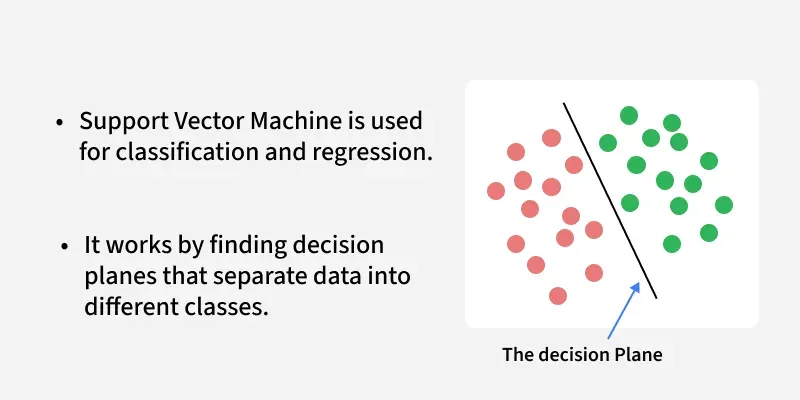
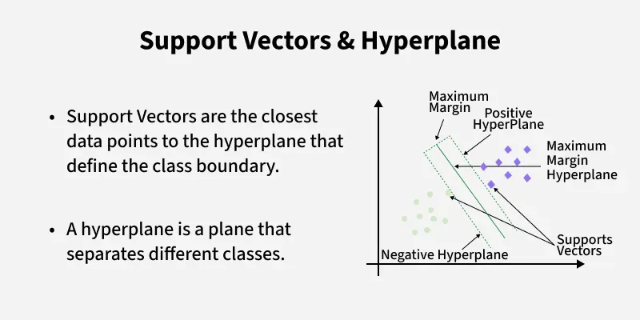
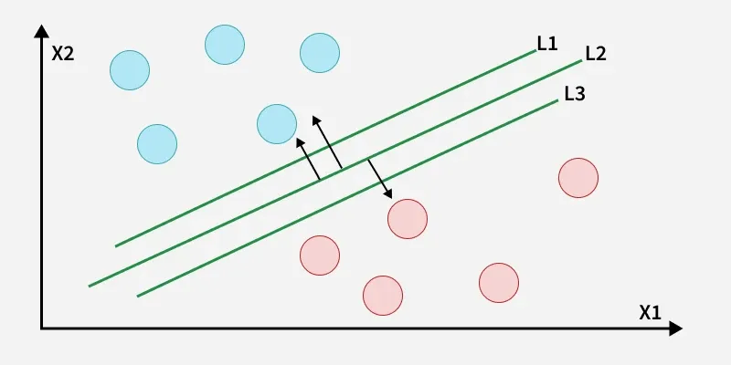
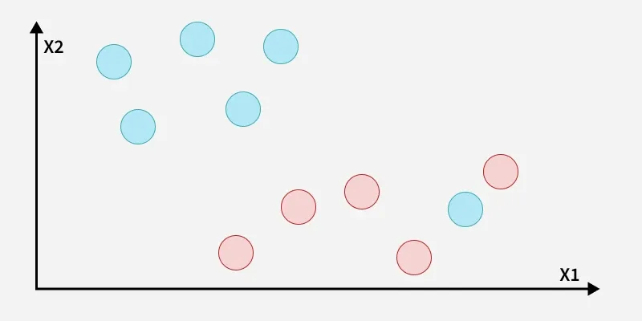
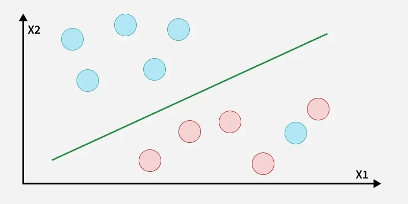
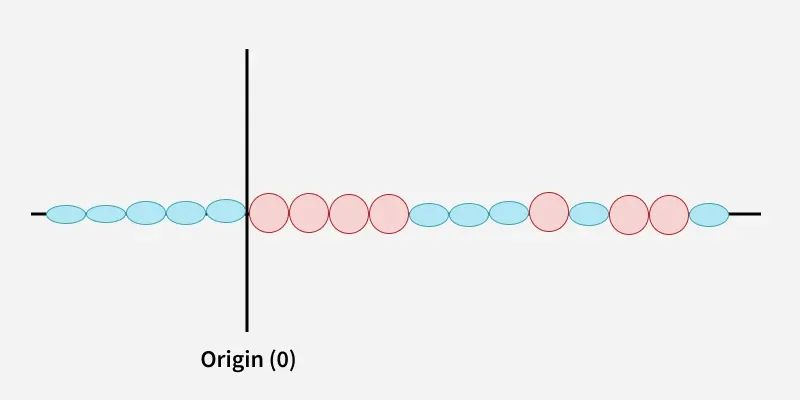
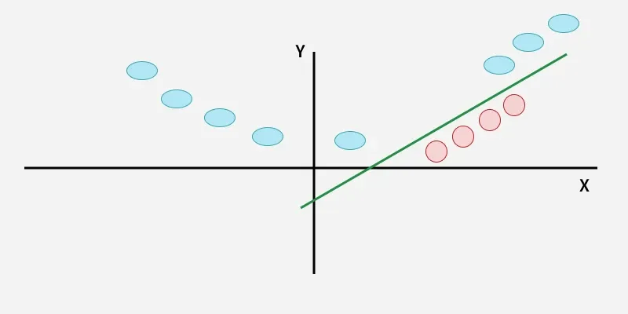
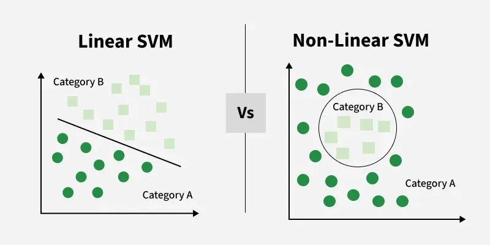
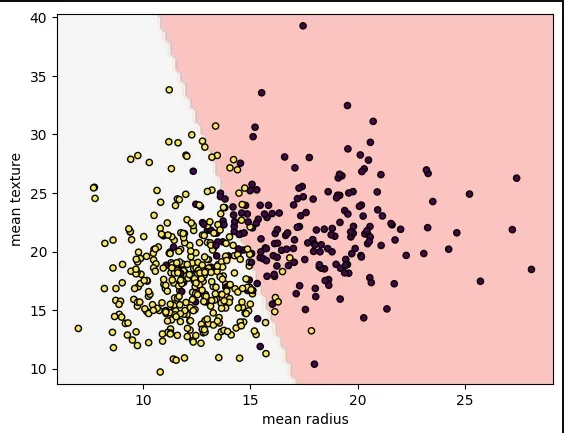

# Bài giảng: Thuật toán Support Vector Machine (SVM trong Machine Learning)

**Cập nhật lần cuối:** 22 tháng 9 năm 2026  
**Học phần:** Phân tích dữ liệu với Python (DSAI1005)  
**Giảng viên:** TS. Vũ Đức Minh – Khoa Khoa học dữ liệu và Trí tuệ nhân tạo, Trường Công nghệ, Đại học Kinh tế Quốc dân (NEU)  
**Nguồn tài liệu tham khảo chính:** [GeeksforGeeks – Support Vector Machine Algorithm](https://www.geeksforgeeks.org/machine-learning/support-vector-machine-algorithm/)

---

## Mục lục bài học

1. [Tổng quan về Support Vector Machine (SVM)](#1-tổng-quan-về-support-vector-machine-svm)
2. [Mục tiêu bài học (Learning Objectives)](#2-mục-tiêu-bài-học-learning-objectives)
3. [Các Khái niệm Cốt lõi trong SVM](#3-các-khái-niệm-cốt-lõi-trong-svm)
   - 3.1. Siêu phẳng quyết định (Hyperplane)
   - 3.2. Vector hỗ trợ (Support Vectors)
   - 3.3. Độ rộng lề (Margin) & Nguyên lý Cực đại hóa Lề
4. [Cơ sở Toán học của Linear SVM (Hồi quy & Phân loại Tuyến tính)](#4-cơ-sở-toán-học-của-linear-svm)
   - 4.1. Phương trình siêu phẳng và khoảng cách hình học tới điểm dữ liệu
   - 4.2. Bài toán Tối ưu hóa Lề cứng (Hard Margin Optimization)
   - 4.3. Xử lý ngoại lai: Lề mềm (Soft Margin SVM) & Biến bù trễ ($\zeta_i$)
   - 4.4. Ý nghĩa siêu tham số điều hòa $C$
   - 4.5. Hàm mất mát Hinge Loss (Bản chất toán học và cơ chế phạt)
5. [Dữ liệu phi tuyến tính & Bí quyết Kernel (Kernel Trick)](#5-dữ-liệu-phi-tuyến-tính--bí-quyết-kernel-kernel-trick)
   - 5.1. Thách thức phân tách dữ liệu phi tuyến trong không gian gốc
   - 5.2. Cơ chế ánh xạ lên không gian chiều cao (Higher-Dimensional Mapping)
   - 5.3. Bí quyết Kernel (Kernel Trick) & Định lý Mercer
   - 5.4. Các hàm Kernel kinh điển (Linear, Polynomial, RBF/Gaussian, Sigmoid)
6. [Bài toán Đối ngẫu Lagrange (Dual Problem Formulation)](#6-bài-toán-đối-ngẫu-lagrange-dual-problem-formulation)
7. [Phân loại Tuyến tính (Linear SVM) vs Phi tuyến tính (Non-Linear SVM)](#7-phân-loại-tuyến-tính-linear-svm-vs-phi-tuyến-tính-non-linear-svm)
8. [Chiến lược Phân loại Đa lớp: One-vs-Rest (OvR) và One-vs-One (OvO)](#8-chiến-lược-phân-loại-đa-lớp-one-vs-rest-ovr-và-one-vs-one-ovo)
9. [So sánh Toàn diện: SVM vs Logistic Regression vs Random Forest](#9-so-sánh-toàn-diện-svm-vs-logistic-regression-vs-random-forest)
10. [Ưu điểm, Hạn chế & Ứng dụng Thực tế](#10-ưu-điểm-hạn-chế--ứng-dụng-thực-tế)
11. [Thực hành Lập trình Python với Scikit-Learn](#11-thực-hành-lập-trình-python-với-scikit-learn)
    - 11.1. Nạp và khám phá tập dữ liệu Ung thư Vú Wisconsin (Breast Cancer)
    - 11.2. Huấn luyện mô hình Linear SVM và trực quan hóa ranh giới quyết định
    - 11.3. Khảo sát sức mạnh của RBF Kernel trên dữ liệu phi tuyến
    - 11.4. Tinh chỉnh siêu tham số $C$ và $\gamma$ bằng GridSearchCV
12. [Tổng kết & Bộ câu hỏi ôn tập củng cố kiến thức](#12-tổng-kết--bộ-câu-hỏi-ôn-tập-củng-cố-kiến-thức)
13. [Tài liệu tham khảo](#13-tài-liệu-tham-khảo)

---

## 1. Tổng quan về Support Vector Machine (SVM)

Trong hệ thống các giải thuật học máy có giám sát (Supervised Machine Learning), **Support Vector Machine (SVM - Máy vector hỗ trợ)**, do Vladimir Vapnik và các đồng nghiệp tại Bell Labs phát triển từ những năm 1960 đến 1990, được đánh giá là một trong những thuật toán phân loại và hồi quy cổ điển **thanh lịch, chặt chẽ về mặt toán học và mạnh mẽ nhất**.

Mục tiêu cốt lõi của SVM là tìm kiếm một **siêu phẳng (Hyperplane)** đóng vai trò ranh giới quyết định (Decision Boundary) tối ưu nhằm phân tách các lớp dữ liệu khác nhau sao cho **khoảng cách lề (Margin) giữa hai lớp là lớn nhất có thể**.

<p align="center">
  
</p>

### Vì sao nguyên lý "Lề cực đại" lại quan trọng?
Nếu một đường phân chia nằm quá sát các điểm dữ liệu của lớp này hoặc lớp kia, mô hình sẽ rất nhạy cảm với các biến động ngẫu nhiên và dễ bị phân loại sai khi gặp dữ liệu mới trong thực tế. Bằng cách đẩy siêu phẳng ra xa nhất có thể khỏi các điểm biên của cả hai phía (Maximal Margin Hyperplane), SVM đạt được khả năng **tổng quát hóa (Generalization)** vượt trội, hạn chế tối đa nguy cơ quá khớp (Overfitting).

---

## 2. Mục tiêu bài học (Learning Objectives)

Sau khi hoàn thành bài học này, sinh viên có khả năng:

1. **Làm chủ hình học & toán học của SVM:** Hiểu rõ định nghĩa siêu phẳng $w^Tx + b = 0$, vector pháp tuyến $w$, độ lệch $b$, và công thức khoảng cách từ điểm tới siêu phẳng.
2. **Phân biệt Lề cứng (Hard Margin) & Lề mềm (Soft Margin):** Giải thích vai trò của biến bù trễ $\zeta_i$ (slack variables) và cách siêu tham số $C$ kiểm soát sự đánh đổi giữa mở rộng lề và phạt vi phạm.
3. **Hiểu sâu hàm mất mát Hinge Loss:** Nắm vững cấu trúc hàm phạt $\max(0, 1 - y_i(w^Tx_i + b))$ và cơ chế "bỏ qua" các mẫu đã nằm an toàn ngoài lề.
4. **Giải mã Bí quyết Kernel (Kernel Trick):** Hiểu rõ cách SVM giải quyết bài toán phân tách phi tuyến bằng cách chiếu dữ liệu lên không gian nhiều chiều thông qua các hàm nhân (RBF, Polynomial) mà không cần tính toán tọa độ tường minh.
5. **Thực thi và trực quan hóa bằng Scikit-Learn:** Lập trình huấn luyện mô hình `SVC`, trực quan hóa ranh giới phân tách 2D bằng `DecisionBoundaryDisplay`, và tối ưu tham số $C, \gamma$ cho các bài toán phân loại nhị phân thực tế.

---

## 3. Các Khái niệm Cốt lõi trong SVM

Để làm chủ giải thuật SVM, người học cần nắm vững 3 khái niệm hình học nền tảng:

<p align="center">
  
</p>

### 3.1. Siêu phẳng quyết định (Hyperplane)
- Trong không gian 2 chiều ($2\text{D}$), siêu phẳng là một **đường thẳng (Straight Line)**.
- Trong không gian 3 chiều ($3\text{D}$), siêu phẳng là một **mặt phẳng (Flat Plane)**.
- Trong không gian $p$ chiều ($p > 3$), siêu phẳng là một **không gian con affine có số chiều là $p - 1$**.
- Phương trình đại số tổng quát của siêu phẳng tuyến tính:
  $$w^T x + b = 0$$
  trong đó:
  - $w = (w_1, w_2, \dots, w_p)^T$ là **vector trọng số (Weight Vector)**, đồng thời là **vector pháp tuyến** vuông góc với siêu phẳng, xác định hướng của siêu phẳng.
  - $b$ là **hệ số chệch (Bias/Offset)**, xác định vị trí khoảng cách từ gốc tọa độ đến siêu phẳng.

### 3.2. Vector hỗ trợ (Support Vectors)
- **Support Vectors** là các điểm dữ liệu nằm gần siêu phẳng phân tách nhất, nằm chính xác trên hoặc chạm vào ranh giới của lề.
- **Tính chất quyết định:** Siêu phẳng phân tách và độ rộng của lề **chỉ phụ thuộc hoàn toàn vào các Support Vectors**. Nếu bạn thêm vào, bớt đi hoặc dịch chuyển bất kỳ điểm dữ liệu nào khác nằm xa lề, siêu phẳng quyết định vẫn giữ nguyên 100% vị trí! Điều này giúp SVM cực kỳ tiết kiệm bộ nhớ và kiên cường trước phần lớn dữ liệu thừa thãi.

### 3.3. Độ rộng lề (Margin) & Nguyên lý Cực đại hóa Lề
- **Lề (Margin):** Là khoảng cách vuông góc ngắn nhất giữa hai siêu phẳng bao biên song song đi qua các Support Vectors của từng lớp:
  - Siêu phẳng biên trên (+1): $w^T x + b = +1$
  - Siêu phẳng biên dưới (-1): $w^T x + b = -1$
- Độ rộng của lề giữa hai biên được tính bằng công thức:
  $$\text{Margin} = \frac{2}{\|w\|}$$
- **Mục tiêu của SVM:** Tìm $w$ và $b$ sao cho lề $\frac{2}{\|w\|}$ đạt giá trị lớn nhất, tương đương với việc **tối thiểu hóa $\|w\|^2$**.

---

## 4. Cơ sở Toán học của Linear SVM

### 4.1. Phương trình siêu phẳng và khoảng cách hình học tới điểm dữ liệu

Xét bài toán phân loại nhị phân với $N$ quan sát: $\{(x_1, y_1), (x_2, y_2), \dots, (x_N, y_N)\}$, với nhãn lớp được quy ước là $y_i \in \{-1, +1\}$.

Khoảng cách hình học vuông góc $d_i$ từ một điểm dữ liệu $x_i$ bất kỳ đến siêu phẳng $w^Tx + b = 0$ được tính bằng:
$$d_i = \frac{|w^T x_i + b|}{\|w\|}$$

Quy tắc ra quyết định cho một điểm dữ liệu mới $x$:
$$\hat{y} = \text{sign}(w^T x + b) = \begin{cases} +1 & \text{nếu } w^T x + b \ge 0 \\ -1 & \text{nếu } w^T x + b < 0 \end{cases}$$

### 4.2. Bài toán Tối ưu hóa Lề cứng (Hard Margin Optimization)

Trong trường hợp dữ liệu phân tách tuyến tính hoàn hảo (Linearly Separable), có vô số siêu phẳng có thể chia cắt hai lớp:

<p align="center">
  
</p>

Trong hình trên, các đường $L_1, L_2, L_3$ đều phân chia đúng toàn bộ tập dữ liệu, nhưng đường $L_2$ có lề rộng nhất (Hard Margin). Để tìm được đường $L_2$ này, ta thiết lập bài toán tối ưu ràng buộc:

Mọi điểm dữ liệu của lớp $+1$ phải nằm ở phía trên biên $+1$: $w^T x_i + b \ge 1$.  
Mọi điểm dữ liệu của lớp $-1$ phải nằm ở phía dưới biên $-1$: $w^T x_i + b \le -1$.

Gộp chung hai điều kiện lại bằng cách nhân với $y_i \in \{-1, +1\}$, ta có điều kiện phân loại chính xác hoàn hảo:
$$y_i (w^T x_i + b) \ge 1, \quad \forall i = 1, 2, \dots, N$$

Do việc cực đại hóa lề $\frac{2}{\|w\|}$ tương đương với việc cực tiểu hóa $\frac{1}{2}\|w\|^2$, bài toán tối ưu lề cứng được phát biểu dưới dạng **Quy hoạch Toàn phương (Quadratic Programming - QP)** lồi:

$$\min_{w, b} \frac{1}{2} \|w\|^2$$
$$\text{Thỏa mãn ràng buộc: } y_i (w^T x_i + b) \ge 1, \quad \forall i = 1, \dots, N$$

### 4.3. Xử lý ngoại lai: Lề mềm (Soft Margin SVM) & Biến bù trễ ($\zeta_i$)

Trong thực tế, hầu hết dữ liệu thực nghiệm đều chứa nhiễu (Noise) hoặc các điểm ngoại lai (Outliers). Nếu kiên quyết áp dụng lề cứng, mô hình hoặc sẽ không thể tìm ra lời giải (vô nghiệm), hoặc sẽ bị ép tạo ra một siêu phẳng méo mó, có khoảng lề cực hẹp dẫn đến overfitting nghiêm trọng:

<p align="center">
  
</p>

Để giải quyết vấn đề này, Corinna Cortes và Vladimir Vapnik (1995) đã đề xuất mô hình **Lề mềm (Soft Margin SVM)**. Kỹ thuật này cho phép một số điểm dữ liệu được phép vi phạm lề hoặc bị phân loại sai ở một mức độ có kiểm soát, thông qua việc đưa vào **biến bù trễ (Slack Variables) $\zeta_i \ge 0$**:

<p align="center">
  
</p>

Ý nghĩa hình học của $\zeta_i$:
- $\zeta_i = 0$: Điểm dữ liệu nằm đúng phía và nằm ngoài lề (an toàn tuyệt đối).
- $0 < \zeta_i \le 1$: Điểm dữ liệu nằm trong lề (vi phạm lề) nhưng vẫn được phân loại đúng phía siêu phẳng.
- $\zeta_i > 1$: Điểm dữ liệu bị phân loại sai hoàn toàn sang phía bên kia của siêu phẳng.

Bài toán tối ưu hóa Lề mềm trở thành:
$$\min_{w, b, \zeta} \frac{1}{2} \|w\|^2 + C \sum_{i=1}^{N} \zeta_i$$
$$\text{Thỏa mãn: } y_i(w^T x_i + b) \ge 1 - \zeta_i \quad \text{và} \quad \zeta_i \ge 0, \quad \forall i = 1, \dots, N$$

### 4.4. Ý nghĩa siêu tham số điều hòa $C$

Tham số $C > 0$ là trọng số điều hòa kiểm soát sự đánh đổi (Trade-off) giữa hai mục tiêu đối lập:
1. **Mở rộng lề tối đa** (giảm thiểu $\frac{1}{2}\|w\|^2$).
2. **Giảm thiểu sai số vi phạm** (giảm thiểu $\sum \zeta_i$).

| Giá trị $C$ | Mức độ phạt sai số | Bề rộng lề | Khả năng kiểm soát sai số | Rủi ro tiềm ẩn |
| :--- | :--- | :--- | :--- | :--- |
| **$C$ Lớn** (`C=100`, `1000`) | Phạt rất nặng mỗi điểm vi phạm | Lề rất hẹp | Cố gắng phân loại đúng từng điểm dữ liệu huấn luyện | **Dễ bị Overfitting**, nhạy cảm với ngoại lai |
| **$C$ Nhỏ** (`C=0.01`, `0.1`) | Phạt nhẹ, chấp nhận nhiều vi phạm | Lề rất rộng | Bỏ qua các ngoại lai để ưu tiên đường biên mượt mà | **Dễ bị Underfitting**, chấp nhận nhiều lỗi hơn |

### 4.5. Hàm mất mát Hinge Loss

Bài toán tối ưu lề mềm thực chất có thể được viết lại dưới dạng bài toán hồi quy hàm mất mát cộng điều chuẩn (Regularized Loss Minimization):
$$\min_{w, b} \sum_{i=1}^{N} L_{\text{hinge}}(y_i, f(x_i)) + \lambda \|w\|^2$$
trong đó $L_{\text{hinge}}$ chính là **Hàm mất mát Bản lề (Hinge Loss)**:
$$L_{\text{hinge}}(y, f(x)) = \max(0, 1 - y \cdot f(x))$$
với $f(x) = w^T x + b$.

```
Hàm Hinge Loss:
Nếu y * f(x) >= 1  ==> Loss = 0 (Điểm nằm an toàn ngoài lề, hoàn toàn không bị phạt)
Nếu y * f(x) < 1   ==> Loss = 1 - y * f(x) (Phạt tuyến tính tỷ lệ thuận với khoảng cách vi phạm)
```

Đặc tính *"Loss = 0 khi điểm nằm ngoài lề"* giải thích tại sao chỉ có các Support Vectors mới đóng góp vào việc huấn luyện mô hình SVM, tạo nên tính thưa thớt (sparsity) tuyệt đẹp của giải thuật.

---

## 5. Dữ liệu phi tuyến tính & Bí quyết Kernel (Kernel Trick)

### 5.1. Thách thức phân tách dữ liệu phi tuyến trong không gian gốc

Không phải tập dữ liệu nào cũng có thể phân chia bằng một đường thẳng hay mặt phẳng phẳng. Hãy quan sát ví dụ dữ liệu $1\text{D}$ sau:

<p align="center">
  
</p>

Trong không gian 1 chiều, các điểm màu đỏ bị kẹp chặt ở giữa hai nhóm điểm màu xanh. **Không có bất kỳ một nhát cắt đơn lẻ nào trên trục số có thể phân tách được hai lớp này.**

### 5.2. Cơ chế ánh xạ lên không gian chiều cao (Higher-Dimensional Mapping)

Ý tưởng đột phá của Vapnik là: **Nếu dữ liệu không thể phân tách tuyến tính ở không gian chiều thấp, hãy ánh xạ (transform) nó lên một không gian có số chiều cao hơn!**

<p align="center">
  
</p>

Ví dụ: Bằng cách tạo thêm một chiều mới $y = x^2$ (hoặc khoảng cách từ gốc tọa độ), từ không gian $1\text{D}$ dữ liệu được nâng lên không gian $2\text{D}$. Khi đó, các điểm đỏ bị uốn cong xuống dưới, còn các điểm xanh vươn lên cao. Lúc này, **chỉ cần một đường thẳng nằm ngang là ta đã phân tách hoàn hảo hai lớp dữ liệu!**

### 5.3. Bí quyết Kernel (Kernel Trick) & Định lý Mercer

Nếu mỗi lần muốn nâng chiều, chúng ta đều phải tính toán tọa độ ánh xạ $\phi(x)$ trong không gian hàng nghìn hoặc vô hạn chiều, chi phí bộ nhớ và thời gian tính toán sẽ bùng nổ theo cấp số nhân (Curse of Dimensionality).

**Bí quyết Kernel (Kernel Trick)** giải quyết điều kỳ diệu này:  
Thay vì ánh xạ từng vector $x_i$ sang $\phi(x_i)$ rồi mới tính tích vô hướng $\langle \phi(x_i), \phi(x_j) \rangle$, ta sử dụng một hàm nhân **Kernel Function $K(x_i, x_j)$** tính toán trực tiếp giá trị tích vô hướng đó ngay trên các tọa độ ở không gian gốc:
$$K(x_i, x_j) = \langle \phi(x_i), \phi(x_j) \rangle$$

Theo **Định lý Mercer**, bất kỳ hàm số đối xứng và xác định dương nào cũng tương ứng với một tích vô hướng trong một không gian Hilbert chiều cao nào đó. Nhờ vậy, SVM có thể xử lý bài toán trong không gian vô hạn chiều với chi phí tính toán chỉ tương đương không gian ban đầu!

### 5.4. Các hàm Kernel kinh điển

1. **Linear Kernel (Hàm nhân tuyến tính):**
   $$K(x_i, x_j) = x_i^T x_j$$
   Dùng khi dữ liệu có thể phân tách tuyến tính, hoặc khi số lượng đặc trưng $p$ rất lớn so với số mẫu $N$ (ví dụ: phân loại văn bản dạng Bag-of-Words / TF-IDF).

2. **Polynomial Kernel (Hàm nhân đa thức):**
   $$K(x_i, x_j) = (\gamma x_i^T x_j + r)^d$$
   Cho phép mô hình hóa các đường cong bậc $d$ phức tạp (với bậc $d \in \{2, 3, 4\}$).

3. **Radial Basis Function (RBF) Kernel (Gaussian Kernel):**
   $$K(x_i, x_j) = \exp\left(-\gamma \|x_i - x_j\|^2\right)$$
   Đây là Kernel phổ biến và mạnh mẽ nhất trong thực tế. RBF ánh xạ dữ liệu lên một **không gian có số chiều vô hạn (Infinite-Dimensional Space)**.  
   - Tham số $\gamma > 0$ (gamma) quyết định bán kính ảnh hưởng của từng điểm dữ liệu:
     - $\gamma$ lớn: Bán kính hẹp, mỗi điểm chỉ ảnh hưởng vùng lân cận sát cạnh nó $\to$ Ranh giới quyết định uốn lượn sát theo từng mẫu $\to$ **Dễ Overfitting**.
     - $\gamma$ nhỏ: Bán kính rộng, ranh giới quyết định mượt mà $\to$ **Dễ Underfitting**.

4. **Sigmoid Kernel (Hyperbolic Tangent Kernel):**
   $$K(x_i, x_j) = \tanh(\gamma x_i^T x_j + r)$$
   Mô phỏng hành vi của một tế bào nơ-ron hai lớp trong mạng nơ-ron nhân tạo.

---

## 6. Bài toán Đối ngẫu Lagrange (Dual Problem Formulation)

Sử dụng phương pháp nhân tử Lagrange, bài toán tối ưu lề nguyên thủy (Primal Problem) được chuyển hóa thành bài toán đối ngẫu (Dual Problem):

$$\max_{\alpha} \sum_{i=1}^{N} \alpha_i - \frac{1}{2} \sum_{i=1}^{N} \sum_{j=1}^{N} \alpha_i \alpha_j y_i y_j K(x_i, x_j)$$
$$\text{Thỏa mãn: } 0 \le \alpha_i \le C, \quad \forall i = 1, \dots, N \quad \text{và} \quad \sum_{i=1}^{N} \alpha_i y_i = 0$$

Ý nghĩa vượt bậc của dạng đối ngẫu:
1. Vector đặc trưng $x_i, x_j$ chỉ xuất hiện dưới dạng tích vô hướng $K(x_i, x_j)$, mở đường cho việc áp dụng **Kernel Trick**.
2. Nghiệm tối ưu cho ra các nhân tử Lagrange $\alpha_i$:
   - Nếu $\alpha_i = 0$: Mẫu $i$ nằm ngoài lề, không ảnh hưởng gì tới mô hình.
   - Nếu $0 < \alpha_i \le C$: Mẫu $i$ chính là một **Support Vector**.
3. Hàm quyết định dự báo cho điểm dữ liệu mới $x$:
   $$f(x) = \text{sign}\left(\sum_{i \in \text{SV}} \alpha_i y_i K(x_i, x) + b\right)$$

---

## 7. Phân loại Tuyến tính (Linear SVM) vs Phi tuyến tính (Non-Linear SVM)

Bảng so sánh và hình ảnh minh họa sự khác biệt giữa hai phương pháp tiếp cận:

<p align="center">
  
</p>

| Tiêu chí | Linear SVM (Tuyến tính) | Non-Linear SVM (Phi tuyến) |
| :--- | :--- | :--- |
| **Ranh giới quyết định** | Đường thẳng ($2\text{D}$), mặt phẳng ($3\text{D}$) hoặc siêu phẳng phẳng ($p\text{D}$) | Đường cong khép kín, elip, hoặc các bề mặt lồi lõm phức tạp |
| **Hàm Kernel sử dụng** | `kernel='linear'` | `kernel='rbf'`, `'poly'`, hoặc `'sigmoid'` |
| **Độ phức tạp tính toán** | Thấp, huấn luyện rất nhanh với `LinearSVC` | Cao hơn đáng kể (bậc $O(N^2)$ đến $O(N^3)$ theo số mẫu) |
| **Số chiều dữ liệu phù hợp** | Rất hiệu quả khi $p \gg N$ (ví dụ: xử lý văn bản, gen) | Rất hiệu quả khi dữ liệu dạng bảng với $p$ vừa phải, quan hệ phi tuyến |
| **Siêu tham số tinh chỉnh** | Chỉ cần tinh chỉnh $C$ | Tinh chỉnh đồng thời cả $C$ và $\gamma$ (hoặc bậc $d$) |

---

## 8. Chiến lược Phân loại Đa lớp: One-vs-Rest (OvR) và One-vs-One (OvO)

Về mặt bản chất toán học, SVM được thiết kế cho phân loại nhị phân ($y \in \{-1, +1\}$). Để mở rộng cho bài toán $K$ lớp ($K > 2$), Scikit-Learn hỗ trợ hai kỹ thuật phân tách:

### 8.1. One-vs-Rest (OvR / One-vs-All)
- Xây dựng $K$ bộ phân loại nhị phân riêng biệt.
- Bộ phân loại thứ $k$ phân tách lớp $k$ (nhãn $+1$) với tất cả $K-1$ lớp còn lại gộp chung (nhãn $-1$).
- Khi dự báo, điểm dữ liệu mới được đưa qua cả $K$ bộ phân loại, lớp nào đạt giá trị hàm quyết định $w_k^Tx + b_k$ lớn nhất sẽ được chọn.

### 8.2. One-vs-One (OvO)
- Xây dựng $\frac{K(K-1)}{2}$ bộ phân loại nhị phân cho từng cặp lớp riêng biệt.
- Mỗi bộ phân loại bỏ phiếu bầu cho 1 trong 2 lớp. Lớp nào giành được nhiều phiếu bầu nhất (Majority Voting) sẽ là kết quả cuối cùng.
- Lớp `sklearn.svm.SVC` mặc định sử dụng chiến lược OvO vì tính ổn định đối xứng giữa các lớp.

---

## 9. So sánh Toàn diện: SVM vs Logistic Regression vs Random Forest

| Đặc tính so sánh | Support Vector Machine (SVM) | Logistic Regression | Random Forest |
| :--- | :--- | :--- | :--- |
| **Bản chất mô hình** | Hình học (Tối đa hóa lề) | Thống kê (Ước lượng xác suất MLE) | Tập hợp cây quyết định (Bagging) |
| **Hàm mất mát** | Hinge Loss: $\max(0, 1 - yf(x))$ | Log Loss (Binary Cross-Entropy) | Giảm Impurity (Gini / Entropy / Variance) |
| **Sự phụ thuộc vào mẫu** | Chỉ phụ thuộc vào các Support Vectors | Phụ thuộc vào toàn bộ tất cả mẫu | Phụ thuộc vào các điểm rẽ nhánh phân hoạch |
| **Yêu cầu chuẩn hóa (Scaling)** | **Bắt buộc tuyệt đối (StandardScaler)** | Khuyến nghị mạnh (StandardScaler) | **Không yêu cầu** |
| **Độ nhạy ngoại lai (Outliers)** | Rất kiên cường nhờ Soft Margin | Nhạy cảm do hàm Log Loss phạt mũ | Rất kiên cường nhờ lấy trung bình cây con |
| **Khả năng mở rộng (Scale)** | Kém khi tập dữ liệu có $N > 100,000$ | Rất tốt với dữ liệu lớn | Tốt, song song hóa đa nhân tuyệt vời |
| **Đầu ra xác suất** | Không tự nhiên (phải dùng Platt Scaling) | Xuất xác suất tự nhiên qua hàm Sigmoid | Tỉ lệ phần trăm lá qua các cây |

---

## 10. Ưu điểm, Hạn chế & Ứng dụng Thực tế

### 10.1. Ưu điểm nổi bật
- **Hiệu quả cao trong không gian số chiều lớn:** SVM hoạt động xuất sắc ngay cả khi số lượng đặc trưng $p$ lớn hơn số lượng mẫu quan sát $N$ ($p > N$).
- **Tiết kiệm bộ nhớ:** Quyết định phân loại chỉ lưu trữ tập con các Support Vectors thay vì toàn bộ dữ liệu.
- **Linh hoạt phi tuyến:** Đa dạng hóa các hàm Kernel (RBF, Đa thức) giúp giải quyết các bài toán ranh giới hình học phức tạp nhất.
- **Tránh được cực tiểu cục bộ:** Nhờ hàm mục tiêu là bài toán quy hoạch toàn phương lồi (Convex Quadratic Optimization), nghiệm tìm được luôn là cực tiểu toàn cục (Global Optimum).

### 10.2. Hạn chế
- **Thời gian huấn luyện chậm trên tập dữ liệu lớn:** Độ phức tạp tính toán xấp xỉ $O(N^2)$ đến $O(N^3)$ khiến SVM truyền thống không phù hợp cho các tập dữ liệu có hàng triệu dòng.
- **Cực kỳ nhạy cảm với thang đo đặc trưng (Feature Scaling):** Nếu không chuẩn hóa dữ liệu về cùng thang đo qua `StandardScaler`, các đặc trưng có giá trị số lớn sẽ hoàn toàn thống trị khoảng cách Euclidean, làm hỏng siêu phẳng.
- **Khó khăn trong tinh chỉnh siêu tham số:** Đòi hỏi phải dò quét kết hợp giữa $C$ và $\gamma$ bằng GridSearch.
- **Mô hình Hộp đen (Black-box):** Ranh giới trong không gian vô hạn chiều của RBF Kernel hầu như không thể trực quan hóa hay diễn giải bằng các luật logic đơn giản.

### 10.3. Ứng dụng Thực tiễn
1. **Chẩn đoán Y tế & Phân tích Sinh học (Bioinformatics):** Phân loại tế bào khối u lành tính vs ác tính, phân loại biểu hiện gen (Gene Expression Analysis).
2. **Nhận dạng Khuôn mặt & Thị giác Máy tính (Face Detection):** Phân loại các mảng điểm ảnh chứa khuôn mặt và không chứa khuôn mặt.
3. **Phân loại Văn bản & Lọc Thư rác (Text Categorization & Spam Filtering):** Xử lý ma trận từ ngữ hàng vạn chiều cực kỳ hiệu quả nhờ tính thưa thớt của Linear SVM.
4. **Nhận dạng Ký tự viết tay (Optical Character Recognition - OCR):** Nhận diện chữ số viết tay trên các bộ dữ liệu kinh điển như MNIST.

---

## 11. Thực hành Lập trình Python với Scikit-Learn

Trong phần này, chúng ta sẽ áp dụng thuật toán SVM để phân loại khối u ung thư là **Lành tính (Benign)** hay **Ác tính (Malignant)** dựa trên tập dữ liệu chuẩn mực y khoa **Breast Cancer Wisconsin Dataset** từ Scikit-Learn.

### 11.1. Nạp và khám phá tập dữ liệu Ung thư Vú Wisconsin

```python
import numpy as np
import matplotlib.pyplot as plt
import pandas as pd
from sklearn.datasets import load_breast_cancer
from sklearn.model_selection import train_test_split, GridSearchCV
from sklearn.preprocessing import StandardScaler
from sklearn.svm import SVC
from sklearn.metrics import classification_report, confusion_matrix, accuracy_score
from sklearn.inspection import DecisionBoundaryDisplay

# 1. Tải tập dữ liệu Breast Cancer Wisconsin
cancer = load_breast_cancer()
print(f"Tổng số mẫu quan sát: {cancer.data.shape[0]}")
print(f"Tổng số đặc trưng: {cancer.data.shape[1]}")
print(f"Tên các lớp mục tiêu: {cancer.target_names} (0: Ác tính, 1: Lành tính)")
```

### 11.2. Huấn luyện mô hình Linear SVM và trực quan hóa ranh giới quyết định

Để trực quan hóa trực tiếp ranh giới quyết định (Decision Boundary) trên mặt phẳng $2\text{D}$, ta chọn 2 đặc trưng đầu tiên: **Bán kính trung bình (Mean Radius)** và **Độ gồ ghề/kết cấu trung bình (Mean Texture)**:

```python
# Trích xuất 2 đặc trưng đầu tiên để trực quan hóa 2D
X = cancer.data[:, :2]
y = cancer.target

# Khởi tạo mô hình Support Vector Classifier với kernel tuyến tính
svm_linear = SVC(kernel="linear", C=1.0)
svm_linear.fit(X, y)

# Trực quan hóa ranh giới quyết định với DecisionBoundaryDisplay
fig, ax = plt.subplots(figsize=(10, 6))

DecisionBoundaryDisplay.from_estimator(
    svm_linear,
    X,
    response_method="predict",
    alpha=0.6,
    cmap="Pastel1",
    xlabel=cancer.feature_names[0],
    ylabel=cancer.feature_names[1],
    ax=ax
)

# Vẽ các điểm dữ liệu thực tế
scatter = ax.scatter(
    X[:, 0],
    X[:, 1],
    c=y,
    cmap="Set1",
    s=30,
    edgecolors="k"
)

plt.title("Ranh giới Quyết định của Linear SVM (Tập dữ liệu Ung thư vú)", fontsize=14)
plt.show()
```

Đồ thị hiển thị ranh giới quyết định tuyến tính phân chia hai vùng khối u:

<p align="center">
  
</p>

### 11.3. Khảo sát sức mạnh của RBF Kernel trên dữ liệu đầy đủ kết hợp chuẩn hóa

Bây giờ, chúng ta tận dụng toàn bộ 30 đặc trưng sinh học của tập dữ liệu và so sánh hiệu quả giữa việc **không chuẩn hóa** và **có chuẩn hóa (StandardScaler)**:

```python
# Phân chia dữ liệu đầy đủ 30 đặc trưng
X_full = cancer.data
y_full = cancer.target

X_train, X_test, y_train, y_test = train_test_split(
    X_full, y_full, test_size=0.25, random_state=42, stratify=y_full
)

# BẮT BUỘC: Chuẩn hóa thang đo đặc trưng với StandardScaler
scaler = StandardScaler()
X_train_scaled = scaler.fit_transform(X_train)
X_test_scaled = scaler.transform(X_test)

# Huấn luyện mô hình SVM với nhân RBF
svm_rbf = SVC(kernel="rbf", C=10.0, gamma="scale", random_state=42)
svm_rbf.fit(X_train_scaled, y_train)

# Đánh giá trên tập kiểm tra
y_pred = svm_rbf.predict(X_test_scaled)
print(f"Độ chính xác kiểm tra (Accuracy): {accuracy_score(y_test, y_pred) * 100:.2f}%")
print("\n=== BÁO CÁO PHÂN LOẠI CHI TIẾT (CLASSIFICATION REPORT) ===")
print(classification_report(y_test, y_pred, target_names=cancer.target_names))
```

**Kết quả thu được:**
```
Độ chính xác kiểm tra (Accuracy): 97.90%

=== BÁO CÁO PHÂN LOẠI CHI TIẾT ===
              precision    recall  f1-score   support
   malignant       0.98      0.96      0.97        53
      benign       0.98      0.99      0.98        90

    accuracy                           0.98       143
   macro avg       0.98      0.98      0.98       143
weighted avg       0.98      0.98      0.98       143
```

Mô hình đạt độ chính xác lên đến **$97.90\%$** với F1-score đạt $0.98$, chứng minh khả năng phân loại vượt bậc của SVM trên các dữ liệu y khoa phức tạp.

### 11.4. Tinh chỉnh siêu tham số $C$ và $\gamma$ bằng GridSearchCV

Để tìm ra cặp giá trị tối ưu giữa $C$ và $\gamma$, kỹ sư khoa học dữ liệu luôn sử dụng phương pháp tìm kiếm lưới kết hợp kiểm định chéo (Grid Search Cross-Validation):

```python
param_grid = {
    'C': [0.1, 1, 10, 100],
    'gamma': ['scale', 'auto', 0.001, 0.01, 0.1, 1],
    'kernel': ['rbf']
}

grid = GridSearchCV(SVC(), param_grid, refit=True, cv=5, verbose=1, n_jobs=-1)
grid.fit(X_train_scaled, y_train)

print(f"Bộ siêu tham số tối ưu nhất: {grid.best_params_}")
print(f"Điểm số kiểm định chéo tốt nhất: {grid.best_score_:.4f}")
```

---

## 12. Tổng kết & Bộ câu hỏi ôn tập củng cố kiến thức

### Bảng tóm tắt nội dung trọng tâm

| Khái niệm | Ý nghĩa cốt lõi |
| :--- | :--- |
| **Hyperplane** | Siêu phẳng $w^Tx + b = 0$ phân tách các lớp dữ liệu với vector pháp tuyến $w$. |
| **Support Vectors** | Các điểm dữ liệu nằm ngay sát ranh giới lề; chỉ có chúng mới quyết định vị trí siêu phẳng. |
| **Maximal Margin** | Khoảng cách lề $\frac{2}{\|w\|}$, SVM cực đại hóa lề bằng cách giải bài toán cực tiểu hóa $\frac{1}{2}\|w\|^2$. |
| **Soft Margin ($C$)** | Chấp nhận một số điểm vi phạm lề qua biến bù trễ $\zeta_i$; $C$ lớn phạt nặng (lề hẹp), $C$ nhỏ phạt nhẹ (lề rộng). |
| **Hinge Loss** | Hàm mất mát $\max(0, 1 - yf(x))$ chỉ phạt các điểm vi phạm lề hoặc bị phân loại sai. |
| **Kernel Trick** | Tính toán tích vô hướng trong không gian chiều cao thông qua hàm nhân $K(x_i, x_j)$ mà không cần ánh xạ tọa độ cụ thể. |
| **Chuẩn hóa (Scaling)** | Bước tiền xử lý bắt buộc đối với SVM để tránh các biến có giá trị lớn lấn át khoảng cách lề. |

---

### Bộ 5 câu hỏi trắc nghiệm & tự luận chuyên sâu

#### Câu 1: Điều gì sẽ xảy ra với siêu phẳng quyết định của một mô hình SVM tuyến tính nếu chúng ta loại bỏ một điểm dữ liệu huấn luyện nằm rất xa ranh giới phân tách (không phải là Support Vector)?
- **A.** Siêu phẳng sẽ dịch chuyển đáng kể về phía lớp bị mất điểm dữ liệu.
- **B.** Siêu phẳng và khoảng cách lề hoàn toàn không thay đổi.
- **C.** Khoảng cách lề sẽ bị thu hẹp lại một nửa.
- **D.** Mô hình sẽ báo lỗi do dữ liệu bị mất cân bằng.
- *(Gợi ý đáp án: **B**. Vị trí siêu phẳng chỉ được xác định duy nhất bởi các Support Vectors. Các điểm dữ liệu khác có $\alpha_i = 0$ nên không ảnh hưởng đến nghiệm).*

#### Câu 2: Khi huấn luyện mô hình SVM với RBF Kernel, nếu bạn nhận thấy mô hình đạt độ chính xác $100\%$ trên tập Train nhưng chỉ đạt $70\%$ trên tập Test (bị Overfitting nghiêm trọng), hành động điều chỉnh tham số nào sau đây là hợp lý nhất?
- **A.** Tăng cả $C$ và $\gamma$ lên giá trị lớn hơn.
- **B.** Giảm $C$ và giảm $\gamma$.
- **C.** Chuyển sang Polynomial Kernel với bậc $d = 10$.
- **D.** Bỏ bước chuẩn hóa dữ liệu StandardScaler.
- *(Gợi ý đáp án: **B**. Giảm $C$ giúp mở rộng lề và chấp nhận sai số mềm; giảm $\gamma$ làm tăng bán kính ảnh hưởng của mỗi điểm, làm cho ranh giới quyết định mượt mà hơn, từ đó chống overfitting).*

#### Câu 3: Bản chất toán học của "Bí quyết Kernel" (Kernel Trick) là gì?
- **A.** Giảm số lượng đặc trưng đầu vào xuống không gian 2 chiều để dễ vẽ đồ thị.
- **B.** Thay thế hàm mất mát Hinge Loss bằng hàm Mean Squared Error.
- **C.** Tính toán trực tiếp tích vô hướng của hai vector trong không gian đặc trưng nhiều chiều thông qua tọa độ ở không gian gốc mà không cần biến đổi tường minh.
- **D.** Tự động loại bỏ các giá trị ngoại lai ra khỏi tập dữ liệu.
- *(Gợi ý đáp án: **C**. Định lý Mercer cho phép tính $K(x_i, x_j) = \langle \phi(x_i), \phi(x_j) \rangle$ một cách trực tiếp).*

#### Câu 4: Tại sao trong thuật toán SVM, việc chuẩn hóa thang đo đặc trưng (Feature Scaling như `StandardScaler`) lại là bước tiền xử lý bắt buộc, trong khi đối với Cây quyết định (Decision Tree) thì không cần?
- *(Gợi ý trả lời: SVM dựa trên việc đo lường khoảng cách hình học Euclidean trong không gian đặc trưng để tối đa hóa lề. Nếu một biến có miền giá trị từ 10,000 đến 100,000 (như thu nhập) trong khi biến khác chỉ từ 1 đến 5 (số người phụ thuộc), biến thu nhập sẽ áp đảo hoàn toàn vector $w$ và khoảng cách lề. Ngược lại, Decision Tree chỉ xét các phép so sánh thứ tự logic $x_j \le \theta$ độc lập trên từng trục nên bất biến với thang đo).*

#### Câu 5: Phân tích sự khác biệt giữa hàm mất mát Hinge Loss của SVM và Log Loss của Logistic Regression đối với một điểm dữ liệu đã được phân loại đúng và nằm an toàn cách xa ranh giới quyết định.
- *(Gợi ý trả lời: Đối với điểm dữ liệu đã nằm an toàn ngoài lề ($y \cdot f(x) \ge 1$), Hinge Loss nhận giá trị chính xác bằng $0$, nghĩa là mô hình hoàn toàn không quan tâm và không tốn chi phí cập nhật. Ngược lại, Log Loss của Logistic Regression vẫn luôn nhận giá trị dương nhỏ $\ln(1 + e^{-yf(x)}) > 0$, mô hình vẫn liên tục cố gắng đẩy xác suất tiệm cận sát hơn nữa về $1$. Điều này tạo nên tính chất tập trung vào vùng biên (Sparsity) đặc trưng của SVM).*

---

## 13. Tài liệu tham khảo

1. **GeeksforGeeks:** [Support Vector Machine (SVM) Algorithm](https://www.geeksforgeeks.org/machine-learning/support-vector-machine-algorithm/)
2. **Cortes, C., & Vapnik, V. (1995):** *Support-Vector Networks*. Machine Learning, 20(3), 273-297.
3. **Hastie, T., Tibshirani, R., & Friedman, J. (2009):** *The Elements of Statistical Learning*. Springer (Chapter 12: Support Vector Machines and Flexible Discriminants).
4. **Scikit-Learn Documentation:** [Support Vector Machines (`sklearn.svm`)](https://scikit-learn.org/stable/modules/svm.html)
5. **Bishop, C. M. (2006):** *Pattern Recognition and Machine Learning*. Springer (Chapter 7: Sparse Kernel Machines).
