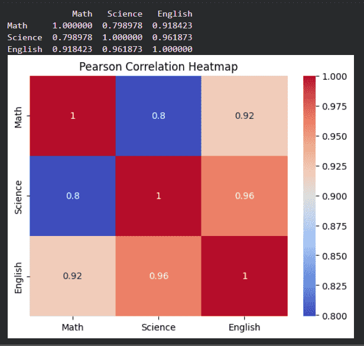
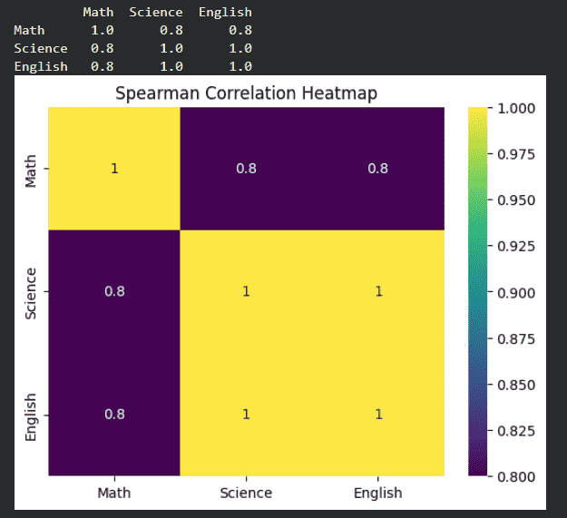

# Khám phá tương quan trong Python

**Cập nhật lần cuối:** 6 tháng 2 năm 2026

Tương quan là một trong những thước đo thống kê được sử dụng phổ biến nhất để tìm hiểu mối quan hệ giữa các biến. Trong Python, phân tích tương quan giúp xác định liệu hai biến:

- Cùng tăng hoặc cùng giảm.
- Biến động theo hai hướng ngược nhau.
- Không thể hiện mối quan hệ rõ ràng.

Phân tích tương quan có thể hỗ trợ:

- Hiểu mối quan hệ giữa các biến trong dữ liệu.
- Lựa chọn đặc trưng cho mô hình học máy.
- Phát hiện đa cộng tuyến.
- Hỗ trợ đưa ra quyết định dựa trên dữ liệu.

<p align="center">
  
</p>

### Câu hỏi nhanh

**Câu 1.** Tương quan được sử dụng để đo điều gì?

A. Số lượng dòng dữ liệu  
B. Mức độ và chiều của mối quan hệ giữa hai biến  
C. Kích thước tệp dữ liệu  
D. Số lượng giá trị thiếu  

**Câu 2. Đúng hay sai?** Tương quan có thể được sử dụng để hỗ trợ lựa chọn đặc trưng trong học máy.

---

# Tương quan là gì?

Tương quan đo lường **mức độ mạnh yếu** và **chiều hướng** của mối quan hệ giữa hai biến số.

Giá trị của hệ số tương quan thường nằm trong khoảng:

\[
-1 \leq r \leq 1
\]

Trong đó:

- **\(r=1\):** Mối quan hệ dương hoàn hảo.
- **\(r=-1\):** Mối quan hệ âm hoàn hảo.
- **\(r=0\):** Không có mối tương quan tuyến tính rõ ràng.

## Tương quan dương

Tương quan dương xuất hiện khi hai biến có xu hướng thay đổi cùng chiều.

Ví dụ:

- Chiều cao và cân nặng.
- Thời gian học và điểm số.
- Ngân sách quảng cáo và doanh số trong một số bối cảnh.

Khi một biến tăng, biến còn lại cũng có xu hướng tăng. Khi một biến giảm, biến còn lại cũng có xu hướng giảm.

## Tương quan âm

Tương quan âm xuất hiện khi hai biến có xu hướng thay đổi ngược chiều.

Ví dụ:

- Giá bán và nhu cầu.
- Tốc độ di chuyển và thời gian hoàn thành cùng một quãng đường.
- Mức tiêu thụ nhiên liệu hiệu quả và lượng nhiên liệu cần dùng.

Khi một biến tăng, biến còn lại có xu hướng giảm.

## Không có tương quan

Giá trị tương quan gần 0 cho thấy không có mối quan hệ tuyến tính rõ ràng giữa hai biến.

Ví dụ:

- Cỡ giày và điểm thi.
- Số chữ cái trong tên và thu nhập.
- Màu yêu thích và chiều cao.

> **Lưu ý:** Hệ số tương quan bằng 0 không nhất thiết có nghĩa hai biến hoàn toàn không liên quan. Hai biến vẫn có thể có mối quan hệ phi tuyến.

### Câu hỏi nhanh

**Câu 1.** Giá trị tương quan bằng `+1` thể hiện:

A. Mối quan hệ dương hoàn hảo  
B. Mối quan hệ âm hoàn hảo  
C. Không có tương quan  
D. Dữ liệu có giá trị thiếu  

**Câu 2.** Trường hợp nào là ví dụ về tương quan âm?

A. Chiều cao và cân nặng  
B. Giá bán và nhu cầu  
C. Số giờ học và điểm thi  
D. Nhiệt độ và doanh số kem  

**Câu 3. Đúng hay sai?** Hệ số tương quan bằng 0 luôn chứng minh hai biến hoàn toàn không có bất kỳ mối quan hệ nào.

---

# Các phương pháp tương quan phổ biến trong Python

Python hỗ trợ nhiều phương pháp tính tương quan. Ba phương pháp phổ biến gồm:

1. Tương quan Pearson.
2. Tương quan Spearman.
3. Tương quan Kendall.

---

## 1. Tương quan Pearson

Tương quan Pearson đo mối quan hệ **tuyến tính** giữa hai biến liên tục.

### Đặc điểm

- Giá trị nằm trong khoảng từ `-1` đến `+1`.
- Thường được sử dụng với dữ liệu số liên tục.
- Phù hợp khi mối quan hệ giữa hai biến gần tuyến tính.
- Thường giả định dữ liệu có phân phối gần chuẩn.
- Nhạy cảm với giá trị ngoại lệ.

### Công thức

Hệ số tương quan Pearson được tính bằng:

$$
r =
\frac{
\sum_{i=1}^{n}(x_i-\bar{x})(y_i-\bar{y})
}{
\sqrt{\sum_{i=1}^{n}(x_i-\bar{x})^2}
\sqrt{\sum_{i=1}^{n}(y_i-\bar{y})^2}
}
$$

Trong đó:

- \(x_i\), \(y_i\) là các quan sát.
- \(\bar{x}\), \(\bar{y}\) là giá trị trung bình.
- \(n\) là số quan sát.

### Khi nào nên dùng?

Có thể cân nhắc Pearson khi:

- Hai biến đều là biến số.
- Mối quan hệ cần khảo sát là tuyến tính.
- Không có quá nhiều ngoại lệ nghiêm trọng.
- Phân phối dữ liệu phù hợp với giả định của phương pháp.

### Câu hỏi nhanh

**Câu 1.** Pearson chủ yếu đo loại mối quan hệ nào?

A. Tuyến tính  
B. Chỉ quan hệ phân loại  
C. Quan hệ địa lý  
D. Quan hệ văn bản  

**Câu 2.** Pearson phù hợp nhất với:

A. Hai biến số liên tục  
B. Hai đoạn văn bản  
C. Hai biến tên danh mục không có thứ tự  
D. Hai tệp hình ảnh  

**Câu 3. Đúng hay sai?** Pearson có thể bị ảnh hưởng mạnh bởi giá trị ngoại lệ.

---

## 2. Tương quan Spearman

Tương quan Spearman đo mối quan hệ **đơn điệu** giữa hai biến bằng cách chuyển giá trị thành thứ hạng trước khi tính tương quan.

### Đặc điểm

- Không yêu cầu mối quan hệ phải tuyến tính.
- Phù hợp với quan hệ đơn điệu.
- Có thể sử dụng với dữ liệu thứ bậc.
- Hữu ích khi dữ liệu không phân phối chuẩn.
- Ít nhạy cảm với ngoại lệ hơn Pearson trong nhiều trường hợp.

### Quan hệ đơn điệu

Một mối quan hệ đơn điệu có nghĩa là:

- Khi một biến tăng, biến còn lại luôn có xu hướng tăng; hoặc
- Khi một biến tăng, biến còn lại luôn có xu hướng giảm.

Tốc độ thay đổi không nhất thiết phải cố định và đường quan hệ không nhất thiết phải thẳng.

### Khi nào nên dùng?

Có thể sử dụng Spearman khi:

- Dữ liệu là dữ liệu thứ bậc.
- Mối quan hệ có tính đơn điệu nhưng không tuyến tính.
- Dữ liệu không đáp ứng tốt giả định phân phối chuẩn.
- Có các ngoại lệ ảnh hưởng đến Pearson.

### Câu hỏi nhanh

**Câu 1.** Spearman tính tương quan dựa trên:

A. Thứ hạng của dữ liệu  
B. Tên cột  
C. Số lượng tệp  
D. Màu sắc biểu đồ  

**Câu 2.** Spearman phù hợp với:

A. Quan hệ đơn điệu  
B. Chỉ quan hệ tuyến tính hoàn hảo  
C. Chỉ dữ liệu văn bản  
D. Chỉ biến nhị phân  

**Câu 3. Đúng hay sai?** Spearman có thể sử dụng cho dữ liệu thứ bậc.

---

## 3. Tương quan Kendall

Tương quan Kendall đo mức độ nhất quán giữa thứ hạng của các cặp quan sát.

### Đặc điểm

- Dựa trên thứ hạng.
- Đo mức độ đồng thuận giữa các cặp quan sát.
- Phù hợp với bộ dữ liệu nhỏ.
- Thường bền vững trong trường hợp có nhiều giá trị bằng nhau hoặc dữ liệu thứ bậc.
- Có thể chậm hơn với bộ dữ liệu lớn.

### Khi nào nên dùng?

Kendall thường được cân nhắc khi:

- Bộ dữ liệu tương đối nhỏ.
- Dữ liệu có tính thứ bậc.
- Cần đánh giá sự nhất quán của thứ hạng.
- Muốn một phương pháp bền vững với giả định phân phối.

### Câu hỏi nhanh

**Câu 1.** Kendall tập trung đo:

A. Sự nhất quán giữa các thứ hạng  
B. Số lượng dòng  
C. Giá trị trung bình  
D. Kích thước tệp  

**Câu 2.** Kendall thường phù hợp với:

A. Bộ dữ liệu nhỏ  
B. Chỉ dữ liệu ảnh  
C. Chỉ dữ liệu âm thanh  
D. Chỉ dữ liệu không có thứ tự  

**Câu 3.** Điểm chung giữa Spearman và Kendall là gì?

A. Cả hai đều dựa trên thứ hạng  
B. Cả hai chỉ áp dụng cho dữ liệu văn bản  
C. Cả hai chỉ đo trung bình  
D. Cả hai luôn cho kết quả giống Pearson  

---

# So sánh Pearson, Spearman và Kendall

| Phương pháp | Loại quan hệ | Dữ liệu phù hợp | Điểm nổi bật |
|---|---|---|---|
| **Pearson** | Tuyến tính | Biến số liên tục | Phổ biến, dễ diễn giải nhưng nhạy cảm với ngoại lệ |
| **Spearman** | Đơn điệu | Dữ liệu số hoặc thứ bậc | Dựa trên thứ hạng, phù hợp với quan hệ phi tuyến đơn điệu |
| **Kendall** | Nhất quán thứ hạng | Dữ liệu thứ bậc, bộ dữ liệu nhỏ | Bền vững và dễ diễn giải theo cặp thứ hạng |

### Câu hỏi nhanh

**Câu 1.** Phương pháp nào phù hợp nhất với mối quan hệ tuyến tính giữa hai biến liên tục?

A. Pearson  
B. Spearman  
C. Kendall  
D. Không phương pháp nào  

**Câu 2.** Phương pháp nào phù hợp khi quan hệ đơn điệu nhưng không tuyến tính?

A. Pearson  
B. Spearman  
C. Chỉ trung bình  
D. Chỉ phương sai  

**Câu 3.** Phương pháp nào thường được xem là phù hợp với bộ dữ liệu nhỏ và dữ liệu thứ bậc?

A. Kendall  
B. Pearson  
C. Histogram  
D. Min-max scaling  

---

# Tính tương quan bằng Python

Python cung cấp các công cụ trong Pandas cùng với các thư viện trực quan hóa như Seaborn và Matplotlib để tính toán và phân tích tương quan.

---

## 1. Tạo bộ dữ liệu mẫu

Trong ví dụ này, ta tạo một bộ dữ liệu gồm điểm ba môn học:

- Toán.
- Khoa học.
- Tiếng Anh.

```python
import pandas as pd
import seaborn as sns
import matplotlib.pyplot as plt

data = {
    "Math": [78, 85, 96, 80, 86],
    "Science": [88, 90, 94, 82, 89],
    "English": [72, 75, 78, 70, 74]
}

df = pd.DataFrame(data)

df
```

### Kết quả minh họa

<p align="center">
  
</p>

Bộ dữ liệu có ba cột số và năm quan sát. Đây là một bộ dữ liệu rất nhỏ, phù hợp để minh họa cú pháp tính tương quan.

### Câu hỏi nhanh

**Câu 1.** Đối tượng nào được sử dụng để tạo bảng dữ liệu?

A. `pd.DataFrame()`  
B. `plt.figure()`  
C. `sns.heatmap()`  
D. `df.drop()`  

**Câu 2.** Bộ dữ liệu mẫu có bao nhiêu biến?

A. 2  
B. 3  
C. 5  
D. 15  

**Câu 3.** Vì sao bộ dữ liệu này phù hợp để minh họa?

---

## 2. Tính tương quan Pearson

Pandas cung cấp phương thức `corr()` để tính tương quan giữa các cột số.

```python
pearson_corr = df.corr(
    method="pearson"
)

print(pearson_corr)
```

### Trực quan hóa bằng heatmap

```python
sns.heatmap(
    pearson_corr,
    annot=True,
    cmap="coolwarm"
)

plt.title(
    "Ma trận tương quan Pearson"
)

plt.show()
```

<p align="center">
  
</p>

### Giải thích

- `df.corr(method="pearson")` tính tương quan Pearson theo từng cặp cột.
- `annot=True` hiển thị giá trị tương quan trên từng ô.
- `cmap="coolwarm"` thiết lập bảng màu.
- Đường chéo chính luôn có giá trị bằng 1 vì mỗi biến tương quan hoàn hảo với chính nó.

### Câu hỏi nhanh

**Câu 1.** Phương thức nào được sử dụng để tính ma trận tương quan?

A. `df.corr()`  
B. `df.head()`  
C. `df.drop()`  
D. `df.merge()`  

**Câu 2.** Giá trị trên đường chéo chính của ma trận tương quan thường bằng:

A. 0  
B. 1  
C. -1  
D. Không xác định  

**Câu 3.** Tham số `annot=True` có tác dụng gì?

A. Hiển thị giá trị trên heatmap  
B. Xóa giá trị thiếu  
C. Chuyển dữ liệu thành chuỗi  
D. Thay đổi số dòng  

---

## 3. Tính tương quan Spearman

Spearman chuyển các giá trị thành thứ hạng trước khi tính tương quan.

```python
spearman_corr = df.corr(
    method="spearman"
)

print(spearman_corr)
```

### Trực quan hóa

```python
sns.heatmap(
    spearman_corr,
    annot=True,
    cmap="viridis"
)

plt.title(
    "Ma trận tương quan Spearman"
)

plt.show()
```

<p align="center">
  
</p>

### Giải thích

Spearman phù hợp khi:

- Quan hệ giữa các biến là đơn điệu.
- Dữ liệu không phân phối chuẩn.
- Dữ liệu mang tính thứ bậc.
- Các ngoại lệ làm ảnh hưởng đến Pearson.

### Câu hỏi nhanh

**Câu 1.** Để tính Spearman trong Pandas, tham số `method` được đặt là:

A. `"spearman"`  
B. `"linear"`  
C. `"ranked"`  
D. `"ordinal"`  

**Câu 2.** Spearman sử dụng điều gì trước khi tính tương quan?

A. Thứ hạng  
B. Trung bình cộng  
C. Tên biến  
D. Số lượng dòng  

---

## 4. Tính tương quan Kendall

Kendall đo mức độ đồng thuận giữa thứ hạng của các quan sát.

```python
kendall_corr = df.corr(
    method="kendall"
)

print(kendall_corr)
```

### Trực quan hóa

```python
sns.heatmap(
    kendall_corr,
    annot=True,
    cmap="plasma"
)

plt.title(
    "Ma trận tương quan Kendall"
)

plt.show()
```

<p align="center">
  
</p>

### Giải thích

Kendall thường hữu ích khi:

- Bộ dữ liệu nhỏ.
- Dữ liệu thứ bậc.
- Cần đánh giá sự nhất quán của thứ hạng.
- Muốn giảm sự phụ thuộc vào giả định phân phối.

### Câu hỏi nhanh

**Câu 1.** Giá trị nào được sử dụng cho tham số `method` khi tính Kendall?

A. `"kendall"`  
B. `"small"`  
C. `"pair"`  
D. `"ordinal"`  

**Câu 2. Đúng hay sai?** Kendall có thể được sử dụng để đánh giá sự nhất quán giữa các thứ hạng.

---

## 5. Tính tương quan giữa hai cột

Có thể tính trực tiếp tương quan giữa hai cột cụ thể bằng phương thức `Series.corr()`.

```python
corr_value = df["Math"].corr(
    df["Science"]
)

print(
    "Tương quan giữa Toán và Khoa học:",
    corr_value
)
```

### Tạo ma trận cho hai cột

```python
two_col_corr = df[
    ["Math", "Science"]
].corr()

sns.heatmap(
    two_col_corr,
    annot=True,
    cmap="coolwarm"
)

plt.title(
    "Tương quan giữa Toán và Khoa học"
)

plt.show()
```

<p align="center">
  
</p>

### Giải thích

- `df["Math"].corr(df["Science"])` trả về một giá trị tương quan duy nhất.
- `df[["Math", "Science"]].corr()` trả về ma trận tương quan `2 × 2`.
- Heatmap giúp quan sát trực quan mức độ mạnh yếu và chiều của mối quan hệ.

### Câu hỏi nhanh

**Câu 1.** Lệnh nào trả về tương quan trực tiếp giữa hai cột?

A. `df["Math"].corr(df["Science"])`  
B. `df["Math"].head(df["Science"])`  
C. `df.merge("Math", "Science")`  
D. `df.plot("Math", "Science")`  

**Câu 2.** Ma trận tương quan của hai biến có kích thước:

A. `1 × 1`  
B. `2 × 2`  
C. `2 × 3`  
D. `3 × 3`  

---

# Diễn giải giá trị tương quan

Bảng dưới đây cung cấp một cách diễn giải tham khảo.

| Giá trị tương quan | Mức độ diễn giải |
|---|---|
| **0.8 đến 1.0** | Tương quan dương mạnh |
| **0.5 đến dưới 0.8** | Tương quan dương trung bình |
| **Trên 0 đến dưới 0.5** | Tương quan dương yếu |
| **0** | Không có tương quan tuyến tính |
| **Trên -0.5 đến dưới 0** | Tương quan âm yếu |
| **Trên -0.8 đến -0.5** | Tương quan âm trung bình |
| **-1.0 đến -0.8** | Tương quan âm mạnh |

> **Lưu ý:** Các ngưỡng trên chỉ mang tính tham khảo. Cách diễn giải còn phụ thuộc vào lĩnh vực, kích thước mẫu, chất lượng dữ liệu và mục tiêu phân tích.

## Ví dụ diễn giải

- `0.92`: Tương quan dương mạnh.
- `0.63`: Tương quan dương trung bình.
- `0.18`: Tương quan dương yếu.
- `-0.74`: Tương quan âm trung bình.
- `-0.91`: Tương quan âm mạnh.
- `0.02`: Gần như không có tương quan tuyến tính.

### Câu hỏi nhanh

**Câu 1.** Giá trị `0.87` thường được diễn giải là:

A. Tương quan dương mạnh  
B. Tương quan âm mạnh  
C. Không tương quan  
D. Tương quan âm yếu  

**Câu 2.** Giá trị `-0.65` thường được diễn giải là:

A. Tương quan âm trung bình  
B. Tương quan dương trung bình  
C. Tương quan dương mạnh  
D. Không tương quan  

**Câu 3.** Vì sao không nên áp dụng cứng nhắc các ngưỡng diễn giải?

---

# Trực quan hóa tương quan

Heatmap là công cụ phổ biến để biểu diễn ma trận tương quan.

## Ví dụ heatmap

```python
corr_matrix = df.corr(
    method="pearson"
)

sns.heatmap(
    corr_matrix,
    annot=True,
    cmap="coolwarm",
    vmin=-1,
    vmax=1
)

plt.title(
    "Heatmap tương quan"
)

plt.show()
```

### Một số tham số hữu ích

- `annot=True`: Hiển thị giá trị trong từng ô.
- `cmap`: Chọn bảng màu.
- `vmin=-1`: Giá trị nhỏ nhất của thang màu.
- `vmax=1`: Giá trị lớn nhất của thang màu.
- `fmt=".2f"`: Hiển thị hai chữ số thập phân.
- `square=True`: Hiển thị các ô vuông.

### Ví dụ đầy đủ hơn

```python
sns.heatmap(
    corr_matrix,
    annot=True,
    fmt=".2f",
    cmap="coolwarm",
    vmin=-1,
    vmax=1,
    square=True
)

plt.title(
    "Ma trận tương quan"
)

plt.show()
```

### Câu hỏi nhanh

**Câu 1.** Vì sao nên đặt `vmin=-1` và `vmax=1`?

A. Để thang màu phản ánh đầy đủ miền giá trị tương quan  
B. Để xóa dữ liệu âm  
C. Để chỉ giữ các giá trị mạnh  
D. Để đổi tên cột  

**Câu 2.** Tham số `fmt=".2f"` có tác dụng gì?

A. Hiển thị hai chữ số sau dấu thập phân  
B. Chỉ hiển thị số nguyên  
C. Loại bỏ giá trị âm  
D. Thay đổi kích thước dữ liệu  

---

# Phát hiện đa cộng tuyến

Đa cộng tuyến xảy ra khi hai hoặc nhiều biến đầu vào có mối tương quan mạnh với nhau.

## Tác động có thể xảy ra

- Khó xác định ảnh hưởng riêng của từng biến.
- Hệ số hồi quy có thể không ổn định.
- Kết quả diễn giải mô hình có thể khó tin cậy.
- Một số biến có thể cung cấp thông tin trùng lặp.

## Cách kiểm tra ban đầu

Có thể sử dụng ma trận tương quan để phát hiện các cặp biến có hệ số tương quan tuyệt đối cao.

```python
corr_matrix = df.corr(
    numeric_only=True
)

high_corr = (
    corr_matrix.abs() > 0.8
)

print(high_corr)
```

> Ma trận tương quan chỉ là bước kiểm tra ban đầu. Việc đánh giá đa cộng tuyến đầy đủ có thể cần thêm các công cụ khác như hệ số phóng đại phương sai.

### Câu hỏi nhanh

**Câu 1.** Đa cộng tuyến xảy ra khi:

A. Các biến đầu vào tương quan mạnh với nhau  
B. Bộ dữ liệu không có cột số  
C. Dữ liệu không có giá trị thiếu  
D. Mọi biến đều độc lập hoàn toàn  

**Câu 2.** Một ảnh hưởng của đa cộng tuyến là:

A. Hệ số mô hình có thể không ổn định  
B. Dữ liệu tự động chính xác hơn  
C. Không cần lựa chọn đặc trưng  
D. Mọi mô hình đều đạt độ chính xác 100%  

---

# Hạn chế của phân tích tương quan

## 1. Chỉ đo mức độ liên hệ

Tương quan cho biết hai biến có liên hệ với nhau nhưng không chứng minh quan hệ nhân quả.

Ví dụ, doanh số kem và số ca cháy có thể cùng tăng trong mùa hè. Điều này không có nghĩa việc bán kem gây ra cháy. Nhiệt độ cao có thể là yếu tố thứ ba tác động đến cả hai.

## 2. Nhạy cảm với ngoại lệ

Một vài giá trị bất thường có thể làm thay đổi đáng kể hệ số Pearson.

## 3. Pearson chỉ đo quan hệ tuyến tính

Hai biến có thể có mối quan hệ phi tuyến mạnh nhưng hệ số Pearson vẫn gần 0.

## 4. Phụ thuộc vào dữ liệu

Kết quả tương quan có thể thay đổi khi:

- Kích thước mẫu thay đổi.
- Khoảng giá trị dữ liệu bị giới hạn.
- Dữ liệu chứa lỗi.
- Dữ liệu không đại diện.
- Một số biến quan trọng bị bỏ sót.

## 5. Không tự động có ý nghĩa thực tiễn

Một tương quan mạnh về mặt số học chưa chắc có ý nghĩa quan trọng trong thực tế. Cần kết hợp với kiến thức miền và mục tiêu phân tích.

### Câu hỏi nhanh

**Câu 1.** Vì sao tương quan không chứng minh quan hệ nhân quả?

A. Có thể tồn tại biến thứ ba hoặc mối liên hệ ngẫu nhiên  
B. Vì tương quan không bao giờ tính được  
C. Vì mọi biến đều độc lập  
D. Vì hệ số tương quan luôn bằng 0  

**Câu 2.** Pearson có thể bỏ sót loại quan hệ nào?

A. Quan hệ phi tuyến  
B. Quan hệ tuyến tính  
C. Quan hệ hoàn hảo  
D. Quan hệ dương  

**Câu 3. Đúng hay sai?** Một tương quan mạnh luôn có ý nghĩa thực tiễn lớn.

---

# Ứng dụng của tương quan

## Lựa chọn đặc trưng trong học máy

Tương quan có thể giúp:

- Xác định biến có liên hệ với biến mục tiêu.
- Phát hiện biến đầu vào trùng lặp thông tin.
- Giảm đa cộng tuyến.
- Hỗ trợ đơn giản hóa mô hình.

## Phân tích thị trường tài chính

Tương quan được sử dụng để:

- So sánh biến động giữa các tài sản.
- Hỗ trợ đa dạng hóa danh mục.
- Đánh giá quan hệ giữa chỉ số và cổ phiếu.
- Phân tích các yếu tố kinh tế.

## Nghiên cứu y tế

Tương quan có thể hỗ trợ nghiên cứu mối liên hệ giữa:

- Tuổi và nguy cơ bệnh.
- Liều lượng thuốc và phản ứng.
- Lối sống và chỉ số sức khỏe.
- Các triệu chứng và kết quả điều trị.

## Hệ thống gợi ý

Tương quan có thể được sử dụng để:

- So sánh hành vi người dùng.
- Xác định sản phẩm thường được đánh giá tương tự.
- Tìm nhóm người dùng có sở thích gần nhau.
- Hỗ trợ gợi ý sản phẩm hoặc nội dung.

### Câu hỏi nhanh

**Câu 1.** Trong học máy, tương quan có thể hỗ trợ:

A. Lựa chọn đặc trưng  
B. Phát hiện đa cộng tuyến  
C. Xác định biến trùng lặp thông tin  
D. Tất cả các phương án trên  

**Câu 2.** Trong tài chính, tương quan có thể được dùng để:

A. So sánh biến động giữa các tài sản  
B. Hỗ trợ đa dạng hóa danh mục  
C. Phân tích quan hệ giữa các thị trường  
D. Tất cả các phương án trên  

**Câu 3. Tình huống.** Một hệ thống gợi ý muốn tìm những người dùng có sở thích tương tự. Tương quan có thể hỗ trợ như thế nào?

---

# Tóm tắt nội dung

| Nội dung | Ý nghĩa chính |
|---|---|
| **Tương quan** | Đo mức độ và chiều của mối quan hệ giữa hai biến |
| **Pearson** | Đo mối quan hệ tuyến tính giữa các biến số |
| **Spearman** | Đo quan hệ đơn điệu dựa trên thứ hạng |
| **Kendall** | Đo sự nhất quán giữa thứ hạng |
| **Heatmap** | Trực quan hóa ma trận tương quan |
| **Đa cộng tuyến** | Các biến đầu vào tương quan mạnh với nhau |
| **Hạn chế** | Không chứng minh nhân quả và có thể bị ảnh hưởng bởi ngoại lệ |
| **Ứng dụng** | Học máy, tài chính, y tế và hệ thống gợi ý |

---

# Câu hỏi ôn tập cuối bài

## Phần A. Câu hỏi trắc nghiệm

**Câu 1.** Hệ số tương quan thường nằm trong khoảng:

A. Từ 0 đến 100  
B. Từ -1 đến 1  
C. Từ -10 đến 10  
D. Từ 1 đến vô cùng  

**Câu 2.** Giá trị `-1` thể hiện:

A. Tương quan âm hoàn hảo  
B. Tương quan dương hoàn hảo  
C. Không tương quan  
D. Dữ liệu thiếu  

**Câu 3.** Pearson đo:

A. Quan hệ tuyến tính  
B. Quan hệ văn bản  
C. Quan hệ địa lý  
D. Số lượng dòng  

**Câu 4.** Spearman dựa trên:

A. Thứ hạng  
B. Tên biến  
C. Số lượng cột  
D. Màu sắc biểu đồ  

**Câu 5.** Kendall thường phù hợp với:

A. Bộ dữ liệu nhỏ và dữ liệu thứ bậc  
B. Chỉ dữ liệu hình ảnh  
C. Chỉ dữ liệu không có thứ tự  
D. Chỉ dữ liệu rất lớn  

**Câu 6.** Phương thức Pandas để tính ma trận tương quan là:

A. `df.corr()`  
B. `df.head()`  
C. `df.info()`  
D. `df.drop()`  

**Câu 7.** Giá trị `0.85` thường được diễn giải là:

A. Tương quan dương mạnh  
B. Tương quan âm mạnh  
C. Không tương quan  
D. Tương quan âm yếu  

**Câu 8.** Heatmap được sử dụng để:

A. Trực quan hóa ma trận tương quan  
B. Xóa dữ liệu thiếu  
C. Tải dữ liệu  
D. Chuyển đổi kiểu dữ liệu  

**Câu 9.** Đa cộng tuyến xảy ra khi:

A. Các biến đầu vào tương quan mạnh với nhau  
B. Tất cả biến đều độc lập  
C. Không có biến số  
D. Bộ dữ liệu chỉ có một dòng  

**Câu 10.** Phát biểu nào đúng?

A. Tương quan chứng minh quan hệ nhân quả  
B. Tương quan chỉ đo mức độ liên hệ  
C. Pearson không bị ảnh hưởng bởi ngoại lệ  
D. Hệ số bằng 0 chứng minh không có bất kỳ quan hệ nào  

## Phần B. Câu hỏi đúng/sai

**Câu 1.** Pearson phù hợp với mối quan hệ tuyến tính.

**Câu 2.** Spearman sử dụng thứ hạng của dữ liệu.

**Câu 3.** Kendall không thể sử dụng cho dữ liệu thứ bậc.

**Câu 4.** Đường chéo chính của ma trận tương quan có giá trị bằng 1.

**Câu 5.** Tương quan mạnh chứng minh quan hệ nhân quả.

**Câu 6.** Ngoại lệ có thể ảnh hưởng đến hệ số Pearson.

**Câu 7.** Hai biến có thể có quan hệ phi tuyến dù Pearson gần bằng 0.

**Câu 8.** Ma trận tương quan có thể hỗ trợ phát hiện đa cộng tuyến.

## Phần C. Câu hỏi tự luận

**Câu 1.** Trình bày ý nghĩa của các giá trị `-1`, `0` và `1`.

**Câu 2.** Phân biệt Pearson, Spearman và Kendall.

**Câu 3.** Vì sao tương quan không đồng nghĩa với quan hệ nhân quả?

**Câu 4.** Nêu hai hạn chế của tương quan Pearson.

**Câu 5.** Giải thích vai trò của heatmap trong phân tích tương quan.

**Câu 6.** Đa cộng tuyến là gì và có thể ảnh hưởng đến mô hình như thế nào?

## Phần D. Bài tập thực hành

### Bài 1. Tạo dữ liệu và tính Pearson

Tạo một DataFrame gồm ba cột:

- Số giờ học.
- Điểm kiểm tra.
- Số giờ giải trí.

Thực hiện:

1. Tính ma trận Pearson.
2. Vẽ heatmap.
3. Xác định cặp biến có tương quan mạnh nhất.
4. Viết nhận xét.

### Bài 2. So sánh ba phương pháp

Với cùng một bộ dữ liệu:

1. Tính Pearson.
2. Tính Spearman.
3. Tính Kendall.
4. So sánh kết quả.
5. Giải thích vì sao các kết quả có thể khác nhau.

### Bài 3. Tương quan giữa hai cột

Sử dụng bộ dữ liệu điểm số trong bài:

1. Tính tương quan giữa `Math` và `Science`.
2. Tạo ma trận `2 × 2`.
3. Vẽ heatmap.
4. Diễn giải giá trị thu được.

### Bài 4. Kiểm tra ảnh hưởng của ngoại lệ

1. Tạo hai biến có tương quan dương.
2. Tính Pearson.
3. Thêm một giá trị ngoại lệ.
4. Tính lại Pearson.
5. So sánh và giải thích sự thay đổi.

### Bài 5. Tương quan phi tuyến

1. Tạo dữ liệu theo quan hệ \(y=x^2\).
2. Tính Pearson.
3. Vẽ scatter plot.
4. Giải thích vì sao hệ số Pearson có thể không phản ánh đầy đủ mối quan hệ.

---


# Tài liệu tham khảo và liên kết hữu ích

Các liên kết dưới đây cung cấp tài liệu gốc và tài liệu chính thức cho những thư viện, hàm và phương pháp được đề cập trong bài.

1. [Exploring Correlation in Python — GeeksforGeeks](https://www.geeksforgeeks.org/data-analysis/exploring-correlation-in-python/)  
   Bài viết tham khảo ban đầu về tương quan và cách tính tương quan trong Python.

2. [pandas.DataFrame.corr — Pandas Documentation](https://pandas.pydata.org/docs/reference/api/pandas.DataFrame.corr.html)  
   Tài liệu chính thức cho phương thức `DataFrame.corr()`, bao gồm các phương pháp `pearson`, `spearman` và `kendall`.

3. [pandas.Series.corr — Pandas Documentation](https://pandas.pydata.org/docs/reference/api/pandas.Series.corr.html)  
   Tài liệu chính thức cho phương thức `Series.corr()` dùng để tính tương quan giữa hai cột hoặc hai chuỗi dữ liệu.

4. [seaborn.heatmap — Seaborn Documentation](https://seaborn.pydata.org/generated/seaborn.heatmap.html)  
   Tài liệu chính thức cho hàm `sns.heatmap()` và các tham số như `annot`, `fmt`, `cmap`, `vmin`, `vmax` và `square`.

5. [SciPy `pearsonr` — SciPy Documentation](https://docs.scipy.org/doc/scipy/reference/generated/scipy.stats.pearsonr.html)  
   Tài liệu về hệ số tương quan Pearson và kiểm định giả thuyết không có tương quan.

6. [SciPy `spearmanr` — SciPy Documentation](https://docs.scipy.org/doc/scipy/reference/generated/scipy.stats.spearmanr.html)  
   Tài liệu về hệ số tương quan thứ hạng Spearman.

7. [SciPy `kendalltau` — SciPy Documentation](https://docs.scipy.org/doc/scipy/reference/generated/scipy.stats.kendalltau.html)  
   Tài liệu về hệ số tương quan thứ hạng Kendall.

8. [Matplotlib `pyplot` — Matplotlib Documentation](https://matplotlib.org/stable/api/pyplot_summary.html)  
   Tài liệu tổng quan cho các hàm trực quan hóa như `plt.title()` và `plt.show()`.

9. [Variance Inflation Factor — Statsmodels Documentation](https://www.statsmodels.org/stable/generated/statsmodels.stats.outliers_influence.variance_inflation_factor.html)  
   Tài liệu về hệ số phóng đại phương sai, thường được dùng để đánh giá đa cộng tuyến.

> **Lưu ý:** Khi sử dụng tài liệu trực tuyến, nên ưu tiên tài liệu chính thức của Pandas, SciPy, Seaborn, Matplotlib và Statsmodels vì cú pháp và tham số có thể thay đổi giữa các phiên bản.

---

# Đáp án và gợi ý trả lời

<details>
<summary><strong>Nhấn để hiển thị đáp án</strong></summary>

## Đáp án câu hỏi nhanh — Phần mở đầu

### Câu 1

B. Mức độ và chiều của mối quan hệ giữa hai biến.

### Câu 2

Đúng.

## Đáp án câu hỏi nhanh — Tương quan là gì?

### Câu 1

A. Mối quan hệ dương hoàn hảo.

### Câu 2

B. Giá bán và nhu cầu.

### Câu 3

Sai. Hệ số bằng 0 chỉ cho thấy không có tương quan tuyến tính rõ ràng.

## Đáp án câu hỏi nhanh — Pearson

### Câu 1

A. Tuyến tính.

### Câu 2

A. Hai biến số liên tục.

### Câu 3

Đúng.

## Đáp án câu hỏi nhanh — Spearman

### Câu 1

A. Thứ hạng của dữ liệu.

### Câu 2

A. Quan hệ đơn điệu.

### Câu 3

Đúng.

## Đáp án câu hỏi nhanh — Kendall

### Câu 1

A. Sự nhất quán giữa các thứ hạng.

### Câu 2

A. Bộ dữ liệu nhỏ.

### Câu 3

A. Cả hai đều dựa trên thứ hạng.

## Đáp án câu hỏi nhanh — So sánh phương pháp

### Câu 1

A. Pearson.

### Câu 2

B. Spearman.

### Câu 3

A. Kendall.

## Đáp án câu hỏi nhanh — Dữ liệu mẫu

### Câu 1

A. `pd.DataFrame()`.

### Câu 2

B. 3.

### Câu 3

Vì dữ liệu nhỏ, chỉ gồm các cột số và dễ kiểm tra trực tiếp kết quả.

## Đáp án câu hỏi nhanh — Pearson trong Python

### Câu 1

A. `df.corr()`.

### Câu 2

B. 1.

### Câu 3

A. Hiển thị giá trị trên heatmap.

## Đáp án câu hỏi nhanh — Spearman trong Python

### Câu 1

A. `"spearman"`.

### Câu 2

A. Thứ hạng.

## Đáp án câu hỏi nhanh — Kendall trong Python

### Câu 1

A. `"kendall"`.

### Câu 2

Đúng.

## Đáp án câu hỏi nhanh — Hai cột

### Câu 1

A. `df["Math"].corr(df["Science"])`.

### Câu 2

B. `2 × 2`.

## Đáp án câu hỏi nhanh — Diễn giải giá trị

### Câu 1

A. Tương quan dương mạnh.

### Câu 2

A. Tương quan âm trung bình.

### Câu 3

Vì ý nghĩa của hệ số phụ thuộc vào lĩnh vực, kích thước mẫu, chất lượng dữ liệu và mục tiêu phân tích.

## Đáp án câu hỏi nhanh — Trực quan hóa

### Câu 1

A. Để thang màu phản ánh đầy đủ miền giá trị tương quan.

### Câu 2

A. Hiển thị hai chữ số sau dấu thập phân.

## Đáp án câu hỏi nhanh — Đa cộng tuyến

### Câu 1

A. Các biến đầu vào tương quan mạnh với nhau.

### Câu 2

A. Hệ số mô hình có thể không ổn định.

## Đáp án câu hỏi nhanh — Hạn chế

### Câu 1

A. Có thể tồn tại biến thứ ba hoặc mối liên hệ ngẫu nhiên.

### Câu 2

A. Quan hệ phi tuyến.

### Câu 3

Sai. Ý nghĩa thực tiễn phụ thuộc vào bối cảnh và mục tiêu.

## Đáp án câu hỏi nhanh — Ứng dụng

### Câu 1

D. Tất cả các phương án trên.

### Câu 2

D. Tất cả các phương án trên.

### Câu 3

Có thể tính mức độ tương đồng hoặc tương quan giữa lịch sử đánh giá, lượt xem hoặc hành vi mua của các người dùng.

## Đáp án ôn tập cuối bài

### Phần A

1. B  
2. A  
3. A  
4. A  
5. A  
6. A  
7. A  
8. A  
9. A  
10. B  

### Phần B

1. Đúng.  
2. Đúng.  
3. Sai.  
4. Đúng.  
5. Sai.  
6. Đúng.  
7. Đúng.  
8. Đúng.  

### Phần C

**Câu 1.** `-1` là tương quan âm hoàn hảo, `0` là không có tương quan tuyến tính rõ ràng và `1` là tương quan dương hoàn hảo.

**Câu 2.** Pearson đo quan hệ tuyến tính; Spearman đo quan hệ đơn điệu dựa trên thứ hạng; Kendall đo mức độ nhất quán giữa các thứ hạng.

**Câu 3.** Có thể tồn tại biến thứ ba, mối liên hệ ngẫu nhiên hoặc quan hệ đảo chiều. Tương quan chỉ cho biết sự liên hệ, không xác định cơ chế nguyên nhân.

**Câu 4.** Pearson nhạy cảm với ngoại lệ và chỉ đo quan hệ tuyến tính. Ngoài ra, phương pháp còn phụ thuộc vào chất lượng và phạm vi dữ liệu.

**Câu 5.** Heatmap giúp quan sát nhanh chiều và mức độ tương quan giữa nhiều cặp biến trong một ma trận.

**Câu 6.** Đa cộng tuyến là tình trạng các biến đầu vào tương quan mạnh với nhau. Nó có thể làm hệ số hồi quy không ổn định và gây khó khăn cho việc diễn giải.

### Phần D

Đây là các bài tập mở. Bài làm cần trình bày mã nguồn, kết quả, biểu đồ và diễn giải. Cần đặc biệt lưu ý rằng tương quan không chứng minh quan hệ nhân quả.

</details>
