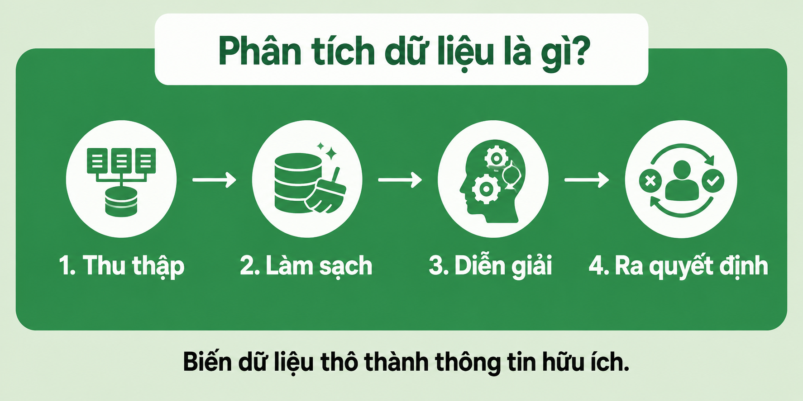
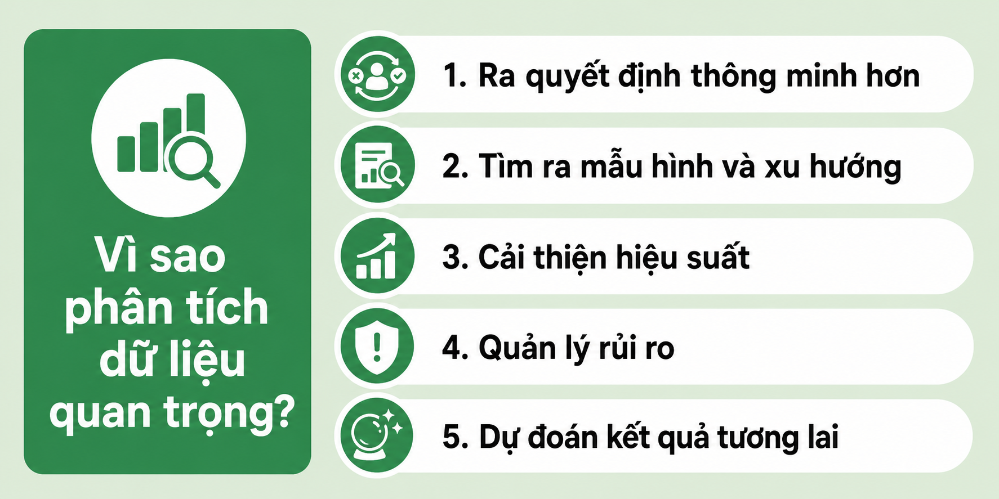
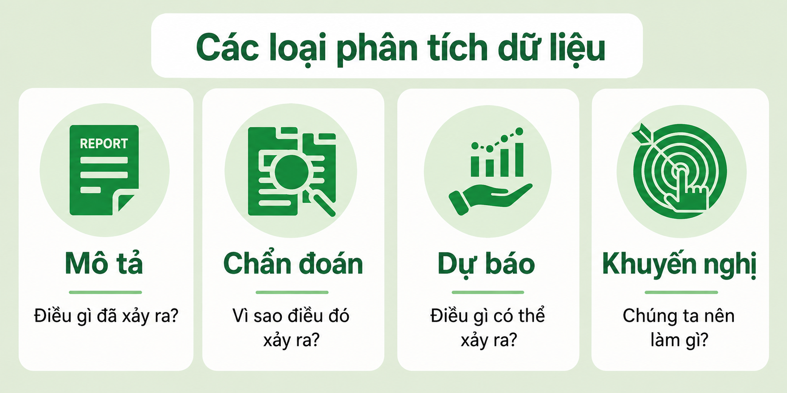

# Phân tích dữ liệu là gì?

**Cập nhật lần cuối:** 24 tháng 3 năm 2026

Phân tích dữ liệu là quá trình thu thập, làm sạch, chuyển đổi và diễn giải dữ liệu nhằm khám phá những thông tin hữu ích và hỗ trợ việc ra quyết định. Quá trình này giúp chuyển dữ liệu thô thành thông tin có ý nghĩa để giải quyết vấn đề, đánh giá hiệu quả hoạt động và đưa ra dự báo.

## Tầm quan trọng của phân tích dữ liệu

Phân tích dữ liệu có vai trò quan trọng vì giúp chuyển thông tin thô thành những hiểu biết có thể áp dụng vào thực tiễn.

- **Ra quyết định dựa trên dữ liệu:** Thông qua việc phân tích dữ liệu trong quá khứ và hiện tại, các tổ chức có thể đưa ra quyết định chính xác hơn dựa trên bằng chứng thay vì cảm tính hoặc giả định.
- **Hỗ trợ kinh doanh thông minh:** Phân tích dữ liệu giúp doanh nghiệp hiểu rõ sở thích của khách hàng, xu hướng thị trường và những khía cạnh cần cải thiện, từ đó nâng cao năng lực cạnh tranh.
- **Đánh giá hiệu quả:** Quá trình phân tích giúp đo lường mức độ hiệu quả của các quy trình, sản phẩm hoặc chiến lược, đồng thời xác định những lĩnh vực cần được cải thiện.
- **Quản trị rủi ro:** Phân tích dữ liệu hỗ trợ việc phát hiện, dự báo và giảm thiểu các rủi ro tiềm ẩn trước khi chúng trở thành những vấn đề nghiêm trọng.

## Quy trình phân tích dữ liệu

Quy trình phân tích dữ liệu gồm một số bước chính nhằm chuyển đổi dữ liệu thô thành những hiểu biết có giá trị.

### 1. Xác định mục tiêu

Đặt ra các mục tiêu rõ ràng và xác định những câu hỏi chính mà quá trình phân tích cần trả lời.

### 2. Thu thập dữ liệu

Thu thập dữ liệu định tính hoặc định lượng có liên quan và đáng tin cậy. Dữ liệu cần có mức độ đầy đủ, chính xác và được tổ chức hợp lý.

### 3. Làm sạch và tiền xử lý dữ liệu

Chuẩn bị dữ liệu cho quá trình phân tích bằng cách sửa lỗi, xử lý giá trị thiếu, loại bỏ dữ liệu trùng lặp và xử lý các giá trị ngoại lệ.

### 4. Phân tích dữ liệu khám phá

Sử dụng thống kê mô tả và các kỹ thuật trực quan hóa để nhận diện mẫu hình, xu hướng, mối quan hệ và các điểm bất thường trong dữ liệu.

### 5. Phân tích thống kê

Áp dụng các phương pháp thống kê hoặc mô hình phân tích để kiểm định giả thuyết, xác định mối quan hệ và đưa ra dự báo.

### 6. Trực quan hóa và truyền đạt kết quả

Trình bày kết quả thông qua biểu đồ, bảng điều khiển, báo cáo hoặc bài thuyết trình để các bên liên quan có thể hiểu và sử dụng kết quả trong quá trình ra quyết định.

> Để tìm hiểu thêm, tham khảo nội dung **Các bước trong quy trình phân tích dữ liệu**.

## Các loại phân tích dữ liệu

Phân tích dữ liệu thường được chia thành bốn loại chính, tùy theo câu hỏi cần giải quyết và mục đích của quá trình phân tích.

### Phân tích mô tả

Phân tích mô tả tóm tắt dữ liệu lịch sử nhằm giải thích điều gì đã xảy ra. Loại phân tích này thường sử dụng báo cáo, biểu đồ, bảng điều khiển, thống kê mô tả và các chỉ số đánh giá hiệu quả.

### Phân tích chẩn đoán

Phân tích chẩn đoán xem xét dữ liệu ở mức độ sâu hơn để xác định tại sao một sự kiện hoặc kết quả đã xảy ra. Nó giúp nhận diện các nguyên nhân có thể có, mối tương quan và những yếu tố góp phần tạo nên các mẫu hình quan sát được.

### Phân tích dự báo

Phân tích dự báo sử dụng dữ liệu lịch sử, mô hình thống kê và các phương pháp học máy để ước lượng những gì có khả năng xảy ra trong tương lai. Loại phân tích này hỗ trợ việc lập kế hoạch bằng cách dự báo xu hướng, rủi ro và cơ hội.

### Phân tích đề xuất

Phân tích đề xuất phát triển từ kết quả dự báo để khuyến nghị những hành động nên được thực hiện. Nó hỗ trợ ra quyết định bằng cách xác định các chiến lược hoặc giải pháp có khả năng tạo ra kết quả tốt nhất.

## Các công cụ phân tích dữ liệu

Có nhiều công cụ được sử dụng trong phân tích dữ liệu, từ phần mềm bảng tính đến ngôn ngữ lập trình và các nền tảng kinh doanh thông minh.

| Công cụ | Công dụng chính |
|---|---|
| **Microsoft Excel** | Thực hiện các phép tính đơn giản, bảng tổng hợp, tóm tắt dữ liệu và biểu đồ cơ bản |
| **SAS** | Phân tích nâng cao, mô hình thống kê và phân tích dự báo |
| **R** | Phân tích thống kê, xây dựng mô hình dữ liệu và trực quan hóa |
| **Python** | Xử lý, phân tích, trực quan hóa dữ liệu và học máy với các thư viện như Pandas, NumPy và Matplotlib |
| **Tableau** | Xây dựng bảng điều khiển tương tác và trực quan hóa dữ liệu nâng cao |
| **Power BI** | Tạo báo cáo và bảng điều khiển kinh doanh thông minh, đặc biệt trong hệ sinh thái Microsoft |
| **KNIME** | Xây dựng quy trình mã nguồn mở cho khai phá dữ liệu, xử lý dữ liệu và học máy |

## Ứng dụng của phân tích dữ liệu

### Kinh doanh thông minh

Phân tích dữ liệu được sử dụng để theo dõi doanh số, hành vi khách hàng, hiệu quả vận hành và hỗ trợ xây dựng chiến lược của tổ chức.

### Y tế

Phân tích dữ liệu giúp theo dõi kết quả điều trị, đánh giá hiệu quả của phương pháp chữa bệnh, cải thiện hoạt động y tế và hỗ trợ nghiên cứu y học.

### Tài chính

Trong lĩnh vực tài chính, phân tích dữ liệu được sử dụng để phát hiện gian lận, đánh giá rủi ro tài chính, phân tích đầu tư, dự báo biến động thị trường và hỗ trợ lập ngân sách.

### Marketing

Phân tích dữ liệu giúp tổ chức hiểu sở thích của khách hàng, đánh giá hiệu quả chiến dịch, phân khúc thị trường và xây dựng các chiến lược marketing phù hợp với từng nhóm đối tượng.

### Nghiên cứu khoa học

Các nhà nghiên cứu sử dụng phân tích dữ liệu để diễn giải kết quả thực nghiệm, kiểm định giả thuyết, nhận diện mẫu hình và tạo ra tri thức mới.

## Hạn chế của phân tích dữ liệu

- **Vấn đề về chất lượng dữ liệu:** Dữ liệu không chính xác, không đầy đủ, lỗi thời hoặc thiếu nhất quán có thể dẫn đến các kết luận sai lệch.
- **Tốn thời gian và nguồn lực:** Việc thu thập, làm sạch, xử lý và diễn giải dữ liệu có thể đòi hỏi nhiều thời gian, chuyên môn và tài nguyên tính toán.
- **Nguy cơ thiên lệch:** Bộ dữ liệu thiên lệch, phương pháp không phù hợp hoặc các giả định sai có thể làm cho kết quả phân tích thiếu tin cậy.
- **Phụ thuộc quá mức vào công cụ:** Phần mềm phân tích có thể tạo ra kết quả sai hoặc gây hiểu nhầm nếu được sử dụng mà không có đầy đủ kiến thức về phương pháp.
- **Thiếu bối cảnh:** Dữ liệu định lượng có thể không phản ánh đầy đủ các yếu tố định tính, xã hội, hành vi hoặc con người.

## Kết luận

Phân tích dữ liệu cung cấp một phương pháp có hệ thống để chuyển dữ liệu thô thành tri thức hữu ích. Bằng cách xác định mục tiêu, thu thập và chuẩn bị dữ liệu, khám phá các mẫu hình, áp dụng phương pháp phân tích và truyền đạt kết quả, cá nhân và tổ chức có thể đưa ra các quyết định chính xác hơn dựa trên bằng chứng. Tuy nhiên, độ tin cậy của kết quả phân tích phụ thuộc lớn vào chất lượng dữ liệu, sự phù hợp của phương pháp và cách diễn giải kết quả.
