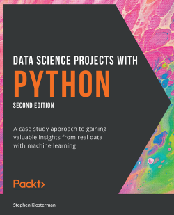
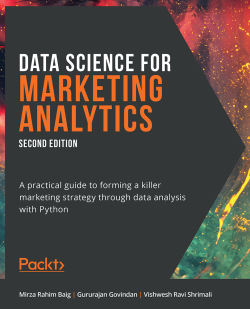
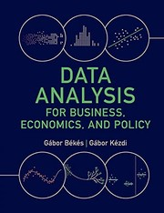
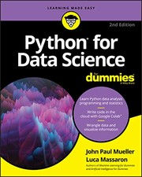

# DSAI1005 – Phân tích dữ liệu với Python 

🌐 **Ngôn ngữ / Language:** 🇻🇳 **Tiếng Việt** | [🇬🇧 English Version (syllabus-en.md)](syllabus-en.md)

## 1. Thông tin chung

| Nội dung | Thông tin |
|---|---|
| **Tên học phần** | Data Analysis with Python – Phân tích dữ liệu với Python |
| **Mã học phần** | DSAI1005 |
| **Chương trình đào tạo** | Data Science in Finance and E-commerce (EP15) |
| **Loại học phần** | Bắt buộc |
| **Số tín chỉ** | 3 tín chỉ |
| **Thời lượng** | 30 giờ lý thuyết, 15 giờ thực hành và 90 giờ tự học |
| **Học phần tiên quyết** | DSAI1003 |
| **Đơn vị phụ trách** | Khoa Khoa học dữ liệu và Trí tuệ nhân tạo, Phòng 1604, Nhà A1, Đại học Kinh tế Quốc dân |

## 2. Giảng viên

- **TS. Vũ Đức Minh** – `minhvd@neu.edu.vn`

## 3. Mô tả học phần

Học phần cung cấp kiến thức nhập môn có hệ thống về khoa học dữ liệu và phân tích dữ liệu bằng Python. Sinh viên được làm quen với môi trường và công cụ làm việc phổ biến như Anaconda, Python, IPython, JupyterLab và Jupyter Notebook.

Nội dung học phần bao gồm các kỹ năng cốt lõi trong quy trình phân tích dữ liệu: thao tác dữ liệu, tính toán thống kê, đại số tuyến tính, trực quan hóa, thu thập và lưu trữ dữ liệu, làm sạch dữ liệu, biến đổi đặc trưng và xây dựng mô hình dự báo. Thông qua bài tập thực hành và dự án, sinh viên sử dụng các thư viện NumPy, SciPy, Pandas, Matplotlib, Seaborn, Bokeh và scikit-learn để giải quyết các bài toán trong kinh doanh, kinh tế và các lĩnh vực liên quan.

Học phần cũng giới thiệu các chủ đề phân tích nâng cao ở mức cơ bản, gồm phân khúc dữ liệu, phân cụm, hồi quy tuyến tính và phi tuyến, phân loại nhị phân, phân loại đa lớp và đánh giá mô hình.

## 4. Mục tiêu học phần

Sau khi hoàn thành học phần, sinh viên có khả năng:

1. Nhận biết vai trò và phạm vi sử dụng của các thư viện phổ biến trong khoa học dữ liệu và phân tích dữ liệu.
2. Sử dụng NumPy và SciPy để thực hiện các phép tính thống kê, đại số tuyến tính và xử lý ma trận.
3. Trực quan hóa dữ liệu bằng Matplotlib, Seaborn và Bokeh.
4. Đọc, ghi, truy xuất và lưu trữ dữ liệu từ nhiều định dạng tệp và cơ sở dữ liệu bằng NumPy, Pandas, SQLite và PyMongo.
5. Làm sạch, thao tác, biến đổi và tổ chức lại dữ liệu phục vụ phân tích.
6. Áp dụng các kỹ thuật cơ bản về phân khúc, phân cụm, hồi quy và phân loại.
7. Phát triển năng lực tự học, làm việc độc lập, làm việc nhóm và chịu trách nhiệm đối với nhiệm vụ được giao.

## 5. Chuẩn đầu ra học phần

### 5.1. Công cụ và thư viện

- Mô tả được vai trò của các thư viện phổ biến trong khoa học dữ liệu.
- Cài đặt và thiết lập được các công cụ, thư viện cần thiết cho nhiệm vụ phân tích dữ liệu.

### 5.2. Tính toán thống kê và đại số tuyến tính

- Sử dụng NumPy và SciPy để thực hiện các phép tính thống kê.
- Thực hiện các phép toán đại số tuyến tính, ma trận và vector.

### 5.3. Trực quan hóa dữ liệu

- Hiểu mục đích và cách lựa chọn từng loại biểu đồ.
- Xây dựng trực quan hóa cơ bản bằng Matplotlib.
- Xây dựng trực quan hóa phức tạp bằng Seaborn.
- Xây dựng trực quan hóa tương tác bằng Bokeh.

### 5.4. Truy xuất và lưu trữ dữ liệu

- Đọc và ghi dữ liệu CSV bằng NumPy và Pandas.
- Làm việc với các định dạng Excel, JSON, HTML và PDF.
- Kết nối, đọc và ghi dữ liệu từ cơ sở dữ liệu quan hệ và NoSQL bằng SQLite và PyMongo.

### 5.5. Làm sạch và tiền xử lý dữ liệu

- Lọc dữ liệu và loại bỏ nhiễu.
- Xử lý giá trị thiếu và ngoại lệ.
- Thực hiện mã hóa, chuẩn hóa, biến đổi và chia tập dữ liệu.

### 5.6. Phân tích và xây dựng mô hình

- Thực hiện các nhiệm vụ phân khúc và phân cụm cơ bản.
- Xây dựng và đánh giá mô hình hồi quy.
- Xây dựng và đánh giá mô hình phân loại.

### 5.7. Kỹ năng tự chủ và trách nhiệm

- Phát triển khả năng tự học và làm việc độc lập.
- Có trách nhiệm cá nhân và trách nhiệm đối với công việc chung của nhóm.

## 6. Nội dung giảng dạy

| Tuần | Chủ đề | Nội dung chính |
|---:|---|---|
| 1 | **Giới thiệu học phần** | Giới thiệu đề cương; yêu cầu học tập; Anaconda, Python, IPython, JupyterLab và Jupyter Notebook. |
| 2–3 | **Thư viện tính toán thống kê và đại số tuyến tính** | Làm quen với NumPy và Pandas; các hàm thống kê; phép toán đại số tuyến tính và ma trận. |
| 4 | **Khám phá và trực quan hóa dữ liệu** | Trực quan hóa bằng Matplotlib; Seaborn; trực quan hóa tương tác bằng Bokeh. |
| 5 | **Truy xuất và lưu trữ dữ liệu** | Đọc và ghi nhiều định dạng tệp; làm việc với cơ sở dữ liệu MySQL và MongoDB. |
| 6 | **Làm sạch và tiền xử lý dữ liệu** | Lọc nhiễu; xử lý dữ liệu thiếu; xử lý ngoại lệ; mã hóa, làm sạch, biến đổi và chia đặc trưng. |
| 7 | **Thi giữa kỳ** | Ôn tập và đánh giá các nội dung từ tuần 1 đến tuần 6. |
| 8–9 | **Phân khúc và phân cụm dữ liệu** | Tiếp cận bài toán phân khúc; tiêu chí phân khúc; thuật toán phân cụm; đánh giá và lựa chọn phương pháp. |
| 10–11 | **Dự báo dữ liệu và hồi quy tuyến tính** | Mô hình tuyến tính; kỹ thuật đặc trưng cho hồi quy; diễn giải mô hình; đánh giá độ chính xác. |
| 12 | **Hồi quy phi tuyến** | Hồi quy logistic; xây dựng quy trình xử lý và mô hình hóa bằng pipeline. |
| 13 | **Phân loại nhị phân** | SVM, cây quyết định, rừng ngẫu nhiên; tiền xử lý dữ liệu; chỉ số đánh giá mô hình. |
| 14 | **Phân loại đa lớp** | Mô hình phân loại đa lớp; chiến lược phân loại; chỉ số đánh giá; xử lý dữ liệu mất cân bằng. |
| 15 | **Tổng kết và ôn tập** | Hệ thống hóa kiến thức, giải đáp câu hỏi và chuẩn bị đánh giá cuối kỳ. |

## 7. Phương pháp giảng dạy và học tập

Học phần kết hợp:

- Bài giảng lý thuyết và minh họa trực tiếp trên máy tính.
- Hỏi đáp và thảo luận trên lớp.
- Bài tập thực hành theo tuần.
- Kiểm tra bài tập và chữa bài.
- Bài tập cá nhân hoặc làm việc nhóm.
- Tự học theo giáo trình và tài liệu hướng dẫn.

Sinh viên sử dụng máy tính và các môi trường lập trình như Jupyter Notebook, JupyterLab hoặc Visual Studio Code để thực hành.

## 8. Đánh giá học phần

| Thành phần | Nội dung | Tỷ trọng |
|---|---|---:|
| **Chuyên cần/Bài tập** | Lý thuyết, bài tập lập trình và thực hành hằng tuần | 10% |
| **Thi giữa kỳ** | Bài kiểm tra trên máy tính, bao quát chuẩn đầu ra từ 1.1 đến 5.5 | 40% |
| **Thi cuối kỳ / Dự án** | Bài tự luận hoặc dự án, bao quát chuẩn đầu ra từ 1.1 đến 6.3 | 50% |

Các tiêu chí đánh giá gồm mức độ nắm vững kiến thức, kỹ năng giải quyết vấn đề, tư duy phản biện, khả năng vận dụng kiến thức, chất lượng nội dung, tính sáng tạo, khả năng hợp tác, kỹ năng trình bày và quản lý thời gian.

## 9. Học liệu (References & Textbooks)

| Bìa sách | Tài liệu | Tác giả | Nhà xuất bản | ISBN | Liên kết |
|:---:|:---|:---|:---|:---:|:---:|
|  | **Python Data Analysis**, 3rd Edition | Avinash Navlani, Armando Fandango, Ivan Idris | Packt Publishing, 2021 | 9781800564480 | [Thông tin sách](https://www.packtpub.com/product/python-data-analysis-third-edition/9781800564480) |
|  | **Python Data Analysis**, 1st Edition | Ivan Idris | Packt Publishing, 2014 | 9781783552030 | [Thông tin sách](https://www.packtpub.com/product/python-data-analysis/9781783552030) |
|  | **Data Science for Marketing Analytics**, 2nd Edition | Mirza Rahim Baig, Gururajan Govindan, Vishwesh Ravi Shrimali | Packt Publishing, 2021 | 9781800560475 | [Thông tin sách](https://www.packtpub.com/product/data-science-for-marketing-analytics-second-edition/9781800560475) |
|  | **Data Analysis for Business, Economics and Policy** | Gábor Békés, Gábor Kézdi | Cambridge University Press, 2021 | 9781108716208 | [Thông tin sách](https://www.cambridge.org/highereducation/books/data-analysis-for-business-economics-and-policy/B80C65A15ACD4FF5FA0B0FD7A73F1C46) |
|  | **Python for Data Science For Dummies**, 2nd Edition | John Paul Mueller, Luca Massaron | John Wiley & Sons, 2019 | 9781119547624 | [Thông tin sách](https://www.wiley.com/en-us/Python+for+Data+Science+For+Dummies%2C+2nd+Edition-p-9781119547624) |

## 10. Quy định học tập

- Tham dự tối thiểu 80% tổng số buổi học.
- Điểm tham gia học tập phải đạt tối thiểu 5,0.
- Chủ động phát biểu, thảo luận và đóng góp vào bài học.
- Đọc tài liệu và hoàn thành bài tập được giao.
- Không gây ảnh hưởng đến hoạt động học tập của người khác.
- Không ăn uống hoặc sử dụng điện thoại trong giờ học.
- Máy tính xách tay và máy tính bảng chỉ được sử dụng phục vụ thực hành và tính toán.

---

*Nội dung được biên soạn dựa trên đề cương học phần DSAI1005 ban hành kèm Quyết định số 975/QĐ-ĐHKTQD ngày 30/03/2024 của Hiệu trưởng Trường Đại học Kinh tế Quốc dân.*
